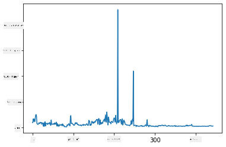
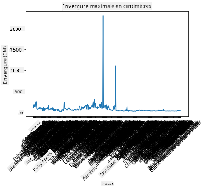
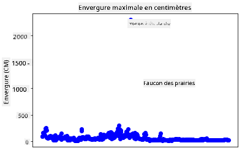
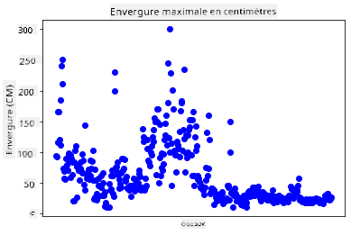
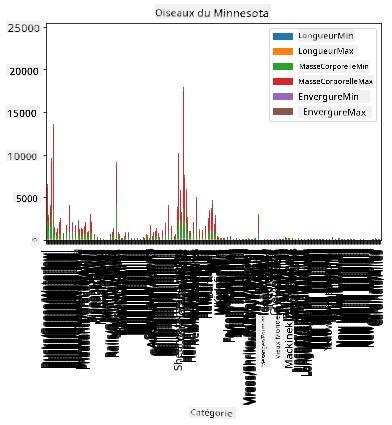
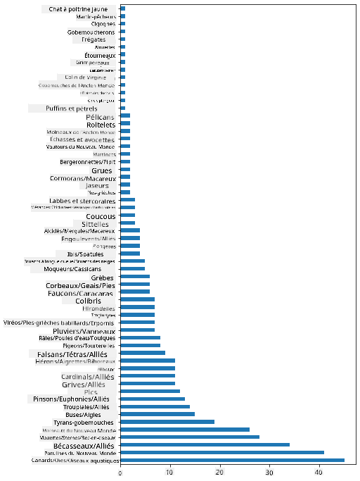
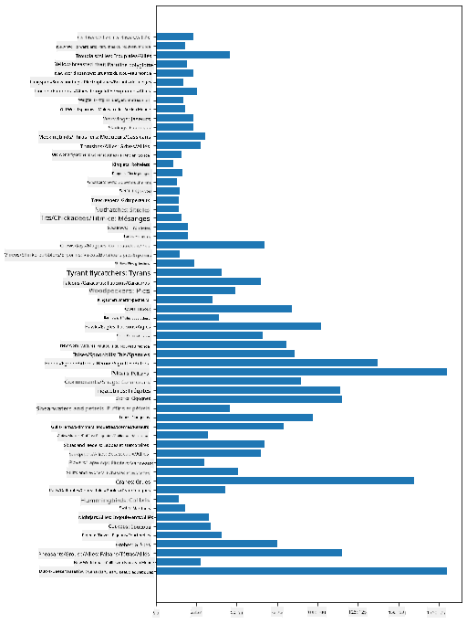
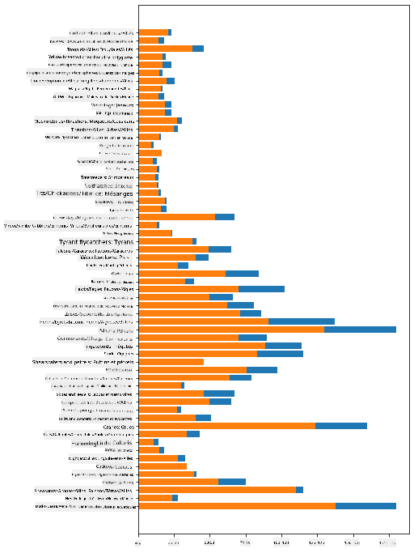

<!--
CO_OP_TRANSLATOR_METADATA:
{
  "original_hash": "69b32b6789a91f796ebc7a02f5575e03",
  "translation_date": "2025-09-04T13:03:09+00:00",
  "source_file": "3-Data-Visualization/09-visualization-quantities/README.md",
  "language_code": "fr"
}
-->
# Visualiser des quantités

| ](../../sketchnotes/09-Visualizing-Quantities.png)|
|:---:|
| Visualiser des quantités - _Sketchnote par [@nitya](https://twitter.com/nitya)_ |

Dans cette leçon, vous allez explorer comment utiliser l'une des nombreuses bibliothèques Python disponibles pour apprendre à créer des visualisations intéressantes autour du concept de quantité. En utilisant un ensemble de données nettoyé sur les oiseaux du Minnesota, vous pouvez découvrir de nombreux faits intéressants sur la faune locale.  
## [Quiz avant la leçon](https://purple-hill-04aebfb03.1.azurestaticapps.net/quiz/16)

## Observer l'envergure des ailes avec Matplotlib

Une bibliothèque excellente pour créer des graphiques simples ou sophistiqués de divers types est [Matplotlib](https://matplotlib.org/stable/index.html). En termes généraux, le processus de création de graphiques avec ces bibliothèques inclut l'identification des parties de votre dataframe que vous souhaitez cibler, la réalisation des transformations nécessaires sur ces données, l'attribution des valeurs des axes x et y, la décision du type de graphique à afficher, puis l'affichage du graphique. Matplotlib offre une grande variété de visualisations, mais pour cette leçon, concentrons-nous sur celles les plus adaptées à la visualisation de quantités : les graphiques en ligne, les nuages de points et les diagrammes en barres.

> ✅ Utilisez le graphique le mieux adapté à la structure de vos données et à l'histoire que vous souhaitez raconter.  
> - Pour analyser les tendances au fil du temps : ligne  
> - Pour comparer des valeurs : barre, colonne, camembert, nuage de points  
> - Pour montrer comment les parties se rapportent à un tout : camembert  
> - Pour montrer la distribution des données : nuage de points, barre  
> - Pour montrer les tendances : ligne, colonne  
> - Pour montrer les relations entre les valeurs : ligne, nuage de points, bulle  

Si vous avez un ensemble de données et que vous devez découvrir combien d'un élément donné est inclus, l'une des premières tâches sera d'inspecter ses valeurs.  

✅ Il existe d'excellents 'cheat sheets' disponibles pour Matplotlib [ici](https://matplotlib.org/cheatsheets/cheatsheets.pdf).

## Construire un graphique en ligne sur les valeurs d'envergure des ailes des oiseaux

Ouvrez le fichier `notebook.ipynb` à la racine de ce dossier de leçon et ajoutez une cellule.

> Note : les données sont stockées à la racine de ce dépôt dans le dossier `/data`.

```python
import pandas as pd
import matplotlib.pyplot as plt
birds = pd.read_csv('../../data/birds.csv')
birds.head()
```  
Ces données sont un mélange de texte et de chiffres :

|      | Nom                          | NomScientifique        | Catégorie             | Ordre        | Famille  | Genre       | StatutConservation | LongueurMin | LongueurMax | MasseMin | MasseMax | EnvergureMin | EnvergureMax |
| ---: | :--------------------------- | :--------------------- | :-------------------- | :----------- | :------- | :---------- | :----------------- | --------: | --------: | ----------: | ----------: | ----------: | ----------: |
|    0 | Dendrocygne à ventre noir    | Dendrocygna autumnalis | Canards/Oies/Oiseaux aquatiques | Anseriformes | Anatidae | Dendrocygna | LC                 |        47 |        56 |         652 |        1020 |          76 |          94 |
|    1 | Dendrocygne fauve            | Dendrocygna bicolor    | Canards/Oies/Oiseaux aquatiques | Anseriformes | Anatidae | Dendrocygna | LC                 |        45 |        53 |         712 |        1050 |          85 |          93 |
|    2 | Oie des neiges               | Anser caerulescens     | Canards/Oies/Oiseaux aquatiques | Anseriformes | Anatidae | Anser       | LC                 |        64 |        79 |        2050 |        4050 |         135 |         165 |
|    3 | Oie de Ross                  | Anser rossii           | Canards/Oies/Oiseaux aquatiques | Anseriformes | Anatidae | Anser       | LC                 |      57.3 |        64 |        1066 |        1567 |         113 |         116 |
|    4 | Oie rieuse                   | Anser albifrons        | Canards/Oies/Oiseaux aquatiques | Anseriformes | Anatidae | Anser       | LC                 |        64 |        81 |        1930 |        3310 |         130 |         165 |

Commençons par tracer certaines des données numériques en utilisant un graphique en ligne basique. Supposons que vous vouliez une vue de l'envergure maximale pour ces oiseaux intéressants.

```python
wingspan = birds['MaxWingspan'] 
wingspan.plot()
```  


Que remarquez-vous immédiatement ? Il semble y avoir au moins un cas aberrant - quelle envergure impressionnante ! Une envergure de 2300 centimètres équivaut à 23 mètres - y a-t-il des ptérodactyles qui rôdent dans le Minnesota ? Investigons.

Bien que vous puissiez effectuer un tri rapide dans Excel pour trouver ces cas aberrants, qui sont probablement des erreurs de frappe, continuez le processus de visualisation en travaillant directement depuis le graphique.

Ajoutez des étiquettes à l'axe x pour montrer de quels types d'oiseaux il s'agit :

```
plt.title('Max Wingspan in Centimeters')
plt.ylabel('Wingspan (CM)')
plt.xlabel('Birds')
plt.xticks(rotation=45)
x = birds['Name'] 
y = birds['MaxWingspan']

plt.plot(x, y)

plt.show()
```  


Même avec la rotation des étiquettes réglée à 45 degrés, il y en a trop pour être lisibles. Essayons une stratégie différente : étiqueter uniquement ces cas aberrants et placer les étiquettes dans le graphique. Vous pouvez utiliser un nuage de points pour faire plus de place aux étiquettes :

```python
plt.title('Max Wingspan in Centimeters')
plt.ylabel('Wingspan (CM)')
plt.tick_params(axis='both',which='both',labelbottom=False,bottom=False)

for i in range(len(birds)):
    x = birds['Name'][i]
    y = birds['MaxWingspan'][i]
    plt.plot(x, y, 'bo')
    if birds['MaxWingspan'][i] > 500:
        plt.text(x, y * (1 - 0.05), birds['Name'][i], fontsize=12)
    
plt.show()
```  
Que se passe-t-il ici ? Vous avez utilisé `tick_params` pour masquer les étiquettes du bas, puis créé une boucle sur votre ensemble de données d'oiseaux. En traçant le graphique avec de petits points bleus ronds en utilisant `bo`, vous avez vérifié si un oiseau avait une envergure maximale supérieure à 500 et affiché son étiquette à côté du point si c'était le cas. Vous avez légèrement décalé les étiquettes sur l'axe y (`y * (1 - 0.05)`) et utilisé le nom de l'oiseau comme étiquette.

Qu'avez-vous découvert ?

  
## Filtrer vos données

Le pygargue à tête blanche et le faucon des prairies, bien qu'ils soient probablement de très grands oiseaux, semblent être mal étiquetés, avec un `0` supplémentaire ajouté à leur envergure maximale. Il est peu probable que vous rencontriez un pygargue à tête blanche avec une envergure de 25 mètres, mais si c'est le cas, faites-le nous savoir ! Créons un nouveau dataframe sans ces deux cas aberrants :

```python
plt.title('Max Wingspan in Centimeters')
plt.ylabel('Wingspan (CM)')
plt.xlabel('Birds')
plt.tick_params(axis='both',which='both',labelbottom=False,bottom=False)
for i in range(len(birds)):
    x = birds['Name'][i]
    y = birds['MaxWingspan'][i]
    if birds['Name'][i] not in ['Bald eagle', 'Prairie falcon']:
        plt.plot(x, y, 'bo')
plt.show()
```  

En filtrant les cas aberrants, vos données sont maintenant plus cohérentes et compréhensibles.



Maintenant que nous avons un ensemble de données plus propre, du moins en termes d'envergure, découvrons-en davantage sur ces oiseaux.

Bien que les graphiques en ligne et les nuages de points puissent afficher des informations sur les valeurs des données et leur distribution, nous voulons réfléchir aux valeurs inhérentes à cet ensemble de données. Vous pourriez créer des visualisations pour répondre aux questions suivantes sur les quantités :

> Combien de catégories d'oiseaux y a-t-il, et quels sont leurs nombres ?  
> Combien d'oiseaux sont éteints, en danger, rares ou communs ?  
> Combien y a-t-il des différents genres et ordres dans la terminologie de Linné ?  
## Explorer les diagrammes en barres

Les diagrammes en barres sont pratiques lorsque vous devez montrer des regroupements de données. Explorons les catégories d'oiseaux présentes dans cet ensemble de données pour voir laquelle est la plus commune en nombre.

Dans le fichier notebook, créez un diagramme en barres basique.

✅ Notez que vous pouvez soit filtrer les deux oiseaux aberrants identifiés dans la section précédente, soit corriger l'erreur dans leur envergure, soit les laisser pour ces exercices qui ne dépendent pas des valeurs d'envergure.

Si vous souhaitez créer un diagramme en barres, vous pouvez sélectionner les données sur lesquelles vous voulez vous concentrer. Les diagrammes en barres peuvent être créés à partir de données brutes :

```python
birds.plot(x='Category',
        kind='bar',
        stacked=True,
        title='Birds of Minnesota')

```  


Ce diagramme en barres, cependant, est illisible car il y a trop de données non regroupées. Vous devez sélectionner uniquement les données que vous souhaitez représenter, alors regardons la longueur des oiseaux en fonction de leur catégorie.

Filtrez vos données pour inclure uniquement la catégorie des oiseaux.

✅ Remarquez que vous utilisez Pandas pour gérer les données, puis laissez Matplotlib faire le graphique.

Étant donné qu'il y a de nombreuses catégories, vous pouvez afficher ce graphique verticalement et ajuster sa hauteur pour tenir compte de toutes les données :

```python
category_count = birds.value_counts(birds['Category'].values, sort=True)
plt.rcParams['figure.figsize'] = [6, 12]
category_count.plot.barh()
```  


Ce diagramme en barres montre une bonne vue du nombre d'oiseaux dans chaque catégorie. En un clin d'œil, vous voyez que le plus grand nombre d'oiseaux dans cette région appartient à la catégorie des Canards/Oies/Oiseaux aquatiques. Le Minnesota est le 'pays des 10 000 lacs', donc ce n'est pas surprenant !

✅ Essayez d'autres comptages sur cet ensemble de données. Y a-t-il quelque chose qui vous surprend ?

## Comparer les données

Vous pouvez essayer différentes comparaisons de données regroupées en créant de nouveaux axes. Essayez une comparaison de la LongueurMax d'un oiseau, basée sur sa catégorie :

```python
maxlength = birds['MaxLength']
plt.barh(y=birds['Category'], width=maxlength)
plt.rcParams['figure.figsize'] = [6, 12]
plt.show()
```  


Rien de surprenant ici : les colibris ont la LongueurMax la plus faible par rapport aux pélicans ou aux oies. C'est bien lorsque les données ont du sens logiquement !

Vous pouvez créer des visualisations plus intéressantes de diagrammes en barres en superposant des données. Superposons la LongueurMin et la LongueurMax sur une catégorie d'oiseaux donnée :

```python
minLength = birds['MinLength']
maxLength = birds['MaxLength']
category = birds['Category']

plt.barh(category, maxLength)
plt.barh(category, minLength)

plt.show()
```  
Dans ce graphique, vous pouvez voir la plage par catégorie d'oiseaux de la LongueurMin et de la LongueurMax. Vous pouvez affirmer en toute sécurité que, selon ces données, plus l'oiseau est grand, plus sa plage de longueur est large. Fascinant !



## 🚀 Défi

Cet ensemble de données sur les oiseaux offre une mine d'informations sur différents types d'oiseaux dans un écosystème particulier. Cherchez sur Internet et voyez si vous pouvez trouver d'autres ensembles de données sur les oiseaux. Entraînez-vous à créer des graphiques et des diagrammes autour de ces oiseaux pour découvrir des faits que vous ne connaissiez pas.

## [Quiz après la leçon](https://ff-quizzes.netlify.app/en/ds/)

## Révision et auto-apprentissage

Cette première leçon vous a donné des informations sur la façon d'utiliser Matplotlib pour visualiser des quantités. Faites des recherches sur d'autres façons de travailler avec des ensembles de données pour la visualisation. [Plotly](https://github.com/plotly/plotly.py) est une bibliothèque que nous ne couvrirons pas dans ces leçons, alors jetez un œil à ce qu'elle peut offrir.  
## Devoir

[Graphiques en lignes, nuages de points et barres](assignment.md)

---

**Avertissement** :  
Ce document a été traduit à l'aide du service de traduction automatique [Co-op Translator](https://github.com/Azure/co-op-translator). Bien que nous nous efforcions d'assurer l'exactitude, veuillez noter que les traductions automatisées peuvent contenir des erreurs ou des inexactitudes. Le document original dans sa langue d'origine doit être considéré comme la source faisant autorité. Pour des informations critiques, il est recommandé de faire appel à une traduction humaine professionnelle. Nous déclinons toute responsabilité en cas de malentendus ou d'interprétations erronées résultant de l'utilisation de cette traduction.