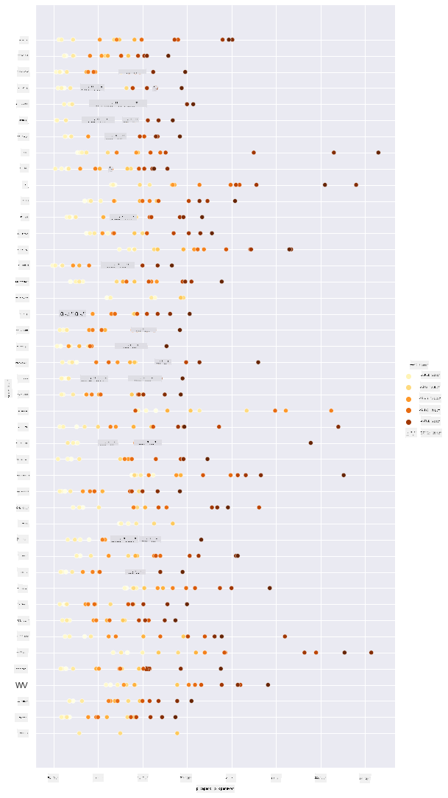
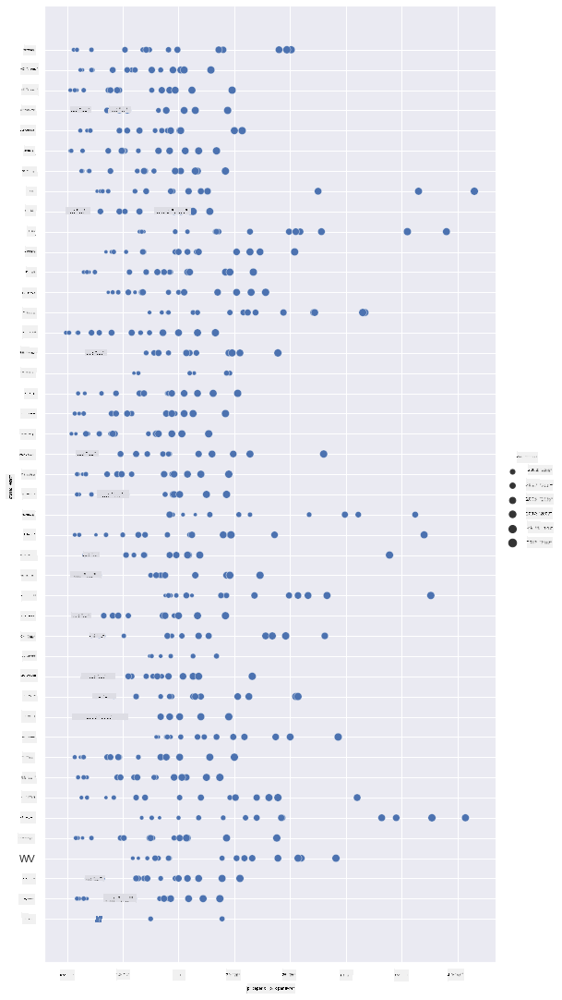
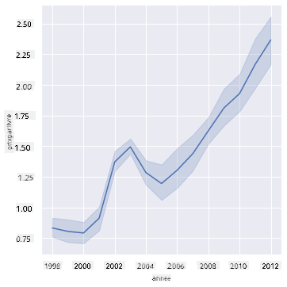
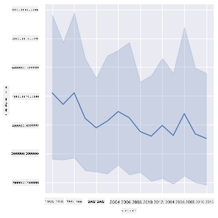
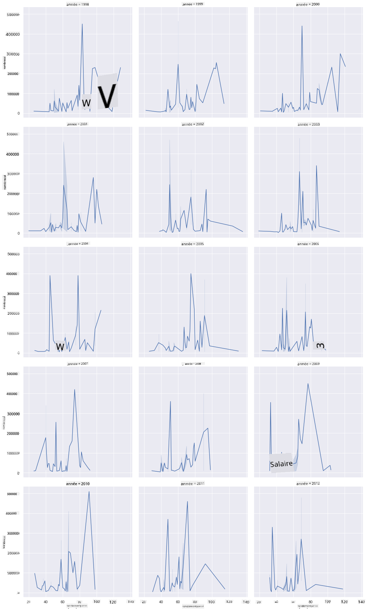
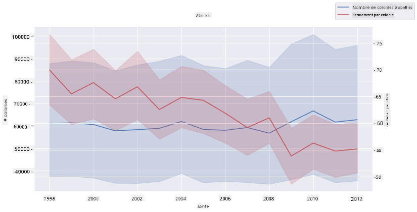

<!--
CO_OP_TRANSLATOR_METADATA:
{
  "original_hash": "0764fd4077f3f04a1d968ec371227744",
  "translation_date": "2025-09-06T11:25:35+00:00",
  "source_file": "3-Data-Visualization/12-visualization-relationships/README.md",
  "language_code": "fr"
}
-->
# Visualiser les relations : Tout sur le miel 🍯

| ](../../sketchnotes/12-Visualizing-Relationships.png)|
|:---:|
|Visualiser les relations - _Sketchnote par [@nitya](https://twitter.com/nitya)_ |

En poursuivant notre recherche axée sur la nature, découvrons des visualisations intéressantes pour montrer les relations entre différents types de miel, selon un ensemble de données provenant du [Département de l'Agriculture des États-Unis](https://www.nass.usda.gov/About_NASS/index.php).

Cet ensemble de données, composé d'environ 600 éléments, montre la production de miel dans de nombreux États américains. Par exemple, vous pouvez examiner le nombre de colonies, le rendement par colonie, la production totale, les stocks, le prix par livre et la valeur du miel produit dans un État donné de 1998 à 2012, avec une ligne par année pour chaque État.

Il serait intéressant de visualiser la relation entre la production annuelle d'un État donné et, par exemple, le prix du miel dans cet État. Alternativement, vous pourriez visualiser la relation entre le rendement par colonie des différents États. Cette période couvre le dévastateur "CCD" ou "Colony Collapse Disorder" observé pour la première fois en 2006 (http://npic.orst.edu/envir/ccd.html), ce qui en fait un ensemble de données poignant à étudier. 🐝

## [Quiz avant le cours](https://ff-quizzes.netlify.app/en/ds/quiz/22)

Dans cette leçon, vous pouvez utiliser Seaborn, que vous avez déjà utilisé, comme une excellente bibliothèque pour visualiser les relations entre les variables. Particulièrement intéressant est l'utilisation de la fonction `relplot` de Seaborn qui permet de créer des diagrammes de dispersion et des graphiques linéaires pour visualiser rapidement les '[relations statistiques](https://seaborn.pydata.org/tutorial/relational.html?highlight=relationships)', ce qui permet au data scientist de mieux comprendre comment les variables interagissent entre elles.

## Diagrammes de dispersion

Utilisez un diagramme de dispersion pour montrer comment le prix du miel a évolué, année après année, par État. Seaborn, grâce à `relplot`, regroupe commodément les données des États et affiche des points de données pour les données catégorielles et numériques.

Commençons par importer les données et Seaborn :

```python
import pandas as pd
import matplotlib.pyplot as plt
import seaborn as sns
honey = pd.read_csv('../../data/honey.csv')
honey.head()
```
Vous remarquez que les données sur le miel contiennent plusieurs colonnes intéressantes, notamment l'année et le prix par livre. Explorons ces données, regroupées par État américain :

| état  | numcol | rendementparcol | prodtotal | stocks   | prixparlb | valeurprod | année |
| ----- | ------ | --------------- | --------- | -------- | --------- | ---------- | ----- |
| AL    | 16000  | 71              | 1136000   | 159000   | 0.72      | 818000     | 1998  |
| AZ    | 55000  | 60              | 3300000   | 1485000  | 0.64      | 2112000    | 1998  |
| AR    | 53000  | 65              | 3445000   | 1688000  | 0.59      | 2033000    | 1998  |
| CA    | 450000 | 83              | 37350000  | 12326000 | 0.62      | 23157000   | 1998  |
| CO    | 27000  | 72              | 1944000   | 1594000  | 0.7       | 1361000    | 1998  |

Créez un diagramme de dispersion basique pour montrer la relation entre le prix par livre de miel et son État d'origine aux États-Unis. Faites en sorte que l'axe `y` soit suffisamment grand pour afficher tous les États :

```python
sns.relplot(x="priceperlb", y="state", data=honey, height=15, aspect=.5);
```


Maintenant, affichez les mêmes données avec un schéma de couleurs miel pour montrer comment le prix évolue au fil des années. Vous pouvez le faire en ajoutant un paramètre 'hue' pour montrer le changement, année après année :

> ✅ En savoir plus sur les [palettes de couleurs que vous pouvez utiliser dans Seaborn](https://seaborn.pydata.org/tutorial/color_palettes.html) - essayez un magnifique schéma de couleurs arc-en-ciel !

```python
sns.relplot(x="priceperlb", y="state", hue="year", palette="YlOrBr", data=honey, height=15, aspect=.5);
```


Avec ce changement de schéma de couleurs, vous pouvez voir qu'il y a évidemment une forte progression au fil des années en termes de prix du miel par livre. En effet, si vous examinez un échantillon de données pour vérifier (choisissez un État donné, l'Arizona par exemple), vous pouvez voir un schéma d'augmentation des prix année après année, avec quelques exceptions :

| état  | numcol | rendementparcol | prodtotal | stocks  | prixparlb | valeurprod | année |
| ----- | ------ | --------------- | --------- | ------- | --------- | ---------- | ----- |
| AZ    | 55000  | 60              | 3300000   | 1485000 | 0.64      | 2112000    | 1998  |
| AZ    | 52000  | 62              | 3224000   | 1548000 | 0.62      | 1999000    | 1999  |
| AZ    | 40000  | 59              | 2360000   | 1322000 | 0.73      | 1723000    | 2000  |
| AZ    | 43000  | 59              | 2537000   | 1142000 | 0.72      | 1827000    | 2001  |
| AZ    | 38000  | 63              | 2394000   | 1197000 | 1.08      | 2586000    | 2002  |
| AZ    | 35000  | 72              | 2520000   | 983000  | 1.34      | 3377000    | 2003  |
| AZ    | 32000  | 55              | 1760000   | 774000  | 1.11      | 1954000    | 2004  |
| AZ    | 36000  | 50              | 1800000   | 720000  | 1.04      | 1872000    | 2005  |
| AZ    | 30000  | 65              | 1950000   | 839000  | 0.91      | 1775000    | 2006  |
| AZ    | 30000  | 64              | 1920000   | 902000  | 1.26      | 2419000    | 2007  |
| AZ    | 25000  | 64              | 1600000   | 336000  | 1.26      | 2016000    | 2008  |
| AZ    | 20000  | 52              | 1040000   | 562000  | 1.45      | 1508000    | 2009  |
| AZ    | 24000  | 77              | 1848000   | 665000  | 1.52      | 2809000    | 2010  |
| AZ    | 23000  | 53              | 1219000   | 427000  | 1.55      | 1889000    | 2011  |
| AZ    | 22000  | 46              | 1012000   | 253000  | 1.79      | 1811000    | 2012  |

Une autre façon de visualiser cette progression est d'utiliser la taille plutôt que la couleur. Pour les utilisateurs daltoniens, cela pourrait être une meilleure option. Modifiez votre visualisation pour montrer une augmentation du prix par une augmentation de la circonférence des points :

```python
sns.relplot(x="priceperlb", y="state", size="year", data=honey, height=15, aspect=.5);
```
Vous pouvez voir la taille des points augmenter progressivement.



Est-ce un simple cas d'offre et de demande ? En raison de facteurs tels que le changement climatique et l'effondrement des colonies, y a-t-il moins de miel disponible à l'achat année après année, ce qui entraîne une augmentation des prix ?

Pour découvrir une corrélation entre certaines des variables de cet ensemble de données, explorons quelques graphiques linéaires.

## Graphiques linéaires

Question : Y a-t-il une augmentation claire du prix du miel par livre année après année ? Vous pouvez le découvrir facilement en créant un graphique linéaire unique :

```python
sns.relplot(x="year", y="priceperlb", kind="line", data=honey);
```
Réponse : Oui, avec quelques exceptions autour de l'année 2003 :



✅ Parce que Seaborn agrège les données autour d'une seule ligne, il affiche "les multiples mesures à chaque valeur x en traçant la moyenne et l'intervalle de confiance à 95 % autour de la moyenne". [Source](https://seaborn.pydata.org/tutorial/relational.html). Ce comportement chronophage peut être désactivé en ajoutant `ci=None`.

Question : Eh bien, en 2003, pouvons-nous également voir un pic dans l'approvisionnement en miel ? Que se passe-t-il si vous examinez la production totale année après année ?

```python
sns.relplot(x="year", y="totalprod", kind="line", data=honey);
```



Réponse : Pas vraiment. Si vous examinez la production totale, il semble qu'elle ait en fait augmenté cette année-là, même si, de manière générale, la quantité de miel produite est en déclin au cours de ces années.

Question : Dans ce cas, qu'est-ce qui aurait pu provoquer ce pic du prix du miel autour de 2003 ?

Pour le découvrir, vous pouvez explorer une grille de facettes.

## Grilles de facettes

Les grilles de facettes prennent un aspect de votre ensemble de données (dans notre cas, vous pouvez choisir 'année' pour éviter de produire trop de facettes). Seaborn peut ensuite créer un graphique pour chacune de ces facettes de vos coordonnées x et y choisies pour une comparaison visuelle plus facile. L'année 2003 se démarque-t-elle dans ce type de comparaison ?

Créez une grille de facettes en continuant à utiliser `relplot` comme recommandé par la [documentation de Seaborn](https://seaborn.pydata.org/generated/seaborn.FacetGrid.html?highlight=facetgrid#seaborn.FacetGrid).

```python
sns.relplot(
    data=honey, 
    x="yieldpercol", y="numcol",
    col="year", 
    col_wrap=3,
    kind="line"
    )
```
Dans cette visualisation, vous pouvez comparer le rendement par colonie et le nombre de colonies année après année, côte à côte avec un wrap défini à 3 pour les colonnes :



Pour cet ensemble de données, rien ne se démarque particulièrement en ce qui concerne le nombre de colonies et leur rendement, année après année et État par État. Existe-t-il une autre façon de rechercher une corrélation entre ces deux variables ?

## Graphiques à double ligne

Essayez un graphique à lignes multiples en superposant deux graphiques linéaires l'un sur l'autre, en utilisant la fonction 'despine' de Seaborn pour supprimer leurs épines supérieure et droite, et en utilisant `ax.twinx` [dérivé de Matplotlib](https://matplotlib.org/stable/api/_as_gen/matplotlib.axes.Axes.twinx.html). Twinx permet à un graphique de partager l'axe x et d'afficher deux axes y. Affichez donc le rendement par colonie et le nombre de colonies, superposés :

```python
fig, ax = plt.subplots(figsize=(12,6))
lineplot = sns.lineplot(x=honey['year'], y=honey['numcol'], data=honey, 
                        label = 'Number of bee colonies', legend=False)
sns.despine()
plt.ylabel('# colonies')
plt.title('Honey Production Year over Year');

ax2 = ax.twinx()
lineplot2 = sns.lineplot(x=honey['year'], y=honey['yieldpercol'], ax=ax2, color="r", 
                         label ='Yield per colony', legend=False) 
sns.despine(right=False)
plt.ylabel('colony yield')
ax.figure.legend();
```


Bien que rien ne saute aux yeux autour de l'année 2003, cela nous permet de terminer cette leçon sur une note un peu plus joyeuse : bien qu'il y ait globalement un déclin du nombre de colonies, le nombre de colonies se stabilise même si leur rendement par colonie diminue.

Allez, les abeilles, allez !

🐝❤️
## 🚀 Défi

Dans cette leçon, vous avez appris un peu plus sur d'autres utilisations des diagrammes de dispersion et des grilles linéaires, y compris les grilles de facettes. Lancez-vous le défi de créer une grille de facettes en utilisant un ensemble de données différent, peut-être celui que vous avez utilisé avant ces leçons. Notez combien de temps elles prennent à créer et comment vous devez être prudent quant au nombre de grilles que vous devez dessiner en utilisant ces techniques.

## [Quiz après le cours](https://ff-quizzes.netlify.app/en/ds/quiz/23)

## Révision & Auto-apprentissage

Les graphiques linéaires peuvent être simples ou assez complexes. Faites un peu de lecture dans la [documentation de Seaborn](https://seaborn.pydata.org/generated/seaborn.lineplot.html) sur les différentes façons de les construire. Essayez d'améliorer les graphiques linéaires que vous avez créés dans cette leçon avec d'autres méthodes listées dans la documentation.

## Devoir

[Plongez dans la ruche](assignment.md)

---

**Avertissement** :  
Ce document a été traduit à l'aide du service de traduction automatique [Co-op Translator](https://github.com/Azure/co-op-translator). Bien que nous nous efforcions d'assurer l'exactitude, veuillez noter que les traductions automatisées peuvent contenir des erreurs ou des inexactitudes. Le document original dans sa langue d'origine doit être considéré comme la source faisant autorité. Pour des informations critiques, il est recommandé de recourir à une traduction professionnelle réalisée par un humain. Nous déclinons toute responsabilité en cas de malentendus ou d'interprétations erronées résultant de l'utilisation de cette traduction.