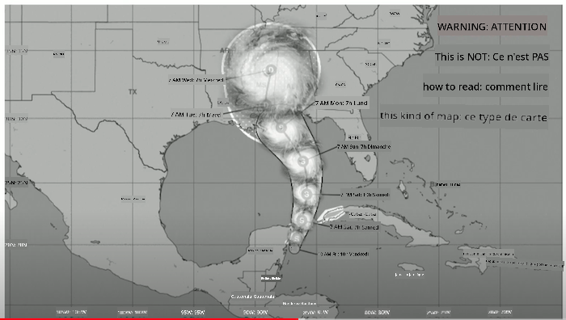
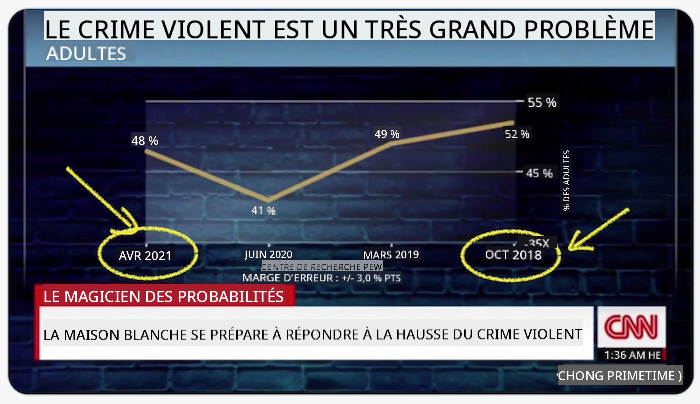
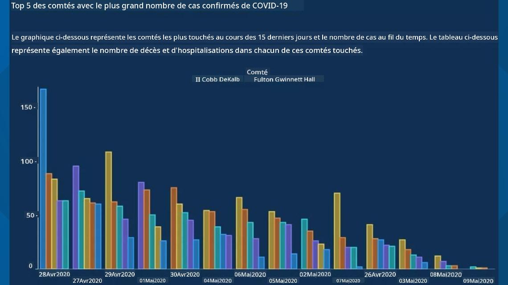
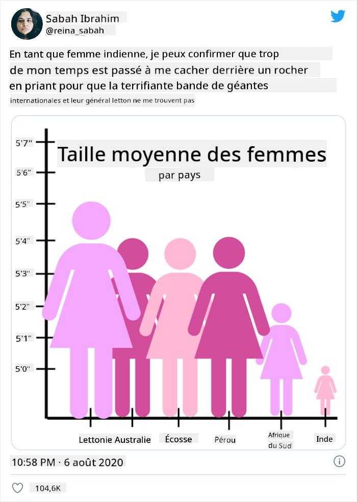
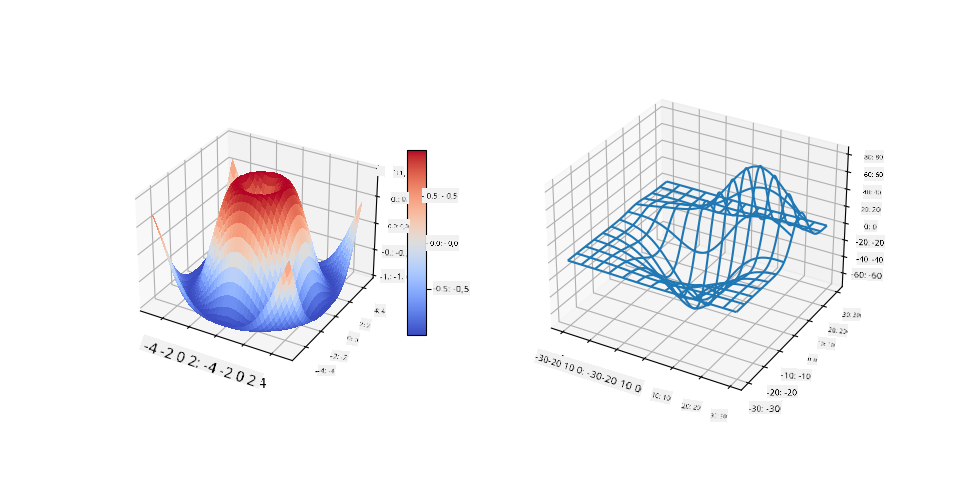
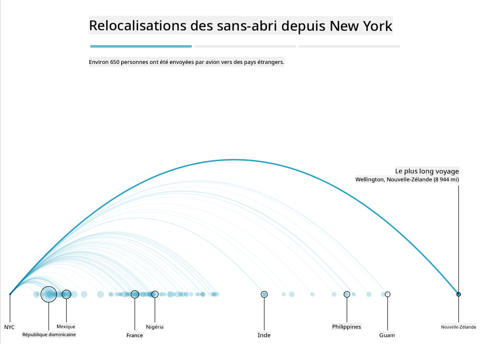
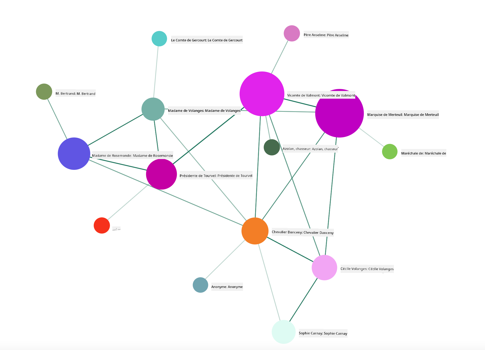

<!--
CO_OP_TRANSLATOR_METADATA:
{
  "original_hash": "0b380bb6d34102bb061eb41de23d9834",
  "translation_date": "2025-09-04T13:03:43+00:00",
  "source_file": "3-Data-Visualization/13-meaningful-visualizations/README.md",
  "language_code": "fr"
}
-->
# Créer des visualisations significatives

| ](../../sketchnotes/13-MeaningfulViz.png)|
|:---:|
| Visualisations significatives - _Sketchnote par [@nitya](https://twitter.com/nitya)_ |

> "Si vous torturez les données suffisamment longtemps, elles avoueront n'importe quoi" -- [Ronald Coase](https://en.wikiquote.org/wiki/Ronald_Coase)

Une des compétences fondamentales d'un data scientist est la capacité à créer une visualisation de données significative qui aide à répondre aux questions que vous pourriez avoir. Avant de visualiser vos données, vous devez vous assurer qu'elles ont été nettoyées et préparées, comme vous l'avez fait dans les leçons précédentes. Ensuite, vous pouvez commencer à décider de la meilleure façon de présenter les données.

Dans cette leçon, vous allez revoir :

1. Comment choisir le bon type de graphique
2. Comment éviter les graphiques trompeurs
3. Comment travailler avec les couleurs
4. Comment styliser vos graphiques pour une meilleure lisibilité
5. Comment créer des solutions de graphiques animés ou en 3D
6. Comment concevoir une visualisation créative

## [Quiz avant la leçon](https://purple-hill-04aebfb03.1.azurestaticapps.net/quiz/24)

## Choisir le bon type de graphique

Dans les leçons précédentes, vous avez expérimenté la création de divers types de visualisations de données intéressantes en utilisant Matplotlib et Seaborn. En général, vous pouvez sélectionner le [bon type de graphique](https://chartio.com/learn/charts/how-to-select-a-data-vizualization/) en fonction de la question que vous posez en utilisant ce tableau :

| Vous devez :               | Vous devriez utiliser :         |
| -------------------------- | ------------------------------- |
| Montrer des tendances dans le temps | Ligne                          |
| Comparer des catégories    | Barres, Camembert               |
| Comparer des totaux        | Camembert, Barres empilées      |
| Montrer des relations      | Nuage de points, Ligne, Facette, Double ligne |
| Montrer des distributions  | Nuage de points, Histogramme, Boîte |
| Montrer des proportions    | Camembert, Donut, Gaufre        |

> ✅ Selon la composition de vos données, vous pourriez avoir besoin de les convertir de texte en numérique pour qu'un graphique donné puisse les prendre en charge.

## Éviter les tromperies

Même si un data scientist choisit soigneusement le bon graphique pour les bonnes données, il existe de nombreuses façons de présenter les données de manière à prouver un point, souvent au détriment des données elles-mêmes. Il existe de nombreux exemples de graphiques et d'infographies trompeurs !

[](https://www.youtube.com/watch?v=oX74Nge8Wkw "Comment les graphiques mentent")

> 🎥 Cliquez sur l'image ci-dessus pour une conférence sur les graphiques trompeurs

Ce graphique inverse l'axe X pour montrer l'opposé de la vérité, basé sur la date :



[Ce graphique](https://media.firstcoastnews.com/assets/WTLV/images/170ae16f-4643-438f-b689-50d66ca6a8d8/170ae16f-4643-438f-b689-50d66ca6a8d8_1140x641.jpg) est encore plus trompeur, car l'œil est attiré vers la droite pour conclure qu'au fil du temps, les cas de COVID ont diminué dans les différents comtés. En réalité, si vous regardez attentivement les dates, vous constatez qu'elles ont été réarrangées pour donner cette tendance descendante trompeuse.



Cet exemple célèbre utilise la couleur ET un axe Y inversé pour tromper : au lieu de conclure que les décès par arme à feu ont augmenté après l'adoption de lois favorables aux armes, l'œil est en fait induit en erreur pour penser que l'opposé est vrai :


Ce graphique étrange montre comment les proportions peuvent être manipulées, avec un effet hilarant :



Comparer l'incomparable est une autre astuce douteuse. Il existe un [site web merveilleux](https://tylervigen.com/spurious-correlations) consacré aux 'corrélations fallacieuses' affichant des 'faits' corrélant des choses comme le taux de divorce dans le Maine et la consommation de margarine. Un groupe Reddit collecte également les [mauvaises utilisations](https://www.reddit.com/r/dataisugly/top/?t=all) des données.

Il est important de comprendre à quel point l'œil peut être facilement trompé par des graphiques trompeurs. Même si l'intention du data scientist est bonne, le choix d'un mauvais type de graphique, comme un camembert montrant trop de catégories, peut être trompeur.

## Couleur

Vous avez vu dans le graphique sur la 'violence armée en Floride' comment la couleur peut ajouter une couche supplémentaire de signification aux graphiques, en particulier ceux qui ne sont pas conçus avec des bibliothèques comme Matplotlib et Seaborn, qui incluent diverses palettes de couleurs validées. Si vous créez un graphique à la main, prenez le temps d'étudier un peu la [théorie des couleurs](https://colormatters.com/color-and-design/basic-color-theory).

> ✅ Soyez conscient, lors de la conception de graphiques, que l'accessibilité est un aspect important de la visualisation. Certains de vos utilisateurs pourraient être daltoniens - votre graphique est-il lisible pour les utilisateurs ayant des déficiences visuelles ?

Soyez prudent lorsque vous choisissez les couleurs pour votre graphique, car elles peuvent transmettre une signification que vous ne souhaitez pas. Les 'dames en rose' dans le graphique sur la 'taille' ci-dessus transmettent une signification distinctement 'féminine' qui ajoute à l'étrangeté du graphique lui-même.

Bien que [la signification des couleurs](https://colormatters.com/color-symbolism/the-meanings-of-colors) puisse varier selon les régions du monde et changer selon leur nuance, en général, les significations des couleurs incluent :

| Couleur | Signification       |
| ------- | ------------------- |
| rouge   | pouvoir             |
| bleu    | confiance, loyauté  |
| jaune   | bonheur, prudence   |
| vert    | écologie, chance, envie |
| violet  | bonheur             |
| orange  | dynamisme           |

Si vous devez créer un graphique avec des couleurs personnalisées, assurez-vous que vos graphiques sont à la fois accessibles et que la couleur choisie correspond à la signification que vous souhaitez transmettre.

## Styliser vos graphiques pour une meilleure lisibilité

Les graphiques ne sont pas significatifs s'ils ne sont pas lisibles ! Prenez un moment pour réfléchir à la mise à l'échelle de la largeur et de la hauteur de votre graphique en fonction de vos données. Si une variable (comme les 50 États) doit être affichée, montrez-les verticalement sur l'axe Y si possible afin d'éviter un graphique nécessitant un défilement horizontal.

Étiquetez vos axes, fournissez une légende si nécessaire, et proposez des infobulles pour une meilleure compréhension des données.

Si vos données sont textuelles et longues sur l'axe X, vous pouvez incliner le texte pour une meilleure lisibilité. [Matplotlib](https://matplotlib.org/stable/tutorials/toolkits/mplot3d.html) offre des tracés en 3D, si vos données le permettent. Des visualisations de données sophistiquées peuvent être produites en utilisant `mpl_toolkits.mplot3d`.



## Animation et affichage de graphiques en 3D

Certaines des meilleures visualisations de données aujourd'hui sont animées. Shirley Wu en a créé d'incroyables avec D3, comme '[film flowers](http://bl.ocks.org/sxywu/raw/d612c6c653fb8b4d7ff3d422be164a5d/)', où chaque fleur est une visualisation d'un film. Un autre exemple pour le Guardian est 'bussed out', une expérience interactive combinant des visualisations avec Greensock et D3, ainsi qu'un format d'article narratif pour montrer comment NYC gère son problème de sans-abris en envoyant des gens hors de la ville.



> "Bussed Out: Comment l'Amérique déplace ses sans-abris" du [Guardian](https://www.theguardian.com/us-news/ng-interactive/2017/dec/20/bussed-out-america-moves-homeless-people-country-study). Visualisations par Nadieh Bremer & Shirley Wu

Bien que cette leçon ne soit pas suffisante pour approfondir l'apprentissage de ces puissantes bibliothèques de visualisation, essayez D3 dans une application Vue.js en utilisant une bibliothèque pour afficher une visualisation du livre "Les Liaisons Dangereuses" comme un réseau social animé.

> "Les Liaisons Dangereuses" est un roman épistolaire, ou un roman présenté sous forme de lettres. Écrit en 1782 par Choderlos de Laclos, il raconte les manœuvres sociales vicieuses et moralement corrompues de deux protagonistes de l'aristocratie française du XVIIIe siècle, le Vicomte de Valmont et la Marquise de Merteuil. Tous deux rencontrent leur fin tragique, mais pas sans causer de nombreux dégâts sociaux. Le roman se déroule sous forme de lettres écrites à diverses personnes de leur cercle, complotant pour se venger ou simplement pour semer le trouble. Créez une visualisation de ces lettres pour découvrir les principaux acteurs du récit, visuellement.

Vous allez compléter une application web qui affichera une vue animée de ce réseau social. Elle utilise une bibliothèque conçue pour créer une [visualisation d'un réseau](https://github.com/emiliorizzo/vue-d3-network) en utilisant Vue.js et D3. Lorsque l'application est en cours d'exécution, vous pouvez déplacer les nœuds sur l'écran pour réorganiser les données.



## Projet : Créer un graphique pour montrer un réseau avec D3.js

> Ce dossier de leçon inclut un dossier `solution` où vous pouvez trouver le projet terminé, pour votre référence.

1. Suivez les instructions dans le fichier README.md à la racine du dossier de démarrage. Assurez-vous que NPM et Node.js fonctionnent sur votre machine avant d'installer les dépendances de votre projet.

2. Ouvrez le dossier `starter/src`. Vous y trouverez un dossier `assets` contenant un fichier .json avec toutes les lettres du roman, numérotées, avec une annotation 'to' et 'from'.

3. Complétez le code dans `components/Nodes.vue` pour activer la visualisation. Cherchez la méthode appelée `createLinks()` et ajoutez la boucle imbriquée suivante.

Parcourez l'objet .json pour capturer les données 'to' et 'from' des lettres et construisez l'objet `links` afin que la bibliothèque de visualisation puisse l'utiliser :

```javascript
//loop through letters
      let f = 0;
      let t = 0;
      for (var i = 0; i < letters.length; i++) {
          for (var j = 0; j < characters.length; j++) {
              
            if (characters[j] == letters[i].from) {
              f = j;
            }
            if (characters[j] == letters[i].to) {
              t = j;
            }
        }
        this.links.push({ sid: f, tid: t });
      }
  ```

Exécutez votre application depuis le terminal (npm run serve) et profitez de la visualisation !

## 🚀 Défi

Explorez Internet pour découvrir des visualisations trompeuses. Comment l'auteur trompe-t-il l'utilisateur, et est-ce intentionnel ? Essayez de corriger les visualisations pour montrer comment elles devraient apparaître.

## [Quiz après la leçon](https://ff-quizzes.netlify.app/en/ds/)

## Révision et étude personnelle

Voici quelques articles à lire sur les visualisations de données trompeuses :

https://gizmodo.com/how-to-lie-with-data-visualization-1563576606

http://ixd.prattsi.org/2017/12/visual-lies-usability-in-deceptive-data-visualizations/

Découvrez ces visualisations intéressantes pour des actifs et artefacts historiques :

https://handbook.pubpub.org/

Parcourez cet article sur la façon dont l'animation peut améliorer vos visualisations :

https://medium.com/@EvanSinar/use-animation-to-supercharge-data-visualization-cd905a882ad4

## Devoir

[Créez votre propre visualisation personnalisée](assignment.md)

---

**Avertissement** :  
Ce document a été traduit à l'aide du service de traduction automatique [Co-op Translator](https://github.com/Azure/co-op-translator). Bien que nous nous efforcions d'assurer l'exactitude, veuillez noter que les traductions automatisées peuvent contenir des erreurs ou des inexactitudes. Le document original dans sa langue d'origine doit être considéré comme la source faisant autorité. Pour des informations critiques, il est recommandé de faire appel à une traduction humaine professionnelle. Nous déclinons toute responsabilité en cas de malentendus ou d'interprétations erronées résultant de l'utilisation de cette traduction.