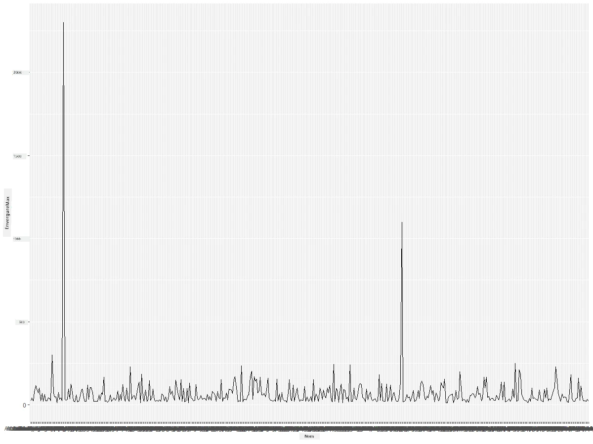
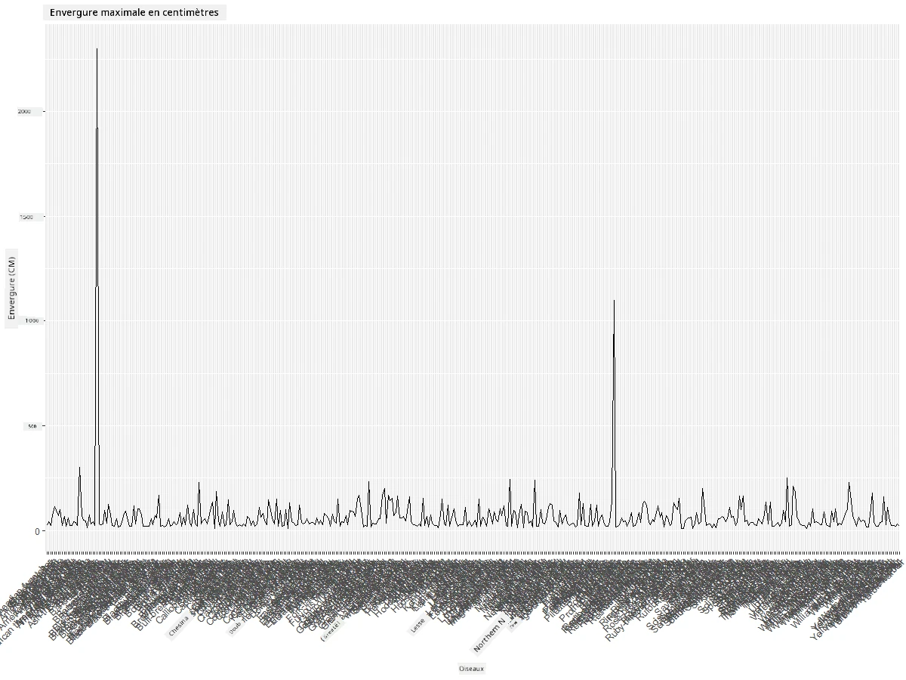
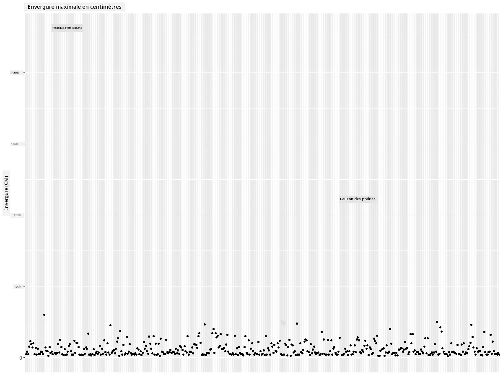
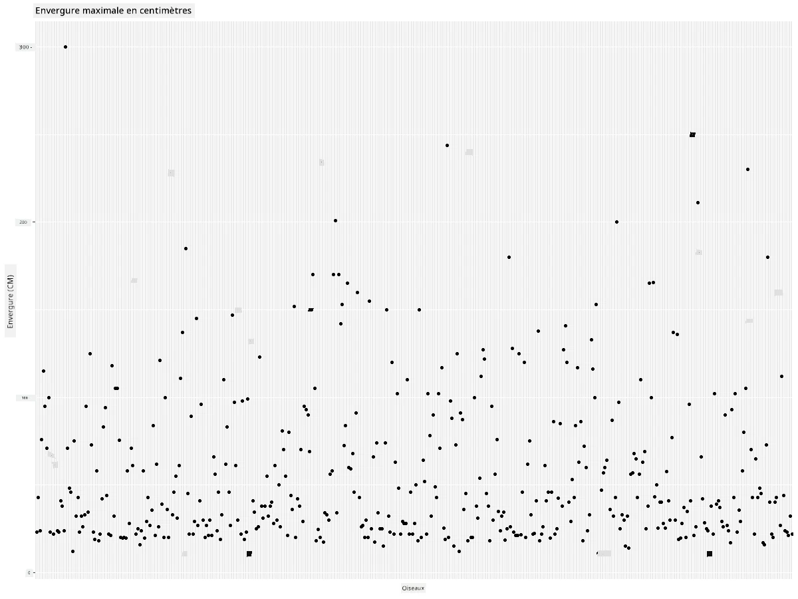
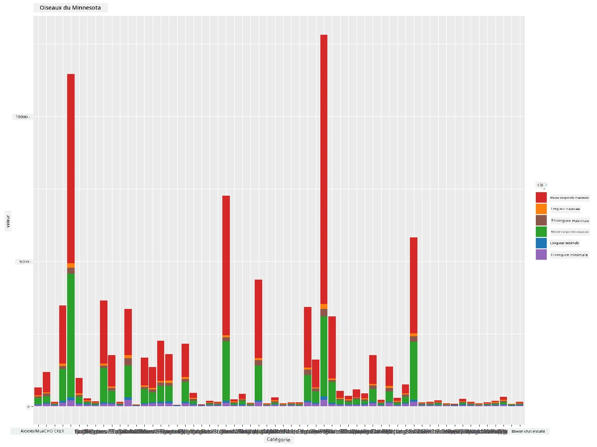
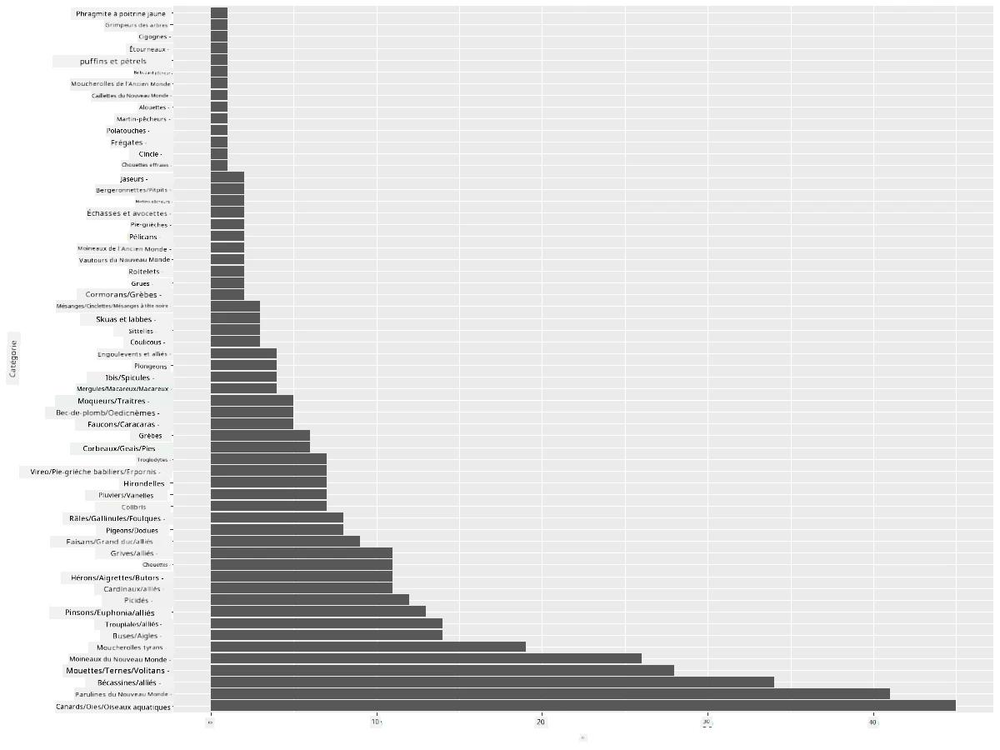
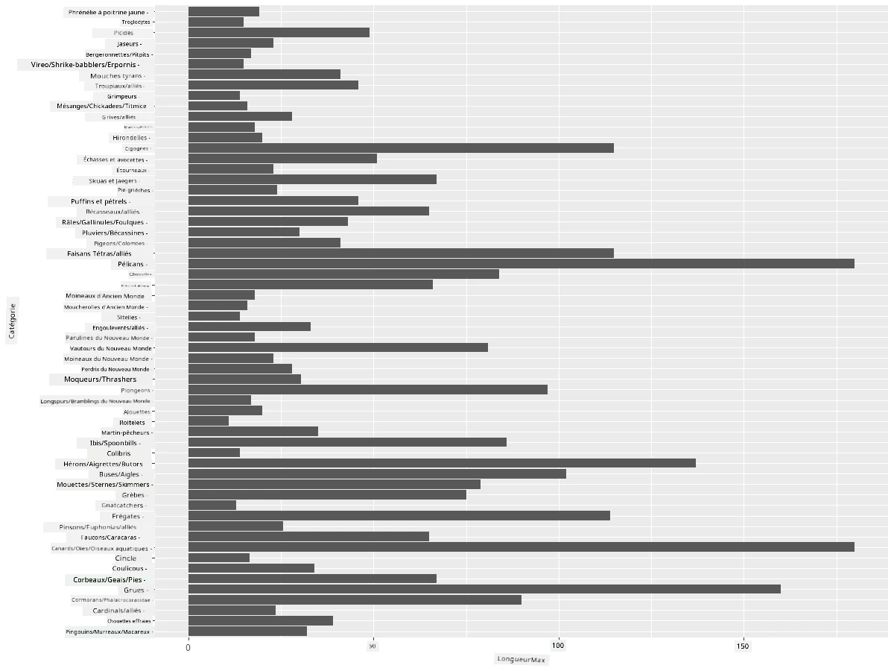
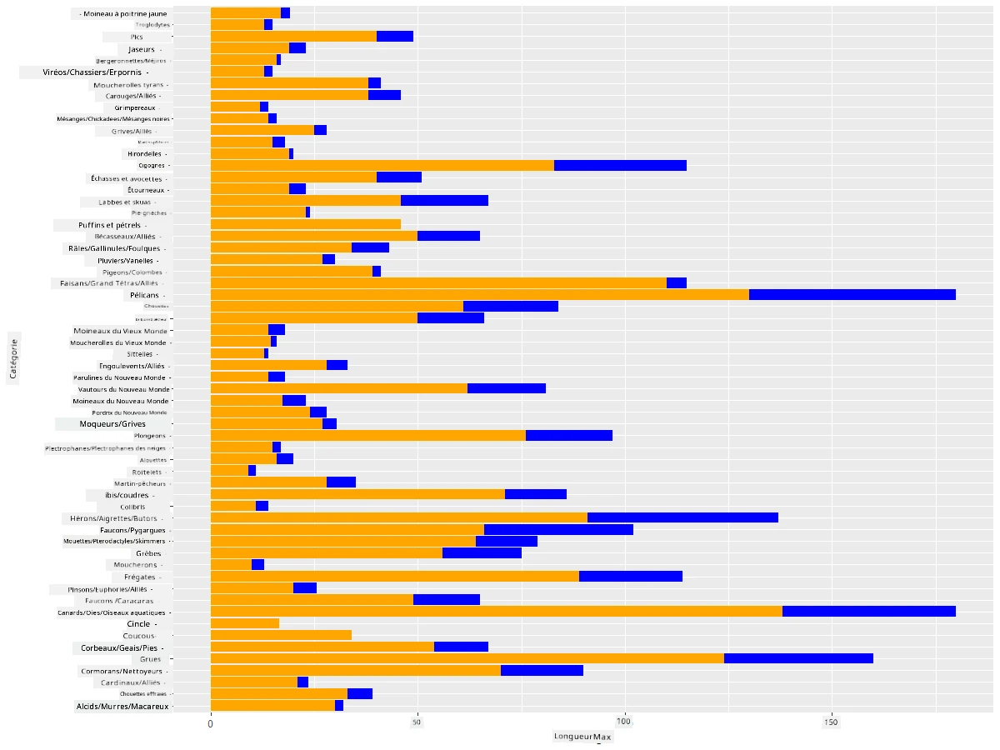

<!--
CO_OP_TRANSLATOR_METADATA:
{
  "original_hash": "22acf28f518a4769ea14fa42f4734b9f",
  "translation_date": "2025-08-25T18:23:10+00:00",
  "source_file": "3-Data-Visualization/R/09-visualization-quantities/README.md",
  "language_code": "fr"
}
-->
# Visualiser des quantités
| ](https://github.com/microsoft/Data-Science-For-Beginners/blob/main/sketchnotes/09-Visualizing-Quantities.png)|
|:---:|
| Visualiser des quantités - _Sketchnote par [@nitya](https://twitter.com/nitya)_ |

Dans cette leçon, vous allez explorer comment utiliser certaines des nombreuses bibliothèques disponibles dans les packages R pour apprendre à créer des visualisations intéressantes autour du concept de quantité. En utilisant un jeu de données nettoyé sur les oiseaux du Minnesota, vous pourrez découvrir de nombreuses informations fascinantes sur la faune locale.  
## [Quiz avant le cours](https://purple-hill-04aebfb03.1.azurestaticapps.net/quiz/16)

## Observer l'envergure avec ggplot2
Une bibliothèque excellente pour créer des graphiques simples ou sophistiqués de divers types est [ggplot2](https://cran.r-project.org/web/packages/ggplot2/index.html). En termes généraux, le processus de création de graphiques avec ces bibliothèques consiste à identifier les parties de votre dataframe que vous souhaitez cibler, effectuer les transformations nécessaires sur ces données, attribuer les valeurs des axes x et y, choisir le type de graphique à afficher, puis afficher le graphique.

`ggplot2` est un système permettant de créer des graphiques de manière déclarative, basé sur la Grammaire des Graphiques. La [Grammaire des Graphiques](https://en.wikipedia.org/wiki/Ggplot2) est un schéma général pour la visualisation des données qui décompose les graphiques en composants sémantiques tels que les échelles et les couches. En d'autres termes, la simplicité de création de graphiques pour des données univariées ou multivariées avec peu de code fait de `ggplot2` le package le plus populaire pour les visualisations en R. L'utilisateur indique à `ggplot2` comment mapper les variables aux esthétiques, quels éléments graphiques utiliser, et `ggplot2` s'occupe du reste.

> ✅ Graphique = Données + Esthétiques + Géométrie  
> - Données : le jeu de données  
> - Esthétiques : les variables à étudier (variables x et y)  
> - Géométrie : le type de graphique (graphique linéaire, histogramme, etc.)  

Choisissez la meilleure géométrie (type de graphique) en fonction de vos données et de l'histoire que vous souhaitez raconter à travers le graphique.

> - Pour analyser les tendances : ligne, colonne  
> - Pour comparer des valeurs : barre, colonne, camembert, nuage de points  
> - Pour montrer comment les parties se rapportent à un tout : camembert  
> - Pour montrer la distribution des données : nuage de points, barre  
> - Pour montrer les relations entre les valeurs : ligne, nuage de points, bulle  

✅ Vous pouvez également consulter cette [fiche descriptive](https://nyu-cdsc.github.io/learningr/assets/data-visualization-2.1.pdf) pour ggplot2.

## Construire un graphique linéaire sur les valeurs d'envergure des oiseaux

Ouvrez la console R et importez le jeu de données.  
> Note : Le jeu de données est stocké à la racine de ce dépôt dans le dossier `/data`.

Importons le jeu de données et observons les premières lignes (les 5 premières lignes) des données.

```r
birds <- read.csv("../../data/birds.csv",fileEncoding="UTF-8-BOM")
head(birds)
```  
Les premières lignes des données contiennent un mélange de texte et de chiffres :

|      | Nom                          | NomScientifique        | Catégorie             | Ordre        | Famille  | Genre       | StatutConservation | LongueurMin | LongueurMax | MasseMin | MasseMax | EnvergureMin | EnvergureMax |
| ---: | :--------------------------- | :--------------------- | :-------------------- | :----------- | :------- | :---------- | :----------------- | -----------:| -----------:| --------:| --------:| ------------:| ------------:|
|    0 | Dendrocygne à ventre noir    | Dendrocygna autumnalis | Canards/Oies/Oiseaux aquatiques | Anseriformes | Anatidae | Dendrocygna | LC                 |        47    |        56    |         652 |        1020 |          76   |          94   |
|    1 | Dendrocygne fauve            | Dendrocygna bicolor    | Canards/Oies/Oiseaux aquatiques | Anseriformes | Anatidae | Dendrocygna | LC                 |        45    |        53    |         712 |        1050 |          85   |          93   |
|    2 | Oie des neiges               | Anser caerulescens     | Canards/Oies/Oiseaux aquatiques | Anseriformes | Anatidae | Anser       | LC                 |        64    |        79    |        2050 |        4050 |         135   |         165   |
|    3 | Oie de Ross                  | Anser rossii           | Canards/Oies/Oiseaux aquatiques | Anseriformes | Anatidae | Anser       | LC                 |      57.3    |        64    |        1066 |        1567 |         113   |         116   |
|    4 | Oie rieuse                   | Anser albifrons        | Canards/Oies/Oiseaux aquatiques | Anseriformes | Anatidae | Anser       | LC                 |        64    |        81    |        1930 |        3310 |         130   |         165   |

Commençons par tracer certaines des données numériques à l'aide d'un graphique linéaire de base. Supposons que vous vouliez visualiser l'envergure maximale de ces oiseaux intéressants.

```r
install.packages("ggplot2")
library("ggplot2")
ggplot(data=birds, aes(x=Name, y=MaxWingspan,group=1)) +
  geom_line() 
```  
Ici, vous installez le package `ggplot2` puis l'importez dans l'espace de travail avec la commande `library("ggplot2")`. Pour tracer un graphique dans ggplot, la fonction `ggplot()` est utilisée et vous spécifiez le jeu de données, les variables x et y comme attributs. Dans ce cas, nous utilisons la fonction `geom_line()` car nous visons à tracer un graphique linéaire.



Que remarquez-vous immédiatement ? Il semble y avoir au moins une valeur aberrante - quelle envergure impressionnante ! Une envergure de plus de 2000 centimètres équivaut à plus de 20 mètres - y aurait-il des ptérodactyles qui rôdent dans le Minnesota ? Enquêtons.

Bien que vous puissiez effectuer un tri rapide dans Excel pour trouver ces valeurs aberrantes, qui sont probablement des erreurs de saisie, poursuivez le processus de visualisation en travaillant directement à partir du graphique.

Ajoutez des étiquettes à l'axe x pour montrer de quels oiseaux il s'agit :

```r
ggplot(data=birds, aes(x=Name, y=MaxWingspan,group=1)) +
  geom_line() +
  theme(axis.text.x = element_text(angle = 45, hjust=1))+
  xlab("Birds") +
  ylab("Wingspan (CM)") +
  ggtitle("Max Wingspan in Centimeters")
```  
Nous spécifions l'angle dans le `theme` et définissons les étiquettes des axes x et y avec `xlab()` et `ylab()` respectivement. La fonction `ggtitle()` donne un titre au graphique.



Même avec une rotation des étiquettes réglée à 45 degrés, il y en a trop pour être lisibles. Essayons une autre stratégie : étiqueter uniquement les valeurs aberrantes et placer les étiquettes directement dans le graphique. Vous pouvez utiliser un graphique en nuage de points pour laisser plus de place aux étiquettes :

```r
ggplot(data=birds, aes(x=Name, y=MaxWingspan,group=1)) +
  geom_point() +
  geom_text(aes(label=ifelse(MaxWingspan>500,as.character(Name),'')),hjust=0,vjust=0) + 
  theme(axis.title.x=element_blank(), axis.text.x=element_blank(), axis.ticks.x=element_blank())
  ylab("Wingspan (CM)") +
  ggtitle("Max Wingspan in Centimeters") + 
```  
Que se passe-t-il ici ? Vous avez utilisé la fonction `geom_point()` pour tracer des points de dispersion. Avec cela, vous avez ajouté des étiquettes pour les oiseaux ayant une `MaxWingspan > 500` et également masqué les étiquettes sur l'axe x pour désencombrer le graphique.

Que découvrez-vous ?



## Filtrer vos données

L'Aigle chauve et le Faucon des prairies, bien que probablement de très grands oiseaux, semblent être mal étiquetés, avec un zéro supplémentaire ajouté à leur envergure maximale. Il est peu probable que vous rencontriez un Aigle chauve avec une envergure de 25 mètres, mais si c'est le cas, faites-le nous savoir ! Créons un nouveau dataframe sans ces deux valeurs aberrantes :

```r
birds_filtered <- subset(birds, MaxWingspan < 500)

ggplot(data=birds_filtered, aes(x=Name, y=MaxWingspan,group=1)) +
  geom_point() +
  ylab("Wingspan (CM)") +
  xlab("Birds") +
  ggtitle("Max Wingspan in Centimeters") + 
  geom_text(aes(label=ifelse(MaxWingspan>500,as.character(Name),'')),hjust=0,vjust=0) +
  theme(axis.text.x=element_blank(), axis.ticks.x=element_blank())
```  
Nous avons créé un nouveau dataframe `birds_filtered` puis tracé un nuage de points. En filtrant les valeurs aberrantes, vos données sont désormais plus cohérentes et compréhensibles.



Maintenant que nous avons un jeu de données plus propre en termes d'envergure, découvrons-en davantage sur ces oiseaux.

Bien que les graphiques linéaires et les nuages de points puissent afficher des informations sur les valeurs des données et leur distribution, nous voulons réfléchir aux valeurs inhérentes à ce jeu de données. Vous pourriez créer des visualisations pour répondre aux questions suivantes sur les quantités :

> Combien de catégories d'oiseaux existe-t-il, et quels sont leurs effectifs ?  
> Combien d'oiseaux sont éteints, en danger, rares ou communs ?  
> Combien y a-t-il de genres et d'ordres différents selon la terminologie de Linné ?  

## Explorer les graphiques en barres

Les graphiques en barres sont pratiques lorsque vous devez montrer des regroupements de données. Explorons les catégories d'oiseaux présentes dans ce jeu de données pour voir laquelle est la plus courante en nombre.  
Créons un graphique en barres sur les données filtrées.

```r
install.packages("dplyr")
install.packages("tidyverse")

library(lubridate)
library(scales)
library(dplyr)
library(ggplot2)
library(tidyverse)

birds_filtered %>% group_by(Category) %>%
  summarise(n=n(),
  MinLength = mean(MinLength),
  MaxLength = mean(MaxLength),
  MinBodyMass = mean(MinBodyMass),
  MaxBodyMass = mean(MaxBodyMass),
  MinWingspan=mean(MinWingspan),
  MaxWingspan=mean(MaxWingspan)) %>% 
  gather("key", "value", - c(Category, n)) %>%
  ggplot(aes(x = Category, y = value, group = key, fill = key)) +
  geom_bar(stat = "identity") +
  scale_fill_manual(values = c("#D62728", "#FF7F0E", "#8C564B","#2CA02C", "#1F77B4", "#9467BD")) +                   
  xlab("Category")+ggtitle("Birds of Minnesota")

```  
Dans l'extrait suivant, nous installons les packages [dplyr](https://www.rdocumentation.org/packages/dplyr/versions/0.7.8) et [lubridate](https://www.rdocumentation.org/packages/lubridate/versions/1.8.0) pour aider à manipuler et regrouper les données afin de tracer un graphique en barres empilées. Tout d'abord, vous regroupez les données par `Category` d'oiseau, puis vous résumez les colonnes `MinLength`, `MaxLength`, `MinBodyMass`, `MaxBodyMass`, `MinWingspan`, `MaxWingspan`. Ensuite, vous tracez le graphique en barres avec le package `ggplot2` et spécifiez les couleurs pour les différentes catégories et les étiquettes.



Cependant, ce graphique en barres est illisible car il y a trop de données non regroupées. Vous devez sélectionner uniquement les données que vous souhaitez tracer, alors examinons la longueur des oiseaux en fonction de leur catégorie.

Filtrez vos données pour inclure uniquement la catégorie des oiseaux.

Comme il y a de nombreuses catégories, vous pouvez afficher ce graphique verticalement et ajuster sa hauteur pour tenir compte de toutes les données :

```r
birds_count<-dplyr::count(birds_filtered, Category, sort = TRUE)
birds_count$Category <- factor(birds_count$Category, levels = birds_count$Category)
ggplot(birds_count,aes(Category,n))+geom_bar(stat="identity")+coord_flip()
```  
Vous comptez d'abord les valeurs uniques dans la colonne `Category` puis les triez dans un nouveau dataframe `birds_count`. Ces données triées sont ensuite factoriées au même niveau afin qu'elles soient tracées dans l'ordre trié. Avec `ggplot2`, vous tracez ensuite les données dans un graphique en barres. La fonction `coord_flip()` trace des barres horizontales.



Ce graphique en barres montre une bonne vue du nombre d'oiseaux dans chaque catégorie. En un clin d'œil, vous voyez que le plus grand nombre d'oiseaux dans cette région appartient à la catégorie Canards/Oies/Oiseaux aquatiques. Le Minnesota est le "pays des 10 000 lacs", donc cela n'est pas surprenant !

✅ Essayez d'autres décomptes sur ce jeu de données. Quelque chose vous surprend-il ?

## Comparer des données

Vous pouvez essayer différentes comparaisons de données regroupées en créant de nouveaux axes. Essayez une comparaison de la LongueurMax d'un oiseau, en fonction de sa catégorie :

```r
birds_grouped <- birds_filtered %>%
  group_by(Category) %>%
  summarise(
  MaxLength = max(MaxLength, na.rm = T),
  MinLength = max(MinLength, na.rm = T)
           ) %>%
  arrange(Category)
  
ggplot(birds_grouped,aes(Category,MaxLength))+geom_bar(stat="identity")+coord_flip()
```  
Nous regroupons les données `birds_filtered` par `Category` puis traçons un graphique en barres.



Rien de surprenant ici : les colibris ont la LongueurMax la plus faible comparée aux pélicans ou aux oies. C'est bien lorsque les données ont du sens logiquement !

Vous pouvez créer des visualisations plus intéressantes de graphiques en barres en superposant des données. Superposons les LongueurMin et LongueurMax pour une catégorie donnée d'oiseaux :

```r
ggplot(data=birds_grouped, aes(x=Category)) +
  geom_bar(aes(y=MaxLength), stat="identity", position ="identity",  fill='blue') +
  geom_bar(aes(y=MinLength), stat="identity", position="identity", fill='orange')+
  coord_flip()
```  


## 🚀 Défi

Ce jeu de données sur les oiseaux offre une mine d'informations sur différents types d'oiseaux dans un écosystème particulier. Cherchez sur Internet et voyez si vous pouvez trouver d'autres jeux de données orientés sur les oiseaux. Entraînez-vous à construire des graphiques et des diagrammes autour de ces oiseaux pour découvrir des faits que vous ignoriez.

## [Quiz après le cours](https://purple-hill-04aebfb03.1.azurestaticapps.net/quiz/17)

## Révision et auto-apprentissage

Cette première leçon vous a donné des informations sur l'utilisation de `ggplot2` pour visualiser des quantités. Faites des recherches sur d'autres façons de travailler avec des jeux de données pour la visualisation. Recherchez et explorez des jeux de données que vous pourriez visualiser en utilisant d'autres packages comme [Lattice](https://stat.ethz.ch/R-manual/R-devel/library/lattice/html/Lattice.html) et [Plotly](https://github.com/plotly/plotly.R#readme).

## Devoir
[Graphiques linéaires, nuages de points et barres](assignment.md)

**Avertissement** :  
Ce document a été traduit à l'aide du service de traduction automatique [Co-op Translator](https://github.com/Azure/co-op-translator). Bien que nous nous efforcions d'assurer l'exactitude, veuillez noter que les traductions automatisées peuvent contenir des erreurs ou des inexactitudes. Le document original dans sa langue d'origine doit être considéré comme la source faisant autorité. Pour des informations critiques, il est recommandé de recourir à une traduction professionnelle réalisée par un humain. Nous déclinons toute responsabilité en cas de malentendus ou d'interprétations erronées résultant de l'utilisation de cette traduction.