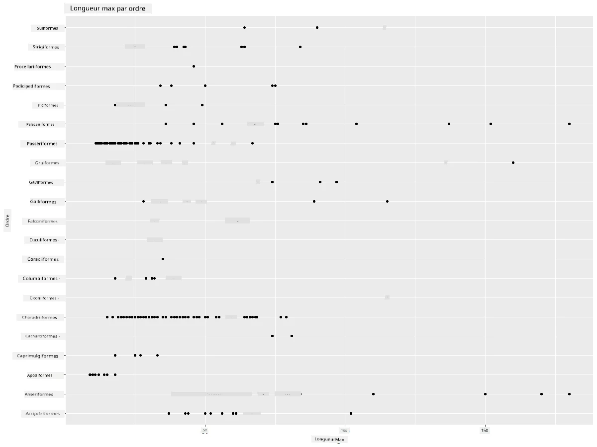
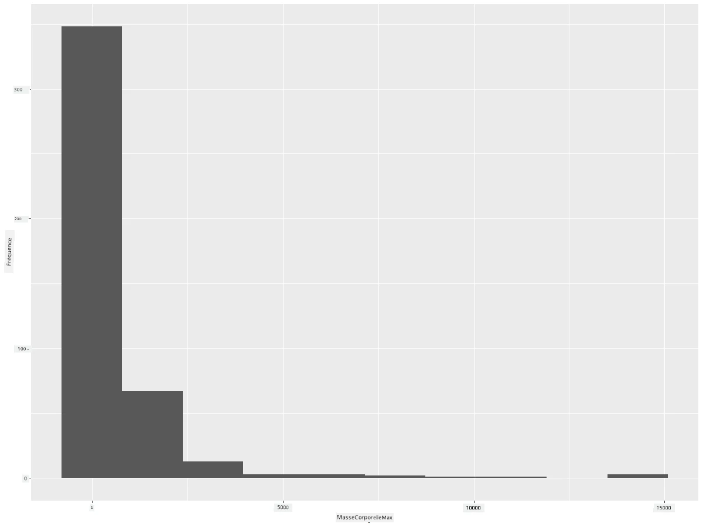
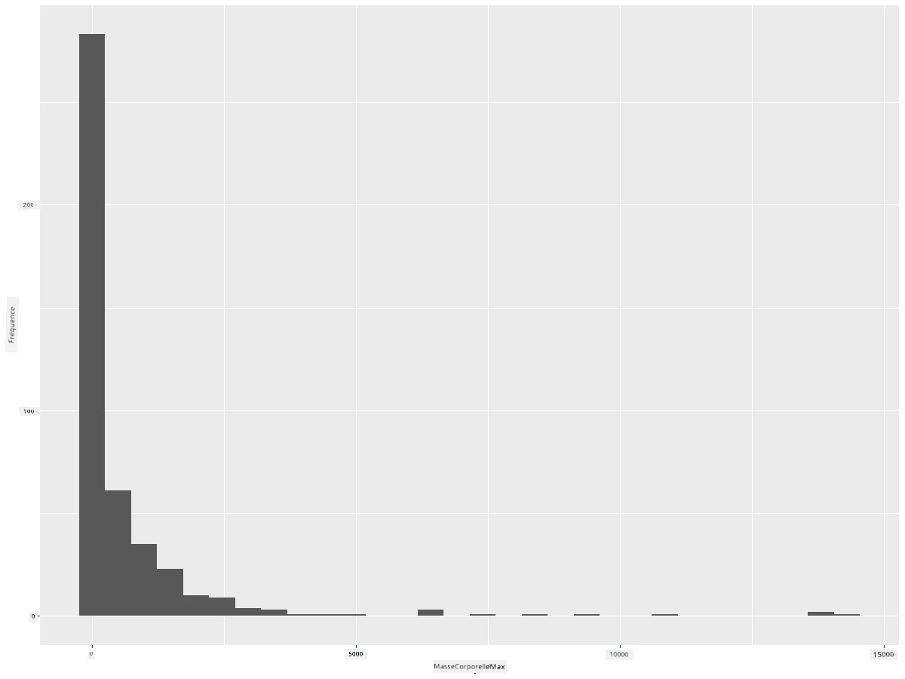
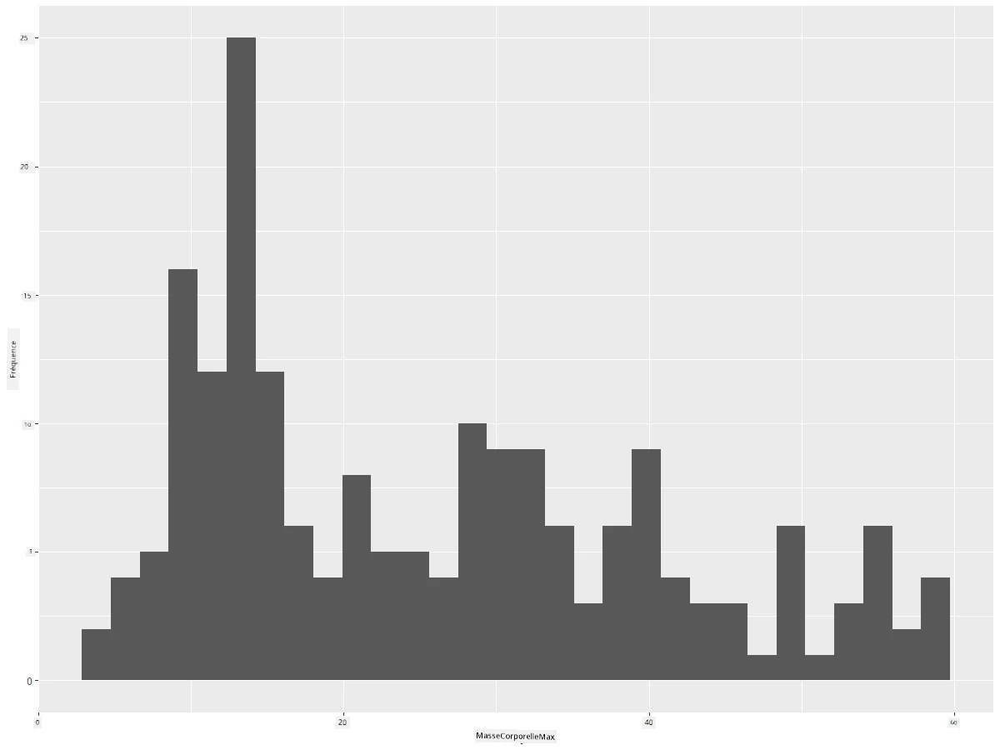
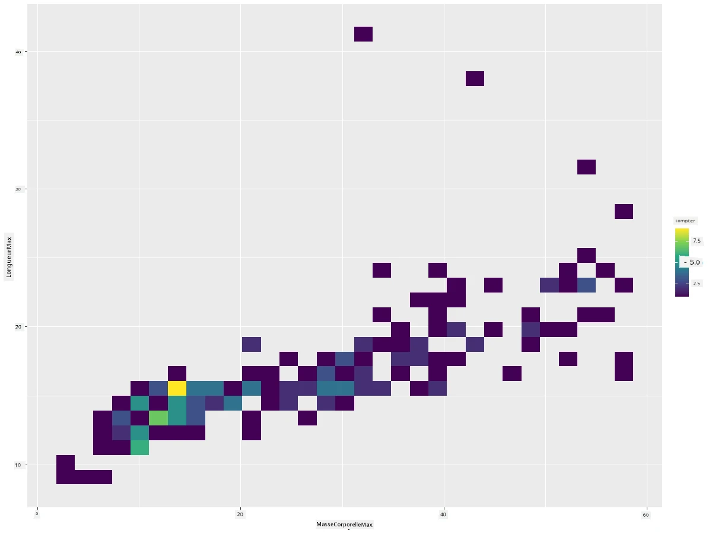
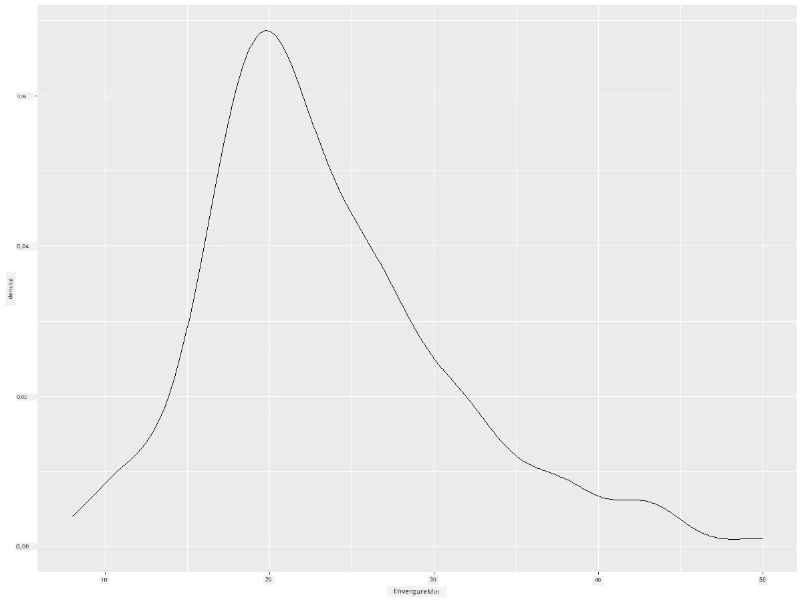
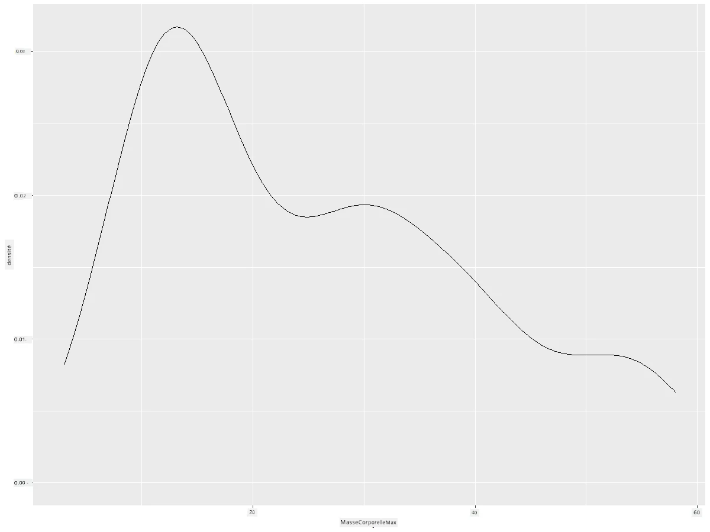
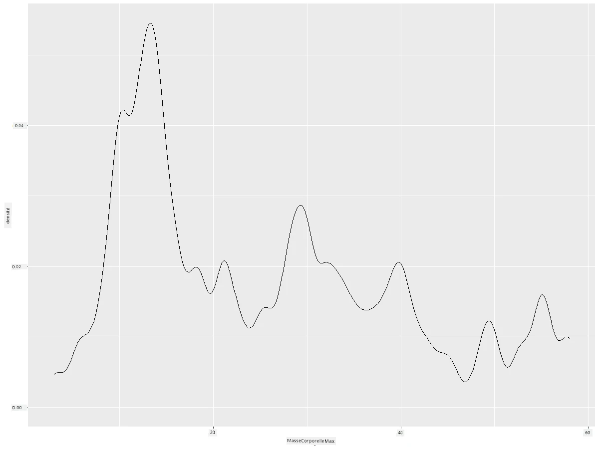
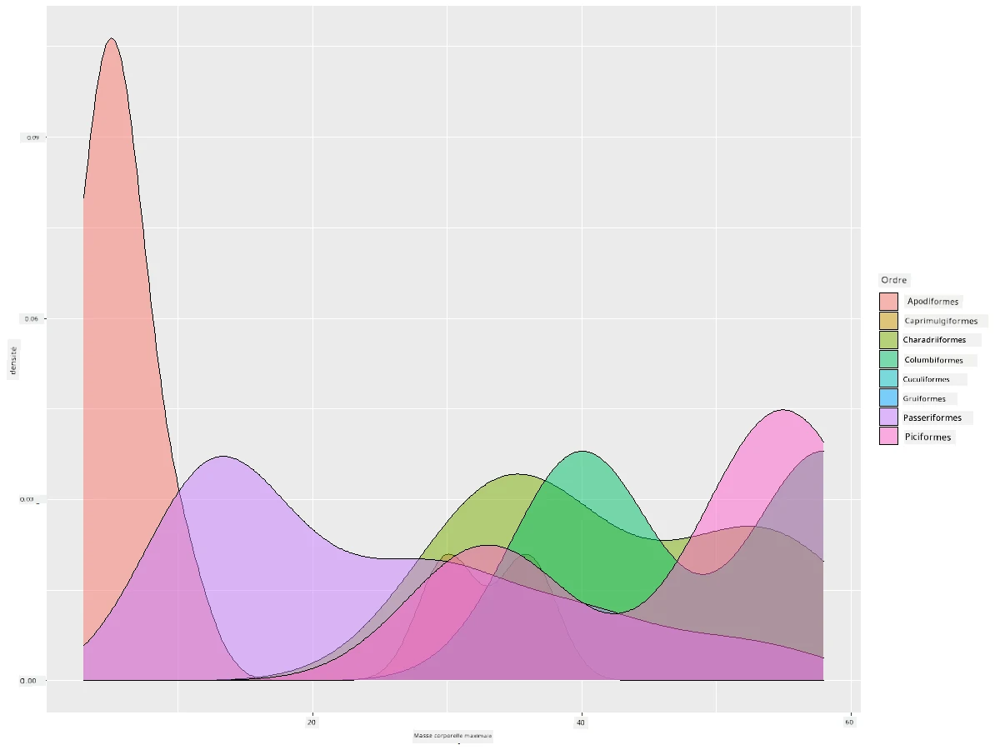

<!--
CO_OP_TRANSLATOR_METADATA:
{
  "original_hash": "ea67c0c40808fd723594de6896c37ccf",
  "translation_date": "2025-08-25T18:14:17+00:00",
  "source_file": "3-Data-Visualization/R/10-visualization-distributions/README.md",
  "language_code": "fr"
}
-->
# Visualiser les distributions

| ](https://github.com/microsoft/Data-Science-For-Beginners/blob/main/sketchnotes/10-Visualizing-Distributions.png)|
|:---:|
| Visualiser les distributions - _Sketchnote par [@nitya](https://twitter.com/nitya)_ |

Dans la leçon précédente, vous avez appris des faits intéressants sur un jeu de données concernant les oiseaux du Minnesota. Vous avez identifié des données erronées en visualisant les valeurs aberrantes et examiné les différences entre les catégories d'oiseaux en fonction de leur longueur maximale.

## [Quiz avant le cours](https://purple-hill-04aebfb03.1.azurestaticapps.net/quiz/18)
## Explorer le jeu de données sur les oiseaux

Une autre façon d'explorer les données est d'examiner leur distribution, c'est-à-dire comment elles sont organisées le long d'un axe. Par exemple, vous pourriez vouloir en savoir plus sur la distribution générale, dans ce jeu de données, de l'envergure maximale ou de la masse corporelle maximale des oiseaux du Minnesota.

Découvrons quelques faits sur les distributions des données dans ce jeu de données. Dans votre console R, importez `ggplot2` et la base de données. Supprimez les valeurs aberrantes de la base de données comme dans le sujet précédent.

```r
library(ggplot2)

birds <- read.csv("../../data/birds.csv",fileEncoding="UTF-8-BOM")

birds_filtered <- subset(birds, MaxWingspan < 500)
head(birds_filtered)
```
|      | Nom                          | NomScientifique        | Catégorie             | Ordre        | Famille  | Genre       | StatutConservation | LongueurMin | LongueurMax | MasseMin | MasseMax | EnvergureMin | EnvergureMax |
| ---: | :--------------------------- | :--------------------- | :-------------------- | :----------- | :------- | :---------- | :----------------- | -----------:| -----------:| --------:| --------:| ------------:| ------------:|
|    0 | Dendrocygne à ventre noir    | Dendrocygna autumnalis | Canards/Oies/Oiseaux aquatiques | Anseriformes | Anatidae | Dendrocygna | LC                 |        47   |        56   |       652 |      1020 |          76  |          94  |
|    1 | Dendrocygne fauve            | Dendrocygna bicolor    | Canards/Oies/Oiseaux aquatiques | Anseriformes | Anatidae | Dendrocygna | LC                 |        45   |        53   |       712 |      1050 |          85  |          93  |
|    2 | Oie des neiges               | Anser caerulescens     | Canards/Oies/Oiseaux aquatiques | Anseriformes | Anatidae | Anser       | LC                 |        64   |        79   |      2050 |      4050 |         135  |         165  |
|    3 | Oie de Ross                  | Anser rossii           | Canards/Oies/Oiseaux aquatiques | Anseriformes | Anatidae | Anser       | LC                 |      57.3   |        64   |      1066 |      1567 |         113  |         116  |
|    4 | Oie rieuse                   | Anser albifrons        | Canards/Oies/Oiseaux aquatiques | Anseriformes | Anatidae | Anser       | LC                 |        64   |        81   |      1930 |      3310 |         130  |         165  |

En général, vous pouvez rapidement observer la manière dont les données sont distribuées en utilisant un nuage de points, comme nous l'avons fait dans la leçon précédente :

```r
ggplot(data=birds_filtered, aes(x=Order, y=MaxLength,group=1)) +
  geom_point() +
  ggtitle("Max Length per order") + coord_flip()
```


Cela donne un aperçu de la distribution générale de la longueur corporelle par ordre d'oiseaux, mais ce n'est pas la meilleure façon de représenter les distributions réelles. Cette tâche est généralement mieux réalisée avec un histogramme.

## Travailler avec des histogrammes

`ggplot2` offre d'excellents moyens de visualiser la distribution des données à l'aide d'histogrammes. Ce type de graphique ressemble à un diagramme en barres où la distribution peut être observée à travers la montée et la descente des barres. Pour construire un histogramme, vous avez besoin de données numériques. Pour créer un histogramme, vous pouvez tracer un graphique en définissant le type comme 'hist' pour Histogramme. Ce graphique montre la distribution de la MasseCorporelleMax pour l'ensemble des données numériques du jeu de données. En divisant l'ensemble des données en plus petits intervalles, il peut afficher la distribution des valeurs des données :

```r
ggplot(data = birds_filtered, aes(x = MaxBodyMass)) + 
  geom_histogram(bins=10)+ylab('Frequency')
```


Comme vous pouvez le voir, la plupart des 400+ oiseaux de ce jeu de données ont une Masse Corporelle Max inférieure à 2000. Obtenez plus d'informations sur les données en modifiant le paramètre `bins` à une valeur plus élevée, comme 30 :

```r
ggplot(data = birds_filtered, aes(x = MaxBodyMass)) + geom_histogram(bins=30)+ylab('Frequency')
```



Ce graphique montre la distribution de manière un peu plus détaillée. Un graphique moins biaisé vers la gauche pourrait être créé en s'assurant que vous ne sélectionnez que des données dans une plage donnée :

Filtrez vos données pour ne conserver que les oiseaux dont la masse corporelle est inférieure à 60, et affichez 30 `bins` :

```r
birds_filtered_1 <- subset(birds_filtered, MaxBodyMass > 1 & MaxBodyMass < 60)
ggplot(data = birds_filtered_1, aes(x = MaxBodyMass)) + 
  geom_histogram(bins=30)+ylab('Frequency')
```



✅ Essayez d'autres filtres et points de données. Pour voir la distribution complète des données, supprimez le filtre `['MaxBodyMass']` pour afficher les distributions étiquetées.

L'histogramme offre également des améliorations intéressantes en termes de couleurs et d'étiquetage :

Créez un histogramme 2D pour comparer la relation entre deux distributions. Comparons `MaxBodyMass` et `MaxLength`. `ggplot2` propose une méthode intégrée pour montrer la convergence à l'aide de couleurs plus vives :

```r
ggplot(data=birds_filtered_1, aes(x=MaxBodyMass, y=MaxLength) ) +
  geom_bin2d() +scale_fill_continuous(type = "viridis")
```
Il semble y avoir une corrélation attendue entre ces deux éléments le long d'un axe attendu, avec un point de convergence particulièrement fort :



Les histogrammes fonctionnent bien par défaut pour les données numériques. Que faire si vous devez examiner les distributions en fonction de données textuelles ? 
## Explorer le jeu de données pour les distributions à l'aide de données textuelles 

Ce jeu de données contient également de bonnes informations sur la catégorie des oiseaux, leur genre, leur espèce, leur famille ainsi que leur statut de conservation. Explorons ces informations de conservation. Quelle est la distribution des oiseaux selon leur statut de conservation ?

> ✅ Dans le jeu de données, plusieurs acronymes sont utilisés pour décrire le statut de conservation. Ces acronymes proviennent des [Catégories de la Liste Rouge de l'UICN](https://www.iucnredlist.org/), une organisation qui catalogue le statut des espèces.
> 
> - CR : En danger critique d'extinction
> - EN : En danger
> - EX : Éteint
> - LC : Préoccupation mineure
> - NT : Quasi menacé
> - VU : Vulnérable

Ces valeurs sont basées sur du texte, vous devrez donc effectuer une transformation pour créer un histogramme. En utilisant le dataframe filteredBirds, affichez son statut de conservation avec son EnvergureMin. Que remarquez-vous ? 

```r
birds_filtered_1$ConservationStatus[birds_filtered_1$ConservationStatus == 'EX'] <- 'x1' 
birds_filtered_1$ConservationStatus[birds_filtered_1$ConservationStatus == 'CR'] <- 'x2'
birds_filtered_1$ConservationStatus[birds_filtered_1$ConservationStatus == 'EN'] <- 'x3'
birds_filtered_1$ConservationStatus[birds_filtered_1$ConservationStatus == 'NT'] <- 'x4'
birds_filtered_1$ConservationStatus[birds_filtered_1$ConservationStatus == 'VU'] <- 'x5'
birds_filtered_1$ConservationStatus[birds_filtered_1$ConservationStatus == 'LC'] <- 'x6'

ggplot(data=birds_filtered_1, aes(x = MinWingspan, fill = ConservationStatus)) +
  geom_histogram(position = "identity", alpha = 0.4, bins = 20) +
  scale_fill_manual(name="Conservation Status",values=c("red","green","blue","pink"),labels=c("Endangered","Near Threathened","Vulnerable","Least Concern"))
```


Il ne semble pas y avoir de bonne corrélation entre l'envergure minimale et le statut de conservation. Testez d'autres éléments du jeu de données en utilisant cette méthode. Essayez également différents filtres. Trouvez-vous une corrélation ?

## Graphiques de densité

Vous avez peut-être remarqué que les histogrammes que nous avons examinés jusqu'à présent sont "en escalier" et ne s'écoulent pas de manière fluide en arc. Pour afficher un graphique de densité plus fluide, vous pouvez essayer un graphique de densité.

Travaillons maintenant avec des graphiques de densité !

```r
ggplot(data = birds_filtered_1, aes(x = MinWingspan)) + 
  geom_density()
```


Vous pouvez voir comment le graphique reflète le précédent pour les données d'EnvergureMin ; il est juste un peu plus fluide. Si vous vouliez revisiter cette ligne irrégulière de MasseCorporelleMax dans le deuxième graphique que vous avez construit, vous pourriez la lisser très bien en la recréant avec cette méthode :

```r
ggplot(data = birds_filtered_1, aes(x = MaxBodyMass)) + 
  geom_density()
```


Si vous vouliez une ligne lisse, mais pas trop lisse, modifiez le paramètre `adjust` : 

```r
ggplot(data = birds_filtered_1, aes(x = MaxBodyMass)) + 
  geom_density(adjust = 1/5)
```


✅ Lisez les paramètres disponibles pour ce type de graphique et expérimentez !

Ce type de graphique offre des visualisations magnifiquement explicatives. Avec quelques lignes de code, par exemple, vous pouvez montrer la densité de la masse corporelle maximale par ordre d'oiseaux :

```r
ggplot(data=birds_filtered_1,aes(x = MaxBodyMass, fill = Order)) +
  geom_density(alpha=0.5)
```


## 🚀 Défi

Les histogrammes sont un type de graphique plus sophistiqué que les nuages de points, les diagrammes en barres ou les graphiques linéaires de base. Faites une recherche sur Internet pour trouver de bons exemples d'utilisation des histogrammes. Comment sont-ils utilisés, que démontrent-ils, et dans quels domaines ou champs d'étude ont-ils tendance à être utilisés ?

## [Quiz après le cours](https://purple-hill-04aebfb03.1.azurestaticapps.net/quiz/19)

## Révision et auto-apprentissage

Dans cette leçon, vous avez utilisé `ggplot2` et commencé à travailler sur des graphiques plus sophistiqués. Faites des recherches sur `geom_density_2d()`, une "courbe de densité de probabilité continue dans une ou plusieurs dimensions". Lisez [la documentation](https://ggplot2.tidyverse.org/reference/geom_density_2d.html) pour comprendre comment cela fonctionne.

## Devoir

[Appliquez vos compétences](assignment.md)

**Avertissement** :  
Ce document a été traduit à l'aide du service de traduction automatique [Co-op Translator](https://github.com/Azure/co-op-translator). Bien que nous nous efforcions d'assurer l'exactitude, veuillez noter que les traductions automatisées peuvent contenir des erreurs ou des inexactitudes. Le document original dans sa langue d'origine doit être considéré comme la source faisant autorité. Pour des informations critiques, il est recommandé de recourir à une traduction professionnelle réalisée par un humain. Nous déclinons toute responsabilité en cas de malentendus ou d'interprétations erronées résultant de l'utilisation de cette traduction.