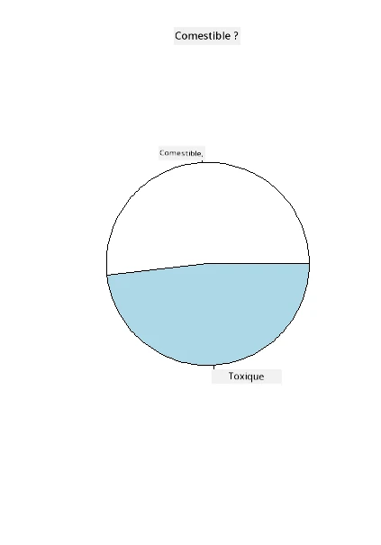
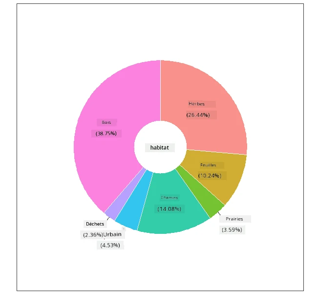
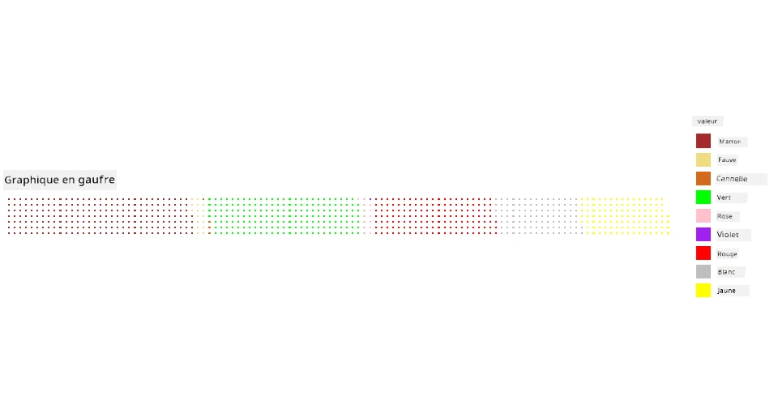

<!--
CO_OP_TRANSLATOR_METADATA:
{
  "original_hash": "47028abaaafa2bcb1079702d20569066",
  "translation_date": "2025-08-25T18:31:54+00:00",
  "source_file": "3-Data-Visualization/R/11-visualization-proportions/README.md",
  "language_code": "fr"
}
-->
# Visualiser les proportions

| ](../../../sketchnotes/11-Visualizing-Proportions.png)|
|:---:|
|Visualiser les proportions - _Sketchnote par [@nitya](https://twitter.com/nitya)_ |

Dans cette leçon, vous utiliserez un ensemble de données axé sur la nature pour visualiser des proportions, comme le nombre de types différents de champignons présents dans un ensemble de données sur les champignons. Explorons ces fascinants champignons à l'aide d'un ensemble de données provenant d'Audubon, qui répertorie des détails sur 23 espèces de champignons à lamelles des familles Agaricus et Lepiota. Vous expérimenterez des visualisations savoureuses telles que :

- Des graphiques en secteurs 🥧
- Des graphiques en anneaux 🍩
- Des graphiques en gaufres 🧇

> 💡 Un projet très intéressant appelé [Charticulator](https://charticulator.com) de Microsoft Research propose une interface gratuite de glisser-déposer pour les visualisations de données. Dans l'un de leurs tutoriels, ils utilisent également cet ensemble de données sur les champignons ! Vous pouvez donc explorer les données et apprendre à utiliser la bibliothèque en même temps : [Tutoriel Charticulator](https://charticulator.com/tutorials/tutorial4.html).

## [Quiz avant le cours](https://purple-hill-04aebfb03.1.azurestaticapps.net/quiz/20)

## Faites connaissance avec vos champignons 🍄

Les champignons sont très intéressants. Importons un ensemble de données pour les étudier :

```r
mushrooms = read.csv('../../data/mushrooms.csv')
head(mushrooms)
```
Un tableau est affiché avec des données intéressantes pour l'analyse :

| classe     | forme-chapeau | surface-chapeau | couleur-chapeau | meurtrissures | odeur    | attache-lamelle | espacement-lamelle | taille-lamelle | couleur-lamelle | forme-pied | racine-pied | surface-pied-au-dessus-anneau | surface-pied-en-dessous-anneau | couleur-pied-au-dessus-anneau | couleur-pied-en-dessous-anneau | type-voile | couleur-voile | nombre-anneaux | type-anneau | couleur-spores | population | habitat |
| --------- | ------------- | ---------------- | --------------- | ------------- | -------- | ---------------- | ------------------ | -------------- | --------------- | ---------- | ----------- | --------------------------- | --------------------------- | --------------------------- | --------------------------- | --------- | ------------ | -------------- | ---------- | -------------- | ---------- | ------- |
| Toxique   | Convexe       | Lisse           | Marron          | Meurtri       | Piquant  | Libre           | Serré              | Étroit         | Noir            | Élargi     | Égal        | Lisse                      | Lisse                      | Blanc                      | Blanc                      | Partiel   | Blanc        | Un             | Pendant    | Noir           | Dispersé   | Urbain  |
| Comestible| Convexe       | Lisse           | Jaune           | Meurtri       | Amande   | Libre           | Serré              | Large          | Noir            | Élargi     | Massue      | Lisse                      | Lisse                      | Blanc                      | Blanc                      | Partiel   | Blanc        | Un             | Pendant    | Marron         | Nombreux   | Herbes  |
| Comestible| Cloché        | Lisse           | Blanc           | Meurtri       | Anis     | Libre           | Serré              | Large          | Marron          | Élargi     | Massue      | Lisse                      | Lisse                      | Blanc                      | Blanc                      | Partiel   | Blanc        | Un             | Pendant    | Marron         | Nombreux   | Prairies|
| Toxique   | Convexe       | Écailleux       | Blanc           | Meurtri       | Piquant  | Libre           | Serré              | Étroit         | Marron          | Élargi     | Égal        | Lisse                      | Lisse                      | Blanc                      | Blanc                      | Partiel   | Blanc        | Un             | Pendant    | Noir           | Dispersé   | Urbain  |
| Comestible| Convexe       | Lisse           | Vert            | Pas meurtri   | Aucun    | Libre           | Serré              | Large          | Noir            | Effilé     | Égal        | Lisse                      | Lisse                      | Blanc                      | Blanc                      | Partiel   | Blanc        | Un             | Évanescent | Marron         | Abondant   | Herbes  |
| Comestible| Convexe       | Écailleux       | Jaune           | Meurtri       | Amande   | Libre           | Serré              | Large          | Marron          | Élargi     | Massue      | Lisse                      | Lisse                      | Blanc                      | Blanc                      | Partiel   | Blanc        | Un             | Pendant    | Noir           | Nombreux   | Herbes  |

Vous remarquez immédiatement que toutes les données sont textuelles. Vous devrez convertir ces données pour pouvoir les utiliser dans un graphique. La plupart des données sont en fait représentées comme un objet :

```r
names(mushrooms)
```

Le résultat est :

```output
[1] "class"                    "cap.shape"               
 [3] "cap.surface"              "cap.color"               
 [5] "bruises"                  "odor"                    
 [7] "gill.attachment"          "gill.spacing"            
 [9] "gill.size"                "gill.color"              
[11] "stalk.shape"              "stalk.root"              
[13] "stalk.surface.above.ring" "stalk.surface.below.ring"
[15] "stalk.color.above.ring"   "stalk.color.below.ring"  
[17] "veil.type"                "veil.color"              
[19] "ring.number"              "ring.type"               
[21] "spore.print.color"        "population"              
[23] "habitat"            
```
Prenez ces données et convertissez la colonne 'classe' en catégorie :

```r
library(dplyr)
grouped=mushrooms %>%
  group_by(class) %>%
  summarise(count=n())
```

Maintenant, si vous affichez les données des champignons, vous pouvez voir qu'elles ont été regroupées en catégories selon la classe toxique/comestible :
```r
View(grouped)
```

| classe | nombre |
| --------- | --------- |
| Comestible | 4208 |
| Toxique    | 3916 |

Si vous suivez l'ordre présenté dans ce tableau pour créer vos étiquettes de catégorie de classe, vous pouvez construire un graphique en secteurs.

## Secteurs !

```r
pie(grouped$count,grouped$class, main="Edible?")
```
Voilà, un graphique en secteurs montrant les proportions de ces données selon ces deux classes de champignons. Il est très important de respecter l'ordre des étiquettes, surtout ici, alors assurez-vous de vérifier l'ordre dans lequel le tableau des étiquettes est construit !



## Anneaux !

Un graphique en anneau, un peu plus visuellement intéressant, est un graphique en secteurs avec un trou au milieu. Regardons nos données avec cette méthode.

Examinez les différents habitats où poussent les champignons :

```r
library(dplyr)
habitat=mushrooms %>%
  group_by(habitat) %>%
  summarise(count=n())
View(habitat)
```
Le résultat est :
| habitat | nombre |
| --------- | --------- |
| Herbes    | 2148 |
| Feuilles  | 832   |
| Prairies  | 292   |
| Sentiers  | 1144  |
| Urbain    | 368   |
| Déchets   | 192   |
| Bois      | 3148  |

Ici, vous regroupez vos données par habitat. Il y en a 7 répertoriés, alors utilisez-les comme étiquettes pour votre graphique en anneau :

```r
library(ggplot2)
library(webr)
PieDonut(habitat, aes(habitat, count=count))
```



Ce code utilise deux bibliothèques - ggplot2 et webr. En utilisant la fonction PieDonut de la bibliothèque webr, nous pouvons facilement créer un graphique en anneau !

Les graphiques en anneau dans R peuvent également être réalisés uniquement avec la bibliothèque ggplot2. Vous pouvez en apprendre davantage à ce sujet [ici](https://www.r-graph-gallery.com/128-ring-or-donut-plot.html) et l'essayer vous-même.

Maintenant que vous savez comment regrouper vos données et les afficher sous forme de graphique en secteurs ou en anneau, vous pouvez explorer d'autres types de graphiques. Essayez un graphique en gaufres, qui est simplement une autre façon d'explorer les quantités.

## Gaufres !

Un graphique de type 'gaufre' est une autre manière de visualiser les quantités sous forme de tableau 2D de carrés. Essayez de visualiser les différentes quantités de couleurs de chapeau de champignon dans cet ensemble de données. Pour ce faire, vous devez installer une bibliothèque d'assistance appelée [waffle](https://cran.r-project.org/web/packages/waffle/waffle.pdf) et l'utiliser pour générer votre visualisation :

```r
install.packages("waffle", repos = "https://cinc.rud.is")
```

Sélectionnez un segment de vos données à regrouper :

```r
library(dplyr)
cap_color=mushrooms %>%
  group_by(cap.color) %>%
  summarise(count=n())
View(cap_color)
```

Créez un graphique en gaufres en créant des étiquettes, puis en regroupant vos données :

```r
library(waffle)
names(cap_color$count) = paste0(cap_color$cap.color)
waffle((cap_color$count/10), rows = 7, title = "Waffle Chart")+scale_fill_manual(values=c("brown", "#F0DC82", "#D2691E", "green", 
                                                                                     "pink", "purple", "red", "grey", 
                                                                                     "yellow","white"))
```

Avec un graphique en gaufres, vous pouvez clairement voir les proportions des couleurs de chapeau dans cet ensemble de données sur les champignons. Fait intéressant, il y a beaucoup de champignons avec des chapeaux verts !



Dans cette leçon, vous avez appris trois façons de visualiser les proportions. Tout d'abord, vous devez regrouper vos données en catégories, puis décider de la meilleure façon de les afficher - en secteurs, en anneau ou en gaufres. Tous sont délicieux et offrent à l'utilisateur un aperçu instantané d'un ensemble de données.

## 🚀 Défi

Essayez de recréer ces graphiques savoureux dans [Charticulator](https://charticulator.com).

## [Quiz après le cours](https://purple-hill-04aebfb03.1.azurestaticapps.net/quiz/21)

## Révision et auto-apprentissage

Parfois, il n'est pas évident de savoir quand utiliser un graphique en secteurs, en anneau ou en gaufres. Voici quelques articles à lire sur ce sujet :

https://www.beautiful.ai/blog/battle-of-the-charts-pie-chart-vs-donut-chart

https://medium.com/@hypsypops/pie-chart-vs-donut-chart-showdown-in-the-ring-5d24fd86a9ce

https://www.mit.edu/~mbarker/formula1/f1help/11-ch-c6.htm

https://medium.datadriveninvestor.com/data-visualization-done-the-right-way-with-tableau-waffle-chart-fdf2a19be402

Faites des recherches pour trouver plus d'informations sur cette décision délicate.

## Devoir

[Essayez-le dans Excel](assignment.md)

**Avertissement** :  
Ce document a été traduit à l'aide du service de traduction automatique [Co-op Translator](https://github.com/Azure/co-op-translator). Bien que nous nous efforcions d'assurer l'exactitude, veuillez noter que les traductions automatisées peuvent contenir des erreurs ou des inexactitudes. Le document original dans sa langue d'origine doit être considéré comme la source faisant autorité. Pour des informations critiques, il est recommandé de recourir à une traduction professionnelle réalisée par un humain. Nous déclinons toute responsabilité en cas de malentendus ou d'interprétations erronées résultant de l'utilisation de cette traduction.