<!--
CO_OP_TRANSLATOR_METADATA:
{
  "original_hash": "39f3b3a9d873eaa522c2e792ce0ca503",
  "translation_date": "2025-09-04T12:53:39+00:00",
  "source_file": "5-Data-Science-In-Cloud/18-Low-Code/README.md",
  "language_code": "fr"
}
-->
# La science des données dans le cloud : La méthode "Low code/No code"

| ](../../sketchnotes/18-DataScience-Cloud.png)|
|:---:|
| Science des données dans le cloud : Low Code - _Sketchnote par [@nitya](https://twitter.com/nitya)_ |

Table des matières :

- [La science des données dans le cloud : La méthode "Low code/No code"](../../../../5-Data-Science-In-Cloud/18-Low-Code)
  - [Quiz avant le cours](../../../../5-Data-Science-In-Cloud/18-Low-Code)
  - [1. Introduction](../../../../5-Data-Science-In-Cloud/18-Low-Code)
    - [1.1 Qu'est-ce qu'Azure Machine Learning ?](../../../../5-Data-Science-In-Cloud/18-Low-Code)
    - [1.2 Le projet de prédiction des insuffisances cardiaques :](../../../../5-Data-Science-In-Cloud/18-Low-Code)
    - [1.3 Le jeu de données sur les insuffisances cardiaques :](../../../../5-Data-Science-In-Cloud/18-Low-Code)
  - [2. Entraînement Low code/No code d'un modèle dans Azure ML Studio](../../../../5-Data-Science-In-Cloud/18-Low-Code)
    - [2.1 Créer un espace de travail Azure ML](../../../../5-Data-Science-In-Cloud/18-Low-Code)
    - [2.2 Ressources de calcul](../../../../5-Data-Science-In-Cloud/18-Low-Code)
      - [2.2.1 Choisir les bonnes options pour vos ressources de calcul](../../../../5-Data-Science-In-Cloud/18-Low-Code)
      - [2.2.2 Créer un cluster de calcul](../../../../5-Data-Science-In-Cloud/18-Low-Code)
    - [2.3 Charger le jeu de données](../../../../5-Data-Science-In-Cloud/18-Low-Code)
    - [2.4 Entraînement Low code/No code avec AutoML](../../../../5-Data-Science-In-Cloud/18-Low-Code)
  - [3. Déploiement Low code/No code du modèle et consommation de l'endpoint](../../../../5-Data-Science-In-Cloud/18-Low-Code)
    - [3.1 Déploiement du modèle](../../../../5-Data-Science-In-Cloud/18-Low-Code)
    - [3.2 Consommation de l'endpoint](../../../../5-Data-Science-In-Cloud/18-Low-Code)
  - [🚀 Défi](../../../../5-Data-Science-In-Cloud/18-Low-Code)
  - [Quiz après le cours](../../../../5-Data-Science-In-Cloud/18-Low-Code)
  - [Révision et auto-apprentissage](../../../../5-Data-Science-In-Cloud/18-Low-Code)
  - [Devoir](../../../../5-Data-Science-In-Cloud/18-Low-Code)
  
## [Quiz avant le cours](https://ff-quizzes.netlify.app/en/ds/)

## 1. Introduction
### 1.1 Qu'est-ce qu'Azure Machine Learning ?

La plateforme cloud Azure propose plus de 200 produits et services cloud conçus pour vous aider à donner vie à de nouvelles solutions. Les data scientists consacrent beaucoup d'efforts à explorer et prétraiter les données, ainsi qu'à tester divers types d'algorithmes d'entraînement pour produire des modèles précis. Ces tâches sont chronophages et utilisent souvent de manière inefficace des ressources matérielles coûteuses.

[Azure ML](https://docs.microsoft.com/azure/machine-learning/overview-what-is-azure-machine-learning?WT.mc_id=academic-77958-bethanycheum&ocid=AID3041109) est une plateforme cloud pour créer et exploiter des solutions de machine learning dans Azure. Elle inclut une large gamme de fonctionnalités qui aident les data scientists à préparer les données, entraîner des modèles, publier des services prédictifs et surveiller leur utilisation. Surtout, elle leur permet d'augmenter leur efficacité en automatisant de nombreuses tâches chronophages liées à l'entraînement des modèles, et leur offre des ressources de calcul cloud évolutives pour gérer de grands volumes de données tout en ne générant des coûts que lorsqu'elles sont réellement utilisées.

Azure ML fournit tous les outils nécessaires aux développeurs et data scientists pour leurs workflows de machine learning, notamment :

- **Azure Machine Learning Studio** : un portail web dans Azure Machine Learning pour des options low-code et no-code pour l'entraînement, le déploiement, l'automatisation, le suivi et la gestion des actifs. Le studio s'intègre au SDK Azure Machine Learning pour une expérience fluide.
- **Jupyter Notebooks** : pour prototyper rapidement et tester des modèles de machine learning.
- **Azure Machine Learning Designer** : permet de glisser-déposer des modules pour construire des expériences et déployer des pipelines dans un environnement low-code.
- **Interface utilisateur d'apprentissage automatique automatisé (AutoML)** : automatise les tâches itératives de développement de modèles de machine learning, permettant de créer des modèles avec une grande échelle, efficacité et productivité, tout en maintenant la qualité des modèles.
- **Étiquetage des données** : un outil ML assisté pour étiqueter automatiquement les données.
- **Extension de machine learning pour Visual Studio Code** : fournit un environnement de développement complet pour créer et gérer des projets ML.
- **CLI de machine learning** : offre des commandes pour gérer les ressources Azure ML depuis la ligne de commande.
- **Intégration avec des frameworks open-source** tels que PyTorch, TensorFlow, Scikit-learn et bien d'autres pour entraîner, déployer et gérer le processus de machine learning de bout en bout.
- **MLflow** : une bibliothèque open-source pour gérer le cycle de vie de vos expériences de machine learning. **MLFlow Tracking** est un composant de MLflow qui enregistre et suit les métriques de vos entraînements et les artefacts de modèles, quel que soit l'environnement de votre expérience.

### 1.2 Le projet de prédiction des insuffisances cardiaques :

Il ne fait aucun doute que réaliser des projets est la meilleure façon de mettre vos compétences et connaissances à l'épreuve. Dans cette leçon, nous allons explorer deux façons différentes de construire un projet de science des données pour la prédiction des attaques cardiaques dans Azure ML Studio, via Low code/No code et via le SDK Azure ML, comme illustré dans le schéma suivant :

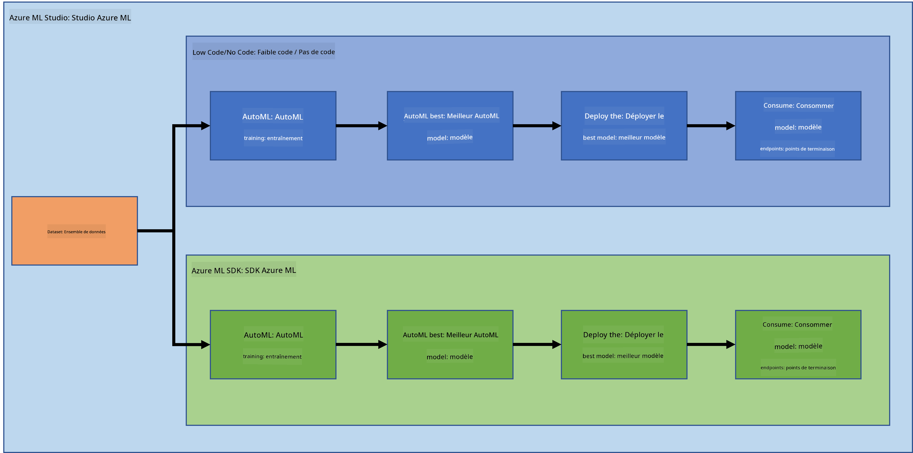

Chaque méthode a ses avantages et inconvénients. La méthode Low code/No code est plus facile à démarrer car elle implique une interaction avec une interface graphique (GUI), sans nécessiter de connaissances préalables en programmation. Cette méthode permet de tester rapidement la viabilité du projet et de créer un POC (Proof Of Concept). Cependant, à mesure que le projet grandit et que les choses doivent être prêtes pour la production, il devient difficile de créer des ressources via une interface graphique. Il est alors nécessaire d'automatiser tout le processus de manière programmatique, de la création des ressources au déploiement du modèle. C'est là que la maîtrise du SDK Azure ML devient essentielle.

|                   | Low code/No code | SDK Azure ML              |
|-------------------|------------------|---------------------------|
| Expertise en code | Non requise      | Requise                   |
| Temps de développement | Rapide et facile | Dépend de l'expertise en code |
| Prêt pour la production | Non               | Oui                       |

### 1.3 Le jeu de données sur les insuffisances cardiaques : 

Les maladies cardiovasculaires (MCV) sont la première cause de mortalité dans le monde, représentant 31 % de tous les décès. Les facteurs de risque environnementaux et comportementaux tels que l'utilisation du tabac, une alimentation malsaine et l'obésité, l'inactivité physique et la consommation excessive d'alcool peuvent être utilisés comme caractéristiques pour des modèles d'estimation. Être capable d'estimer la probabilité de développement d'une MCV pourrait être très utile pour prévenir les attaques chez les personnes à haut risque.

Kaggle a mis à disposition un [jeu de données sur les insuffisances cardiaques](https://www.kaggle.com/andrewmvd/heart-failure-clinical-data) que nous allons utiliser pour ce projet. Vous pouvez télécharger le jeu de données dès maintenant. Il s'agit d'un jeu de données tabulaire avec 13 colonnes (12 caractéristiques et 1 variable cible) et 299 lignes. 

|    | Nom de la variable         | Type            | Description                                               | Exemple           |
|----|---------------------------|-----------------|-----------------------------------------------------------|-------------------|
| 1  | age                       | numérique       | âge du patient                                            | 25                |
| 2  | anaemia                   | booléen         | Diminution des globules rouges ou de l'hémoglobine        | 0 ou 1            |
| 3  | creatinine_phosphokinase  | numérique       | Niveau de l'enzyme CPK dans le sang                       | 542               |
| 4  | diabetes                  | booléen         | Si le patient est diabétique                              | 0 ou 1            |
| 5  | ejection_fraction         | numérique       | Pourcentage de sang quittant le cœur à chaque contraction | 45                |
| 6  | high_blood_pressure       | booléen         | Si le patient est hypertendu                              | 0 ou 1            |
| 7  | platelets                 | numérique       | Plaquettes dans le sang                                   | 149000            |
| 8  | serum_creatinine          | numérique       | Niveau de créatinine sérique dans le sang                 | 0.5               |
| 9  | serum_sodium              | numérique       | Niveau de sodium sérique dans le sang                    | jun               |
| 10 | sex                       | booléen         | femme ou homme                                            | 0 ou 1            |
| 11 | smoking                   | booléen         | Si le patient fume                                        | 0 ou 1            |
| 12 | time                      | numérique       | période de suivi (jours)                                  | 4                 |
|----|---------------------------|-----------------|-----------------------------------------------------------|-------------------|
| 21 | DEATH_EVENT [Cible]       | booléen         | si le patient décède pendant la période de suivi          | 0 ou 1            |

Une fois que vous avez le jeu de données, nous pouvons commencer le projet dans Azure.

## 2. Entraînement Low code/No code d'un modèle dans Azure ML Studio
### 2.1 Créer un espace de travail Azure ML
Pour entraîner un modèle dans Azure ML, vous devez d'abord créer un espace de travail Azure ML. L'espace de travail est la ressource de niveau supérieur pour Azure Machine Learning, offrant un endroit centralisé pour travailler avec tous les artefacts que vous créez lorsque vous utilisez Azure Machine Learning. L'espace de travail conserve un historique de tous les entraînements, y compris les journaux, les métriques, les résultats et une capture instantanée de vos scripts. Vous utilisez ces informations pour déterminer quel entraînement produit le meilleur modèle. [En savoir plus](https://docs.microsoft.com/azure/machine-learning/concept-workspace?WT.mc_id=academic-77958-bethanycheum&ocid=AID3041109)

Il est recommandé d'utiliser le navigateur le plus à jour compatible avec votre système d'exploitation. Les navigateurs suivants sont pris en charge :

- Microsoft Edge (Le nouveau Microsoft Edge, dernière version. Pas Microsoft Edge legacy)
- Safari (dernière version, uniquement sur Mac)
- Chrome (dernière version)
- Firefox (dernière version)

Pour utiliser Azure Machine Learning, créez un espace de travail dans votre abonnement Azure. Vous pouvez ensuite utiliser cet espace de travail pour gérer les données, les ressources de calcul, le code, les modèles et autres artefacts liés à vos charges de travail de machine learning.

> **_NOTE :_** Votre abonnement Azure sera facturé un petit montant pour le stockage des données tant que l'espace de travail Azure Machine Learning existe dans votre abonnement. Nous vous recommandons donc de supprimer l'espace de travail Azure Machine Learning lorsque vous ne l'utilisez plus.

1. Connectez-vous au [portail Azure](https://ms.portal.azure.com/) en utilisant les identifiants Microsoft associés à votre abonnement Azure.
2. Sélectionnez **＋Créer une ressource**
   
   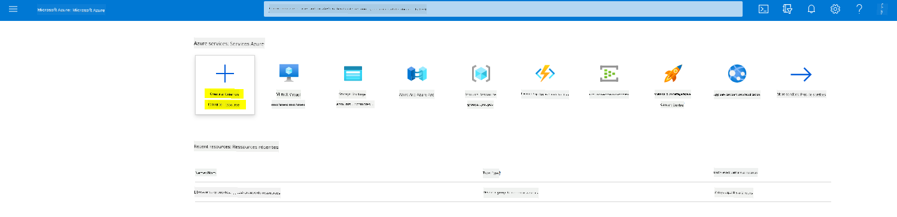

   Recherchez Machine Learning et sélectionnez la tuile Machine Learning

   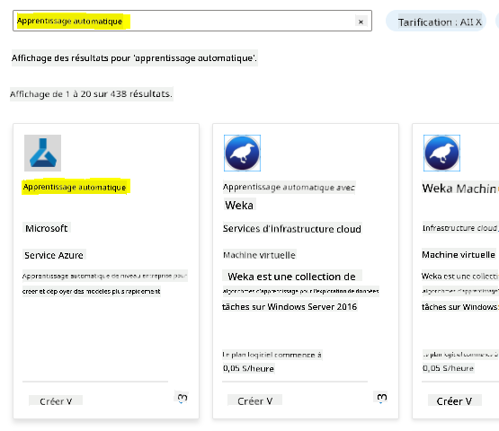

   Cliquez sur le bouton créer

   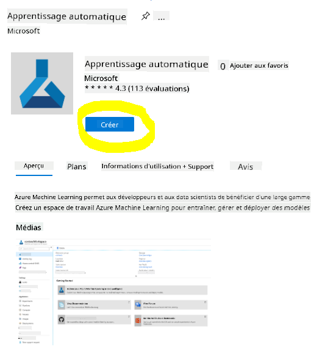

   Remplissez les paramètres comme suit :
   - Abonnement : Votre abonnement Azure
   - Groupe de ressources : Créez ou sélectionnez un groupe de ressources
   - Nom de l'espace de travail : Entrez un nom unique pour votre espace de travail
   - Région : Sélectionnez la région géographique la plus proche de vous
   - Compte de stockage : Notez le nouveau compte de stockage par défaut qui sera créé pour votre espace de travail
   - Key vault : Notez le nouveau key vault par défaut qui sera créé pour votre espace de travail
   - Application insights : Notez la nouvelle ressource Application Insights par défaut qui sera créée pour votre espace de travail
   - Registre de conteneurs : Aucun (un sera créé automatiquement la première fois que vous déployez un modèle dans un conteneur)

    

   - Cliquez sur créer + examiner, puis sur le bouton créer
3. Attendez que votre espace de travail soit créé (cela peut prendre quelques minutes). Ensuite, accédez-y dans le portail. Vous pouvez le trouver via le service Azure Machine Learning.
4. Sur la page Vue d'ensemble de votre espace de travail, lancez Azure Machine Learning Studio (ou ouvrez un nouvel onglet de navigateur et accédez à https://ml.azure.com), et connectez-vous à Azure Machine Learning Studio en utilisant votre compte Microsoft. Si nécessaire, sélectionnez votre répertoire et abonnement Azure, ainsi que votre espace de travail Azure Machine Learning.
   
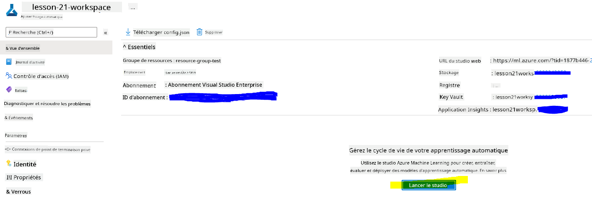

5. Dans Azure Machine Learning Studio, basculez l'icône ☰ en haut à gauche pour afficher les différentes pages de l'interface. Vous pouvez utiliser ces pages pour gérer les ressources de votre espace de travail.


Vous pouvez gérer votre espace de travail en utilisant le portail Azure, mais pour les data scientists et les ingénieurs en opérations de machine learning, Azure Machine Learning Studio offre une interface utilisateur plus ciblée pour gérer les ressources de l'espace de travail.

### 2.2 Ressources de calcul

Les ressources de calcul sont des ressources basées sur le cloud sur lesquelles vous pouvez exécuter des processus d'entraînement de modèles et d'exploration de données. Il existe quatre types de ressources de calcul que vous pouvez créer :

- **Instances de calcul** : Stations de travail de développement que les data scientists peuvent utiliser pour travailler avec des données et des modèles. Cela implique la création d'une machine virtuelle (VM) et le lancement d'une instance de notebook. Vous pouvez ensuite entraîner un modèle en appelant un cluster de calcul depuis le notebook.
- **Clusters de calcul** : Clusters évolutifs de machines virtuelles pour le traitement à la demande du code d'expérience. Vous en aurez besoin pour entraîner un modèle. Les clusters de calcul peuvent également utiliser des ressources spécialisées GPU ou CPU.
- **Clusters d'inférence** : Cibles de déploiement pour les services prédictifs utilisant vos modèles entraînés.
- **Compute attaché** : Liens vers des ressources de calcul Azure existantes, telles que des machines virtuelles ou des clusters Azure Databricks.

#### 2.2.1 Choisir les bonnes options pour vos ressources de calcul

Certains facteurs clés doivent être pris en compte lors de la création d'une ressource de calcul, et ces choix peuvent être des décisions critiques à prendre.

**Avez-vous besoin d'un CPU ou d'un GPU ?**

Un CPU (Unité Centrale de Traitement) est le circuit électronique qui exécute les instructions d'un programme informatique. Un GPU (Unité de Traitement Graphique) est un circuit électronique spécialisé capable d'exécuter du code lié aux graphiques à une vitesse très élevée.

La principale différence entre l'architecture CPU et GPU est qu'un CPU est conçu pour gérer rapidement une large gamme de tâches (mesurée par la vitesse d'horloge du CPU), mais il est limité dans la simultanéité des tâches pouvant être exécutées. Les GPU sont conçus pour le calcul parallèle et sont donc beaucoup plus efficaces pour les tâches d'apprentissage profond.

| CPU                                     | GPU                         |
|-----------------------------------------|-----------------------------|
| Moins cher                              | Plus cher                   |
| Niveau de simultanéité inférieur        | Niveau de simultanéité élevé |
| Plus lent pour entraîner des modèles    | Optimal pour l'apprentissage profond |

**Taille du cluster**

Les clusters plus grands sont plus coûteux mais offrent une meilleure réactivité. Ainsi, si vous avez du temps mais un budget limité, commencez par un petit cluster. À l'inverse, si vous avez un budget mais peu de temps, optez pour un cluster plus grand.

**Taille de la VM**

En fonction de vos contraintes de temps et de budget, vous pouvez ajuster la taille de votre RAM, disque, nombre de cœurs et vitesse d'horloge. Augmenter tous ces paramètres sera plus coûteux, mais améliorera les performances.

**Instances dédiées ou à faible priorité ?**

Une instance à faible priorité signifie qu'elle est interruptible : Microsoft Azure peut récupérer ces ressources et les attribuer à une autre tâche, interrompant ainsi un travail. Une instance dédiée, ou non interruptible, garantit que le travail ne sera jamais arrêté sans votre autorisation. 
C'est une autre considération entre temps et argent, car les instances interruptibles sont moins coûteuses que les instances dédiées.

#### 2.2.2 Créer un cluster de calcul

Dans le [workspace Azure ML](https://ml.azure.com/) que nous avons créé précédemment, allez dans la section "Compute" et vous pourrez voir les différentes ressources de calcul que nous venons de discuter (c'est-à-dire instances de calcul, clusters de calcul, clusters d'inférence et calcul attaché). Pour ce projet, nous aurons besoin d'un cluster de calcul pour l'entraînement du modèle. Dans Studio, cliquez sur le menu "Compute", puis sur l'onglet "Compute cluster" et cliquez sur le bouton "+ New" pour créer un cluster de calcul.

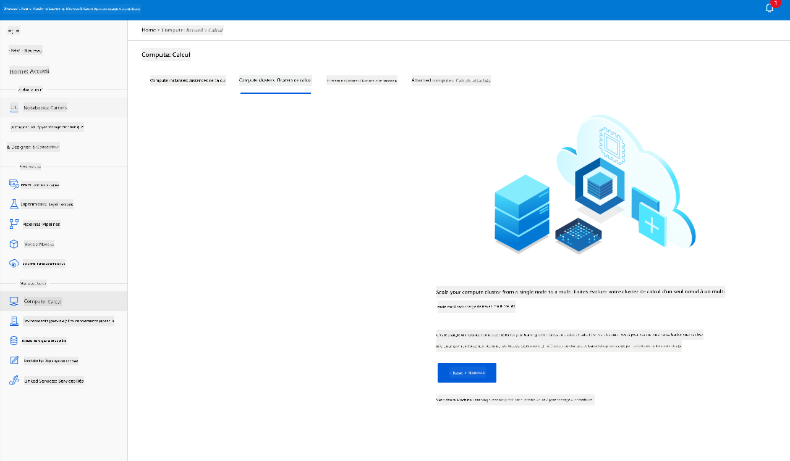

1. Choisissez vos options : Dédié ou faible priorité, CPU ou GPU, taille de la VM et nombre de cœurs (vous pouvez conserver les paramètres par défaut pour ce projet).
2. Cliquez sur le bouton "Next".

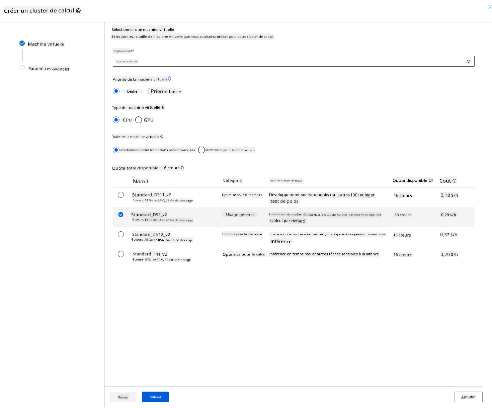

3. Donnez un nom au cluster de calcul.
4. Choisissez vos options : Nombre minimum/maximum de nœuds, secondes d'inactivité avant réduction, accès SSH. Notez que si le nombre minimum de nœuds est 0, vous économiserez de l'argent lorsque le cluster est inactif. Notez que plus le nombre de nœuds maximum est élevé, plus l'entraînement sera rapide. Le nombre maximum de nœuds recommandé est de 3.  
5. Cliquez sur le bouton "Create". Cette étape peut prendre quelques minutes.

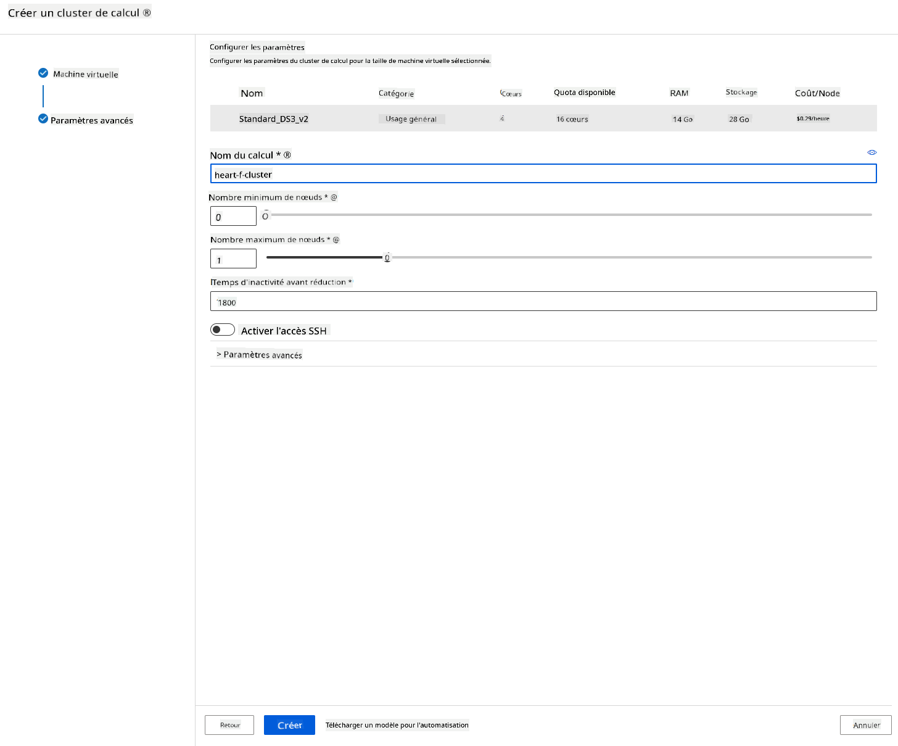

Super ! Maintenant que nous avons un cluster de calcul, nous devons charger les données dans Azure ML Studio.

### 2.3 Charger le jeu de données

1. Dans le [workspace Azure ML](https://ml.azure.com/) que nous avons créé précédemment, cliquez sur "Datasets" dans le menu de gauche et cliquez sur le bouton "+ Create dataset" pour créer un jeu de données. Choisissez l'option "From local files" et sélectionnez le jeu de données Kaggle que nous avons téléchargé précédemment.
   
   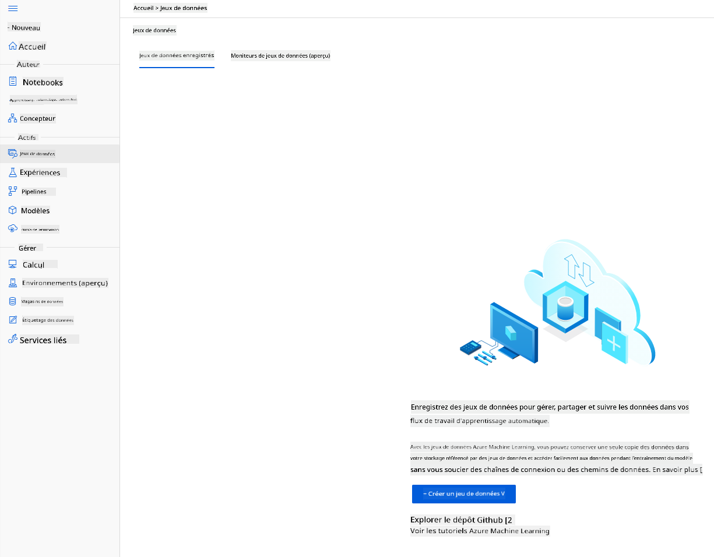

2. Donnez un nom, un type et une description à votre jeu de données. Cliquez sur "Next". Téléchargez les données à partir des fichiers. Cliquez sur "Next".
   
   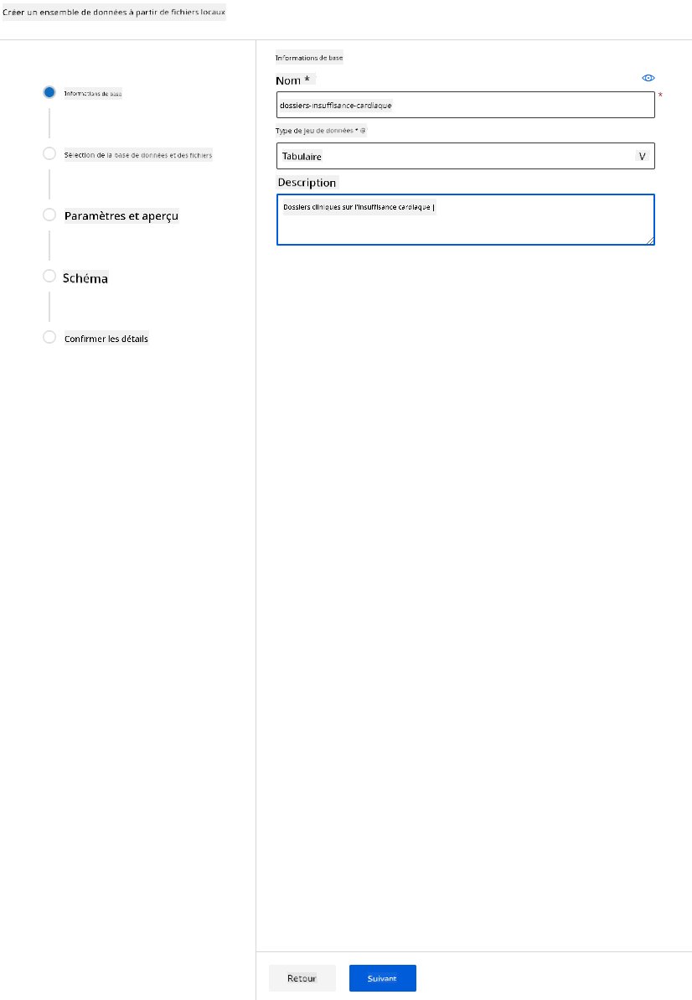

3. Dans le schéma, changez le type de données en Booléen pour les caractéristiques suivantes : anaemia, diabetes, high blood pressure, sex, smoking, et DEATH_EVENT. Cliquez sur "Next" puis sur "Create".
   
   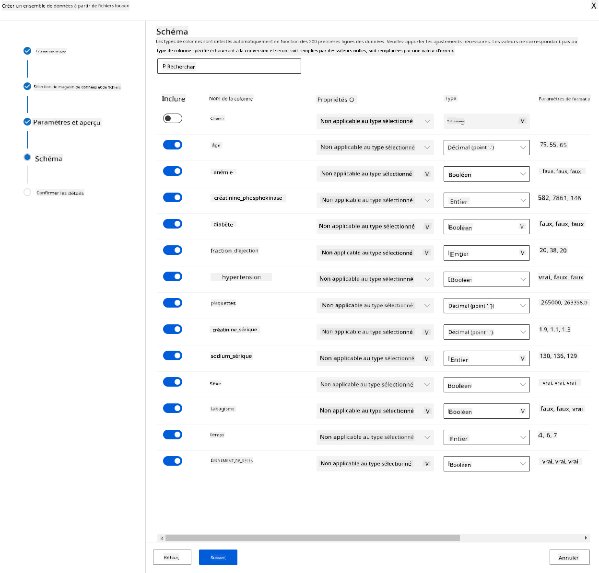

Génial ! Maintenant que le jeu de données est en place et que le cluster de calcul est créé, nous pouvons commencer l'entraînement du modèle !

### 2.4 Entraînement Low code/No code avec AutoML 

Le développement traditionnel de modèles d'apprentissage automatique est intensif en ressources, nécessite des connaissances approfondies et du temps pour produire et comparer des dizaines de modèles. 
L'apprentissage automatique automatisé (AutoML) est le processus d'automatisation des tâches itératives et chronophages du développement de modèles d'apprentissage automatique. Il permet aux data scientists, analystes et développeurs de créer des modèles ML à grande échelle, avec efficacité et productivité, tout en maintenant la qualité des modèles. Cela réduit le temps nécessaire pour obtenir des modèles ML prêts pour la production, avec une grande facilité et efficacité. [En savoir plus](https://docs.microsoft.com/azure/machine-learning/concept-automated-ml?WT.mc_id=academic-77958-bethanycheum&ocid=AID3041109)

1. Dans le [workspace Azure ML](https://ml.azure.com/) que nous avons créé précédemment, cliquez sur "Automated ML" dans le menu de gauche et sélectionnez le jeu de données que vous venez de télécharger. Cliquez sur "Next".

   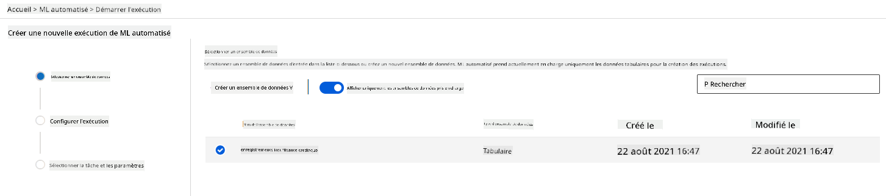

2.  Entrez un nouveau nom d'expérience, la colonne cible (DEATH_EVENT) et le cluster de calcul que nous avons créé. Cliquez sur "Next".
   
   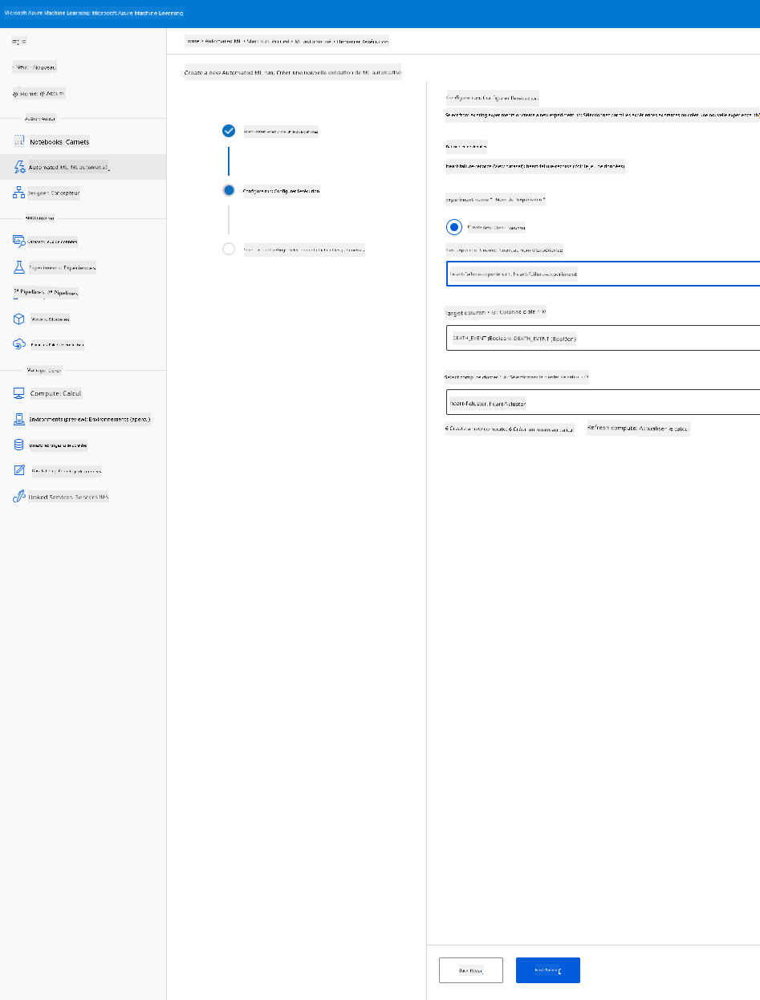

3. Choisissez "Classification" et cliquez sur "Finish". Cette étape peut prendre entre 30 minutes et 1 heure, selon la taille de votre cluster de calcul.
    
    

4. Une fois l'exécution terminée, cliquez sur l'onglet "Automated ML", cliquez sur votre exécution, puis cliquez sur l'algorithme dans la carte "Best model summary".
    
    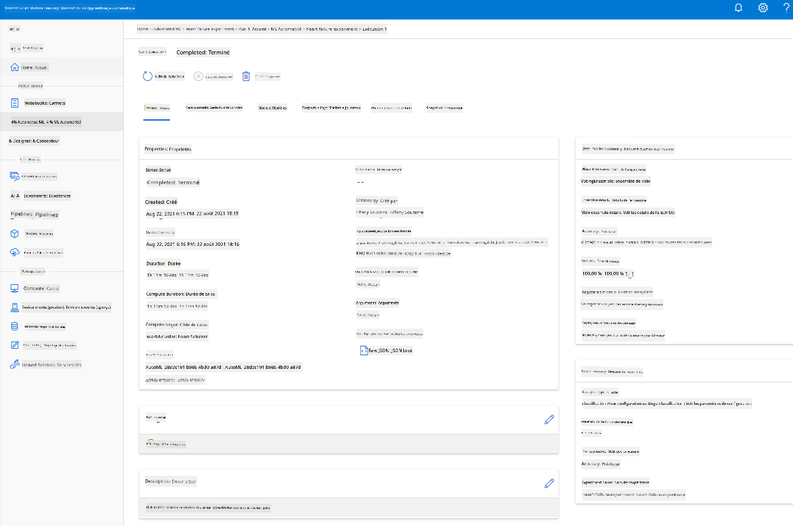

Ici, vous pouvez voir une description détaillée du meilleur modèle généré par AutoML. Vous pouvez également explorer d'autres modèles générés dans l'onglet "Models". Prenez quelques minutes pour explorer les modèles dans le bouton "Explanations (preview)". Une fois que vous avez choisi le modèle que vous souhaitez utiliser (ici nous choisirons le meilleur modèle sélectionné par AutoML), nous verrons comment le déployer.

## 3. Déploiement et consommation du modèle Low code/No code
### 3.1 Déploiement du modèle

L'interface d'apprentissage automatique automatisé vous permet de déployer le meilleur modèle en tant que service web en quelques étapes. Le déploiement est l'intégration du modèle afin qu'il puisse faire des prédictions basées sur de nouvelles données et identifier des opportunités potentielles. Pour ce projet, le déploiement en tant que service web signifie que les applications médicales pourront consommer le modèle pour faire des prédictions en direct sur le risque de crise cardiaque de leurs patients.

Dans la description du meilleur modèle, cliquez sur le bouton "Deploy".
    
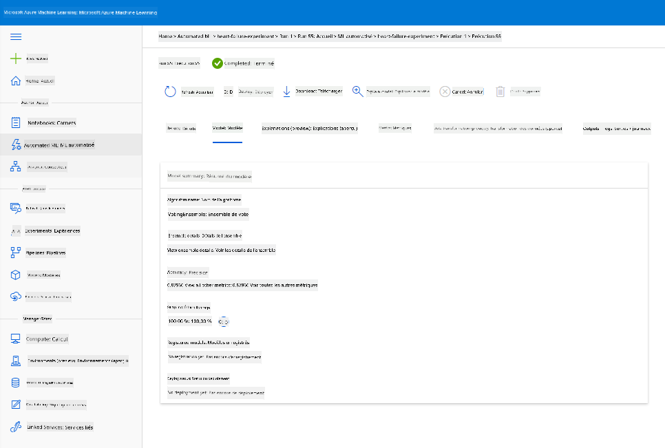

15. Donnez-lui un nom, une description, un type de calcul (Azure Container Instance), activez l'authentification et cliquez sur "Deploy". Cette étape peut prendre environ 20 minutes. Le processus de déploiement comprend plusieurs étapes, notamment l'enregistrement du modèle, la génération de ressources et leur configuration pour le service web. Un message de statut apparaît sous "Deploy status". Sélectionnez "Refresh" périodiquement pour vérifier le statut du déploiement. Il est déployé et opérationnel lorsque le statut est "Healthy".

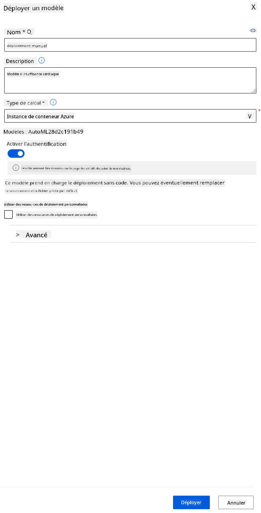

16. Une fois déployé, cliquez sur l'onglet "Endpoint" et cliquez sur l'endpoint que vous venez de déployer. Vous pouvez y trouver tous les détails nécessaires sur l'endpoint. 


Incroyable ! Maintenant que nous avons un modèle déployé, nous pouvons commencer la consommation de l'endpoint.

### 3.2 Consommation de l'endpoint

Cliquez sur l'onglet "Consume". Ici, vous pouvez trouver l'endpoint REST et un script Python dans l'option de consommation. Prenez le temps de lire le code Python. 

Ce script peut être exécuté directement depuis votre machine locale et consommera votre endpoint.

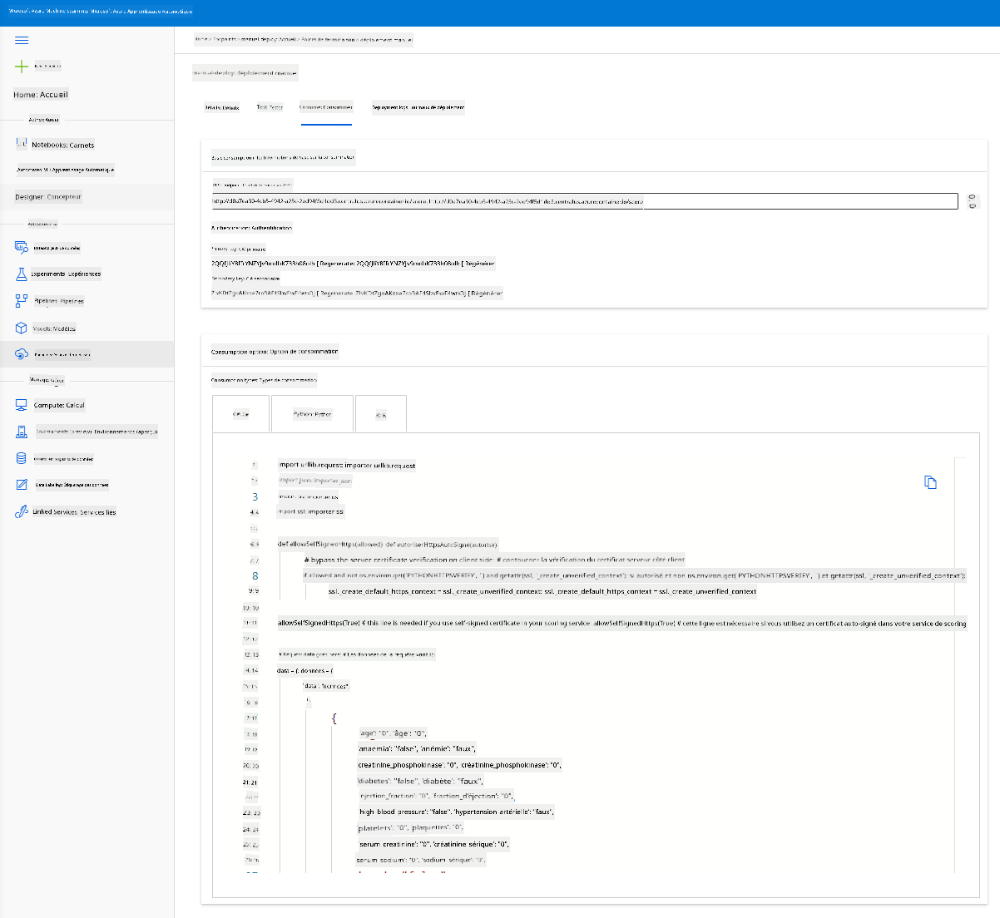

Prenez un moment pour vérifier ces 2 lignes de code : 

```python
url = 'http://98e3715f-xxxx-xxxx-xxxx-9ec22d57b796.centralus.azurecontainer.io/score'
api_key = '' # Replace this with the API key for the web service
```
La variable `url` est l'endpoint REST trouvé dans l'onglet de consommation et la variable `api_key` est la clé primaire également trouvée dans l'onglet de consommation (uniquement si vous avez activé l'authentification). C'est ainsi que le script peut consommer l'endpoint.

18. En exécutant le script, vous devriez voir la sortie suivante :
    ```python
    b'"{\\"result\\": [true]}"'
    ```
Cela signifie que la prédiction de l'insuffisance cardiaque pour les données fournies est vraie. Cela a du sens car si vous regardez de plus près les données générées automatiquement dans le script, tout est à 0 et faux par défaut. Vous pouvez modifier les données avec l'exemple d'entrée suivant :

```python
data = {
    "data":
    [
        {
            'age': "0",
            'anaemia': "false",
            'creatinine_phosphokinase': "0",
            'diabetes': "false",
            'ejection_fraction': "0",
            'high_blood_pressure': "false",
            'platelets': "0",
            'serum_creatinine': "0",
            'serum_sodium': "0",
            'sex': "false",
            'smoking': "false",
            'time': "0",
        },
        {
            'age': "60",
            'anaemia': "false",
            'creatinine_phosphokinase': "500",
            'diabetes': "false",
            'ejection_fraction': "38",
            'high_blood_pressure': "false",
            'platelets': "260000",
            'serum_creatinine': "1.40",
            'serum_sodium': "137",
            'sex': "false",
            'smoking': "false",
            'time': "130",
        },
    ],
}
```
Le script devrait retourner :
    ```python
    b'"{\\"result\\": [true, false]}"'
    ```

Félicitations ! Vous venez de consommer le modèle déployé et de l'entraîner sur Azure ML !

> **_NOTE:_** Une fois le projet terminé, n'oubliez pas de supprimer toutes les ressources.
## 🚀 Défi

Examinez attentivement les explications et les détails du modèle générés par AutoML pour les meilleurs modèles. Essayez de comprendre pourquoi le meilleur modèle est meilleur que les autres. Quels algorithmes ont été comparés ? Quelles sont les différences entre eux ? Pourquoi le meilleur modèle est-il plus performant dans ce cas ?

## [Quiz post-lecture](https://ff-quizzes.netlify.app/en/ds/)

## Révision et auto-apprentissage

Dans cette leçon, vous avez appris à entraîner, déployer et consommer un modèle pour prédire le risque d'insuffisance cardiaque de manière Low code/No code dans le cloud. Si vous ne l'avez pas encore fait, explorez en profondeur les explications du modèle générées par AutoML pour les meilleurs modèles et essayez de comprendre pourquoi le meilleur modèle est meilleur que les autres.

Vous pouvez approfondir le sujet du Low code/No code AutoML en lisant cette [documentation](https://docs.microsoft.com/azure/machine-learning/tutorial-first-experiment-automated-ml?WT.mc_id=academic-77958-bethanycheum&ocid=AID3041109).

## Devoir

[Projet Data Science Low code/No code sur Azure ML](assignment.md)

---

**Avertissement** :  
Ce document a été traduit à l'aide du service de traduction automatique [Co-op Translator](https://github.com/Azure/co-op-translator). Bien que nous nous efforcions d'assurer l'exactitude, veuillez noter que les traductions automatisées peuvent contenir des erreurs ou des inexactitudes. Le document original dans sa langue d'origine doit être considéré comme la source faisant autorité. Pour des informations critiques, il est recommandé de faire appel à une traduction humaine professionnelle. Nous déclinons toute responsabilité en cas de malentendus ou d'interprétations erronées résultant de l'utilisation de cette traduction.