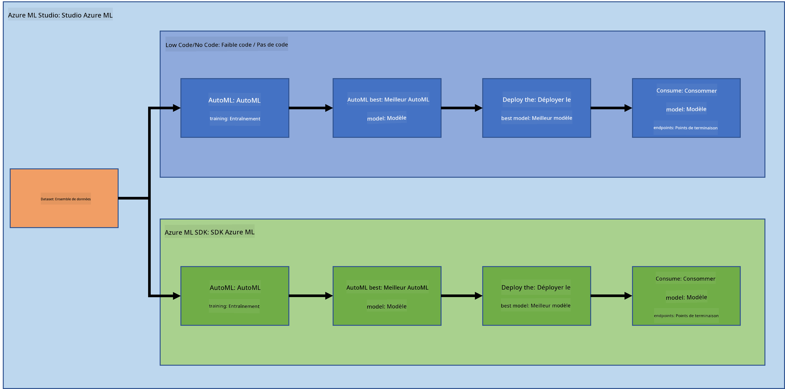
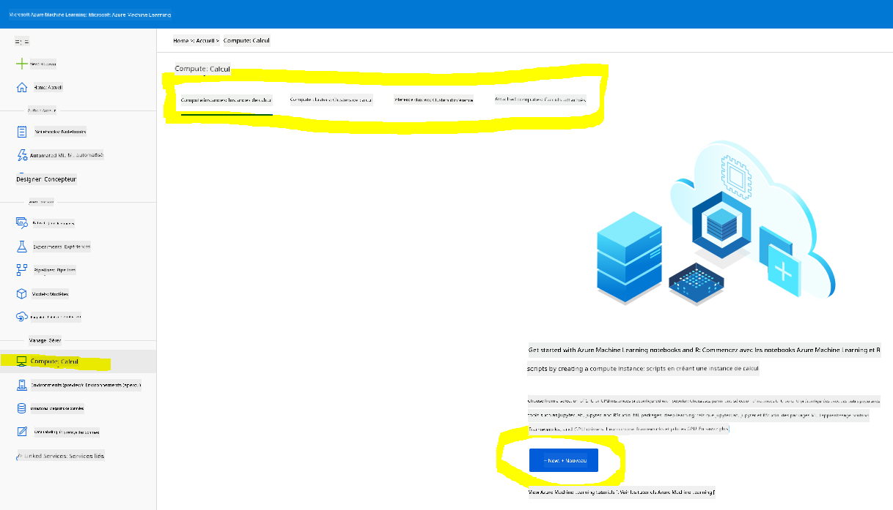
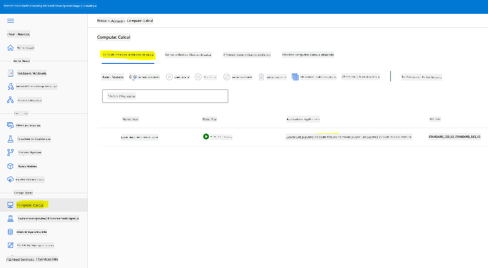
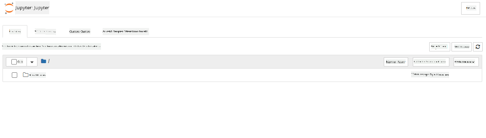

<!--
CO_OP_TRANSLATOR_METADATA:
{
  "original_hash": "5da2d6b3736f6d668b89de9bf3bdd31b",
  "translation_date": "2025-09-04T12:56:10+00:00",
  "source_file": "5-Data-Science-In-Cloud/19-Azure/README.md",
  "language_code": "fr"
}
-->
# La science des données dans le cloud : La méthode "Azure ML SDK"

| ](../../sketchnotes/19-DataScience-Cloud.png)|
|:---:|
| Science des données dans le cloud : Azure ML SDK - _Sketchnote par [@nitya](https://twitter.com/nitya)_ |

Table des matières :

- [La science des données dans le cloud : La méthode "Azure ML SDK"](../../../../5-Data-Science-In-Cloud/19-Azure)
  - [Quiz avant le cours](../../../../5-Data-Science-In-Cloud/19-Azure)
  - [1. Introduction](../../../../5-Data-Science-In-Cloud/19-Azure)
    - [1.1 Qu'est-ce que l'Azure ML SDK ?](../../../../5-Data-Science-In-Cloud/19-Azure)
    - [1.2 Présentation du projet et du jeu de données pour la prédiction d'insuffisance cardiaque](../../../../5-Data-Science-In-Cloud/19-Azure)
  - [2. Entraîner un modèle avec Azure ML SDK](../../../../5-Data-Science-In-Cloud/19-Azure)
    - [2.1 Créer un espace de travail Azure ML](../../../../5-Data-Science-In-Cloud/19-Azure)
    - [2.2 Créer une instance de calcul](../../../../5-Data-Science-In-Cloud/19-Azure)
    - [2.3 Charger le jeu de données](../../../../5-Data-Science-In-Cloud/19-Azure)
    - [2.4 Créer des notebooks](../../../../5-Data-Science-In-Cloud/19-Azure)
    - [2.5 Entraîner un modèle](../../../../5-Data-Science-In-Cloud/19-Azure)
      - [2.5.1 Configurer l'espace de travail, l'expérience, le cluster de calcul et le jeu de données](../../../../5-Data-Science-In-Cloud/19-Azure)
      - [2.5.2 Configuration et entraînement AutoML](../../../../5-Data-Science-In-Cloud/19-Azure)
  - [3. Déploiement du modèle et consommation de l'endpoint avec Azure ML SDK](../../../../5-Data-Science-In-Cloud/19-Azure)
    - [3.1 Sauvegarder le meilleur modèle](../../../../5-Data-Science-In-Cloud/19-Azure)
    - [3.2 Déploiement du modèle](../../../../5-Data-Science-In-Cloud/19-Azure)
    - [3.3 Consommation de l'endpoint](../../../../5-Data-Science-In-Cloud/19-Azure)
  - [🚀 Défi](../../../../5-Data-Science-In-Cloud/19-Azure)
  - [Quiz après le cours](../../../../5-Data-Science-In-Cloud/19-Azure)
  - [Révision et auto-apprentissage](../../../../5-Data-Science-In-Cloud/19-Azure)
  - [Devoir](../../../../5-Data-Science-In-Cloud/19-Azure)

## [Quiz avant le cours](https://purple-hill-04aebfb03.1.azurestaticapps.net/quiz/36)

## 1. Introduction

### 1.1 Qu'est-ce que l'Azure ML SDK ?

Les data scientists et les développeurs en IA utilisent le SDK Azure Machine Learning pour construire et exécuter des workflows de machine learning avec le service Azure Machine Learning. Vous pouvez interagir avec le service dans n'importe quel environnement Python, y compris Jupyter Notebooks, Visual Studio Code ou votre IDE Python préféré.

Les domaines clés du SDK incluent :

- Explorer, préparer et gérer le cycle de vie de vos jeux de données utilisés dans les expériences de machine learning.
- Gérer les ressources cloud pour surveiller, journaliser et organiser vos expériences de machine learning.
- Entraîner des modèles localement ou en utilisant des ressources cloud, y compris l'entraînement de modèles accélérés par GPU.
- Utiliser le machine learning automatisé, qui accepte des paramètres de configuration et des données d'entraînement. Il itère automatiquement à travers les algorithmes et les réglages d'hyperparamètres pour trouver le meilleur modèle pour effectuer des prédictions.
- Déployer des services web pour transformer vos modèles entraînés en services RESTful consommables dans n'importe quelle application.

[En savoir plus sur le SDK Azure Machine Learning](https://docs.microsoft.com/python/api/overview/azure/ml?WT.mc_id=academic-77958-bethanycheum&ocid=AID3041109)

Dans la [leçon précédente](../18-Low-Code/README.md), nous avons vu comment entraîner, déployer et consommer un modèle de manière Low code/No code. Nous avons utilisé le jeu de données sur l'insuffisance cardiaque pour générer un modèle de prédiction. Dans cette leçon, nous allons faire exactement la même chose, mais en utilisant le SDK Azure Machine Learning.



### 1.2 Présentation du projet et du jeu de données pour la prédiction d'insuffisance cardiaque

Consultez [ici](../18-Low-Code/README.md) la présentation du projet et du jeu de données pour la prédiction d'insuffisance cardiaque.

## 2. Entraîner un modèle avec Azure ML SDK

### 2.1 Créer un espace de travail Azure ML

Pour simplifier, nous allons travailler sur un notebook Jupyter. Cela suppose que vous avez déjà un espace de travail et une instance de calcul. Si vous avez déjà un espace de travail, vous pouvez passer directement à la section 2.3 Création de notebook.

Sinon, veuillez suivre les instructions de la section **2.1 Créer un espace de travail Azure ML** dans la [leçon précédente](../18-Low-Code/README.md) pour créer un espace de travail.

### 2.2 Créer une instance de calcul

Dans l'[espace de travail Azure ML](https://ml.azure.com/) que nous avons créé précédemment, allez dans le menu de calcul et vous verrez les différentes ressources de calcul disponibles.



Créons une instance de calcul pour provisionner un notebook Jupyter.  
1. Cliquez sur le bouton + Nouveau.  
2. Donnez un nom à votre instance de calcul.  
3. Choisissez vos options : CPU ou GPU, taille de la machine virtuelle et nombre de cœurs.  
4. Cliquez sur le bouton Créer.  

Félicitations, vous venez de créer une instance de calcul ! Nous utiliserons cette instance pour créer un notebook dans la [section Création de notebooks](../../../../5-Data-Science-In-Cloud/19-Azure).

### 2.3 Charger le jeu de données

Référez-vous à la [leçon précédente](../18-Low-Code/README.md) dans la section **2.3 Charger le jeu de données** si vous n'avez pas encore téléchargé le jeu de données.

### 2.4 Créer des notebooks

> **_NOTE :_** Pour l'étape suivante, vous pouvez soit créer un nouveau notebook à partir de zéro, soit télécharger le [notebook que nous avons créé](notebook.ipynb) dans votre Azure ML Studio. Pour le télécharger, cliquez simplement sur le menu "Notebook" et téléchargez le fichier.

Les notebooks sont une partie essentielle du processus de science des données. Ils peuvent être utilisés pour effectuer une analyse exploratoire des données (EDA), appeler un cluster de calcul pour entraîner un modèle, ou appeler un cluster d'inférence pour déployer un endpoint.

Pour créer un notebook, nous avons besoin d'un nœud de calcul qui héberge l'instance Jupyter Notebook. Retournez à l'[espace de travail Azure ML](https://ml.azure.com/) et cliquez sur Instances de calcul. Dans la liste des instances, vous devriez voir [l'instance que nous avons créée précédemment](../../../../5-Data-Science-In-Cloud/19-Azure).

1. Dans la section Applications, cliquez sur l'option Jupyter.  
2. Cochez la case "Oui, je comprends" et cliquez sur le bouton Continuer.  
  
3. Cela ouvrira un nouvel onglet de navigateur avec votre instance Jupyter Notebook. Cliquez sur le bouton "Nouveau" pour créer un notebook.  



Maintenant que nous avons un notebook, nous pouvons commencer à entraîner le modèle avec Azure ML SDK.

### 2.5 Entraîner un modèle

Tout d'abord, en cas de doute, référez-vous à la [documentation Azure ML SDK](https://docs.microsoft.com/python/api/overview/azure/ml?WT.mc_id=academic-77958-bethanycheum&ocid=AID3041109). Elle contient toutes les informations nécessaires pour comprendre les modules que nous allons utiliser dans cette leçon.

#### 2.5.1 Configurer l'espace de travail, l'expérience, le cluster de calcul et le jeu de données

Vous devez charger l'`espace de travail` à partir du fichier de configuration en utilisant le code suivant :

```python
from azureml.core import Workspace
ws = Workspace.from_config()
```

Cela renvoie un objet de type `Workspace` qui représente l'espace de travail. Ensuite, vous devez créer une `expérience` en utilisant le code suivant :

```python
from azureml.core import Experiment
experiment_name = 'aml-experiment'
experiment = Experiment(ws, experiment_name)
```

Pour obtenir ou créer une expérience à partir d'un espace de travail, vous demandez l'expérience en utilisant son nom. Le nom de l'expérience doit comporter entre 3 et 36 caractères, commencer par une lettre ou un chiffre, et ne contenir que des lettres, des chiffres, des traits de soulignement et des tirets. Si l'expérience n'est pas trouvée dans l'espace de travail, une nouvelle expérience est créée.

Ensuite, vous devez créer un cluster de calcul pour l'entraînement en utilisant le code suivant. Notez que cette étape peut prendre quelques minutes.

```python
from azureml.core.compute import AmlCompute

aml_name = "heart-f-cluster"
try:
    aml_compute = AmlCompute(ws, aml_name)
    print('Found existing AML compute context.')
except:
    print('Creating new AML compute context.')
    aml_config = AmlCompute.provisioning_configuration(vm_size = "Standard_D2_v2", min_nodes=1, max_nodes=3)
    aml_compute = AmlCompute.create(ws, name = aml_name, provisioning_configuration = aml_config)
    aml_compute.wait_for_completion(show_output = True)

cts = ws.compute_targets
compute_target = cts[aml_name]
```

Vous pouvez obtenir le jeu de données à partir de l'espace de travail en utilisant le nom du jeu de données de la manière suivante :

```python
dataset = ws.datasets['heart-failure-records']
df = dataset.to_pandas_dataframe()
df.describe()
```

#### 2.5.2 Configuration et entraînement AutoML

Pour configurer AutoML, utilisez la classe [AutoMLConfig](https://docs.microsoft.com/python/api/azureml-train-automl-client/azureml.train.automl.automlconfig(class)?WT.mc_id=academic-77958-bethanycheum&ocid=AID3041109).

Comme décrit dans la documentation, il existe de nombreux paramètres avec lesquels vous pouvez jouer. Pour ce projet, nous utiliserons les paramètres suivants :

- `experiment_timeout_minutes` : Durée maximale (en minutes) pendant laquelle l'expérience peut s'exécuter avant d'être automatiquement arrêtée et que les résultats soient disponibles.  
- `max_concurrent_iterations` : Nombre maximal d'itérations d'entraînement simultanées autorisées pour l'expérience.  
- `primary_metric` : Métrique principale utilisée pour déterminer le statut de l'expérience.  
- `compute_target` : Ressource de calcul Azure Machine Learning utilisée pour exécuter l'expérience AutoML.  
- `task` : Type de tâche à exécuter. Les valeurs possibles sont 'classification', 'regression' ou 'forecasting' selon le type de problème AutoML à résoudre.  
- `training_data` : Données d'entraînement utilisées dans l'expérience. Elles doivent contenir à la fois les caractéristiques d'entraînement et une colonne d'étiquettes (éventuellement une colonne de poids d'échantillon).  
- `label_column_name` : Nom de la colonne d'étiquettes.  
- `path` : Chemin complet vers le dossier du projet Azure Machine Learning.  
- `enable_early_stopping` : Indique si l'arrêt anticipé doit être activé si le score ne s'améliore pas à court terme.  
- `featurization` : Indicateur pour savoir si l'étape de featurisation doit être effectuée automatiquement ou non, ou si une featurisation personnalisée doit être utilisée.  
- `debug_log` : Fichier journal pour écrire les informations de débogage.  

```python
from azureml.train.automl import AutoMLConfig

project_folder = './aml-project'

automl_settings = {
    "experiment_timeout_minutes": 20,
    "max_concurrent_iterations": 3,
    "primary_metric" : 'AUC_weighted'
}

automl_config = AutoMLConfig(compute_target=compute_target,
                             task = "classification",
                             training_data=dataset,
                             label_column_name="DEATH_EVENT",
                             path = project_folder,  
                             enable_early_stopping= True,
                             featurization= 'auto',
                             debug_log = "automl_errors.log",
                             **automl_settings
                            )
```

Maintenant que votre configuration est définie, vous pouvez entraîner le modèle en utilisant le code suivant. Cette étape peut prendre jusqu'à une heure selon la taille de votre cluster.

```python
remote_run = experiment.submit(automl_config)
```

Vous pouvez exécuter le widget RunDetails pour afficher les différentes expériences.  
```python
from azureml.widgets import RunDetails
RunDetails(remote_run).show()
```

## 3. Déploiement du modèle et consommation de l'endpoint avec Azure ML SDK

### 3.1 Sauvegarder le meilleur modèle

L'objet `remote_run` est de type [AutoMLRun](https://docs.microsoft.com/python/api/azureml-train-automl-client/azureml.train.automl.run.automlrun?WT.mc_id=academic-77958-bethanycheum&ocid=AID3041109). Cet objet contient la méthode `get_output()` qui renvoie la meilleure exécution et le modèle correspondant.

```python
best_run, fitted_model = remote_run.get_output()
```

Vous pouvez voir les paramètres utilisés pour le meilleur modèle en imprimant simplement le `fitted_model` et consulter les propriétés du meilleur modèle en utilisant la méthode [get_properties()](https://docs.microsoft.com/python/api/azureml-core/azureml.core.run(class)?view=azure-ml-py#azureml_core_Run_get_properties?WT.mc_id=academic-77958-bethanycheum&ocid=AID3041109).

```python
best_run.get_properties()
```

Enregistrez maintenant le modèle avec la méthode [register_model](https://docs.microsoft.com/python/api/azureml-train-automl-client/azureml.train.automl.run.automlrun?view=azure-ml-py#register-model-model-name-none--description-none--tags-none--iteration-none--metric-none-?WT.mc_id=academic-77958-bethanycheum&ocid=AID3041109).  
```python
model_name = best_run.properties['model_name']
script_file_name = 'inference/score.py'
best_run.download_file('outputs/scoring_file_v_1_0_0.py', 'inference/score.py')
description = "aml heart failure project sdk"
model = best_run.register_model(model_name = model_name,
                                model_path = './outputs/',
                                description = description,
                                tags = None)
```

### 3.2 Déploiement du modèle

Une fois le meilleur modèle sauvegardé, nous pouvons le déployer avec la classe [InferenceConfig](https://docs.microsoft.com/python/api/azureml-core/azureml.core.model.inferenceconfig?view=azure-ml-py?ocid=AID3041109). InferenceConfig représente les paramètres de configuration pour un environnement personnalisé utilisé pour le déploiement. La classe [AciWebservice](https://docs.microsoft.com/python/api/azureml-core/azureml.core.webservice.aciwebservice?view=azure-ml-py) représente un modèle de machine learning déployé en tant qu'endpoint de service web sur Azure Container Instances. Un service déployé est créé à partir d'un modèle, d'un script et de fichiers associés. Le service web résultant est un endpoint HTTP équilibré avec une API REST. Vous pouvez envoyer des données à cette API et recevoir la prédiction retournée par le modèle.

Le modèle est déployé en utilisant la méthode [deploy](https://docs.microsoft.com/python/api/azureml-core/azureml.core.model(class)?view=azure-ml-py#deploy-workspace--name--models--inference-config-none--deployment-config-none--deployment-target-none--overwrite-false--show-output-false-?WT.mc_id=academic-77958-bethanycheum&ocid=AID3041109).

```python
from azureml.core.model import InferenceConfig, Model
from azureml.core.webservice import AciWebservice

inference_config = InferenceConfig(entry_script=script_file_name, environment=best_run.get_environment())

aciconfig = AciWebservice.deploy_configuration(cpu_cores = 1,
                                               memory_gb = 1,
                                               tags = {'type': "automl-heart-failure-prediction"},
                                               description = 'Sample service for AutoML Heart Failure Prediction')

aci_service_name = 'automl-hf-sdk'
aci_service = Model.deploy(ws, aci_service_name, [model], inference_config, aciconfig)
aci_service.wait_for_deployment(True)
print(aci_service.state)
```

Cette étape devrait prendre quelques minutes.

### 3.3 Consommation de l'endpoint

Vous consommez votre endpoint en créant un exemple d'entrée :

```python
data = {
    "data":
    [
        {
            'age': "60",
            'anaemia': "false",
            'creatinine_phosphokinase': "500",
            'diabetes': "false",
            'ejection_fraction': "38",
            'high_blood_pressure': "false",
            'platelets': "260000",
            'serum_creatinine': "1.40",
            'serum_sodium': "137",
            'sex': "false",
            'smoking': "false",
            'time': "130",
        },
    ],
}

test_sample = str.encode(json.dumps(data))
```

Ensuite, vous pouvez envoyer cette entrée à votre modèle pour obtenir une prédiction :
```python
response = aci_service.run(input_data=test_sample)
response
```
Cela devrait produire `'{"result": [false]}'`. Cela signifie que les données du patient que nous avons envoyées à l'endpoint ont généré la prédiction `false`, ce qui indique que cette personne n'est probablement pas susceptible de faire une crise cardiaque.

Félicitations ! Vous venez d'utiliser le modèle déployé et entraîné sur Azure ML avec le SDK Azure ML !

> **_NOTE:_** Une fois le projet terminé, n'oubliez pas de supprimer toutes les ressources.

## 🚀 Défi

Il y a beaucoup d'autres choses que vous pouvez faire avec le SDK, mais malheureusement, nous ne pouvons pas tout couvrir dans cette leçon. Bonne nouvelle, apprendre à parcourir la documentation du SDK peut vous mener loin en autonomie. Consultez la documentation du SDK Azure ML et trouvez la classe `Pipeline` qui vous permet de créer des pipelines. Un Pipeline est une collection d'étapes pouvant être exécutées comme un workflow.

**ASTUCE :** Rendez-vous sur la [documentation du SDK](https://docs.microsoft.com/python/api/overview/azure/ml/?view=azure-ml-py?WT.mc_id=academic-77958-bethanycheum&ocid=AID3041109) et tapez des mots-clés dans la barre de recherche comme "Pipeline". Vous devriez trouver la classe `azureml.pipeline.core.Pipeline` dans les résultats de recherche.

## [Quiz post-cours](https://ff-quizzes.netlify.app/en/ds/)

## Révision et auto-apprentissage

Dans cette leçon, vous avez appris à entraîner, déployer et utiliser un modèle pour prédire le risque d'insuffisance cardiaque avec le SDK Azure ML dans le cloud. Consultez cette [documentation](https://docs.microsoft.com/python/api/overview/azure/ml/?view=azure-ml-py?WT.mc_id=academic-77958-bethanycheum&ocid=AID3041109) pour plus d'informations sur le SDK Azure ML. Essayez de créer votre propre modèle avec le SDK Azure ML.

## Devoir

[Projet Data Science avec le SDK Azure ML](assignment.md)

---

**Avertissement** :  
Ce document a été traduit à l'aide du service de traduction automatique [Co-op Translator](https://github.com/Azure/co-op-translator). Bien que nous nous efforcions d'assurer l'exactitude, veuillez noter que les traductions automatisées peuvent contenir des erreurs ou des inexactitudes. Le document original dans sa langue d'origine doit être considéré comme la source faisant autorité. Pour des informations critiques, il est recommandé de recourir à une traduction professionnelle réalisée par un humain. Nous déclinons toute responsabilité en cas de malentendus ou d'interprétations erronées résultant de l'utilisation de cette traduction.