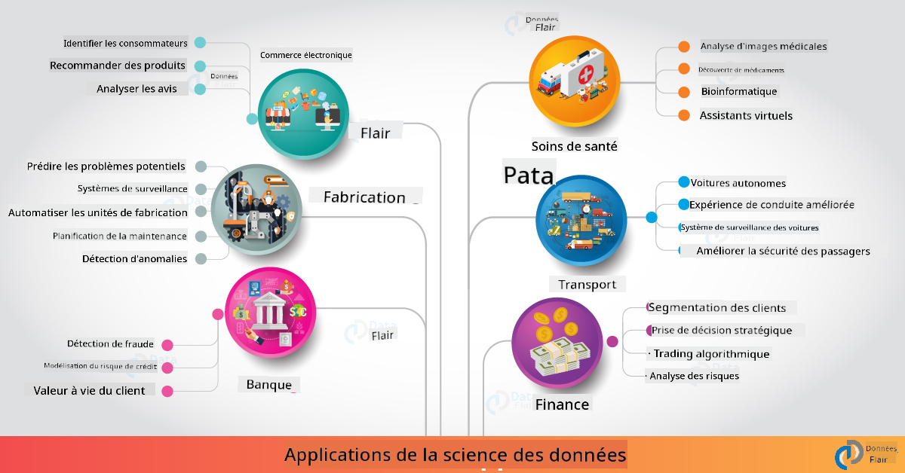

<!--
CO_OP_TRANSLATOR_METADATA:
{
  "original_hash": "0f67a4139454816631526779a456b734",
  "translation_date": "2025-09-06T18:11:16+00:00",
  "source_file": "6-Data-Science-In-Wild/20-Real-World-Examples/README.md",
  "language_code": "fr"
}
-->
# La science des données dans le monde réel

|  ](../../sketchnotes/20-DataScience-RealWorld.png) |
| :--------------------------------------------------------------------------------------------------------------: |
|               La science des données dans le monde réel - _Sketchnote par [@nitya](https://twitter.com/nitya)_               |

Nous sommes presque à la fin de ce parcours d'apprentissage !

Nous avons commencé par définir la science des données et l'éthique, exploré divers outils et techniques pour l'analyse et la visualisation des données, passé en revue le cycle de vie de la science des données, et examiné comment étendre et automatiser les flux de travail de la science des données grâce aux services de cloud computing. Vous vous demandez probablement : _"Comment appliquer concrètement tout cela dans des contextes réels ?"_

Dans cette leçon, nous allons explorer les applications réelles de la science des données dans l'industrie et plonger dans des exemples spécifiques liés à la recherche, aux humanités numériques et à la durabilité. Nous examinerons des opportunités de projets étudiants et conclurons avec des ressources utiles pour continuer votre parcours d'apprentissage !

## Quiz avant la leçon

## [Quiz avant la leçon](https://ff-quizzes.netlify.app/en/ds/quiz/38)

## Science des données + Industrie

Grâce à la démocratisation de l'IA, les développeurs trouvent désormais plus facile de concevoir et d'intégrer des prises de décision basées sur l'IA et des insights basés sur les données dans les expériences utilisateur et les flux de travail de développement. Voici quelques exemples de l'application de la science des données dans des contextes réels au sein de l'industrie :

 * [Google Flu Trends](https://www.wired.com/2015/10/can-learn-epic-failure-google-flu-trends/) a utilisé la science des données pour corréler les termes de recherche avec les tendances de la grippe. Bien que l'approche ait eu des défauts, elle a sensibilisé aux possibilités (et aux défis) des prédictions de santé basées sur les données.

 * [Prédictions de routage UPS](https://www.technologyreview.com/2018/11/21/139000/how-ups-uses-ai-to-outsmart-bad-weather/) - explique comment UPS utilise la science des données et l'apprentissage automatique pour prédire les itinéraires optimaux de livraison, en tenant compte des conditions météorologiques, des schémas de trafic, des délais de livraison et plus encore.

 * [Visualisation des itinéraires des taxis de NYC](http://chriswhong.github.io/nyctaxi/) - les données recueillies grâce aux [lois sur la liberté d'information](https://chriswhong.com/open-data/foil_nyc_taxi/) ont permis de visualiser une journée dans la vie des taxis de NYC, nous aidant à comprendre comment ils naviguent dans la ville animée, l'argent qu'ils gagnent et la durée des trajets sur une période de 24 heures.

 * [Uber Data Science Workbench](https://eng.uber.com/dsw/) - utilise les données (sur les lieux de prise en charge et de dépose, la durée des trajets, les itinéraires préférés, etc.) recueillies à partir de millions de trajets Uber *quotidiennement* pour construire un outil d'analyse des données permettant de prendre des décisions sur les prix, la sécurité, la détection des fraudes et la navigation.

 * [Analyse sportive](https://towardsdatascience.com/scope-of-analytics-in-sports-world-37ed09c39860) - se concentre sur l'_analyse prédictive_ (analyse des équipes et des joueurs - pensez à [Moneyball](https://datasciencedegree.wisconsin.edu/blog/moneyball-proves-importance-big-data-big-ideas/) - et gestion des fans) et la _visualisation des données_ (tableaux de bord des équipes et des fans, jeux, etc.) avec des applications comme le recrutement de talents, les paris sportifs et la gestion des inventaires/lieux.

 * [Science des données dans la banque](https://data-flair.training/blogs/data-science-in-banking/) - met en évidence la valeur de la science des données dans l'industrie financière avec des applications allant de la modélisation des risques et la détection des fraudes, à la segmentation des clients, la prédiction en temps réel et les systèmes de recommandation. L'analyse prédictive alimente également des mesures critiques comme les [scores de crédit](https://dzone.com/articles/using-big-data-and-predictive-analytics-for-credit).

 * [Science des données dans la santé](https://data-flair.training/blogs/data-science-in-healthcare/) - met en lumière des applications comme l'imagerie médicale (par exemple, IRM, radiographie, scanner), la génomique (séquençage ADN), le développement de médicaments (évaluation des risques, prédiction de succès), l'analyse prédictive (soins aux patients et logistique d'approvisionnement), le suivi et la prévention des maladies, etc.

 Crédit image : [Data Flair : 6 applications étonnantes de la science des données ](https://data-flair.training/blogs/data-science-applications/)

La figure montre d'autres domaines et exemples d'application des techniques de science des données. Vous voulez explorer d'autres applications ? Consultez la section [Révision et auto-apprentissage](../../../../6-Data-Science-In-Wild/20-Real-World-Examples) ci-dessous.

## Science des données + Recherche

|  ](../../sketchnotes/20-DataScience-Research.png) |
| :---------------------------------------------------------------------------------------------------------------: |
|              Science des données & Recherche - _Sketchnote par [@nitya](https://twitter.com/nitya)_              |

Alors que les applications réelles se concentrent souvent sur des cas d'utilisation industriels à grande échelle, les applications et projets de _recherche_ peuvent être utiles sous deux perspectives :

* _opportunités d'innovation_ - explorer le prototypage rapide de concepts avancés et tester des expériences utilisateur pour des applications de prochaine génération.
* _défis de déploiement_ - examiner les dommages potentiels ou les conséquences involontaires des technologies de science des données dans des contextes réels.

Pour les étudiants, ces projets de recherche peuvent offrir des opportunités d'apprentissage et de collaboration qui améliorent leur compréhension du sujet, tout en élargissant leur sensibilisation et leur engagement avec des personnes ou des équipes travaillant dans des domaines d'intérêt. À quoi ressemblent ces projets de recherche et comment peuvent-ils avoir un impact ?

Prenons un exemple - l'[étude MIT Gender Shades](http://gendershades.org/overview.html) de Joy Buolamwini (MIT Media Labs) avec un [article de recherche phare](http://proceedings.mlr.press/v81/buolamwini18a/buolamwini18a.pdf) co-écrit avec Timnit Gebru (alors chez Microsoft Research) qui se concentrait sur :

 * **Quoi :** L'objectif du projet de recherche était d'_évaluer les biais présents dans les algorithmes et ensembles de données d'analyse faciale automatisée_ en fonction du genre et du type de peau. 
 * **Pourquoi :** L'analyse faciale est utilisée dans des domaines comme l'application de la loi, la sécurité des aéroports, les systèmes de recrutement et plus encore - des contextes où des classifications inexactes (par exemple, dues à des biais) peuvent causer des dommages économiques et sociaux aux individus ou groupes concernés. Comprendre (et éliminer ou atténuer) les biais est essentiel pour une utilisation équitable.
 * **Comment :** Les chercheurs ont constaté que les benchmarks existants utilisaient principalement des sujets à peau claire, et ont créé un nouvel ensemble de données (plus de 1000 images) _plus équilibré_ en termes de genre et de type de peau. Cet ensemble de données a été utilisé pour évaluer la précision de trois produits de classification de genre (de Microsoft, IBM et Face++). 

Les résultats ont montré que bien que la précision globale de la classification soit bonne, il y avait une différence notable dans les taux d'erreur entre les différents sous-groupes - avec un **mauvais genre** plus élevé pour les femmes ou les personnes à peau foncée, ce qui indique un biais.

**Résultats clés :** Sensibilisation accrue au fait que la science des données nécessite des _ensembles de données représentatifs_ (sous-groupes équilibrés) et des _équipes inclusives_ (origines diverses) pour reconnaître et éliminer ou atténuer ces biais plus tôt dans les solutions d'IA. Les efforts de recherche comme celui-ci sont également essentiels pour que de nombreuses organisations définissent des principes et des pratiques pour une _IA responsable_ afin d'améliorer l'équité dans leurs produits et processus d'IA.

**Vous voulez en savoir plus sur les efforts de recherche pertinents chez Microsoft ?**

* Consultez les [projets de recherche Microsoft](https://www.microsoft.com/research/research-area/artificial-intelligence/?facet%5Btax%5D%5Bmsr-research-area%5D%5B%5D=13556&facet%5Btax%5D%5Bmsr-content-type%5D%5B%5D=msr-project) sur l'intelligence artificielle.
* Explorez les projets étudiants de la [Microsoft Research Data Science Summer School](https://www.microsoft.com/en-us/research/academic-program/data-science-summer-school/).
* Consultez le projet [Fairlearn](https://fairlearn.org/) et les initiatives [IA responsable](https://www.microsoft.com/en-us/ai/responsible-ai?activetab=pivot1%3aprimaryr6).

## Science des données + Humanités

|  ](../../sketchnotes/20-DataScience-Humanities.png) |
| :---------------------------------------------------------------------------------------------------------------: |
|              Science des données & Humanités numériques - _Sketchnote par [@nitya](https://twitter.com/nitya)_              |

Les humanités numériques [ont été définies](https://digitalhumanities.stanford.edu/about-dh-stanford) comme "une collection de pratiques et d'approches combinant des méthodes computationnelles avec une enquête humaniste". Les [projets de Stanford](https://digitalhumanities.stanford.edu/projects) comme _"rebooting history"_ et _"poetic thinking"_ illustrent le lien entre les [humanités numériques et la science des données](https://digitalhumanities.stanford.edu/digital-humanities-and-data-science) - en mettant l'accent sur des techniques comme l'analyse de réseau, la visualisation de l'information, l'analyse spatiale et textuelle qui peuvent nous aider à revisiter des ensembles de données historiques et littéraires pour en tirer de nouvelles perspectives.

*Vous voulez explorer et étendre un projet dans ce domaine ?*

Consultez ["Emily Dickinson and the Meter of Mood"](https://gist.github.com/jlooper/ce4d102efd057137bc000db796bfd671) - un excellent exemple de [Jen Looper](https://twitter.com/jenlooper) qui pose la question de savoir comment nous pouvons utiliser la science des données pour revisiter une poésie familière et réévaluer sa signification et les contributions de son auteur dans de nouveaux contextes. Par exemple, _pouvons-nous prédire la saison dans laquelle un poème a été écrit en analysant son ton ou son sentiment_ - et qu'est-ce que cela nous dit sur l'état d'esprit de l'auteur pendant cette période ?

Pour répondre à cette question, nous suivons les étapes du cycle de vie de la science des données :
 * [`Acquisition des données`](https://gist.github.com/jlooper/ce4d102efd057137bc000db796bfd671#acquiring-the-dataset) - pour collecter un ensemble de données pertinent pour l'analyse. Les options incluent l'utilisation d'une API (par exemple, [Poetry DB API](https://poetrydb.org/index.html)) ou le scraping de pages web (par exemple, [Project Gutenberg](https://www.gutenberg.org/files/12242/12242-h/12242-h.htm)) à l'aide d'outils comme [Scrapy](https://scrapy.org/).
 * [`Nettoyage des données`](https://gist.github.com/jlooper/ce4d102efd057137bc000db796bfd671#clean-the-data) - explique comment le texte peut être formaté, assaini et simplifié à l'aide d'outils de base comme Visual Studio Code et Microsoft Excel.
 * [`Analyse des données`](https://gist.github.com/jlooper/ce4d102efd057137bc000db796bfd671#working-with-the-data-in-a-notebook) - explique comment nous pouvons maintenant importer l'ensemble de données dans des "Notebooks" pour l'analyse à l'aide de packages Python (comme pandas, numpy et matplotlib) pour organiser et visualiser les données.
 * [`Analyse de sentiment`](https://gist.github.com/jlooper/ce4d102efd057137bc000db796bfd671#sentiment-analysis-using-cognitive-services) - explique comment nous pouvons intégrer des services cloud comme Text Analytics, en utilisant des outils low-code comme [Power Automate](https://flow.microsoft.com/en-us/) pour des flux de travail automatisés de traitement des données.

En utilisant ce flux de travail, nous pouvons explorer les impacts saisonniers sur le sentiment des poèmes, et nous aider à façonner nos propres perspectives sur l'auteur. Essayez-le vous-même - puis étendez le notebook pour poser d'autres questions ou visualiser les données de nouvelles manières !

> Vous pouvez utiliser certains des outils du [Digital Humanities toolkit](https://github.com/Digital-Humanities-Toolkit) pour poursuivre ces pistes d'enquête.

## Science des données + Durabilité

|  ](../../sketchnotes/20-DataScience-Sustainability.png) |
| :---------------------------------------------------------------------------------------------------------------: |
|              Science des données & Durabilité - _Sketchnote par [@nitya](https://twitter.com/nitya)_              |

L'[Agenda 2030 pour le développement durable](https://sdgs.un.org/2030agenda) - adopté par tous les membres des Nations Unies en 2015 - identifie 17 objectifs, dont certains se concentrent sur **protéger la planète** contre la dégradation et l'impact du changement climatique. L'[initiative de durabilité de Microsoft](https://www.microsoft.com/en-us/sustainability) soutient ces objectifs en explorant les moyens par lesquels les solutions technologiques peuvent soutenir et construire des futurs plus durables avec un [focus sur 4 objectifs](https://dev.to/azure/a-visual-guide-to-sustainable-software-engineering-53hh) - être négatif en carbone, positif en eau, zéro déchet, et biodiversifié d'ici 2030.

Relever ces défis de manière évolutive et rapide nécessite une réflexion à l'échelle du cloud - et des données à grande échelle. L'initiative [Planetary Computer](https://planetarycomputer.microsoft.com/) fournit 4 composants pour aider les scientifiques des données et les développeurs dans cet effort :

 * [Catalogue de données](https://planetarycomputer.microsoft.com/catalog) - avec des pétaoctets de données sur les systèmes terrestres (gratuites et hébergées sur Azure).
 * [API Planetary](https://planetarycomputer.microsoft.com/docs/reference/stac/) - pour aider les utilisateurs à rechercher des données pertinentes dans l'espace et le temps.
 * [Hub](https://planetarycomputer.microsoft.com/docs/overview/environment/) - environnement géré pour les scientifiques afin de traiter des ensembles de données géospatiales massifs.
 * [Applications](https://planetarycomputer.microsoft.com/applications) - vitrine des cas d'utilisation et des outils pour des insights sur la durabilité.
**Le projet Planetary Computer est actuellement en phase de prévisualisation (à partir de septembre 2021)** - voici comment vous pouvez commencer à contribuer à des solutions durables grâce à la science des données.

* [Demandez un accès](https://planetarycomputer.microsoft.com/account/request) pour débuter votre exploration et vous connecter avec d'autres.
* [Explorez la documentation](https://planetarycomputer.microsoft.com/docs/overview/about) pour comprendre les ensembles de données et les API pris en charge.
* Découvrez des applications comme [Ecosystem Monitoring](https://analytics-lab.org/ecosystemmonitoring/) pour trouver de l'inspiration pour vos idées d'applications.

Réfléchissez à la manière dont vous pouvez utiliser la visualisation de données pour révéler ou amplifier des informations pertinentes sur des sujets comme le changement climatique et la déforestation. Ou pensez à la façon dont ces informations peuvent être utilisées pour créer de nouvelles expériences utilisateur qui encouragent des changements de comportement pour un mode de vie plus durable.

## Science des données + Étudiants

Nous avons parlé d'applications concrètes dans l'industrie et la recherche, et exploré des exemples d'applications de la science des données dans les humanités numériques et la durabilité. Alors, comment pouvez-vous développer vos compétences et partager votre expertise en tant que débutants en science des données ?

Voici quelques exemples de projets étudiants en science des données pour vous inspirer.

 * [École d'été en science des données de MSR](https://www.microsoft.com/en-us/research/academic-program/data-science-summer-school/#!projects) avec des [projets](https://github.com/msr-ds3) sur GitHub explorant des sujets comme :
    - [Biais racial dans l'usage de la force par la police](https://www.microsoft.com/en-us/research/video/data-science-summer-school-2019-replicating-an-empirical-analysis-of-racial-differences-in-police-use-of-force/) | [Github](https://github.com/msr-ds3/stop-question-frisk)
    - [Fiabilité du système de métro de New York](https://www.microsoft.com/en-us/research/video/data-science-summer-school-2018-exploring-the-reliability-of-the-nyc-subway-system/) | [Github](https://github.com/msr-ds3/nyctransit)
 * [Numérisation de la culture matérielle : Exploration des distributions socio-économiques à Sirkap](https://claremont.maps.arcgis.com/apps/Cascade/index.html?appid=bdf2aef0f45a4674ba41cd373fa23afc) - par [Ornella Altunyan](https://twitter.com/ornelladotcom) et son équipe à Claremont, utilisant [ArcGIS StoryMaps](https://storymaps.arcgis.com/).

## 🚀 Défi

Recherchez des articles qui recommandent des projets de science des données adaptés aux débutants - comme [ces 50 domaines thématiques](https://www.upgrad.com/blog/data-science-project-ideas-topics-beginners/), [ces 21 idées de projets](https://www.intellspot.com/data-science-project-ideas) ou [ces 16 projets avec code source](https://data-flair.training/blogs/data-science-project-ideas/) que vous pouvez déconstruire et remixer. Et n'oubliez pas de bloguer sur vos parcours d'apprentissage et de partager vos idées avec nous tous.

## Quiz post-cours

## [Quiz post-cours](https://ff-quizzes.netlify.app/en/ds/quiz/39)

## Révision et auto-apprentissage

Vous voulez explorer davantage de cas d'utilisation ? Voici quelques articles pertinents :
 * [17 applications et exemples de science des données](https://builtin.com/data-science/data-science-applications-examples) - juillet 2021
 * [11 applications impressionnantes de la science des données dans le monde réel](https://myblindbird.com/data-science-applications-real-world/) - mai 2021
 * [La science des données dans le monde réel](https://towardsdatascience.com/data-science-in-the-real-world/home) - Collection d'articles
 * [12 applications concrètes de la science des données avec exemples](https://www.scaler.com/blog/data-science-applications/) - mai 2024
 * La science des données dans : [l'éducation](https://data-flair.training/blogs/data-science-in-education/), [l'agriculture](https://data-flair.training/blogs/data-science-in-agriculture/), [la finance](https://data-flair.training/blogs/data-science-in-finance/), [le cinéma](https://data-flair.training/blogs/data-science-at-movies/), [les soins de santé](https://onlinedegrees.sandiego.edu/data-science-health-care/) et plus encore.

## Devoir

[Explorez un ensemble de données Planetary Computer](assignment.md)

---

**Avertissement** :  
Ce document a été traduit à l'aide du service de traduction automatique [Co-op Translator](https://github.com/Azure/co-op-translator). Bien que nous nous efforcions d'assurer l'exactitude, veuillez noter que les traductions automatisées peuvent contenir des erreurs ou des inexactitudes. Le document original dans sa langue d'origine doit être considéré comme la source faisant autorité. Pour des informations critiques, il est recommandé de faire appel à une traduction humaine professionnelle. Nous déclinons toute responsabilité en cas de malentendus ou d'interprétations erronées résultant de l'utilisation de cette traduction.