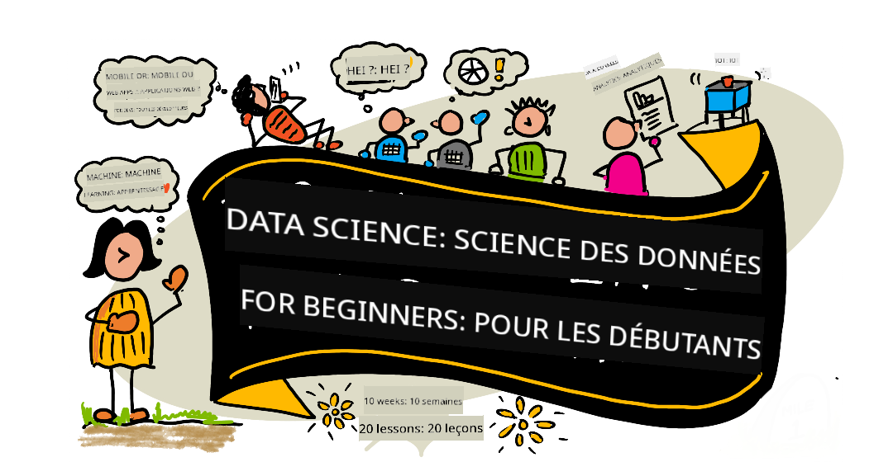

<!--
CO_OP_TRANSLATOR_METADATA:
{
  "original_hash": "dd9a1deb4da680b2cf11ba2e9f5a0a6e",
  "translation_date": "2025-09-29T21:26:13+00:00",
  "source_file": "README.md",
  "language_code": "fr"
}
-->
# Data Science pour Débutants - Un Curriculum

Les Cloud Advocates d'Azure chez Microsoft sont ravis de proposer un curriculum de 10 semaines et 20 leçons consacré à la science des données. Chaque leçon comprend des quiz avant et après la leçon, des instructions écrites pour compléter la leçon, une solution et un devoir. Notre pédagogie basée sur les projets vous permet d'apprendre tout en construisant, une méthode éprouvée pour que les nouvelles compétences soient bien assimilées.

**Un grand merci à nos auteurs :** [Jasmine Greenaway](https://www.twitter.com/paladique), [Dmitry Soshnikov](http://soshnikov.com), [Nitya Narasimhan](https://twitter.com/nitya), [Jalen McGee](https://twitter.com/JalenMcG), [Jen Looper](https://twitter.com/jenlooper), [Maud Levy](https://twitter.com/maudstweets), [Tiffany Souterre](https://twitter.com/TiffanySouterre), [Christopher Harrison](https://www.twitter.com/geektrainer).

**🙏 Remerciements spéciaux 🙏 à nos [Microsoft Student Ambassador](https://studentambassadors.microsoft.com/) auteurs, relecteurs et contributeurs de contenu,** notamment Aaryan Arora, [Aditya Garg](https://github.com/AdityaGarg00), [Alondra Sanchez](https://www.linkedin.com/in/alondra-sanchez-molina/), [Ankita Singh](https://www.linkedin.com/in/ankitasingh007), [Anupam Mishra](https://www.linkedin.com/in/anupam--mishra/), [Arpita Das](https://www.linkedin.com/in/arpitadas01/), ChhailBihari Dubey, [Dibri Nsofor](https://www.linkedin.com/in/dibrinsofor), [Dishita Bhasin](https://www.linkedin.com/in/dishita-bhasin-7065281bb), [Majd Safi](https://www.linkedin.com/in/majd-s/), [Max Blum](https://www.linkedin.com/in/max-blum-6036a1186/), [Miguel Correa](https://www.linkedin.com/in/miguelmque/), [Mohamma Iftekher (Iftu) Ebne Jalal](https://twitter.com/iftu119), [Nawrin Tabassum](https://www.linkedin.com/in/nawrin-tabassum), [Raymond Wangsa Putra](https://www.linkedin.com/in/raymond-wp/), [Rohit Yadav](https://www.linkedin.com/in/rty2423), Samridhi Sharma, [Sanya Sinha](https://www.linkedin.com/mwlite/in/sanya-sinha-13aab1200),
[Sheena Narula](https://www.linkedin.com/in/sheena-narua-n/), [Tauqeer Ahmad](https://www.linkedin.com/in/tauqeerahmad5201/), Yogendrasingh Pawar , [Vidushi Gupta](https://www.linkedin.com/in/vidushi-gupta07/), [Jasleen Sondhi](https://www.linkedin.com/in/jasleen-sondhi/)

||
|:---:|
| Data Science pour Débutants - _Sketchnote par [@nitya](https://twitter.com/nitya)_ |

### 🌐 Support multilingue

#### Supporté via GitHub Action (Automatisé et toujours à jour)

[Français](./README.md) | [Espagnol](../es/README.md) | [Allemand](../de/README.md) | [Russe](../ru/README.md) | [Arabe](../ar/README.md) | [Persan (Farsi)](../fa/README.md) | [Ourdou](../ur/README.md) | [Chinois (Simplifié)](../zh/README.md) | [Chinois (Traditionnel, Macao)](../mo/README.md) | [Chinois (Traditionnel, Hong Kong)](../hk/README.md) | [Chinois (Traditionnel, Taïwan)](../tw/README.md) | [Japonais](../ja/README.md) | [Coréen](../ko/README.md) | [Hindi](../hi/README.md) | [Bengali](../bn/README.md) | [Marathi](../mr/README.md) | [Népalais](../ne/README.md) | [Punjabi (Gurmukhi)](../pa/README.md) | [Portugais (Portugal)](../pt/README.md) | [Portugais (Brésil)](../br/README.md) | [Italien](../it/README.md) | [Polonais](../pl/README.md) | [Turc](../tr/README.md) | [Grec](../el/README.md) | [Thaï](../th/README.md) | [Suédois](../sv/README.md) | [Danois](../da/README.md) | [Norvégien](../no/README.md) | [Finnois](../fi/README.md) | [Néerlandais](../nl/README.md) | [Hébreu](../he/README.md) | [Vietnamien](../vi/README.md) | [Indonésien](../id/README.md) | [Malais](../ms/README.md) | [Tagalog (Filipino)](../tl/README.md) | [Swahili](../sw/README.md) | [Hongrois](../hu/README.md) | [Tchèque](../cs/README.md) | [Slovaque](../sk/README.md) | [Roumain](../ro/README.md) | [Bulgare](../bg/README.md) | [Serbe (Cyrillique)](../sr/README.md) | [Croate](../hr/README.md) | [Slovène](../sl/README.md) | [Ukrainien](../uk/README.md) | [Birman (Myanmar)](../my/README.md)

**Si vous souhaitez ajouter des langues supplémentaires, les langues supportées sont listées [ici](https://github.com/Azure/co-op-translator/blob/main/getting_started/supported-languages.md)**

#### Rejoignez notre communauté 

Nous avons une série d'apprentissage avec l'IA en cours sur Discord. Apprenez-en plus et rejoignez-nous à [Learn with AI Series](https://aka.ms/learnwithai/discord) du 18 au 30 septembre 2025. Vous découvrirez des astuces pour utiliser GitHub Copilot pour la science des données.

# Êtes-vous étudiant ?

Commencez avec les ressources suivantes :

- [Page Hub Étudiant](https://docs.microsoft.com/en-gb/learn/student-hub?WT.mc_id=academic-77958-bethanycheum) Sur cette page, vous trouverez des ressources pour débutants, des packs étudiants et même des moyens d'obtenir un bon de certification gratuit. C'est une page à mettre en favori et à consulter régulièrement, car nous changeons le contenu au moins une fois par mois.
- [Microsoft Learn Student Ambassadors](https://studentambassadors.microsoft.com?WT.mc_id=academic-77958-bethanycheum) Rejoignez une communauté mondiale d'ambassadeurs étudiants, cela pourrait être votre porte d'entrée chez Microsoft.

# Commencer

> **Enseignants** : nous avons [inclus quelques suggestions](for-teachers.md) sur la façon d'utiliser ce curriculum. Nous aimerions avoir vos retours [dans notre forum de discussion](https://github.com/microsoft/Data-Science-For-Beginners/discussions) !

> **[Étudiants](https://aka.ms/student-page)** : pour utiliser ce curriculum par vous-même, clonez le dépôt entier et complétez les exercices par vous-même, en commençant par un quiz avant la leçon. Ensuite, lisez la leçon et complétez le reste des activités. Essayez de créer les projets en comprenant les leçons plutôt qu'en copiant le code de solution ; cependant, ce code est disponible dans les dossiers /solutions de chaque leçon orientée projet. Une autre idée serait de former un groupe d'étude avec des amis et de parcourir le contenu ensemble. Pour approfondir vos études, nous recommandons [Microsoft Learn](https://docs.microsoft.com/en-us/users/jenlooper-2911/collections/qprpajyoy3x0g7?WT.mc_id=academic-77958-bethanycheum).

## Rencontrez l'équipe

**Gif par** [Mohit Jaisal](https://www.linkedin.com/in/mohitjaisal)

> 🎥 Cliquez sur l'image ci-dessus pour une vidéo sur le projet et les personnes qui l'ont créé !

## Pédagogie

Nous avons choisi deux principes pédagogiques lors de la création de ce curriculum : garantir qu'il soit basé sur des projets et qu'il inclue des quiz fréquents. À la fin de cette série, les étudiants auront appris les principes de base de la science des données, y compris les concepts éthiques, la préparation des données, différentes façons de travailler avec les données, la visualisation des données, l'analyse des données, des cas d'utilisation réels de la science des données, et plus encore.

De plus, un quiz à faible enjeu avant un cours fixe l'intention de l'étudiant d'apprendre un sujet, tandis qu'un deuxième quiz après le cours assure une meilleure rétention. Ce curriculum a été conçu pour être flexible et amusant et peut être suivi en totalité ou en partie. Les projets commencent petits et deviennent de plus en plus complexes à la fin du cycle de 10 semaines.

> Retrouvez notre [Code de Conduite](CODE_OF_CONDUCT.md), nos directives pour [Contribuer](CONTRIBUTING.md), et pour [Traduire](TRANSLATIONS.md). Nous accueillons vos retours constructifs !

## Chaque leçon inclut :

- Sketchnote optionnel
- Vidéo complémentaire optionnelle
- Quiz d'échauffement avant la leçon
- Leçon écrite
- Pour les leçons basées sur des projets, des guides étape par étape pour construire le projet
- Vérifications des connaissances
- Un défi
- Lecture complémentaire
- Devoir
- [Quiz après la leçon](https://ff-quizzes.netlify.app/en/)

> **Une note sur les quiz** : Tous les quiz sont contenus dans le dossier Quiz-App, pour un total de 40 quiz de trois questions chacun. Ils sont liés dans les leçons, mais l'application de quiz peut être exécutée localement ou déployée sur Azure ; suivez les instructions dans le dossier `quiz-app`. Ils sont progressivement localisés.

## Leçons
||
|:---:|
| Data Science pour les Débutants : Plan de Route - _Sketchnote par [@nitya](https://twitter.com/nitya)_ |

| Numéro de leçon | Sujet | Regroupement des leçons | Objectifs d'apprentissage | Leçon liée | Auteur |
| :-----------: | :----------------------------------------: | :--------------------------------------------------: | :-----------------------------------------------------------------------------------------------------------------------------------------------------------------------: | :---------------------------------------------------------------------: | :----: |
| 01 | Définir la Data Science | [Introduction](1-Introduction/README.md) | Apprenez les concepts de base de la data science et comment elle est liée à l'intelligence artificielle, au machine learning et au big data. | [leçon](1-Introduction/01-defining-data-science/README.md) [vidéo](https://youtu.be/beZ7Mb_oz9I) | [Dmitry](http://soshnikov.com) |
| 02 | Éthique de la Data Science | [Introduction](1-Introduction/README.md) | Concepts, défis et cadres de l'éthique des données. | [leçon](1-Introduction/02-ethics/README.md) | [Nitya](https://twitter.com/nitya) |
| 03 | Définir les données | [Introduction](1-Introduction/README.md) | Comment les données sont classifiées et leurs sources courantes. | [leçon](1-Introduction/03-defining-data/README.md) | [Jasmine](https://www.twitter.com/paladique) |
| 04 | Introduction aux statistiques et probabilités | [Introduction](1-Introduction/README.md) | Les techniques mathématiques de probabilité et de statistiques pour comprendre les données. | [leçon](1-Introduction/04-stats-and-probability/README.md) [vidéo](https://youtu.be/Z5Zy85g4Yjw) | [Dmitry](http://soshnikov.com) |
| 05 | Travailler avec des données relationnelles | [Travailler avec les données](2-Working-With-Data/README.md) | Introduction aux données relationnelles et aux bases de l'exploration et de l'analyse des données relationnelles avec le langage SQL (prononcé "see-quell"). | [leçon](2-Working-With-Data/05-relational-databases/README.md) | [Christopher](https://www.twitter.com/geektrainer) | | |
| 06 | Travailler avec des données NoSQL | [Travailler avec les données](2-Working-With-Data/README.md) | Introduction aux données non relationnelles, leurs différents types et les bases de l'exploration et de l'analyse des bases de données documentaires. | [leçon](2-Working-With-Data/06-non-relational/README.md) | [Jasmine](https://twitter.com/paladique)|
| 07 | Travailler avec Python | [Travailler avec les données](2-Working-With-Data/README.md) | Bases de l'utilisation de Python pour l'exploration des données avec des bibliothèques comme Pandas. Une compréhension fondamentale de la programmation Python est recommandée. | [leçon](2-Working-With-Data/07-python/README.md) [vidéo](https://youtu.be/dZjWOGbsN4Y) | [Dmitry](http://soshnikov.com) |
| 08 | Préparation des données | [Travailler avec les données](2-Working-With-Data/README.md) | Techniques de nettoyage et de transformation des données pour gérer les défis liés aux données manquantes, inexactes ou incomplètes. | [leçon](2-Working-With-Data/08-data-preparation/README.md) | [Jasmine](https://www.twitter.com/paladique) |
| 09 | Visualiser des quantités | [Visualisation des données](3-Data-Visualization/README.md) | Apprenez à utiliser Matplotlib pour visualiser des données d'oiseaux 🦆 | [leçon](3-Data-Visualization/09-visualization-quantities/README.md) | [Jen](https://twitter.com/jenlooper) |
| 10 | Visualiser des distributions de données | [Visualisation des données](3-Data-Visualization/README.md) | Visualiser des observations et des tendances dans un intervalle. | [leçon](3-Data-Visualization/10-visualization-distributions/README.md) | [Jen](https://twitter.com/jenlooper) |
| 11 | Visualiser des proportions | [Visualisation des données](3-Data-Visualization/README.md) | Visualiser des pourcentages discrets et groupés. | [leçon](3-Data-Visualization/11-visualization-proportions/README.md) | [Jen](https://twitter.com/jenlooper) |
| 12 | Visualiser des relations | [Visualisation des données](3-Data-Visualization/README.md) | Visualiser des connexions et des corrélations entre des ensembles de données et leurs variables. | [leçon](3-Data-Visualization/12-visualization-relationships/README.md) | [Jen](https://twitter.com/jenlooper) |
| 13 | Visualisations significatives | [Visualisation des données](3-Data-Visualization/README.md) | Techniques et conseils pour rendre vos visualisations utiles pour résoudre des problèmes et obtenir des insights efficaces. | [leçon](3-Data-Visualization/13-meaningful-visualizations/README.md) | [Jen](https://twitter.com/jenlooper) |
| 14 | Introduction au cycle de vie de la Data Science | [Cycle de vie](4-Data-Science-Lifecycle/README.md) | Introduction au cycle de vie de la data science et à sa première étape : l'acquisition et l'extraction des données. | [leçon](4-Data-Science-Lifecycle/14-Introduction/README.md) | [Jasmine](https://twitter.com/paladique) |
| 15 | Analyser | [Cycle de vie](4-Data-Science-Lifecycle/README.md) | Cette phase du cycle de vie de la data science se concentre sur les techniques d'analyse des données. | [leçon](4-Data-Science-Lifecycle/15-analyzing/README.md) | [Jasmine](https://twitter.com/paladique) | | |
| 16 | Communication | [Cycle de vie](4-Data-Science-Lifecycle/README.md) | Cette phase du cycle de vie de la data science se concentre sur la présentation des insights issus des données de manière compréhensible pour les décideurs. | [leçon](4-Data-Science-Lifecycle/16-communication/README.md) | [Jalen](https://twitter.com/JalenMcG) | | |
| 17 | Data Science dans le Cloud | [Données dans le Cloud](5-Data-Science-In-Cloud/README.md) | Cette série de leçons introduit la data science dans le cloud et ses avantages. | [leçon](5-Data-Science-In-Cloud/17-Introduction/README.md) | [Tiffany](https://twitter.com/TiffanySouterre) et [Maud](https://twitter.com/maudstweets) |
| 18 | Data Science dans le Cloud | [Données dans le Cloud](5-Data-Science-In-Cloud/README.md) | Entraîner des modèles en utilisant des outils Low Code. |[leçon](5-Data-Science-In-Cloud/18-Low-Code/README.md) | [Tiffany](https://twitter.com/TiffanySouterre) et [Maud](https://twitter.com/maudstweets) |
| 19 | Data Science dans le Cloud | [Données dans le Cloud](5-Data-Science-In-Cloud/README.md) | Déployer des modèles avec Azure Machine Learning Studio. | [leçon](5-Data-Science-In-Cloud/19-Azure/README.md)| [Tiffany](https://twitter.com/TiffanySouterre) et [Maud](https://twitter.com/maudstweets) |
| 20 | Data Science dans la nature | [Dans la nature](6-Data-Science-In-Wild/README.md) | Projets basés sur la data science dans le monde réel. | [leçon](6-Data-Science-In-Wild/20-Real-World-Examples/README.md) | [Nitya](https://twitter.com/nitya) |

## GitHub Codespaces

Suivez ces étapes pour ouvrir cet exemple dans un Codespace :
1. Cliquez sur le menu déroulant Code et sélectionnez l'option Ouvrir avec Codespaces.
2. Sélectionnez + Nouveau codespace en bas du volet.
Pour plus d'informations, consultez la [documentation GitHub](https://docs.github.com/en/codespaces/developing-in-codespaces/creating-a-codespace-for-a-repository#creating-a-codespace).

## VSCode Remote - Containers
Suivez ces étapes pour ouvrir ce dépôt dans un conteneur en utilisant votre machine locale et VSCode avec l'extension VS Code Remote - Containers :

1. Si c'est la première fois que vous utilisez un conteneur de développement, assurez-vous que votre système répond aux prérequis (par exemple, avoir Docker installé) dans [la documentation de démarrage](https://code.visualstudio.com/docs/devcontainers/containers#_getting-started).

Pour utiliser ce dépôt, vous pouvez soit ouvrir le dépôt dans un volume Docker isolé :

**Note** : En coulisses, cela utilisera la commande Remote-Containers : **Clone Repository in Container Volume...** pour cloner le code source dans un volume Docker au lieu du système de fichiers local. Les [volumes](https://docs.docker.com/storage/volumes/) sont le mécanisme préféré pour persister les données des conteneurs.

Ou ouvrir une version clonée ou téléchargée localement du dépôt :

- Clonez ce dépôt sur votre système de fichiers local.
- Appuyez sur F1 et sélectionnez la commande **Remote-Containers: Open Folder in Container...**.
- Sélectionnez la copie clonée de ce dossier, attendez que le conteneur démarre, et essayez les fonctionnalités.

## Accès hors ligne

Vous pouvez exécuter cette documentation hors ligne en utilisant [Docsify](https://docsify.js.org/#/). Forkez ce dépôt, [installez Docsify](https://docsify.js.org/#/quickstart) sur votre machine locale, puis dans le dossier racine de ce dépôt, tapez `docsify serve`. Le site web sera servi sur le port 3000 de votre localhost : `localhost:3000`.

> Notez que les notebooks ne seront pas rendus via Docsify, donc lorsque vous devez exécuter un notebook, faites-le séparément dans VS Code en utilisant un kernel Python.

## Autres programmes

Notre équipe produit d'autres programmes ! Découvrez :

- [Edge AI pour les Débutants](https://aka.ms/edgeai-for-beginners)
- [Agents IA pour les Débutants](https://aka.ms/ai-agents-beginners)
- [IA Générative pour les Débutants](https://aka.ms/genai-beginners)
- [IA Générative pour les Débutants .NET](https://github.com/microsoft/Generative-AI-for-beginners-dotnet)
- [IA Générative avec JavaScript](https://github.com/microsoft/generative-ai-with-javascript)
- [IA Générative avec Java](https://aka.ms/genaijava)
- [IA pour les Débutants](https://aka.ms/ai-beginners)
- [Data Science pour les Débutants](https://aka.ms/datascience-beginners)
- [Bash pour les Débutants](https://github.com/microsoft/bash-for-beginners)
- [ML pour les Débutants](https://aka.ms/ml-beginners)
- [Cybersécurité pour les Débutants](https://github.com/microsoft/Security-101) 
- [Développement Web pour les Débutants](https://aka.ms/webdev-beginners)
- [IoT pour les Débutants](https://aka.ms/iot-beginners)
- [Machine Learning pour les Débutants](https://aka.ms/ml-beginners)
- [Développement XR pour les Débutants](https://aka.ms/xr-dev-for-beginners)
- [Maîtriser GitHub Copilot pour la Programmation Assistée par IA](https://aka.ms/GitHubCopilotAI)
- [Développement XR pour les Débutants](https://github.com/microsoft/xr-development-for-beginners)
- [Maîtriser GitHub Copilot pour les Développeurs C#/.NET](https://github.com/microsoft/mastering-github-copilot-for-dotnet-csharp-developers)
- [Choisissez votre propre aventure Copilot](https://github.com/microsoft/CopilotAdventures)

---

**Avertissement** :  
Ce document a été traduit à l'aide du service de traduction automatique [Co-op Translator](https://github.com/Azure/co-op-translator). Bien que nous nous efforcions d'assurer l'exactitude, veuillez noter que les traductions automatisées peuvent contenir des erreurs ou des inexactitudes. Le document original dans sa langue d'origine doit être considéré comme la source faisant autorité. Pour des informations critiques, il est recommandé de recourir à une traduction professionnelle réalisée par un humain. Nous déclinons toute responsabilité en cas de malentendus ou d'interprétations erronées résultant de l'utilisation de cette traduction.