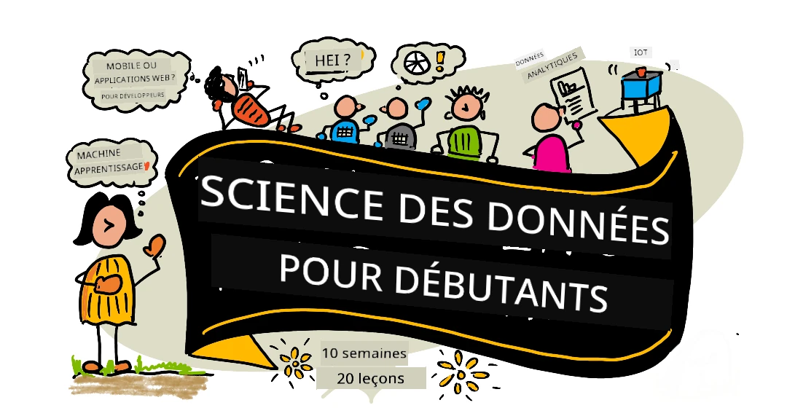
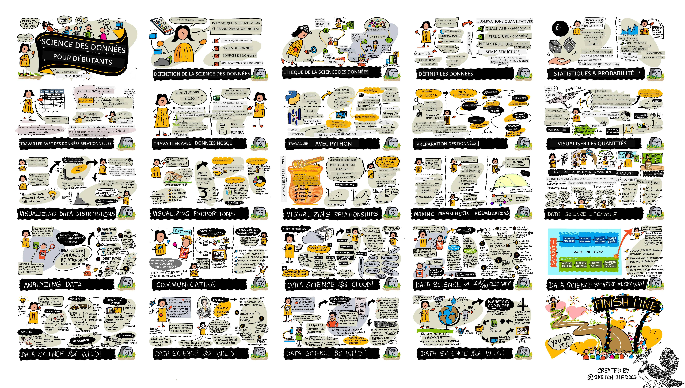

# Data Science pour débutants - Un programme

[](https://github.com/codespaces/new?hide_repo_select=true&ref=main&repo=344191198)

[](https://github.com/microsoft/Data-Science-For-Beginners/blob/master/LICENSE)
[](https://GitHub.com/microsoft/Data-Science-For-Beginners/graphs/contributors/)
[](https://GitHub.com/microsoft/Data-Science-For-Beginners/issues/)
[](https://GitHub.com/microsoft/Data-Science-For-Beginners/pulls/)
[](http://makeapullrequest.com)

[](https://GitHub.com/microsoft/Data-Science-For-Beginners/watchers/)
[](https://GitHub.com/microsoft/Data-Science-For-Beginners/network/)
[](https://GitHub.com/microsoft/Data-Science-For-Beginners/stargazers/)


[](https://discord.gg/nTYy5BXMWG)

[](https://aka.ms/foundry/forum)

Les Azure Cloud Advocates de Microsoft sont heureux de proposer un programme de 10 semaines, 20 leçons, entièrement consacré à la science des données. Chaque leçon comprend des quiz pré- et post-leçon, des instructions écrites pour compléter la leçon, une solution, et une tâche. Notre pédagogie basée sur des projets vous permet d'apprendre tout en construisant, une méthode éprouvée pour que les nouvelles compétences « collent ».

**Un grand merci à nos auteurs :** [Jasmine Greenaway](https://www.twitter.com/paladique), [Dmitry Soshnikov](http://soshnikov.com), [Nitya Narasimhan](https://twitter.com/nitya), [Jalen McGee](https://twitter.com/JalenMcG), [Jen Looper](https://twitter.com/jenlooper), [Maud Levy](https://twitter.com/maudstweets), [Tiffany Souterre](https://twitter.com/TiffanySouterre), [Christopher Harrison](https://www.twitter.com/geektrainer).

**🙏 Remerciements particuliers 🙏 à nos auteurs, relecteurs et contributeurs de contenu [Microsoft Student Ambassador](https://studentambassadors.microsoft.com/),** notamment Aaryan Arora, [Aditya Garg](https://github.com/AdityaGarg00), [Alondra Sanchez](https://www.linkedin.com/in/alondra-sanchez-molina/), [Ankita Singh](https://www.linkedin.com/in/ankitasingh007), [Anupam Mishra](https://www.linkedin.com/in/anupam--mishra/), [Arpita Das](https://www.linkedin.com/in/arpitadas01/), ChhailBihari Dubey, [Dibri Nsofor](https://www.linkedin.com/in/dibrinsofor), [Dishita Bhasin](https://www.linkedin.com/in/dishita-bhasin-7065281bb), [Majd Safi](https://www.linkedin.com/in/majd-s/), [Max Blum](https://www.linkedin.com/in/max-blum-6036a1186/), [Miguel Correa](https://www.linkedin.com/in/miguelmque/), [Mohamma Iftekher (Iftu) Ebne Jalal](https://twitter.com/iftu119), [Nawrin Tabassum](https://www.linkedin.com/in/nawrin-tabassum), [Raymond Wangsa Putra](https://www.linkedin.com/in/raymond-wp/), [Rohit Yadav](https://www.linkedin.com/in/rty2423), Samridhi Sharma, [Sanya Sinha](https://www.linkedin.com/mwlite/in/sanya-sinha-13aab1200),
[Sheena Narula](https://www.linkedin.com/in/sheena-narua-n/), [Tauqeer Ahmad](https://www.linkedin.com/in/tauqeerahmad5201/), Yogendrasingh Pawar , [Vidushi Gupta](https://www.linkedin.com/in/vidushi-gupta07/), [Jasleen Sondhi](https://www.linkedin.com/in/jasleen-sondhi/)

||
|:---:|
| Data Science For Beginners - _Sketchnote par [@nitya](https://twitter.com/nitya)_ |

### 🌐 Support multilingue

#### Pris en charge via GitHub Action (Automatisé & toujours à jour)

<!-- CO-OP TRANSLATOR LANGUAGES TABLE START -->
[Arabic](../ar/README.md) | [Bengali](../bn/README.md) | [Bulgarian](../bg/README.md) | [Burmese (Myanmar)](../my/README.md) | [Chinese (Simplified)](../zh-CN/README.md) | [Chinese (Traditional, Hong Kong)](../zh-HK/README.md) | [Chinese (Traditional, Macau)](../zh-MO/README.md) | [Chinese (Traditional, Taiwan)](../zh-TW/README.md) | [Croatian](../hr/README.md) | [Czech](../cs/README.md) | [Danish](../da/README.md) | [Dutch](../nl/README.md) | [Estonian](../et/README.md) | [Finnish](../fi/README.md) | [French](./README.md) | [German](../de/README.md) | [Greek](../el/README.md) | [Hebrew](../he/README.md) | [Hindi](../hi/README.md) | [Hungarian](../hu/README.md) | [Indonesian](../id/README.md) | [Italian](../it/README.md) | [Japanese](../ja/README.md) | [Kannada](../kn/README.md) | [Khmer](../km/README.md) | [Korean](../ko/README.md) | [Lithuanian](../lt/README.md) | [Malay](../ms/README.md) | [Malayalam](../ml/README.md) | [Marathi](../mr/README.md) | [Nepali](../ne/README.md) | [Nigerian Pidgin](../pcm/README.md) | [Norwegian](../no/README.md) | [Persian (Farsi)](../fa/README.md) | [Polish](../pl/README.md) | [Portuguese (Brazil)](../pt-BR/README.md) | [Portuguese (Portugal)](../pt-PT/README.md) | [Punjabi (Gurmukhi)](../pa/README.md) | [Romanian](../ro/README.md) | [Russian](../ru/README.md) | [Serbian (Cyrillic)](../sr/README.md) | [Slovak](../sk/README.md) | [Slovenian](../sl/README.md) | [Spanish](../es/README.md) | [Swahili](../sw/README.md) | [Swedish](../sv/README.md) | [Tagalog (Filipino)](../tl/README.md) | [Tamil](../ta/README.md) | [Telugu](../te/README.md) | [Thai](../th/README.md) | [Turkish](../tr/README.md) | [Ukrainian](../uk/README.md) | [Urdu](../ur/README.md) | [Vietnamese](../vi/README.md)

> **Préférez-vous cloner localement ?**
>
> Ce dépôt inclut plus de 50 traductions, ce qui augmente considérablement la taille du téléchargement. Pour cloner sans les traductions, utilisez le « sparse checkout » :
>
> **Bash / macOS / Linux :**
> ```bash
> git clone --filter=blob:none --sparse https://github.com/microsoft/Data-Science-For-Beginners.git
> cd Data-Science-For-Beginners
> git sparse-checkout set --no-cone '/*' '!translations' '!translated_images'
> ```
>
> **CMD (Windows) :**
> ```cmd
> git clone --filter=blob:none --sparse https://github.com/microsoft/Data-Science-For-Beginners.git
> cd Data-Science-For-Beginners
> git sparse-checkout set --no-cone "/*" "!translations" "!translated_images"
> ```
>
> Cela vous fournit tout ce dont vous avez besoin pour compléter le cours avec un téléchargement beaucoup plus rapide.
<!-- CO-OP TRANSLATOR LANGUAGES TABLE END -->

**Si vous souhaitez que d’autres langues soient prises en charge, elles sont listées [ici](https://github.com/Azure/co-op-translator/blob/main/getting_started/supported-languages.md)**

#### Rejoignez notre communauté  
[](https://discord.gg/nTYy5BXMWG)

Nous avons une série Discord « apprendre avec l’IA » en cours, apprenez-en plus et rejoignez-nous à [Learn with AI Series](https://aka.ms/learnwithai/discord) du 18 au 30 septembre 2025. Vous recevrez des astuces et conseils pour utiliser GitHub Copilot en science des données.


# Êtes-vous étudiant ?

Commencez avec les ressources suivantes :

- [Page Student Hub](https://docs.microsoft.com/en-gb/learn/student-hub?WT.mc_id=academic-77958-bethanycheum) Sur cette page, vous trouverez des ressources pour débutants, des packs étudiants et même des moyens d’obtenir un bon de certification gratuit. C’est une page à mettre en favori et à consulter régulièrement car nous renouvelons le contenu au minimum chaque mois.
- [Microsoft Learn Student Ambassadors](https://studentambassadors.microsoft.com?WT.mc_id=academic-77958-bethanycheum) Rejoignez une communauté mondiale d’ambassadeurs étudiants, cela peut être votre porte d’entrée chez Microsoft.

# Démarrage

## 📚 Documentation

- **[Guide d'installation](INSTALLATION.md)** - Instructions pas à pas pour les débutants
- **[Guide d'utilisation](USAGE.md)** - Exemples et workflows courants
- **[Dépannage](TROUBLESHOOTING.md)** - Solutions aux problèmes fréquents
- **[Guide de contribution](CONTRIBUTING.md)** - Comment contribuer à ce projet
- **[Pour les enseignants](for-teachers.md)** - Conseils pédagogiques et ressources en classe

## 👨‍🎓 Pour les étudiants
> **Débutants complets** : Nouveau en science des données ? Commencez par nos [exemples adaptés aux débutants](examples/README.md) ! Ces exemples simples et bien commentés vous aideront à comprendre les bases avant de plonger dans le programme complet.
> **[Étudiants](https://aka.ms/student-page)** : pour utiliser ce programme de manière autonome, forkez tout le dépôt et réalisez les exercices par vous-même, en commençant par un quiz pré-conférence. Ensuite, lisez la leçon et complétez le reste des activités. Essayez de créer les projets en comprenant les leçons plutôt qu’en copiant le code solution ; cependant, ce code est disponible dans les dossiers /solutions de chaque leçon orientée projet. Une autre idée serait de former un groupe d’étude avec des amis et de parcourir le contenu ensemble. Pour approfondir, nous recommandons [Microsoft Learn](https://docs.microsoft.com/en-us/users/jenlooper-2911/collections/qprpajyoy3x0g7?WT.mc_id=academic-77958-bethanycheum).

**Démarrage rapide :**
1. Consultez le [Guide d’installation](INSTALLATION.md) pour configurer votre environnement
2. Lisez le [Guide d’utilisation](USAGE.md) pour savoir comment travailler avec le programme
3. Commencez par la Leçon 1 et suivez-les séquentiellement
4. Rejoignez notre [communauté Discord](https://aka.ms/ds4beginners/discord) pour obtenir de l’aide

## 👩‍🏫 Pour les enseignants
> **Enseignants** : nous avons [inclus quelques suggestions](for-teachers.md) sur la façon d'utiliser ce programme. Nous serions ravis de recevoir vos commentaires [sur notre forum de discussion](https://github.com/microsoft/Data-Science-For-Beginners/discussions) !

## Rencontrez l'équipe

[](https://youtu.be/8mzavjQSMM4 "Vidéo promo")

**Gif par** [Mohit Jaisal](https://www.linkedin.com/in/mohitjaisal)

> 🎥 Cliquez sur l'image ci-dessus pour une vidéo sur le projet et les personnes qui l'ont créé !

## Pédagogie

Nous avons choisi deux principes pédagogiques lors de la création de ce programme : garantir qu’il soit basé sur des projets et qu’il inclue des quiz fréquents. À la fin de cette série, les étudiants auront appris les principes de base de la science des données, y compris les concepts éthiques, la préparation des données, différentes façons de travailler avec les données, la visualisation des données, l’analyse des données, des cas d’utilisation réels de la science des données, et bien plus encore.

De plus, un quiz à faible enjeu avant un cours fixe l’intention de l’étudiant à apprendre un sujet, tandis qu’un second quiz après le cours assure une meilleure rétention. Ce programme a été conçu pour être flexible et ludique et peut être suivi en totalité ou en partie. Les projets commencent petits et deviennent de plus en plus complexes à la fin du cycle de 10 semaines.

> Retrouvez notre [Code de conduite](CODE_OF_CONDUCT.md), les directives de [Contribution](CONTRIBUTING.md), [Traduction](TRANSLATIONS.md). Nous accueillons volontiers vos retours constructifs !

## Chaque leçon comprend :

- Sketchnote optionnel
- Vidéo complémentaire optionnelle
- Quiz d’échauffement avant la leçon
- Leçon écrite
- Pour les leçons basées sur projet, des guides étape par étape pour réaliser le projet
- Contrôles de connaissances
- Un défi
- Lecture complémentaire
- Devoir
- [Quiz post-leçon](https://ff-quizzes.netlify.app/en/)

> **Une note sur les quiz** : Tous les quiz sont contenus dans le dossier Quiz-App, pour un total de 40 quiz de trois questions chacun. Ils sont liés depuis les leçons, mais l’application de quiz peut être exécutée localement ou déployée sur Azure ; suivez les instructions dans le dossier `quiz-app`. Ils sont progressivement traduits.

## 🎓 Exemples adaptés aux débutants

**Nouveau en science des données ?** Nous avons créé un répertoire spécial [d’exemples](examples/README.md) avec du code simple et bien commenté pour vous aider à démarrer :

- 🌟 **Hello World** - Votre premier programme de science des données
- 📂 **Chargement des données** - Apprenez à lire et explorer des ensembles de données
- 📊 **Analyse simple** - Calculez des statistiques et trouvez des motifs
- 📈 **Visualisation de base** - Créez des graphiques et diagrammes
- 🔬 **Projet réel** - Flux de travail complet du début à la fin

Chaque exemple inclut des commentaires détaillés expliquant chaque étape, parfait pour les débutants absolus !

👉 **[Commencez avec les exemples](examples/README.md)** 👈

## Leçons


||
|:---:|
| Science des données pour débutants : feuille de route - _Sketchnote par [@nitya](https://twitter.com/nitya)_ |


| Numéro de leçon | Sujet | Regroupement de leçons | Objectifs d’apprentissage | Leçon liée | Auteur |
| :-----------: | :----------------------------------------: | :--------------------------------------------------: | :-----------------------------------------------------------------------------------------------------------------------------------------------------------------------: | :---------------------------------------------------------------------: | :----: |
| 01 | Définir la science des données | [Introduction](1-Introduction/README.md) | Apprenez les concepts de base derrière la science des données et sa relation avec l’intelligence artificielle, l’apprentissage automatique, et le big data. | [leçon](1-Introduction/01-defining-data-science/README.md) [vidéo](https://youtu.be/beZ7Mb_oz9I) | [Dmitry](http://soshnikov.com) |
| 02 | Éthique de la science des données | [Introduction](1-Introduction/README.md) | Concepts, défis et cadres de l’éthique des données. | [leçon](1-Introduction/02-ethics/README.md) | [Nitya](https://twitter.com/nitya) |
| 03 | Définir les données | [Introduction](1-Introduction/README.md) | Comment les données sont classifiées et leurs sources communes. | [leçon](1-Introduction/03-defining-data/README.md) | [Jasmine](https://www.twitter.com/paladique) |
| 04 | Introduction aux statistiques et probabilité | [Introduction](1-Introduction/README.md) | Les techniques mathématiques de probabilité et statistiques pour comprendre les données. | [leçon](1-Introduction/04-stats-and-probability/README.md) [vidéo](https://youtu.be/Z5Zy85g4Yjw) | [Dmitry](http://soshnikov.com) |
| 05 | Travailler avec des données relationnelles | [Working With Data](2-Working-With-Data/README.md) | Introduction aux données relationnelles et bases de l’exploration et de l’analyse de données relationnelles avec le Structured Query Language, aussi appelé SQL (prononcé “see-quell”). | [leçon](2-Working-With-Data/05-relational-databases/README.md) | [Christopher](https://www.twitter.com/geektrainer) | | |
| 06 | Travailler avec des données NoSQL | [Working With Data](2-Working-With-Data/README.md) | Introduction aux données non relationnelles, leurs différents types et bases de l’exploration et de l’analyse de bases de données documentaires. | [leçon](2-Working-With-Data/06-non-relational/README.md) | [Jasmine](https://twitter.com/paladique)|
| 07 | Travailler avec Python | [Working With Data](2-Working-With-Data/README.md) | Notions de base de l’utilisation de Python pour l’exploration de données avec des bibliothèques telles que Pandas. Une compréhension de base de la programmation Python est recommandée. | [leçon](2-Working-With-Data/07-python/README.md) [vidéo](https://youtu.be/dZjWOGbsN4Y) | [Dmitry](http://soshnikov.com) |
| 08 | Préparation des données | [Working With Data](2-Working-With-Data/README.md) | Sujets sur les techniques de nettoyage et de transformation des données pour gérer les problèmes de données manquantes, inexactes ou incomplètes. | [leçon](2-Working-With-Data/08-data-preparation/README.md) | [Jasmine](https://www.twitter.com/paladique) |
| 09 | Visualiser les quantités | [Data Visualization](3-Data-Visualization/README.md) | Apprenez à utiliser Matplotlib pour visualiser des données d’oiseaux 🦆 | [leçon](3-Data-Visualization/09-visualization-quantities/README.md) | [Jen](https://twitter.com/jenlooper) |
| 10 | Visualiser les distributions de données | [Data Visualization](3-Data-Visualization/README.md) | Visualisation des observations et tendances dans un intervalle. | [leçon](3-Data-Visualization/10-visualization-distributions/README.md) | [Jen](https://twitter.com/jenlooper) |
| 11 | Visualiser les proportions | [Data Visualization](3-Data-Visualization/README.md) | Visualisation de pourcentages discrets et regroupés. | [leçon](3-Data-Visualization/11-visualization-proportions/README.md) | [Jen](https://twitter.com/jenlooper) |
| 12 | Visualiser les relations | [Data Visualization](3-Data-Visualization/README.md) | Visualisation des connexions et corrélations entre ensembles de données et leurs variables. | [leçon](3-Data-Visualization/12-visualization-relationships/README.md) | [Jen](https://twitter.com/jenlooper) |
| 13 | Visualisations significatives | [Data Visualization](3-Data-Visualization/README.md) | Techniques et conseils pour rendre vos visualisations précieuses pour une résolution efficace de problèmes et de compréhension. | [leçon](3-Data-Visualization/13-meaningful-visualizations/README.md) | [Jen](https://twitter.com/jenlooper) |
| 14 | Introduction au cycle de vie de la science des données | [Lifecycle](4-Data-Science-Lifecycle/README.md) | Introduction au cycle de vie de la science des données et sa première étape d’acquisition et d’extraction des données. | [leçon](4-Data-Science-Lifecycle/14-Introduction/README.md) | [Jasmine](https://twitter.com/paladique) |
| 15 | Analyse | [Lifecycle](4-Data-Science-Lifecycle/README.md) | Cette phase du cycle de vie de la science des données se concentre sur les techniques d’analyse des données. | [leçon](4-Data-Science-Lifecycle/15-analyzing/README.md) | [Jasmine](https://twitter.com/paladique) | | |
| 16 | Communication | [Lifecycle](4-Data-Science-Lifecycle/README.md) | Cette phase du cycle de vie de la science des données se concentre sur la présentation des insights issus des données pour faciliter la compréhension des décideurs. | [leçon](4-Data-Science-Lifecycle/16-communication/README.md) | [Jalen](https://twitter.com/JalenMcG) | | |
| 17 | Science des données dans le cloud | [Cloud Data](5-Data-Science-In-Cloud/README.md) | Cette série de leçons introduit la science des données dans le cloud et ses avantages. | [leçon](5-Data-Science-In-Cloud/17-Introduction/README.md) | [Tiffany](https://twitter.com/TiffanySouterre) et [Maud](https://twitter.com/maudstweets) |
| 18 | Science des données dans le cloud | [Cloud Data](5-Data-Science-In-Cloud/README.md) | Entraînement de modèles avec des outils Low Code. |[leçon](5-Data-Science-In-Cloud/18-Low-Code/README.md) | [Tiffany](https://twitter.com/TiffanySouterre) et [Maud](https://twitter.com/maudstweets) |
| 19 | Science des données dans le cloud | [Cloud Data](5-Data-Science-In-Cloud/README.md) | Déploiement de modèles avec Azure Machine Learning Studio. | [leçon](5-Data-Science-In-Cloud/19-Azure/README.md)| [Tiffany](https://twitter.com/TiffanySouterre) et [Maud](https://twitter.com/maudstweets) |
| 20 | Science des données sur le terrain | [In the Wild](6-Data-Science-In-Wild/README.md) | Projets de science des données appliqués au monde réel. | [leçon](6-Data-Science-In-Wild/20-Real-World-Examples/README.md) | [Nitya](https://twitter.com/nitya) |

## GitHub Codespaces

Suivez ces étapes pour ouvrir cet exemple dans un Codespace :  
1. Cliquez sur le menu déroulant Code et sélectionnez l’option Ouvrir avec Codespaces.  
2. Sélectionnez + Nouveau codespace en bas du panneau.  
Pour plus d’informations, consultez la [documentation GitHub](https://docs.github.com/en/codespaces/developing-in-codespaces/creating-a-codespace-for-a-repository#creating-a-codespace).

## VSCode Remote - Containers
Suivez ces étapes pour ouvrir ce dépôt dans un conteneur en utilisant votre machine locale et VSCode via l’extension VS Code Remote - Containers :

1. Si c’est votre première utilisation d’un conteneur de développement, veuillez vérifier que votre système répond aux prérequis (ex. : Docker installé) dans [la documentation de démarrage](https://code.visualstudio.com/docs/devcontainers/containers#_getting-started).

Pour utiliser ce dépôt, vous pouvez soit ouvrir le dépôt dans un volume Docker isolé :

**Remarque** : Sous le capot, cette méthode utilisera la commande Remote-Containers : **Clone Repository in Container Volume...** pour cloner le code source dans un volume Docker au lieu du système de fichiers local. Les [volumes](https://docs.docker.com/storage/volumes/) sont le mécanisme recommandé pour persister les données de conteneur.

Ou ouvrir une version clonée localement ou téléchargée du dépôt :

- Clonez ce dépôt sur votre système de fichiers local.  
- Appuyez sur F1 et sélectionnez la commande **Remote-Containers : Ouvrir un dossier dans un conteneur...**  
- Sélectionnez la copie clonée de ce dossier, attendez le démarrage du conteneur, puis testez.

## Accès hors ligne

Vous pouvez consulter cette documentation hors ligne en utilisant [Docsify](https://docsify.js.org/#/). Forkez ce dépôt, [installez Docsify](https://docsify.js.org/#/quickstart) sur votre machine locale, puis dans le dossier racine de ce dépôt, tapez `docsify serve`. Le site sera servi sur le port 3000 de votre localhost : `localhost:3000`.

> Notez que les notebooks ne seront pas rendus via Docsify, donc lorsque vous devez exécuter un notebook, faites-le séparément dans VS Code avec un noyau Python.

## Autres programmes

Notre équipe produit d’autres programmes ! Découvrez :

<!-- CO-OP TRANSLATOR OTHER COURSES START -->
### LangChain
[](https://aka.ms/langchain4j-for-beginners)
[](https://aka.ms/langchainjs-for-beginners?WT.mc_id=m365-94501-dwahlin)
[](https://github.com/microsoft/langchain-for-beginners?WT.mc_id=m365-94501-dwahlin)
---

### Azure / Edge / MCP / Agents
[](https://github.com/microsoft/AZD-for-beginners?WT.mc_id=academic-105485-koreyst)
[](https://github.com/microsoft/edgeai-for-beginners?WT.mc_id=academic-105485-koreyst)
[](https://github.com/microsoft/mcp-for-beginners?WT.mc_id=academic-105485-koreyst)
[](https://github.com/microsoft/ai-agents-for-beginners?WT.mc_id=academic-105485-koreyst)

---
 
### Série IA générative
[](https://github.com/microsoft/generative-ai-for-beginners?WT.mc_id=academic-105485-koreyst)
[-9333EA?style=for-the-badge&labelColor=E5E7EB&color=9333EA)](https://github.com/microsoft/Generative-AI-for-beginners-dotnet?WT.mc_id=academic-105485-koreyst)
[-C084FC?style=for-the-badge&labelColor=E5E7EB&color=C084FC)](https://github.com/microsoft/generative-ai-for-beginners-java?WT.mc_id=academic-105485-koreyst)
[-E879F9?style=for-the-badge&labelColor=E5E7EB&color=E879F9)](https://github.com/microsoft/generative-ai-with-javascript?WT.mc_id=academic-105485-koreyst)

---
 
### Apprentissage de base
[](https://aka.ms/ml-beginners?WT.mc_id=academic-105485-koreyst)
[](https://aka.ms/datascience-beginners?WT.mc_id=academic-105485-koreyst)
[](https://aka.ms/ai-beginners?WT.mc_id=academic-105485-koreyst)
[](https://github.com/microsoft/Security-101?WT.mc_id=academic-96948-sayoung)
[](https://aka.ms/webdev-beginners?WT.mc_id=academic-105485-koreyst)
[](https://aka.ms/iot-beginners?WT.mc_id=academic-105485-koreyst)
[](https://github.com/microsoft/xr-development-for-beginners?WT.mc_id=academic-105485-koreyst)

---
 
### Série Copilot
[](https://aka.ms/GitHubCopilotAI?WT.mc_id=academic-105485-koreyst)
[](https://github.com/microsoft/mastering-github-copilot-for-dotnet-csharp-developers?WT.mc_id=academic-105485-koreyst)
[](https://github.com/microsoft/CopilotAdventures?WT.mc_id=academic-105485-koreyst)
<!-- CO-OP TRANSLATOR OTHER COURSES END -->

## Obtenir de l'aide

**Vous rencontrez des problèmes ?** Consultez notre [Guide de dépannage](TROUBLESHOOTING.md) pour des solutions aux problèmes courants.

Si vous êtes bloqué ou avez des questions sur la création d'applications d'IA. Rejoignez d'autres apprenants et développeurs expérimentés pour discuter du MCP. C'est une communauté bienveillante où les questions sont les bienvenues et où les connaissances sont partagées librement.

[](https://discord.gg/nTYy5BXMWG)

Si vous avez des retours sur les produits ou rencontrez des erreurs lors de la création, visitez :

[](https://aka.ms/foundry/forum)

---

<!-- CO-OP TRANSLATOR DISCLAIMER START -->
**Avertissement** :  
Ce document a été traduit à l'aide du service de traduction par IA [Co-op Translator](https://github.com/Azure/co-op-translator). Bien que nous nous efforcions d'assurer l'exactitude, veuillez noter que les traductions automatiques peuvent contenir des erreurs ou des inexactitudes. Le document original dans sa langue native doit être considéré comme la source faisant foi. Pour les informations critiques, une traduction professionnelle réalisée par un humain est recommandée. Nous déclinons toute responsabilité en cas de malentendus ou de mauvaises interprétations résultant de l'utilisation de cette traduction.
<!-- CO-OP TRANSLATOR DISCLAIMER END -->