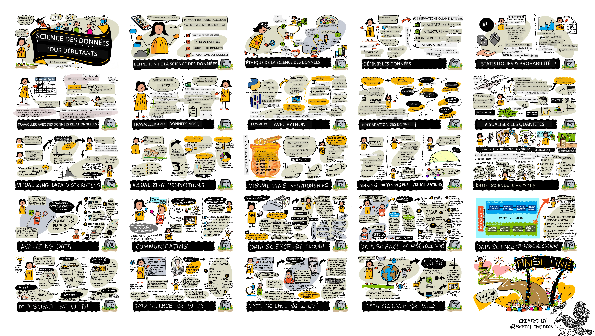

<!--
CO_OP_TRANSLATOR_METADATA:
{
  "original_hash": "3a848466cb63aff1a93411affb152c2a",
  "translation_date": "2025-08-25T17:11:36+00:00",
  "source_file": "sketchnotes/README.md",
  "language_code": "fr"
}
-->
Retrouvez toutes les sketchnotes ici !

## Crédits

Nitya Narasimhan, artiste

**Avertissement** :  
Ce document a été traduit à l'aide du service de traduction automatique [Co-op Translator](https://github.com/Azure/co-op-translator). Bien que nous nous efforcions d'assurer l'exactitude, veuillez noter que les traductions automatisées peuvent contenir des erreurs ou des inexactitudes. Le document original dans sa langue d'origine doit être considéré comme la source faisant autorité. Pour des informations critiques, il est recommandé de recourir à une traduction professionnelle réalisée par un humain. Nous déclinons toute responsabilité en cas de malentendus ou d'interprétations erronées résultant de l'utilisation de cette traduction.