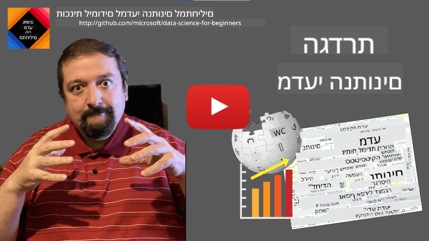
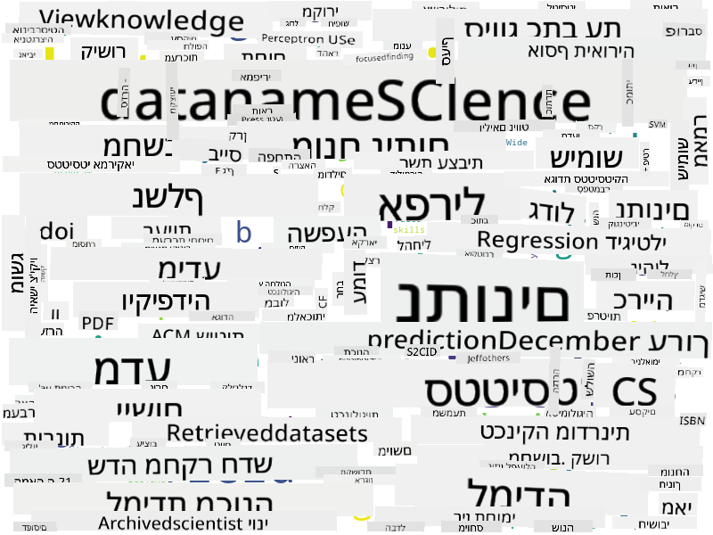

<!--
CO_OP_TRANSLATOR_METADATA:
{
  "original_hash": "43212cc1ac137b7bb1dcfb37ca06b0f4",
  "translation_date": "2025-10-25T18:58:52+00:00",
  "source_file": "1-Introduction/01-defining-data-science/README.md",
  "language_code": "he"
}
-->
# הגדרת מדע הנתונים

|  ](../../sketchnotes/01-Definitions.png) |
| :----------------------------------------------------------------------------------------------------: |
|              הגדרת מדע הנתונים - _סקיצה מאת [@nitya](https://twitter.com/nitya)_               |

---

## [שאלון לפני ההרצאה](https://ff-quizzes.netlify.app/en/ds/quiz/0)

## מהו נתון?
בחיי היומיום שלנו, אנחנו מוקפים כל הזמן בנתונים. הטקסט שאתם קוראים עכשיו הוא נתון. רשימת מספרי הטלפון של חבריכם בסמארטפון היא נתון, כמו גם השעה הנוכחית שמוצגת על השעון שלכם. כבני אדם, אנחנו פועלים באופן טבעי עם נתונים על ידי ספירת הכסף שיש לנו או כתיבת מכתבים לחברינו.

עם זאת, נתונים הפכו להיות קריטיים הרבה יותר עם יצירת המחשבים. התפקיד העיקרי של מחשבים הוא לבצע חישובים, אך הם זקוקים לנתונים כדי לפעול. לכן, עלינו להבין כיצד מחשבים מאחסנים ומעבדים נתונים.

עם הופעת האינטרנט, תפקידם של המחשבים כמכשירים לטיפול בנתונים גדל. אם תחשבו על זה, אנחנו משתמשים במחשבים יותר ויותר לעיבוד נתונים ותקשורת, ולא לחישובים ממשיים. כשאנחנו כותבים דוא"ל לחבר או מחפשים מידע באינטרנט - אנחנו למעשה יוצרים, מאחסנים, מעבירים ומעבדים נתונים.
> האם אתם זוכרים מתי בפעם האחרונה השתמשתם במחשב כדי לבצע חישוב ממשי?

## מהו מדע הנתונים?

ב[ויקיפדיה](https://en.wikipedia.org/wiki/Data_science), **מדע הנתונים** מוגדר כ*תחום מדעי המשתמש בשיטות מדעיות כדי להפיק ידע ותובנות מנתונים מובנים ולא מובנים, וליישם ידע ותובנות מעשיות מנתונים במגוון רחב של תחומי יישום*.

הגדרה זו מדגישה את ההיבטים החשובים הבאים של מדע הנתונים:

* המטרה העיקרית של מדע הנתונים היא **להפיק ידע** מנתונים, במילים אחרות - **להבין** נתונים, למצוא קשרים נסתרים ולבנות **מודל**.
* מדע הנתונים משתמש ב**שיטות מדעיות**, כמו הסתברות וסטטיסטיקה. למעשה, כאשר המונח *מדע הנתונים* הוצג לראשונה, היו שטענו שמדובר פשוט בשם חדש ומפואר לסטטיסטיקה. כיום ברור שהתחום רחב הרבה יותר.
* הידע שהופק צריך להיות מיושם כדי להפיק **תובנות מעשיות**, כלומר תובנות פרקטיות שניתן ליישם במצבים עסקיים אמיתיים.
* עלינו להיות מסוגלים לעבוד עם נתונים **מובנים** וגם **לא מובנים**. נחזור לדון בסוגי נתונים שונים בהמשך הקורס.
* **תחום היישום** הוא מושג חשוב, ולעיתים קרובות מדעני נתונים זקוקים למידה מסוימת של מומחיות בתחום הבעיה, לדוגמה: פיננסים, רפואה, שיווק וכו'.

> היבט חשוב נוסף של מדע הנתונים הוא שהוא חוקר כיצד ניתן לאסוף, לאחסן ולעבד נתונים באמצעות מחשבים. בעוד שסטטיסטיקה מספקת לנו יסודות מתמטיים, מדע הנתונים מיישם מושגים מתמטיים כדי להפיק תובנות ממשיות מנתונים.

אחת הדרכים (המיוחסת ל[ג'ים גריי](https://en.wikipedia.org/wiki/Jim_Gray_(computer_scientist))) להסתכל על מדע הנתונים היא לראות אותו כפרדיגמה נפרדת של מדע:
* **אמפירית**, שבה אנו מסתמכים בעיקר על תצפיות ותוצאות ניסויים
* **תיאורטית**, שבה מושגים חדשים נובעים מידע מדעי קיים
* **חישובית**, שבה אנו מגלים עקרונות חדשים על בסיס ניסויים חישוביים
* **מונעת נתונים**, המבוססת על גילוי קשרים ודפוסים בנתונים  

## תחומים קשורים נוספים

מכיוון שנתונים נמצאים בכל מקום, מדע הנתונים עצמו הוא גם תחום רחב, שנוגע בתחומים רבים אחרים.

<dl>
<dt>מאגרי נתונים</dt>
<dd>
שיקול קריטי הוא <b>כיצד לאחסן</b> את הנתונים, כלומר כיצד לארגן אותם בצורה שמאפשרת עיבוד מהיר יותר. ישנם סוגים שונים של מאגרי נתונים המאחסנים נתונים מובנים ולא מובנים, אותם <a href="../../2-Working-With-Data/README.md">נשקול בקורס שלנו</a>.
</dd>
<dt>ביג דאטה</dt>
<dd>
לעיתים אנו צריכים לאחסן ולעבד כמויות גדולות מאוד של נתונים עם מבנה יחסית פשוט. ישנן גישות וכלים מיוחדים לאחסן את הנתונים בצורה מבוזרת על פני אשכול מחשבים ולעבד אותם ביעילות.
</dd>
<dt>למידת מכונה</dt>
<dd>
אחת הדרכים להבין נתונים היא <b>לבנות מודל</b> שיוכל לחזות תוצאה רצויה. פיתוח מודלים מנתונים נקרא <b>למידת מכונה</b>. ייתכן שתרצו להסתכל על <a href="https://aka.ms/ml-beginners">תוכנית הלימודים שלנו ללמידת מכונה למתחילים</a> כדי ללמוד עוד על הנושא.
</dd>
<dt>בינה מלאכותית</dt>
<dd>
תחום בלמידת מכונה הידוע כבינה מלאכותית (AI) גם הוא נשען על נתונים, והוא כולל בניית מודלים מורכבים מאוד שמחקים תהליכי חשיבה אנושיים. שיטות AI מאפשרות לנו לעיתים קרובות להפוך נתונים לא מובנים (למשל, שפה טבעית) לתובנות מובנות.
</dd>
<dt>ויזואליזציה</dt>
<dd>
כמויות גדולות של נתונים אינן מובנות לבני אדם, אך ברגע שאנו יוצרים ויזואליזציות שימושיות באמצעות הנתונים הללו, אנו יכולים להבין אותם טוב יותר ולהסיק מסקנות. לכן, חשוב להכיר דרכים רבות לויזואליזציה של מידע - דבר שנכסה ב<a href="../../3-Data-Visualization/README.md">סעיף 3</a> של הקורס שלנו. תחומים קשורים כוללים גם <b>אינפוגרפיקה</b> ו<b>אינטראקציה אדם-מחשב</b> באופן כללי.
</dd>
</dl>

## סוגי נתונים

כפי שכבר הזכרנו, נתונים נמצאים בכל מקום. אנחנו רק צריכים לתפוס אותם בצורה הנכונה! חשוב להבחין בין נתונים **מובנים** לנתונים **לא מובנים**. הראשונים מיוצגים בדרך כלל בצורה מובנית היטב, לעיתים קרובות כטבלה או מספר טבלאות, בעוד שהאחרונים הם פשוט אוסף של קבצים. לפעמים ניתן גם לדבר על נתונים **חצי-מובנים**, שיש להם סוג של מבנה שיכול להשתנות מאוד.

| מובנים                                                                   | חצי-מובנים                                                                                | לא מובנים                            |
| ---------------------------------------------------------------------------- | ---------------------------------------------------------------------------------------------- | --------------------------------------- |
| רשימת אנשים עם מספרי הטלפון שלהם                                      | דפי ויקיפדיה עם קישורים                                                                     | טקסט של אנציקלופדיה בריטניקה        |
| טמפרטורה בכל חדר בבניין בכל דקה במשך 20 השנים האחרונות | אוסף של מאמרים מדעיים בפורמט JSON עם מחברים, תאריך פרסום ותקציר | שיתוף קבצים עם מסמכים ארגוניים     |
| נתונים על גיל ומגדר של כל האנשים שנכנסים לבניין                  | דפי אינטרנט                                                                                 | זרם וידאו גולמי ממצלמת אבטחה |

## איפה ניתן להשיג נתונים

ישנם מקורות רבים אפשריים לנתונים, ויהיה בלתי אפשרי למנות את כולם! עם זאת, בואו נזכיר כמה מהמקומות הטיפוסיים שבהם ניתן להשיג נתונים:

* **מובנים**
  - **האינטרנט של הדברים** (IoT), כולל נתונים מחיישנים שונים, כמו חיישני טמפרטורה או לחץ, מספקים הרבה נתונים שימושיים. לדוגמה, אם בניין משרדים מצויד בחיישני IoT, נוכל לשלוט אוטומטית בחימום ובתאורה כדי למזער עלויות.
  - **סקרים** שאנו מבקשים ממשתמשים למלא לאחר רכישה או לאחר ביקור באתר אינטרנט.
  - **ניתוח התנהגות** יכול, לדוגמה, לעזור לנו להבין עד כמה משתמש מעמיק באתר ומהי הסיבה הטיפוסית לעזיבתו.
* **לא מובנים**
  - **טקסטים** יכולים להיות מקור עשיר לתובנות, כמו **ציון רגשות** כולל, או חילוץ מילות מפתח ומשמעות סמנטית.
  - **תמונות** או **וידאו**. וידאו ממצלמת אבטחה יכול לשמש להערכת תנועה בכביש ולהודיע לאנשים על פקקי תנועה אפשריים.
  - **יומני שרת אינטרנט** יכולים לשמש להבנת אילו דפים באתר שלנו נצפים הכי הרבה, ולכמה זמן.
* **חצי-מובנים**
  - **גרפים של רשתות חברתיות** יכולים להיות מקורות מצוינים לנתונים על אישיות המשתמשים ועל פוטנציאל ההשפעה שלהם בהפצת מידע.
  - כאשר יש לנו אוסף של תמונות ממסיבה, נוכל לנסות לחלץ נתוני **דינמיקה קבוצתית** על ידי בניית גרף של אנשים שמצטלמים יחד.

על ידי הכרת מקורות הנתונים השונים האפשריים, תוכלו לנסות לחשוב על תרחישים שונים שבהם ניתן ליישם טכניקות מדע נתונים כדי להבין את המצב טוב יותר ולשפר תהליכים עסקיים.

## מה ניתן לעשות עם נתונים

במדע הנתונים, אנו מתמקדים בשלבים הבאים במסע הנתונים:

<dl>
<dt>1) רכישת נתונים</dt>
<dd>
השלב הראשון הוא איסוף הנתונים. בעוד שבמקרים רבים זה יכול להיות תהליך פשוט, כמו נתונים שמגיעים למאגר נתונים מאפליקציית אינטרנט, לפעמים אנו צריכים להשתמש בטכניקות מיוחדות. לדוגמה, נתונים מחיישני IoT יכולים להיות מכריעים, וזו פרקטיקה טובה להשתמש בנקודות קצה של חיץ כמו IoT Hub כדי לאסוף את כל הנתונים לפני עיבוד נוסף.
</dd>
<dt>2) אחסון נתונים</dt>
<dd>
אחסון נתונים יכול להיות מאתגר, במיוחד אם אנו מדברים על ביג דאטה. כאשר מחליטים כיצד לאחסן נתונים, כדאי לצפות את הדרך שבה תרצו לשאול את הנתונים בעתיד. ישנן מספר דרכים שבהן ניתן לאחסן נתונים:
<ul>
<li>מאגר נתונים רלציוני מאחסן אוסף של טבלאות, ומשתמש בשפה מיוחדת שנקראת SQL כדי לשאול אותן. בדרך כלל, הטבלאות מאורגנות לקבוצות שונות שנקראות סכמות. במקרים רבים אנו צריכים להמיר את הנתונים מהצורה המקורית כדי להתאים לסכמה.</li>
<li><a href="https://en.wikipedia.org/wiki/NoSQL">מאגר נתונים NoSQL</a>, כמו <a href="https://azure.microsoft.com/services/cosmos-db/?WT.mc_id=academic-77958-bethanycheum">CosmosDB</a>, אינו מחייב סכמות על נתונים, ומאפשר אחסון נתונים מורכבים יותר, לדוגמה, מסמכי JSON היררכיים או גרפים. עם זאת, למאגרי נתונים NoSQL אין את יכולות השאילתא העשירות של SQL, ואינם יכולים לאכוף שלמות התייחסותית, כלומר כללים על איך הנתונים מאורגנים בטבלאות ומנהלים את הקשרים ביניהן.</li>
<li><a href="https://en.wikipedia.org/wiki/Data_lake">אחסון Data Lake</a> משמש לאוספים גדולים של נתונים בצורה גולמית ולא מובנית. אגמי נתונים משמשים לעיתים קרובות עם ביג דאטה, כאשר כל הנתונים אינם יכולים להתאים למכונה אחת, ויש לאחסן ולעבד אותם על ידי אשכול שרתים. <a href="https://en.wikipedia.org/wiki/Apache_Parquet">Parquet</a> הוא פורמט נתונים שמשמש לעיתים קרובות בשילוב עם ביג דאטה.</li> 
</ul>
</dd>
<dt>3) עיבוד נתונים</dt>
<dd>
זהו החלק המרגש ביותר במסע הנתונים, שכולל המרת הנתונים מצורתם המקורית לצורה שניתן להשתמש בה לצורך ויזואליזציה/אימון מודלים. כאשר מתמודדים עם נתונים לא מובנים כמו טקסטים או תמונות, ייתכן שנצטרך להשתמש בטכניקות AI כדי לחלץ <b>מאפיינים</b> מהנתונים, ובכך להמיר אותם לצורה מובנית.
</dd>
<dt>4) ויזואליזציה / תובנות אנושיות</dt>
<dd>
לעיתים קרובות, כדי להבין את הנתונים, אנו צריכים להציג אותם בצורה חזותית. עם מגוון טכניקות ויזואליזציה בארגז הכלים שלנו, נוכל למצוא את התצוגה הנכונה כדי להסיק תובנות. לעיתים קרובות, מדען נתונים צריך "לשחק עם הנתונים", להציג אותם בצורות שונות ולחפש קשרים. בנוסף, אנו עשויים להשתמש בטכניקות סטטיסטיות כדי לבדוק השערות או להוכיח קשר בין חלקי נתונים שונים.
</dd>
<dt>5) אימון מודל חיזוי</dt>
<dd>
מכיוון שהמטרה הסופית של מדע הנתונים היא להיות מסוגלים לקבל החלטות על בסיס נתונים, ייתכן שנרצה להשתמש בטכניקות של <a href="http://github.com/microsoft/ml-for-beginners">למידת מכונה</a> כדי לבנות מודל חיזוי. נוכל להשתמש בו כדי לבצע תחזיות באמצעות מערכי נתונים חדשים עם מבנים דומים.
</dd>
</dl>

כמובן, בהתאם לנתונים בפועל, ייתכן שחלק מהשלבים יהיו חסרים (לדוגמה, כאשר כבר יש לנו את הנתונים במאגר הנתונים, או כאשר איננו זקוקים לאימון מודל), או שחלק מהשלבים עשויים לחזור על עצמם מספר פעמים (כמו עיבוד נתונים).

## דיגיטציה וטרנספורמציה דיגיטלית

בעשור האחרון, עסקים רבים התחילו להבין את חשיבות הנתונים בקבלת החלטות עסקיות. כדי ליישם עקרונות מדע הנתונים בניהול עסק, קודם כל יש לאסוף נתונים, כלומר לתרגם תהליכים עסקיים לצורה דיגיטלית. זה נקרא **דיגיטציה**. יישום טכניקות מדע הנתונים על נתונים אלו כדי להנחות החלטות יכול להוביל לשיפורים משמעותיים בפרודוקטיביות (או אפילו לשינוי כיוון עסקי), הנקראים **טרנספורמציה דיגיטלית**.

בואו נחשוב על דוגמה. נניח שיש לנו קורס מדע נתונים (כמו זה) שאנו מעבירים באופן מקוון לסטודנטים, ואנו רוצים להשתמש במדע הנתונים כדי לשפר אותו. איך נוכל לעשות זאת?

נוכל להתחיל בשאלה "מה ניתן לדיגיטציה?" הדרך הפשוטה ביותר תהיה למדוד את הזמן שלוקח לכל סטודנט לסיים כל מודול, ולמדוד את הידע שהושג על ידי מתן מבחן רב-ברירה בסוף כל מודול. על ידי חישוב ממוצע הזמן להשלמה בין כל הסטודנטים, נוכל לגלות אילו מודולים גורמים לקשיים הגדולים ביותר לסטודנטים, ולעבוד על פישוטם.
> ייתכן שתטענו שהגישה הזו אינה אידיאלית, מכיוון שמודולים יכולים להיות באורכים שונים. כנראה שזה יהיה יותר הוגן לחלק את הזמן לפי אורך המודול (במספר התווים), ולהשוות את הערכים הללו במקום.

כשאנחנו מתחילים לנתח תוצאות של מבחנים רב-ברירתיים, אנחנו יכולים לנסות לקבוע אילו מושגים קשה לתלמידים להבין, ולהשתמש במידע הזה כדי לשפר את התוכן. כדי לעשות זאת, עלינו לעצב מבחנים בצורה כזו שכל שאלה תתאים למושג מסוים או ליחידת ידע מסוימת.

אם נרצה להסתבך עוד יותר, נוכל לשרטט את הזמן שנדרש לכל מודול מול קטגוריית הגיל של התלמידים. ייתכן שנגלה שבחלק מקטגוריות הגיל לוקח זמן ארוך מדי לסיים את המודול, או שהתלמידים נושרים לפני שהם מסיימים אותו. זה יכול לעזור לנו לספק המלצות גיל למודול, ולהפחית את אי שביעות הרצון של אנשים מציפיות שגויות.

## 🚀 אתגר

באתגר הזה, ננסה למצוא מושגים רלוונטיים לתחום מדעי הנתונים על ידי התבוננות בטקסטים. ניקח מאמר מוויקיפדיה על מדעי הנתונים, נוריד ונעבד את הטקסט, ואז נבנה ענן מילים כמו זה:

בקרו ב-[`notebook.ipynb`](../../../../1-Introduction/01-defining-data-science/notebook.ipynb ':ignore') כדי לקרוא את הקוד. תוכלו גם להריץ את הקוד ולראות כיצד הוא מבצע את כל השינויים בנתונים בזמן אמת.

> אם אינכם יודעים כיצד להריץ קוד ב-Jupyter Notebook, עיינו ב-[מאמר הזה](https://soshnikov.com/education/how-to-execute-notebooks-from-github/).

## [שאלון לאחר ההרצאה](https://ff-quizzes.netlify.app/en/ds/quiz/1)

## משימות

* **משימה 1**: שנו את הקוד למעלה כדי למצוא מושגים קשורים לתחומים של **Big Data** ו-**Machine Learning**
* **משימה 2**: [חשבו על תרחישים במדעי הנתונים](assignment.md)

## קרדיטים

השיעור הזה נכתב באהבה על ידי [דמיטרי סושניקוב](http://soshnikov.com)

---

**כתב ויתור**:  
מסמך זה תורגם באמצעות שירות תרגום AI [Co-op Translator](https://github.com/Azure/co-op-translator). למרות שאנו שואפים לדיוק, יש לקחת בחשבון שתרגומים אוטומטיים עשויים להכיל שגיאות או אי דיוקים. המסמך המקורי בשפתו המקורית צריך להיחשב כמקור סמכותי. עבור מידע קריטי, מומלץ להשתמש בתרגום מקצועי אנושי. איננו אחראים לאי הבנות או לפרשנויות שגויות הנובעות משימוש בתרגום זה.