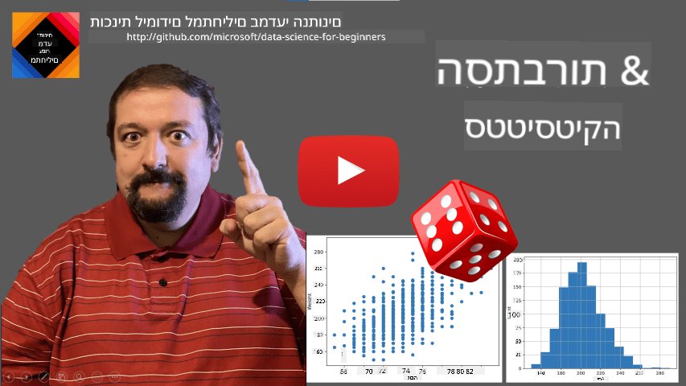
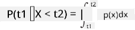
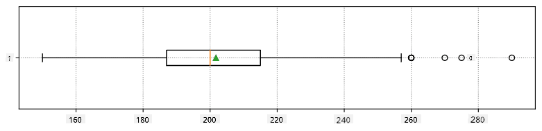
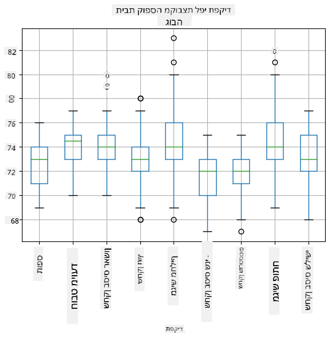
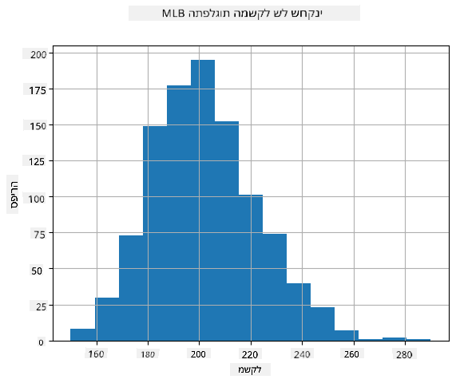
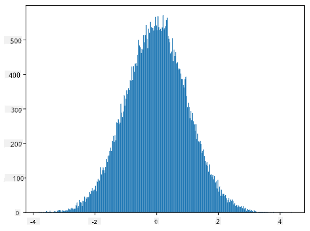
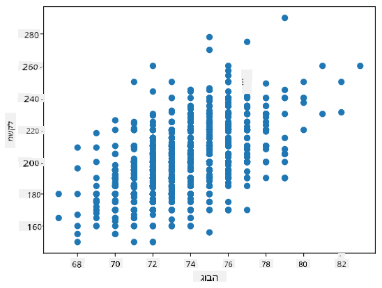

<!--
CO_OP_TRANSLATOR_METADATA:
{
  "original_hash": "b706a07cfa87ba091cbb91e0aa775600",
  "translation_date": "2025-08-28T15:47:03+00:00",
  "source_file": "1-Introduction/04-stats-and-probability/README.md",
  "language_code": "he"
}
-->
# מבוא קצר לסטטיסטיקה ותורת ההסתברות

| ](../../sketchnotes/04-Statistics-Probability.png)|
|:---:|
| סטטיסטיקה והסתברות - _סקצ'נוט מאת [@nitya](https://twitter.com/nitya)_ |

סטטיסטיקה ותורת ההסתברות הן שני תחומים מתמטיים הקשורים זה לזה באופן הדוק, והם בעלי חשיבות רבה במדעי הנתונים. ניתן לעבוד עם נתונים גם ללא ידע מעמיק במתמטיקה, אך עדיין עדיף להכיר לפחות כמה מושגים בסיסיים. כאן נציג מבוא קצר שיעזור לכם להתחיל.

[](https://youtu.be/Z5Zy85g4Yjw)

## [שאלון לפני השיעור](https://purple-hill-04aebfb03.1.azurestaticapps.net/quiz/6)

## הסתברות ומשתנים אקראיים

**הסתברות** היא מספר בין 0 ל-1 שמבטא עד כמה אירוע מסוים הוא סביר. היא מוגדרת כמספר התוצאות החיוביות (שמובילות לאירוע), מחולק במספר הכולל של התוצאות, בהנחה שכל התוצאות הן בעלות הסתברות שווה. לדוגמה, כאשר אנו מטילים קובייה, ההסתברות לקבל מספר זוגי היא 3/6 = 0.5.

כשמדברים על אירועים, אנו משתמשים ב**משתנים אקראיים**. לדוגמה, המשתנה האקראי שמייצג את המספר שמתקבל בהטלת קובייה יקבל ערכים בין 1 ל-6. קבוצת המספרים מ-1 עד 6 נקראת **מרחב הדגימה**. ניתן לדבר על ההסתברות שמשתנה אקראי יקבל ערך מסוים, לדוגמה P(X=3)=1/6.

המשתנה האקראי בדוגמה הקודמת נקרא **בדיד**, מכיוון שיש לו מרחב דגימה שניתן לספור, כלומר יש ערכים נפרדים שניתן למנות. ישנם מקרים שבהם מרחב הדגימה הוא טווח של מספרים ממשיים, או כל קבוצת המספרים הממשיים. משתנים כאלה נקראים **רציפים**. דוגמה טובה לכך היא הזמן שבו האוטובוס מגיע.

## התפלגות הסתברות

במקרה של משתנים אקראיים בדידים, קל לתאר את ההסתברות של כל אירוע באמצעות פונקציה P(X). עבור כל ערך *s* ממרחב הדגימה *S*, היא תיתן מספר בין 0 ל-1, כך שסכום כל הערכים של P(X=s) עבור כל האירועים יהיה 1.

ההתפלגות הבדידה המוכרת ביותר היא **התפלגות אחידה**, שבה יש מרחב דגימה של N אלמנטים, עם הסתברות שווה של 1/N לכל אחד מהם.

קשה יותר לתאר את התפלגות ההסתברות של משתנה רציף, עם ערכים שנלקחים מטווח מסוים [a,b], או מכל קבוצת המספרים הממשיים ℝ. קחו לדוגמה את זמן הגעת האוטובוס. למעשה, עבור כל זמן הגעה מדויק *t*, ההסתברות שהאוטובוס יגיע בדיוק בזמן הזה היא 0!

> עכשיו אתם יודעים שאירועים עם הסתברות 0 מתרחשים, ולעיתים קרובות! לפחות בכל פעם שהאוטובוס מגיע!

ניתן לדבר רק על ההסתברות שמשתנה ייפול בטווח ערכים מסוים, למשל P(t<sub>1</sub>≤X<t<sub>2</sub>). במקרה זה, התפלגות ההסתברות מתוארת באמצעות **פונקציית צפיפות הסתברות** p(x), כך ש-



אנלוג רציף להתפלגות אחידה נקרא **אחידה רציפה**, שמוגדרת על טווח סופי. ההסתברות שהערך X ייפול בטווח באורך l היא פרופורציונלית ל-l, ועולה עד 1.

התפלגות חשובה נוספת היא **התפלגות נורמלית**, עליה נדבר בפירוט בהמשך.

## ממוצע, שונות וסטיית תקן

נניח שאנו לוקחים רצף של n דגימות של משתנה אקראי X: x<sub>1</sub>, x<sub>2</sub>, ..., x<sub>n</sub>. ניתן להגדיר את **הממוצע** (או **ממוצע חשבוני**) של הרצף באופן המסורתי כ-(x<sub>1</sub>+x<sub>2</sub>+x<sub>n</sub>)/n. ככל שנגדיל את גודל המדגם (כלומר ניקח את הגבול עם n→∞), נקבל את הממוצע (שנקרא גם **תוחלת**) של ההתפלגות. נסמן את התוחלת כ-**E**(x).

> ניתן להראות שעבור כל התפלגות בדידה עם ערכים {x<sub>1</sub>, x<sub>2</sub>, ..., x<sub>N</sub>} והסתברויות מתאימות p<sub>1</sub>, p<sub>2</sub>, ..., p<sub>N</sub>, התוחלת תהיה E(X)=x<sub>1</sub>p<sub>1</sub>+x<sub>2</sub>p<sub>2</sub>+...+x<sub>N</sub>p<sub>N</sub>.

כדי לזהות עד כמה הערכים מפוזרים, ניתן לחשב את השונות σ<sup>2</sup> = ∑(x<sub>i</sub> - μ)<sup>2</sup>/n, כאשר μ הוא הממוצע של הרצף. הערך σ נקרא **סטיית תקן**, ו-σ<sup>2</sup> נקרא **שונות**.

## מוד, חציון ורבעונים

לפעמים, הממוצע אינו מייצג באופן מספק את הערך "הטיפוסי" של הנתונים. לדוגמה, כאשר ישנם כמה ערכים קיצוניים שמחוץ לטווח, הם יכולים להשפיע על הממוצע. אינדיקציה טובה נוספת היא **חציון**, ערך כזה שחצי מהנתונים נמוכים ממנו, והחצי השני - גבוהים ממנו.

כדי להבין את התפלגות הנתונים, כדאי לדבר על **רבעונים**:

* הרבעון הראשון, או Q1, הוא ערך כזה ש-25% מהנתונים נמוכים ממנו
* הרבעון השלישי, או Q3, הוא ערך ש-75% מהנתונים נמוכים ממנו

ניתן לייצג את הקשר בין החציון והרבעונים באופן גרפי בדיאגרמה שנקראת **תיבת נתונים**:


כאן אנו גם מחשבים את **טווח הרבעונים** IQR=Q3-Q1, ואת מה שנקרא **ערכים חריגים** - ערכים שנמצאים מחוץ לגבולות [Q1-1.5*IQR,Q3+1.5*IQR].

עבור התפלגות סופית שמכילה מספר קטן של ערכים אפשריים, ערך "טיפוסי" טוב הוא זה שמופיע בתדירות הגבוהה ביותר, שנקרא **מוד**. הוא מיושם לעיתים קרובות על נתונים קטגוריים, כמו צבעים. לדוגמה, אם יש לנו שתי קבוצות של אנשים - כאלה שמעדיפים מאוד אדום, ואחרים שמעדיפים כחול. אם נקודד צבעים במספרים, הערך הממוצע לצבע המועדף יהיה איפשהו בספקטרום כתום-ירוק, מה שלא משקף את ההעדפה האמיתית של אף אחת מהקבוצות. עם זאת, המוד יהיה אחד הצבעים, או שניהם, אם מספר האנשים שמעדיפים אותם שווה (במקרה זה נקרא לדגימה **רב-מודית**).

## נתונים מהעולם האמיתי

כאשר אנו מנתחים נתונים מהחיים האמיתיים, הם לעיתים אינם משתנים אקראיים במובן זה שאיננו מבצעים ניסויים עם תוצאה לא ידועה. לדוגמה, קחו קבוצת שחקני בייסבול, ונתוני הגוף שלהם, כמו גובה, משקל וגיל. המספרים הללו אינם בדיוק אקראיים, אך עדיין ניתן ליישם את אותם מושגים מתמטיים. לדוגמה, רצף של משקלים של אנשים יכול להיחשב כרצף של ערכים שנלקחו ממשתנה אקראי מסוים. להלן רצף המשקלים של שחקני בייסבול אמיתיים מ-[ליגת הבייסבול הראשית](http://mlb.mlb.com/index.jsp), שנלקח מ-[מערך נתונים זה](http://wiki.stat.ucla.edu/socr/index.php/SOCR_Data_MLB_HeightsWeights) (לנוחיותכם, מוצגים רק 20 הערכים הראשונים):

```
[180.0, 215.0, 210.0, 210.0, 188.0, 176.0, 209.0, 200.0, 231.0, 180.0, 188.0, 180.0, 185.0, 160.0, 180.0, 185.0, 197.0, 189.0, 185.0, 219.0]
```

> **הערה**: כדי לראות דוגמה לעבודה עם מערך נתונים זה, עיינו ב-[מחברת המצורפת](notebook.ipynb). ישנם גם מספר אתגרים לאורך השיעור, ואתם יכולים להשלים אותם על ידי הוספת קוד למחברת זו. אם אינכם בטוחים כיצד לעבוד עם נתונים, אל תדאגו - נחזור לעבודה עם נתונים באמצעות Python בשלב מאוחר יותר. אם אינכם יודעים כיצד להריץ קוד ב-Jupyter Notebook, עיינו ב-[מאמר זה](https://soshnikov.com/education/how-to-execute-notebooks-from-github/).

להלן תיבת נתונים שמציגה ממוצע, חציון ורבעונים עבור הנתונים שלנו:



מכיוון שהנתונים שלנו מכילים מידע על **תפקידים** שונים של שחקנים, ניתן גם ליצור תיבת נתונים לפי תפקיד - זה יאפשר לנו להבין כיצד ערכי הפרמטרים משתנים בין התפקידים. הפעם נבחן גובה:



דיאגרמה זו מציעה כי, בממוצע, גובהם של שחקני בסיס ראשון גבוה יותר מגובהם של שחקני בסיס שני. בהמשך השיעור נלמד כיצד ניתן לבדוק את ההשערה הזו בצורה פורמלית יותר, וכיצד להראות שהנתונים שלנו משמעותיים מבחינה סטטיסטית כדי להוכיח זאת.

> כאשר עובדים עם נתונים מהעולם האמיתי, אנו מניחים שכל נקודות הנתונים הן דגימות שנלקחו מהתפלגות הסתברות מסוימת. הנחה זו מאפשרת לנו ליישם טכניקות של למידת מכונה ולבנות מודלים חיזוי יעילים.

כדי לראות מהי התפלגות הנתונים שלנו, ניתן לשרטט גרף שנקרא **היסטוגרמה**. ציר ה-X יכיל מספר של טווחי משקל שונים (מה שנקרא **תאים**), וציר ה-Y האנכי יציג את מספר הפעמים שהדגימה של המשתנה האקראי הייתה בתוך טווח נתון.



מההיסטוגרמה הזו ניתן לראות שכל הערכים מרוכזים סביב משקל ממוצע מסוים, וככל שמתרחקים ממשקל זה - פחות משקלים בערך זה מופיעים. כלומר, לא סביר שמשקלו של שחקן בייסבול יהיה שונה מאוד מהמשקל הממוצע. שונות המשקלים מראה את המידה שבה משקלים נוטים להיות שונים מהממוצע.

> אם ניקח משקלים של אנשים אחרים, לא מהליגה, סביר שהתפלגות תהיה שונה. עם זאת, צורת ההתפלגות תהיה זהה, אך הממוצע והשונות ישתנו. לכן, אם נלמד את המודל שלנו על שחקני בייסבול, סביר שהוא ייתן תוצאות שגויות כאשר ניישם אותו על סטודנטים באוניברסיטה, מכיוון שהתפלגות הבסיס שונה.

## התפלגות נורמלית

התפלגות המשקלים שראינו לעיל היא מאוד טיפוסית, ומדידות רבות מהעולם האמיתי עוקבות אחר אותו סוג של התפלגות, אך עם ממוצע ושונות שונים. התפלגות זו נקראת **התפלגות נורמלית**, והיא משחקת תפקיד חשוב מאוד בסטטיסטיקה.

שימוש בהתפלגות נורמלית הוא דרך נכונה לייצר משקלים אקראיים של שחקני בייסבול פוטנציאליים. ברגע שאנו יודעים את משקל הממוצע `mean` ואת סטיית התקן `std`, ניתן לייצר 1000 דגימות משקל בדרך הבאה:
```python
samples = np.random.normal(mean,std,1000)
```

אם נשרטט את ההיסטוגרמה של הדגימות שנוצרו, נראה תמונה דומה מאוד לזו שהוצגה לעיל. ואם נגדיל את מספר הדגימות ואת מספר התאים, נוכל לייצר תמונה של התפלגות נורמלית שקרובה יותר לאידיאל:



*התפלגות נורמלית עם mean=0 ו-std.dev=1*

## מרווחי ביטחון

כאשר אנו מדברים על משקלם של שחקני בייסבול, אנו מניחים שישנו **משתנה אקראי W** שמייצג את התפלגות ההסתברות האידיאלית של משקלם של כל שחקני הבייסבול (מה שנקרא **אוכלוסייה**). רצף המשקלים שלנו מייצג תת-קבוצה של כל שחקני הבייסבול שאנו מכנים **מדגם**. שאלה מעניינת היא, האם ניתן לדעת את הפרמטרים של התפלגות W, כלומר את הממוצע והשונות של האוכלוסייה?

התשובה הפשוטה ביותר תהיה לחשב את הממוצע והשונות של המדגם שלנו. עם זאת, ייתכן שהמדגם האקראי שלנו אינו מייצג באופן מדויק את האוכלוסייה המלאה. לכן יש היגיון לדבר על **מרווח ביטחון**.
> **רווח סמך** הוא הערכה של הממוצע האמיתי של האוכלוסייה בהתבסס על המדגם שלנו, אשר מדויק ברמת הסתברות מסוימת (או **רמת ביטחון**).
בהנחה שיש לנו מדגם X<sub>1</sub>, ..., X<sub>n</sub> מההתפלגות שלנו. בכל פעם שניקח מדגם מההתפלגות, נקבל ערך ממוצע שונה μ. לכן ניתן להתייחס ל-μ כמשתנה מקרי. **אינטרוול ביטחון** עם רמת ביטחון p הוא זוג ערכים (L<sub>p</sub>,R<sub>p</sub>), כך ש-**P**(L<sub>p</sub>≤μ≤R<sub>p</sub>) = p, כלומר ההסתברות שהממוצע הנמדד ייפול בתוך האינטרוול שווה ל-p.

מעבר להקדמה הקצרה שלנו, לא ניכנס לפרטים כיצד מחשבים את אינטרוולי הביטחון הללו. ניתן למצוא פרטים נוספים [בויקיפדיה](https://en.wikipedia.org/wiki/Confidence_interval). בקצרה, אנו מגדירים את ההתפלגות של ממוצע המדגם המחושב ביחס לממוצע האמיתי של האוכלוסייה, שנקראת **התפלגות סטודנט**.

> **עובדה מעניינת**: התפלגות סטודנט נקראת כך על שם המתמטיקאי ויליאם סילי גוסט, שפרסם את מאמרו תחת שם העט "סטודנט". הוא עבד במבשלת גינס, ולפי אחת הגרסאות, מעסיקו לא רצה שהציבור הרחב יידע שהם משתמשים בבדיקות סטטיסטיות כדי לקבוע את איכות חומרי הגלם.

אם נרצה להעריך את הממוצע μ של האוכלוסייה שלנו עם רמת ביטחון p, נצטרך לקחת את *(1-p)/2-th percentile* מהתפלגות סטודנט A, שניתן לקחת מטבלאות או לחשב באמצעות פונקציות מובנות בתוכנות סטטיסטיות (למשל Python, R וכו'). אז האינטרוול עבור μ יינתן על ידי X±A*D/√n, כאשר X הוא הממוצע שהתקבל במדגם, ו-D הוא סטיית התקן.

> **הערה**: אנו גם מדלגים על דיון במושג חשוב של [דרגות חופש](https://en.wikipedia.org/wiki/Degrees_of_freedom_(statistics)), שהוא משמעותי ביחס להתפלגות סטודנט. ניתן לעיין בספרים מקיפים יותר על סטטיסטיקה כדי להבין מושג זה לעומק.

דוגמה לחישוב אינטרוול ביטחון עבור משקלים וגבהים ניתנת ב-[מחברות המצורפות](notebook.ipynb).

| p | ממוצע משקל |
|-----|-----------|
| 0.85 | 201.73±0.94 |
| 0.90 | 201.73±1.08 |
| 0.95 | 201.73±1.28 |

שימו לב שככל שרמת הביטחון גבוהה יותר, האינטרוול הביטחון רחב יותר.

## בדיקת השערות

במאגר הנתונים של שחקני הבייסבול שלנו, ישנם תפקידים שונים לשחקנים, שניתן לסכם בטבלה הבאה (ראו את [המחברת המצורפת](notebook.ipynb) כדי לראות כיצד ניתן לחשב טבלה זו):

| תפקיד | גובה | משקל | כמות |
|------|--------|--------|-------|
| תופס | 72.723684 | 204.328947 | 76 |
| חובט ייעודי | 74.222222 | 220.888889 | 18 |
| בסיס ראשון | 74.000000 | 213.109091 | 55 |
| שחקן חוץ | 73.010309 | 199.113402 | 194 |
| מגיש מחליף | 74.374603 | 203.517460 | 315 |
| בסיס שני | 71.362069 | 184.344828 | 58 |
| שורטסטופ | 71.903846 | 182.923077 | 52 |
| מגיש ראשי | 74.719457 | 205.163636 | 221 |
| בסיס שלישי | 73.044444 | 200.955556 | 45 |

ניתן להבחין כי ממוצע הגבהים של שחקני בסיס ראשון גבוה מזה של שחקני בסיס שני. לכן, אנו עשויים להסיק ש-**שחקני בסיס ראשון גבוהים יותר משחקני בסיס שני**.

> הצהרה זו נקראת **השערה**, משום שאיננו יודעים אם העובדה באמת נכונה או לא.

עם זאת, לא תמיד ברור אם ניתן להסיק מסקנה זו. מהדיון לעיל אנו יודעים שלכל ממוצע יש אינטרוול ביטחון משויך, ולכן ייתכן שההבדל הזה הוא רק טעות סטטיסטית. אנו זקוקים לדרך פורמלית יותר לבדוק את ההשערה שלנו.

בואו נחשב אינטרוולי ביטחון בנפרד עבור גבהים של שחקני בסיס ראשון ושני:

| רמת ביטחון | בסיס ראשון | בסיס שני |
|------------|---------------|----------------|
| 0.85 | 73.62..74.38 | 71.04..71.69 |
| 0.90 | 73.56..74.44 | 70.99..71.73 |
| 0.95 | 73.47..74.53 | 70.92..71.81 |

ניתן לראות שבשום רמת ביטחון האינטרוולים אינם חופפים. זה מוכיח את ההשערה שלנו ששחקני בסיס ראשון גבוהים יותר משחקני בסיס שני.

באופן פורמלי יותר, הבעיה שאנו פותרים היא לבדוק אם **שתי התפלגויות הסתברות זהות**, או לפחות יש להן אותם פרמטרים. בהתאם להתפלגות, עלינו להשתמש בבדיקות שונות לכך. אם אנו יודעים שההתפלגויות שלנו נורמליות, נוכל ליישם **[Student t-test](https://en.wikipedia.org/wiki/Student%27s_t-test)**.

בבדיקת t של סטודנט, אנו מחשבים את **ערך t**, שמצביע על ההבדל בין הממוצעים, תוך התחשבות בשונות. הוכח שערך t עוקב אחרי **התפלגות סטודנט**, מה שמאפשר לנו לקבל את ערך הסף עבור רמת ביטחון נתונה **p** (ניתן לחשב זאת או למצוא בטבלאות מספריות). לאחר מכן אנו משווים את ערך t לערך הסף כדי לאשר או לדחות את ההשערה.

ב-Python, ניתן להשתמש בחבילת **SciPy**, הכוללת את הפונקציה `ttest_ind` (בנוסף להרבה פונקציות סטטיסטיות שימושיות אחרות!). היא מחשבת עבורנו את ערך t, וגם מבצעת חיפוש הפוך של ערך הביטחון p, כך שנוכל פשוט להסתכל על רמת הביטחון כדי להסיק מסקנות.

לדוגמה, ההשוואה שלנו בין גבהים של שחקני בסיס ראשון ושני נותנת את התוצאות הבאות:
```python
from scipy.stats import ttest_ind

tval, pval = ttest_ind(df.loc[df['Role']=='First_Baseman',['Height']], df.loc[df['Role']=='Designated_Hitter',['Height']],equal_var=False)
print(f"T-value = {tval[0]:.2f}\nP-value: {pval[0]}")
```
```
T-value = 7.65
P-value: 9.137321189738925e-12
```
במקרה שלנו, ערך p נמוך מאוד, מה שמעיד על ראיות חזקות לכך ששחקני בסיס ראשון גבוהים יותר.

ישנם גם סוגים אחרים של השערות שנרצה לבדוק, למשל:
* להוכיח שמדגם נתון עוקב אחרי התפלגות מסוימת. במקרה שלנו הנחנו שהגבהים מתפלגים נורמלית, אך זה דורש אימות סטטיסטי פורמלי.
* להוכיח שערך ממוצע של מדגם תואם לערך מוגדר מראש.
* להשוות ממוצעים של מספר מדגמים (למשל, מה ההבדל ברמות האושר בין קבוצות גיל שונות).

## חוק המספרים הגדולים ותורת הגבול המרכזי

אחת הסיבות לכך שהתפלגות נורמלית חשובה היא **תורת הגבול המרכזי**. בהנחה שיש לנו מדגם גדול של N ערכים עצמאיים X<sub>1</sub>, ..., X<sub>N</sub>, שנדגמו מכל התפלגות עם ממוצע μ ושונות σ<sup>2</sup>. אז, עבור N גדול מספיק (במילים אחרות, כאשר N→∞), הממוצע Σ<sub>i</sub>X<sub>i</sub> יתפלג נורמלית, עם ממוצע μ ושונות σ<sup>2</sup>/N.

> דרך נוספת לפרש את תורת הגבול המרכזי היא לומר שלא משנה מה ההתפלגות, כאשר מחשבים את הממוצע של סכום ערכים של משתנה מקרי כלשהו, מגיעים להתפלגות נורמלית.

מתורת הגבול המרכזי גם נובע שכאשר N→∞, ההסתברות שהממוצע של המדגם יהיה שווה ל-μ הופכת ל-1. זה ידוע כ-**חוק המספרים הגדולים**.

## קו-וריאציה וקורלציה

אחד הדברים שמדעי הנתונים עושים הוא למצוא קשרים בין נתונים. אנו אומרים ששתי סדרות **מתואמות** כאשר הן מציגות התנהגות דומה באותו זמן, כלומר הן עולות/יורדות יחד, או שסדרה אחת עולה כאשר השנייה יורדת ולהפך. במילים אחרות, נראה שיש קשר כלשהו בין שתי הסדרות.

> קורלציה לא בהכרח מצביעה על קשר סיבתי בין שתי סדרות; לפעמים שני המשתנים יכולים להיות תלויים בסיבה חיצונית כלשהי, או שזה יכול להיות במקרה ששתי הסדרות מתואמות. עם זאת, קורלציה מתמטית חזקה היא אינדיקציה טובה לכך ששני משתנים קשורים איכשהו.

מתמטית, המושג המרכזי שמראה את הקשר בין שני משתנים מקריים הוא **קו-וריאציה**, שמחושבת כך: Cov(X,Y) = **E**\[(X-**E**(X))(Y-**E**(Y))\]. אנו מחשבים את הסטייה של שני המשתנים מהממוצע שלהם, ואז מכפילים את הסטיות הללו. אם שני המשתנים סוטים יחד, המכפלה תמיד תהיה ערך חיובי, שיצטבר לקו-וריאציה חיובית. אם שני המשתנים סוטים לא-ביחד (כלומר אחד יורד מתחת לממוצע כאשר השני עולה מעל הממוצע), תמיד נקבל מספרים שליליים, שיצטברו לקו-וריאציה שלילית. אם הסטיות אינן תלויות, הן יסתכמו לכמעט אפס.

הערך המוחלט של קו-וריאציה לא אומר לנו הרבה על גודל הקורלציה, משום שהוא תלוי בגודל הערכים בפועל. כדי לנרמל אותו, ניתן לחלק את הקו-וריאציה בסטיית התקן של שני המשתנים, כדי לקבל **קורלציה**. הדבר הטוב הוא שהקורלציה תמיד בטווח [-1,1], כאשר 1 מציין קורלציה חיובית חזקה בין הערכים, -1 - קורלציה שלילית חזקה, ו-0 - אין קורלציה כלל (המשתנים עצמאיים).

**דוגמה**: ניתן לחשב קורלציה בין משקלים וגבהים של שחקני בייסבול מהמאגר שהוזכר לעיל:
```python
print(np.corrcoef(weights,heights))
```
כתוצאה מכך, נקבל **מטריצת קורלציה** כמו זו:
```
array([[1.        , 0.52959196],
       [0.52959196, 1.        ]])
```

> מטריצת קורלציה C יכולה להיות מחושבת עבור כל מספר של סדרות קלט S<sub>1</sub>, ..., S<sub>n</sub>. הערך של C<sub>ij</sub> הוא הקורלציה בין S<sub>i</sub> ו-S<sub>j</sub>, והאלמנטים האלכסוניים תמיד שווים ל-1 (שזו גם קורלציה עצמית של S<sub>i</sub>).

במקרה שלנו, הערך 0.53 מציין שישנה קורלציה מסוימת בין משקל וגובה של אדם. ניתן גם ליצור תרשים פיזור של ערך אחד מול השני כדי לראות את הקשר באופן חזותי:



> דוגמאות נוספות לקורלציה וקו-וריאציה ניתן למצוא ב-[מחברת המצורפת](notebook.ipynb).

## סיכום

בפרק זה למדנו:

* תכונות סטטיסטיות בסיסיות של נתונים, כגון ממוצע, שונות, חציון ורבעונים
* התפלגויות שונות של משתנים מקריים, כולל התפלגות נורמלית
* כיצד למצוא קורלציה בין תכונות שונות
* כיצד להשתמש במכשור מתמטי וסטטיסטי כדי להוכיח השערות
* כיצד לחשב אינטרוולי ביטחון עבור משתנה מקרי בהתבסס על מדגם נתונים

למרות שזו בהחלט לא רשימה ממצה של נושאים הקיימים בתחום ההסתברות והסטטיסטיקה, היא אמורה להספיק כדי לתת לכם התחלה טובה בקורס זה.

## 🚀 אתגר

השתמשו בקוד הדוגמה במחברת כדי לבדוק השערות אחרות:
1. שחקני בסיס ראשון מבוגרים יותר משחקני בסיס שני
2. שחקני בסיס ראשון גבוהים יותר משחקני בסיס שלישי
3. שורטסטופים גבוהים יותר משחקני בסיס שני

## [שאלון לאחר ההרצאה](https://purple-hill-04aebfb03.1.azurestaticapps.net/quiz/7)

## סקירה ולימוד עצמי

הסתברות וסטטיסטיקה הוא נושא רחב שמגיע לו קורס משלו. אם אתם מעוניינים להעמיק בתיאוריה, ייתכן שתרצו להמשיך לקרוא כמה מהספרים הבאים:

1. [קרלוס פרננדז-גרנדה](https://cims.nyu.edu/~cfgranda/) מאוניברסיטת ניו יורק כתב סיכומי הרצאות מצוינים [הסתברות וסטטיסטיקה למדעי הנתונים](https://cims.nyu.edu/~cfgranda/pages/stuff/probability_stats_for_DS.pdf) (זמין אונליין)
1. [פיטר ואנדרו ברוס. סטטיסטיקה מעשית למדעני נתונים.](https://www.oreilly.com/library/view/practical-statistics-for/9781491952955/) [[קוד דוגמה ב-R](https://github.com/andrewgbruce/statistics-for-data-scientists)]. 
1. [ג'יימס ד. מילר. סטטיסטיקה למדעי הנתונים](https://www.packtpub.com/product/statistics-for-data-science/9781788290678) [[קוד דוגמה ב-R](https://github.com/PacktPublishing/Statistics-for-Data-Science)]

## משימה

[מחקר קטן על סוכרת](assignment.md)

## קרדיטים

השיעור הזה נכתב באהבה על ידי [דמיטרי סושניקוב](http://soshnikov.com)

---

**כתב ויתור**:  
מסמך זה תורגם באמצעות שירות תרגום מבוסס בינה מלאכותית [Co-op Translator](https://github.com/Azure/co-op-translator). בעוד שאנו שואפים לדיוק, יש לקחת בחשבון שתרגומים אוטומטיים עשויים להכיל שגיאות או אי דיוקים. המסמך המקורי בשפתו המקורית צריך להיחשב כמקור סמכותי. עבור מידע קריטי, מומלץ להשתמש בתרגום מקצועי על ידי אדם. איננו נושאים באחריות לאי הבנות או לפרשנויות שגויות הנובעות משימוש בתרגום זה.