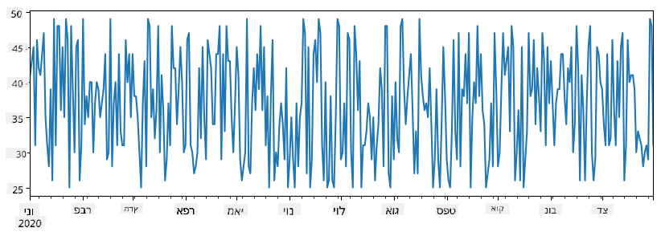
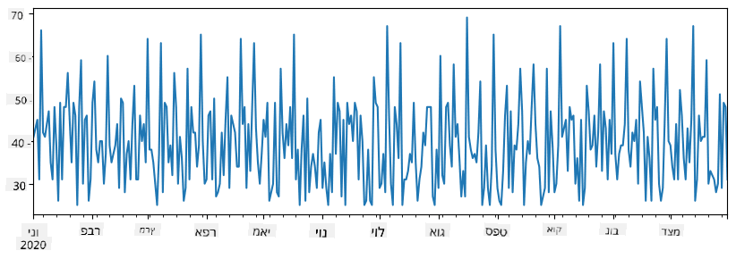
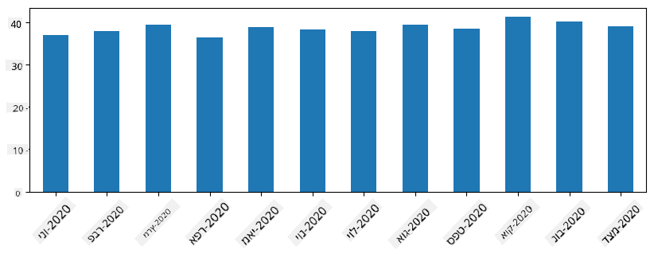
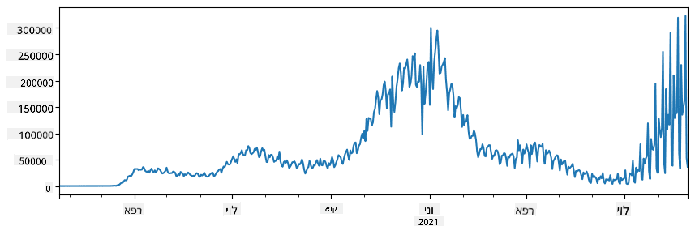
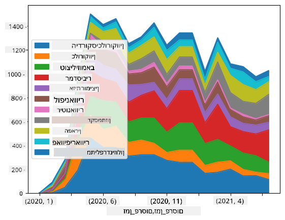

<!--
CO_OP_TRANSLATOR_METADATA:
{
  "original_hash": "116c5d361fbe812e59a73f37ce721d36",
  "translation_date": "2025-08-28T15:15:50+00:00",
  "source_file": "2-Working-With-Data/07-python/README.md",
  "language_code": "he"
}
-->
# עבודה עם נתונים: Python וספריית Pandas

|  ](../../sketchnotes/07-WorkWithPython.png) |
| :-------------------------------------------------------------------------------------------------------: |
|                 עבודה עם Python - _סקיצה מאת [@nitya](https://twitter.com/nitya)_                         |

[](https://youtu.be/dZjWOGbsN4Y)

בעוד שמאגרי נתונים מציעים דרכים יעילות מאוד לאחסן נתונים ולבצע שאילתות באמצעות שפות שאילתה, הדרך הגמישה ביותר לעיבוד נתונים היא כתיבת תוכנית משלך כדי לטפל בנתונים. במקרים רבים, ביצוע שאילתה במאגר נתונים יהיה דרך יעילה יותר. עם זאת, במקרים שבהם נדרש עיבוד נתונים מורכב יותר, לא ניתן לבצע זאת בקלות באמצעות SQL.  
ניתן לתכנת עיבוד נתונים בכל שפת תכנות, אך ישנן שפות מסוימות שהן ברמה גבוהה יותר בכל הנוגע לעבודה עם נתונים. מדעני נתונים בדרך כלל מעדיפים אחת מהשפות הבאות:

* **[Python](https://www.python.org/)**, שפת תכנות כללית, שנחשבת לעיתים קרובות לאחת האפשרויות הטובות ביותר למתחילים בשל הפשטות שלה. ל-Python יש הרבה ספריות נוספות שיכולות לעזור לך לפתור בעיות מעשיות רבות, כמו חילוץ נתונים מארכיון ZIP או המרת תמונה לגווני אפור. בנוסף למדעי הנתונים, Python משמשת גם לעיתים קרובות לפיתוח אתרים.  
* **[R](https://www.r-project.org/)** היא כלי מסורתי שפותח עם מחשבה על עיבוד נתונים סטטיסטיים. היא מכילה גם מאגר גדול של ספריות (CRAN), מה שהופך אותה לבחירה טובה לעיבוד נתונים. עם זאת, R אינה שפת תכנות כללית, והיא משמשת לעיתים רחוקות מחוץ לתחום מדעי הנתונים.  
* **[Julia](https://julialang.org/)** היא שפה נוספת שפותחה במיוחד עבור מדעי הנתונים. היא נועדה לספק ביצועים טובים יותר מ-Python, מה שהופך אותה לכלי מצוין לניסויים מדעיים.

בשיעור זה, נתמקד בשימוש ב-Python לעיבוד נתונים פשוט. נניח היכרות בסיסית עם השפה. אם ברצונך לסייר לעומק ב-Python, תוכל לעיין באחד מהמשאבים הבאים:

* [למד Python בדרך מהנה עם גרפיקה של צב ופרקטלים](https://github.com/shwars/pycourse) - קורס מבוא מהיר ל-Python מבוסס GitHub  
* [עשה את הצעדים הראשונים שלך עם Python](https://docs.microsoft.com/en-us/learn/paths/python-first-steps/?WT.mc_id=academic-77958-bethanycheum) מסלול למידה ב-[Microsoft Learn](http://learn.microsoft.com/?WT.mc_id=academic-77958-bethanycheum)

נתונים יכולים להגיע בצורות רבות. בשיעור זה, נתמקד בשלוש צורות של נתונים - **נתונים טבלאיים**, **טקסט** ו**תמונות**.

נתמקד בכמה דוגמאות לעיבוד נתונים, במקום לתת סקירה מלאה של כל הספריות הקשורות. זה יאפשר לך להבין את הרעיון המרכזי של מה אפשרי, ולהשאיר אותך עם הבנה היכן למצוא פתרונות לבעיות שלך כשאתה זקוק להם.

> **העצה הכי מועילה**. כשאתה צריך לבצע פעולה מסוימת על נתונים שאינך יודע כיצד לבצע, נסה לחפש אותה באינטרנט. [Stackoverflow](https://stackoverflow.com/) מכיל בדרך כלל הרבה דוגמאות קוד שימושיות ב-Python עבור משימות טיפוסיות רבות.

## [שאלון לפני השיעור](https://purple-hill-04aebfb03.1.azurestaticapps.net/quiz/12)

## נתונים טבלאיים ו-Dataframes

כבר פגשת נתונים טבלאיים כשדיברנו על מאגרי נתונים יחסיים. כשיש לך הרבה נתונים, והם נמצאים בטבלאות רבות ומקושרות, בהחלט יש היגיון להשתמש ב-SQL לעבודה איתם. עם זאת, ישנם מקרים רבים שבהם יש לנו טבלה של נתונים, ואנו צריכים לקבל **הבנה** או **תובנות** לגבי נתונים אלו, כמו התפלגות, קשרים בין ערכים, וכו'. במדעי הנתונים, ישנם מקרים רבים שבהם אנו צריכים לבצע כמה טרנספורמציות של הנתונים המקוריים, ולאחר מכן לבצע ויזואליזציה. שני השלבים הללו יכולים להתבצע בקלות באמצעות Python.

ישנן שתי ספריות שימושיות ביותר ב-Python שיכולות לעזור לך להתמודד עם נתונים טבלאיים:
* **[Pandas](https://pandas.pydata.org/)** מאפשרת לך לטפל ב-**Dataframes**, שהם אנלוגיים לטבלאות יחסיות. ניתן להגדיר עמודות עם שמות, ולבצע פעולות שונות על שורות, עמודות ו-Dataframes באופן כללי.  
* **[Numpy](https://numpy.org/)** היא ספרייה לעבודה עם **tensors**, כלומר **מערכים** רב-ממדיים. מערך מכיל ערכים מסוג בסיסי זהה, והוא פשוט יותר מ-Dataframe, אך מציע יותר פעולות מתמטיות ויוצר פחות עומס.

ישנן גם כמה ספריות נוספות שכדאי להכיר:
* **[Matplotlib](https://matplotlib.org/)** היא ספרייה המשמשת לויזואליזציה של נתונים ולשרטוט גרפים  
* **[SciPy](https://www.scipy.org/)** היא ספרייה עם כמה פונקציות מדעיות נוספות. כבר נתקלנו בספרייה זו כשדיברנו על הסתברות וסטטיסטיקה  

הנה קטע קוד שתשתמש בו בדרך כלל כדי לייבא את הספריות הללו בתחילת תוכנית Python:
```python
import numpy as np
import pandas as pd
import matplotlib.pyplot as plt
from scipy import ... # you need to specify exact sub-packages that you need
``` 

Pandas מתמקדת בכמה מושגים בסיסיים.

### Series 

**Series** היא רצף של ערכים, בדומה לרשימה או מערך numpy. ההבדל העיקרי הוא ש-Series מכילה גם **אינדקס**, וכשאנחנו מבצעים פעולות על Series (למשל, חיבור), האינדקס נלקח בחשבון. האינדקס יכול להיות פשוט כמו מספר שורה שלם (זהו האינדקס המשמש כברירת מחדל בעת יצירת Series מרשימה או מערך), או שהוא יכול להיות בעל מבנה מורכב, כמו טווח תאריכים.

> **הערה**: יש קוד מבוא ל-Pandas במחברת המצורפת [`notebook.ipynb`](notebook.ipynb). אנו מציינים כאן רק כמה דוגמאות, ואתם בהחלט מוזמנים לבדוק את המחברת המלאה.

לדוגמה: נניח שאנחנו רוצים לנתח מכירות של חנות גלידה שלנו. בואו ניצור סדרה של מספרי מכירות (מספר פריטים שנמכרו בכל יום) עבור תקופת זמן מסוימת:

```python
start_date = "Jan 1, 2020"
end_date = "Mar 31, 2020"
idx = pd.date_range(start_date,end_date)
print(f"Length of index is {len(idx)}")
items_sold = pd.Series(np.random.randint(25,50,size=len(idx)),index=idx)
items_sold.plot()
```


עכשיו נניח שבכל שבוע אנחנו מארגנים מסיבה לחברים, ולוקחים 10 חבילות גלידה נוספות למסיבה. נוכל ליצור סדרה נוספת, עם אינדקס לפי שבוע, כדי להדגים זאת:
```python
additional_items = pd.Series(10,index=pd.date_range(start_date,end_date,freq="W"))
```
כשאנחנו מחברים שתי סדרות יחד, אנחנו מקבלים את המספר הכולל:
```python
total_items = items_sold.add(additional_items,fill_value=0)
total_items.plot()
```


> **הערה** שאנחנו לא משתמשים בתחביר הפשוט `total_items+additional_items`. אם היינו עושים זאת, היינו מקבלים הרבה ערכי `NaN` (*Not a Number*) בסדרה המתקבלת. זאת מכיוון שיש ערכים חסרים עבור חלק מנקודות האינדקס בסדרה `additional_items`, וחיבור `NaN` לכל דבר מביא ל-`NaN`. לכן עלינו לציין את הפרמטר `fill_value` במהלך החיבור.

עם סדרות זמן, אנחנו יכולים גם **לדגום מחדש** את הסדרה עם מרווחי זמן שונים. לדוגמה, נניח שאנחנו רוצים לחשב את ממוצע נפח המכירות חודשי. נוכל להשתמש בקוד הבא:
```python
monthly = total_items.resample("1M").mean()
ax = monthly.plot(kind='bar')
```


### DataFrame

DataFrame הוא למעשה אוסף של סדרות עם אותו אינדקס. אנחנו יכולים לשלב כמה סדרות יחד ל-DataFrame:
```python
a = pd.Series(range(1,10))
b = pd.Series(["I","like","to","play","games","and","will","not","change"],index=range(0,9))
df = pd.DataFrame([a,b])
```
זה ייצור טבלה אופקית כמו זו:
|     | 0   | 1    | 2   | 3   | 4      | 5   | 6      | 7    | 8    |
| --- | --- | ---- | --- | --- | ------ | --- | ------ | ---- | ---- |
| 0   | 1   | 2    | 3   | 4   | 5      | 6   | 7      | 8    | 9    |
| 1   | I   | like | to  | use | Python | and | Pandas | very | much |

אנחנו יכולים גם להשתמש בסדרות כעמודות, ולציין שמות עמודות באמצעות מילון:
```python
df = pd.DataFrame({ 'A' : a, 'B' : b })
```
זה ייתן לנו טבלה כמו זו:

|     | A   | B      |
| --- | --- | ------ |
| 0   | 1   | I      |
| 1   | 2   | like   |
| 2   | 3   | to     |
| 3   | 4   | use    |
| 4   | 5   | Python |
| 5   | 6   | and    |
| 6   | 7   | Pandas |
| 7   | 8   | very   |
| 8   | 9   | much   |

**הערה** שאנחנו יכולים גם לקבל את פריסת הטבלה הזו על ידי טרנספוזיציה של הטבלה הקודמת, למשל על ידי כתיבה 
```python
df = pd.DataFrame([a,b]).T..rename(columns={ 0 : 'A', 1 : 'B' })
```
כאן `.T` מתייחס לפעולת הטרנספוזיציה של ה-DataFrame, כלומר שינוי שורות ועמודות, ופעולת `rename` מאפשרת לנו לשנות את שמות העמודות כדי להתאים לדוגמה הקודמת.

הנה כמה מהפעולות החשובות ביותר שאנחנו יכולים לבצע על DataFrames:

**בחירת עמודות**. אנחנו יכולים לבחור עמודות בודדות על ידי כתיבה `df['A']` - פעולה זו מחזירה סדרה. אנחנו יכולים גם לבחור תת-קבוצה של עמודות ל-DataFrame אחר על ידי כתיבה `df[['B','A']]` - זה מחזיר DataFrame נוסף.

**סינון** רק שורות מסוימות לפי קריטריונים. לדוגמה, כדי להשאיר רק שורות עם עמודה `A` גדולה מ-5, אנחנו יכולים לכתוב `df[df['A']>5]`.

> **הערה**: הדרך שבה סינון עובד היא כדלקמן. הביטוי `df['A']<5` מחזיר סדרה בוליאנית, שמציינת האם הביטוי הוא `True` או `False` עבור כל אלמנט בסדרה המקורית `df['A']`. כאשר סדרה בוליאנית משמשת כאינדקס, היא מחזירה תת-קבוצה של שורות ב-DataFrame. לכן לא ניתן להשתמש בביטוי בוליאני שרירותי של Python, לדוגמה, כתיבה `df[df['A']>5 and df['A']<7]` תהיה שגויה. במקום זאת, עליך להשתמש בפעולת `&` מיוחדת על סדרות בוליאניות, ולכתוב `df[(df['A']>5) & (df['A']<7)]` (*סוגריים חשובים כאן*).

**יצירת עמודות מחושבות חדשות**. אנחנו יכולים ליצור בקלות עמודות מחושבות חדשות עבור ה-DataFrame שלנו באמצעות ביטוי אינטואיטיבי כמו זה:
```python
df['DivA'] = df['A']-df['A'].mean() 
``` 
דוגמה זו מחשבת את הסטייה של A מערך הממוצע שלה. מה שקורה כאן בפועל הוא שאנחנו מחשבים סדרה, ואז משייכים את הסדרה הזו לצד השמאלי, ויוצרים עמודה חדשה. לכן, אנחנו לא יכולים להשתמש בפעולות שאינן תואמות לסדרות, לדוגמה, הקוד הבא שגוי:
```python
# Wrong code -> df['ADescr'] = "Low" if df['A'] < 5 else "Hi"
df['LenB'] = len(df['B']) # <- Wrong result
``` 
הדוגמה האחרונה, למרות שהיא נכונה מבחינה תחבירית, נותנת לנו תוצאה שגויה, מכיוון שהיא משייכת את אורך הסדרה `B` לכל הערכים בעמודה, ולא את אורך האלמנטים הבודדים כפי שהתכוונו.

אם אנחנו צריכים לחשב ביטויים מורכבים כמו זה, אנחנו יכולים להשתמש בפונקציה `apply`. הדוגמה האחרונה יכולה להיכתב כך:
```python
df['LenB'] = df['B'].apply(lambda x : len(x))
# or 
df['LenB'] = df['B'].apply(len)
```

לאחר הפעולות לעיל, נגיע ל-DataFrame הבא:

|     | A   | B      | DivA | LenB |
| --- | --- | ------ | ---- | ---- |
| 0   | 1   | I      | -4.0 | 1    |
| 1   | 2   | like   | -3.0 | 4    |
| 2   | 3   | to     | -2.0 | 2    |
| 3   | 4   | use    | -1.0 | 3    |
| 4   | 5   | Python | 0.0  | 6    |
| 5   | 6   | and    | 1.0  | 3    |
| 6   | 7   | Pandas | 2.0  | 6    |
| 7   | 8   | very   | 3.0  | 4    |
| 8   | 9   | much   | 4.0  | 4    |

**בחירת שורות לפי מספרים** יכולה להתבצע באמצעות מבנה `iloc`. לדוגמה, כדי לבחור את 5 השורות הראשונות מה-DataFrame:
```python
df.iloc[:5]
```

**קיבוץ** משמש לעיתים קרובות כדי לקבל תוצאה דומה ל-*טבלאות ציר* ב-Excel. נניח שאנחנו רוצים לחשב את ערך הממוצע של עמודה `A` עבור כל מספר נתון של `LenB`. אז אנחנו יכולים לקבץ את ה-DataFrame שלנו לפי `LenB`, ולקרוא ל-`mean`:
```python
df.groupby(by='LenB').mean()
```
אם אנחנו צריכים לחשב ממוצע ומספר האלמנטים בקבוצה, אז אנחנו יכולים להשתמש בפונקציה `aggregate` מורכבת יותר:
```python
df.groupby(by='LenB') \
 .aggregate({ 'DivA' : len, 'A' : lambda x: x.mean() }) \
 .rename(columns={ 'DivA' : 'Count', 'A' : 'Mean'})
```
זה נותן לנו את הטבלה הבאה:

| LenB | Count | Mean     |
| ---- | ----- | -------- |
| 1    | 1     | 1.000000 |
| 2    | 1     | 3.000000 |
| 3    | 2     | 5.000000 |
| 4    | 3     | 6.333333 |
| 6    | 2     | 6.000000 |

### קבלת נתונים
ראינו כמה קל ליצור Series ו-DataFrames מאובייקטים של Python. עם זאת, נתונים בדרך כלל מגיעים בצורה של קובץ טקסט או טבלת Excel. למרבה המזל, Pandas מציעה לנו דרך פשוטה לטעון נתונים מהדיסק. לדוגמה, קריאת קובץ CSV היא פשוטה כמו זו:
```python
df = pd.read_csv('file.csv')
```
נראה דוגמאות נוספות לטעינת נתונים, כולל הבאתם מאתרים חיצוניים, בסעיף "אתגר".

### הדפסה וגרפים

מדען נתונים לעיתים קרובות צריך לחקור את הנתונים, ולכן חשוב להיות מסוגל להציג אותם בצורה חזותית. כאשר DataFrame גדול, פעמים רבות נרצה רק לוודא שאנחנו עושים הכל נכון על ידי הדפסת השורות הראשונות. ניתן לעשות זאת על ידי קריאה ל-`df.head()`. אם אתם מריצים זאת מתוך Jupyter Notebook, זה ידפיס את ה-DataFrame בצורה טבלאית יפה.

כמו כן, ראינו את השימוש בפונקציה `plot` כדי להציג גרפים של עמודות מסוימות. בעוד ש-`plot` מאוד שימושית למשימות רבות ותומכת בסוגי גרפים שונים באמצעות הפרמטר `kind=`, תמיד ניתן להשתמש בספריית `matplotlib` כדי ליצור גרפים מורכבים יותר. נעסוק בהדמיית נתונים בפירוט בשיעורים נפרדים של הקורס.

סקירה זו מכסה את הרעיונות החשובים ביותר של Pandas, אך הספרייה עשירה מאוד ואין גבול למה שניתן לעשות איתה! עכשיו ניישם את הידע הזה לפתרון בעיה ספציפית.

## 🚀 אתגר 1: ניתוח התפשטות COVID

הבעיה הראשונה שבה נתמקד היא מודלינג של התפשטות מגפת COVID-19. כדי לעשות זאת, נשתמש בנתונים על מספר הנדבקים במדינות שונות, המסופקים על ידי [Center for Systems Science and Engineering](https://systems.jhu.edu/) (CSSE) ב-[אוניברסיטת ג'ונס הופקינס](https://jhu.edu/). מערך הנתונים זמין ב-[מאגר GitHub זה](https://github.com/CSSEGISandData/COVID-19).

מכיוון שאנחנו רוצים להדגים כיצד להתמודד עם נתונים, אנו מזמינים אתכם לפתוח את [`notebook-covidspread.ipynb`](notebook-covidspread.ipynb) ולקרוא אותו מההתחלה ועד הסוף. תוכלו גם להריץ תאים ולעשות כמה אתגרים שהשארנו לכם בסוף.



> אם אינכם יודעים כיצד להריץ קוד ב-Jupyter Notebook, עיינו ב-[מאמר זה](https://soshnikov.com/education/how-to-execute-notebooks-from-github/).

## עבודה עם נתונים לא מובנים

בעוד שנתונים מגיעים לעיתים קרובות בצורה טבלאית, במקרים מסוימים אנו צריכים להתמודד עם נתונים פחות מובנים, לדוגמה, טקסט או תמונות. במקרה כזה, כדי ליישם טכניקות עיבוד נתונים שראינו קודם, עלינו **לחלץ** נתונים מובנים. הנה כמה דוגמאות:

* חילוץ מילות מפתח מטקסט ובדיקת תדירות הופעתן
* שימוש ברשתות נוירונים לחילוץ מידע על אובייקטים בתמונה
* קבלת מידע על רגשות של אנשים מזרם מצלמת וידאו

## 🚀 אתגר 2: ניתוח מאמרים על COVID

באתגר זה, נמשיך עם נושא מגפת COVID, ונעסוק בעיבוד מאמרים מדעיים בנושא. ישנו [מערך נתונים CORD-19](https://www.kaggle.com/allen-institute-for-ai/CORD-19-research-challenge) עם יותר מ-7000 (בזמן כתיבת שורות אלו) מאמרים על COVID, הזמינים עם מטא-נתונים ותקצירים (ובכחצי מהם גם טקסט מלא).

דוגמה מלאה לניתוח מערך נתונים זה באמצעות [Text Analytics for Health](https://docs.microsoft.com/azure/cognitive-services/text-analytics/how-tos/text-analytics-for-health/?WT.mc_id=academic-77958-bethanycheum) מתוארת [בפוסט בבלוג זה](https://soshnikov.com/science/analyzing-medical-papers-with-azure-and-text-analytics-for-health/). נדון בגרסה פשוטה יותר של ניתוח זה.

> **NOTE**: איננו מספקים עותק של מערך הנתונים כחלק ממאגר זה. ייתכן שתצטרכו להוריד תחילה את הקובץ [`metadata.csv`](https://www.kaggle.com/allen-institute-for-ai/CORD-19-research-challenge?select=metadata.csv) ממערך נתונים זה ב-Kaggle. ייתכן שתידרש הרשמה ל-Kaggle. תוכלו גם להוריד את מערך הנתונים ללא הרשמה [מכאן](https://ai2-semanticscholar-cord-19.s3-us-west-2.amazonaws.com/historical_releases.html), אך הוא יכלול את כל הטקסטים המלאים בנוסף לקובץ המטא-נתונים.

פתחו את [`notebook-papers.ipynb`](notebook-papers.ipynb) וקראו אותו מההתחלה ועד הסוף. תוכלו גם להריץ תאים ולעשות כמה אתגרים שהשארנו לכם בסוף.



## עיבוד נתוני תמונה

לאחרונה פותחו מודלים AI חזקים מאוד שמאפשרים לנו להבין תמונות. ישנם משימות רבות שניתן לפתור באמצעות רשתות נוירונים מוכנות מראש או שירותי ענן. כמה דוגמאות כוללות:

* **סיווג תמונות**, שיכול לעזור לכם לקטלג את התמונה לאחת מהקטגוריות המוגדרות מראש. תוכלו בקלות לאמן מסווגי תמונות משלכם באמצעות שירותים כמו [Custom Vision](https://azure.microsoft.com/services/cognitive-services/custom-vision-service/?WT.mc_id=academic-77958-bethanycheum)
* **זיהוי אובייקטים** כדי לזהות אובייקטים שונים בתמונה. שירותים כמו [computer vision](https://azure.microsoft.com/services/cognitive-services/computer-vision/?WT.mc_id=academic-77958-bethanycheum) יכולים לזהות מספר אובייקטים נפוצים, ותוכלו לאמן מודל [Custom Vision](https://azure.microsoft.com/services/cognitive-services/custom-vision-service/?WT.mc_id=academic-77958-bethanycheum) לזהות אובייקטים ספציפיים שמעניינים אתכם.
* **זיהוי פנים**, כולל גיל, מגדר וזיהוי רגשות. ניתן לעשות זאת באמצעות [Face API](https://azure.microsoft.com/services/cognitive-services/face/?WT.mc_id=academic-77958-bethanycheum).

כל שירותי הענן הללו יכולים להיקרא באמצעות [Python SDKs](https://docs.microsoft.com/samples/azure-samples/cognitive-services-python-sdk-samples/cognitive-services-python-sdk-samples/?WT.mc_id=academic-77958-bethanycheum), ולכן ניתן לשלבם בקלות בתהליך חקר הנתונים שלכם.

הנה כמה דוגמאות לחקר נתונים ממקורות תמונה:
* בפוסט בבלוג [איך ללמוד מדעי נתונים ללא קוד](https://soshnikov.com/azure/how-to-learn-data-science-without-coding/) אנו חוקרים תמונות מאינסטגרם, בניסיון להבין מה גורם לאנשים לתת יותר לייקים לתמונה. תחילה אנו מחלצים כמה שיותר מידע מהתמונות באמצעות [computer vision](https://azure.microsoft.com/services/cognitive-services/computer-vision/?WT.mc_id=academic-77958-bethanycheum), ולאחר מכן משתמשים ב-[Azure Machine Learning AutoML](https://docs.microsoft.com/azure/machine-learning/concept-automated-ml/?WT.mc_id=academic-77958-bethanycheum) כדי לבנות מודל שניתן לפרש.
* ב-[סדנת מחקרי פנים](https://github.com/CloudAdvocacy/FaceStudies) אנו משתמשים ב-[Face API](https://azure.microsoft.com/services/cognitive-services/face/?WT.mc_id=academic-77958-bethanycheum) כדי לחלץ רגשות של אנשים בתמונות מאירועים, בניסיון להבין מה גורם לאנשים להיות שמחים.

## סיכום

בין אם כבר יש לכם נתונים מובנים או לא מובנים, באמצעות Python תוכלו לבצע את כל השלבים הקשורים לעיבוד והבנת נתונים. זו כנראה הדרך הגמישה ביותר לעיבוד נתונים, ולכן רוב מדעני הנתונים משתמשים ב-Python ככלי העיקרי שלהם. לימוד Python לעומק הוא כנראה רעיון טוב אם אתם רציניים לגבי המסע שלכם במדעי הנתונים!

## [שאלון לאחר השיעור](https://purple-hill-04aebfb03.1.azurestaticapps.net/quiz/13)

## סקירה ולימוד עצמי

**ספרים**
* [Wes McKinney. Python for Data Analysis: Data Wrangling with Pandas, NumPy, and IPython](https://www.amazon.com/gp/product/1491957662)

**משאבים מקוונים**
* מדריך רשמי [10 דקות ל-Pandas](https://pandas.pydata.org/pandas-docs/stable/user_guide/10min.html)
* [תיעוד על הדמיה ב-Pandas](https://pandas.pydata.org/pandas-docs/stable/user_guide/visualization.html)

**לימוד Python**
* [למדו Python בצורה מהנה עם גרפיקת Turtle ופרקטלים](https://github.com/shwars/pycourse)
* [עשו את הצעדים הראשונים שלכם עם Python](https://docs.microsoft.com/learn/paths/python-first-steps/?WT.mc_id=academic-77958-bethanycheum) מסלול לימוד ב-[Microsoft Learn](http://learn.microsoft.com/?WT.mc_id=academic-77958-bethanycheum)

## משימה

[בצעו מחקר נתונים מפורט יותר עבור האתגרים לעיל](assignment.md)

## קרדיטים

שיעור זה נכתב באהבה על ידי [Dmitry Soshnikov](http://soshnikov.com)

---

**כתב ויתור**:  
מסמך זה תורגם באמצעות שירות תרגום מבוסס בינה מלאכותית [Co-op Translator](https://github.com/Azure/co-op-translator). בעוד שאנו שואפים לדיוק, יש לקחת בחשבון שתרגומים אוטומטיים עשויים להכיל שגיאות או אי-דיוקים. המסמך המקורי בשפתו המקורית נחשב למקור הסמכותי. למידע קריטי, מומלץ להשתמש בתרגום מקצועי על ידי מתרגם אנושי. איננו נושאים באחריות לכל אי-הבנה או פרשנות שגויה הנובעת משימוש בתרגום זה.