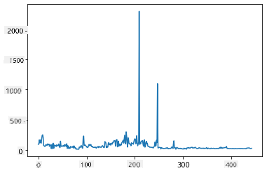
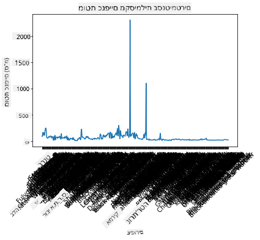
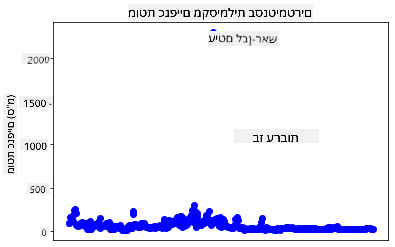
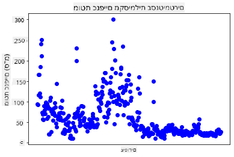
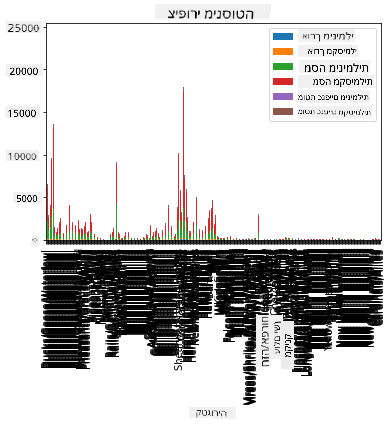
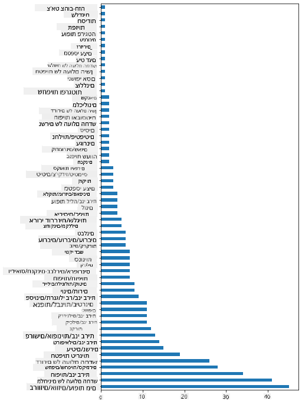
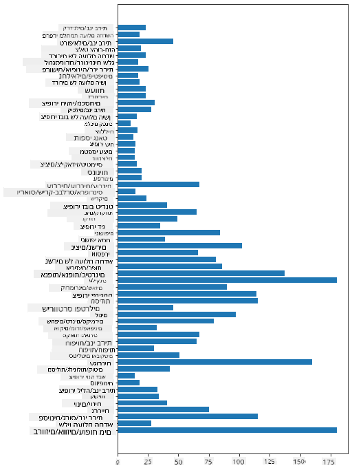
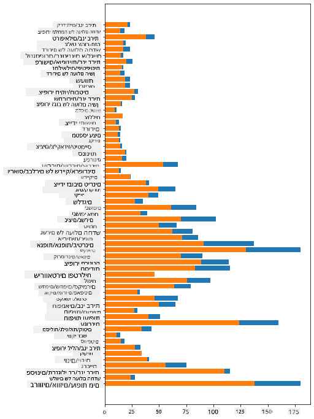

<!--
CO_OP_TRANSLATOR_METADATA:
{
  "original_hash": "43c402d9d90ae6da55d004519ada5033",
  "translation_date": "2025-08-28T15:39:11+00:00",
  "source_file": "3-Data-Visualization/09-visualization-quantities/README.md",
  "language_code": "he"
}
-->
# חזותיות של כמויות

| ](../../sketchnotes/09-Visualizing-Quantities.png)|
|:---:|
| חזותיות של כמויות - _סקצ'נוט מאת [@nitya](https://twitter.com/nitya)_ |

בשיעור זה תחקור כיצד להשתמש באחת מהספריות הרבות הזמינות ב-Python כדי ללמוד כיצד ליצור חזותיות מעניינות סביב מושג הכמות. באמצעות מערך נתונים נקי על ציפורים במינסוטה, תוכל ללמוד עובדות מעניינות רבות על חיי הבר המקומיים.  
## [שאלון לפני השיעור](https://purple-hill-04aebfb03.1.azurestaticapps.net/quiz/16)

## התבוננות במוטת כנפיים עם Matplotlib

ספרייה מצוינת ליצירת גרפים ודיאגרמות פשוטות ומורכבות מסוגים שונים היא [Matplotlib](https://matplotlib.org/stable/index.html). באופן כללי, תהליך יצירת גרפים באמצעות ספריות אלו כולל זיהוי החלקים במערך הנתונים שברצונך למקד, ביצוע טרנספורמציות נחוצות על הנתונים, הקצאת ערכי ציר x ו-y, החלטה על סוג הגרף להצגה, ואז הצגת הגרף. Matplotlib מציעה מגוון רחב של חזותיות, אך בשיעור זה נתמקד באלו המתאימים ביותר להצגת כמויות: גרפי קו, גרפי פיזור וגרפי עמודות.

> ✅ השתמש בגרף המתאים ביותר למבנה הנתונים ולסיפור שברצונך לספר.  
> - לניתוח מגמות לאורך זמן: קו  
> - להשוואת ערכים: עמודות, טורים, עוגה, פיזור  
> - להראות כיצד חלקים מתייחסים לשלם: עוגה  
> - להראות התפלגות נתונים: פיזור, עמודות  
> - להראות מגמות: קו, טור  
> - להראות קשרים בין ערכים: קו, פיזור, בועה  

אם יש לך מערך נתונים ואתה צריך לגלות כמה פריטים מסוימים כלולים בו, אחת המשימות הראשונות שלך תהיה לבדוק את הערכים שלו.

✅ ישנם 'דפי עזר' מצוינים ל-Matplotlib [כאן](https://matplotlib.org/cheatsheets/cheatsheets.pdf).

## יצירת גרף קו על ערכי מוטת כנפיים של ציפורים

פתח את הקובץ `notebook.ipynb` בתיקיית השיעור והוסף תא.

> הערה: הנתונים מאוחסנים בשורש מאגר זה בתיקיית `/data`.

```python
import pandas as pd
import matplotlib.pyplot as plt
birds = pd.read_csv('../../data/birds.csv')
birds.head()
```  
הנתונים הם שילוב של טקסט ומספרים:

|      | שם                          | שם מדעי                | קטגוריה               | סדר          | משפחה   | סוג         | מצב שימור          | אורך מינימלי | אורך מקסימלי | משקל גוף מינימלי | משקל גוף מקסימלי | מוטת כנפיים מינימלית | מוטת כנפיים מקסימלית |
| ---: | :-------------------------- | :--------------------- | :-------------------- | :----------- | :------- | :---------- | :----------------- | ------------: | ------------: | ----------------: | ----------------: | --------------------: | --------------------: |
|    0 | ברווז שרוק שחור-בטן        | Dendrocygna autumnalis | ברווזים/אווזים/עופות מים | Anseriformes | Anatidae | Dendrocygna | LC                 |        47     |        56     |         652       |        1020       |          76          |          94          |
|    1 | ברווז שרוק חום              | Dendrocygna bicolor    | ברווזים/אווזים/עופות מים | Anseriformes | Anatidae | Dendrocygna | LC                 |        45     |        53     |         712       |        1050       |          85          |          93          |
|    2 | אווז שלג                    | Anser caerulescens     | ברווזים/אווזים/עופות מים | Anseriformes | Anatidae | Anser       | LC                 |        64     |        79     |        2050       |        4050       |         135          |         165          |
|    3 | אווז רוס                    | Anser rossii           | ברווזים/אווזים/עופות מים | Anseriformes | Anatidae | Anser       | LC                 |      57.3     |        64     |        1066       |        1567       |         113          |         116          |
|    4 | אווז לבן-חזית גדול          | Anser albifrons        | ברווזים/אווזים/עופות מים | Anseriformes | Anatidae | Anser       | LC                 |        64     |        81     |        1930       |        3310       |         130          |         165          |

נתחיל על ידי גרף חלק מהנתונים המספריים באמצעות גרף קו בסיסי. נניח שברצונך לראות את מוטת הכנפיים המקסימלית של הציפורים המעניינות הללו.

```python
wingspan = birds['MaxWingspan'] 
wingspan.plot()
```  


מה אתה שם לב מיד? נראה שיש לפחות ערך חריג אחד - זו מוטת כנפיים מרשימה! מוטת כנפיים של 2300 סנטימטרים שווה ל-23 מטרים - האם יש פטרודקטילים במינסוטה? בוא נחקור.

בעוד שתוכל לבצע מיון מהיר ב-Excel כדי למצוא את הערכים החריגים, שהם כנראה טעויות הקלדה, המשך תהליך החזותיות מתוך הגרף.

הוסף תוויות לציר ה-x כדי להראות אילו סוגי ציפורים מדובר:

```
plt.title('Max Wingspan in Centimeters')
plt.ylabel('Wingspan (CM)')
plt.xlabel('Birds')
plt.xticks(rotation=45)
x = birds['Name'] 
y = birds['MaxWingspan']

plt.plot(x, y)

plt.show()
```  


גם עם סיבוב התוויות ל-45 מעלות, יש יותר מדי לקרוא. בוא ננסה אסטרטגיה שונה: תווית רק את הערכים החריגים והגדר את התוויות בתוך הגרף. תוכל להשתמש בגרף פיזור כדי ליצור יותר מקום לתוויות:

```python
plt.title('Max Wingspan in Centimeters')
plt.ylabel('Wingspan (CM)')
plt.tick_params(axis='both',which='both',labelbottom=False,bottom=False)

for i in range(len(birds)):
    x = birds['Name'][i]
    y = birds['MaxWingspan'][i]
    plt.plot(x, y, 'bo')
    if birds['MaxWingspan'][i] > 500:
        plt.text(x, y * (1 - 0.05), birds['Name'][i], fontsize=12)
    
plt.show()
```  
מה קורה כאן? השתמשת ב-`tick_params` כדי להסתיר את התוויות התחתונות ואז יצרת לולאה על מערך הנתונים של הציפורים שלך. על ידי גרף עם נקודות כחולות קטנות באמצעות `bo`, בדקת אם יש ציפור עם מוטת כנפיים מקסימלית מעל 500 והצגת את התווית שלה ליד הנקודה אם כן. הזזת את התוויות מעט על ציר ה-y (`y * (1 - 0.05)`) והשתמשת בשם הציפור כתווית.

מה גילית?

  
## סינון הנתונים שלך

גם עיטם לבן-ראש וגם בז ערבות, למרות שהם כנראה ציפורים גדולות מאוד, נראים כמתויגים בצורה שגויה, עם `0` נוסף למוטת הכנפיים המקסימלית שלהם. לא סביר שתפגוש עיטם לבן-ראש עם מוטת כנפיים של 25 מטרים, אבל אם כן, אנא הודע לנו! בוא ניצור מערך נתונים חדש ללא שני הערכים החריגים הללו:

```python
plt.title('Max Wingspan in Centimeters')
plt.ylabel('Wingspan (CM)')
plt.xlabel('Birds')
plt.tick_params(axis='both',which='both',labelbottom=False,bottom=False)
for i in range(len(birds)):
    x = birds['Name'][i]
    y = birds['MaxWingspan'][i]
    if birds['Name'][i] not in ['Bald eagle', 'Prairie falcon']:
        plt.plot(x, y, 'bo')
plt.show()
```  

על ידי סינון הערכים החריגים, הנתונים שלך עכשיו יותר קוהרנטיים ומובנים.



עכשיו שיש לנו מערך נתונים נקי לפחות מבחינת מוטת כנפיים, בוא נגלה עוד על הציפורים הללו.

בעוד שגרפי קו ופיזור יכולים להציג מידע על ערכי נתונים והתפלגותם, אנחנו רוצים לחשוב על הערכים הטמונים במערך הנתונים הזה. תוכל ליצור חזותיות כדי לענות על השאלות הבאות על כמויות:

> כמה קטגוריות של ציפורים יש, ומה המספרים שלהן?  
> כמה ציפורים נכחדו, בסכנת הכחדה, נדירות או נפוצות?  
> כמה יש מהסוגים והסדרים השונים במינוח של לינאוס?  
## חקור גרפי עמודות

גרפי עמודות הם מעשיים כאשר אתה צריך להציג קבוצות של נתונים. בוא נחקור את קטגוריות הציפורים הקיימות במערך הנתונים הזה כדי לראות איזו היא הנפוצה ביותר במספר.

בקובץ המחברת, צור גרף עמודות בסיסי.

✅ שים לב, תוכל לסנן את שתי הציפורים החריגות שזיהינו בסעיף הקודם, לערוך את הטעות במוטת הכנפיים שלהן, או להשאיר אותן בתרגילים אלו שאינם תלויים בערכי מוטת כנפיים.

אם ברצונך ליצור גרף עמודות, תוכל לבחור את הנתונים שברצונך להתמקד בהם. גרפי עמודות יכולים להיווצר מנתונים גולמיים:

```python
birds.plot(x='Category',
        kind='bar',
        stacked=True,
        title='Birds of Minnesota')

```  


עם זאת, גרף עמודות זה אינו קריא מכיוון שיש יותר מדי נתונים לא מקובצים. עליך לבחור רק את הנתונים שברצונך לגרף, אז בוא נסתכל על אורך הציפורים לפי קטגוריה.

סנן את הנתונים שלך כך שיכללו רק את קטגוריית הציפורים.

✅ שים לב שאתה משתמש ב-Pandas לניהול הנתונים, ואז נותן ל-Matplotlib לבצע את הגרף.

מכיוון שיש הרבה קטגוריות, תוכל להציג את הגרף הזה אנכית ולהתאים את גובהו כדי להתחשב בכל הנתונים:

```python
category_count = birds.value_counts(birds['Category'].values, sort=True)
plt.rcParams['figure.figsize'] = [6, 12]
category_count.plot.barh()
```  


גרף עמודות זה מציג מבט טוב על מספר הציפורים בכל קטגוריה. במבט חטוף, אתה רואה שמספר הציפורים הגדול ביותר באזור זה נמצא בקטגוריית ברווזים/אווזים/עופות מים. מינסוטה היא 'ארץ 10,000 האגמים', כך שזה לא מפתיע!

✅ נסה כמה ספירות אחרות על מערך הנתונים הזה. האם משהו מפתיע אותך?

## השוואת נתונים

תוכל לנסות השוואות שונות של נתונים מקובצים על ידי יצירת צירים חדשים. נסה השוואה של אורך מקסימלי של ציפור, בהתבסס על הקטגוריה שלה:

```python
maxlength = birds['MaxLength']
plt.barh(y=birds['Category'], width=maxlength)
plt.rcParams['figure.figsize'] = [6, 12]
plt.show()
```  


שום דבר לא מפתיע כאן: לקוליברים יש אורך מקסימלי קטן ביותר בהשוואה לפליקנים או אווזים. זה טוב כאשר נתונים הגיוניים מבחינה לוגית!

תוכל ליצור חזותיות מעניינות יותר של גרפי עמודות על ידי הצגת נתונים חופפים. בוא נציג את האורך המינימלי והמקסימלי על קטגוריית ציפור נתונה:

```python
minLength = birds['MinLength']
maxLength = birds['MaxLength']
category = birds['Category']

plt.barh(category, maxLength)
plt.barh(category, minLength)

plt.show()
```  
בגרף זה, תוכל לראות את הטווח לכל קטגוריית ציפור של האורך המינימלי והמקסימלי. תוכל לומר בבטחה, בהתבסס על נתונים אלו, שככל שהציפור גדולה יותר, טווח האורך שלה גדול יותר. מרתק!



## 🚀 אתגר

מערך הנתונים של הציפורים הזה מציע שפע של מידע על סוגים שונים של ציפורים בתוך מערכת אקולוגית מסוימת. חפש באינטרנט וראה אם תוכל למצוא מערכי נתונים אחרים הקשורים לציפורים. תרגל יצירת גרפים ודיאגרמות סביב הציפורים הללו כדי לגלות עובדות שלא ידעת.

## [שאלון לאחר השיעור](https://purple-hill-04aebfb03.1.azurestaticapps.net/quiz/17)

## סקירה ולימוד עצמי

השיעור הראשון הזה נתן לך מידע על איך להשתמש ב-Matplotlib כדי להציג כמויות. ערוך מחקר על דרכים אחרות לעבוד עם מערכי נתונים לצורך חזותיות. [Plotly](https://github.com/plotly/plotly.py) היא אחת שלא נסקור בשיעורים אלו, אז תסתכל על מה שהיא יכולה להציע.

## משימה

[קווים, פיזורים ועמודות](assignment.md)  

---

**כתב ויתור**:  
מסמך זה תורגם באמצעות שירות תרגום מבוסס בינה מלאכותית [Co-op Translator](https://github.com/Azure/co-op-translator). בעוד שאנו שואפים לדיוק, יש להיות מודעים לכך שתרגומים אוטומטיים עשויים להכיל שגיאות או אי-דיוקים. המסמך המקורי בשפתו המקורית צריך להיחשב כמקור הסמכותי. למידע קריטי, מומלץ להשתמש בתרגום מקצועי על ידי מתרגם אנושי. איננו נושאים באחריות לכל אי-הבנה או פרשנות שגויה הנובעת משימוש בתרגום זה.