<!--
CO_OP_TRANSLATOR_METADATA:
{
  "original_hash": "87faccac113d772551486a67a607153e",
  "translation_date": "2025-08-28T15:44:30+00:00",
  "source_file": "3-Data-Visualization/10-visualization-distributions/README.md",
  "language_code": "he"
}
-->
# הצגת התפלגויות

| ](../../sketchnotes/10-Visualizing-Distributions.png)|
|:---:|
| הצגת התפלגויות - _סקיצה מאת [@nitya](https://twitter.com/nitya)_ |

בשיעור הקודם, למדת כמה עובדות מעניינות על מערך נתונים של ציפורים ממינסוטה. זיהית נתונים שגויים על ידי הצגת ערכים חריגים ובחנת את ההבדלים בין קטגוריות הציפורים לפי אורך מקסימלי.

## [שאלון לפני השיעור](https://purple-hill-04aebfb03.1.azurestaticapps.net/quiz/18)
## חקר מערך הנתונים של הציפורים

דרך נוספת לחקור נתונים היא על ידי בחינת ההתפלגות שלהם, כלומר איך הנתונים מאורגנים לאורך ציר. אולי, לדוגמה, תרצה ללמוד על ההתפלגות הכללית, עבור מערך הנתונים הזה, של מוטת הכנפיים המקסימלית או מסת הגוף המקסימלית של הציפורים ממינסוטה.

בוא נגלה כמה עובדות על התפלגויות הנתונים במערך הנתונים הזה. בקובץ _notebook.ipynb_ שנמצא בתיקיית השיעור, יבא את Pandas, Matplotlib ואת הנתונים שלך:

```python
import pandas as pd
import matplotlib.pyplot as plt
birds = pd.read_csv('../../data/birds.csv')
birds.head()
```

|      | שם                          | שם מדעי                | קטגוריה               | סדר          | משפחה   | סוג         | מצב שימור            | אורך מינימלי | אורך מקסימלי | מסת גוף מינימלית | מסת גוף מקסימלית | מוטת כנפיים מינימלית | מוטת כנפיים מקסימלית |
| ---: | :--------------------------- | :--------------------- | :-------------------- | :----------- | :------- | :---------- | :----------------- | --------: | --------: | ----------: | ----------: | ----------: | ----------: |
|    0 | ברווז שרוק שחור-בטן         | Dendrocygna autumnalis | ברווזים/אווזים/עופות מים | Anseriformes | Anatidae | Dendrocygna | LC                 |        47 |        56 |         652 |        1020 |          76 |          94 |
|    1 | ברווז שרוק חום-בטן          | Dendrocygna bicolor    | ברווזים/אווזים/עופות מים | Anseriformes | Anatidae | Dendrocygna | LC                 |        45 |        53 |         712 |        1050 |          85 |          93 |
|    2 | אווז שלג                    | Anser caerulescens     | ברווזים/אווזים/עופות מים | Anseriformes | Anatidae | Anser       | LC                 |        64 |        79 |        2050 |        4050 |         135 |         165 |
|    3 | אווז רוס                   | Anser rossii           | ברווזים/אווזים/עופות מים | Anseriformes | Anatidae | Anser       | LC                 |      57.3 |        64 |        1066 |        1567 |         113 |         116 |
|    4 | אווז לבן-חזית גדול          | Anser albifrons        | ברווזים/אווזים/עופות מים | Anseriformes | Anatidae | Anser       | LC                 |        64 |        81 |        1930 |        3310 |         130 |         165 |

באופן כללי, ניתן להסתכל במהירות על אופן ההתפלגות של הנתונים באמצעות תרשים פיזור כפי שעשינו בשיעור הקודם:

```python
birds.plot(kind='scatter',x='MaxLength',y='Order',figsize=(12,8))

plt.title('Max Length per Order')
plt.ylabel('Order')
plt.xlabel('Max Length')

plt.show()
```
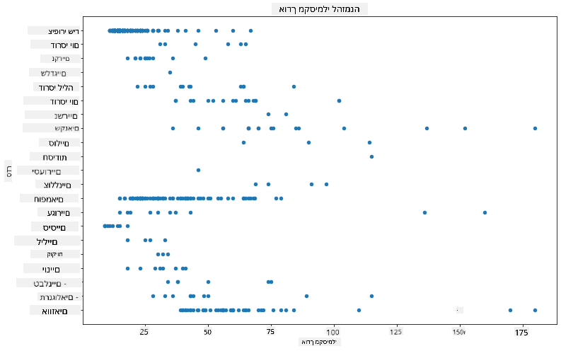

זה נותן סקירה כללית של ההתפלגות הכללית של אורך הגוף לפי סדר הציפורים, אך זו אינה הדרך האופטימלית להציג התפלגויות אמיתיות. משימה זו בדרך כלל מתבצעת באמצעות יצירת היסטוגרמה.
## עבודה עם היסטוגרמות

Matplotlib מציעה דרכים מצוינות להציג התפלגות נתונים באמצעות היסטוגרמות. סוג תרשים זה דומה לתרשים עמודות שבו ההתפלגות נראית דרך עלייה וירידה של העמודות. כדי לבנות היסטוגרמה, יש צורך בנתונים מספריים. כדי לבנות היסטוגרמה, ניתן ליצור תרשים ולהגדיר את הסוג כ-'hist' עבור היסטוגרמה. תרשים זה מציג את ההתפלגות של MaxBodyMass עבור טווח הנתונים המספריים של מערך הנתונים כולו. על ידי חלוקת מערך הנתונים שהוא מקבל לתאים קטנים יותר, ניתן להציג את ההתפלגות של ערכי הנתונים:

```python
birds['MaxBodyMass'].plot(kind = 'hist', bins = 10, figsize = (12,12))
plt.show()
```
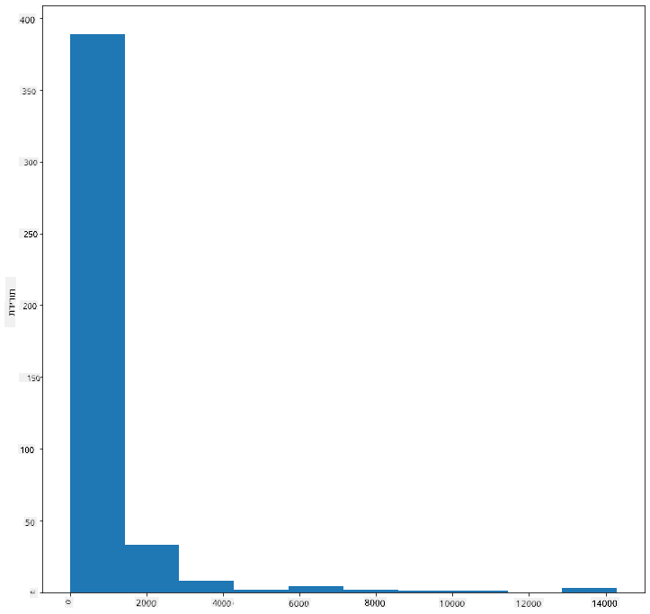

כפי שניתן לראות, רוב 400+ הציפורים במערך הנתונים הזה נמצאות בטווח של פחות מ-2000 עבור מסת הגוף המקסימלית שלהן. ניתן לקבל תובנות נוספות על הנתונים על ידי שינוי הפרמטר `bins` למספר גבוה יותר, כמו 30:

```python
birds['MaxBodyMass'].plot(kind = 'hist', bins = 30, figsize = (12,12))
plt.show()
```
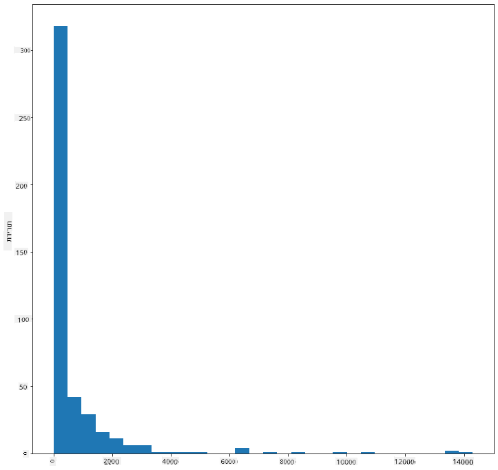

תרשים זה מציג את ההתפלגות בצורה מעט יותר מפורטת. ניתן ליצור תרשים פחות מוטה שמאלה על ידי הבטחת בחירת נתונים רק בטווח נתון:

סנן את הנתונים שלך כדי לקבל רק את הציפורים שמסת הגוף שלהן פחות מ-60, והצג 40 `bins`:

```python
filteredBirds = birds[(birds['MaxBodyMass'] > 1) & (birds['MaxBodyMass'] < 60)]      
filteredBirds['MaxBodyMass'].plot(kind = 'hist',bins = 40,figsize = (12,12))
plt.show()     
```
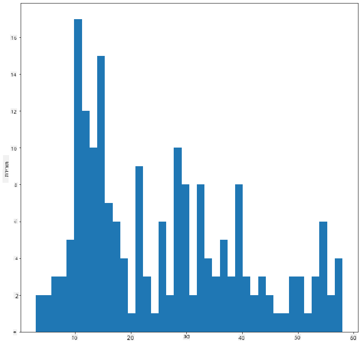

✅ נסה מסננים ונקודות נתונים אחרות. כדי לראות את ההתפלגות המלאה של הנתונים, הסר את המסנן `['MaxBodyMass']` כדי להציג התפלגויות מתויגות.

ההיסטוגרמה מציעה גם שיפורים נחמדים בצבע ובתיוג שכדאי לנסות:

צור היסטוגרמה דו-ממדית כדי להשוות את הקשר בין שתי התפלגויות. בוא נשווה `MaxBodyMass` מול `MaxLength`. Matplotlib מציעה דרך מובנית להציג התכנסות באמצעות צבעים בהירים יותר:

```python
x = filteredBirds['MaxBodyMass']
y = filteredBirds['MaxLength']

fig, ax = plt.subplots(tight_layout=True)
hist = ax.hist2d(x, y)
```
נראה שיש מתאם צפוי בין שני האלמנטים הללו לאורך ציר צפוי, עם נקודת התכנסות חזקה במיוחד אחת:

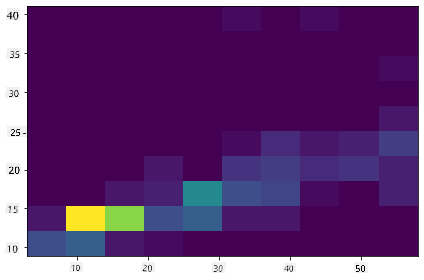

היסטוגרמות עובדות היטב כברירת מחדל עבור נתונים מספריים. מה אם צריך לראות התפלגויות לפי נתונים טקסטואליים? 
## חקר מערך הנתונים להתפלגויות באמצעות נתונים טקסטואליים 

מערך הנתונים הזה כולל גם מידע טוב על קטגוריית הציפורים, סוגן, מינן ומשפחתן וכן על מצב השימור שלהן. בוא נחקור את המידע הזה על מצב השימור. מהי ההתפלגות של הציפורים לפי מצב השימור שלהן?

> ✅ במערך הנתונים, נעשה שימוש בכמה ראשי תיבות לתיאור מצב השימור. ראשי תיבות אלו מגיעים מ-[קטגוריות הרשימה האדומה של IUCN](https://www.iucnredlist.org/), ארגון שמקטלג את מצבם של מינים.
> 
> - CR: בסכנת הכחדה חמורה
> - EN: בסכנת הכחדה
> - EX: נכחד
> - LC: ללא חשש
> - NT: קרוב לסיכון
> - VU: פגיע

אלו ערכים מבוססי טקסט ולכן תצטרך לבצע טרנספורמציה כדי ליצור היסטוגרמה. באמצעות מסגרת הנתונים filteredBirds, הצג את מצב השימור שלה לצד מוטת הכנפיים המינימלית שלה. מה אתה רואה?

```python
x1 = filteredBirds.loc[filteredBirds.ConservationStatus=='EX', 'MinWingspan']
x2 = filteredBirds.loc[filteredBirds.ConservationStatus=='CR', 'MinWingspan']
x3 = filteredBirds.loc[filteredBirds.ConservationStatus=='EN', 'MinWingspan']
x4 = filteredBirds.loc[filteredBirds.ConservationStatus=='NT', 'MinWingspan']
x5 = filteredBirds.loc[filteredBirds.ConservationStatus=='VU', 'MinWingspan']
x6 = filteredBirds.loc[filteredBirds.ConservationStatus=='LC', 'MinWingspan']

kwargs = dict(alpha=0.5, bins=20)

plt.hist(x1, **kwargs, color='red', label='Extinct')
plt.hist(x2, **kwargs, color='orange', label='Critically Endangered')
plt.hist(x3, **kwargs, color='yellow', label='Endangered')
plt.hist(x4, **kwargs, color='green', label='Near Threatened')
plt.hist(x5, **kwargs, color='blue', label='Vulnerable')
plt.hist(x6, **kwargs, color='gray', label='Least Concern')

plt.gca().set(title='Conservation Status', ylabel='Min Wingspan')
plt.legend();
```

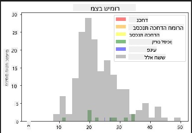

לא נראה שיש מתאם טוב בין מוטת כנפיים מינימלית לבין מצב השימור. בדוק אלמנטים אחרים במערך הנתונים באמצעות שיטה זו. תוכל לנסות מסננים שונים גם כן. האם אתה מוצא מתאם כלשהו?

## תרשימי צפיפות

ייתכן ששמת לב שההיסטוגרמות שראינו עד כה הן 'מדורגות' ואינן זורמות בצורה חלקה בקשת. כדי להציג תרשים צפיפות חלק יותר, תוכל לנסות תרשים צפיפות.

כדי לעבוד עם תרשימי צפיפות, הכיר ספריית תרשימים חדשה, [Seaborn](https://seaborn.pydata.org/generated/seaborn.kdeplot.html). 

טען את Seaborn ונסה תרשים צפיפות בסיסי:

```python
import seaborn as sns
import matplotlib.pyplot as plt
sns.kdeplot(filteredBirds['MinWingspan'])
plt.show()
```
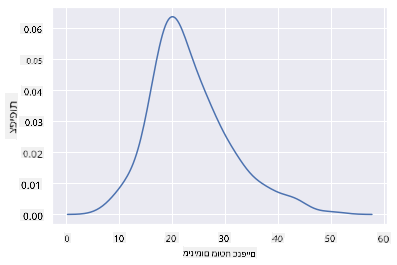

ניתן לראות כיצד התרשים משקף את התרשים הקודם עבור נתוני מוטת כנפיים מינימלית; הוא פשוט מעט חלק יותר. לפי התיעוד של Seaborn, "בהשוואה להיסטוגרמה, KDE יכול ליצור תרשים שהוא פחות עמוס ויותר ניתן לפירוש, במיוחד כאשר מציירים התפלגויות מרובות. אך יש לו פוטנציאל להכניס עיוותים אם ההתפלגות הבסיסית מוגבלת או לא חלקה. כמו בהיסטוגרמה, איכות הייצוג תלויה גם בבחירת פרמטרי החלקה טובים." [מקור](https://seaborn.pydata.org/generated/seaborn.kdeplot.html) במילים אחרות, ערכים חריגים כמו תמיד יגרמו לתרשימים שלך להתנהג בצורה לא טובה.

אם תרצה לחזור לקו המדרגות של MaxBodyMass בתרשים השני שבנית, תוכל להחליק אותו היטב על ידי יצירתו מחדש באמצעות שיטה זו:

```python
sns.kdeplot(filteredBirds['MaxBodyMass'])
plt.show()
```
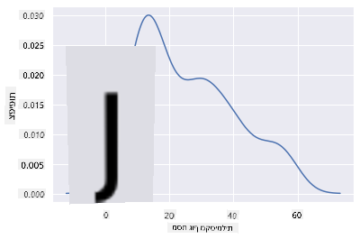

אם תרצה קו חלק, אך לא חלק מדי, ערוך את הפרמטר `bw_adjust`: 

```python
sns.kdeplot(filteredBirds['MaxBodyMass'], bw_adjust=.2)
plt.show()
```
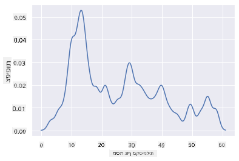

✅ קרא על הפרמטרים הזמינים עבור סוג תרשים זה ונסה להתנסות!

סוג תרשים זה מציע ויזואליזציות מסבירות בצורה יפה. עם כמה שורות קוד, לדוגמה, תוכל להציג את צפיפות מסת הגוף המקסימלית לפי סדר הציפורים:

```python
sns.kdeplot(
   data=filteredBirds, x="MaxBodyMass", hue="Order",
   fill=True, common_norm=False, palette="crest",
   alpha=.5, linewidth=0,
)
```

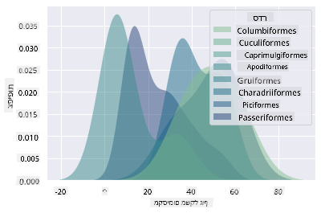

תוכל גם למפות את הצפיפות של כמה משתנים בתרשים אחד. בדוק את האורך המקסימלי והמינימלי של ציפור בהשוואה למצב השימור שלה:

```python
sns.kdeplot(data=filteredBirds, x="MinLength", y="MaxLength", hue="ConservationStatus")
```

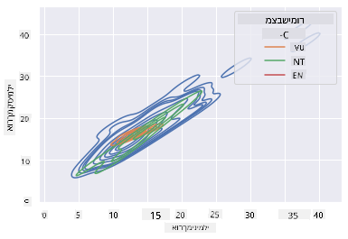

אולי כדאי לחקור האם הצבר של ציפורים 'פגיעות' לפי אורכן הוא משמעותי או לא.

## 🚀 אתגר

היסטוגרמות הן סוג תרשים מתוחכם יותר מתרשימי פיזור, עמודות או קווים בסיסיים. חפש באינטרנט דוגמאות טובות לשימוש בהיסטוגרמות. כיצד הן משמשות, מה הן מדגימות, ובאילו תחומים או תחומי מחקר הן נוטות להיות בשימוש?

## [שאלון לאחר השיעור](https://purple-hill-04aebfb03.1.azurestaticapps.net/quiz/19)

## סקירה ולימוד עצמי

בשיעור זה השתמשת ב-Matplotlib והתחלת לעבוד עם Seaborn כדי להציג תרשימים מתוחכמים יותר. ערוך מחקר על `kdeplot` ב-Seaborn, "עקומת צפיפות הסתברות רציפה בממד אחד או יותר". קרא את [התיעוד](https://seaborn.pydata.org/generated/seaborn.kdeplot.html) כדי להבין כיצד הוא עובד.

## משימה

[הפעל את הכישורים שלך](assignment.md)

---

**כתב ויתור**:  
מסמך זה תורגם באמצעות שירות תרגום מבוסס בינה מלאכותית [Co-op Translator](https://github.com/Azure/co-op-translator). בעוד שאנו שואפים לדיוק, יש לקחת בחשבון שתרגומים אוטומטיים עשויים להכיל שגיאות או אי דיוקים. המסמך המקורי בשפתו המקורית צריך להיחשב כמקור סמכותי. עבור מידע קריטי, מומלץ להשתמש בתרגום מקצועי על ידי אדם. איננו נושאים באחריות לאי הבנות או לפרשנויות שגויות הנובעות משימוש בתרגום זה.