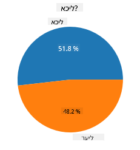
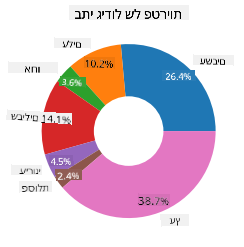
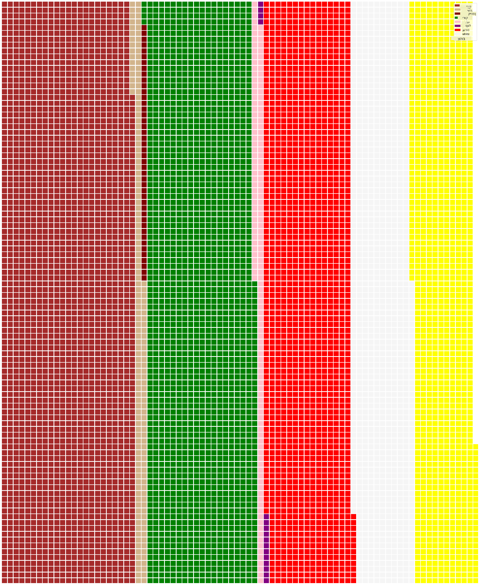

<!--
CO_OP_TRANSLATOR_METADATA:
{
  "original_hash": "af6a12015c6e250e500b570a9fa42593",
  "translation_date": "2025-08-28T15:37:51+00:00",
  "source_file": "3-Data-Visualization/11-visualization-proportions/README.md",
  "language_code": "he"
}
-->
# ויזואליזציה של יחסים

|](../../sketchnotes/11-Visualizing-Proportions.png)|
|:---:|
|ויזואליזציה של יחסים - _סקצ'נוט מאת [@nitya](https://twitter.com/nitya)_ |

בשיעור הזה, תשתמשו במאגר נתונים ממוקד טבע כדי להמחיש יחסים, כמו כמה סוגים שונים של פטריות מופיעים במאגר נתונים מסוים על פטריות. בואו נחקור את הפטריות המרתקות הללו באמצעות מאגר נתונים שמקורו ב-Audubon, הכולל פרטים על 23 מינים של פטריות עם זימים ממשפחות Agaricus ו-Lepiota. תתנסו בויזואליזציות טעימות כמו:

- גרפי עוגה 🥧  
- גרפי דונאט 🍩  
- גרפי ואפל 🧇  

> 💡 פרויקט מעניין מאוד בשם [Charticulator](https://charticulator.com) מבית Microsoft Research מציע ממשק גרירה ושחרור חינמי ליצירת ויזואליזציות של נתונים. באחד המדריכים שלהם הם גם משתמשים במאגר הנתונים הזה על פטריות! כך תוכלו לחקור את הנתונים וללמוד את הספרייה בו-זמנית: [מדריך Charticulator](https://charticulator.com/tutorials/tutorial4.html).

## [שאלון לפני השיעור](https://purple-hill-04aebfb03.1.azurestaticapps.net/quiz/20)

## הכירו את הפטריות שלכם 🍄

פטריות הן מאוד מעניינות. בואו נייבא מאגר נתונים כדי ללמוד עליהן:

```python
import pandas as pd
import matplotlib.pyplot as plt
mushrooms = pd.read_csv('../../data/mushrooms.csv')
mushrooms.head()
```  
טבלה מודפסת עם נתונים נהדרים לניתוח:

| class     | cap-shape | cap-surface | cap-color | bruises | odor    | gill-attachment | gill-spacing | gill-size | gill-color | stalk-shape | stalk-root | stalk-surface-above-ring | stalk-surface-below-ring | stalk-color-above-ring | stalk-color-below-ring | veil-type | veil-color | ring-number | ring-type | spore-print-color | population | habitat |
| --------- | --------- | ----------- | --------- | ------- | ------- | --------------- | ------------ | --------- | ---------- | ----------- | ---------- | ------------------------ | ------------------------ | ---------------------- | ---------------------- | --------- | ---------- | ----------- | --------- | ----------------- | ---------- | ------- |
| Poisonous | Convex    | Smooth      | Brown     | Bruises | Pungent | Free            | Close        | Narrow    | Black      | Enlarging   | Equal      | Smooth                   | Smooth                   | White                  | White                  | Partial   | White      | One         | Pendant   | Black             | Scattered  | Urban   |
| Edible    | Convex    | Smooth      | Yellow    | Bruises | Almond  | Free            | Close        | Broad     | Black      | Enlarging   | Club       | Smooth                   | Smooth                   | White                  | White                  | Partial   | White      | One         | Pendant   | Brown             | Numerous   | Grasses |
| Edible    | Bell      | Smooth      | White     | Bruises | Anise   | Free            | Close        | Broad     | Brown      | Enlarging   | Club       | Smooth                   | Smooth                   | White                  | White                  | Partial   | White      | One         | Pendant   | Brown             | Numerous   | Meadows |
| Poisonous | Convex    | Scaly       | White     | Bruises | Pungent | Free            | Close        | Narrow    | Brown      | Enlarging   | Equal      | Smooth                   | Smooth                   | White                  | White                  | Partial   | White      | One         | Pendant   | Black             | Scattered  | Urban   |

מיד שמים לב שכל הנתונים הם טקסטואליים. תצטרכו להמיר את הנתונים הללו כדי שתוכלו להשתמש בהם בגרף. למעשה, רוב הנתונים מיוצגים כאובייקט:

```python
print(mushrooms.select_dtypes(["object"]).columns)
```  

הפלט הוא:

```output
Index(['class', 'cap-shape', 'cap-surface', 'cap-color', 'bruises', 'odor',
       'gill-attachment', 'gill-spacing', 'gill-size', 'gill-color',
       'stalk-shape', 'stalk-root', 'stalk-surface-above-ring',
       'stalk-surface-below-ring', 'stalk-color-above-ring',
       'stalk-color-below-ring', 'veil-type', 'veil-color', 'ring-number',
       'ring-type', 'spore-print-color', 'population', 'habitat'],
      dtype='object')
```  
קחו את הנתונים הללו והמירו את עמודת 'class' לקטגוריה:

```python
cols = mushrooms.select_dtypes(["object"]).columns
mushrooms[cols] = mushrooms[cols].astype('category')
```  

```python
edibleclass=mushrooms.groupby(['class']).count()
edibleclass
```  

עכשיו, אם תדפיסו את נתוני הפטריות, תוכלו לראות שהם חולקו לקטגוריות לפי מחלקת רעילות/אכילות:

|           | cap-shape | cap-surface | cap-color | bruises | odor | gill-attachment | gill-spacing | gill-size | gill-color | stalk-shape | ... | stalk-surface-below-ring | stalk-color-above-ring | stalk-color-below-ring | veil-type | veil-color | ring-number | ring-type | spore-print-color | population | habitat |
| --------- | --------- | ----------- | --------- | ------- | ---- | --------------- | ------------ | --------- | ---------- | ----------- | --- | ------------------------ | ---------------------- | ---------------------- | --------- | ---------- | ----------- | --------- | ----------------- | ---------- | ------- |
| class     |           |             |           |         |      |                 |              |           |            |             |     |                          |                        |                        |           |            |             |           |                   |            |         |
| Edible    | 4208      | 4208        | 4208      | 4208    | 4208 | 4208            | 4208         | 4208      | 4208       | 4208        | ... | 4208                     | 4208                   | 4208                   | 4208      | 4208       | 4208        | 4208      | 4208              | 4208       | 4208    |
| Poisonous | 3916      | 3916        | 3916      | 3916    | 3916 | 3916            | 3916         | 3916      | 3916       | 3916        | ... | 3916                     | 3916                   | 3916                   | 3916      | 3916       | 3916        | 3916      | 3916              | 3916       | 3916    |

אם תעקבו אחרי הסדר המוצג בטבלה הזו ליצירת תוויות קטגוריות, תוכלו לבנות גרף עוגה:

## עוגה!

```python
labels=['Edible','Poisonous']
plt.pie(edibleclass['population'],labels=labels,autopct='%.1f %%')
plt.title('Edible?')
plt.show()
```  
והנה, גרף עוגה שמציג את היחסים בנתונים לפי שתי המחלקות של הפטריות. חשוב מאוד לוודא שהסדר של התוויות נכון, במיוחד כאן, אז בדקו את הסדר שבו נבנית מערך התוויות!



## דונאט!

גרף עוגה מעניין יותר מבחינה ויזואלית הוא גרף דונאט, שהוא גרף עוגה עם חור במרכז. בואו נסתכל על הנתונים שלנו בשיטה הזו.

הסתכלו על בתי הגידול השונים שבהם פטריות גדלות:

```python
habitat=mushrooms.groupby(['habitat']).count()
habitat
```  
כאן, אתם מקבצים את הנתונים לפי בית גידול. ישנם 7 בתי גידול, אז השתמשו בהם כתוויות לגרף הדונאט שלכם:

```python
labels=['Grasses','Leaves','Meadows','Paths','Urban','Waste','Wood']

plt.pie(habitat['class'], labels=labels,
        autopct='%1.1f%%', pctdistance=0.85)
  
center_circle = plt.Circle((0, 0), 0.40, fc='white')
fig = plt.gcf()

fig.gca().add_artist(center_circle)
  
plt.title('Mushroom Habitats')
  
plt.show()
```  



הקוד הזה מצייר גרף ומעגל מרכזי, ואז מוסיף את המעגל המרכזי לגרף. ערכו את רוחב המעגל המרכזי על ידי שינוי `0.40` לערך אחר.

ניתן לשנות גרפי דונאט בדרכים שונות כדי לשפר את קריאות התוויות. למדו עוד ב-[תיעוד](https://matplotlib.org/stable/gallery/pie_and_polar_charts/pie_and_donut_labels.html?highlight=donut).

עכשיו, כשאתם יודעים איך לקבץ את הנתונים שלכם ולהציג אותם כעוגה או דונאט, תוכלו לחקור סוגים אחרים של גרפים. נסו גרף ואפל, שהוא פשוט דרך שונה להמחשת כמויות.

## ואפל!

גרף מסוג 'ואפל' הוא דרך שונה להמחיש כמויות כטבלה דו-ממדית של ריבועים. נסו להמחיש את הכמויות השונות של צבעי כובע הפטריות במאגר הנתונים הזה. לשם כך, תצטרכו להתקין ספריית עזר בשם [PyWaffle](https://pypi.org/project/pywaffle/) ולהשתמש ב-Matplotlib:

```python
pip install pywaffle
```  

בחרו קטע מהנתונים שלכם לקיבוץ:

```python
capcolor=mushrooms.groupby(['cap-color']).count()
capcolor
```  

צרו גרף ואפל על ידי יצירת תוויות ואז קיבוץ הנתונים שלכם:

```python
import pandas as pd
import matplotlib.pyplot as plt
from pywaffle import Waffle
  
data ={'color': ['brown', 'buff', 'cinnamon', 'green', 'pink', 'purple', 'red', 'white', 'yellow'],
    'amount': capcolor['class']
     }
  
df = pd.DataFrame(data)
  
fig = plt.figure(
    FigureClass = Waffle,
    rows = 100,
    values = df.amount,
    labels = list(df.color),
    figsize = (30,30),
    colors=["brown", "tan", "maroon", "green", "pink", "purple", "red", "whitesmoke", "yellow"],
)
```  

באמצעות גרף ואפל, ניתן לראות בבירור את היחסים של צבעי כובעי הפטריות במאגר הנתונים הזה. מעניין, ישנן פטריות רבות עם כובעים ירוקים!



✅ PyWaffle תומכת באייקונים בתוך הגרפים שמשתמשים בכל אייקון זמין ב-[Font Awesome](https://fontawesome.com/). נסו לערוך ניסויים וליצור גרף ואפל מעניין יותר באמצעות אייקונים במקום ריבועים.

בשיעור הזה, למדתם שלוש דרכים להמחיש יחסים. ראשית, עליכם לקבץ את הנתונים שלכם לקטגוריות ואז להחליט מהי הדרך הטובה ביותר להציג את הנתונים - עוגה, דונאט, או ואפל. כל הדרכים טעימות ומספקות למשתמש תמונת מצב מיידית של מאגר הנתונים.

## 🚀 אתגר

נסו ליצור מחדש את הגרפים הטעימים הללו ב-[Charticulator](https://charticulator.com).  
## [שאלון אחרי השיעור](https://purple-hill-04aebfb03.1.azurestaticapps.net/quiz/21)

## סקירה ולימוד עצמי

לפעמים לא ברור מתי להשתמש בגרף עוגה, דונאט, או ואפל. הנה כמה מאמרים לקריאה בנושא:

https://www.beautiful.ai/blog/battle-of-the-charts-pie-chart-vs-donut-chart  

https://medium.com/@hypsypops/pie-chart-vs-donut-chart-showdown-in-the-ring-5d24fd86a9ce  

https://www.mit.edu/~mbarker/formula1/f1help/11-ch-c6.htm  

https://medium.datadriveninvestor.com/data-visualization-done-the-right-way-with-tableau-waffle-chart-fdf2a19be402  

בצעו מחקר נוסף כדי למצוא מידע נוסף על ההחלטה המורכבת הזו.

## משימה

[נסו את זה ב-Excel](assignment.md)  

---

**כתב ויתור**:  
מסמך זה תורגם באמצעות שירות תרגום מבוסס בינה מלאכותית [Co-op Translator](https://github.com/Azure/co-op-translator). בעוד שאנו שואפים לדיוק, יש להיות מודעים לכך שתרגומים אוטומטיים עשויים להכיל שגיאות או אי-דיוקים. המסמך המקורי בשפתו המקורית צריך להיחשב כמקור הסמכותי. למידע קריטי, מומלץ להשתמש בתרגום מקצועי על ידי בני אדם. איננו נושאים באחריות לכל אי-הבנה או פרשנות שגויה הנובעת משימוש בתרגום זה.