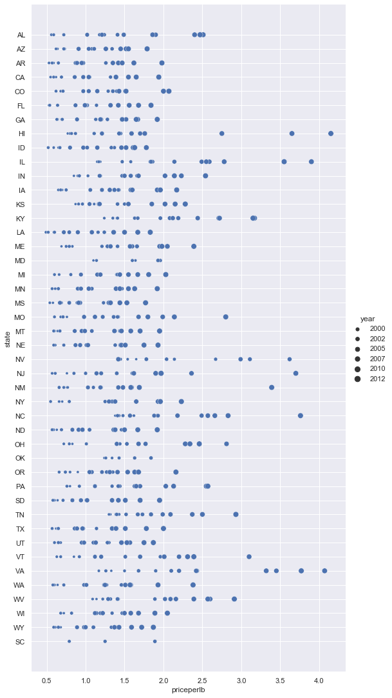
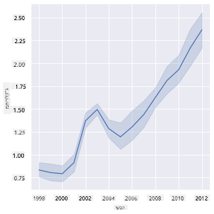
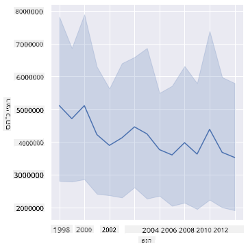
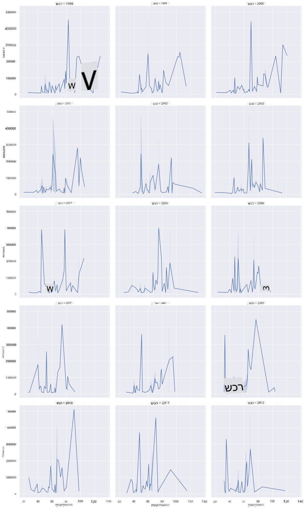
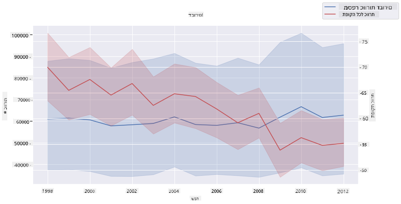

<!--
CO_OP_TRANSLATOR_METADATA:
{
  "original_hash": "b29e427401499e81f4af55a8c4afea76",
  "translation_date": "2025-09-04T20:11:00+00:00",
  "source_file": "3-Data-Visualization/12-visualization-relationships/README.md",
  "language_code": "he"
}
-->
# ויזואליזציה של קשרים: הכל על דבש 🍯

|](../../sketchnotes/12-Visualizing-Relationships.png)|
|:---:|
|ויזואליזציה של קשרים - _סקצ'נוט מאת [@nitya](https://twitter.com/nitya)_|

בהמשך להתמקדות שלנו בטבע, בואו נגלה ויזואליזציות מעניינות שמציגות את הקשרים בין סוגים שונים של דבש, בהתבסס על מאגר נתונים שמקורו ב-[משרד החקלאות של ארצות הברית](https://www.nass.usda.gov/About_NASS/index.php).

מאגר הנתונים הזה, שמכיל כ-600 פריטים, מציג את ייצור הדבש במדינות שונות בארה"ב. לדוגמה, ניתן לבחון את מספר הכוורות, התפוקה לכל כוורת, הייצור הכולל, המלאי, המחיר לקילוגרם, והערך של הדבש שיוצר במדינה מסוימת בין השנים 1998-2012, כאשר כל שורה מייצגת שנה אחת לכל מדינה.

יהיה מעניין להציג את הקשר בין ייצור הדבש במדינה מסוימת בשנה מסוימת לבין, לדוגמה, המחיר של הדבש באותה מדינה. לחלופין, ניתן להציג את הקשר בין התפוקה לכל כוורת במדינות השונות. טווח השנים הזה כולל את התקופה שבה התגלה לראשונה "הפרעת קריסת המושבה" (CCD) בשנת 2006 (http://npic.orst.edu/envir/ccd.html), ולכן מדובר במאגר נתונים מרתק ללימוד. 🐝

## [שאלון לפני השיעור](https://purple-hill-04aebfb03.1.azurestaticapps.net/quiz/22)

בשיעור הזה, תוכלו להשתמש ב-Seaborn, ספרייה שכבר השתמשתם בה בעבר, ככלי מצוין לויזואליזציה של קשרים בין משתנים. במיוחד מעניין השימוש בפונקציה `relplot` של Seaborn, שמאפשרת ליצור גרפים פיזוריים וגרפים קוויים כדי להציג במהירות '[קשרים סטטיסטיים](https://seaborn.pydata.org/tutorial/relational.html?highlight=relationships)', שמסייעים למדעני נתונים להבין טוב יותר את הקשרים בין משתנים.

## גרפים פיזוריים

השתמשו בגרף פיזורי כדי להציג כיצד המחיר של הדבש התפתח משנה לשנה, לפי מדינה. Seaborn, באמצעות `relplot`, מקבצת את הנתונים לפי מדינה ומציגה נקודות נתונים עבור נתונים קטגוריים ומספריים כאחד.

נתחיל בייבוא הנתונים וב-Seaborn:

```python
import pandas as pd
import matplotlib.pyplot as plt
import seaborn as sns
honey = pd.read_csv('../../data/honey.csv')
honey.head()
```
תבחינו שמאגר הנתונים של הדבש מכיל מספר עמודות מעניינות, כולל שנה ומחיר לקילוגרם. בואו נחקור את הנתונים האלה, מקובצים לפי מדינות בארה"ב:

| מדינה | numcol | yieldpercol | totalprod | stocks   | priceperlb | prodvalue | year |
| ----- | ------ | ----------- | --------- | -------- | ---------- | --------- | ---- |
| AL    | 16000  | 71          | 1136000   | 159000   | 0.72       | 818000    | 1998 |
| AZ    | 55000  | 60          | 3300000   | 1485000  | 0.64       | 2112000   | 1998 |
| AR    | 53000  | 65          | 3445000   | 1688000  | 0.59       | 2033000   | 1998 |
| CA    | 450000 | 83          | 37350000  | 12326000 | 0.62       | 23157000  | 1998 |
| CO    | 27000  | 72          | 1944000   | 1594000  | 0.7        | 1361000   | 1998 |

צרו גרף פיזורי בסיסי כדי להציג את הקשר בין המחיר לקילוגרם של דבש לבין מדינת המקור שלו. ודאו שציר ה-`y` גבוה מספיק כדי להציג את כל המדינות:

```python
sns.relplot(x="priceperlb", y="state", data=honey, height=15, aspect=.5);
```


כעת, הציגו את אותם נתונים עם סכמת צבעים של דבש כדי להראות כיצד המחיר מתפתח לאורך השנים. ניתן לעשות זאת על ידי הוספת פרמטר 'hue' כדי להציג את השינוי משנה לשנה:

> ✅ למדו עוד על [סכמות הצבעים שניתן להשתמש בהן ב-Seaborn](https://seaborn.pydata.org/tutorial/color_palettes.html) - נסו סכמת צבעים יפהפייה של קשת בענן!

```python
sns.relplot(x="priceperlb", y="state", hue="year", palette="YlOrBr", data=honey, height=15, aspect=.5);
```


עם שינוי סכמת הצבעים, ניתן לראות בבירור שיש התקדמות חזקה לאורך השנים מבחינת המחיר לקילוגרם של דבש. למעשה, אם תבחנו סט נתונים לדוגמה כדי לאמת (בחרו מדינה מסוימת, כמו אריזונה), תוכלו לראות דפוס של עליית מחירים משנה לשנה, עם מעט חריגות:

| מדינה | numcol | yieldpercol | totalprod | stocks  | priceperlb | prodvalue | year |
| ----- | ------ | ----------- | --------- | ------- | ---------- | --------- | ---- |
| AZ    | 55000  | 60          | 3300000   | 1485000 | 0.64       | 2112000   | 1998 |
| AZ    | 52000  | 62          | 3224000   | 1548000 | 0.62       | 1999000   | 1999 |
| AZ    | 40000  | 59          | 2360000   | 1322000 | 0.73       | 1723000   | 2000 |
| AZ    | 43000  | 59          | 2537000   | 1142000 | 0.72       | 1827000   | 2001 |
| AZ    | 38000  | 63          | 2394000   | 1197000 | 1.08       | 2586000   | 2002 |
| AZ    | 35000  | 72          | 2520000   | 983000  | 1.34       | 3377000   | 2003 |
| AZ    | 32000  | 55          | 1760000   | 774000  | 1.11       | 1954000   | 2004 |
| AZ    | 36000  | 50          | 1800000   | 720000  | 1.04       | 1872000   | 2005 |
| AZ    | 30000  | 65          | 1950000   | 839000  | 0.91       | 1775000   | 2006 |
| AZ    | 30000  | 64          | 1920000   | 902000  | 1.26       | 2419000   | 2007 |
| AZ    | 25000  | 64          | 1600000   | 336000  | 1.26       | 2016000   | 2008 |
| AZ    | 20000  | 52          | 1040000   | 562000  | 1.45       | 1508000   | 2009 |
| AZ    | 24000  | 77          | 1848000   | 665000  | 1.52       | 2809000   | 2010 |
| AZ    | 23000  | 53          | 1219000   | 427000  | 1.55       | 1889000   | 2011 |
| AZ    | 22000  | 46          | 1012000   | 253000  | 1.79       | 1811000   | 2012 |

דרך נוספת להציג את ההתקדמות הזו היא באמצעות גודל, במקום צבע. עבור משתמשים עיוורי צבעים, זו עשויה להיות אפשרות טובה יותר. ערכו את הוויזואליזציה כך שתציג עלייה במחיר באמצעות עלייה בהיקף הנקודות:

```python
sns.relplot(x="priceperlb", y="state", size="year", data=honey, height=15, aspect=.5);
```
ניתן לראות שהגודל של הנקודות גדל בהדרגה.



האם מדובר במקרה פשוט של היצע וביקוש? בשל גורמים כמו שינויי אקלים וקריסת מושבות, האם יש פחות דבש זמין לרכישה משנה לשנה, ולכן המחיר עולה?

כדי לגלות קשר בין חלק מהמשתנים במאגר הנתונים הזה, בואו נחקור כמה גרפים קוויים.

## גרפים קוויים

שאלה: האם יש עלייה ברורה במחיר הדבש לקילוגרם משנה לשנה? ניתן לגלות זאת בקלות על ידי יצירת גרף קווי יחיד:

```python
sns.relplot(x="year", y="priceperlb", kind="line", data=honey);
```
תשובה: כן, עם כמה חריגות סביב שנת 2003:



✅ מכיוון ש-Seaborn מאגדת נתונים סביב קו אחד, היא מציגה "את המדידות המרובות בכל ערך x על ידי הצגת הממוצע וטווח הביטחון של 95% סביב הממוצע". [מקור](https://seaborn.pydata.org/tutorial/relational.html). ניתן לבטל התנהגות זו על ידי הוספת `ci=None`.

שאלה: ובכן, בשנת 2003 האם ניתן לראות גם עלייה בהיצע הדבש? מה אם תבחנו את הייצור הכולל משנה לשנה?

```python
sns.relplot(x="year", y="totalprod", kind="line", data=honey);
```



תשובה: לא ממש. אם תבחנו את הייצור הכולל, נראה שהוא דווקא עלה באותה שנה מסוימת, למרות שבאופן כללי כמות הדבש המיוצרת נמצאת בירידה בשנים הללו.

שאלה: במקרה כזה, מה יכול היה לגרום לעלייה במחיר הדבש סביב שנת 2003?

כדי לגלות זאת, ניתן לחקור רשת פאות.

## רשת פאות

רשת פאות לוקחת פאה אחת ממאגר הנתונים שלכם (במקרה שלנו, ניתן לבחור 'שנה' כדי להימנע מיצירת יותר מדי פאות). Seaborn יכולה אז ליצור גרף עבור כל אחת מהפאות של הקואורדינטות שנבחרו ב-x וב-y להשוואה קלה יותר. האם שנת 2003 בולטת בהשוואה כזו?

צרו רשת פאות על ידי המשך השימוש ב-`relplot` כפי שמומלץ ב-[תיעוד של Seaborn](https://seaborn.pydata.org/generated/seaborn.FacetGrid.html?highlight=facetgrid#seaborn.FacetGrid).

```python
sns.relplot(
    data=honey, 
    x="yieldpercol", y="numcol",
    col="year", 
    col_wrap=3,
    kind="line"
```
בויזואליזציה הזו, ניתן להשוות את התפוקה לכל כוורת ומספר הכוורות משנה לשנה, זו לצד זו, עם הגדרת wrap של 3 לעמודות:



עבור מאגר הנתונים הזה, אין משהו מיוחד שבולט ביחס למספר הכוורות והתפוקה שלהן, משנה לשנה ומדינה למדינה. האם יש דרך אחרת לחפש קשר בין שני המשתנים הללו?

## גרפים קוויים כפולים

נסו גרף רב-קווי על ידי חפיפת שני גרפים קוויים זה על גבי זה, תוך שימוש ב-'despine' של Seaborn להסרת הקווים העליונים והימניים, ושימוש ב-`ax.twinx` [המבוסס על Matplotlib](https://matplotlib.org/stable/api/_as_gen/matplotlib.axes.Axes.twinx.html). Twinx מאפשר לגרף לשתף את ציר ה-x ולהציג שני צירי y. כך, הציגו את התפוקה לכל כוורת ומספר הכוורות, חופפים:

```python
fig, ax = plt.subplots(figsize=(12,6))
lineplot = sns.lineplot(x=honey['year'], y=honey['numcol'], data=honey, 
                        label = 'Number of bee colonies', legend=False)
sns.despine()
plt.ylabel('# colonies')
plt.title('Honey Production Year over Year');

ax2 = ax.twinx()
lineplot2 = sns.lineplot(x=honey['year'], y=honey['yieldpercol'], ax=ax2, color="r", 
                         label ='Yield per colony', legend=False) 
sns.despine(right=False)
plt.ylabel('colony yield')
ax.figure.legend();
```


למרות שאין משהו שקופץ לעין סביב שנת 2003, זה מאפשר לנו לסיים את השיעור בנימה מעט שמחה יותר: למרות שיש ירידה כללית במספר הכוורות, מספר הכוורות מתייצב גם אם התפוקה לכל כוורת יורדת.

קדימה, דבורים, קדימה!

🐝❤️
## 🚀 אתגר

בשיעור הזה, למדתם קצת יותר על שימושים נוספים של גרפים פיזוריים ורשתות פאות, כולל רשתות פאות. אתגרו את עצמכם ליצור רשת פאות באמצעות מאגר נתונים אחר, אולי כזה שהשתמשתם בו בשיעורים קודמים. שימו לב כמה זמן לוקח ליצור אותן וכמה חשוב להיזהר מכמות הפאות שאתם מייצרים בטכניקות הללו.

## [שאלון אחרי השיעור](https://ff-quizzes.netlify.app/en/ds/)

## סקירה ולימוד עצמי

גרפים קוויים יכולים להיות פשוטים או מורכבים למדי. קראו קצת בתיעוד של [Seaborn](https://seaborn.pydata.org/generated/seaborn.lineplot.html) על הדרכים השונות שבהן ניתן לבנות אותם. נסו לשפר את הגרפים הקוויים שבניתם בשיעור הזה באמצעות שיטות נוספות המפורטות בתיעוד.
## משימה

[צללו לתוך הכוורת](assignment.md)

---

**כתב ויתור**:  
מסמך זה תורגם באמצעות שירות תרגום מבוסס בינה מלאכותית [Co-op Translator](https://github.com/Azure/co-op-translator). למרות שאנו שואפים לדיוק, יש לקחת בחשבון שתרגומים אוטומטיים עשויים להכיל שגיאות או אי דיוקים. המסמך המקורי בשפתו המקורית צריך להיחשב כמקור סמכותי. עבור מידע קריטי, מומלץ להשתמש בתרגום מקצועי על ידי אדם. איננו נושאים באחריות לאי הבנות או לפרשנויות שגויות הנובעות משימוש בתרגום זה.