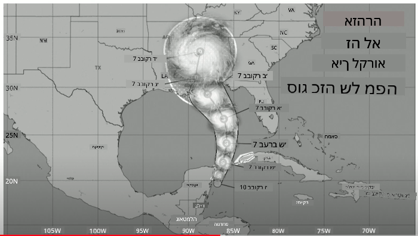
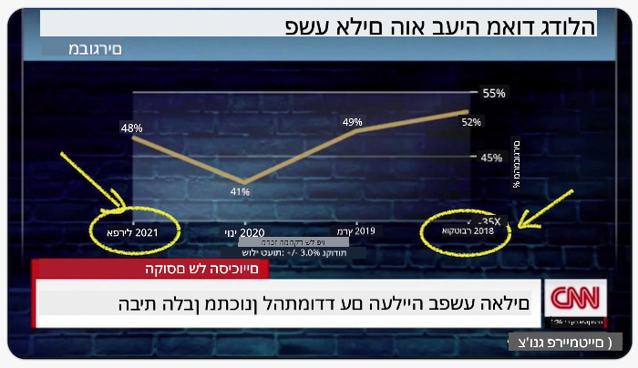
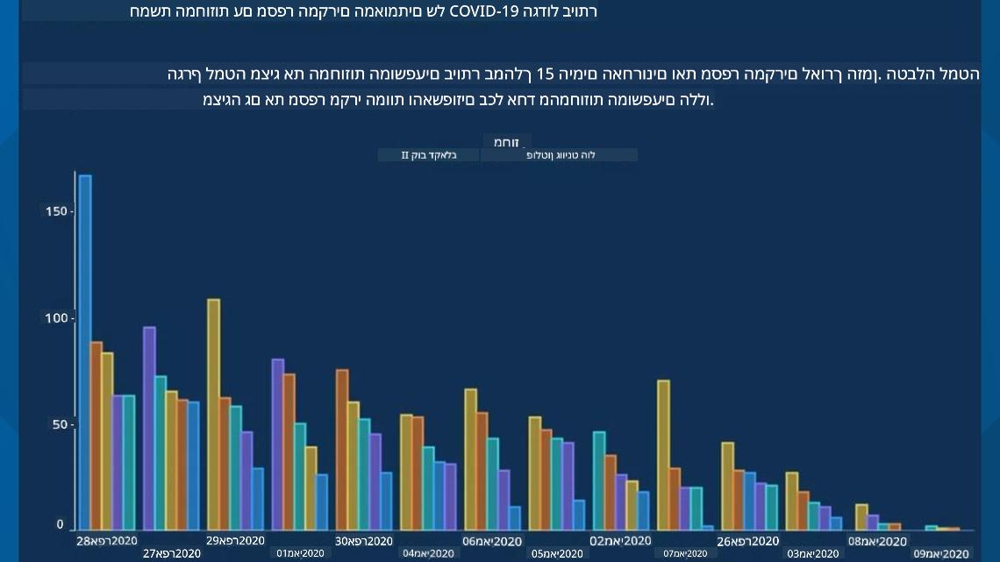
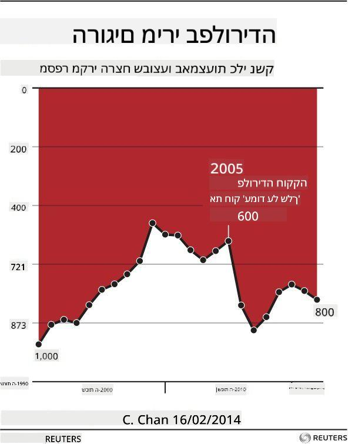
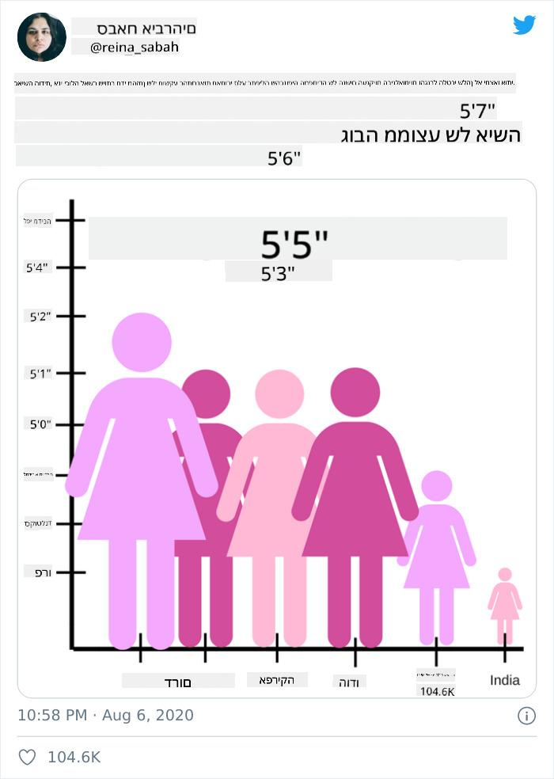
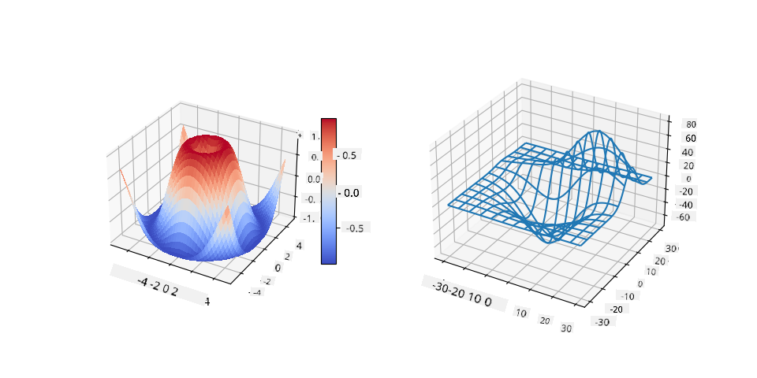
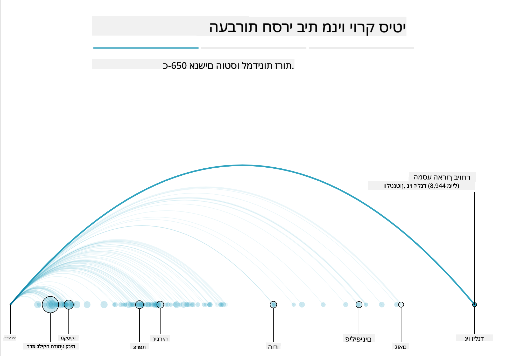
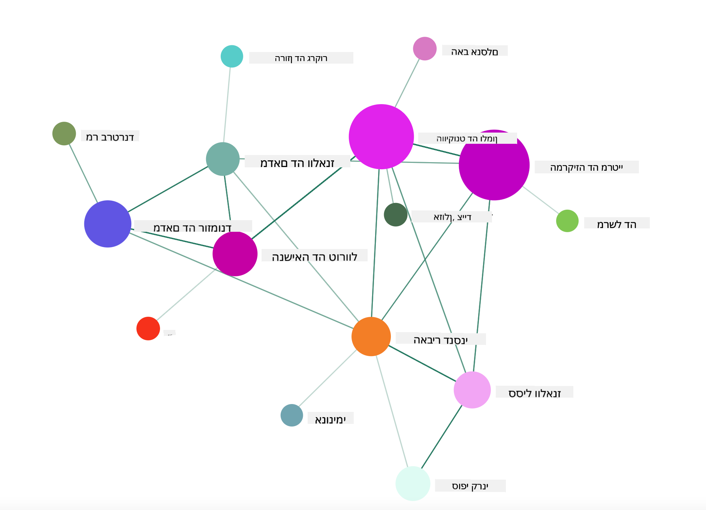

<!--
CO_OP_TRANSLATOR_METADATA:
{
  "original_hash": "4ec4747a9f4f7d194248ea29903ae165",
  "translation_date": "2025-08-28T15:40:47+00:00",
  "source_file": "3-Data-Visualization/13-meaningful-visualizations/README.md",
  "language_code": "he"
}
-->
# יצירת ויזואליזציות משמעותיות

|](../../sketchnotes/13-MeaningfulViz.png)|
|:---:|
| ויזואליזציות משמעותיות - _סקיצה מאת [@nitya](https://twitter.com/nitya)_ |

> "אם תענה את הנתונים מספיק זמן, הם יתוודו על כל דבר" -- [רונלד קואז](https://en.wikiquote.org/wiki/Ronald_Coase)

אחת המיומנויות הבסיסיות של מדען נתונים היא היכולת ליצור ויזואליזציה משמעותית של נתונים שעוזרת לענות על שאלות שעולות. לפני שתתחיל ליצור ויזואליזציה, עליך לוודא שהנתונים נוקו והוכנו, כפי שעשית בשיעורים הקודמים. לאחר מכן, תוכל להתחיל להחליט כיצד להציג את הנתונים בצורה הטובה ביותר.

בשיעור זה תסקור:

1. כיצד לבחור את סוג הגרף הנכון  
2. כיצד להימנע מגרפים מטעים  
3. כיצד לעבוד עם צבע  
4. כיצד לעצב את הגרפים שלך לקריאות  
5. כיצד לבנות פתרונות גרפיים מונפשים או תלת-ממדיים  
6. כיצד ליצור ויזואליזציה יצירתית  

## [שאלון לפני השיעור](https://purple-hill-04aebfb03.1.azurestaticapps.net/quiz/24)

## בחירת סוג הגרף הנכון

בשיעורים קודמים התנסית ביצירת כל מיני ויזואליזציות מעניינות באמצעות Matplotlib ו-Seaborn. באופן כללי, תוכל לבחור את [סוג הגרף הנכון](https://chartio.com/learn/charts/how-to-select-a-data-vizualization/) לשאלה שאתה שואל באמצעות הטבלה הבאה:

| מה אתה צריך להציג:         | סוג הגרף המומלץ:               |
| -------------------------- | ----------------------------- |
| להראות מגמות לאורך זמן     | קו                            |
| להשוות קטגוריות            | עמודות, עוגה                  |
| להשוות סך הכל              | עוגה, עמודות מוערמות          |
| להראות קשרים               | פיזור, קו, פיצול, קו כפול      |
| להראות התפלגויות           | פיזור, היסטוגרמה, תיבה        |
| להראות פרופורציות          | עוגה, דונאט, וופל             |

> ✅ בהתאם למבנה הנתונים שלך, ייתכן שתצטרך להמיר אותם מטקסט למספרים כדי לתמוך בסוג הגרף הרצוי.

## הימנעות מהטעיה

גם אם מדען הנתונים בוחר את הגרף הנכון לנתונים הנכונים, ישנן דרכים רבות שבהן ניתן להציג נתונים באופן שמוכיח נקודה מסוימת, לעיתים על חשבון האמת שבנתונים עצמם. ישנם דוגמאות רבות לגרפים ואינפוגרפיקות מטעים!

[](https://www.youtube.com/watch?v=oX74Nge8Wkw "איך גרפים משקרים")

> 🎥 לחץ על התמונה למעלה לצפייה בהרצאה על גרפים מטעים

הגרף הזה הופך את ציר ה-X כדי להציג את ההפך מהאמת, בהתבסס על תאריכים:



[הגרף הזה](https://media.firstcoastnews.com/assets/WTLV/images/170ae16f-4643-438f-b689-50d66ca6a8d8/170ae16f-4643-438f-b689-50d66ca6a8d8_1140x641.jpg) מטעה עוד יותר, שכן העין נמשכת ימינה ומסיקה שמספר מקרי הקורונה ירד לאורך זמן במחוזות השונים. למעשה, אם תסתכל מקרוב על התאריכים, תמצא שהם סודרו מחדש כדי ליצור מגמת ירידה מטעה.



הדוגמה הידועה לשמצה הזו משתמשת בצבע ובציר Y הפוך כדי להטעות: במקום להסיק שמקרי המוות מנשק עלו לאחר חקיקת חוקים ידידותיים לנשק, העין מתעתעת לחשוב שההפך הוא הנכון:



הגרף המוזר הזה מראה כיצד ניתן לעוות פרופורציות, לעיתים בצורה משעשעת:



השוואת דברים שאינם ברי השוואה היא עוד טריק מפוקפק. ישנו [אתר נפלא](https://tylervigen.com/spurious-correlations) שמציג 'מתאמים שקריים' עם 'עובדות' שמקשרות בין דברים כמו שיעור הגירושין במיין לצריכת מרגרינה. קבוצת Reddit גם אוספת [שימושים מכוערים](https://www.reddit.com/r/dataisugly/top/?t=all) בנתונים.

חשוב להבין עד כמה קל להטעות את העין באמצעות גרפים מטעים. גם אם כוונת מדען הנתונים טובה, בחירה בסוג גרף לא מתאים, כמו גרף עוגה עם יותר מדי קטגוריות, יכולה להטעות.

## צבע

כפי שראית בגרף 'אלימות נשק בפלורידה', צבע יכול להוסיף שכבה נוספת של משמעות לגרפים, במיוחד כאלה שלא עוצבו באמצעות ספריות כמו Matplotlib ו-Seaborn שמגיעות עם פלטות צבעים מאומתות. אם אתה יוצר גרף ידני, כדאי ללמוד מעט על [תורת הצבעים](https://colormatters.com/color-and-design/basic-color-theory).

> ✅ זכור שבעיצוב גרפים, נגישות היא היבט חשוב. חלק מהמשתמשים שלך עשויים להיות עיוורי צבעים - האם הגרף שלך מוצג היטב עבור משתמשים עם לקויות ראייה?

היה זהיר בבחירת צבעים לגרף שלך, שכן צבע יכול להעביר משמעות שלא התכוונת אליה. לדוגמה, ה'נשים הוורודות' בגרף 'גובה' למעלה מעבירות משמעות 'נשית' שמוסיפה למוזרות של הגרף עצמו.

בעוד ש[משמעות הצבעים](https://colormatters.com/color-symbolism/the-meanings-of-colors) עשויה להשתנות בין תרבויות שונות, ובדרך כלל משתנה בהתאם לגוון, המשמעויות הכלליות כוללות:

| צבע    | משמעות               |
| ------ | -------------------- |
| אדום   | כוח                  |
| כחול   | אמון, נאמנות         |
| צהוב   | שמחה, זהירות         |
| ירוק   | אקולוגיה, מזל, קנאה |
| סגול   | שמחה                 |
| כתום   | חיוניות              |

אם אתה מתבקש לבנות גרף עם צבעים מותאמים אישית, ודא שהגרפים שלך גם נגישים וגם שהצבעים שבחרת תואמים את המשמעות שאתה מנסה להעביר.

## עיצוב גרפים לקריאות

גרפים אינם משמעותיים אם הם אינם קריאים! הקדש רגע לשקול את עיצוב הרוחב והגובה של הגרף כך שיתאים לנתונים שלך. אם יש צורך להציג משתנה אחד (כמו כל 50 המדינות), הצג אותם אנכית על ציר ה-Y אם אפשר, כדי להימנע מגרף שדורש גלילה אופקית.

תייג את הצירים שלך, ספק מקרא במידת הצורך, והצע טיפים להבנה טובה יותר של הנתונים.

אם הנתונים שלך טקסטואליים וארוכים בציר ה-X, תוכל להטות את הטקסט לקריאות טובה יותר. [Matplotlib](https://matplotlib.org/stable/tutorials/toolkits/mplot3d.html) מציעה גרפים תלת-ממדיים אם הנתונים שלך תומכים בכך. ניתן ליצור ויזואליזציות מתקדמות באמצעות `mpl_toolkits.mplot3d`.



## אנימציה ותצוגת גרפים תלת-ממדיים

חלק מהויזואליזציות הטובות ביותר כיום הן מונפשות. שירלי וו יצרה ויזואליזציות מדהימות עם D3, כמו '[פרחי סרטים](http://bl.ocks.org/sxywu/raw/d612c6c653fb8b4d7ff3d422be164a5d/)', שבה כל פרח הוא ויזואליזציה של סרט. דוגמה נוספת עבור ה-Guardian היא 'בוסים החוצה', חוויה אינטראקטיבית שמשלבת ויזואליזציות עם Greensock ו-D3 יחד עם מאמר סיפור גלילה שמראה כיצד ניו יורק מתמודדת עם בעיית חסרי הבית שלה על ידי שליחתם מחוץ לעיר.



> "בוסים החוצה: כיצד אמריקה מזיזה את חסרי הבית שלה" מתוך [הגרדיאן](https://www.theguardian.com/us-news/ng-interactive/2017/dec/20/bussed-out-america-moves-homeless-people-country-study). ויזואליזציות מאת נדיה ברמר ושירלי וו

בעוד שהשיעור הזה אינו מספיק מעמיק כדי ללמד את הספריות החזקות הללו, נסה את כוחך ב-D3 באפליקציית Vue.js באמצעות ספרייה להצגת ויזואליזציה של הספר "יחסים מסוכנים" כרשת חברתית מונפשת.

> "יחסים מסוכנים" הוא רומן אפיסטולרי, או רומן שמוצג כסדרת מכתבים. נכתב ב-1782 על ידי שודרלו דה לאקלו, הוא מספר את סיפורם של שני גיבורים אריסטוקרטיים צרפתיים מהמאה ה-18, הוויקונט דה ואלמון והמרקיזה דה מרטיי. שניהם מוצאים את סופם בסוף, אך לא לפני שהם גורמים לנזק חברתי רב. הרומן מתפתח כסדרת מכתבים שנכתבים לאנשים שונים במעגלים שלהם, מתוך כוונה לנקמה או פשוט כדי לגרום לצרות. צור ויזואליזציה של המכתבים הללו כדי לגלות את הדמויות המרכזיות בסיפור, באופן חזותי.

תשלים אפליקציית רשת שתציג תצוגה מונפשת של הרשת החברתית הזו. היא משתמשת בספרייה שנבנתה ליצירת [ויזואליזציה של רשת](https://github.com/emiliorizzo/vue-d3-network) באמצעות Vue.js ו-D3. כשהאפליקציה פועלת, תוכל לגרור את הצמתים על המסך כדי לשנות את מיקומם.



## פרויקט: בניית גרף להצגת רשת באמצעות D3.js

> תיקיית השיעור כוללת תיקיית `solution` שבה תוכל למצוא את הפרויקט המושלם, לעיונך.

1. עקוב אחר ההוראות בקובץ README.md בתיקיית ה-starter. ודא שיש לך NPM ו-Node.js מותקנים במחשב שלך לפני התקנת התלויות של הפרויקט.

2. פתח את התיקייה `starter/src`. תמצא שם תיקיית `assets` שבה קובץ .json עם כל המכתבים מהרומן, ממוספרים, עם תיוג 'to' ו-'from'.

3. השלם את הקוד ב-`components/Nodes.vue` כדי לאפשר את הויזואליזציה. חפש את הפונקציה `createLinks()` והוסף את הלולאה המקוננת הבאה.

לולא דרך אובייקט ה-json כדי ללכוד את נתוני ה-'to' וה-'from' של המכתבים ולבנות את אובייקט ה-`links` כך שהספרייה תוכל לצרוך אותו:

```javascript
//loop through letters
      let f = 0;
      let t = 0;
      for (var i = 0; i < letters.length; i++) {
          for (var j = 0; j < characters.length; j++) {
              
            if (characters[j] == letters[i].from) {
              f = j;
            }
            if (characters[j] == letters[i].to) {
              t = j;
            }
        }
        this.links.push({ sid: f, tid: t });
      }
  ```

הרץ את האפליקציה שלך מהטרמינל (npm run serve) ותהנה מהויזואליזציה!

## 🚀 אתגר

צא לסיור באינטרנט כדי לגלות ויזואליזציות מטעות. כיצד המחבר מטעה את המשתמש, והאם זה נעשה בכוונה? נסה לתקן את הויזואליזציות כדי להראות כיצד הן אמורות להיראות.

## [שאלון לאחר השיעור](https://purple-hill-04aebfb03.1.azurestaticapps.net/quiz/25)

## סקירה ולימוד עצמי

הנה כמה מאמרים לקריאה על ויזואליזציות נתונים מטעות:

https://gizmodo.com/how-to-lie-with-data-visualization-1563576606

http://ixd.prattsi.org/2017/12/visual-lies-usability-in-deceptive-data-visualizations/

עיין בויזואליזציות מעניינות לנכסים וחפצים היסטוריים:

https://handbook.pubpub.org/

עיין במאמר הזה על איך אנימציה יכולה לשפר את הויזואליזציות שלך:

https://medium.com/@EvanSinar/use-animation-to-supercharge-data-visualization-cd905a882ad4

## משימה

[צור ויזואליזציה מותאמת אישית משלך](assignment.md)

---

**כתב ויתור**:  
מסמך זה תורגם באמצעות שירות תרגום מבוסס בינה מלאכותית [Co-op Translator](https://github.com/Azure/co-op-translator). למרות שאנו שואפים לדיוק, יש לקחת בחשבון שתרגומים אוטומטיים עשויים להכיל שגיאות או אי דיוקים. המסמך המקורי בשפתו המקורית צריך להיחשב כמקור סמכותי. עבור מידע קריטי, מומלץ להשתמש בתרגום מקצועי על ידי אדם. איננו נושאים באחריות לאי הבנות או לפרשנויות שגויות הנובעות משימוש בתרגום זה.