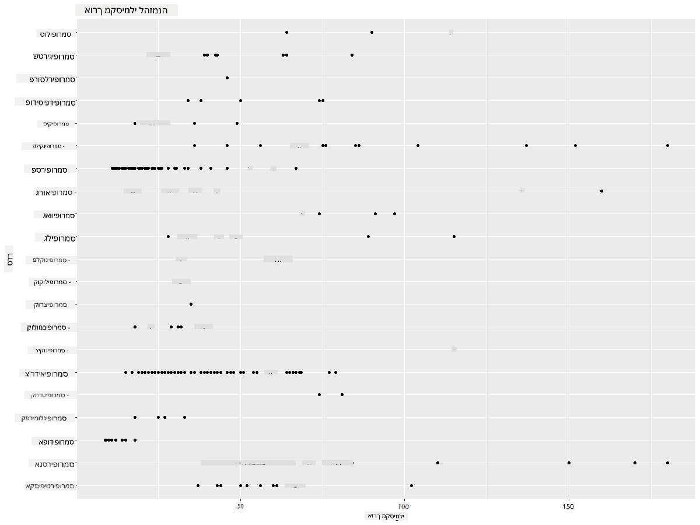
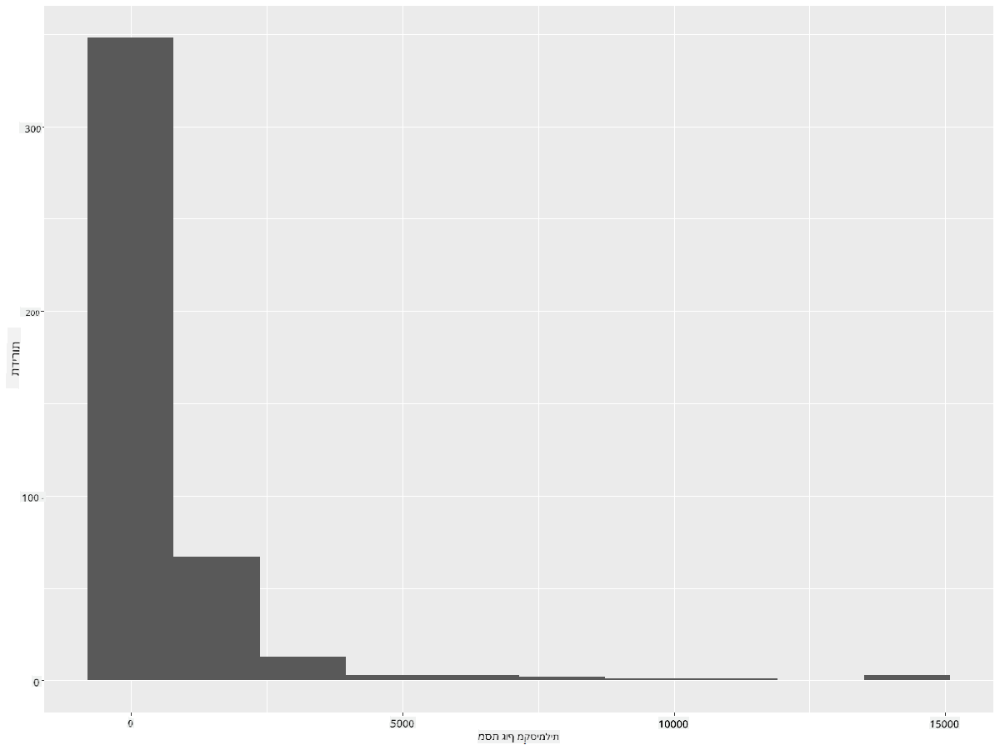
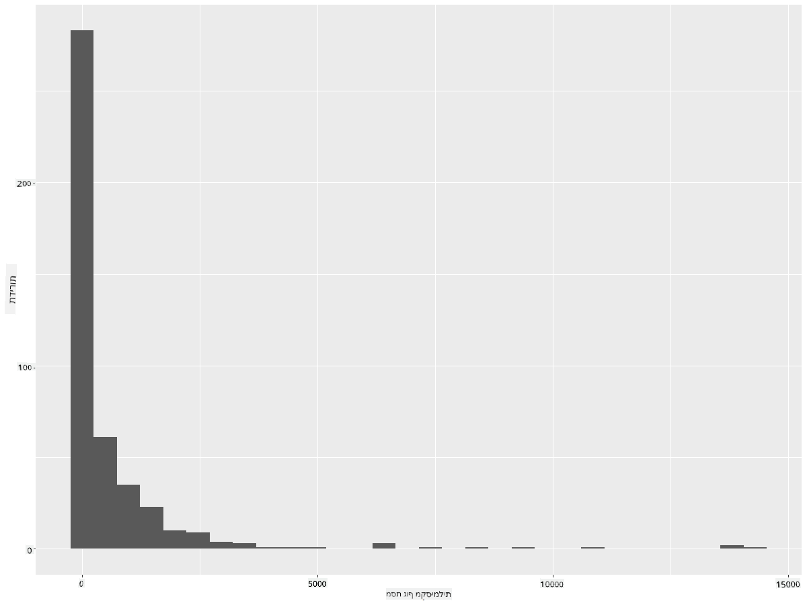
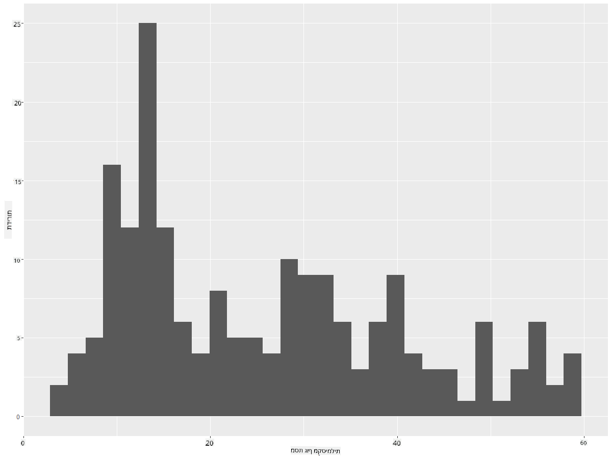
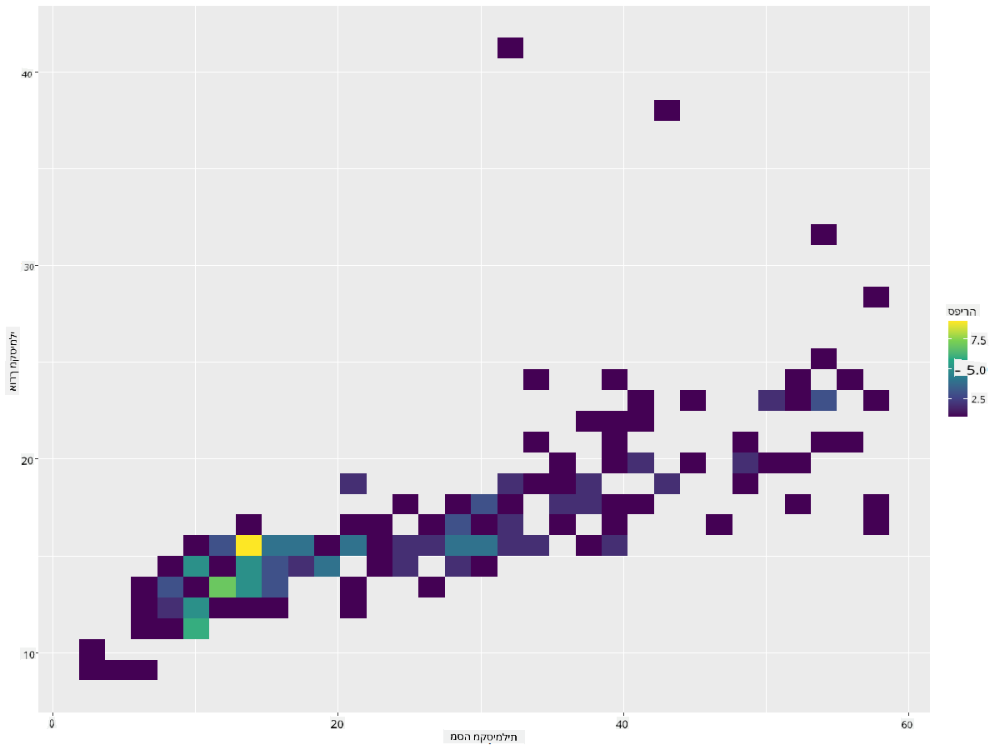
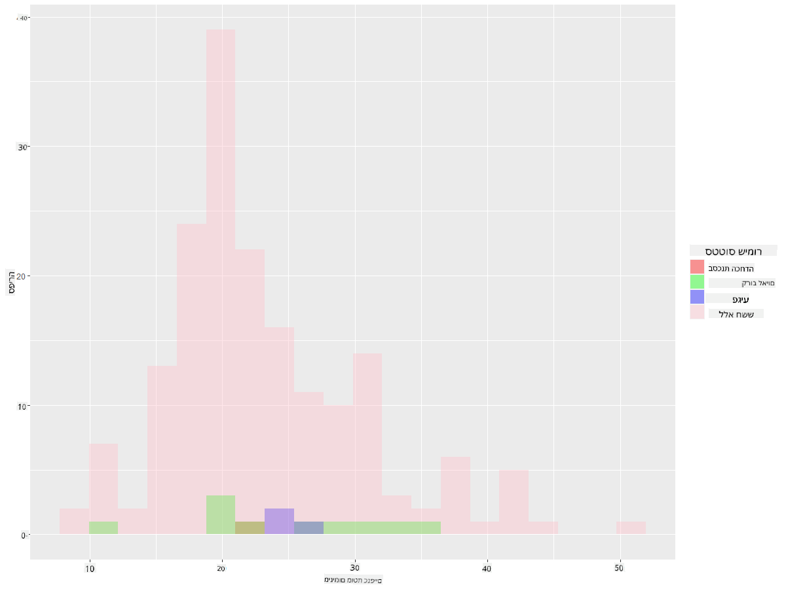
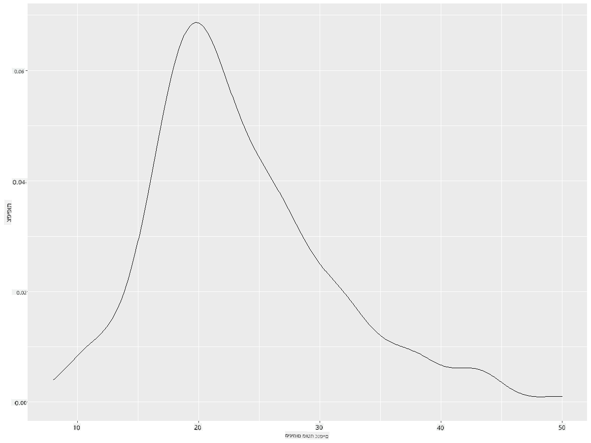
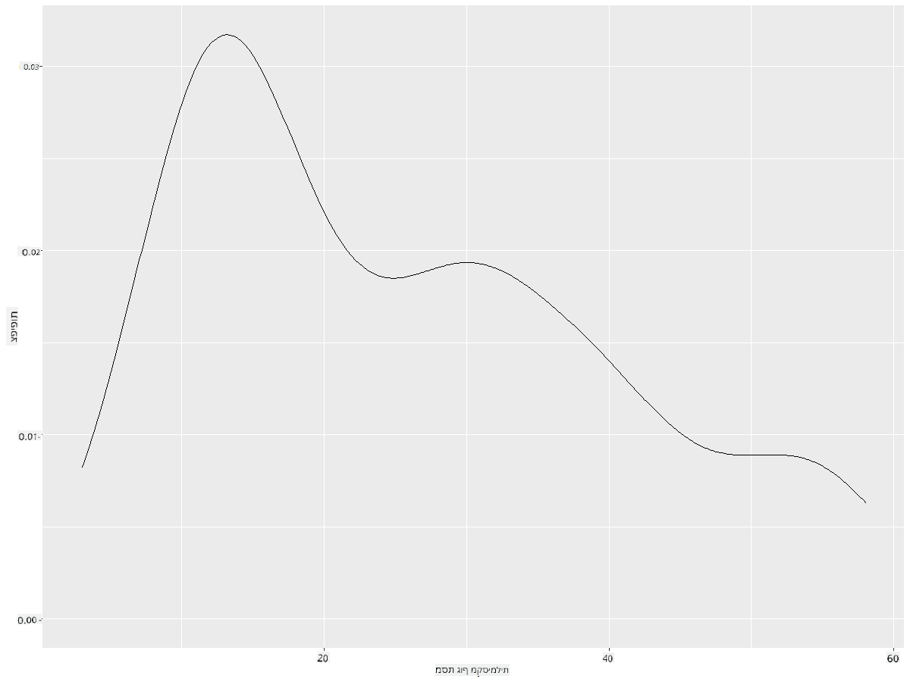
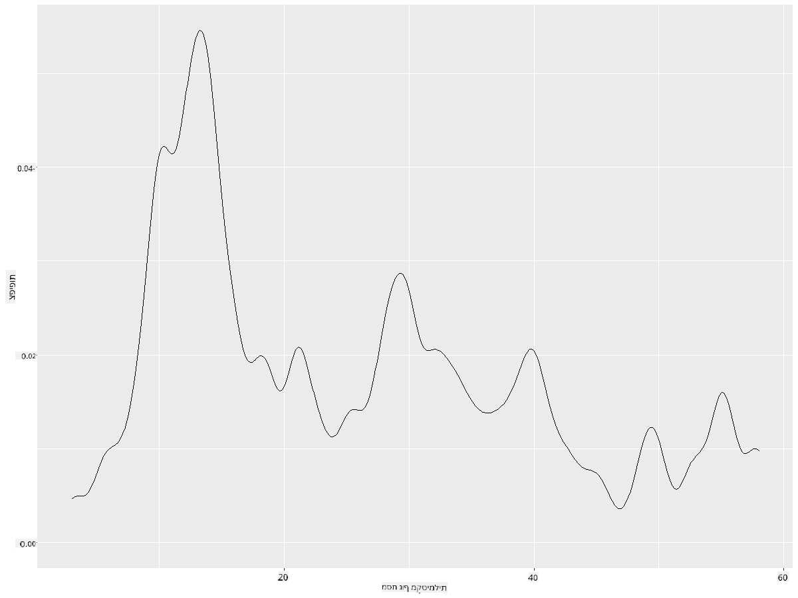
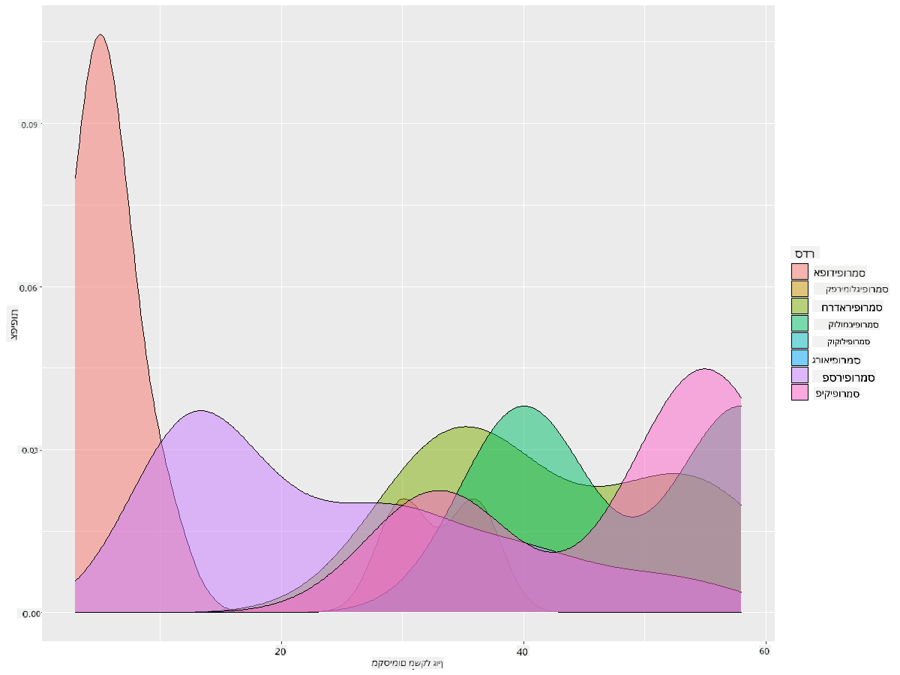

<!--
CO_OP_TRANSLATOR_METADATA:
{
  "original_hash": "ea67c0c40808fd723594de6896c37ccf",
  "translation_date": "2025-08-28T15:34:55+00:00",
  "source_file": "3-Data-Visualization/R/10-visualization-distributions/README.md",
  "language_code": "he"
}
-->
# ויזואליזציה של התפלגויות

| ](https://github.com/microsoft/Data-Science-For-Beginners/blob/main/sketchnotes/10-Visualizing-Distributions.png)|
|:---:|
| ויזואליזציה של התפלגויות - _סקיצה מאת [@nitya](https://twitter.com/nitya)_ |

בשיעור הקודם, למדתם כמה עובדות מעניינות על מערך נתונים של ציפורים ממינסוטה. מצאתם נתונים שגויים על ידי ויזואליזציה של ערכים חריגים ובחנתם את ההבדלים בין קטגוריות הציפורים לפי אורך מקסימלי.

## [שאלון לפני השיעור](https://purple-hill-04aebfb03.1.azurestaticapps.net/quiz/18)
## חקר מערך הנתונים של הציפורים

דרך נוספת לחקור נתונים היא על ידי בחינת ההתפלגות שלהם, כלומר איך הנתונים מאורגנים לאורך ציר. אולי, לדוגמה, תרצו ללמוד על ההתפלגות הכללית, עבור מערך הנתונים הזה, של מוטת כנפיים מקסימלית או מסת גוף מקסימלית של ציפורי מינסוטה.

בואו נגלה כמה עובדות על ההתפלגויות של הנתונים במערך הנתונים הזה. בקונסולת R שלכם, ייבאו את `ggplot2` ואת מסד הנתונים. הסירו את הערכים החריגים ממסד הנתונים בדיוק כמו שעשיתם בנושא הקודם.

```r
library(ggplot2)

birds <- read.csv("../../data/birds.csv",fileEncoding="UTF-8-BOM")

birds_filtered <- subset(birds, MaxWingspan < 500)
head(birds_filtered)
```
|      | שם                          | שם מדעי                | קטגוריה               | סדר          | משפחה   | סוג         | מצב שימור            | אורך מינימלי | אורך מקסימלי | מסת גוף מינימלית | מסת גוף מקסימלית | מוטת כנפיים מינימלית | מוטת כנפיים מקסימלית |
| ---: | :-------------------------- | :--------------------- | :-------------------- | :----------- | :------- | :---------- | :----------------- | --------: | --------: | ----------: | ----------: | ----------: | ----------: |
|    0 | ברווז שרוק שחור-בטן         | Dendrocygna autumnalis | ברווזים/אווזים/עופות מים | Anseriformes | Anatidae | Dendrocygna | LC                 |        47 |        56 |         652 |        1020 |          76 |          94 |
|    1 | ברווז שרוק חלוד             | Dendrocygna bicolor    | ברווזים/אווזים/עופות מים | Anseriformes | Anatidae | Dendrocygna | LC                 |        45 |        53 |         712 |        1050 |          85 |          93 |
|    2 | אווז שלג                    | Anser caerulescens     | ברווזים/אווזים/עופות מים | Anseriformes | Anatidae | Anser       | LC                 |        64 |        79 |        2050 |        4050 |         135 |         165 |
|    3 | אווז רוס                   | Anser rossii           | ברווזים/אווזים/עופות מים | Anseriformes | Anatidae | Anser       | LC                 |      57.3 |        64 |        1066 |        1567 |         113 |         116 |
|    4 | אווז לבן-חזית גדול          | Anser albifrons        | ברווזים/אווזים/עופות מים | Anseriformes | Anatidae | Anser       | LC                 |        64 |        81 |        1930 |        3310 |         130 |         165 |

באופן כללי, ניתן להסתכל במהירות על אופן ההתפלגות של הנתונים באמצעות תרשים פיזור כפי שעשינו בשיעור הקודם:

```r
ggplot(data=birds_filtered, aes(x=Order, y=MaxLength,group=1)) +
  geom_point() +
  ggtitle("Max Length per order") + coord_flip()
```


זה נותן סקירה כללית של ההתפלגות הכללית של אורך גוף לפי סדר הציפורים, אך זו אינה הדרך האופטימלית להציג התפלגויות אמיתיות. משימה זו בדרך כלל מתבצעת על ידי יצירת היסטוגרמה.
## עבודה עם היסטוגרמות

`ggplot2` מציע דרכים מצוינות לויזואליזציה של התפלגות נתונים באמצעות היסטוגרמות. סוג תרשים זה דומה לתרשים עמודות שבו ההתפלגות נראית דרך עלייה וירידה של העמודות. כדי לבנות היסטוגרמה, אתם צריכים נתונים מספריים. כדי לבנות היסטוגרמה, ניתן ליצור תרשים ולהגדיר את הסוג כ-'hist' עבור היסטוגרמה. תרשים זה מציג את ההתפלגות של MaxBodyMass עבור טווח הנתונים המספריים של מערך הנתונים כולו. על ידי חלוקת מערך הנתונים למקטעים קטנים יותר, ניתן להציג את ההתפלגות של ערכי הנתונים:

```r
ggplot(data = birds_filtered, aes(x = MaxBodyMass)) + 
  geom_histogram(bins=10)+ylab('Frequency')
```


כפי שניתן לראות, רוב 400+ הציפורים במערך הנתונים הזה נמצאות בטווח של מתחת ל-2000 עבור מסת הגוף המקסימלית שלהן. ניתן לקבל תובנות נוספות על הנתונים על ידי שינוי הפרמטר `bins` למספר גבוה יותר, כמו 30:

```r
ggplot(data = birds_filtered, aes(x = MaxBodyMass)) + geom_histogram(bins=30)+ylab('Frequency')
```



תרשים זה מציג את ההתפלגות בצורה מעט יותר מפורטת. ניתן ליצור תרשים פחות מוטה שמאלה על ידי הבטחת בחירת נתונים רק בטווח נתון:

סננו את הנתונים כך שתקבלו רק את הציפורים שמסת הגוף שלהן מתחת ל-60, והציגו 30 `bins`:

```r
birds_filtered_1 <- subset(birds_filtered, MaxBodyMass > 1 & MaxBodyMass < 60)
ggplot(data = birds_filtered_1, aes(x = MaxBodyMass)) + 
  geom_histogram(bins=30)+ylab('Frequency')
```



✅ נסו מסננים ונקודות נתונים אחרות. כדי לראות את ההתפלגות המלאה של הנתונים, הסירו את המסנן `['MaxBodyMass']` כדי להציג התפלגויות עם תוויות.

ההיסטוגרמה מציעה גם שיפורים בצבע ובתוויות שכדאי לנסות:

צרו היסטוגרמה דו-ממדית כדי להשוות את הקשר בין שתי התפלגויות. בואו נשווה בין `MaxBodyMass` ל-`MaxLength`. `ggplot2` מציע דרך מובנית להציג התכנסות באמצעות צבעים בהירים יותר:

```r
ggplot(data=birds_filtered_1, aes(x=MaxBodyMass, y=MaxLength) ) +
  geom_bin2d() +scale_fill_continuous(type = "viridis")
```
נראה שיש מתאם צפוי בין שני האלמנטים הללו לאורך ציר צפוי, עם נקודת התכנסות חזקה במיוחד אחת:



היסטוגרמות עובדות היטב כברירת מחדל עבור נתונים מספריים. מה אם אתם צריכים לראות התפלגויות לפי נתונים טקסטואליים? 
## חקר מערך הנתונים להתפלגויות באמצעות נתונים טקסטואליים 

מערך הנתונים הזה כולל גם מידע טוב על קטגוריית הציפורים, סוגן, מינן ומשפחתן, כמו גם על מצב השימור שלהן. בואו נחקור את המידע על מצב השימור. מהי ההתפלגות של הציפורים לפי מצב השימור שלהן?

> ✅ במערך הנתונים, נעשה שימוש בכמה ראשי תיבות לתיאור מצב השימור. ראשי תיבות אלו מגיעים מ-[קטגוריות הרשימה האדומה של IUCN](https://www.iucnredlist.org/), ארגון שמקטלג את מצבם של מינים.
> 
> - CR: בסכנת הכחדה חמורה
> - EN: בסכנת הכחדה
> - EX: נכחד
> - LC: ללא חשש
> - NT: קרוב לסיכון
> - VU: פגיע

אלו ערכים מבוססי טקסט ולכן תצטרכו לבצע טרנספורמציה כדי ליצור היסטוגרמה. באמצעות מסגרת הנתונים filteredBirds, הציגו את מצב השימור שלה לצד מוטת הכנפיים המינימלית שלה. מה אתם רואים?

```r
birds_filtered_1$ConservationStatus[birds_filtered_1$ConservationStatus == 'EX'] <- 'x1' 
birds_filtered_1$ConservationStatus[birds_filtered_1$ConservationStatus == 'CR'] <- 'x2'
birds_filtered_1$ConservationStatus[birds_filtered_1$ConservationStatus == 'EN'] <- 'x3'
birds_filtered_1$ConservationStatus[birds_filtered_1$ConservationStatus == 'NT'] <- 'x4'
birds_filtered_1$ConservationStatus[birds_filtered_1$ConservationStatus == 'VU'] <- 'x5'
birds_filtered_1$ConservationStatus[birds_filtered_1$ConservationStatus == 'LC'] <- 'x6'

ggplot(data=birds_filtered_1, aes(x = MinWingspan, fill = ConservationStatus)) +
  geom_histogram(position = "identity", alpha = 0.4, bins = 20) +
  scale_fill_manual(name="Conservation Status",values=c("red","green","blue","pink"),labels=c("Endangered","Near Threathened","Vulnerable","Least Concern"))
```



נראה שאין מתאם טוב בין מוטת כנפיים מינימלית למצב השימור. בדקו אלמנטים אחרים במערך הנתונים באמצעות שיטה זו. תוכלו לנסות מסננים שונים גם כן. האם אתם מוצאים מתאם כלשהו?

## תרשימי צפיפות

ייתכן ששמתם לב שההיסטוגרמות שראינו עד כה הן 'מדורגות' ואינן זורמות בצורה חלקה בקשת. כדי להציג תרשים צפיפות חלק יותר, תוכלו לנסות תרשים צפיפות.

בואו נעבוד עכשיו עם תרשימי צפיפות!

```r
ggplot(data = birds_filtered_1, aes(x = MinWingspan)) + 
  geom_density()
```


ניתן לראות כיצד התרשים משקף את התרשים הקודם עבור נתוני מוטת כנפיים מינימלית; הוא פשוט מעט חלק יותר. אם תרצו לחזור לקו המדרגות של MaxBodyMass בתרשים השני שבניתם, תוכלו להחליק אותו היטב על ידי יצירתו מחדש באמצעות שיטה זו:

```r
ggplot(data = birds_filtered_1, aes(x = MaxBodyMass)) + 
  geom_density()
```


אם תרצו קו חלק, אך לא חלק מדי, ערכו את הפרמטר `adjust`: 

```r
ggplot(data = birds_filtered_1, aes(x = MaxBodyMass)) + 
  geom_density(adjust = 1/5)
```


✅ קראו על הפרמטרים הזמינים עבור סוג תרשים זה ונסו להתנסות!

סוג תרשים זה מציע ויזואליזציות מסבירות בצורה יפה. עם כמה שורות קוד, לדוגמה, תוכלו להציג את צפיפות מסת הגוף המקסימלית לפי סדר הציפורים:

```r
ggplot(data=birds_filtered_1,aes(x = MaxBodyMass, fill = Order)) +
  geom_density(alpha=0.5)
```


## 🚀 אתגר

היסטוגרמות הן סוג תרשים מתוחכם יותר מאשר תרשימי פיזור בסיסיים, תרשימי עמודות או תרשימי קו. חפשו באינטרנט דוגמאות טובות לשימוש בהיסטוגרמות. כיצד הן משמשות, מה הן מדגימות, ובאילו תחומים או תחומי מחקר הן נוטות להיות בשימוש?

## [שאלון לאחר השיעור](https://purple-hill-04aebfb03.1.azurestaticapps.net/quiz/19)

## סקירה ולימוד עצמי

בשיעור זה, השתמשתם ב-`ggplot2` והתחלתם לעבוד על הצגת תרשימים מתוחכמים יותר. בצעו מחקר על `geom_density_2d()` "עקומת צפיפות הסתברות רציפה בממד אחד או יותר". קראו את [התיעוד](https://ggplot2.tidyverse.org/reference/geom_density_2d.html) כדי להבין כיצד זה עובד.

## משימה

[יישמו את הכישורים שלכם](assignment.md)

---

**כתב ויתור**:  
מסמך זה תורגם באמצעות שירות תרגום מבוסס בינה מלאכותית [Co-op Translator](https://github.com/Azure/co-op-translator). בעוד שאנו שואפים לדיוק, יש להיות מודעים לכך שתרגומים אוטומטיים עשויים להכיל שגיאות או אי-דיוקים. המסמך המקורי בשפתו המקורית נחשב למקור הסמכותי. למידע קריטי, מומלץ להשתמש בתרגום מקצועי על ידי מתרגם אנושי. איננו נושאים באחריות לכל אי-הבנה או פרשנות שגויה הנובעת משימוש בתרגום זה.