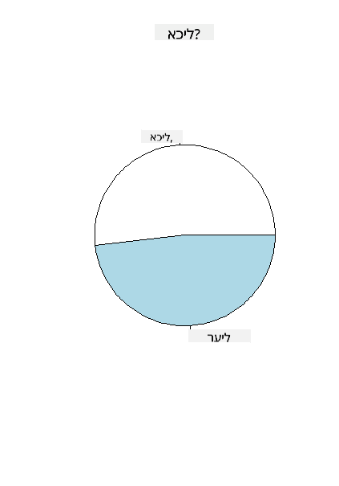
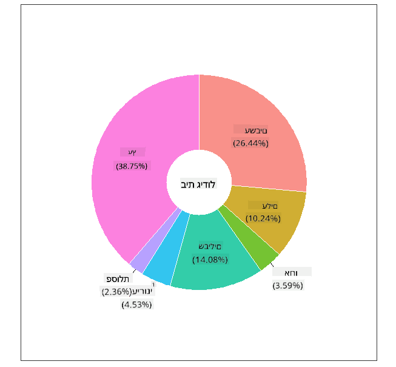
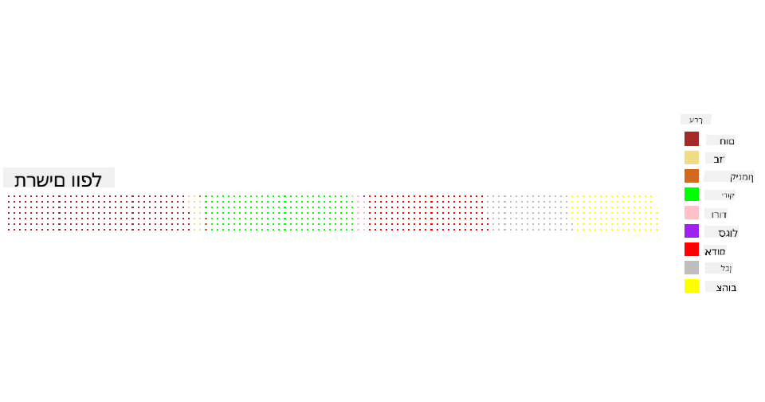

<!--
CO_OP_TRANSLATOR_METADATA:
{
  "original_hash": "47028abaaafa2bcb1079702d20569066",
  "translation_date": "2025-08-28T15:29:47+00:00",
  "source_file": "3-Data-Visualization/R/11-visualization-proportions/README.md",
  "language_code": "he"
}
-->
# חזות יחסית

| ](../../../sketchnotes/11-Visualizing-Proportions.png)|
|:---:|
|חזות יחסית - _סקצ'נוט מאת [@nitya](https://twitter.com/nitya)_ |

בשיעור זה, תשתמשו במאגר נתונים ממוקד טבע כדי להמחיש יחסים, כמו כמה סוגים שונים של פטריות מאכלסים מאגר נתונים מסוים על פטריות. בואו נחקור את הפטריות המרתקות הללו באמצעות מאגר נתונים שמקורו באודובון, המכיל פרטים על 23 מינים של פטריות עם זימים ממשפחות Agaricus ו-Lepiota. תתנסו בהמחשות טעימות כמו:

- גרפים עוגה 🥧  
- גרפים דונאט 🍩  
- גרפים וופל 🧇  

> 💡 פרויקט מאוד מעניין בשם [Charticulator](https://charticulator.com) מבית Microsoft Research מציע ממשק גרירה ושחרור חינמי להמחשות נתונים. באחד מהשיעורים שלהם הם גם משתמשים במאגר הנתונים הזה של פטריות! כך תוכלו לחקור את הנתונים וללמוד את הספרייה בו זמנית: [שיעור Charticulator](https://charticulator.com/tutorials/tutorial4.html).

## [שאלון לפני השיעור](https://purple-hill-04aebfb03.1.azurestaticapps.net/quiz/20)

## הכירו את הפטריות שלכם 🍄

פטריות הן מאוד מעניינות. בואו נייבא מאגר נתונים כדי ללמוד עליהן:

```r
mushrooms = read.csv('../../data/mushrooms.csv')
head(mushrooms)
```  
טבלה מודפסת עם נתונים נהדרים לניתוח:

| class     | cap-shape | cap-surface | cap-color | bruises | odor    | gill-attachment | gill-spacing | gill-size | gill-color | stalk-shape | stalk-root | stalk-surface-above-ring | stalk-surface-below-ring | stalk-color-above-ring | stalk-color-below-ring | veil-type | veil-color | ring-number | ring-type | spore-print-color | population | habitat |
| --------- | --------- | ----------- | --------- | ------- | ------- | --------------- | ------------ | --------- | ---------- | ----------- | ---------- | ------------------------ | ------------------------ | ---------------------- | ---------------------- | --------- | ---------- | ----------- | --------- | ----------------- | ---------- | ------- |
| רעילה     | קמורה     | חלקה        | חומה      | חבורות  | חריפה   | חופשית          | צפופה        | צרה       | שחורה      | מתרחבת      | שווה       | חלקה                    | חלקה                    | לבנה                   | לבנה                   | חלקית     | לבנה       | אחת         | תלויה     | שחורה             | מפוזרת      | עירונית |
| אכילה     | קמורה     | חלקה        | צהובה     | חבורות  | שקדים   | חופשית          | צפופה        | רחבה      | שחורה      | מתרחבת      | מועדון     | חלקה                    | חלקה                    | לבנה                   | לבנה                   | חלקית     | לבנה       | אחת         | תלויה     | חומה              | מרובה       | עשב |
| אכילה     | פעמונית   | חלקה        | לבנה      | חבורות  | אניס    | חופשית          | צפופה        | רחבה      | חומה       | מתרחבת      | מועדון     | חלקה                    | חלקה                    | לבנה                   | לבנה                   | חלקית     | לבנה       | אחת         | תלויה     | חומה              | מרובה       | אחו |
| רעילה     | קמורה     | קשקשית      | לבנה      | חבורות  | חריפה   | חופשית          | צפופה        | צרה       | חומה       | מתרחבת      | שווה       | חלקה                    | חלקה                    | לבנה                   | לבנה                   | חלקית     | לבנה       | אחת         | תלויה     | שחורה             | מפוזרת      | עירונית |
| אכילה     | קמורה     | חלקה        | ירוקה     | ללא חבורות | ללא    | חופשית          | צפופה        | רחבה      | שחורה      | מתחדדת      | שווה       | חלקה                    | חלקה                    | לבנה                   | לבנה                   | חלקית     | לבנה       | אחת         | נעלמת     | חומה              | שופעת       | עשב |
| אכילה     | קמורה     | קשקשית      | צהובה     | חבורות  | שקדים   | חופשית          | צפופה        | רחבה      | חומה       | מתרחבת      | מועדון     | חלקה                    | חלקה                    | לבנה                   | לבנה                   | חלקית     | לבנה       | אחת         | תלויה     | שחורה             | מרובה       | עשב |

מיד שמים לב שכל הנתונים הם טקסטואליים. תצטרכו להמיר את הנתונים כדי שתוכלו להשתמש בהם בגרף. למעשה, רוב הנתונים מיוצגים כאובייקט:

```r
names(mushrooms)
```  

הפלט הוא:

```output
[1] "class"                    "cap.shape"               
 [3] "cap.surface"              "cap.color"               
 [5] "bruises"                  "odor"                    
 [7] "gill.attachment"          "gill.spacing"            
 [9] "gill.size"                "gill.color"              
[11] "stalk.shape"              "stalk.root"              
[13] "stalk.surface.above.ring" "stalk.surface.below.ring"
[15] "stalk.color.above.ring"   "stalk.color.below.ring"  
[17] "veil.type"                "veil.color"              
[19] "ring.number"              "ring.type"               
[21] "spore.print.color"        "population"              
[23] "habitat"            
```  
קחו את הנתונים הללו והמירו את העמודה 'class' לקטגוריה:

```r
library(dplyr)
grouped=mushrooms %>%
  group_by(class) %>%
  summarise(count=n())
```  

עכשיו, אם תדפיסו את נתוני הפטריות, תוכלו לראות שהם חולקו לקטגוריות לפי מחלקת רעילות/אכילה:  
```r
View(grouped)
```  

| class | count |
| --------- | --------- |
| אכילה     | 4208      |
| רעילה     | 3916      |

אם תעקבו אחרי הסדר המוצג בטבלה זו כדי ליצור את תוויות הקטגוריה של המחלקה, תוכלו ליצור גרף עוגה.

## עוגה!

```r
pie(grouped$count,grouped$class, main="Edible?")
```  
והנה, גרף עוגה שמראה את היחסים של נתונים אלו לפי שתי מחלקות הפטריות. חשוב מאוד לקבל את סדר התוויות נכון, במיוחד כאן, אז ודאו את הסדר שבו נבנה מערך התוויות!



## דונאט!

גרף עוגה מעט יותר מעניין מבחינה חזותית הוא גרף דונאט, שהוא גרף עוגה עם חור באמצע. בואו נסתכל על הנתונים שלנו בשיטה זו.

הסתכלו על בתי הגידול השונים שבהם פטריות גדלות:

```r
library(dplyr)
habitat=mushrooms %>%
  group_by(habitat) %>%
  summarise(count=n())
View(habitat)
```  
הפלט הוא:  
| habitat| count |
| --------- | --------- |
| עשב       | 2148      |
| עלים      | 832       |
| אחו       | 292       |
| שבילים    | 1144      |
| עירונית   | 368       |
| פסולת     | 192       |
| עץ        | 3148      |

כאן, אתם מקבצים את הנתונים לפי בית גידול. ישנם 7 בתי גידול רשומים, אז השתמשו בהם כתוויות לגרף הדונאט שלכם:

```r
library(ggplot2)
library(webr)
PieDonut(habitat, aes(habitat, count=count))
```  



הקוד הזה משתמש בשתי ספריות - ggplot2 ו-webr. באמצעות פונקציית PieDonut של ספריית webr, ניתן ליצור גרף דונאט בקלות!

גרפי דונאט ב-R יכולים להיווצר גם באמצעות ספריית ggplot2 בלבד. תוכלו ללמוד עוד על כך [כאן](https://www.r-graph-gallery.com/128-ring-or-donut-plot.html) ולנסות זאת בעצמכם.

עכשיו כשאתם יודעים איך לקבץ את הנתונים שלכם ואז להציג אותם כעוגה או דונאט, תוכלו לחקור סוגים אחרים של גרפים. נסו גרף וופל, שהוא פשוט דרך שונה לחקור כמויות.

## וופלים!

גרף מסוג 'וופל' הוא דרך שונה להמחיש כמויות כמערך דו-ממדי של ריבועים. נסו להמחיש את כמויות הצבעים של כובעי הפטריות במאגר הנתונים הזה. כדי לעשות זאת, תצטרכו להתקין ספריית עזר בשם [waffle](https://cran.r-project.org/web/packages/waffle/waffle.pdf) ולהשתמש בה ליצירת ההמחשה שלכם:

```r
install.packages("waffle", repos = "https://cinc.rud.is")
```  

בחרו מקטע מהנתונים שלכם לקיבוץ:

```r
library(dplyr)
cap_color=mushrooms %>%
  group_by(cap.color) %>%
  summarise(count=n())
View(cap_color)
```  

צרו גרף וופל על ידי יצירת תוויות ואז קיבוץ הנתונים שלכם:

```r
library(waffle)
names(cap_color$count) = paste0(cap_color$cap.color)
waffle((cap_color$count/10), rows = 7, title = "Waffle Chart")+scale_fill_manual(values=c("brown", "#F0DC82", "#D2691E", "green", 
                                                                                     "pink", "purple", "red", "grey", 
                                                                                     "yellow","white"))
```  

באמצעות גרף וופל, ניתן לראות בבירור את היחסים של צבעי כובעי הפטריות במאגר הנתונים הזה. מעניין, יש הרבה פטריות עם כובעים ירוקים!



בשיעור זה, למדתם שלוש דרכים להמחשת יחסים. ראשית, עליכם לקבץ את הנתונים שלכם לקטגוריות ואז להחליט מהי הדרך הטובה ביותר להציג את הנתונים - עוגה, דונאט, או וופל. כולם טעימים ומספקים למשתמש תמונת מצב מיידית של מאגר נתונים.

## 🚀 אתגר

נסו ליצור מחדש את הגרפים הטעימים הללו ב-[Charticulator](https://charticulator.com).  
## [שאלון אחרי השיעור](https://purple-hill-04aebfb03.1.azurestaticapps.net/quiz/21)

## סקירה ולימוד עצמי

לפעמים לא ברור מתי להשתמש בעוגה, דונאט, או גרף וופל. הנה כמה מאמרים לקריאה בנושא:

https://www.beautiful.ai/blog/battle-of-the-charts-pie-chart-vs-donut-chart  

https://medium.com/@hypsypops/pie-chart-vs-donut-chart-showdown-in-the-ring-5d24fd86a9ce  

https://www.mit.edu/~mbarker/formula1/f1help/11-ch-c6.htm  

https://medium.datadriveninvestor.com/data-visualization-done-the-right-way-with-tableau-waffle-chart-fdf2a19be402  

עשו מחקר כדי למצוא מידע נוסף על ההחלטה הדביקה הזו.  
## משימה

[נסו זאת באקסל](assignment.md)  

---

**כתב ויתור**:  
מסמך זה תורגם באמצעות שירות תרגום מבוסס בינה מלאכותית [Co-op Translator](https://github.com/Azure/co-op-translator). בעוד שאנו שואפים לדיוק, יש להיות מודעים לכך שתרגומים אוטומטיים עשויים להכיל שגיאות או אי-דיוקים. המסמך המקורי בשפתו המקורית נחשב למקור הסמכותי. למידע קריטי, מומלץ להשתמש בתרגום מקצועי על ידי בני אדם. איננו נושאים באחריות לכל אי-הבנה או פרשנות שגויה הנובעת משימוש בתרגום זה.