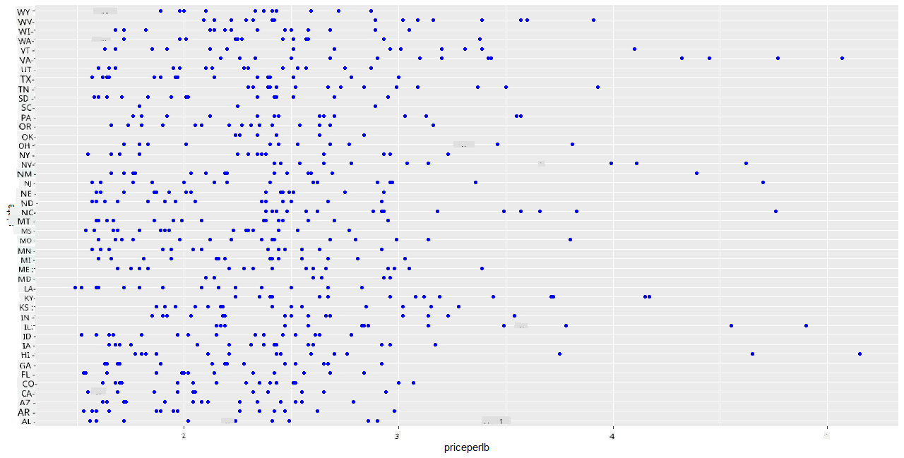
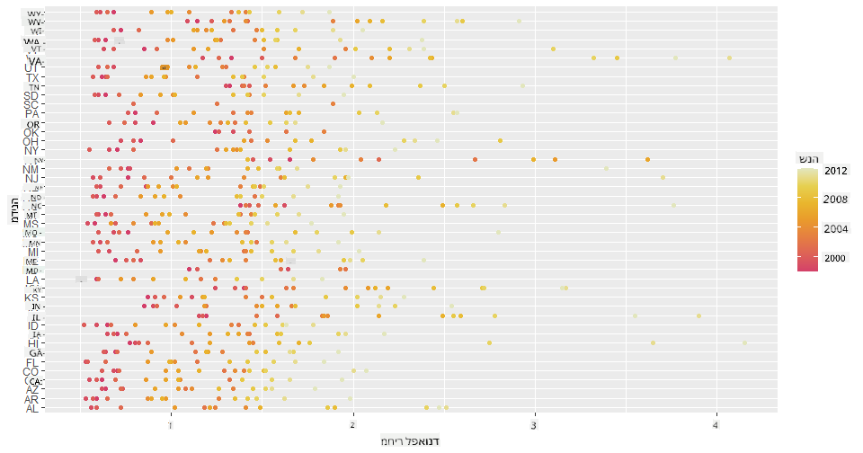
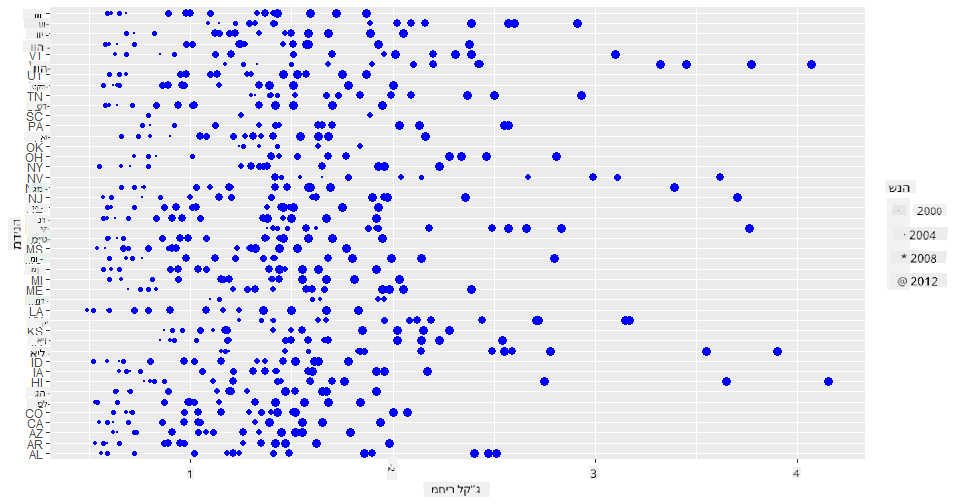
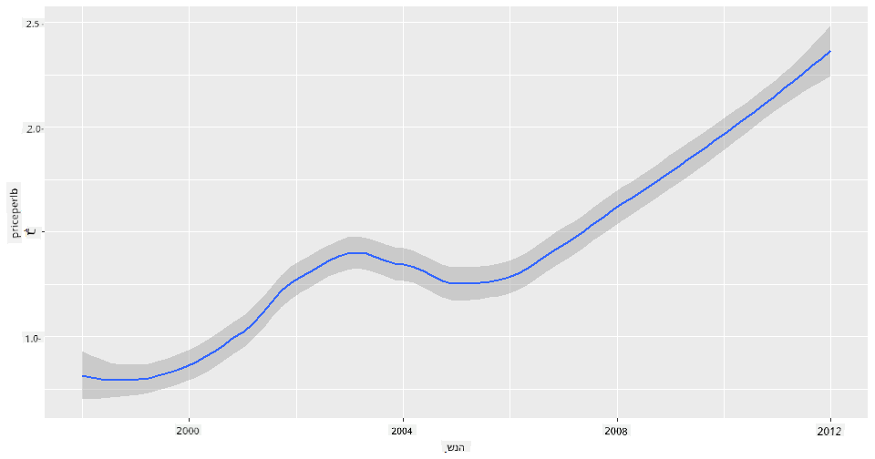
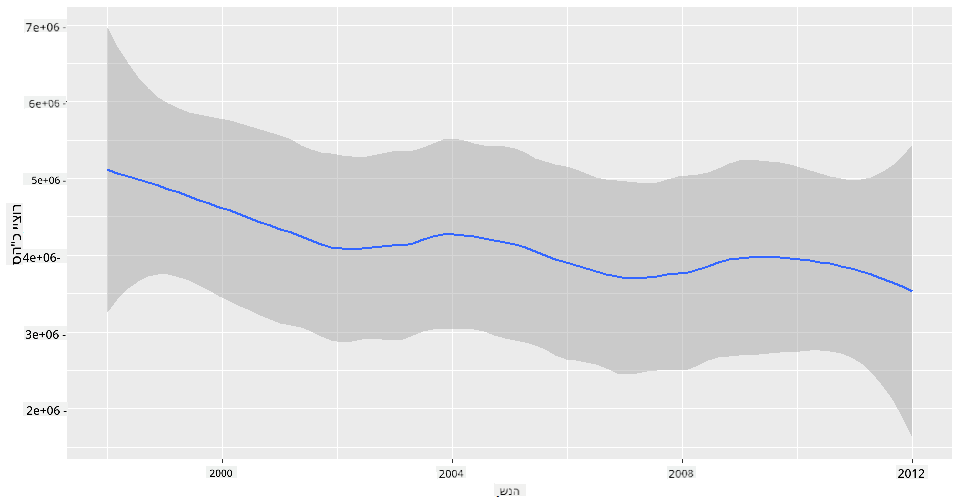
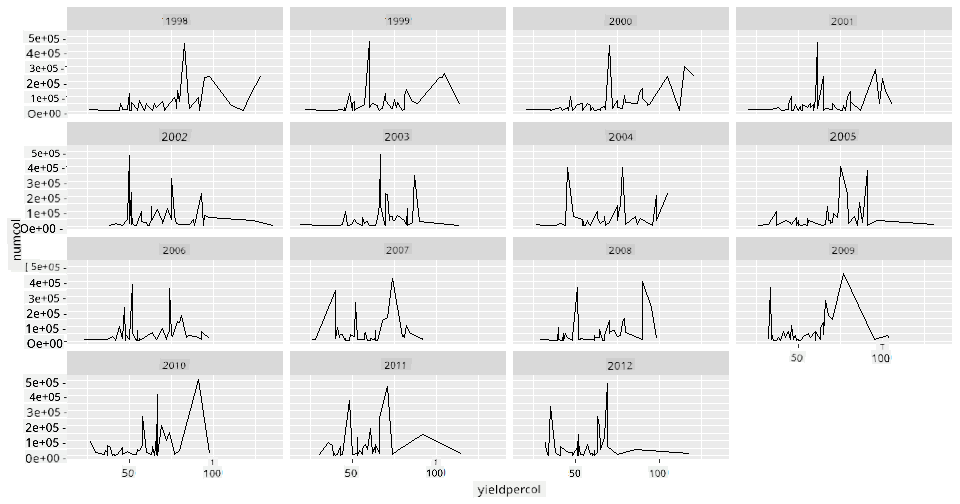
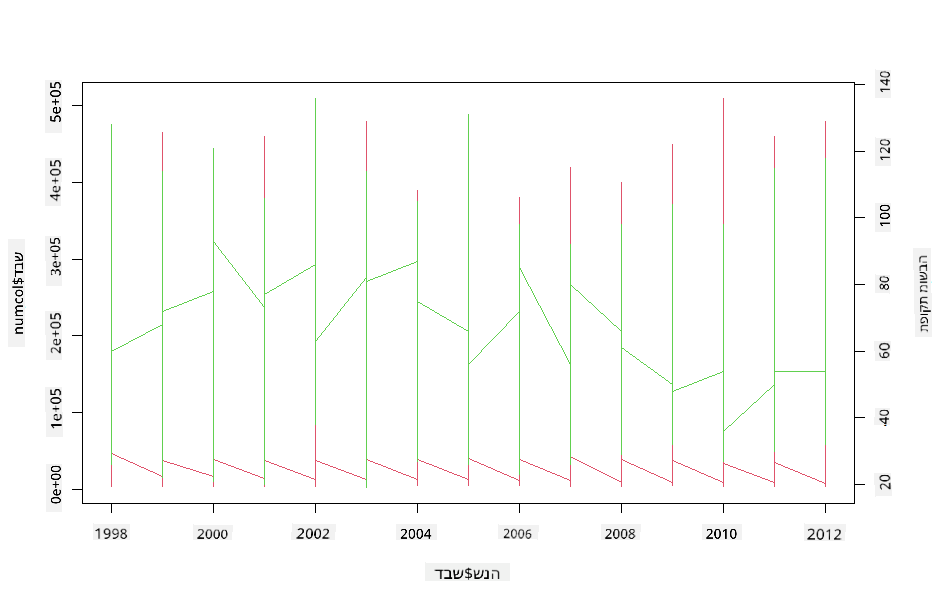

<!--
CO_OP_TRANSLATOR_METADATA:
{
  "original_hash": "a33c5d4b4156a2b41788d8720b6f724c",
  "translation_date": "2025-08-28T15:32:49+00:00",
  "source_file": "3-Data-Visualization/R/12-visualization-relationships/README.md",
  "language_code": "he"
}
-->
# חזות קשרים: הכל על דבש 🍯

| ](../../../sketchnotes/12-Visualizing-Relationships.png)|
|:---:|
|חזות קשרים - _סקיצה מאת [@nitya](https://twitter.com/nitya)_ |

בהמשך להתמקדות שלנו בטבע במחקר, בואו נגלה ויזואליזציות מעניינות שמציגות את הקשרים בין סוגי דבש שונים, לפי מאגר נתונים שמקורו ב-[משרד החקלאות של ארצות הברית](https://www.nass.usda.gov/About_NASS/index.php).

מאגר הנתונים הזה, שמכיל כ-600 פריטים, מציג את ייצור הדבש במדינות רבות בארצות הברית. לדוגמה, ניתן לבחון את מספר הכוורות, התפוקה לכל כוורת, סך הייצור, המלאי, המחיר לקילוגרם, והערך של הדבש שיוצר במדינה מסוימת בין השנים 1998-2012, עם שורה אחת לכל שנה עבור כל מדינה.

יהיה מעניין להציג את הקשר בין ייצור הדבש במדינה מסוימת בשנה נתונה לבין, למשל, המחיר של הדבש באותה מדינה. לחלופין, ניתן להציג את הקשר בין תפוקת הדבש לכל כוורת במדינות שונות. טווח השנים הזה כולל את התופעה ההרסנית 'CCD' או 'קריסת מושבות' שנצפתה לראשונה בשנת 2006 (http://npic.orst.edu/envir/ccd.html), ולכן זהו מאגר נתונים מרגש ללימוד. 🐝

## [שאלון לפני השיעור](https://purple-hill-04aebfb03.1.azurestaticapps.net/quiz/22)

בשיעור הזה, תוכלו להשתמש ב-ggplot2, ספרייה שכבר השתמשתם בה בעבר, כדי להציג קשרים בין משתנים. במיוחד מעניין השימוש בפונקציות `geom_point` ו-`qplot` של ggplot2, שמאפשרות ליצור תרשימי פיזור ותרשימי קו כדי להציג במהירות '[קשרים סטטיסטיים](https://ggplot2.tidyverse.org/)', שמסייעים למדען הנתונים להבין טוב יותר כיצד משתנים קשורים זה לזה.

## תרשימי פיזור

השתמשו בתרשים פיזור כדי להראות כיצד המחיר של דבש התפתח משנה לשנה, לפי מדינה. ggplot2, באמצעות `ggplot` ו-`geom_point`, מקבץ בנוחות את נתוני המדינות ומציג נקודות נתונים עבור נתונים קטגוריים ומספריים כאחד.

נתחיל בייבוא הנתונים וב-Seaborn:

```r
honey=read.csv('../../data/honey.csv')
head(honey)
```
שימו לב שהנתונים על הדבש כוללים כמה עמודות מעניינות, כולל שנה ומחיר לקילוגרם. בואו נחקור את הנתונים האלה, מקובצים לפי מדינות בארצות הברית:

| מדינה | numcol | yieldpercol | totalprod | stocks   | priceperlb | prodvalue | year |
| ----- | ------ | ----------- | --------- | -------- | ---------- | --------- | ---- |
| AL    | 16000  | 71          | 1136000   | 159000   | 0.72       | 818000    | 1998 |
| AZ    | 55000  | 60          | 3300000   | 1485000  | 0.64       | 2112000   | 1998 |
| AR    | 53000  | 65          | 3445000   | 1688000  | 0.59       | 2033000   | 1998 |
| CA    | 450000 | 83          | 37350000  | 12326000 | 0.62       | 23157000  | 1998 |
| CO    | 27000  | 72          | 1944000   | 1594000  | 0.7        | 1361000   | 1998 |
| FL    | 230000 | 98          |22540000   | 4508000  | 0.64       | 14426000  | 1998 |

צרו תרשים פיזור בסיסי כדי להציג את הקשר בין המחיר לקילוגרם של דבש לבין מדינת המקור שלו. הפכו את ציר ה-`y` לגבוה מספיק כדי להציג את כל המדינות:

```r
library(ggplot2)
ggplot(honey, aes(x = priceperlb, y = state)) +
  geom_point(colour = "blue")
```


כעת, הציגו את אותם נתונים עם ערכת צבעים של דבש כדי להראות כיצד המחיר מתפתח לאורך השנים. ניתן לעשות זאת על ידי הוספת פרמטר 'scale_color_gradientn' כדי להציג את השינוי משנה לשנה:

> ✅ למדו עוד על [scale_color_gradientn](https://www.rdocumentation.org/packages/ggplot2/versions/0.9.1/topics/scale_colour_gradientn) - נסו ערכת צבעים יפהפייה של קשת!

```r
ggplot(honey, aes(x = priceperlb, y = state, color=year)) +
  geom_point()+scale_color_gradientn(colours = colorspace::heat_hcl(7))
```


עם שינוי ערכת הצבעים, ניתן לראות בבירור התקדמות חזקה לאורך השנים מבחינת המחיר לקילוגרם של דבש. למעשה, אם תבחנו דוגמה מתוך הנתונים כדי לאמת (בחרו מדינה מסוימת, למשל אריזונה), תוכלו לראות דפוס של עליית מחירים משנה לשנה, עם מעט יוצאים מן הכלל:

| מדינה | numcol | yieldpercol | totalprod | stocks  | priceperlb | prodvalue | year |
| ----- | ------ | ----------- | --------- | ------- | ---------- | --------- | ---- |
| AZ    | 55000  | 60          | 3300000   | 1485000 | 0.64       | 2112000   | 1998 |
| AZ    | 52000  | 62          | 3224000   | 1548000 | 0.62       | 1999000   | 1999 |
| AZ    | 40000  | 59          | 2360000   | 1322000 | 0.73       | 1723000   | 2000 |
| AZ    | 43000  | 59          | 2537000   | 1142000 | 0.72       | 1827000   | 2001 |
| AZ    | 38000  | 63          | 2394000   | 1197000 | 1.08       | 2586000   | 2002 |
| AZ    | 35000  | 72          | 2520000   | 983000  | 1.34       | 3377000   | 2003 |
| AZ    | 32000  | 55          | 1760000   | 774000  | 1.11       | 1954000   | 2004 |
| AZ    | 36000  | 50          | 1800000   | 720000  | 1.04       | 1872000   | 2005 |
| AZ    | 30000  | 65          | 1950000   | 839000  | 0.91       | 1775000   | 2006 |
| AZ    | 30000  | 64          | 1920000   | 902000  | 1.26       | 2419000   | 2007 |
| AZ    | 25000  | 64          | 1600000   | 336000  | 1.26       | 2016000   | 2008 |
| AZ    | 20000  | 52          | 1040000   | 562000  | 1.45       | 1508000   | 2009 |
| AZ    | 24000  | 77          | 1848000   | 665000  | 1.52       | 2809000   | 2010 |
| AZ    | 23000  | 53          | 1219000   | 427000  | 1.55       | 1889000   | 2011 |
| AZ    | 22000  | 46          | 1012000   | 253000  | 1.79       | 1811000   | 2012 |

דרך נוספת להציג את ההתקדמות הזו היא באמצעות גודל, במקום צבע. עבור משתמשים עיוורי צבעים, זו עשויה להיות אפשרות טובה יותר. ערכו את הוויזואליזציה כך שתציג עלייה במחיר באמצעות עלייה בהיקף הנקודות:

```r
ggplot(honey, aes(x = priceperlb, y = state)) +
  geom_point(aes(size = year),colour = "blue") +
  scale_size_continuous(range = c(0.25, 3))
```
ניתן לראות שהגודל של הנקודות גדל בהדרגה.



האם מדובר במקרה פשוט של היצע וביקוש? בשל גורמים כמו שינויי אקלים וקריסת מושבות, האם יש פחות דבש זמין לרכישה משנה לשנה, ולכן המחיר עולה?

כדי לגלות קשר בין כמה מהמשתנים במאגר הנתונים הזה, בואו נחקור כמה תרשימי קו.

## תרשימי קו

שאלה: האם יש עלייה ברורה במחיר הדבש לקילוגרם משנה לשנה? ניתן לגלות זאת בקלות על ידי יצירת תרשים קו יחיד:

```r
qplot(honey$year,honey$priceperlb, geom='smooth', span =0.5, xlab = "year",ylab = "priceperlb")
```
תשובה: כן, עם כמה יוצאים מן הכלל סביב שנת 2003:



שאלה: ובכן, בשנת 2003 האם ניתן לראות גם עלייה בהיצע הדבש? מה אם תבחנו את סך הייצור משנה לשנה?

```python
qplot(honey$year,honey$totalprod, geom='smooth', span =0.5, xlab = "year",ylab = "totalprod")
```



תשובה: לא ממש. אם תבחנו את סך הייצור, נראה שהוא דווקא עלה בשנה הזו, למרות שבאופן כללי כמות הדבש שמיוצרת נמצאת בירידה במהלך השנים הללו.

שאלה: במקרה כזה, מה יכול היה לגרום לעלייה במחיר הדבש סביב שנת 2003?

כדי לגלות זאת, ניתן לחקור רשתות פיצול.

## רשתות פיצול

רשתות פיצול לוקחות היבט אחד ממאגר הנתונים שלכם (במקרה שלנו, ניתן לבחור 'שנה' כדי להימנע מיצירת יותר מדי פיצולים). Seaborn יכול אז ליצור תרשים עבור כל אחד מהפיצולים של הקואורדינטות שבחרתם עבור x ו-y להשוואה חזותית קלה יותר. האם שנת 2003 בולטת בהשוואה מסוג זה?

צרו רשת פיצול באמצעות `facet_wrap` כפי שמומלץ בתיעוד של [ggplot2](https://ggplot2.tidyverse.org/reference/facet_wrap.html).

```r
ggplot(honey, aes(x=yieldpercol, y = numcol,group = 1)) + 
  geom_line() + facet_wrap(vars(year))
```
בוויזואליזציה הזו, ניתן להשוות את התפוקה לכל כוורת ומספר הכוורות משנה לשנה, זו לצד זו עם פיצול שמוגדר ל-3 עבור העמודות:



עבור מאגר הנתונים הזה, שום דבר לא בולט במיוחד בכל הנוגע למספר הכוורות והתפוקה שלהן, משנה לשנה ומדינה למדינה. האם יש דרך אחרת למצוא קשר בין שני המשתנים הללו?

## תרשימי קו כפולים

נסו תרשים קו מרובה על ידי הצבת שני תרשימי קו זה על גבי זה, באמצעות הפונקציות `par` ו-`plot` של R. נשרטט את השנה בציר ה-x ונציג שני צירי y. כלומר, נציג את התפוקה לכל כוורת ואת מספר הכוורות, זה על גבי זה:

```r
par(mar = c(5, 4, 4, 4) + 0.3)              
plot(honey$year, honey$numcol, pch = 16, col = 2,type="l")              
par(new = TRUE)                             
plot(honey$year, honey$yieldpercol, pch = 17, col = 3,              
     axes = FALSE, xlab = "", ylab = "",type="l")
axis(side = 4, at = pretty(range(y2)))      
mtext("colony yield", side = 4, line = 3)   
```


למרות ששום דבר לא בולט לעין סביב שנת 2003, זה מאפשר לנו לסיים את השיעור הזה בנימה מעט שמחה יותר: למרות שיש ירידה כללית במספר הכוורות, מספר הכוורות מתייצב גם אם התפוקה שלהן לכל כוורת יורדת.

קדימה, דבורים, קדימה!

🐝❤️
## 🚀 אתגר

בשיעור הזה, למדתם קצת יותר על שימושים אחרים בתרשימי פיזור ורשתות קו, כולל רשתות פיצול. אתגרו את עצמכם ליצור רשת פיצול באמצעות מאגר נתונים אחר, אולי כזה שהשתמשתם בו לפני השיעורים הללו. שימו לב כמה זמן לוקח ליצור אותם וכיצד עליכם להיזהר בכמות הפיצולים שאתם צריכים לצייר באמצעות הטכניקות הללו.
## [שאלון אחרי השיעור](https://purple-hill-04aebfb03.1.azurestaticapps.net/quiz/23)

## סקירה ולימוד עצמי

תרשימי קו יכולים להיות פשוטים או מורכבים למדי. עשו קצת קריאה בתיעוד של [ggplot2](https://ggplot2.tidyverse.org/reference/geom_path.html#:~:text=geom_line()%20connects%20them%20in,which%20cases%20are%20connected%20together) על הדרכים השונות שבהן ניתן לבנות אותם. נסו לשפר את תרשימי הקו שבניתם בשיעור הזה עם שיטות אחרות שמופיעות בתיעוד.
## משימה

[צללו לתוך הכוורת](assignment.md)

---

**כתב ויתור**:  
מסמך זה תורגם באמצעות שירות תרגום מבוסס בינה מלאכותית [Co-op Translator](https://github.com/Azure/co-op-translator). למרות שאנו שואפים לדיוק, יש לקחת בחשבון שתרגומים אוטומטיים עשויים להכיל שגיאות או אי-דיוקים. המסמך המקורי בשפתו המקורית נחשב למקור הסמכותי. למידע קריטי, מומלץ להשתמש בתרגום מקצועי על ידי בני אדם. איננו נושאים באחריות לכל אי-הבנה או פרשנות שגויה הנובעת משימוש בתרגום זה.