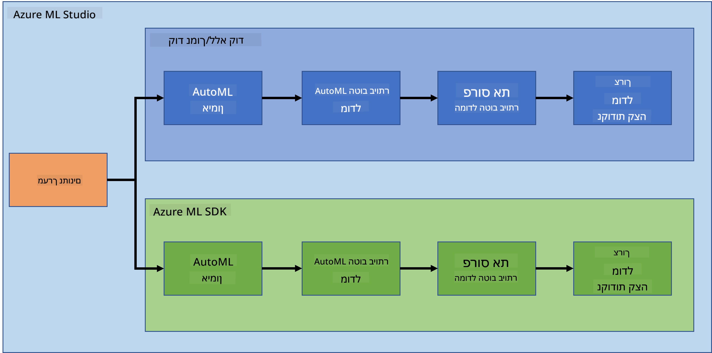
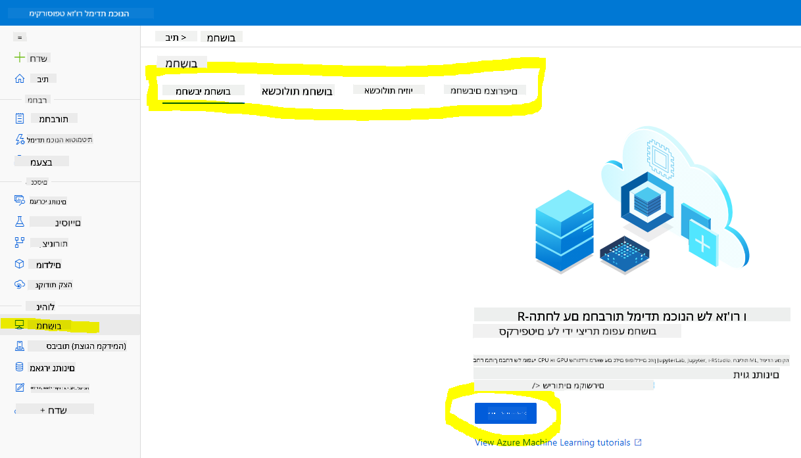
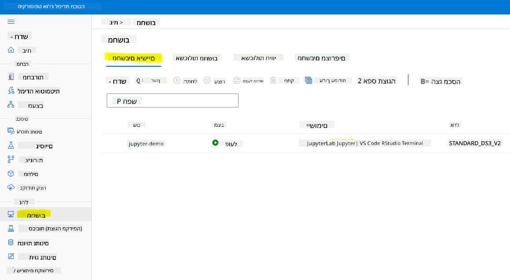
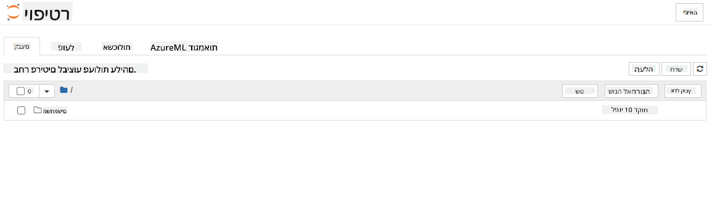

<!--
CO_OP_TRANSLATOR_METADATA:
{
  "original_hash": "5da2d6b3736f6d668b89de9bf3bdd31b",
  "translation_date": "2025-09-04T20:02:15+00:00",
  "source_file": "5-Data-Science-In-Cloud/19-Azure/README.md",
  "language_code": "he"
}
-->
# מדע הנתונים בענן: הדרך של "Azure ML SDK"

| ](../../sketchnotes/19-DataScience-Cloud.png)|
|:---:|
| מדע הנתונים בענן: Azure ML SDK - _סקיצה מאת [@nitya](https://twitter.com/nitya)_ |

תוכן עניינים:

- [מדע הנתונים בענן: הדרך של "Azure ML SDK"](../../../../5-Data-Science-In-Cloud/19-Azure)
  - [שאלון לפני השיעור](../../../../5-Data-Science-In-Cloud/19-Azure)
  - [1. מבוא](../../../../5-Data-Science-In-Cloud/19-Azure)
    - [1.1 מהו Azure ML SDK?](../../../../5-Data-Science-In-Cloud/19-Azure)
    - [1.2 פרויקט חיזוי כשל לבבי והיכרות עם מערך הנתונים](../../../../5-Data-Science-In-Cloud/19-Azure)
  - [2. אימון מודל עם Azure ML SDK](../../../../5-Data-Science-In-Cloud/19-Azure)
    - [2.1 יצירת סביבת עבודה של Azure ML](../../../../5-Data-Science-In-Cloud/19-Azure)
    - [2.2 יצירת מופע מחשוב](../../../../5-Data-Science-In-Cloud/19-Azure)
    - [2.3 טעינת מערך הנתונים](../../../../5-Data-Science-In-Cloud/19-Azure)
    - [2.4 יצירת מחברות](../../../../5-Data-Science-In-Cloud/19-Azure)
    - [2.5 אימון מודל](../../../../5-Data-Science-In-Cloud/19-Azure)
      - [2.5.1 הגדרת סביבת עבודה, ניסוי, אשכול מחשוב ומערך נתונים](../../../../5-Data-Science-In-Cloud/19-Azure)
      - [2.5.2 הגדרת AutoML ואימון](../../../../5-Data-Science-In-Cloud/19-Azure)
  - [3. פריסת מודל וצריכת נקודת קצה עם Azure ML SDK](../../../../5-Data-Science-In-Cloud/19-Azure)
    - [3.1 שמירת המודל הטוב ביותר](../../../../5-Data-Science-In-Cloud/19-Azure)
    - [3.2 פריסת מודל](../../../../5-Data-Science-In-Cloud/19-Azure)
    - [3.3 צריכת נקודת קצה](../../../../5-Data-Science-In-Cloud/19-Azure)
  - [🚀 אתגר](../../../../5-Data-Science-In-Cloud/19-Azure)
  - [שאלון לאחר השיעור](../../../../5-Data-Science-In-Cloud/19-Azure)
  - [סקירה ולימוד עצמי](../../../../5-Data-Science-In-Cloud/19-Azure)
  - [משימה](../../../../5-Data-Science-In-Cloud/19-Azure)

## [שאלון לפני השיעור](https://purple-hill-04aebfb03.1.azurestaticapps.net/quiz/36)

## 1. מבוא

### 1.1 מהו Azure ML SDK?

מדעני נתונים ומפתחים בתחום הבינה המלאכותית משתמשים ב-Azure Machine Learning SDK כדי לבנות ולהפעיל תהליכי עבודה של למידת מכונה עם שירות Azure Machine Learning. ניתן לעבוד עם השירות בכל סביבה של Python, כולל Jupyter Notebooks, Visual Studio Code או סביבת הפיתוח המועדפת עליכם.

תחומים מרכזיים ב-SDK כוללים:

- חקר, הכנה וניהול מחזור החיים של מערכי הנתונים המשמשים בניסויים של למידת מכונה.
- ניהול משאבי ענן לצורך ניטור, רישום וארגון ניסויי למידת מכונה.
- אימון מודלים באופן מקומי או באמצעות משאבי ענן, כולל אימון מודלים מואץ על ידי GPU.
- שימוש בלמידת מכונה אוטומטית, שמקבלת פרמטרי תצורה ונתוני אימון. היא מבצעת באופן אוטומטי איטרציות על אלגוריתמים והגדרות היפר-פרמטרים כדי למצוא את המודל הטוב ביותר לחיזוי.
- פריסת שירותי אינטרנט כדי להפוך את המודלים המאומנים לשירותי RESTful שניתן לצרוך בכל אפליקציה.

[למידע נוסף על Azure Machine Learning SDK](https://docs.microsoft.com/python/api/overview/azure/ml?WT.mc_id=academic-77958-bethanycheum&ocid=AID3041109)

בשיעור הקודם [כאן](../18-Low-Code/README.md), ראינו כיצד לאמן, לפרוס ולצרוך מודל בצורה של קוד מועט/ללא קוד. השתמשנו במערך הנתונים של כשל לבבי כדי ליצור מודל חיזוי כשל לבבי. בשיעור זה, נעשה את אותו הדבר אך באמצעות Azure Machine Learning SDK.



### 1.2 פרויקט חיזוי כשל לבבי והיכרות עם מערך הנתונים

בדקו [כאן](../18-Low-Code/README.md) את ההיכרות עם פרויקט חיזוי כשל לבבי ומערך הנתונים.

## 2. אימון מודל עם Azure ML SDK
### 2.1 יצירת סביבת עבודה של Azure ML

לצורך הפשטות, נעבוד על מחברת Jupyter. זה אומר שכבר יש לכם סביבת עבודה ומופע מחשוב. אם כבר יש לכם סביבת עבודה, תוכלו לדלג ישירות לסעיף 2.3 יצירת מחברת.

אם לא, אנא עקבו אחר ההוראות בסעיף **2.1 יצירת סביבת עבודה של Azure ML** בשיעור הקודם [כאן](../18-Low-Code/README.md) כדי ליצור סביבת עבודה.

### 2.2 יצירת מופע מחשוב

בסביבת העבודה של [Azure ML](https://ml.azure.com/) שיצרנו קודם, עברו לתפריט המחשוב ותראו את המשאבים השונים הזמינים.



בואו ניצור מופע מחשוב כדי להפעיל מחברת Jupyter. 
1. לחצו על כפתור + חדש. 
2. תנו שם למופע המחשוב שלכם.
3. בחרו את האפשרויות שלכם: CPU או GPU, גודל VM ומספר ליבות.
4. לחצו על כפתור יצירה.

מזל טוב, יצרתם מופע מחשוב! נשתמש במופע זה כדי ליצור מחברת בסעיף [יצירת מחברות](../../../../5-Data-Science-In-Cloud/19-Azure).

### 2.3 טעינת מערך הנתונים
עיינו בשיעור הקודם [כאן](../18-Low-Code/README.md) בסעיף **2.3 טעינת מערך הנתונים** אם עדיין לא העליתם את מערך הנתונים.

### 2.4 יצירת מחברות

> **_הערה:_** לשלב הבא תוכלו ליצור מחברת חדשה מאפס, או להעלות את [המחברת שיצרנו](notebook.ipynb) ב-Azure ML Studio שלכם. כדי להעלות אותה, פשוט לחצו על תפריט "מחברת" והעלו את המחברת.

מחברות הן חלק חשוב מאוד בתהליך מדע הנתונים. ניתן להשתמש בהן לביצוע ניתוח נתונים חקרני (EDA), לקרוא לאשכול מחשוב כדי לאמן מודל, לקרוא לאשכול הסקה כדי לפרוס נקודת קצה.

כדי ליצור מחברת, אנו זקוקים לצומת מחשוב שמפעיל מופע מחברת Jupyter. חזרו לסביבת העבודה של [Azure ML](https://ml.azure.com/) ולחצו על מופעי מחשוב. ברשימת מופעי המחשוב, אתם אמורים לראות את [מופע המחשוב שיצרנו קודם](../../../../5-Data-Science-In-Cloud/19-Azure). 

1. בסעיף האפליקציות, לחצו על האפשרות Jupyter. 
2. סמנו את התיבה "כן, אני מבין" ולחצו על כפתור המשך.

3. זה אמור לפתוח לשונית דפדפן חדשה עם מופע מחברת Jupyter שלכם כפי שמוצג. לחצו על כפתור "חדש" כדי ליצור מחברת.



עכשיו שיש לנו מחברת, נוכל להתחיל לאמן את המודל עם Azure ML SDK.

### 2.5 אימון מודל

ראשית, אם יש לכם ספק כלשהו, עיינו בתיעוד של [Azure ML SDK](https://docs.microsoft.com/python/api/overview/azure/ml?WT.mc_id=academic-77958-bethanycheum&ocid=AID3041109). הוא מכיל את כל המידע הדרוש להבנת המודולים שנראה בשיעור זה.

#### 2.5.1 הגדרת סביבת עבודה, ניסוי, אשכול מחשוב ומערך נתונים

עליכם לטעון את `workspace` מקובץ התצורה באמצעות הקוד הבא:

```python
from azureml.core import Workspace
ws = Workspace.from_config()
```

זה מחזיר אובייקט מסוג `Workspace` שמייצג את סביבת העבודה. לאחר מכן עליכם ליצור `experiment` באמצעות הקוד הבא:

```python
from azureml.core import Experiment
experiment_name = 'aml-experiment'
experiment = Experiment(ws, experiment_name)
```
כדי לקבל או ליצור ניסוי מסביבת עבודה, מבקשים את הניסוי באמצעות שם הניסוי. שם הניסוי חייב להיות באורך של 3-36 תווים, להתחיל באות או מספר, ויכול להכיל רק אותיות, מספרים, קווים תחתונים ומקפים. אם הניסוי לא נמצא בסביבת העבודה, נוצר ניסוי חדש.

כעת עליכם ליצור אשכול מחשוב לאימון באמצעות הקוד הבא. שימו לב ששלב זה עשוי לקחת כמה דקות. 

```python
from azureml.core.compute import AmlCompute

aml_name = "heart-f-cluster"
try:
    aml_compute = AmlCompute(ws, aml_name)
    print('Found existing AML compute context.')
except:
    print('Creating new AML compute context.')
    aml_config = AmlCompute.provisioning_configuration(vm_size = "Standard_D2_v2", min_nodes=1, max_nodes=3)
    aml_compute = AmlCompute.create(ws, name = aml_name, provisioning_configuration = aml_config)
    aml_compute.wait_for_completion(show_output = True)

cts = ws.compute_targets
compute_target = cts[aml_name]
```

ניתן לקבל את מערך הנתונים מסביבת העבודה באמצעות שם מערך הנתונים בדרך הבאה:

```python
dataset = ws.datasets['heart-failure-records']
df = dataset.to_pandas_dataframe()
df.describe()
```
#### 2.5.2 הגדרת AutoML ואימון

כדי להגדיר את תצורת AutoML, השתמשו במחלקה [AutoMLConfig](https://docs.microsoft.com/python/api/azureml-train-automl-client/azureml.train.automl.automlconfig(class)?WT.mc_id=academic-77958-bethanycheum&ocid=AID3041109).

כפי שמתואר בתיעוד, ישנם פרמטרים רבים שניתן לשחק איתם. עבור פרויקט זה, נשתמש בפרמטרים הבאים:

- `experiment_timeout_minutes`: הזמן המרבי (בדקות) שהניסוי מורשה לפעול לפני שהוא נעצר אוטומטית והתוצאות נעשות זמינות.
- `max_concurrent_iterations`: מספר האיטרציות המרבי של אימון מקביל המותר לניסוי.
- `primary_metric`: המדד הראשי המשמש לקביעת מצב הניסוי.
- `compute_target`: יעד המחשוב של Azure Machine Learning שבו יפעל ניסוי למידת המכונה האוטומטי.
- `task`: סוג המשימה להפעלה. ערכים יכולים להיות 'classification', 'regression', או 'forecasting' בהתאם לסוג בעיית למידת המכונה האוטומטית שיש לפתור.
- `training_data`: נתוני האימון שישמשו בתוך הניסוי. עליו להכיל גם תכונות אימון וגם עמודת תווית (אופציונלית עמודת משקל דגימה).
- `label_column_name`: שם עמודת התווית.
- `path`: הנתיב המלא לתיקיית פרויקט Azure Machine Learning.
- `enable_early_stopping`: האם לאפשר סיום מוקדם אם הציון לא משתפר בטווח הקצר.
- `featurization`: אינדיקטור האם יש לבצע שלב יצירת תכונות באופן אוטומטי או לא, או האם יש להשתמש ביצירת תכונות מותאמת אישית.
- `debug_log`: קובץ היומן לכתיבת מידע דיבוג.

```python
from azureml.train.automl import AutoMLConfig

project_folder = './aml-project'

automl_settings = {
    "experiment_timeout_minutes": 20,
    "max_concurrent_iterations": 3,
    "primary_metric" : 'AUC_weighted'
}

automl_config = AutoMLConfig(compute_target=compute_target,
                             task = "classification",
                             training_data=dataset,
                             label_column_name="DEATH_EVENT",
                             path = project_folder,  
                             enable_early_stopping= True,
                             featurization= 'auto',
                             debug_log = "automl_errors.log",
                             **automl_settings
                            )
```
כעת, לאחר שהגדרתם את התצורה, תוכלו לאמן את המודל באמצעות הקוד הבא. שלב זה עשוי לקחת עד שעה בהתאם לגודל האשכול שלכם.

```python
remote_run = experiment.submit(automl_config)
```
ניתן להפעיל את ווידג'ט RunDetails כדי להציג את הניסויים השונים.
```python
from azureml.widgets import RunDetails
RunDetails(remote_run).show()
```
## 3. פריסת מודל וצריכת נקודת קצה עם Azure ML SDK

### 3.1 שמירת המודל הטוב ביותר

ה-`remote_run` הוא אובייקט מסוג [AutoMLRun](https://docs.microsoft.com/python/api/azureml-train-automl-client/azureml.train.automl.run.automlrun?WT.mc_id=academic-77958-bethanycheum&ocid=AID3041109). אובייקט זה מכיל את השיטה `get_output()` שמחזירה את הריצה הטובה ביותר ואת המודל המתאים.

```python
best_run, fitted_model = remote_run.get_output()
```
ניתן לראות את הפרמטרים ששימשו למודל הטוב ביותר על ידי הדפסת המודל המתאים ולראות את המאפיינים של המודל הטוב ביותר באמצעות השיטה [get_properties()](https://docs.microsoft.com/python/api/azureml-core/azureml.core.run(class)?view=azure-ml-py#azureml_core_Run_get_properties?WT.mc_id=academic-77958-bethanycheum&ocid=AID3041109).

```python
best_run.get_properties()
```

כעת רשמו את המודל באמצעות השיטה [register_model](https://docs.microsoft.com/python/api/azureml-train-automl-client/azureml.train.automl.run.automlrun?view=azure-ml-py#register-model-model-name-none--description-none--tags-none--iteration-none--metric-none-?WT.mc_id=academic-77958-bethanycheum&ocid=AID3041109).
```python
model_name = best_run.properties['model_name']
script_file_name = 'inference/score.py'
best_run.download_file('outputs/scoring_file_v_1_0_0.py', 'inference/score.py')
description = "aml heart failure project sdk"
model = best_run.register_model(model_name = model_name,
                                model_path = './outputs/',
                                description = description,
                                tags = None)
```
### 3.2 פריסת מודל

לאחר שמירת המודל הטוב ביותר, ניתן לפרוס אותו באמצעות המחלקה [InferenceConfig](https://docs.microsoft.com/python/api/azureml-core/azureml.core.model.inferenceconfig?view=azure-ml-py?ocid=AID3041109). InferenceConfig מייצגת את הגדרות התצורה לסביבה מותאמת אישית המשמשת לפריסה. המחלקה [AciWebservice](https://docs.microsoft.com/python/api/azureml-core/azureml.core.webservice.aciwebservice?view=azure-ml-py) מייצגת מודל למידת מכונה שפורס כנקודת קצה של שירות אינטרנט על Azure Container Instances. שירות האינטרנט המתקבל הוא נקודת קצה HTTP מאוזנת עומסים עם API REST. ניתן לשלוח נתונים ל-API זה ולקבל את החיזוי שהמודל מחזיר.

המודל נפרס באמצעות השיטה [deploy](https://docs.microsoft.com/python/api/azureml-core/azureml.core.model(class)?view=azure-ml-py#deploy-workspace--name--models--inference-config-none--deployment-config-none--deployment-target-none--overwrite-false--show-output-false-?WT.mc_id=academic-77958-bethanycheum&ocid=AID3041109).

```python
from azureml.core.model import InferenceConfig, Model
from azureml.core.webservice import AciWebservice

inference_config = InferenceConfig(entry_script=script_file_name, environment=best_run.get_environment())

aciconfig = AciWebservice.deploy_configuration(cpu_cores = 1,
                                               memory_gb = 1,
                                               tags = {'type': "automl-heart-failure-prediction"},
                                               description = 'Sample service for AutoML Heart Failure Prediction')

aci_service_name = 'automl-hf-sdk'
aci_service = Model.deploy(ws, aci_service_name, [model], inference_config, aciconfig)
aci_service.wait_for_deployment(True)
print(aci_service.state)
```
שלב זה עשוי לקחת כמה דקות.

### 3.3 צריכת נקודת קצה

ניתן לצרוך את נקודת הקצה על ידי יצירת קלט לדוגמה:

```python
data = {
    "data":
    [
        {
            'age': "60",
            'anaemia': "false",
            'creatinine_phosphokinase': "500",
            'diabetes': "false",
            'ejection_fraction': "38",
            'high_blood_pressure': "false",
            'platelets': "260000",
            'serum_creatinine': "1.40",
            'serum_sodium': "137",
            'sex': "false",
            'smoking': "false",
            'time': "130",
        },
    ],
}

test_sample = str.encode(json.dumps(data))
```
ולאחר מכן לשלוח קלט זה למודל שלכם לצורך חיזוי:
```python
response = aci_service.run(input_data=test_sample)
response
```  
זה אמור להחזיר `'{"result": [false]}'`. המשמעות היא שהקלט של המטופל ששלחנו לנקודת הקצה יצר את התחזית `false`, כלומר האדם הזה אינו צפוי ללקות בהתקף לב.

ברכות! הרגע השתמשת במודל שהופעל ואומן ב-Azure ML באמצעות Azure ML SDK!

> **_NOTE:_** לאחר שתסיים את הפרויקט, אל תשכח למחוק את כל המשאבים.

## 🚀 אתגר

ישנם דברים רבים נוספים שניתן לעשות באמצעות ה-SDK, אך לצערנו לא נוכל לעבור על כולם בשיעור הזה. החדשות הטובות הן שלמידה כיצד לעיין בתיעוד של ה-SDK יכולה לקחת אותך רחוק באופן עצמאי. עיין בתיעוד של Azure ML SDK ומצא את המחלקה `Pipeline`, שמאפשרת ליצור צינורות עבודה. צינור עבודה הוא אוסף של שלבים שניתן לבצע כזרימת עבודה.

**רמז:** עבור אל [תיעוד ה-SDK](https://docs.microsoft.com/python/api/overview/azure/ml/?view=azure-ml-py?WT.mc_id=academic-77958-bethanycheum&ocid=AID3041109) והקלד מילות מפתח בשורת החיפוש כמו "Pipeline". עליך למצוא את המחלקה `azureml.pipeline.core.Pipeline` בתוצאות החיפוש.

## [שאלון לאחר השיעור](https://ff-quizzes.netlify.app/en/ds/)

## סקירה ולימוד עצמי

בשיעור הזה למדת כיצד לאמן, להפעיל ולהשתמש במודל כדי לחזות את הסיכון לאי ספיקת לב באמצעות Azure ML SDK בענן. עיין ב-[תיעוד הזה](https://docs.microsoft.com/python/api/overview/azure/ml/?view=azure-ml-py?WT.mc_id=academic-77958-bethanycheum&ocid=AID3041109) למידע נוסף על Azure ML SDK. נסה ליצור מודל משלך באמצעות Azure ML SDK.

## משימה

[פרויקט מדעי נתונים באמצעות Azure ML SDK](assignment.md)  

---

**כתב ויתור**:  
מסמך זה תורגם באמצעות שירות תרגום מבוסס בינה מלאכותית [Co-op Translator](https://github.com/Azure/co-op-translator). למרות שאנו שואפים לדיוק, יש לקחת בחשבון שתרגומים אוטומטיים עשויים להכיל שגיאות או אי דיוקים. המסמך המקורי בשפתו המקורית צריך להיחשב כמקור סמכותי. עבור מידע קריטי, מומלץ להשתמש בתרגום מקצועי על ידי אדם. איננו נושאים באחריות לאי הבנות או לפרשנויות שגויות הנובעות משימוש בתרגום זה.