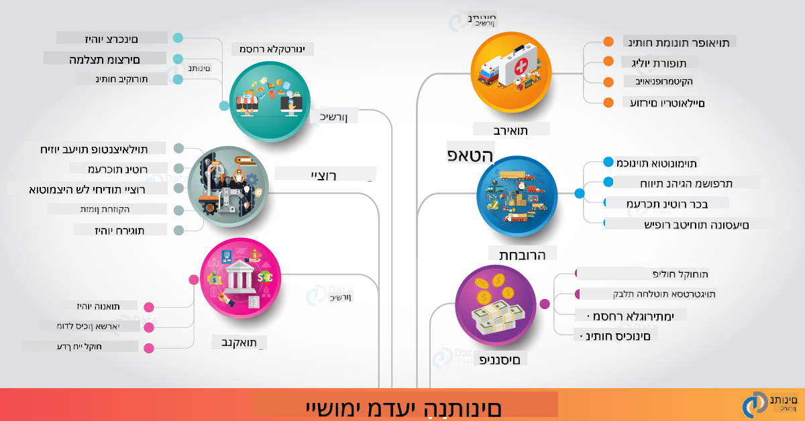

<!--
CO_OP_TRANSLATOR_METADATA:
{
  "original_hash": "67076ed50f54e7d26ba1ba378d6078f1",
  "translation_date": "2025-08-28T15:59:42+00:00",
  "source_file": "6-Data-Science-In-Wild/20-Real-World-Examples/README.md",
  "language_code": "he"
}
-->
# מדע הנתונים בעולם האמיתי

|  ](../../sketchnotes/20-DataScience-RealWorld.png) |
| :--------------------------------------------------------------------------------------------------------------: |
|               מדע הנתונים בעולם האמיתי - _איור מאת [@nitya](https://twitter.com/nitya)_               |

אנחנו כמעט בסוף המסע הלימודי הזה!

התחלנו עם הגדרות של מדע הנתונים ואתיקה, חקרנו כלים וטכניקות שונות לניתוח ויזואליזציה של נתונים, סקרנו את מחזור החיים של מדע הנתונים, ובחנו כיצד להרחיב ולייעל תהליכי עבודה במדע הנתונים באמצעות שירותי מחשוב ענן. אז אתם בטח שואלים את עצמכם: _"איך בדיוק אני מחבר את כל מה שלמדתי להקשרים בעולם האמיתי?"_

בשיעור הזה, נחקור יישומים של מדע הנתונים בתעשייה ונצלול לדוגמאות ספציפיות בתחומי המחקר, מדעי הרוח הדיגיטליים וקיימות. נבחן הזדמנויות לפרויקטים לסטודנטים ונסיים עם משאבים שימושיים שיעזרו לכם להמשיך את מסע הלמידה שלכם!

## חידון לפני השיעור

[חידון לפני השיעור](https://purple-hill-04aebfb03.1.azurestaticapps.net/quiz/38)

## מדע הנתונים + תעשייה

בזכות הדמוקרטיזציה של הבינה המלאכותית, מפתחים מוצאים כיום שקל יותר לעצב ולשלב תובנות מבוססות נתונים והחלטות מונעות בינה מלאכותית בחוויות משתמש ותהליכי פיתוח. הנה כמה דוגמאות ליישומים של מדע הנתונים בעולם האמיתי בתעשייה:

 * [Google Flu Trends](https://www.wired.com/2015/10/can-learn-epic-failure-google-flu-trends/) השתמש במדע הנתונים כדי לקשר בין מונחי חיפוש למגמות שפעת. למרות שהגישה הייתה פגומה, היא העלתה את המודעות לאפשרויות (ולאתגרים) של תחזיות בריאות מבוססות נתונים.

 * [תחזיות מסלולים של UPS](https://www.technologyreview.com/2018/11/21/139000/how-ups-uses-ai-to-outsmart-bad-weather/) - מסביר כיצד UPS משתמשת במדע הנתונים ולמידת מכונה כדי לחזות מסלולים אופטימליים למשלוחים, תוך התחשבות בתנאי מזג האוויר, דפוסי תנועה, מועדי אספקה ועוד.

 * [ויזואליזציה של מסלולי מוניות בניו יורק](http://chriswhong.github.io/nyctaxi/) - נתונים שנאספו באמצעות [חוקי חופש המידע](https://chriswhong.com/open-data/foil_nyc_taxi/) עזרו להמחיש יום בחיי המוניות בניו יורק, ולעזור לנו להבין כיצד הן מנווטות בעיר העמוסה, כמה כסף הן מרוויחות, ומה משך הנסיעות בכל פרק זמן של 24 שעות.

 * [Uber Data Science Workbench](https://eng.uber.com/dsw/) - משתמש בנתונים (על מיקומי איסוף והורדה, משך נסיעות, מסלולים מועדפים וכו') שנאספים ממיליוני נסיעות יומיות של אובר כדי לבנות כלי ניתוח נתונים המסייע בקביעת מחירים, בטיחות, זיהוי הונאות והחלטות ניווט.

 * [אנליטיקה בספורט](https://towardsdatascience.com/scope-of-analytics-in-sports-world-37ed09c39860) - מתמקדת ב_אנליטיקה חזויה_ (ניתוח קבוצות ושחקנים - כמו [Moneyball](https://datasciencedegree.wisconsin.edu/blog/moneyball-proves-importance-big-data-big-ideas/) - וניהול אוהדים) וב_ויזואליזציה של נתונים_ (לוחות מחוונים לקבוצות ואוהדים, משחקים וכו') עם יישומים כמו גיוס כישרונות, הימורים בספורט וניהול מלאי/אצטדיונים.

 * [מדע הנתונים בבנקאות](https://data-flair.training/blogs/data-science-in-banking/) - מדגיש את הערך של מדע הנתונים בתעשיית הפיננסים עם יישומים הנעים ממודלים של סיכונים וזיהוי הונאות, ועד פילוח לקוחות, תחזיות בזמן אמת ומערכות המלצה. אנליטיקה חזויה גם מניעה מדדים קריטיים כמו [ציוני אשראי](https://dzone.com/articles/using-big-data-and-predictive-analytics-for-credit).

 * [מדע הנתונים בבריאות](https://data-flair.training/blogs/data-science-in-healthcare/) - מדגיש יישומים כמו הדמיה רפואית (למשל, MRI, רנטגן, CT-Scan), גנומיקה (ריצוף DNA), פיתוח תרופות (הערכת סיכונים, תחזית הצלחה), אנליטיקה חזויה (טיפול בחולים ולוגיסטיקת אספקה), מעקב ומניעת מחלות ועוד.

 קרדיט לתמונה: [Data Flair: 6 Amazing Data Science Applications ](https://data-flair.training/blogs/data-science-applications/)

התרשים מציג תחומים ודוגמאות נוספים ליישום טכניקות מדע הנתונים. רוצים לחקור יישומים נוספים? עיינו בסעיף [סקירה ולימוד עצמי](../../../../6-Data-Science-In-Wild/20-Real-World-Examples) למטה.

## מדע הנתונים + מחקר

|  ](../../sketchnotes/20-DataScience-Research.png) |
| :---------------------------------------------------------------------------------------------------------------: |
|              מדע הנתונים ומחקר - _איור מאת [@nitya](https://twitter.com/nitya)_              |

בעוד שיישומים בעולם האמיתי מתמקדים לעיתים קרובות במקרי שימוש בתעשייה בקנה מידה רחב, יישומים ופרויקטים בתחום _המחקר_ יכולים להיות שימושיים משתי פרספקטיבות:

* _הזדמנויות לחדשנות_ - חקר פיתוח מהיר של רעיונות מתקדמים ובדיקת חוויות משתמש ליישומים של הדור הבא.
* _אתגרי פריסה_ - חקירת נזקים פוטנציאליים או השלכות בלתי צפויות של טכנולוגיות מדע הנתונים בהקשרים בעולם האמיתי.

עבור סטודנטים, פרויקטי מחקר אלו יכולים לספק הזדמנויות ללמידה ושיתוף פעולה, לשפר את ההבנה שלכם בנושא ולהרחיב את המודעות והמעורבות שלכם עם אנשים או צוותים רלוונטיים שעובדים בתחומי עניין. אז איך נראים פרויקטי מחקר וכיצד הם יכולים להשפיע?

בואו נבחן דוגמה אחת - [מחקר Gender Shades של MIT](http://gendershades.org/overview.html) מאת ג'וי בואולמיני (MIT Media Labs) עם [מאמר מחקר מרכזי](http://proceedings.mlr.press/v81/buolamwini18a/buolamwini18a.pdf) שנכתב בשיתוף עם טימניט גברו (אז במיקרוסופט מחקר) שהתמקד ב:

 * **מה:** מטרת פרויקט המחקר הייתה _להעריך הטיה קיימת באלגוריתמים ובמאגרי נתונים לניתוח פנים אוטומטי_ בהתבסס על מגדר וגוון עור.
 * **למה:** ניתוח פנים משמש בתחומים כמו אכיפת חוק, אבטחת שדות תעופה, מערכות גיוס ועוד - הקשרים שבהם סיווגים שגויים (למשל, עקב הטיה) יכולים לגרום לנזקים כלכליים וחברתיים פוטנציאליים לפרטים או קבוצות מושפעות. הבנת ההטיות (והסרתן או הפחתתן) היא מפתח להוגנות בשימוש.
 * **איך:** החוקרים זיהו שמדדים קיימים השתמשו בעיקר בנבדקים בעלי עור בהיר, ואספו מאגר נתונים חדש (1000+ תמונות) שהיה _מאוזן יותר_ לפי מגדר וגוון עור. מאגר הנתונים שימש להערכת הדיוק של שלושה מוצרים לסיווג מגדר (ממיקרוסופט, IBM ו-Face++).

התוצאות הראו שלמרות שהדיוק הכולל היה טוב, הייתה הבחנה ברורה בשיעורי השגיאות בין תתי קבוצות שונות - עם **שגיאות זיהוי מגדר** גבוהות יותר לנשים או אנשים בעלי גוון עור כהה יותר, מה שמעיד על הטיה.

**תוצאות מרכזיות:** המחקר העלה את המודעות לכך שמדע הנתונים זקוק ל_מאגרי נתונים מייצגים_ יותר (תתי קבוצות מאוזנות) ול_צוותים מגוונים_ יותר (רקע מגוון) כדי לזהות ולהסיר או להפחית הטיות כאלו מוקדם יותר בפתרונות AI. מאמצי מחקר כמו זה גם תורמים להגדרת עקרונות ופרקטיקות ל_בינה מלאכותית אחראית_ בארגונים רבים, לשיפור ההוגנות במוצרים ותהליכים מבוססי AI.

**רוצים ללמוד על מאמצי מחקר רלוונטיים במיקרוסופט?**

* עיינו ב[פרויקטי מחקר של מיקרוסופט](https://www.microsoft.com/research/research-area/artificial-intelligence/?facet%5Btax%5D%5Bmsr-research-area%5D%5B%5D=13556&facet%5Btax%5D%5Bmsr-content-type%5D%5B%5D=msr-project) בתחום הבינה המלאכותית.
* חקרו פרויקטים של סטודנטים מ[בית הספר לקיץ במדע הנתונים של מיקרוסופט](https://www.microsoft.com/en-us/research/academic-program/data-science-summer-school/).
* עיינו בפרויקט [Fairlearn](https://fairlearn.org/) וביוזמות [בינה מלאכותית אחראית](https://www.microsoft.com/en-us/ai/responsible-ai?activetab=pivot1%3aprimaryr6).

## מדע הנתונים + מדעי הרוח

|  ](../../sketchnotes/20-DataScience-Humanities.png) |
| :---------------------------------------------------------------------------------------------------------------: |
|              מדע הנתונים ומדעי הרוח הדיגיטליים - _איור מאת [@nitya](https://twitter.com/nitya)_              |

מדעי הרוח הדיגיטליים [הוגדרו](https://digitalhumanities.stanford.edu/about-dh-stanford) כ"אוסף של פרקטיקות וגישות המשלבות שיטות חישוביות עם חקירה הומניסטית". [פרויקטים של סטנפורד](https://digitalhumanities.stanford.edu/projects) כמו _"היסטוריה מחדש"_ ו_"חשיבה פואטית"_ מדגימים את הקשר בין [מדעי הרוח הדיגיטליים ומדע הנתונים](https://digitalhumanities.stanford.edu/digital-humanities-and-data-science) - תוך הדגשת טכניקות כמו ניתוח רשתות, ויזואליזציה של מידע, ניתוח מרחבי וטקסטואלי שיכולים לעזור לנו לבחון מחדש מאגרי נתונים היסטוריים וספרותיים כדי להפיק תובנות חדשות ופרספקטיבות.

*רוצים לחקור ולהרחיב פרויקט בתחום הזה?*

עיינו ב["אמילי דיקינסון ומטר המצב רוח"](https://gist.github.com/jlooper/ce4d102efd057137bc000db796bfd671) - דוגמה נהדרת מ[ג'ן לופר](https://twitter.com/jenlooper) ששואלת כיצד נוכל להשתמש במדע הנתונים כדי לבחון מחדש שירה מוכרת ולהעריך מחדש את משמעותה ואת תרומתה של המחברת בהקשרים חדשים. למשל, _האם נוכל לחזות את העונה שבה נכתבה שירה על ידי ניתוח הטון או הרגש שלה_ - ומה זה אומר על מצב הרוח של המחברת בתקופה הרלוונטית?

כדי לענות על השאלה הזו, אנו עוקבים אחר שלבי מחזור החיים של מדע הנתונים:
 * [`רכישת נתונים`](https://gist.github.com/jlooper/ce4d102efd057137bc000db796bfd671#acquiring-the-dataset) - לאסוף מאגר נתונים רלוונטי לניתוח. אפשרויות כוללות שימוש ב-API (למשל, [Poetry DB API](https://poetrydb.org/index.html)) או גרידת דפי אינטרנט (למשל, [פרויקט גוטנברג](https://www.gutenberg.org/files/12242/12242-h/12242-h.htm)) באמצעות כלים כמו [Scrapy](https://scrapy.org/).
 * [`ניקוי נתונים`](https://gist.github.com/jlooper/ce4d102efd057137bc000db796bfd671#clean-the-data) - מסביר כיצד ניתן לעצב, לנקות ולפשט טקסט באמצעות כלים בסיסיים כמו Visual Studio Code ו-Microsoft Excel.
 * [`ניתוח נתונים`](https://gist.github.com/jlooper/ce4d102efd057137bc000db796bfd671#working-with-the-data-in-a-notebook) - מסביר כיצד ניתן לייבא את מאגר הנתונים ל"מחברות" לניתוח באמצעות חבילות Python (כמו pandas, numpy ו-matplotlib) לארגון וויזואליזציה של הנתונים.
 * [`ניתוח רגשות`](https://gist.github.com/jlooper/ce4d102efd057137bc000db796bfd671#sentiment-analysis-using-cognitive-services) - מסביר כיצד ניתן לשלב שירותי ענן כמו Text Analytics, באמצעות כלים ללא קוד כמו [Power Automate](https://flow.microsoft.com/en-us/) לתהליכי עיבוד נתונים אוטומטיים.

באמצעות תהליך זה, נוכל לחקור את ההשפעות העונתיות על הרגש בשירים, ולעזור לנו לעצב פרספקטיבות משלנו על המחברת. נסו זאת בעצמכם - ואז הרחיבו את המחברת כדי לשאול שאלות נוספות או להמחיש את הנתונים בדרכים חדשות!

> תוכלו להשתמש בכמה מהכלים ב[ערכת הכלים של מדעי הרוח הדיגיטליים](https://github.com/Digital-Humanities-Toolkit) כדי להמשיך לחקור כיוונים אלו.

## מדע הנתונים + קיימות

|  ](../../sketchnotes/20-DataScience-Sustainability.png) |
| :---------------------------------------------------------------------------------------------------------------: |
|              מדע הנתונים וקיימות - _איור מאת [@nitya](https://twitter.com/nitya)_              |

[אג'נדה 2030 לפיתוח בר קיימא](https://sdgs.un.org/2030agenda) - שאומצה על ידי כל המדינות החברות באו"ם בשנת 2015 - מזהה 17 יעדים, כולל כאלו שמתמקדים ב**הגנה על כדור הארץ** מפני התדרדרות והשפעות שינויי האקלים. יוזמת [Microsoft Sustainability](https://www.microsoft.com/en-us/sustainability) תומכת ביעדים אלו על ידי חקר דרכים שבהן פתרונות טכנולוגיים יכולים לתמוך ולבנות עתיד בר קיימא יותר עם [מיקוד ב-4 יעדים](https://dev.to/azure/a-visual-guide-to-sustainable-software-engineering-53hh) - להיות שליליים בפחמן, חיוביים במים, ללא פסולת, וביודיוורסיים עד 2030.

התמודדות עם אתגרים אלו בקנה מידה רחב ובזמן דורשת חשיבה בקנה מידה ענני - ונתונים בקנה מידה גדול. יוזמת [המחשב הפלנטרי](https://planetarycomputer.microsoft.com/) מספקת 4 רכיבים שיעזרו למדעני נתונים ומפתחים במאמץ זה:

 * [קטלוג נתונים](https://planetarycomputer.microsoft.com/catalog) - עם פטה-בייטים של נתוני מערכות כדור הארץ (חינמיים ומאוחסנים ב-Azure).
 * [Planetary API](https://planetarycomputer.microsoft.com/docs/reference/stac/) - כדי לעזור למשתמשים לחפש נתונים רלוונטיים במרחב ובזמן.
 * [Hub](https://planetarycomputer.microsoft.com/docs/overview/environment/) - סביבה מנוהלת למדענים לעיבוד מאגרי נתונים גיאו-מרחביים עצומים.
 * [יישומים](https://planetarycomputer.microsoft.com/applications) - מציגים מקרי שימוש וכלים לתובנות קיימות.
**פרויקט המחשב הפלנטרי נמצא כרגע בתצוגה מקדימה (נכון לספטמבר 2021)** - כך תוכלו להתחיל לתרום לפתרונות קיימות באמצעות מדע הנתונים.

* [בקשו גישה](https://planetarycomputer.microsoft.com/account/request) כדי להתחיל לחקור ולהתחבר לעמיתים.
* [חקור את התיעוד](https://planetarycomputer.microsoft.com/docs/overview/about) כדי להבין אילו מערכי נתונים ו-APIs נתמכים.
* חקור יישומים כמו [ניטור מערכות אקולוגיות](https://analytics-lab.org/ecosystemmonitoring/) לקבלת השראה לרעיונות ליישומים.

חשבו כיצד תוכלו להשתמש בהדמיית נתונים כדי לחשוף או להעצים תובנות רלוונטיות בתחומים כמו שינויי אקלים וכריתת יערות. או חשבו כיצד ניתן להשתמש בתובנות כדי ליצור חוויות משתמש חדשות שמניעות שינויים התנהגותיים לחיים ברי קיימא יותר.

## מדע הנתונים + סטודנטים

דיברנו על יישומים בעולם האמיתי בתעשייה ובמחקר, וחקרנו דוגמאות ליישומי מדע הנתונים במדעי הרוח הדיגיטליים ובקיימות. אז איך תוכלו לפתח את הכישורים שלכם ולשתף את המומחיות שלכם כמתחילים במדע הנתונים?

הנה כמה דוגמאות לפרויקטים של סטודנטים במדע הנתונים שיכולים להוות השראה עבורכם.

 * [בית הספר לקיץ במדע הנתונים של MSR](https://www.microsoft.com/en-us/research/academic-program/data-science-summer-school/#!projects) עם [פרויקטים](https://github.com/msr-ds3) ב-GitHub שחוקרים נושאים כמו:
    - [הטיה גזעית בשימוש בכוח על ידי המשטרה](https://www.microsoft.com/en-us/research/video/data-science-summer-school-2019-replicating-an-empirical-analysis-of-racial-differences-in-police-use-of-force/) | [Github](https://github.com/msr-ds3/stop-question-frisk)
    - [אמינות מערכת הרכבת התחתית של ניו יורק](https://www.microsoft.com/en-us/research/video/data-science-summer-school-2018-exploring-the-reliability-of-the-nyc-subway-system/) | [Github](https://github.com/msr-ds3/nyctransit)
 * [דיגיטציה של תרבות חומרית: חקר התפלגויות סוציו-אקונומיות בסירקאפ](https://claremont.maps.arcgis.com/apps/Cascade/index.html?appid=bdf2aef0f45a4674ba41cd373fa23afc) - מאת [אורנלה אלטוניאן](https://twitter.com/ornelladotcom) והצוות שלה בקלרמונט, תוך שימוש ב-[ArcGIS StoryMaps](https://storymaps.arcgis.com/).

## 🚀 אתגר

חפשו מאמרים שממליצים על פרויקטים במדע הנתונים שמתאימים למתחילים - כמו [50 תחומי הנושא האלו](https://www.upgrad.com/blog/data-science-project-ideas-topics-beginners/) או [21 רעיונות לפרויקטים](https://www.intellspot.com/data-science-project-ideas) או [16 פרויקטים עם קוד מקור](https://data-flair.training/blogs/data-science-project-ideas/) שתוכלו לפרק ולהרכיב מחדש. ואל תשכחו לכתוב בלוג על מסעות הלמידה שלכם ולשתף את התובנות שלכם איתנו.

## חידון לאחר ההרצאה

[חידון לאחר ההרצאה](https://purple-hill-04aebfb03.1.azurestaticapps.net/quiz/39)

## סקירה ולימוד עצמי

רוצים לחקור עוד מקרי שימוש? הנה כמה מאמרים רלוונטיים:
 * [17 יישומים ודוגמאות של מדע הנתונים](https://builtin.com/data-science/data-science-applications-examples) - יולי 2021
 * [11 יישומים עוצרי נשימה של מדע הנתונים בעולם האמיתי](https://myblindbird.com/data-science-applications-real-world/) - מאי 2021
 * [מדע הנתונים בעולם האמיתי](https://towardsdatascience.com/data-science-in-the-real-world/home) - אוסף מאמרים
 * מדע הנתונים ב: [חינוך](https://data-flair.training/blogs/data-science-in-education/), [חקלאות](https://data-flair.training/blogs/data-science-in-agriculture/), [פיננסים](https://data-flair.training/blogs/data-science-in-finance/), [סרטים](https://data-flair.training/blogs/data-science-at-movies/) ועוד.

## משימה

[חקור מערך נתונים של המחשב הפלנטרי](assignment.md)

---

**כתב ויתור**:  
מסמך זה תורגם באמצעות שירות תרגום מבוסס בינה מלאכותית [Co-op Translator](https://github.com/Azure/co-op-translator). בעוד שאנו שואפים לדיוק, יש להיות מודעים לכך שתרגומים אוטומטיים עשויים להכיל שגיאות או אי-דיוקים. המסמך המקורי בשפתו המקורית צריך להיחשב כמקור הסמכותי. למידע קריטי, מומלץ להשתמש בתרגום מקצועי על ידי בני אדם. איננו נושאים באחריות לכל אי-הבנה או פרשנות שגויה הנובעת משימוש בתרגום זה.