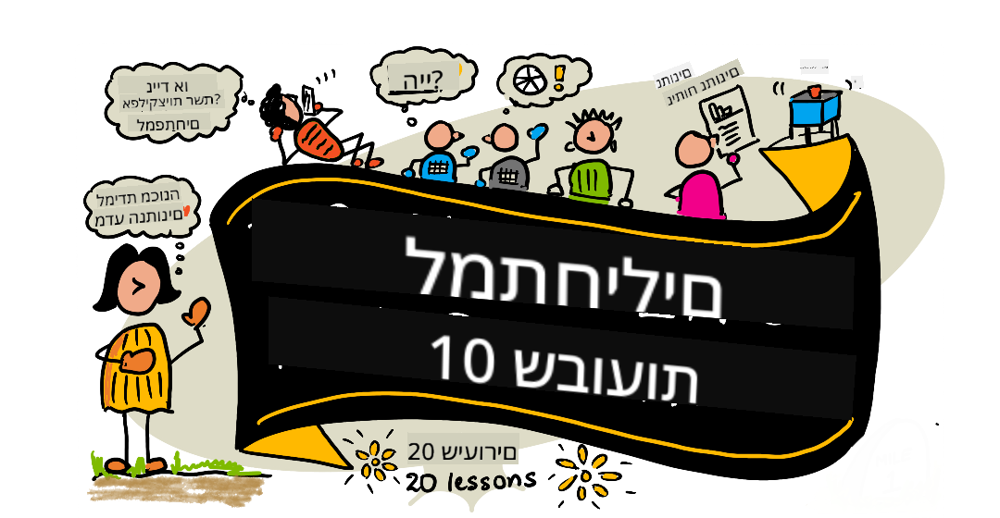

<!--
CO_OP_TRANSLATOR_METADATA:
{
  "original_hash": "dd9a1deb4da680b2cf11ba2e9f5a0a6e",
  "translation_date": "2025-09-29T21:58:49+00:00",
  "source_file": "README.md",
  "language_code": "he"
}
-->
# מדע הנתונים למתחילים - תוכנית לימודים

Azure Cloud Advocates במיקרוסופט שמחים להציע תוכנית לימודים בת 10 שבועות ו-20 שיעורים בנושא מדע הנתונים. כל שיעור כולל מבחני טרום-שיעור ואחרי-שיעור, הוראות כתובות להשלמת השיעור, פתרון ומשימה. הגישה שלנו מבוססת פרויקטים ומאפשרת ללמוד תוך כדי בנייה, שיטה מוכחת להטמעת מיומנויות חדשות.

**תודה רבה למחברים שלנו:** [Jasmine Greenaway](https://www.twitter.com/paladique), [Dmitry Soshnikov](http://soshnikov.com), [Nitya Narasimhan](https://twitter.com/nitya), [Jalen McGee](https://twitter.com/JalenMcG), [Jen Looper](https://twitter.com/jenlooper), [Maud Levy](https://twitter.com/maudstweets), [Tiffany Souterre](https://twitter.com/TiffanySouterre), [Christopher Harrison](https://www.twitter.com/geektrainer).

**🙏 תודה מיוחדת 🙏 ל[שגרירי הסטודנטים של מיקרוסופט](https://studentambassadors.microsoft.com/) שתרמו לתוכן, כתיבה וביקורת,** כולל Aaryan Arora, [Aditya Garg](https://github.com/AdityaGarg00), [Alondra Sanchez](https://www.linkedin.com/in/alondra-sanchez-molina/), [Ankita Singh](https://www.linkedin.com/in/ankitasingh007), [Anupam Mishra](https://www.linkedin.com/in/anupam--mishra/), [Arpita Das](https://www.linkedin.com/in/arpitadas01/), ChhailBihari Dubey, [Dibri Nsofor](https://www.linkedin.com/in/dibrinsofor), [Dishita Bhasin](https://www.linkedin.com/in/dishita-bhasin-7065281bb), [Majd Safi](https://www.linkedin.com/in/majd-s/), [Max Blum](https://www.linkedin.com/in/max-blum-6036a1186/), [Miguel Correa](https://www.linkedin.com/in/miguelmque/), [Mohamma Iftekher (Iftu) Ebne Jalal](https://twitter.com/iftu119), [Nawrin Tabassum](https://www.linkedin.com/in/nawrin-tabassum), [Raymond Wangsa Putra](https://www.linkedin.com/in/raymond-wp/), [Rohit Yadav](https://www.linkedin.com/in/rty2423), Samridhi Sharma, [Sanya Sinha](https://www.linkedin.com/mwlite/in/sanya-sinha-13aab1200), [Sheena Narula](https://www.linkedin.com/in/sheena-narua-n/), [Tauqeer Ahmad](https://www.linkedin.com/in/tauqeerahmad5201/), Yogendrasingh Pawar, [Vidushi Gupta](https://www.linkedin.com/in/vidushi-gupta07/), [Jasleen Sondhi](https://www.linkedin.com/in/jasleen-sondhi/)

||
|:---:|
| מדע הנתונים למתחילים - _סקצ'נוט מאת [@nitya](https://twitter.com/nitya)_ |

### 🌐 תמיכה רב-שפתית

#### נתמך באמצעות GitHub Action (אוטומטי ותמיד מעודכן)

[צרפתית](../fr/README.md) | [ספרדית](../es/README.md) | [גרמנית](../de/README.md) | [רוסית](../ru/README.md) | [ערבית](../ar/README.md) | [פרסית (פארסי)](../fa/README.md) | [אורדו](../ur/README.md) | [סינית (פשוטה)](../zh/README.md) | [סינית (מסורתית, מקאו)](../mo/README.md) | [סינית (מסורתית, הונג קונג)](../hk/README.md) | [סינית (מסורתית, טייוואן)](../tw/README.md) | [יפנית](../ja/README.md) | [קוריאנית](../ko/README.md) | [הינדי](../hi/README.md) | [בנגלית](../bn/README.md) | [מרטהית](../mr/README.md) | [נפאלית](../ne/README.md) | [פונג'בית (גורמוקי)](../pa/README.md) | [פורטוגזית (פורטוגל)](../pt/README.md) | [פורטוגזית (ברזיל)](../br/README.md) | [איטלקית](../it/README.md) | [פולנית](../pl/README.md) | [טורקית](../tr/README.md) | [יוונית](../el/README.md) | [תאית](../th/README.md) | [שוודית](../sv/README.md) | [דנית](../da/README.md) | [נורווגית](../no/README.md) | [פינית](../fi/README.md) | [הולנדית](../nl/README.md) | [עברית](./README.md) | [וייטנאמית](../vi/README.md) | [אינדונזית](../id/README.md) | [מלאית](../ms/README.md) | [טאגאלוג (פיליפינית)](../tl/README.md) | [סוואהילית](../sw/README.md) | [הונגרית](../hu/README.md) | [צ'כית](../cs/README.md) | [סלובקית](../sk/README.md) | [רומנית](../ro/README.md) | [בולגרית](../bg/README.md) | [סרבית (קירילית)](../sr/README.md) | [קרואטית](../hr/README.md) | [סלובנית](../sl/README.md) | [אוקראינית](../uk/README.md) | [בורמזית (מיאנמר)](../my/README.md)

**אם תרצו להוסיף שפות נוספות, רשימת השפות הנתמכות נמצאת [כאן](https://github.com/Azure/co-op-translator/blob/main/getting_started/supported-languages.md)**

#### הצטרפו לקהילה שלנו 

יש לנו סדרת לימוד עם AI ב-Discord, למדו עוד והצטרפו אלינו ב-[Learn with AI Series](https://aka.ms/learnwithai/discord) בין 18 ל-30 בספטמבר, 2025. תקבלו טיפים וטריקים לשימוש ב-GitHub Copilot עבור מדע הנתונים.

# האם אתם סטודנטים?

התחילו עם המשאבים הבאים:

- [עמוד מרכז הסטודנטים](https://docs.microsoft.com/en-gb/learn/student-hub?WT.mc_id=academic-77958-bethanycheum) בעמוד זה תמצאו משאבים למתחילים, חבילות לסטודנטים ואפילו דרכים לקבל שובר הסמכה בחינם. זהו עמוד שכדאי לשמור ולבדוק מדי פעם, שכן אנו מעדכנים את התוכן לפחות פעם בחודש.
- [שגרירי הסטודנטים של מיקרוסופט](https://studentambassadors.microsoft.com?WT.mc_id=academic-77958-bethanycheum) הצטרפו לקהילה גלובלית של שגרירי סטודנטים, זו יכולה להיות הדרך שלכם למיקרוסופט.

# התחלת העבודה

> **מורים**: כללנו [כמה הצעות](for-teachers.md) כיצד להשתמש בתוכנית הלימודים הזו. נשמח לקבל את המשוב שלכם [בפורום הדיונים שלנו](https://github.com/microsoft/Data-Science-For-Beginners/discussions)!

> **[סטודנטים](https://aka.ms/student-page)**: כדי להשתמש בתוכנית הלימודים הזו באופן עצמאי, עשו fork לכל הריפו והשלימו את התרגילים בעצמכם, החל ממבחן טרום-שיעור. לאחר מכן, קראו את השיעור והשלימו את שאר הפעילויות. נסו ליצור את הפרויקטים על ידי הבנת השיעורים במקום להעתיק את קוד הפתרון; עם זאת, הקוד זמין בתיקיות /solutions בכל שיעור מבוסס פרויקט. רעיון נוסף הוא ליצור קבוצת לימוד עם חברים ולעבור על התוכן יחד. ללימוד נוסף, אנו ממליצים על [Microsoft Learn](https://docs.microsoft.com/en-us/users/jenlooper-2911/collections/qprpajyoy3x0g7?WT.mc_id=academic-77958-bethanycheum).

## הכירו את הצוות

**Gif מאת** [Mohit Jaisal](https://www.linkedin.com/in/mohitjaisal)

> 🎥 לחצו על התמונה למעלה לצפייה בסרטון על הפרויקט והאנשים שיצרו אותו!

## פדגוגיה

בחרנו שני עקרונות פדגוגיים בעת בניית תוכנית הלימודים הזו: לוודא שהיא מבוססת פרויקטים ושכוללת מבחנים תכופים. בסוף הסדרה, סטודנטים ילמדו עקרונות בסיסיים של מדע הנתונים, כולל מושגים אתיים, הכנת נתונים, דרכים שונות לעבוד עם נתונים, ויזואליזציה של נתונים, ניתוח נתונים, שימושים בעולם האמיתי של מדע הנתונים ועוד.

בנוסף, מבחן קל לפני השיעור מכוון את הסטודנט ללמידת הנושא, בעוד מבחן שני לאחר השיעור מבטיח שימור נוסף. תוכנית הלימודים עוצבה להיות גמישה ומהנה וניתן לקחת אותה בשלמותה או בחלקים. הפרויקטים מתחילים קטנים והופכים מורכבים יותר בסוף מחזור של 10 שבועות.

> מצאו את [קוד ההתנהגות שלנו](CODE_OF_CONDUCT.md), [הנחיות לתרומה](CONTRIBUTING.md), [הנחיות לתרגום](TRANSLATIONS.md). נשמח לקבל את המשוב הבונה שלכם!

## כל שיעור כולל:

- סקצ'נוט אופציונלי
- סרטון משלים אופציונלי
- מבחן חימום לפני השיעור
- שיעור כתוב
- עבור שיעורים מבוססי פרויקט, מדריכים שלב-אחר-שלב כיצד לבנות את הפרויקט
- בדיקות ידע
- אתגר
- קריאה משלימה
- משימה
- [מבחן אחרי השיעור](https://ff-quizzes.netlify.app/en/)

> **הערה לגבי מבחנים**: כל המבחנים נמצאים בתיקיית Quiz-App, סה"כ 40 מבחנים של שלוש שאלות כל אחד. הם מקושרים מתוך השיעורים, אך ניתן להריץ את אפליקציית המבחנים באופן מקומי או לפרוס אותה ב-Azure; עקבו אחר ההוראות בתיקיית `quiz-app`. הם מתורגמים בהדרגה.

## שיעורים
||
|:---:|
| מדע הנתונים למתחילים: מפת דרכים - _איור מאת [@nitya](https://twitter.com/nitya)_ |

| מספר שיעור | נושא | קבוצת שיעורים | מטרות למידה | שיעור מקושר | מחבר |
| :-----------: | :----------------------------------------: | :--------------------------------------------------: | :-----------------------------------------------------------------------------------------------------------------------------------------------------------------------: | :---------------------------------------------------------------------: | :----: |
| 01 | הגדרת מדע הנתונים | [מבוא](1-Introduction/README.md) | ללמוד את המושגים הבסיסיים של מדע הנתונים וכיצד הוא קשור לבינה מלאכותית, למידת מכונה ולנתונים גדולים. | [שיעור](1-Introduction/01-defining-data-science/README.md) [וידאו](https://youtu.be/beZ7Mb_oz9I) | [Dmitry](http://soshnikov.com) |
| 02 | אתיקה במדע הנתונים | [מבוא](1-Introduction/README.md) | מושגים, אתגרים ומסגרות באתיקה של נתונים. | [שיעור](1-Introduction/02-ethics/README.md) | [Nitya](https://twitter.com/nitya) |
| 03 | הגדרת נתונים | [מבוא](1-Introduction/README.md) | כיצד נתונים מסווגים ומהם המקורות הנפוצים שלהם. | [שיעור](1-Introduction/03-defining-data/README.md) | [Jasmine](https://www.twitter.com/paladique) |
| 04 | מבוא לסטטיסטיקה והסתברות | [מבוא](1-Introduction/README.md) | טכניקות מתמטיות של הסתברות וסטטיסטיקה להבנת נתונים. | [שיעור](1-Introduction/04-stats-and-probability/README.md) [וידאו](https://youtu.be/Z5Zy85g4Yjw) | [Dmitry](http://soshnikov.com) |
| 05 | עבודה עם נתונים יחסיים | [עבודה עם נתונים](2-Working-With-Data/README.md) | מבוא לנתונים יחסיים ולבסיסי חקר וניתוח נתונים יחסיים באמצעות שפת SQL (מכונה "סי-קוול"). | [שיעור](2-Working-With-Data/05-relational-databases/README.md) | [Christopher](https://www.twitter.com/geektrainer) | | |
| 06 | עבודה עם נתוני NoSQL | [עבודה עם נתונים](2-Working-With-Data/README.md) | מבוא לנתונים לא יחסיים, סוגיהם השונים ולבסיסי חקר וניתוח מסדי נתונים מבוססי מסמכים. | [שיעור](2-Working-With-Data/06-non-relational/README.md) | [Jasmine](https://twitter.com/paladique)|
| 07 | עבודה עם Python | [עבודה עם נתונים](2-Working-With-Data/README.md) | יסודות השימוש ב-Python לחקר נתונים עם ספריות כמו Pandas. מומלץ ידע בסיסי בתכנות ב-Python. | [שיעור](2-Working-With-Data/07-python/README.md) [וידאו](https://youtu.be/dZjWOGbsN4Y) | [Dmitry](http://soshnikov.com) |
| 08 | הכנת נתונים | [עבודה עם נתונים](2-Working-With-Data/README.md) | טכניקות לניקוי והמרת נתונים כדי להתמודד עם אתגרים של נתונים חסרים, לא מדויקים או לא שלמים. | [שיעור](2-Working-With-Data/08-data-preparation/README.md) | [Jasmine](https://www.twitter.com/paladique) |
| 09 | ויזואליזציה של כמויות | [ויזואליזציה של נתונים](3-Data-Visualization/README.md) | ללמוד כיצד להשתמש ב-Matplotlib כדי להציג נתוני ציפורים 🦆 | [שיעור](3-Data-Visualization/09-visualization-quantities/README.md) | [Jen](https://twitter.com/jenlooper) |
| 10 | ויזואליזציה של התפלגויות נתונים | [ויזואליזציה של נתונים](3-Data-Visualization/README.md) | הצגת תצפיות ומגמות בתוך טווח. | [שיעור](3-Data-Visualization/10-visualization-distributions/README.md) | [Jen](https://twitter.com/jenlooper) |
| 11 | ויזואליזציה של פרופורציות | [ויזואליזציה של נתונים](3-Data-Visualization/README.md) | הצגת אחוזים בדידים ומקובצים. | [שיעור](3-Data-Visualization/11-visualization-proportions/README.md) | [Jen](https://twitter.com/jenlooper) |
| 12 | ויזואליזציה של קשרים | [ויזואליזציה של נתונים](3-Data-Visualization/README.md) | הצגת קשרים וקורלציות בין קבוצות נתונים ומשתנים שלהם. | [שיעור](3-Data-Visualization/12-visualization-relationships/README.md) | [Jen](https://twitter.com/jenlooper) |
| 13 | ויזואליזציות משמעותיות | [ויזואליזציה של נתונים](3-Data-Visualization/README.md) | טכניקות והנחיות ליצירת ויזואליזציות בעלות ערך לפתרון בעיות והפקת תובנות. | [שיעור](3-Data-Visualization/13-meaningful-visualizations/README.md) | [Jen](https://twitter.com/jenlooper) |
| 14 | מבוא למחזור החיים של מדע הנתונים | [מחזור חיים](4-Data-Science-Lifecycle/README.md) | מבוא למחזור החיים של מדע הנתונים ולשלב הראשון של רכישת והפקת נתונים. | [שיעור](4-Data-Science-Lifecycle/14-Introduction/README.md) | [Jasmine](https://twitter.com/paladique) |
| 15 | ניתוח | [מחזור חיים](4-Data-Science-Lifecycle/README.md) | שלב זה במחזור החיים של מדע הנתונים מתמקד בטכניקות לניתוח נתונים. | [שיעור](4-Data-Science-Lifecycle/15-analyzing/README.md) | [Jasmine](https://twitter.com/paladique) | | |
| 16 | תקשורת | [מחזור חיים](4-Data-Science-Lifecycle/README.md) | שלב זה במחזור החיים של מדע הנתונים מתמקד בהצגת התובנות מהנתונים בצורה שמקלה על מקבלי ההחלטות להבין. | [שיעור](4-Data-Science-Lifecycle/16-communication/README.md) | [Jalen](https://twitter.com/JalenMcG) | | |
| 17 | מדע הנתונים בענן | [נתונים בענן](5-Data-Science-In-Cloud/README.md) | סדרת שיעורים זו מציגה את מדע הנתונים בענן ואת יתרונותיו. | [שיעור](5-Data-Science-In-Cloud/17-Introduction/README.md) | [Tiffany](https://twitter.com/TiffanySouterre) ו-[Maud](https://twitter.com/maudstweets) |
| 18 | מדע הנתונים בענן | [נתונים בענן](5-Data-Science-In-Cloud/README.md) | אימון מודלים באמצעות כלים בעלי קוד נמוך. |[שיעור](5-Data-Science-In-Cloud/18-Low-Code/README.md) | [Tiffany](https://twitter.com/TiffanySouterre) ו-[Maud](https://twitter.com/maudstweets) |
| 19 | מדע הנתונים בענן | [נתונים בענן](5-Data-Science-In-Cloud/README.md) | פריסת מודלים עם Azure Machine Learning Studio. | [שיעור](5-Data-Science-In-Cloud/19-Azure/README.md)| [Tiffany](https://twitter.com/TiffanySouterre) ו-[Maud](https://twitter.com/maudstweets) |
| 20 | מדע הנתונים בשטח | [בשטח](6-Data-Science-In-Wild/README.md) | פרויקטים מונעי מדע נתונים בעולם האמיתי. | [שיעור](6-Data-Science-In-Wild/20-Real-World-Examples/README.md) | [Nitya](https://twitter.com/nitya) |

## GitHub Codespaces

עקבו אחר השלבים הבאים כדי לפתוח את הדוגמה הזו ב-Codespace:
1. לחצו על תפריט Code ובחרו באפשרות Open with Codespaces.
2. בחרו + New codespace בתחתית החלונית.
למידע נוסף, עיינו ב-[תיעוד GitHub](https://docs.github.com/en/codespaces/developing-in-codespaces/creating-a-codespace-for-a-repository#creating-a-codespace).

## VSCode Remote - Containers
עקבו אחר השלבים הבאים כדי לפתוח את המאגר הזה במיכל באמצעות המחשב המקומי שלכם ו-VSCode באמצעות הרחבת VS Code Remote - Containers:

1. אם זו הפעם הראשונה שאתם משתמשים במיכל פיתוח, ודאו שהמערכת שלכם עומדת בדרישות המקדימות (כלומר, התקנת Docker) ב-[תיעוד ההתחלה](https://code.visualstudio.com/docs/devcontainers/containers#_getting-started).

כדי להשתמש במאגר זה, תוכלו לפתוח את המאגר בנפח Docker מבודד:

**הערה**: מאחורי הקלעים, זה ישתמש בפקודה Remote-Containers: **Clone Repository in Container Volume...** כדי לשכפל את קוד המקור בנפח Docker במקום במערכת הקבצים המקומית. [נפחים](https://docs.docker.com/storage/volumes/) הם המנגנון המועדף לשמירת נתוני מיכלים.

או לפתוח גרסה משוכפלת או שהורדה באופן מקומי של המאגר:

- שכפלו את המאגר הזה למערכת הקבצים המקומית שלכם.
- לחצו על F1 ובחרו בפקודה **Remote-Containers: Open Folder in Container...**.
- בחרו את העותק המשוכפל של התיקייה הזו, המתינו שהמיכל יתחיל, ונסו דברים.

## גישה לא מקוונת

ניתן להפעיל את התיעוד הזה לא מקוון באמצעות [Docsify](https://docsify.js.org/#/). שיבטו את המאגר הזה, [התקינו את Docsify](https://docsify.js.org/#/quickstart) במחשב המקומי שלכם, ואז בתיקיית השורש של המאגר הזה, הקלידו `docsify serve`. האתר יוגש על פורט 3000 ב-localhost שלכם: `localhost:3000`.

> שימו לב, מחברות לא יופעלו דרך Docsify, ולכן כאשר תצטרכו להפעיל מחברת, עשו זאת בנפרד ב-VS Code עם קרנל Python פעיל.

## תכניות לימודים נוספות

הצוות שלנו מייצר תכניות לימודים נוספות! בדקו:

- [Edge AI למתחילים](https://aka.ms/edgeai-for-beginners)
- [סוכני AI למתחילים](https://aka.ms/ai-agents-beginners)
- [Generative AI למתחילים](https://aka.ms/genai-beginners)
- [Generative AI למתחילים .NET](https://github.com/microsoft/Generative-AI-for-beginners-dotnet)
- [Generative AI עם JavaScript](https://github.com/microsoft/generative-ai-with-javascript)
- [Generative AI עם Java](https://aka.ms/genaijava)
- [AI למתחילים](https://aka.ms/ai-beginners)
- [מדע הנתונים למתחילים](https://aka.ms/datascience-beginners)
- [Bash למתחילים](https://github.com/microsoft/bash-for-beginners)
- [ML למתחילים](https://aka.ms/ml-beginners)
- [סייבר למתחילים](https://github.com/microsoft/Security-101) 
- [פיתוח אתרים למתחילים](https://aka.ms/webdev-beginners)
- [IoT למתחילים](https://aka.ms/iot-beginners)
- [למידת מכונה למתחילים](https://aka.ms/ml-beginners)
- [פיתוח XR למתחילים](https://aka.ms/xr-dev-for-beginners)
- [שליטה ב-GitHub Copilot לתכנות AI בזוגות](https://aka.ms/GitHubCopilotAI)
- [פיתוח XR למתחילים](https://github.com/microsoft/xr-development-for-beginners)
- [שליטה ב-GitHub Copilot למפתחי C#/.NET](https://github.com/microsoft/mastering-github-copilot-for-dotnet-csharp-developers)
- [בחרו את הרפתקת Copilot שלכם](https://github.com/microsoft/CopilotAdventures)

---

**כתב ויתור**:  
מסמך זה תורגם באמצעות שירות תרגום מבוסס בינה מלאכותית [Co-op Translator](https://github.com/Azure/co-op-translator). למרות שאנו שואפים לדיוק, יש לקחת בחשבון שתרגומים אוטומטיים עשויים להכיל שגיאות או אי דיוקים. המסמך המקורי בשפתו המקורית צריך להיחשב כמקור סמכותי. עבור מידע קריטי, מומלץ להשתמש בתרגום מקצועי על ידי אדם. איננו נושאים באחריות לאי הבנות או לפרשנויות שגויות הנובעות משימוש בתרגום זה.