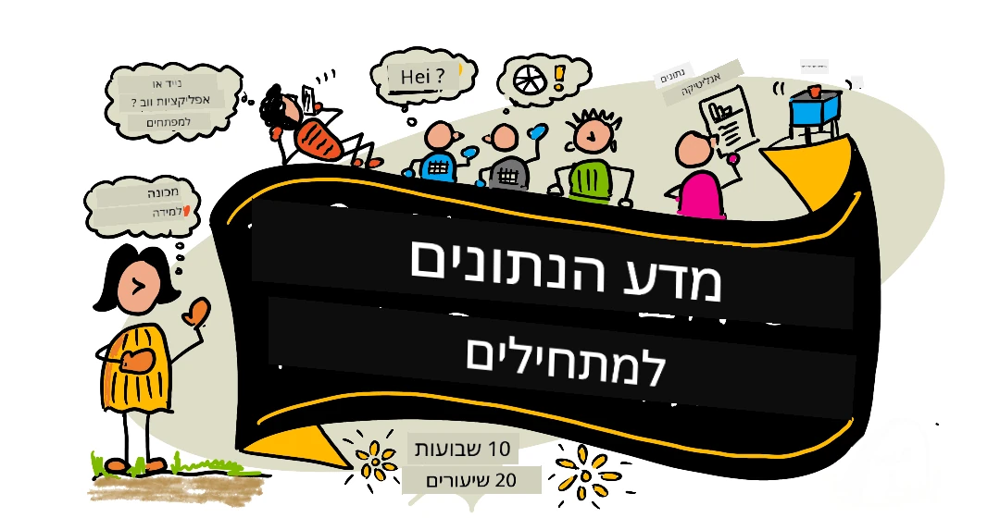
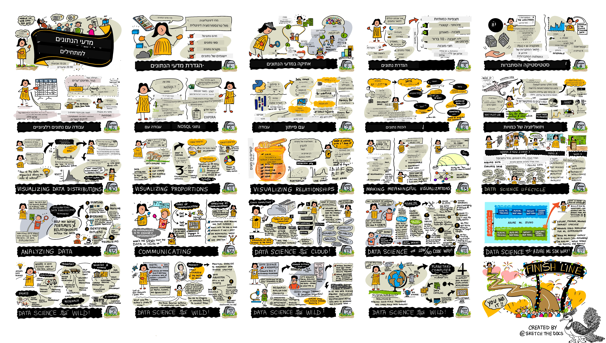

# מדע הנתונים למתחילים - תוכנית לימודים

[](https://github.com/codespaces/new?hide_repo_select=true&ref=main&repo=344191198)

[](https://github.com/microsoft/Data-Science-For-Beginners/blob/master/LICENSE)
[](https://GitHub.com/microsoft/Data-Science-For-Beginners/graphs/contributors/)
[](https://GitHub.com/microsoft/Data-Science-For-Beginners/issues/)
[](https://GitHub.com/microsoft/Data-Science-For-Beginners/pulls/)
[](http://makeapullrequest.com)

[](https://GitHub.com/microsoft/Data-Science-For-Beginners/watchers/)
[](https://GitHub.com/microsoft/Data-Science-For-Beginners/network/)
[](https://GitHub.com/microsoft/Data-Science-For-Beginners/stargazers/)


[](https://discord.gg/nTYy5BXMWG)

[](https://aka.ms/foundry/forum)

מקדמי הענן באזורה של מיקרוסופט שמחים להציע תוכנית לימודים של 10 שבועות, 20 שיעורים העוסקת במדע הנתונים. כל שיעור כולל מבחני לפני ואחרי השיעור, הוראות כתובות להשלמת השיעור, פתרון ותרגיל. פדגוגיית הפרויקטים שלנו מאפשרת לך ללמוד תוך כדי בנייה, דרך מוכחת שכישורים חדשים "נדבקים".

**תודה גדולה לסופרים שלנו:** [Jasmine Greenaway](https://www.twitter.com/paladique), [Dmitry Soshnikov](http://soshnikov.com), [Nitya Narasimhan](https://twitter.com/nitya), [Jalen McGee](https://twitter.com/JalenMcG), [Jen Looper](https://twitter.com/jenlooper), [Maud Levy](https://twitter.com/maudstweets), [Tiffany Souterre](https://twitter.com/TiffanySouterre), [Christopher Harrison](https://www.twitter.com/geektrainer).

**🙏 תודה מיוחדת 🙏 לסופרי, הבוחרי ותורמי התוכן שלנו של [שגרירי הסטודנטים של מיקרוסופט](https://studentambassadors.microsoft.com/),** במיוחד Aaryan Arora, [Aditya Garg](https://github.com/AdityaGarg00), [Alondra Sanchez](https://www.linkedin.com/in/alondra-sanchez-molina/), [Ankita Singh](https://www.linkedin.com/in/ankitasingh007), [Anupam Mishra](https://www.linkedin.com/in/anupam--mishra/), [Arpita Das](https://www.linkedin.com/in/arpitadas01/), ChhailBihari Dubey, [Dibri Nsofor](https://www.linkedin.com/in/dibrinsofor), [Dishita Bhasin](https://www.linkedin.com/in/dishita-bhasin-7065281bb), [Majd Safi](https://www.linkedin.com/in/majd-s/), [Max Blum](https://www.linkedin.com/in/max-blum-6036a1186/), [Miguel Correa](https://www.linkedin.com/in/miguelmque/), [Mohamma Iftekher (Iftu) Ebne Jalal](https://twitter.com/iftu119), [Nawrin Tabassum](https://www.linkedin.com/in/nawrin-tabassum), [Raymond Wangsa Putra](https://www.linkedin.com/in/raymond-wp/), [Rohit Yadav](https://www.linkedin.com/in/rty2423), Samridhi Sharma, [Sanya Sinha](https://www.linkedin.com/mwlite/in/sanya-sinha-13aab1200),
[Sheena Narula](https://www.linkedin.com/in/sheena-narua-n/), [Tauqeer Ahmad](https://www.linkedin.com/in/tauqeerahmad5201/), Yogendrasingh Pawar , [Vidushi Gupta](https://www.linkedin.com/in/vidushi-gupta07/), [Jasleen Sondhi](https://www.linkedin.com/in/jasleen-sondhi/)

||
|:---:|
| מדע הנתונים למתחילים - _סקצ'נוט מאת [@nitya](https://twitter.com/nitya)_ |

### 🌐 תמיכה בריבוי שפות

#### נתמך באמצעות GitHub Action (אוטומטי ותמיד מעודכן)

<!-- CO-OP TRANSLATOR LANGUAGES TABLE START -->
[ערבית](../ar/README.md) | [בנגלית](../bn/README.md) | [בולגרית](../bg/README.md) | [בורמזית (מיאנמר)](../my/README.md) | [סינית (מפושטת)](../zh-CN/README.md) | [סינית (מסורתית, הונג קונג)](../zh-HK/README.md) | [סינית (מסורתית, מקאו)](../zh-MO/README.md) | [סינית (מסורתית, טייוואן)](../zh-TW/README.md) | [קרואטית](../hr/README.md) | [צ'כית](../cs/README.md) | [דנית](../da/README.md) | [הולנדית](../nl/README.md) | [אסטונית](../et/README.md) | [פינית](../fi/README.md) | [צרפתית](../fr/README.md) | [גרמנית](../de/README.md) | [יוונית](../el/README.md) | [עברית](./README.md) | [הינדית](../hi/README.md) | [הונגרית](../hu/README.md) | [אינדונזית](../id/README.md) | [איטלקית](../it/README.md) | [יפנית](../ja/README.md) | [קנאדה](../kn/README.md) | [קמרית](../km/README.md) | [קוריאנית](../ko/README.md) | [ליטאית](../lt/README.md) | [מלאית](../ms/README.md) | [מליאלאם](../ml/README.md) | [מראטי](../mr/README.md) | [נפאלית](../ne/README.md) | [פידג'ין ניגרי](../pcm/README.md) | [נורווגית](../no/README.md) | [פרסית (פארסי)](../fa/README.md) | [פולנית](../pl/README.md) | [פורטוגזית (ברזיל)](../pt-BR/README.md) | [פורטוגזית (פורטוגל)](../pt-PT/README.md) | [פונג'אבי (גורמוכי)](../pa/README.md) | [רומנית](../ro/README.md) | [רוסית](../ru/README.md) | [סרבית (קירילית)](../sr/README.md) | [סלובקית](../sk/README.md) | [סלובנית](../sl/README.md) | [ספרדית](../es/README.md) | [סווהילי](../sw/README.md) | [שוודית](../sv/README.md) | [טגלוג (פיליפינית)](../tl/README.md) | [טמילית](../ta/README.md) | [טלוגו](../te/README.md) | [תאית](../th/README.md) | [טורקית](../tr/README.md) | [אוקראינית](../uk/README.md) | [אורדו](../ur/README.md) | [וייטנאמית](../vi/README.md)

> **עדיף לשכפל מקומית?**
>
> מאגר זה כולל מעל 50 תרגומי שפות, מה שמגדיל משמעותית את גודל ההורדה. כדי לשכפל ללא תרגומים, השתמש ב-sparse checkout:
>
> **Bash / macOS / Linux:**
> ```bash
> git clone --filter=blob:none --sparse https://github.com/microsoft/Data-Science-For-Beginners.git
> cd Data-Science-For-Beginners
> git sparse-checkout set --no-cone '/*' '!translations' '!translated_images'
> ```
>
> **CMD (Windows):**
> ```cmd
> git clone --filter=blob:none --sparse https://github.com/microsoft/Data-Science-For-Beginners.git
> cd Data-Science-For-Beginners
> git sparse-checkout set --no-cone "/*" "!translations" "!translated_images"
> ```
>
> זה נותן לך את כל מה שצריך כדי להשלים את הקורס עם הורדה הרבה יותר מהירה.
<!-- CO-OP TRANSLATOR LANGUAGES TABLE END -->

**אם תרצה שתתמכו בשפות נוספות, הן מצוינות [כאן](https://github.com/Azure/co-op-translator/blob/main/getting_started/supported-languages.md)**

#### הצטרף לקהילה שלנו 
[](https://discord.gg/nTYy5BXMWG)

יש לנו סדרת למידה ב-Discord עם AI שמתמשכת, למד עוד והצטרף אלינו ב-[סדרת למידה עם AI](https://aka.ms/learnwithai/discord) מ-18 עד 30 בספטמבר, 2025. תקבל טיפים וטריקים לשימוש ב-GitHub Copilot למדעי הנתונים.


# אתה סטודנט?

התחל עם המשאבים הבאים:

- [דף מרכז הסטודנטים](https://docs.microsoft.com/en-gb/learn/student-hub?WT.mc_id=academic-77958-bethanycheum) בדף זה, תמצא משאבים למתחילים, חבילות לסטודנטים ואפילו דרכים לקבל שובר חינם לתעודה. זהו דף שתרצה לשמור ולעקוב אחריו מדי פעם מכיוון שאנו מחליפים תוכן לפחות פעם בחודש.
- [שגרירי סטודנטים של מיקרוסופט](https://studentambassadors.microsoft.com?WT.mc_id=academic-77958-bethanycheum) הצטרף לקהילה גלובלית של שגרירים סטודנטים, זו יכולה להיות הכניסה שלך למיקרוסופט.

# התחלה

## 📚 תיעוד

- **[מדריך התקנה](INSTALLATION.md)** - הוראות שלב-אחר-שלב למתחילים
- **[מדריך שימוש](USAGE.md)** - דוגמאות וזרימות עבודה נפוצות
- **[פתרון תקלות](TROUBLESHOOTING.md)** - פתרונות לבעיות נפוצות
- **[מדריך לתרומה](CONTRIBUTING.md)** - כיצד לתרום לפרויקט זה
- **[למורים](for-teachers.md)** - הדרכת הוראה ומשאבים לכיתה

## 👨‍🎓 לסטודנטים
> **מתחילים מוחלטים**: חדשים במדעי הנתונים? התחילו עם [דוגמאות ידידותיות למתחילים](examples/README.md)! דוגמאות פשוטות עם הסברים יעזרו לך להבין את היסודות לפני שתעמיק בתכנית המלאה.
> **[סטודנטים](https://aka.ms/student-page)**: כדי להשתמש בתכנית זו באופן עצמאי, פצל את כל הריפו והשלם את התרגילים לבד, החל במבחן לפני ההרצאה. לאחר מכן קרא את ההרצאה והשלם את שאר הפעילויות. נסה ליצור את הפרויקטים בהבנת השיעורים ולא בהעתקת קוד הפתרון; עם זאת, הקוד זמין בתיקיית /solutions בכל שיעור ממוקד בפרויקט. רעיון נוסף הוא ליצור קבוצת לימוד עם חברים ולעבור את התוכן יחד. ללימוד נוסף, מומלץ להשתמש ב-[Microsoft Learn](https://docs.microsoft.com/en-us/users/jenlooper-2911/collections/qprpajyoy3x0g7?WT.mc_id=academic-77958-bethanycheum).

**התחלה מהירה:**
1. בדוק את [מדריך ההתקנה](INSTALLATION.md) כדי להגדיר את הסביבה שלך
2. עיין ב-[מדריך השימוש](USAGE.md) כדי ללמוד כיצד לעבוד עם התכנית
3. התחל בשיעור 1 ועבור לסדר השיעורים
4. הצטרף ל[קהילת ה-Discord שלנו](https://aka.ms/ds4beginners/discord) לקבלת תמיכה

## 👩‍🏫 למורים
> **מורים**: כללנו [כמה הצעות](for-teachers.md) כיצד להשתמש בתכנית הלימודים הזו. נשמח לקבל את המשוב שלכם [בפורום הדיונים שלנו](https://github.com/microsoft/Data-Science-For-Beginners/discussions)!

## הכירו את הצוות

[](https://youtu.be/8mzavjQSMM4 "וידאו פרומו")

**Gif מאת** [Mohit Jaisal](https://www.linkedin.com/in/mohitjaisal)

> 🎥 לחצו על התמונה למעלה לקבלת וידאו אודות הפרויקט והאנשים שיצרו אותו!

## פדגוגיה

בחרנו בשני עקרונות פדגוגיים בעת בניית תכנית הלימודים הזו: להבטיח שהיא מבוססת פרויקטים וכוללת חידונים תכופים. בסיום הסדרה הזו, הלומדים ילמדו עקרונות בסיסיים במדעי הנתונים, כולל מושגים אתיים, הכנת נתונים, דרכים שונות לעבודה עם נתונים, ויזואליזציית נתונים, ניתוח נתונים, שימושים מעשיים במדעי הנתונים ועוד.

בנוסף, חידון בסיכון נמוך לפני השיעור מגדיר את כוונת הלומד כלפי נושא הלמידה, בעוד שחידון שני לאחר השיעור מבטיח שמירה נוספת של המידע. תכנית הלימודים הזו עוצבה להיות גמישה ומהנה וניתנת ללמידה בשלמותה או בחלקיה. הפרויקטים מתחילים קטנים ומתפתחים למורכבים יותר לקראת סוף מחזור 10 השבועות.

> מצאו את [קוד ההתנהגות שלנו](CODE_OF_CONDUCT.md), [הנחיות לתרומה](CONTRIBUTING.md), [הנחיות לתרגום](TRANSLATIONS.md). נשמח לקבל משוב בונה!

## כל שיעור כולל:

- שרטוט רישומי אופציונלי
- סרטון נוסף אופציונלי
- חידון חימום לפני השיעור
- שיעור כתוב
- עבור שיעורי מבוססי פרויקטים, מדריכים שלב-אחר-שלב לבניית הפרויקט
- בדיקות ידע
- אתגר
- קריאה נוספת
- משימה
- [חידון לאחר השיעור](https://ff-quizzes.netlify.app/en/)

> **הערה לגבי חידונים**: כל החידונים נמצאים בתיקיית Quiz-App, בסה"כ 40 חידונים של שלושה שאלות כל אחד. הם מקושרים מתוך השיעורים, אך ניתן להריץ את אפליקציית החידון מקומית או לפרוס ל-Azure; עקבו אחר ההוראות בתיקיית `quiz-app`. הם מתורגמים בהדרגה.

## 🎓 דוגמאות ידידותיות למתחילים

**חדש במדעי הנתונים?** יצרנו תיקיית [דוגמאות מיוחדת](examples/README.md) עם קוד פשוט ומוסבר היטב שיעזור לכם להתחיל:

- 🌟 **שלום עולם** - תכנית מדעי הנתונים הראשונה שלכם
- 📂 **טעינת נתונים** - ללמוד לקרוא ולחקור מערכי נתונים
- 📊 **ניתוח פשוט** - לחשב סטטיסטיקות ולגלות תבניות
- 📈 **ויזואליזציה בסיסית** - ליצור דיאגרמות וגרפים
- 🔬 **פרויקט מהעולם האמיתי** - זרימת עבודה מלאה מההתחלה ועד הסוף

כל דוגמה כוללת הסברים מפורטים של כל שלב, מה שהופך אותה למושלמת למתחילים מוחלטים!

👉 **[התחילו עם הדוגמאות](examples/README.md)** 👈

## שיעורים


||
|:---:|
| מדעי הנתונים למתחילים: מפת דרכים - _סקצ'נות מאת [@nitya](https://twitter.com/nitya)_ |


| מספר השיעור | נושא | קיבוץ שיעורים | מטרות למידה | שיעור מקושר | מחבר |
| :-----------: | :----------------------------------------: | :--------------------------------------------------: | :-----------------------------------------------------------------------------------------------------------------------------------------------------------------------: | :---------------------------------------------------------------------: | :----: |
| 01 | הגדרת מדעי הנתונים | [הקדמה](1-Introduction/README.md) | ללמוד את העקרונות הבסיסיים מאחורי מדעי הנתונים וכיצד הם קשורים לבינה מלאכותית, למידה חישובית ולנתונים גדולים. | [שיעור](1-Introduction/01-defining-data-science/README.md) [וידאו](https://youtu.be/beZ7Mb_oz9I) | [דמיטרי](http://soshnikov.com) |
| 02 | אתיקה במדעי הנתונים | [הקדמה](1-Introduction/README.md) | מושגי אתיקה, אתגרים ומסגרות עבודה. | [שיעור](1-Introduction/02-ethics/README.md) | [ניטיה](https://twitter.com/nitya) |
| 03 | הגדרת נתונים | [הקדמה](1-Introduction/README.md) | כיצד נתונים מסווגים ומהם המקורות הנפוצים שלהם. | [שיעור](1-Introduction/03-defining-data/README.md) | [ג'סמין](https://www.twitter.com/paladique) |
| 04 | מבוא לסטטיסטיקה והסתברות | [הקדמה](1-Introduction/README.md) | הטכניקות המתמטיות של הסתברות וסטטיסטיקה להבנת הנתונים. | [שיעור](1-Introduction/04-stats-and-probability/README.md) [וידאו](https://youtu.be/Z5Zy85g4Yjw) | [דמיטרי](http://soshnikov.com) |
| 05 | עבודה עם נתונים יחסיים | [עבודה עם נתונים](2-Working-With-Data/README.md) | מבוא לנתונים יחסיים ויסודות חקר וניתוח נתונים יחסיים בשפת SQL (המכונה "סי-קול"). | [שיעור](2-Working-With-Data/05-relational-databases/README.md) | [כריסטופר](https://www.twitter.com/geektrainer) | | |
| 06 | עבודה עם נתוני NoSQL | [עבודה עם נתונים](2-Working-With-Data/README.md) | מבוא לנתונים לא יחסיים, סוגיהם השונים ויסודות חקר וניתוח מסדי מסמכים. | [שיעור](2-Working-With-Data/06-non-relational/README.md) | [ג'סמין](https://twitter.com/paladique)|
| 07 | עבודה עם פייתון | [עבודה עם נתונים](2-Working-With-Data/README.md) | יסודות השימוש בפייתון לחקר נתונים עם ספריות כמו Pandas. מומלץ ידע בסיסי בתכנות פייתון. | [שיעור](2-Working-With-Data/07-python/README.md) [וידאו](https://youtu.be/dZjWOGbsN4Y) | [דמיטרי](http://soshnikov.com) |
| 08 | הכנת נתונים | [עבודה עם נתונים](2-Working-With-Data/README.md) | נושאים בטכניקות ניקוי וטרנספורמציה של נתונים לטיפול באתגרים של נתונים חסרים, לא מדויקים או לא שלמים. | [שיעור](2-Working-With-Data/08-data-preparation/README.md) | [ג'סמין](https://www.twitter.com/paladique) |
| 09 | ויזואליזציה של כמויות | [ויזואליזציה של נתונים](3-Data-Visualization/README.md) | למדו כיצד להשתמש ב-Matplotlib לויזואליזציית נתוני ציפורים 🦆 | [שיעור](3-Data-Visualization/09-visualization-quantities/README.md) | [ג'ן](https://twitter.com/jenlooper) |
| 10 | ויזואליזציה של התפלגויות נתונים | [ויזואליזציה של נתונים](3-Data-Visualization/README.md) | ויזואליזציה של תצפיות ומגמות בטווח מסוים. | [שיעור](3-Data-Visualization/10-visualization-distributions/README.md) | [ג'ן](https://twitter.com/jenlooper) |
| 11 | ויזואליזציה של יחסים | [ויזואליזציה של נתונים](3-Data-Visualization/README.md) | ויזואליזציה של אחוזים בדידים ומקובצים. | [שיעור](3-Data-Visualization/11-visualization-proportions/README.md) | [ג'ן](https://twitter.com/jenlooper) |
| 12 | ויזואליזציה של קשרים | [ויזואליזציה של נתונים](3-Data-Visualization/README.md) | ויזואליזציה של קשרים וקורלציות בין מערכי נתונים ומשתנים שלהם. | [שיעור](3-Data-Visualization/12-visualization-relationships/README.md) | [ג'ן](https://twitter.com/jenlooper) |
| 13 | ויזואליזציות משמעותיות | [ויזואליזציה של נתונים](3-Data-Visualization/README.md) | טכניקות והנחיות לעשיית הוויזואליזציות שלכם בעלות ערך לפתרון בעיות יעיל ותובנות. | [שיעור](3-Data-Visualization/13-meaningful-visualizations/README.md) | [ג'ן](https://twitter.com/jenlooper) |
| 14 | מבוא למחזור החיים של מדעי הנתונים | [מחזור חיים](4-Data-Science-Lifecycle/README.md) | מבוא למחזור החיים של מדעי הנתונים ושלב האיסוף והפ استخراج הנתונים. | [שיעור](4-Data-Science-Lifecycle/14-Introduction/README.md) | [ג'סמין](https://twitter.com/paladique) |
| 15 | ניתוח | [מחזור חיים](4-Data-Science-Lifecycle/README.md) | שלב במחזור החיים של מדעי הנתונים שמתמקד בטכניקות לניתוח נתונים. | [שיעור](4-Data-Science-Lifecycle/15-analyzing/README.md) | [ג'סמין](https://twitter.com/paladique) | | |
| 16 | תקשורת | [מחזור חיים](4-Data-Science-Lifecycle/README.md) | שלב במחזור החיים של מדעי הנתונים שמתמקד בהצגת התובנות מהנתונים באופן שמקל על מקבלי ההחלטות להבין. | [שיעור](4-Data-Science-Lifecycle/16-communication/README.md) | [ג'יילן](https://twitter.com/JalenMcG) | | |
| 17 | מדעי הנתונים בענן | [נתוני ענן](5-Data-Science-In-Cloud/README.md) | סדרת שיעורים זו מציגה את מדעי הנתונים בענן ואת יתרונותיו. | [שיעור](5-Data-Science-In-Cloud/17-Introduction/README.md) | [טיפאני](https://twitter.com/TiffanySouterre) ו-[מוד](https://twitter.com/maudstweets) |
| 18 | מדעי הנתונים בענן | [נתוני ענן](5-Data-Science-In-Cloud/README.md) | אימון מודלים באמצעות כלים עם קוד מועט. |[שיעור](5-Data-Science-In-Cloud/18-Low-Code/README.md) | [טיפאני](https://twitter.com/TiffanySouterre) ו-[מוד](https://twitter.com/maudstweets) |
| 19 | מדעי הנתונים בענן | [נתוני ענן](5-Data-Science-In-Cloud/README.md) | פריסת מודלים עם Azure Machine Learning Studio. | [שיעור](5-Data-Science-In-Cloud/19-Azure/README.md)| [טיפאני](https://twitter.com/TiffanySouterre) ו-[מוד](https://twitter.com/maudstweets) |
| 20 | מדעי הנתונים בטבע | [בטבע](6-Data-Science-In-Wild/README.md) | פרויקטים מבוססי מדעי הנתונים בעולם האמיתי. | [שיעור](6-Data-Science-In-Wild/20-Real-World-Examples/README.md) | [ניטיה](https://twitter.com/nitya) |

## GitHub Codespaces

עקבו אחר השלבים הבאים כדי לפתוח דוגמה זו ב-Codespace:
1. לחצו על תפריט הנפתח Code ובחרו באפשרות Open with Codespaces.
2. בחרו + New codespace בתחתית החלון.
למידע נוסף, עיינו ב-[תיעוד GitHub](https://docs.github.com/en/codespaces/developing-in-codespaces/creating-a-codespace-for-a-repository#creating-a-codespace).

## VSCode Remote - Containers

עקבו אחר השלבים הבאים כדי לפתוח את המאגר הזה במיכל באמצעות המחשב המקומי ו-VSCode באמצעות תוסף VS Code Remote - Containers:

1. אם זו הפעם הראשונה שאתם משתמשים במיכל פיתוח, אנא ודאו שהמערכת שלכם עומדת בדרישות המקדימות (למשל התקנת Docker) ב-[תיעוד התחלה](https://code.visualstudio.com/docs/devcontainers/containers#_getting-started).

כדי להשתמש במאגר זה, ניתן לפתוח את המאגר בנפח Docker מבודד:

**הערה**: בפועל, פעולה זו תשתמש בפקודת Remote-Containers: **Clone Repository in Container Volume...** לשכפל את קוד המקור בנפח Docker במקום במערכת הקבצים המקומית. [Volums](https://docs.docker.com/storage/volumes/) הם המנגנון המועדף לשימור נתוני מיכלים.

או לפתוח עותק משוכפל או שהורד מקומית של המאגר:

- שכפלו את המאגר למערכת הקבצים המקומית שלכם.
- לחצו F1 ובחרו את הפקודה **Remote-Containers: Open Folder in Container...**.
- בחרו את העתיק המשוכפל של תיקיה זו, המתינו שהמיכל יתחיל ונסו.

## גישה לא מקוונת

ניתן להפעיל תיעוד זה במצב לא מקוון באמצעות [Docsify](https://docsify.js.org/#/). צרו עותק של מאגר זה, [התקינו את Docsify](https://docsify.js.org/#/quickstart) על המחשב המקומי, ואז בתיקיית השורש של המאגר הקלידו `docsify serve`. האתר ישרת בכתובת port 3000 ב-localhost שלכם: `localhost:3000`.

> שימו לב, פנקסי הרשומות לא יוצגו ב-Docsify, אז כשאתם צריכים להריץ פנקס רשומות, עשו זאת בנפרד ב-VS Code עם ליבת Python.

## תכניות לימוד נוספות

הצוות שלנו מייצר תכניות לימוד נוספות! עיינו ב:

<!-- CO-OP TRANSLATOR OTHER COURSES START -->
### LangChain
[](https://aka.ms/langchain4j-for-beginners)
[](https://aka.ms/langchainjs-for-beginners?WT.mc_id=m365-94501-dwahlin)
[](https://github.com/microsoft/langchain-for-beginners?WT.mc_id=m365-94501-dwahlin)
---

### Azure / Edge / MCP / סוכנים
[](https://github.com/microsoft/AZD-for-beginners?WT.mc_id=academic-105485-koreyst)
[](https://github.com/microsoft/edgeai-for-beginners?WT.mc_id=academic-105485-koreyst)
[](https://github.com/microsoft/mcp-for-beginners?WT.mc_id=academic-105485-koreyst)
[](https://github.com/microsoft/ai-agents-for-beginners?WT.mc_id=academic-105485-koreyst)

---
 
### סדרת Generative AI
[](https://github.com/microsoft/generative-ai-for-beginners?WT.mc_id=academic-105485-koreyst)
[-9333EA?style=for-the-badge&labelColor=E5E7EB&color=9333EA)](https://github.com/microsoft/Generative-AI-for-beginners-dotnet?WT.mc_id=academic-105485-koreyst)
[-C084FC?style=for-the-badge&labelColor=E5E7EB&color=C084FC)](https://github.com/microsoft/generative-ai-for-beginners-java?WT.mc_id=academic-105485-koreyst)
[-E879F9?style=for-the-badge&labelColor=E5E7EB&color=E879F9)](https://github.com/microsoft/generative-ai-with-javascript?WT.mc_id=academic-105485-koreyst)

---
 
### ליבה ללמידה
[](https://aka.ms/ml-beginners?WT.mc_id=academic-105485-koreyst)
[](https://aka.ms/datascience-beginners?WT.mc_id=academic-105485-koreyst)
[](https://aka.ms/ai-beginners?WT.mc_id=academic-105485-koreyst)
[](https://github.com/microsoft/Security-101?WT.mc_id=academic-96948-sayoung)
[](https://aka.ms/webdev-beginners?WT.mc_id=academic-105485-koreyst)
[](https://aka.ms/iot-beginners?WT.mc_id=academic-105485-koreyst)
[](https://github.com/microsoft/xr-development-for-beginners?WT.mc_id=academic-105485-koreyst)

---
 
### סדרת Copilot
[](https://aka.ms/GitHubCopilotAI?WT.mc_id=academic-105485-koreyst)
[](https://github.com/microsoft/mastering-github-copilot-for-dotnet-csharp-developers?WT.mc_id=academic-105485-koreyst)
[](https://github.com/microsoft/CopilotAdventures?WT.mc_id=academic-105485-koreyst)
<!-- CO-OP TRANSLATOR OTHER COURSES END -->

## קבלת עזרה

**מתקשים?** בדקו את [מדריך פתרון בעיות](TROUBLESHOOTING.md) שלנו לפתרונות לבעיות נפוצות.

אם אתם תקועים או יש לכם שאלות בנוגע לבניית אפליקציות AI. הצטרפו ללומדים אחרים ומפתחים מנוסים בדיונים על MCP. זוהי קהילה תומכת שבה שאלות מתקבלות בברכה וידע משתף בחופשיות.

[](https://discord.gg/nTYy5BXMWG)

אם יש לכם משוב על המוצר או שגיאות בזמן בנייה בקרו ב:

[](https://aka.ms/foundry/forum)

---

<!-- CO-OP TRANSLATOR DISCLAIMER START -->
**כתב ויתור**:  
מסמך זה תורגם באמצעות שירות התרגום בינה מלאכותית [Co-op Translator](https://github.com/Azure/co-op-translator). למרות שאנו שואפים לדיוק, יש לקחת בחשבון כי תרגומים אוטומטיים עשויים להכיל שגיאות או אי-דיוקים. המסמך המקורי בשפתו המקורית נחשב למקור הסמכותי. למידע קריטי מומלץ ביצוע תרגום מקצועי על ידי אדם. איננו נושאים באחריות על כל הבנה שגויה או פרשנות לא נכונה הנובעת משימוש בתרגום זה.
<!-- CO-OP TRANSLATOR DISCLAIMER END -->