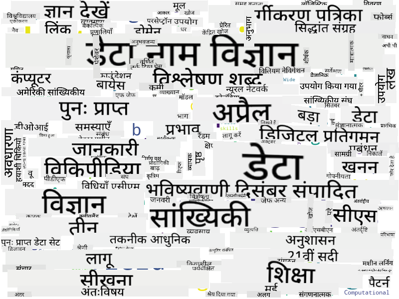

<!--
CO_OP_TRANSLATOR_METADATA:
{
  "original_hash": "8141e7195841682914be03ef930fe43d",
  "translation_date": "2025-09-03T20:07:34+00:00",
  "source_file": "1-Introduction/01-defining-data-science/README.md",
  "language_code": "hi"
}
-->
## डेटा के प्रकार

जैसा कि हमने पहले ही उल्लेख किया है, डेटा हर जगह है। हमें इसे सही तरीके से कैप्चर करने की आवश्यकता है! यह **संरचित** और **असंरचित** डेटा के बीच अंतर करना उपयोगी है। संरचित डेटा आमतौर पर किसी सुव्यवस्थित रूप में प्रस्तुत किया जाता है, अक्सर एक टेबल या कई टेबल के रूप में, जबकि असंरचित डेटा केवल फाइलों का संग्रह होता है। कभी-कभी हम **अर्ध-संरचित** डेटा के बारे में भी बात कर सकते हैं, जिसमें कुछ प्रकार की संरचना होती है जो काफी भिन्न हो सकती है।

| संरचित                                                                     | अर्ध-संरचित                                                                                  | असंरचित                              |
| -------------------------------------------------------------------------- | -------------------------------------------------------------------------------------------- | ------------------------------------ |
| लोगों की सूची उनके फोन नंबर के साथ                                         | विकिपीडिया पेज जिनमें लिंक हैं                                                                | एनसाइक्लोपीडिया ब्रिटानिका का पाठ  |
| पिछले 20 वर्षों में हर मिनट में एक इमारत के सभी कमरों का तापमान             | JSON प्रारूप में वैज्ञानिक पत्रों का संग्रह जिसमें लेखक, प्रकाशन की तारीख और सारांश शामिल हैं | कॉर्पोरेट दस्तावेजों के साथ फाइल शेयर |
| इमारत में प्रवेश करने वाले सभी लोगों की उम्र और लिंग का डेटा               | इंटरनेट पेज                                                                                  | निगरानी कैमरे से कच्चा वीडियो फीड  |

## डेटा कहां से प्राप्त करें

डेटा के कई संभावित स्रोत हैं, और उन्हें सभी को सूचीबद्ध करना असंभव होगा! हालांकि, आइए कुछ सामान्य स्थानों का उल्लेख करें जहां से आप डेटा प्राप्त कर सकते हैं:

* **संरचित**
  - **इंटरनेट ऑफ थिंग्स** (IoT), जिसमें विभिन्न सेंसर जैसे तापमान या दबाव सेंसर से डेटा शामिल है, बहुत उपयोगी डेटा प्रदान करता है। उदाहरण के लिए, यदि किसी कार्यालय भवन में IoT सेंसर लगे हैं, तो हम लागत को कम करने के लिए स्वचालित रूप से हीटिंग और लाइटिंग को नियंत्रित कर सकते हैं।
  - **सर्वेक्षण**, जो हम उपयोगकर्ताओं से खरीदारी के बाद या वेबसाइट पर जाने के बाद पूरा करने के लिए कहते हैं।
  - **व्यवहार का विश्लेषण** हमें यह समझने में मदद कर सकता है कि उपयोगकर्ता साइट में कितनी गहराई तक जाते हैं और साइट छोड़ने का सामान्य कारण क्या है।
* **असंरचित**
  - **पाठ** समग्र **भावना स्कोर** जैसे अंतर्दृष्टि प्रदान कर सकता है, या कीवर्ड और अर्थ निकालने में मदद कर सकता है।
  - **छवियां** या **वीडियो**। निगरानी कैमरे से वीडियो का उपयोग सड़क पर यातायात का अनुमान लगाने और संभावित ट्रैफिक जाम के बारे में लोगों को सूचित करने के लिए किया जा सकता है।
  - वेब सर्वर **लॉग्स** का उपयोग यह समझने के लिए किया जा सकता है कि हमारी साइट के कौन से पेज सबसे अधिक बार देखे जाते हैं और कितनी देर तक।
* अर्ध-संरचित
  - **सोशल नेटवर्क** ग्राफ उपयोगकर्ता व्यक्तित्व और जानकारी फैलाने में संभावित प्रभावशीलता के बारे में डेटा के लिए शानदार स्रोत हो सकते हैं।
  - जब हमारे पास पार्टी से तस्वीरों का संग्रह होता है, तो हम **समूह गतिशीलता** डेटा निकालने की कोशिश कर सकते हैं, जैसे कि लोगों के बीच तस्वीरें लेने का ग्राफ बनाना।

विभिन्न संभावित डेटा स्रोतों को जानकर, आप विभिन्न परिदृश्यों के बारे में सोच सकते हैं जहां डेटा विज्ञान तकनीकों का उपयोग स्थिति को बेहतर तरीके से समझने और व्यावसायिक प्रक्रियाओं में सुधार करने के लिए किया जा सकता है।

## डेटा के साथ आप क्या कर सकते हैं

डेटा विज्ञान में, हम डेटा यात्रा के निम्नलिखित चरणों पर ध्यान केंद्रित करते हैं:

## डिजिटलीकरण और डिजिटल परिवर्तन

पिछले दशक में, कई व्यवसायों ने यह समझना शुरू किया कि व्यावसायिक निर्णय लेने में डेटा कितना महत्वपूर्ण है। व्यवसाय चलाने के लिए डेटा विज्ञान के सिद्धांतों को लागू करने के लिए, सबसे पहले कुछ डेटा एकत्र करना आवश्यक है, यानी व्यावसायिक प्रक्रियाओं को डिजिटल रूप में अनुवाद करना। इसे **डिजिटलीकरण** कहा जाता है। इस डेटा पर डेटा विज्ञान तकनीकों को लागू करना और निर्णयों को मार्गदर्शन करना उत्पादकता में महत्वपूर्ण वृद्धि (या यहां तक कि व्यवसाय में बदलाव) ला सकता है, जिसे **डिजिटल परिवर्तन** कहा जाता है।

आइए एक उदाहरण पर विचार करें। मान लीजिए कि हमारे पास एक डेटा विज्ञान पाठ्यक्रम है (जैसे यह पाठ्यक्रम) जिसे हम छात्रों को ऑनलाइन प्रदान करते हैं, और हम इसे बेहतर बनाने के लिए डेटा विज्ञान का उपयोग करना चाहते हैं। हम इसे कैसे कर सकते हैं?

हम "क्या डिजिटलीकृत किया जा सकता है?" पूछकर शुरू कर सकते हैं। सबसे सरल तरीका यह होगा कि प्रत्येक छात्र को प्रत्येक मॉड्यूल पूरा करने में लगने वाले समय को मापा जाए और प्रत्येक मॉड्यूल के अंत में एक बहुविकल्पीय परीक्षण देकर प्राप्त ज्ञान को मापा जाए। सभी छात्रों के बीच औसत समय-से-पूर्ण को मापकर, हम यह पता लगा सकते हैं कि कौन से मॉड्यूल छात्रों के लिए सबसे अधिक कठिनाई पैदा करते हैं और उन्हें सरल बनाने पर काम कर सकते हैं।
आप यह तर्क दे सकते हैं कि यह तरीका आदर्श नहीं है, क्योंकि मॉड्यूल्स की लंबाई अलग-अलग हो सकती है। शायद समय को मॉड्यूल की लंबाई (अक्षरों की संख्या में) के आधार पर विभाजित करना और उन मानों की तुलना करना अधिक उचित होगा।
जब हम बहुविकल्पीय परीक्षाओं के परिणामों का विश्लेषण शुरू करते हैं, तो हम यह पता लगाने की कोशिश कर सकते हैं कि छात्र किन अवधारणाओं को समझने में कठिनाई महसूस करते हैं, और उस जानकारी का उपयोग सामग्री को बेहतर बनाने के लिए कर सकते हैं। ऐसा करने के लिए, हमें परीक्षाओं को इस तरह से डिज़ाइन करना होगा कि प्रत्येक प्रश्न किसी विशेष अवधारणा या ज्ञान के हिस्से से जुड़ा हो।

अगर हम इसे और अधिक जटिल बनाना चाहें, तो हम प्रत्येक मॉड्यूल में लगने वाले समय को छात्रों की आयु श्रेणी के साथ तुलना कर सकते हैं। हमें यह पता चल सकता है कि कुछ आयु श्रेणियों के लिए मॉड्यूल पूरा करने में अनुचित रूप से अधिक समय लगता है, या छात्र इसे पूरा करने से पहले ही छोड़ देते हैं। यह हमें मॉड्यूल के लिए आयु अनुशंसाएँ प्रदान करने में मदद कर सकता है और गलत अपेक्षाओं के कारण होने वाली असंतुष्टि को कम कर सकता है।

## 🚀 चुनौती

इस चुनौती में, हम डेटा साइंस के क्षेत्र से संबंधित अवधारणाओं को खोजने की कोशिश करेंगे, और इसके लिए हम पाठों का विश्लेषण करेंगे। हम डेटा साइंस पर एक विकिपीडिया लेख लेंगे, पाठ को डाउनलोड और प्रोसेस करेंगे, और फिर एक वर्ड क्लाउड बनाएंगे, जैसा कि नीचे दिखाया गया है:

[`notebook.ipynb`](../../../../../../../../../1-Introduction/01-defining-data-science/notebook.ipynb ':ignore') पर जाएं और कोड को पढ़ें। आप कोड को चला भी सकते हैं और देख सकते हैं कि यह वास्तविक समय में सभी डेटा ट्रांसफॉर्मेशन कैसे करता है।

> अगर आपको पता नहीं है कि जुपिटर नोटबुक में कोड कैसे चलाना है, तो [इस लेख](https://soshnikov.com/education/how-to-execute-notebooks-from-github/) को देखें।

## [पोस्ट-लेक्चर क्विज़](https://ff-quizzes.netlify.app/en/ds/)

## असाइनमेंट्स

* **कार्य 1**: ऊपर दिए गए कोड को संशोधित करें ताकि **बिग डेटा** और **मशीन लर्निंग** के क्षेत्रों के लिए संबंधित अवधारणाओं का पता लगाया जा सके।
* **कार्य 2**: [डेटा साइंस परिदृश्यों के बारे में सोचें](assignment.md)

## क्रेडिट्स

यह पाठ [Dmitry Soshnikov](http://soshnikov.com) द्वारा ♥️ के साथ लिखा गया है।

---

**अस्वीकरण**:  
यह दस्तावेज़ AI अनुवाद सेवा [Co-op Translator](https://github.com/Azure/co-op-translator) का उपयोग करके अनुवादित किया गया है। जबकि हम सटीकता सुनिश्चित करने का प्रयास करते हैं, कृपया ध्यान दें कि स्वचालित अनुवाद में त्रुटियां या अशुद्धियां हो सकती हैं। मूल भाषा में उपलब्ध मूल दस्तावेज़ को प्रामाणिक स्रोत माना जाना चाहिए। महत्वपूर्ण जानकारी के लिए, पेशेवर मानव अनुवाद की सिफारिश की जाती है। इस अनुवाद के उपयोग से उत्पन्न किसी भी गलतफहमी या गलत व्याख्या के लिए हम जिम्मेदार नहीं हैं।