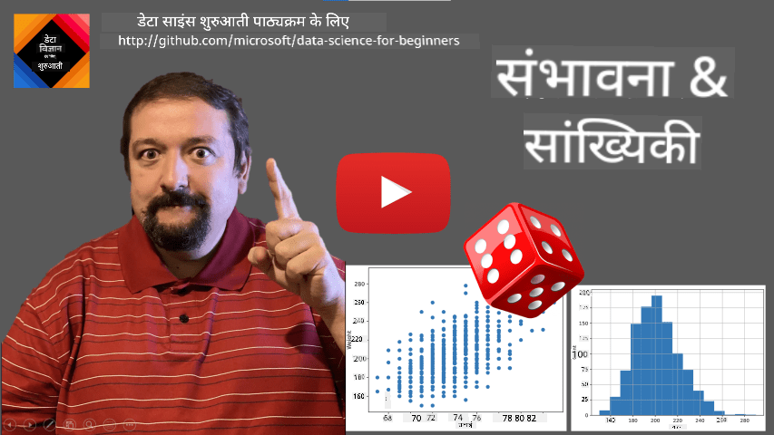
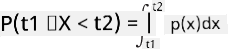
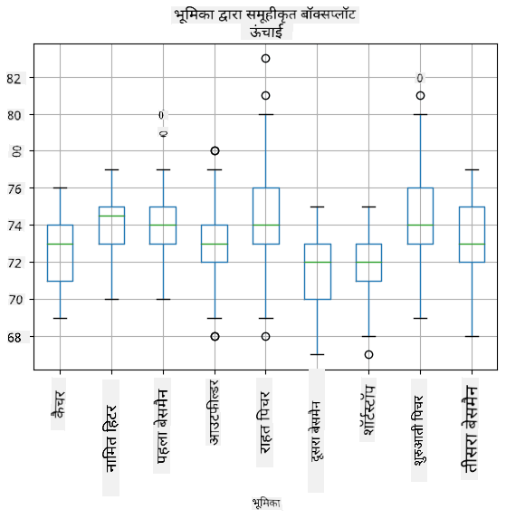
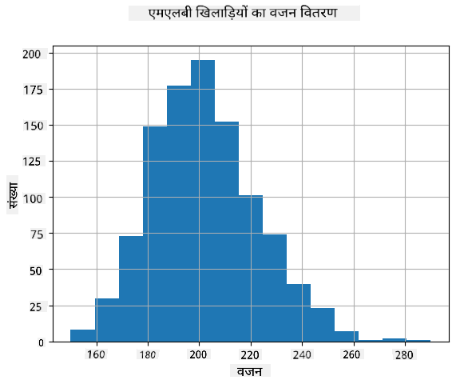
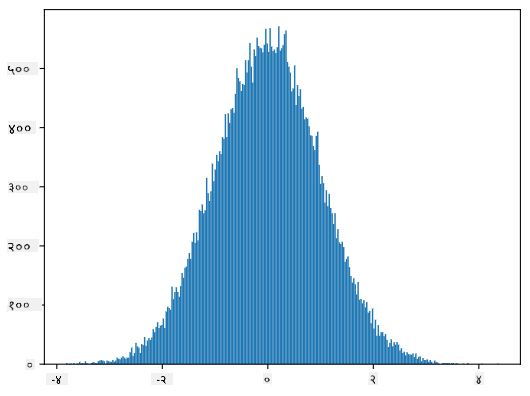
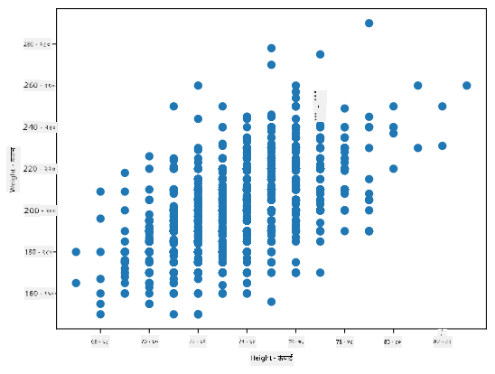

<!--
CO_OP_TRANSLATOR_METADATA:
{
  "original_hash": "8bbb3fa0d4ad61384a3b4b5f7560226f",
  "translation_date": "2025-09-04T15:04:23+00:00",
  "source_file": "1-Introduction/04-stats-and-probability/README.md",
  "language_code": "hi"
}
-->
# सांख्यिकी और संभाव्यता का संक्षिप्त परिचय

| ](../../sketchnotes/04-Statistics-Probability.png)|
|:---:|
| सांख्यिकी और संभाव्यता - _Sketchnote by [@nitya](https://twitter.com/nitya)_ |

सांख्यिकी और संभाव्यता सिद्धांत गणित के दो अत्यधिक संबंधित क्षेत्र हैं, जो डेटा विज्ञान के लिए बहुत प्रासंगिक हैं। बिना गहन गणितीय ज्ञान के डेटा के साथ काम करना संभव है, लेकिन कुछ बुनियादी अवधारणाओं को जानना हमेशा बेहतर होता है। यहां हम एक संक्षिप्त परिचय प्रस्तुत करेंगे जो आपको शुरुआत करने में मदद करेगा।

[](https://youtu.be/Z5Zy85g4Yjw)

## [प्री-लेक्चर क्विज़](https://purple-hill-04aebfb03.1.azurestaticapps.net/quiz/6)

## संभाव्यता और रैंडम वेरिएबल्स

**संभाव्यता** 0 और 1 के बीच की एक संख्या है, जो किसी **घटना** के होने की संभावना को व्यक्त करती है। इसे सकारात्मक परिणामों की संख्या (जो घटना की ओर ले जाते हैं) को कुल परिणामों की संख्या से विभाजित करके परिभाषित किया जाता है, यह मानते हुए कि सभी परिणाम समान रूप से संभावित हैं। उदाहरण के लिए, जब हम एक पासा फेंकते हैं, तो एक सम संख्या प्राप्त करने की संभावना 3/6 = 0.5 है।

जब हम घटनाओं के बारे में बात करते हैं, तो हम **रैंडम वेरिएबल्स** का उपयोग करते हैं। उदाहरण के लिए, पासा फेंकने पर प्राप्त संख्या का प्रतिनिधित्व करने वाला रैंडम वेरिएबल 1 से 6 तक के मान लेगा। 1 से 6 तक की संख्या का सेट **सैंपल स्पेस** कहलाता है। हम रैंडम वेरिएबल के किसी निश्चित मान लेने की संभावना के बारे में बात कर सकते हैं, जैसे P(X=3)=1/6।

पिछले उदाहरण में रैंडम वेरिएबल को **डिस्क्रीट** कहा जाता है, क्योंकि इसका सैंपल स्पेस गिनने योग्य है, यानी अलग-अलग मान हैं जिन्हें सूचीबद्ध किया जा सकता है। ऐसे मामले भी होते हैं जब सैंपल स्पेस वास्तविक संख्याओं की एक सीमा या पूरे वास्तविक संख्याओं का सेट होता है। ऐसे वेरिएबल्स को **कंटीन्यस** कहा जाता है। एक अच्छा उदाहरण है बस के आने का समय।

## संभाव्यता वितरण

डिस्क्रीट रैंडम वेरिएबल्स के मामले में, प्रत्येक घटना की संभावना को एक फ़ंक्शन P(X) द्वारा वर्णित करना आसान है। सैंपल स्पेस *S* से प्रत्येक मान *s* के लिए यह 0 से 1 तक की संख्या देगा, ताकि सभी घटनाओं के लिए P(X=s) के सभी मानों का योग 1 हो।

सबसे प्रसिद्ध डिस्क्रीट वितरण **यूनिफॉर्म वितरण** है, जिसमें N तत्वों का सैंपल स्पेस होता है, और प्रत्येक के लिए समान संभावना 1/N होती है।

कंटीन्यस वेरिएबल के संभाव्यता वितरण का वर्णन करना अधिक कठिन है, जिसमें मान [a,b] के कुछ अंतराल या पूरे वास्तविक संख्याओं ℝ से लिए जाते हैं। बस के आने के समय के मामले पर विचार करें। वास्तव में, प्रत्येक सटीक समय *t* पर बस के आने की संभावना 0 है!

> अब आप जानते हैं कि 0 संभावना वाली घटनाएं होती हैं, और बहुत बार होती हैं! कम से कम हर बार जब बस आती है!

हम केवल वेरिएबल के किसी दिए गए मानों के अंतराल में गिरने की संभावना के बारे में बात कर सकते हैं, जैसे P(t<sub>1</sub>≤X<t<sub>2</sub>)। इस मामले में, संभाव्यता वितरण को **संभाव्यता घनत्व फ़ंक्शन** p(x) द्वारा वर्णित किया जाता है, ताकि



यूनिफॉर्म वितरण का कंटीन्यस एनालॉग **कंटीन्यस यूनिफॉर्म** कहलाता है, जो एक सीमित अंतराल पर परिभाषित होता है। संभावना कि मान X लंबाई l के अंतराल में गिरता है, l के अनुपात में होती है, और 1 तक बढ़ती है।

एक अन्य महत्वपूर्ण वितरण **नॉर्मल वितरण** है, जिसके बारे में हम नीचे अधिक विस्तार से चर्चा करेंगे।

## माध्य, विचलन और मानक विचलन

मान लें कि हम रैंडम वेरिएबल X के n नमूनों का अनुक्रम बनाते हैं: x<sub>1</sub>, x<sub>2</sub>, ..., x<sub>n</sub>। हम अनुक्रम के **माध्य** (या **गणितीय औसत**) मान को पारंपरिक तरीके से परिभाषित कर सकते हैं: (x<sub>1</sub>+x<sub>2</sub>+x<sub>n</sub>)/n। जैसे-जैसे हम नमूने का आकार बढ़ाते हैं (यानी n→∞ की सीमा लेते हैं), हम वितरण का माध्य (जिसे **अपेक्षा** भी कहा जाता है) प्राप्त करेंगे। हम अपेक्षा को **E**(x) द्वारा दर्शाएंगे।

> यह प्रदर्शित किया जा सकता है कि किसी भी डिस्क्रीट वितरण के लिए, जिसमें मान {x<sub>1</sub>, x<sub>2</sub>, ..., x<sub>N</sub>} और संबंधित संभावनाएं p<sub>1</sub>, p<sub>2</sub>, ..., p<sub>N</sub> हैं, अपेक्षा E(X)=x<sub>1</sub>p<sub>1</sub>+x<sub>2</sub>p<sub>2</sub>+...+x<sub>N</sub>p<sub>N</sub> के बराबर होगी।

यह पहचानने के लिए कि मान कितने दूर तक फैले हुए हैं, हम विचलन σ<sup>2</sup> = ∑(x<sub>i</sub> - μ)<sup>2</sup>/n की गणना कर सकते हैं, जहां μ अनुक्रम का माध्य है। मान σ को **मानक विचलन** कहा जाता है, और σ<sup>2</sup> को **विचलन** कहा जाता है।

## मोड, माध्यिका और क्वारटाइल्स

कभी-कभी, माध्य डेटा के "सामान्य" मान को पर्याप्त रूप से प्रतिनिधित्व नहीं करता। उदाहरण के लिए, जब कुछ चरम मान होते हैं जो पूरी तरह से सीमा से बाहर होते हैं, तो वे माध्य को प्रभावित कर सकते हैं। एक अन्य अच्छा संकेतक **माध्यिका** है, एक ऐसा मान जिसके नीचे आधे डेटा पॉइंट होते हैं, और आधे - ऊपर।

डेटा के वितरण को समझने में मदद करने के लिए, **क्वारटाइल्स** के बारे में बात करना उपयोगी है:

* पहला क्वारटाइल, या Q1, एक ऐसा मान है, जिसके नीचे 25% डेटा आता है
* तीसरा क्वारटाइल, या Q3, एक ऐसा मान है, जिसके नीचे 75% डेटा आता है

ग्राफ़िक रूप से हम माध्यिका और क्वारटाइल्स के बीच संबंध को **बॉक्स प्लॉट** नामक एक आरेख में प्रस्तुत कर सकते हैं:


यहां हम **इंटर-क्वारटाइल रेंज** IQR=Q3-Q1 की भी गणना करते हैं, और तथाकथित **आउटलायर्स** - मान, जो सीमाओं [Q1-1.5*IQR,Q3+1.5*IQR] के बाहर होते हैं।

यदि वितरण में संभावित मानों की संख्या कम है, तो एक अच्छा "सामान्य" मान वह होता है जो सबसे अधिक बार दिखाई देता है, जिसे **मोड** कहा जाता है। इसे अक्सर श्रेणीबद्ध डेटा, जैसे रंगों पर लागू किया जाता है। मान लें कि हमारे पास दो समूह हैं - कुछ लोग जो लाल रंग को पसंद करते हैं, और अन्य जो नीले रंग को पसंद करते हैं। यदि हम रंगों को संख्याओं द्वारा कोड करते हैं, तो पसंदीदा रंग के लिए माध्य मान कहीं नारंगी-हरे स्पेक्ट्रम में होगा, जो किसी भी समूह की वास्तविक पसंद को इंगित नहीं करता। हालांकि, मोड या तो एक रंग होगा, या दोनों रंग, यदि उनके लिए वोट करने वाले लोगों की संख्या समान है (इस मामले में हम नमूने को **मल्टीमोडल** कहते हैं)।

## वास्तविक दुनिया का डेटा

जब हम वास्तविक जीवन के डेटा का विश्लेषण करते हैं, तो वे अक्सर रैंडम वेरिएबल्स के रूप में नहीं होते हैं, इस अर्थ में कि हम अज्ञात परिणामों के साथ प्रयोग नहीं करते। उदाहरण के लिए, बेसबॉल खिलाड़ियों की एक टीम पर विचार करें, और उनके शरीर के डेटा, जैसे ऊंचाई, वजन और उम्र। ये संख्याएं पूरी तरह से रैंडम नहीं हैं, लेकिन हम अभी भी उन्हीं गणितीय अवधारणाओं को लागू कर सकते हैं। उदाहरण के लिए, लोगों के वजन का अनुक्रम कुछ रैंडम वेरिएबल से लिए गए मानों का अनुक्रम माना जा सकता है। नीचे [मेजर लीग बेसबॉल](http://mlb.mlb.com/index.jsp) के वास्तविक बेसबॉल खिलाड़ियों के वजन का अनुक्रम है, जो [इस डेटासेट](http://wiki.stat.ucla.edu/socr/index.php/SOCR_Data_MLB_HeightsWeights) से लिया गया है (आपकी सुविधा के लिए, केवल पहले 20 मान दिखाए गए हैं):

```
[180.0, 215.0, 210.0, 210.0, 188.0, 176.0, 209.0, 200.0, 231.0, 180.0, 188.0, 180.0, 185.0, 160.0, 180.0, 185.0, 197.0, 189.0, 185.0, 219.0]
```

> **Note**: इस डेटासेट के साथ काम करने के उदाहरण को देखने के लिए, [संबंधित नोटबुक](notebook.ipynb) देखें। इस पाठ में कई चुनौतियां भी हैं, और आप उस नोटबुक में कुछ कोड जोड़कर उन्हें पूरा कर सकते हैं। यदि आप डेटा पर काम करने के तरीके के बारे में सुनिश्चित नहीं हैं, तो चिंता न करें - हम बाद में Python का उपयोग करके डेटा पर काम करने पर वापस आएंगे। यदि आप Jupyter Notebook में कोड चलाने का तरीका नहीं जानते हैं, तो [इस लेख](https://soshnikov.com/education/how-to-execute-notebooks-from-github/) को देखें।

यहां हमारे डेटा के लिए माध्य, माध्यिका और क्वारटाइल्स दिखाने वाला बॉक्स प्लॉट है:


चूंकि हमारे डेटा में विभिन्न खिलाड़ी **भूमिकाओं** के बारे में जानकारी है, हम भूमिका के अनुसार बॉक्स प्लॉट भी बना सकते हैं - यह हमें यह विचार करने की अनुमति देगा कि पैरामीटर मान भूमिकाओं के बीच कैसे भिन्न होते हैं। इस बार हम ऊंचाई पर विचार करेंगे:



यह आरेख सुझाव देता है कि, औसतन, पहले बेसमैन की ऊंचाई दूसरे बेसमैन की ऊंचाई से अधिक है। इस पाठ में बाद में हम सीखेंगे कि हम इस परिकल्पना का अधिक औपचारिक रूप से परीक्षण कैसे कर सकते हैं, और यह प्रदर्शित कर सकते हैं कि हमारे डेटा सांख्यिकीय रूप से महत्वपूर्ण है।

> जब वास्तविक दुनिया के डेटा के साथ काम करते हैं, तो हम मानते हैं कि सभी डेटा पॉइंट्स कुछ संभाव्यता वितरण से लिए गए नमूने हैं। यह धारणा हमें मशीन लर्निंग तकनीकों को लागू करने और काम करने वाले भविष्यवाणी मॉडल बनाने की अनुमति देती है।

हमारे डेटा का वितरण देखने के लिए, हम **हिस्टोग्राम** नामक एक ग्राफ़ बना सकते हैं। X-अक्ष में विभिन्न वजन अंतराल (जिसे **बिन्स** कहा जाता है) होंगे, और वर्टिकल अक्ष में यह दिखाएगा कि हमारा रैंडम वेरिएबल नमूना दिए गए अंतराल में कितनी बार था।



इस हिस्टोग्राम से आप देख सकते हैं कि सभी मान एक निश्चित माध्य वजन के आसपास केंद्रित हैं, और जैसे-जैसे हम उस वजन से दूर जाते हैं - उस मान के वजन कम बार मिलते हैं। यानी, यह बहुत ही असंभावित है कि किसी बेसबॉल खिलाड़ी का वजन माध्य वजन से बहुत अलग होगा। वजन का विचलन यह दिखाता है कि वजन माध्य से कितना भिन्न होने की संभावना है।

> यदि हम अन्य लोगों के वजन लेते हैं, जो बेसबॉल लीग से नहीं हैं, तो वितरण अलग होने की संभावना है। हालांकि, वितरण का आकार समान होगा, लेकिन माध्य और विचलन बदल जाएंगे। इसलिए, यदि हम अपने मॉडल को बेसबॉल खिलाड़ियों पर प्रशिक्षित करते हैं, तो यह विश्वविद्यालय के छात्रों पर लागू होने पर गलत परिणाम देने की संभावना है, क्योंकि अंतर्निहित वितरण अलग है।

## नॉर्मल वितरण

ऊपर हमने जो वजन का वितरण देखा वह बहुत सामान्य है, और वास्तविक दुनिया से कई माप उसी प्रकार के वितरण का पालन करते हैं, लेकिन अलग-अलग माध्य और विचलन के साथ। इस वितरण को **नॉर्मल वितरण** कहा जाता है, और यह सांख्यिकी में बहुत महत्वपूर्ण भूमिका निभाता है।

नॉर्मल वितरण का उपयोग संभावित बेसबॉल खिलाड़ियों के रैंडम वजन उत्पन्न करने का सही तरीका है। एक बार जब हम माध्य वजन `mean` और मानक विचलन `std` जानते हैं, तो हम 1000 वजन नमूने निम्नलिखित तरीके से उत्पन्न कर सकते हैं:
```python
samples = np.random.normal(mean,std,1000)
``` 

यदि हम उत्पन्न नमूनों का हिस्टोग्राम बनाते हैं, तो हम ऊपर दिखाए गए चित्र के समान चित्र देखेंगे। और यदि हम नमूनों की संख्या और बिन्स की संख्या बढ़ाते हैं, तो हम नॉर्मल वितरण का एक चित्र उत्पन्न कर सकते हैं जो आदर्श के अधिक करीब है:



*माध्य=0 और मानक विचलन=1 के साथ नॉर्मल वितरण*

## विश्वास अंतराल

जब हम बेसबॉल खिलाड़ियों के वजन के बारे में बात करते हैं, तो हम मानते हैं कि एक निश्चित **रैंडम वेरिएबल W** है जो सभी बेसबॉल खिलाड़ियों के वजन के आदर्श संभाव्यता वितरण (जिसे **पॉपुलेशन** कहा जाता है) से मेल खाता है। हमारे वजन का अनुक्रम सभी बेसबॉल खिलाड़ियों के एक उपसमुच्चय से मेल खाता है जिसे हम **नमूना** कहते हैं। एक दिलचस्प सवाल यह है कि क्या हम W के वितरण के पैरामीटर, यानी पॉपुलेशन के माध्य और विचलन को जान सकते हैं?

सबसे आसान उत्तर होगा हमारे नमूने के माध्य और विचलन की गणना करना। हालांकि, ऐसा हो सकता है कि हमारा रैंडम नमूना पूरी पॉपुलेशन का सटीक प्रतिनिधित्व नहीं करता। इसलिए **विश्वास अंतराल** के बारे में बात करना समझ में आता है।
> **कॉन्फिडेंस इंटरवल** हमारे सैंपल के आधार पर जनसंख्या के वास्तविक औसत का अनुमान है, जो एक निश्चित संभावना (या **विश्वास स्तर**) के साथ सटीक होता है।
मान लीजिए कि हमारे वितरण से हमारे पास एक नमूना X<sub>1</sub>, ..., X<sub>n</sub> है। हर बार जब हम अपने वितरण से एक नमूना लेते हैं, तो हमें अलग-अलग औसत मान μ प्राप्त होता है। इसलिए μ को एक यादृच्छिक चर माना जा सकता है। **विश्वास अंतराल** (confidence interval) विश्वास p के साथ दो मानों का एक युग्म (L<sub>p</sub>,R<sub>p</sub>) होता है, ऐसा कि **P**(L<sub>p</sub>≤μ≤R<sub>p</sub>) = p, यानी मापा गया औसत मान इस अंतराल में आने की संभावना p के बराबर होती है।

यहां विस्तार से चर्चा करना कि ये विश्वास अंतराल कैसे गणना किए जाते हैं, हमारे संक्षिप्त परिचय से परे है। कुछ और विवरण [विकिपीडिया](https://en.wikipedia.org/wiki/Confidence_interval) पर पाए जा सकते हैं। संक्षेप में, हम जनसंख्या के वास्तविक औसत के सापेक्ष गणना किए गए नमूना औसत के वितरण को परिभाषित करते हैं, जिसे **स्टूडेंट वितरण** (student distribution) कहा जाता है।

> **रोचक तथ्य**: स्टूडेंट वितरण का नाम गणितज्ञ विलियम सीली गॉसेट के नाम पर रखा गया है, जिन्होंने "स्टूडेंट" उपनाम के तहत अपना पेपर प्रकाशित किया। वह गिनीज ब्रुअरी में काम करते थे, और एक संस्करण के अनुसार, उनके नियोक्ता नहीं चाहते थे कि आम जनता को पता चले कि वे कच्चे माल की गुणवत्ता निर्धारित करने के लिए सांख्यिकीय परीक्षणों का उपयोग कर रहे थे।

यदि हम अपनी जनसंख्या के औसत μ को विश्वास p के साथ अनुमानित करना चाहते हैं, तो हमें स्टूडेंट वितरण A का *(1-p)/2-थ प्रतिशतक* लेना होगा, जिसे या तो तालिकाओं से लिया जा सकता है, या सांख्यिकीय सॉफ़्टवेयर (जैसे Python, R, आदि) के कुछ अंतर्निहित कार्यों का उपयोग करके गणना किया जा सकता है। फिर μ के लिए अंतराल X±A*D/√n होगा, जहां X नमूने का प्राप्त औसत है, और D मानक विचलन है।

> **नोट**: हम [डिग्री ऑफ फ्रीडम](https://en.wikipedia.org/wiki/Degrees_of_freedom_(statistics)) की एक महत्वपूर्ण अवधारणा की चर्चा भी छोड़ रहे हैं, जो स्टूडेंट वितरण के संबंध में महत्वपूर्ण है। इस अवधारणा को गहराई से समझने के लिए आप सांख्यिकी पर अधिक पूर्ण पुस्तकों का संदर्भ ले सकते हैं।

वजन और ऊंचाई के लिए विश्वास अंतराल की गणना का एक उदाहरण [संबंधित नोटबुक](notebook.ipynb) में दिया गया है।

| p | वजन का औसत |
|-----|-----------|
| 0.85 | 201.73±0.94 |
| 0.90 | 201.73±1.08 |
| 0.95 | 201.73±1.28 |

ध्यान दें कि जैसे-जैसे विश्वास संभावना बढ़ती है, विश्वास अंतराल चौड़ा होता जाता है।

## परिकल्पना परीक्षण

हमारे बेसबॉल खिलाड़ियों के डेटासेट में विभिन्न खिलाड़ी भूमिकाएं हैं, जिन्हें नीचे सारांशित किया जा सकता है (देखें [संबंधित नोटबुक](notebook.ipynb) कि यह तालिका कैसे गणना की जा सकती है):

| भूमिका | ऊंचाई | वजन | संख्या |
|------|--------|--------|-------|
| कैचर | 72.723684 | 204.328947 | 76 |
| डिज़िग्नेटेड हिटर | 74.222222 | 220.888889 | 18 |
| फर्स्ट बेसमैन | 74.000000 | 213.109091 | 55 |
| आउटफील्डर | 73.010309 | 199.113402 | 194 |
| रिलीफ पिचर | 74.374603 | 203.517460 | 315 |
| सेकंड बेसमैन | 71.362069 | 184.344828 | 58 |
| शॉर्टस्टॉप | 71.903846 | 182.923077 | 52 |
| स्टार्टिंग पिचर | 74.719457 | 205.163636 | 221 |
| थर्ड बेसमैन | 73.044444 | 200.955556 | 45 |

हम देख सकते हैं कि फर्स्ट बेसमैन की औसत ऊंचाई सेकंड बेसमैन की तुलना में अधिक है। इसलिए, हम यह निष्कर्ष निकालने के लिए प्रेरित हो सकते हैं कि **फर्स्ट बेसमैन सेकंड बेसमैन से ऊंचे होते हैं**।

> इस कथन को **एक परिकल्पना** कहा जाता है, क्योंकि हमें नहीं पता कि यह तथ्य वास्तव में सही है या नहीं।

हालांकि, यह हमेशा स्पष्ट नहीं होता कि हम यह निष्कर्ष निकाल सकते हैं। ऊपर की चर्चा से हम जानते हैं कि प्रत्येक औसत का एक संबंधित विश्वास अंतराल होता है, और इसलिए यह अंतर केवल एक सांख्यिकीय त्रुटि हो सकता है। हमें अपनी परिकल्पना का परीक्षण करने के लिए कुछ अधिक औपचारिक तरीके की आवश्यकता है।

आइए फर्स्ट और सेकंड बेसमैन की ऊंचाई के लिए विश्वास अंतराल अलग-अलग गणना करें:

| विश्वास | फर्स्ट बेसमैन | सेकंड बेसमैन |
|------------|---------------|----------------|
| 0.85 | 73.62..74.38 | 71.04..71.69 |
| 0.90 | 73.56..74.44 | 70.99..71.73 |
| 0.95 | 73.47..74.53 | 70.92..71.81 |

हम देख सकते हैं कि किसी भी विश्वास स्तर पर अंतराल ओवरलैप नहीं करते। यह हमारी परिकल्पना को साबित करता है कि फर्स्ट बेसमैन सेकंड बेसमैन से ऊंचे होते हैं।

अधिक औपचारिक रूप से, हम जिस समस्या को हल कर रहे हैं वह यह देखना है कि **दो संभावना वितरण समान हैं**, या कम से कम उनके समान पैरामीटर हैं। वितरण के आधार पर, हमें इसके लिए अलग-अलग परीक्षणों का उपयोग करना होगा। यदि हमें पता है कि हमारे वितरण सामान्य हैं, तो हम **[स्टूडेंट t-परीक्षण](https://en.wikipedia.org/wiki/Student%27s_t-test)** लागू कर सकते हैं।

स्टूडेंट t-परीक्षण में, हम तथाकथित **t-मूल्य** की गणना करते हैं, जो औसत के बीच के अंतर को इंगित करता है, और विचलन को ध्यान में रखता है। यह प्रदर्शित किया गया है कि t-मूल्य **स्टूडेंट वितरण** का अनुसरण करता है, जो हमें दिए गए विश्वास स्तर **p** के लिए सीमा मान प्राप्त करने की अनुमति देता है (यह गणना किया जा सकता है, या संख्यात्मक तालिकाओं में देखा जा सकता है)। फिर हम इस सीमा से t-मूल्य की तुलना करते हैं ताकि परिकल्पना को स्वीकार या अस्वीकार किया जा सके।

Python में, हम **SciPy** पैकेज का उपयोग कर सकते हैं, जिसमें `ttest_ind` फ़ंक्शन शामिल है (सांख्यिकीय कार्यों के कई अन्य उपयोगी कार्यों के अलावा!)। यह हमारे लिए t-मूल्य की गणना करता है, और विश्वास p-मूल्य का रिवर्स लुकअप भी करता है, ताकि हम केवल विश्वास स्तर को देखकर निष्कर्ष निकाल सकें।

उदाहरण के लिए, फर्स्ट और सेकंड बेसमैन की ऊंचाई की तुलना हमें निम्नलिखित परिणाम देती है:
```python
from scipy.stats import ttest_ind

tval, pval = ttest_ind(df.loc[df['Role']=='First_Baseman',['Height']], df.loc[df['Role']=='Designated_Hitter',['Height']],equal_var=False)
print(f"T-value = {tval[0]:.2f}\nP-value: {pval[0]}")
```
```
T-value = 7.65
P-value: 9.137321189738925e-12
```
हमारे मामले में, p-मूल्य बहुत कम है, जिसका अर्थ है कि फर्स्ट बेसमैन के ऊंचे होने का समर्थन करने वाले मजबूत प्रमाण हैं।

इसके अलावा, अन्य प्रकार की परिकल्पनाएं भी हैं जिन्हें हम परीक्षण करना चाह सकते हैं, उदाहरण के लिए:
* यह साबित करना कि दिया गया नमूना किसी वितरण का अनुसरण करता है। हमारे मामले में हमने मान लिया है कि ऊंचाई सामान्य रूप से वितरित हैं, लेकिन इसे औपचारिक सांख्यिकीय सत्यापन की आवश्यकता है।
* यह साबित करना कि नमूने का औसत मान किसी पूर्वनिर्धारित मान के अनुरूप है।
* कई नमूनों के औसत की तुलना करना (जैसे विभिन्न आयु समूहों के बीच खुशी के स्तर में अंतर क्या है)।

## बड़े संख्याओं का नियम और केंद्रीय सीमा प्रमेय

सामान्य वितरण इतना महत्वपूर्ण क्यों है इसका एक कारण **केंद्रीय सीमा प्रमेय** है। मान लीजिए कि हमारे पास स्वतंत्र N मानों X<sub>1</sub>, ..., X<sub>N</sub> का एक बड़ा नमूना है, जिसे किसी भी वितरण से μ औसत और σ<sup>2</sup> विचलन के साथ नमूना लिया गया है। फिर, पर्याप्त रूप से बड़े N के लिए (दूसरे शब्दों में, जब N→∞), औसत Σ<sub>i</sub>X<sub>i</sub> सामान्य रूप से वितरित होगा, μ औसत और σ<sup>2</sup>/N विचलन के साथ।

> केंद्रीय सीमा प्रमेय को दूसरे तरीके से यह कहने के लिए भी व्याख्या किया जा सकता है कि वितरण की परवाह किए बिना, जब आप किसी भी यादृच्छिक चर मानों के योग का औसत गणना करते हैं तो आप सामान्य वितरण प्राप्त करते हैं।

केंद्रीय सीमा प्रमेय से यह भी पता चलता है कि, जब N→∞, नमूना औसत के μ के बराबर होने की संभावना 1 हो जाती है। इसे **बड़े संख्याओं का नियम** कहा जाता है।

## सहसंबंध और सहविकरण

डेटा साइंस जो काम करती है उनमें से एक है डेटा के बीच संबंध ढूंढना। हम कहते हैं कि दो अनुक्रम **संबंधित** हैं जब वे एक ही समय में समान व्यवहार प्रदर्शित करते हैं, यानी वे या तो एक साथ बढ़ते/घटते हैं, या एक अनुक्रम बढ़ता है जब दूसरा घटता है और इसके विपरीत। दूसरे शब्दों में, दो अनुक्रमों के बीच कुछ संबंध प्रतीत होता है।

> सहसंबंध जरूरी नहीं कि दो अनुक्रमों के बीच कारणात्मक संबंध को इंगित करता है; कभी-कभी दोनों चर किसी बाहरी कारण पर निर्भर हो सकते हैं, या यह केवल संयोग से हो सकता है कि दोनों अनुक्रम संबंधित हैं। हालांकि, मजबूत गणितीय सहसंबंध यह संकेत देता है कि दो चर किसी न किसी तरह से जुड़े हुए हैं।

गणितीय रूप से, दो यादृच्छिक चर के बीच संबंध दिखाने वाली मुख्य अवधारणा **सहविकरण** है, जिसे इस प्रकार गणना किया जाता है: Cov(X,Y) = **E**\[(X-**E**(X))(Y-**E**(Y))\]। हम दोनों चर के औसत मानों से विचलन की गणना करते हैं, और फिर उन विचलनों का गुणनफल। यदि दोनों चर एक साथ विचलित होते हैं, तो गुणनफल हमेशा एक सकारात्मक मान होगा, जो सकारात्मक सहविकरण में जुड़ जाएगा। यदि दोनों चर असंगत रूप से विचलित होते हैं (यानी एक औसत से नीचे गिरता है जब दूसरा औसत से ऊपर उठता है), तो हमें हमेशा नकारात्मक संख्याएं मिलेंगी, जो नकारात्मक सहविकरण में जुड़ जाएंगी। यदि विचलन स्वतंत्र हैं, तो वे लगभग शून्य में जुड़ जाएंगे।

सहविकरण का परिमाण हमें यह नहीं बताता कि सहसंबंध कितना बड़ा है, क्योंकि यह वास्तविक मानों के परिमाण पर निर्भर करता है। इसे सामान्यीकृत करने के लिए, हम दोनों चर के मानक विचलन द्वारा सहविकरण को विभाजित कर सकते हैं, जिससे **सहसंबंध** प्राप्त होता है। अच्छी बात यह है कि सहसंबंध हमेशा [-1,1] की सीमा में होता है, जहां 1 मानों के बीच मजबूत सकारात्मक सहसंबंध को इंगित करता है, -1 - मजबूत नकारात्मक सहसंबंध, और 0 - कोई सहसंबंध नहीं (चर स्वतंत्र हैं)।

**उदाहरण**: हम बेसबॉल खिलाड़ियों के वजन और ऊंचाई के बीच सहसंबंध की गणना कर सकते हैं:
```python
print(np.corrcoef(weights,heights))
```
परिणामस्वरूप, हमें इस प्रकार का **सहसंबंध मैट्रिक्स** मिलता है:
```
array([[1.        , 0.52959196],
       [0.52959196, 1.        ]])
```

> सहसंबंध मैट्रिक्स C किसी भी संख्या के इनपुट अनुक्रम S<sub>1</sub>, ..., S<sub>n</sub> के लिए गणना किया जा सकता है। C<sub>ij</sub> का मान S<sub>i</sub> और S<sub>j</sub> के बीच सहसंबंध है, और विकर्ण तत्व हमेशा 1 होते हैं (जो S<sub>i</sub> का आत्म-सहसंबंध भी है)।

हमारे मामले में, मान 0.53 इंगित करता है कि किसी व्यक्ति के वजन और ऊंचाई के बीच कुछ सहसंबंध है। हम एक मान को दूसरे के खिलाफ स्कैटर प्लॉट भी बना सकते हैं ताकि संबंध को दृश्य रूप से देखा जा सके:



> सहसंबंध और सहविकरण के अधिक उदाहरण [संबंधित नोटबुक](notebook.ipynb) में पाए जा सकते हैं।

## निष्कर्ष

इस अनुभाग में, हमने सीखा:

* डेटा के बुनियादी सांख्यिकीय गुण, जैसे औसत, विचलन, माध्य और चतुर्थांश
* यादृच्छिक चर के विभिन्न वितरण, जिसमें सामान्य वितरण शामिल है
* विभिन्न गुणों के बीच सहसंबंध कैसे खोजें
* कुछ परिकल्पनाओं को साबित करने के लिए गणित और सांख्यिकी के सटीक उपकरणों का उपयोग कैसे करें
* दिए गए डेटा नमूने के लिए यादृच्छ

---

**अस्वीकरण**:  
यह दस्तावेज़ AI अनुवाद सेवा [Co-op Translator](https://github.com/Azure/co-op-translator) का उपयोग करके अनुवादित किया गया है। जबकि हम सटीकता सुनिश्चित करने का प्रयास करते हैं, कृपया ध्यान दें कि स्वचालित अनुवाद में त्रुटियां या अशुद्धियां हो सकती हैं। मूल भाषा में उपलब्ध मूल दस्तावेज़ को प्रामाणिक स्रोत माना जाना चाहिए। महत्वपूर्ण जानकारी के लिए, पेशेवर मानव अनुवाद की सिफारिश की जाती है। इस अनुवाद के उपयोग से उत्पन्न किसी भी गलतफहमी या गलत व्याख्या के लिए हम जिम्मेदार नहीं हैं।