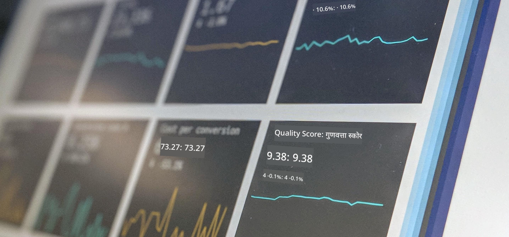

<!--
CO_OP_TRANSLATOR_METADATA:
{
  "original_hash": "696a8474a01054281704cbfb09148949",
  "translation_date": "2025-08-24T21:15:27+00:00",
  "source_file": "1-Introduction/README.md",
  "language_code": "hi"
}
-->
# डेटा साइंस का परिचय

> फोटो <a href="https://unsplash.com/@dawson2406?utm_source=unsplash&utm_medium=referral&utm_content=creditCopyText">स्टीफन डॉसन</a> द्वारा <a href="https://unsplash.com/s/photos/data?utm_source=unsplash&utm_medium=referral&utm_content=creditCopyText">अनस्प्लैश</a> पर

इन पाठों में, आप जानेंगे कि डेटा साइंस को कैसे परिभाषित किया जाता है और उन नैतिक विचारों के बारे में सीखेंगे जिन्हें एक डेटा वैज्ञानिक को ध्यान में रखना चाहिए। आप यह भी जानेंगे कि डेटा को कैसे परिभाषित किया जाता है और सांख्यिकी और संभावना के बारे में थोड़ा सीखेंगे, जो डेटा साइंस के मुख्य शैक्षणिक क्षेत्र हैं।

### विषय

1. [डेटा साइंस को परिभाषित करना](01-defining-data-science/README.md)
2. [डेटा साइंस नैतिकता](02-ethics/README.md)
3. [डेटा को परिभाषित करना](03-defining-data/README.md)
4. [सांख्यिकी और संभावना का परिचय](04-stats-and-probability/README.md)

### श्रेय

ये पाठ ❤️ के साथ [नित्या नरसिम्हन](https://twitter.com/nitya) और [दिमित्री सोश्निकोव](https://twitter.com/shwars) द्वारा लिखे गए हैं।

**अस्वीकरण**:  
यह दस्तावेज़ AI अनुवाद सेवा [Co-op Translator](https://github.com/Azure/co-op-translator) का उपयोग करके अनुवादित किया गया है। जबकि हम सटीकता के लिए प्रयासरत हैं, कृपया ध्यान दें कि स्वचालित अनुवाद में त्रुटियां या अशुद्धियां हो सकती हैं। मूल भाषा में उपलब्ध मूल दस्तावेज़ को प्रामाणिक स्रोत माना जाना चाहिए। महत्वपूर्ण जानकारी के लिए, पेशेवर मानव अनुवाद की सिफारिश की जाती है। इस अनुवाद के उपयोग से उत्पन्न किसी भी गलतफहमी या गलत व्याख्या के लिए हम उत्तरदायी नहीं हैं।