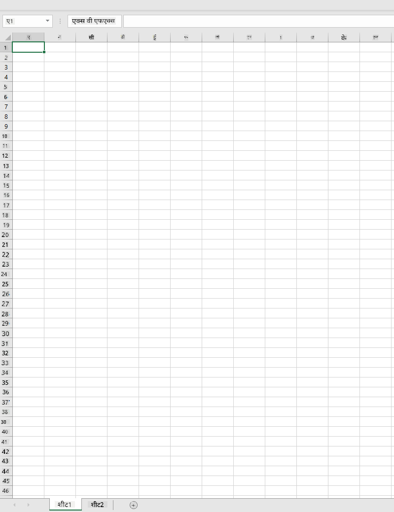
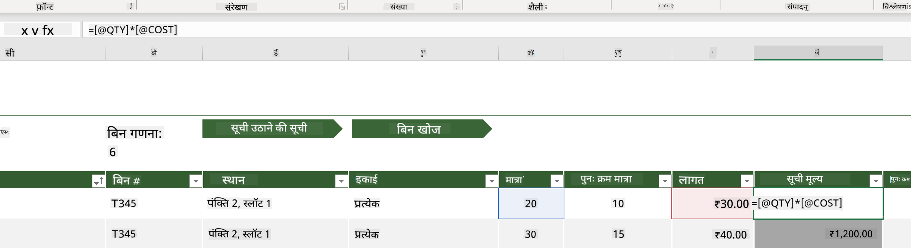
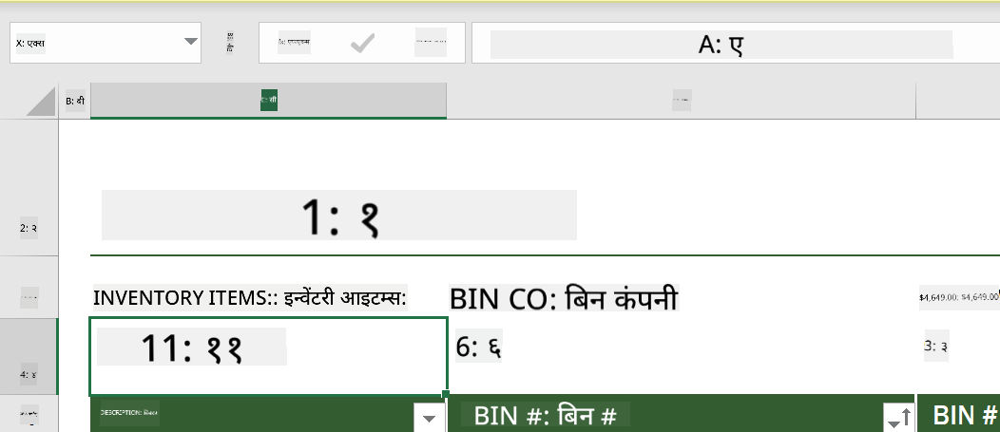
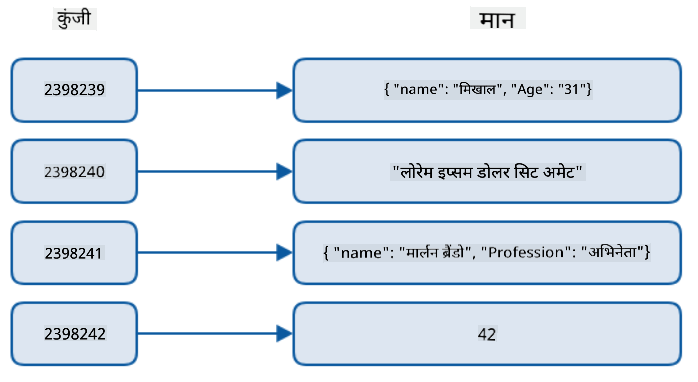
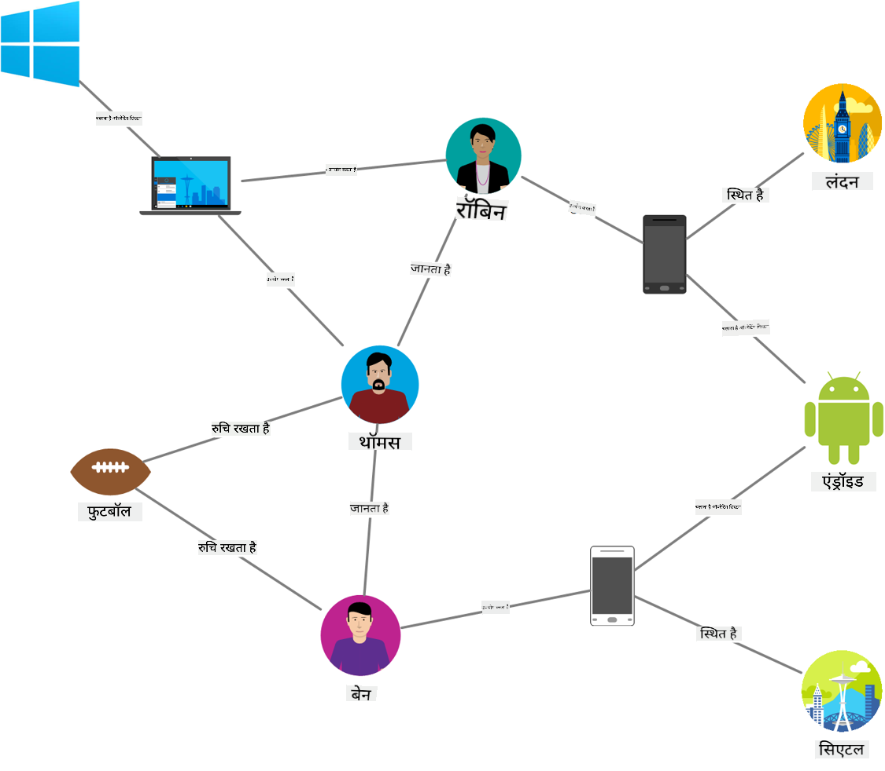
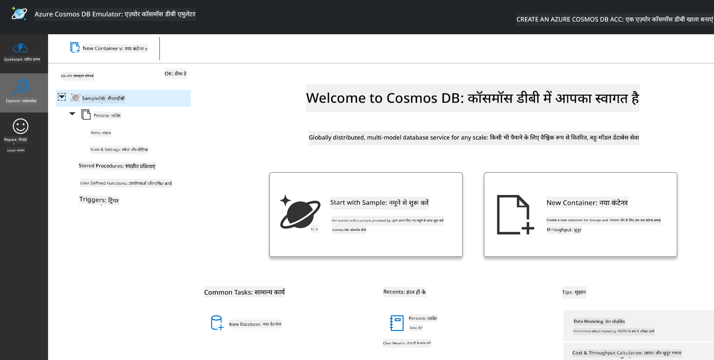
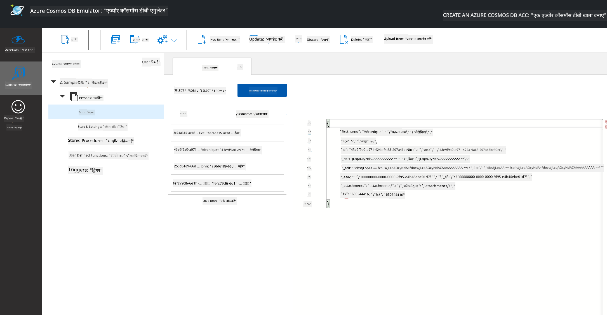
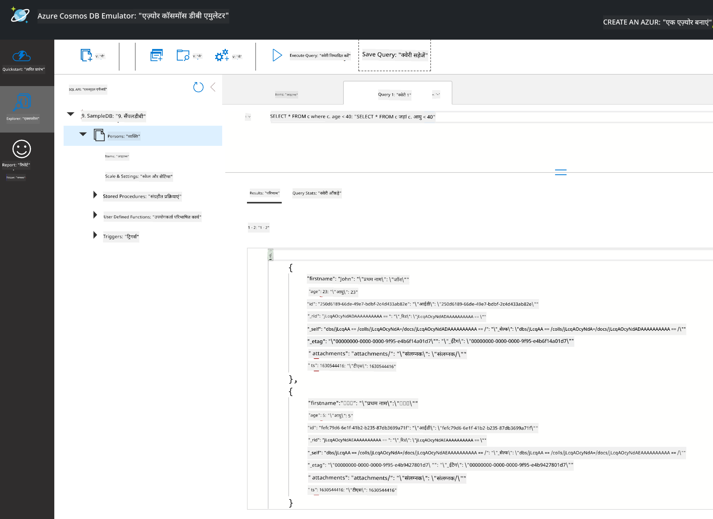

<!--
CO_OP_TRANSLATOR_METADATA:
{
  "original_hash": "54c5a1c74aecb69d2f9099300a4b7eea",
  "translation_date": "2025-09-04T14:53:44+00:00",
  "source_file": "2-Working-With-Data/06-non-relational/README.md",
  "language_code": "hi"
}
-->
# डेटा के साथ काम करना: गैर-संबंधात्मक डेटा

| द्वारा ](../../sketchnotes/06-NoSQL.png)|
|:---:|
|NoSQL डेटा के साथ काम करना - _[@nitya](https://twitter.com/nitya) द्वारा स्केच नोट_ |

## [प्री-लेक्चर क्विज़](https://purple-hill-04aebfb03.1.azurestaticapps.net/quiz/10)

डेटा केवल संबंधात्मक डेटाबेस तक सीमित नहीं है। यह पाठ गैर-संबंधात्मक डेटा पर केंद्रित है और स्प्रेडशीट्स और NoSQL की मूल बातें कवर करेगा।

## स्प्रेडशीट्स

स्प्रेडशीट्स डेटा को स्टोर और एक्सप्लोर करने का एक लोकप्रिय तरीका हैं क्योंकि इसे सेटअप करने और शुरू करने में कम मेहनत लगती है। इस पाठ में आप स्प्रेडशीट के मूल घटकों, साथ ही फॉर्मूलों और फंक्शन्स के बारे में जानेंगे। उदाहरण Microsoft Excel के साथ दिखाए जाएंगे, लेकिन अधिकांश भाग और विषय अन्य स्प्रेडशीट सॉफ़्टवेयर की तुलना में समान नाम और चरणों वाले होंगे।



स्प्रेडशीट एक फ़ाइल होती है और कंप्यूटर, डिवाइस, या क्लाउड आधारित फ़ाइल सिस्टम के फ़ाइल सिस्टम में उपलब्ध होगी। सॉफ़्टवेयर स्वयं ब्राउज़र आधारित हो सकता है या ऐसा एप्लिकेशन जिसे कंप्यूटर पर इंस्टॉल करना या ऐप के रूप में डाउनलोड करना आवश्यक है। Excel में इन फ़ाइलों को **वर्कबुक्स** के रूप में भी परिभाषित किया जाता है और इस पाठ के शेष भाग में इस शब्दावली का उपयोग किया जाएगा।

एक वर्कबुक में एक या अधिक **वर्कशीट्स** होती हैं, जहां प्रत्येक वर्कशीट टैब द्वारा लेबल की जाती है। वर्कशीट के भीतर आयताकार **सेल्स** होते हैं, जो वास्तविक डेटा को समाहित करते हैं। एक सेल पंक्ति और कॉलम के इंटरसेक्शन पर होता है, जहां कॉलम वर्णमाला के अक्षरों से लेबल किए जाते हैं और पंक्तियाँ संख्यात्मक रूप से लेबल की जाती हैं। कुछ स्प्रेडशीट्स में पहले कुछ पंक्तियों में हेडर होते हैं जो सेल में डेटा का वर्णन करते हैं।

Excel वर्कबुक के इन मूल तत्वों के साथ, हम [Microsoft Templates](https://templates.office.com/) से एक इन्वेंटरी पर केंद्रित उदाहरण का उपयोग करेंगे ताकि स्प्रेडशीट के कुछ अतिरिक्त भागों को समझाया जा सके।

### इन्वेंटरी प्रबंधन

"InventoryExample" नामक स्प्रेडशीट फ़ाइल एक इन्वेंटरी में आइटम्स की एक स्वरूपित स्प्रेडशीट है जिसमें तीन वर्कशीट्स हैं, जहां टैब्स "Inventory List", "Inventory Pick List" और "Bin Lookup" के रूप में लेबल किए गए हैं। Inventory List वर्कशीट की पंक्ति 4 हेडर है, जो हेडर कॉलम में प्रत्येक सेल के मूल्य का वर्णन करती है।



ऐसे उदाहरण होते हैं जहां एक सेल अन्य सेल्स के मूल्यों पर निर्भर होता है ताकि उसका मूल्य उत्पन्न हो सके। Inventory List स्प्रेडशीट अपने इन्वेंटरी में प्रत्येक आइटम की लागत को ट्रैक करती है, लेकिन अगर हमें इन्वेंटरी में सब कुछ की कुल लागत जाननी हो तो क्या करें? [**फॉर्मूला**](https://support.microsoft.com/en-us/office/overview-of-formulas-34519a4e-1e8d-4f4b-84d4-d642c4f63263) सेल डेटा पर क्रियाएँ करते हैं और इस उदाहरण में इन्वेंटरी की लागत की गणना करने के लिए उपयोग किए जाते हैं। इस स्प्रेडशीट ने Inventory Value कॉलम में एक फॉर्मूला का उपयोग किया है ताकि QTY हेडर के तहत मात्रा और COST हेडर के तहत लागत को गुणा करके प्रत्येक आइटम का मूल्य गणना किया जा सके। डबल क्लिक या सेल को हाइलाइट करने से फॉर्मूला दिखाई देगा। आप देखेंगे कि फॉर्मूला एक बराबर चिह्न से शुरू होता है, उसके बाद गणना या ऑपरेशन होता है।



हम एक और फॉर्मूला का उपयोग करके Inventory Value के सभी मूल्यों को जोड़ सकते हैं ताकि इसकी कुल लागत प्राप्त हो सके। इसे प्रत्येक सेल को जोड़कर गणना किया जा सकता है, लेकिन यह एक थकाऊ कार्य हो सकता है। Excel में [**फंक्शन्स**](https://support.microsoft.com/en-us/office/sum-function-043e1c7d-7726-4e80-8f32-07b23e057f89) होते हैं, या सेल मूल्यों पर गणना करने के लिए पूर्वनिर्धारित फॉर्मूला। फंक्शन्स को तर्कों की आवश्यकता होती है, जो गणना करने के लिए आवश्यक मान होते हैं। जब फंक्शन्स को एक से अधिक तर्कों की आवश्यकता होती है, तो उन्हें एक विशेष क्रम में सूचीबद्ध करना होगा अन्यथा फंक्शन सही मूल्य की गणना नहीं कर सकता। इस उदाहरण में SUM फंक्शन का उपयोग किया गया है, और Inventory Value के मूल्यों को तर्क के रूप में उपयोग किया गया है ताकि कुल सूचीबद्ध किया जा सके, जो पंक्ति 3, कॉलम B (जिसे B3 भी कहा जाता है) के तहत है।

## NoSQL

NoSQL गैर-संबंधात्मक डेटा को स्टोर करने के विभिन्न तरीकों के लिए एक छत्र शब्द है और इसे "non-SQL", "non-relational" या "not only SQL" के रूप में व्याख्या किया जा सकता है। इन प्रकार के डेटाबेस सिस्टम को 4 प्रकारों में वर्गीकृत किया जा सकता है।


> स्रोत [Michał Białecki Blog](https://www.michalbialecki.com/2018/03/18/azure-cosmos-db-key-value-database-cloud/) से

[Key-value](https://docs.microsoft.com/en-us/azure/architecture/data-guide/big-data/non-relational-data#keyvalue-data-stores) डेटाबेस अद्वितीय कुंजियों को जोड़ते हैं, जो एक अद्वितीय पहचानकर्ता होता है जो एक मान से जुड़ा होता है। इन जोड़ों को [हैश टेबल](https://www.hackerearth.com/practice/data-structures/hash-tables/basics-of-hash-tables/tutorial/) का उपयोग करके संग्रहीत किया जाता है जिसमें एक उपयुक्त हैशिंग फंक्शन होता है।


> स्रोत [Microsoft](https://docs.microsoft.com/en-us/azure/cosmos-db/graph/graph-introduction#graph-database-by-example) से

[Graph](https://docs.microsoft.com/en-us/azure/architecture/data-guide/big-data/non-relational-data#graph-data-stores) डेटाबेस डेटा में संबंधों का वर्णन करते हैं और नोड्स और एजेस के संग्रह के रूप में प्रस्तुत किए जाते हैं। एक नोड एक इकाई का प्रतिनिधित्व करता है, कुछ ऐसा जो वास्तविक दुनिया में मौजूद होता है जैसे कि एक छात्र या बैंक स्टेटमेंट। एजेस दो इकाइयों के बीच संबंध का प्रतिनिधित्व करते हैं। प्रत्येक नोड और एजेस में गुण होते हैं जो प्रत्येक नोड और एजेस के बारे में अतिरिक्त जानकारी प्रदान करते हैं।


[Columnar](https://docs.microsoft.com/en-us/azure/architecture/data-guide/big-data/non-relational-data#columnar-data-stores) डेटा स्टोर्स डेटा को कॉलम और पंक्तियों में व्यवस्थित करते हैं जैसे कि एक संबंधात्मक डेटा संरचना, लेकिन प्रत्येक कॉलम को समूहों में विभाजित किया जाता है जिसे कॉलम परिवार कहा जाता है, जहां एक कॉलम के तहत सभी डेटा संबंधित होते हैं और एक इकाई में पुनः प्राप्त और बदले जा सकते हैं।

### Azure Cosmos DB के साथ डॉक्यूमेंट डेटा स्टोर्स

[Document](https://docs.microsoft.com/en-us/azure/architecture/data-guide/big-data/non-relational-data#document-data-stores) डेटा स्टोर्स की-वैल्यू डेटा स्टोर की अवधारणा पर आधारित होते हैं और फ़ील्ड्स और ऑब्जेक्ट्स की एक श्रृंखला से बने होते हैं। इस खंड में Cosmos DB एमुलेटर के साथ डॉक्यूमेंट डेटाबेस का अन्वेषण किया जाएगा।

Cosmos DB डेटाबेस "Not Only SQL" की परिभाषा में फिट बैठता है, जहां Cosmos DB का डॉक्यूमेंट डेटाबेस डेटा को क्वेरी करने के लिए SQL पर निर्भर करता है। [पिछले पाठ](../05-relational-databases/README.md) में SQL की भाषा की मूल बातें कवर की गई हैं, और हम यहां डॉक्यूमेंट डेटाबेस पर कुछ समान क्वेरी लागू कर पाएंगे। हम Cosmos DB एमुलेटर का उपयोग करेंगे, जो हमें एक कंप्यूटर पर स्थानीय रूप से डॉक्यूमेंट डेटाबेस बनाने और एक्सप्लोर करने की अनुमति देता है। एमुलेटर के बारे में अधिक पढ़ें [यहां](https://docs.microsoft.com/en-us/azure/cosmos-db/local-emulator?tabs=ssl-netstd21)।

एक डॉक्यूमेंट फ़ील्ड्स और ऑब्जेक्ट वैल्यूज़ का संग्रह होता है, जहां फ़ील्ड्स ऑब्जेक्ट वैल्यू का प्रतिनिधित्व करते हैं। नीचे एक डॉक्यूमेंट का उदाहरण दिया गया है।

```json
{
    "firstname": "Eva",
    "age": 44,
    "id": "8c74a315-aebf-4a16-bb38-2430a9896ce5",
    "_rid": "bHwDAPQz8s0BAAAAAAAAAA==",
    "_self": "dbs/bHwDAA==/colls/bHwDAPQz8s0=/docs/bHwDAPQz8s0BAAAAAAAAAA==/",
    "_etag": "\"00000000-0000-0000-9f95-010a691e01d7\"",
    "_attachments": "attachments/",
    "_ts": 1630544034
}
```

इस डॉक्यूमेंट में रुचि के फ़ील्ड्स हैं: `firstname`, `id`, और `age`। बाकी फ़ील्ड्स जो अंडरस्कोर के साथ हैं, Cosmos DB द्वारा उत्पन्न किए गए थे।

#### Cosmos DB एमुलेटर के साथ डेटा का अन्वेषण

आप एमुलेटर को [Windows के लिए यहां](https://aka.ms/cosmosdb-emulator) डाउनलोड और इंस्टॉल कर सकते हैं। macOS और Linux के लिए एमुलेटर चलाने के विकल्पों के लिए इस [डॉक्यूमेंटेशन](https://docs.microsoft.com/en-us/azure/cosmos-db/local-emulator?tabs=ssl-netstd21#run-on-linux-macos) को देखें।

एमुलेटर एक ब्राउज़र विंडो लॉन्च करता है, जहां Explorer व्यू आपको डॉक्यूमेंट्स का अन्वेषण करने की अनुमति देता है।



यदि आप साथ में काम कर रहे हैं, तो "Start with Sample" पर क्लिक करें ताकि SampleDB नामक एक नमूना डेटाबेस उत्पन्न हो सके। यदि आप SampleDB को तीर पर क्लिक करके विस्तारित करते हैं, तो आपको `Persons` नामक एक कंटेनर मिलेगा। एक कंटेनर आइटम्स का संग्रह रखता है, जो कंटेनर के भीतर डॉक्यूमेंट्स होते हैं। आप `Items` के तहत चार व्यक्तिगत डॉक्यूमेंट्स का अन्वेषण कर सकते हैं।



#### Cosmos DB एमुलेटर के साथ डॉक्यूमेंट डेटा को क्वेरी करना

हम नए SQL Query बटन (बाएँ से दूसरा बटन) पर क्लिक करके नमूना डेटा को क्वेरी भी कर सकते हैं।

`SELECT * FROM c` कंटेनर में सभी डॉक्यूमेंट्स को लौटाता है। चलिए एक where क्लॉज जोड़ते हैं और उन सभी को ढूंढते हैं जिनकी उम्र 40 से कम है।

`SELECT * FROM c where c.age < 40`



क्वेरी दो डॉक्यूमेंट्स लौटाती है, ध्यान दें कि प्रत्येक डॉक्यूमेंट के age मान 40 से कम हैं।

#### JSON और डॉक्यूमेंट्स

यदि आप JavaScript Object Notation (JSON) से परिचित हैं, तो आप देखेंगे कि डॉक्यूमेंट्स JSON के समान दिखते हैं। इस निर्देशिका में एक `PersonsData.json` फ़ाइल है जिसमें अधिक डेटा है जिसे आप एमुलेटर में `Upload Item` बटन के माध्यम से Persons कंटेनर में अपलोड कर सकते हैं।

अधिकांश मामलों में, APIs जो JSON डेटा लौटाते हैं, उन्हें सीधे डॉक्यूमेंट डेटाबेस में स्थानांतरित और संग्रहीत किया जा सकता है। नीचे एक और डॉक्यूमेंट है, यह Microsoft Twitter अकाउंट से ट्वीट्स का प्रतिनिधित्व करता है जिसे Twitter API का उपयोग करके प्राप्त किया गया था, फिर Cosmos DB में डाला गया।

```json
{
    "created_at": "2021-08-31T19:03:01.000Z",
    "id": "1432780985872142341",
    "text": "Blank slate. Like this tweet if you’ve ever painted in Microsoft Paint before. https://t.co/cFeEs8eOPK",
    "_rid": "dhAmAIUsA4oHAAAAAAAAAA==",
    "_self": "dbs/dhAmAA==/colls/dhAmAIUsA4o=/docs/dhAmAIUsA4oHAAAAAAAAAA==/",
    "_etag": "\"00000000-0000-0000-9f84-a0958ad901d7\"",
    "_attachments": "attachments/",
    "_ts": 1630537000
```

इस डॉक्यूमेंट में रुचि के फ़ील्ड्स हैं: `created_at`, `id`, और `text`।

## 🚀 चुनौती

एक `TwitterData.json` फ़ाइल है जिसे आप SampleDB डेटाबेस में अपलोड कर सकते हैं। यह अनुशंसा की जाती है कि आप इसे एक अलग कंटेनर में जोड़ें। इसे निम्नलिखित चरणों द्वारा किया जा सकता है:

1. शीर्ष दाईं ओर नए कंटेनर बटन पर क्लिक करें
1. मौजूदा डेटाबेस (SampleDB) का चयन करें और कंटेनर के लिए एक कंटेनर आईडी बनाएं
1. `/id` को पार्टिशन कुंजी के रूप में सेट करें
1. OK पर क्लिक करें (आप इस दृश्य में बाकी जानकारी को अनदेखा कर सकते हैं क्योंकि यह एक छोटा डेटासेट है जो आपके मशीन पर स्थानीय रूप से चल रहा है)
1. अपने नए कंटेनर को खोलें और `Upload Item` बटन के साथ Twitter Data फ़ाइल अपलोड करें

कुछ SELECT क्वेरी चलाने का प्रयास करें ताकि उन डॉक्यूमेंट्स को ढूंढा जा सके जिनके text फ़ील्ड में Microsoft है। संकेत: [LIKE कीवर्ड](https://docs.microsoft.com/en-us/azure/cosmos-db/sql/sql-query-keywords#using-like-with-the--wildcard-character) का उपयोग करने का प्रयास करें।

## [पोस्ट-लेक्चर क्विज़](https://ff-quizzes.netlify.app/en/ds/)

## समीक्षा और स्व-अध्ययन

- इस स्प्रेडशीट में कुछ अतिरिक्त स्वरूपण और सुविधाएँ जोड़ी गई हैं जिन्हें यह पाठ कवर नहीं करता। यदि आप Excel के बारे में अधिक जानने में रुचि रखते हैं, तो Microsoft के पास [डॉक्यूमेंटेशन और वीडियो की एक बड़ी लाइब्रेरी](https://support.microsoft.com/excel) है।

- इस वास्तुशिल्प डॉक्यूमेंटेशन में गैर-संबंधात्मक डेटा के विभिन्न प्रकारों की विशेषताओं का विवरण दिया गया है: [Non-relational Data and NoSQL](https://docs.microsoft.com/en-us/azure/architecture/data-guide/big-data/non-relational-data)

- Cosmos DB एक क्लाउड आधारित गैर-संबंधात्मक डेटाबेस है जो इस पाठ में उल्लिखित विभिन्न NoSQL प्रकारों को भी संग्रहीत कर सकता है। इन प्रकारों के बारे में अधिक जानें इस [Cosmos DB Microsoft Learn Module](https://docs.microsoft.com/en-us/learn/paths/work-with-nosql-data-in-azure-cosmos-db/) में।

## असाइनमेंट

[Soda Profits](assignment.md)

---

**अस्वीकरण**:  
यह दस्तावेज़ AI अनुवाद सेवा [Co-op Translator](https://github.com/Azure/co-op-translator) का उपयोग करके अनुवादित किया गया है। जबकि हम सटीकता के लिए प्रयासरत हैं, कृपया ध्यान दें कि स्वचालित अनुवाद में त्रुटियां या अशुद्धियां हो सकती हैं। मूल भाषा में उपलब्ध मूल दस्तावेज़ को आधिकारिक स्रोत माना जाना चाहिए। महत्वपूर्ण जानकारी के लिए, पेशेवर मानव अनुवाद की सिफारिश की जाती है। इस अनुवाद के उपयोग से उत्पन्न किसी भी गलतफहमी या गलत व्याख्या के लिए हम उत्तरदायी नहीं हैं।  