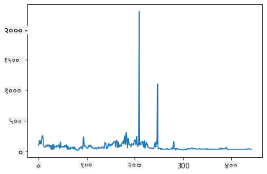
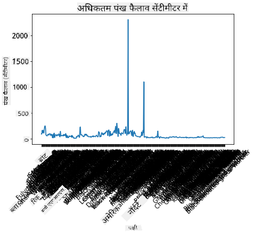
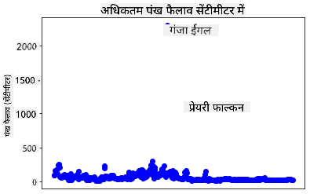
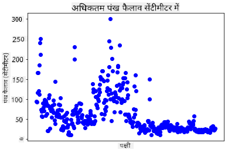
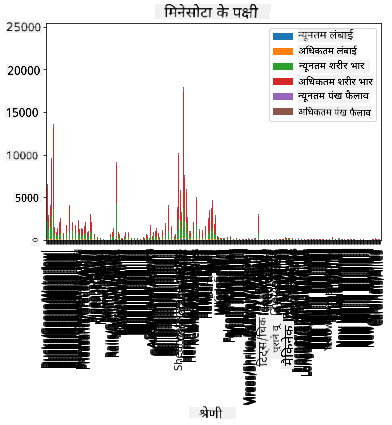
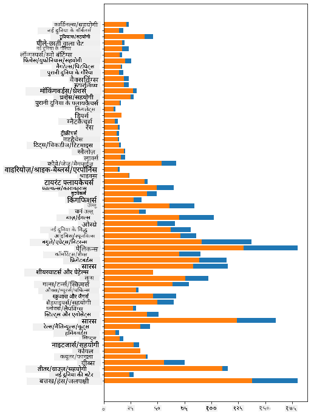

<!--
CO_OP_TRANSLATOR_METADATA:
{
  "original_hash": "69b32b6789a91f796ebc7a02f5575e03",
  "translation_date": "2025-09-04T15:01:53+00:00",
  "source_file": "3-Data-Visualization/09-visualization-quantities/README.md",
  "language_code": "hi"
}
-->
# मात्राओं का दृश्यांकन

| ](../../sketchnotes/09-Visualizing-Quantities.png)|
|:---:|
| मात्राओं का दृश्यांकन - _Sketchnote by [@nitya](https://twitter.com/nitya)_ |

इस पाठ में, आप यह जानेंगे कि पायथन की उपलब्ध लाइब्रेरीज़ में से एक का उपयोग करके मात्रा की अवधारणा के चारों ओर दिलचस्प दृश्यांकन कैसे बनाए जा सकते हैं। मिनेसोटा के पक्षियों के बारे में एक साफ-सुथरे डेटा सेट का उपयोग करके, आप स्थानीय वन्यजीवों के बारे में कई रोचक तथ्य जान सकते हैं।  
## [पाठ-पूर्व क्विज़](https://purple-hill-04aebfb03.1.azurestaticapps.net/quiz/16)

## Matplotlib के साथ पंखों के फैलाव का निरीक्षण करें

[Matplotlib](https://matplotlib.org/stable/index.html) एक उत्कृष्ट लाइब्रेरी है जो विभिन्न प्रकार के सरल और जटिल प्लॉट और चार्ट बनाने के लिए उपयोगी है। सामान्य शब्दों में, इन लाइब्रेरीज़ का उपयोग करके डेटा को प्लॉट करने की प्रक्रिया में आपके डेटा फ्रेम के उन हिस्सों की पहचान करना शामिल है जिन्हें आप लक्षित करना चाहते हैं, उस डेटा पर आवश्यक परिवर्तन करना, इसके x और y अक्ष मान निर्दिष्ट करना, यह तय करना कि किस प्रकार का प्लॉट दिखाना है, और फिर प्लॉट दिखाना। Matplotlib कई प्रकार के दृश्यांकन प्रदान करता है, लेकिन इस पाठ के लिए, आइए मात्रा को दृश्यांकित करने के लिए सबसे उपयुक्त चार्ट पर ध्यान केंद्रित करें: लाइन चार्ट, स्कैटरप्लॉट और बार प्लॉट।

> ✅ अपने डेटा की संरचना और आप जो कहानी बताना चाहते हैं, उसके अनुसार सबसे उपयुक्त चार्ट का उपयोग करें।  
> - समय के साथ रुझानों का विश्लेषण करने के लिए: लाइन  
> - मानों की तुलना करने के लिए: बार, कॉलम, पाई, स्कैटरप्लॉट  
> - यह दिखाने के लिए कि भाग पूरे से कैसे संबंधित हैं: पाई  
> - डेटा के वितरण को दिखाने के लिए: स्कैटरप्लॉट, बार  
> - रुझान दिखाने के लिए: लाइन, कॉलम  
> - मानों के बीच संबंध दिखाने के लिए: लाइन, स्कैटरप्लॉट, बबल  

यदि आपके पास एक डेटा सेट है और आपको यह पता लगाना है कि किसी दिए गए आइटम की कितनी मात्रा शामिल है, तो आपके पास सबसे पहला कार्य इसके मानों का निरीक्षण करना होगा।  

✅ Matplotlib के लिए बहुत अच्छे 'चीट शीट्स' [यहां](https://matplotlib.org/cheatsheets/cheatsheets.pdf) उपलब्ध हैं।

## पक्षियों के पंखों के फैलाव के बारे में एक लाइन प्लॉट बनाएं

इस पाठ फ़ोल्डर की जड़ में `notebook.ipynb` फ़ाइल खोलें और एक सेल जोड़ें।  

> नोट: डेटा इस रिपॉजिटरी की जड़ में `/data` फ़ोल्डर में संग्रहीत है।  

```python
import pandas as pd
import matplotlib.pyplot as plt
birds = pd.read_csv('../../data/birds.csv')
birds.head()
```  
यह डेटा टेक्स्ट और नंबरों का मिश्रण है:

|      | Name                         | ScientificName         | Category              | Order        | Family   | Genus       | ConservationStatus | MinLength | MaxLength | MinBodyMass | MaxBodyMass | MinWingspan | MaxWingspan |
| ---: | :--------------------------- | :--------------------- | :-------------------- | :----------- | :------- | :---------- | :----------------- | --------: | --------: | ----------: | ----------: | ----------: | ----------: |
|    0 | Black-bellied whistling-duck | Dendrocygna autumnalis | Ducks/Geese/Waterfowl | Anseriformes | Anatidae | Dendrocygna | LC                 |        47 |        56 |         652 |        1020 |          76 |          94 |
|    1 | Fulvous whistling-duck       | Dendrocygna bicolor    | Ducks/Geese/Waterfowl | Anseriformes | Anatidae | Dendrocygna | LC                 |        45 |        53 |         712 |        1050 |          85 |          93 |
|    2 | Snow goose                   | Anser caerulescens     | Ducks/Geese/Waterfowl | Anseriformes | Anatidae | Anser       | LC                 |        64 |        79 |        2050 |        4050 |         135 |         165 |
|    3 | Ross's goose                 | Anser rossii           | Ducks/Geese/Waterfowl | Anseriformes | Anatidae | Anser       | LC                 |      57.3 |        64 |        1066 |        1567 |         113 |         116 |
|    4 | Greater white-fronted goose  | Anser albifrons        | Ducks/Geese/Waterfowl | Anseriformes | Anatidae | Anser       | LC                 |        64 |        81 |        1930 |        3310 |         130 |         165 |

आइए इन दिलचस्प पक्षियों के लिए अधिकतम पंखों के फैलाव का एक बुनियादी लाइन प्लॉट बनाकर कुछ संख्यात्मक डेटा प्लॉट करें।  

```python
wingspan = birds['MaxWingspan'] 
wingspan.plot()
```  


आपने तुरंत क्या देखा? ऐसा लगता है कि कम से कम एक आउटलायर है - यह पंखों का फैलाव काफी बड़ा है! 2300 सेंटीमीटर का पंख फैलाव 23 मीटर के बराबर है - क्या मिनेसोटा में प्टेरोडैक्टाइल्स घूम रहे हैं? आइए जांच करें।  

हालांकि आप Excel में एक त्वरित सॉर्ट करके इन आउटलायर्स को ढूंढ सकते हैं, लेकिन प्लॉट के भीतर से ही दृश्यांकन प्रक्रिया जारी रखें।  

x-अक्ष पर लेबल जोड़ें ताकि यह दिखाया जा सके कि कौन से पक्षी प्रश्न में हैं:  

```
plt.title('Max Wingspan in Centimeters')
plt.ylabel('Wingspan (CM)')
plt.xlabel('Birds')
plt.xticks(rotation=45)
x = birds['Name'] 
y = birds['MaxWingspan']

plt.plot(x, y)

plt.show()
```  


यहां तक कि लेबल को 45 डिग्री पर घुमाने के बावजूद, पढ़ने के लिए बहुत अधिक हैं। आइए एक अलग रणनीति आज़माएं: केवल उन आउटलायर्स को लेबल करें और चार्ट के भीतर लेबल सेट करें। आप लेबलिंग के लिए अधिक स्थान बनाने के लिए एक स्कैटर चार्ट का उपयोग कर सकते हैं:  

```python
plt.title('Max Wingspan in Centimeters')
plt.ylabel('Wingspan (CM)')
plt.tick_params(axis='both',which='both',labelbottom=False,bottom=False)

for i in range(len(birds)):
    x = birds['Name'][i]
    y = birds['MaxWingspan'][i]
    plt.plot(x, y, 'bo')
    if birds['MaxWingspan'][i] > 500:
        plt.text(x, y * (1 - 0.05), birds['Name'][i], fontsize=12)
    
plt.show()
```  
यहां क्या हो रहा है? आपने `tick_params` का उपयोग करके नीचे के लेबल छिपाए और फिर अपने पक्षी डेटा सेट पर एक लूप बनाया। `bo` का उपयोग करके छोटे गोल नीले बिंदुओं के साथ चार्ट प्लॉट करते हुए, आपने किसी भी पक्षी की जांच की जिसका अधिकतम पंख फैलाव 500 से अधिक था और यदि ऐसा था तो उसके बिंदु के बगल में उसका लेबल प्रदर्शित किया। आपने y-अक्ष पर लेबल को थोड़ा ऑफसेट किया (`y * (1 - 0.05)`) और पक्षी के नाम को लेबल के रूप में उपयोग किया।  

आपने क्या खोजा?  

  
## अपने डेटा को फ़िल्टर करें  

Bald Eagle और Prairie Falcon, हालांकि शायद बहुत बड़े पक्षी हैं, गलत लेबल किए गए प्रतीत होते हैं, उनके अधिकतम पंख फैलाव में एक अतिरिक्त `0` जोड़ा गया है। यह संभावना नहीं है कि आप 25 मीटर पंख फैलाव वाले Bald Eagle से मिलेंगे, लेकिन यदि ऐसा हो, तो कृपया हमें बताएं! आइए इन दो आउटलायर्स के बिना एक नया डेटा फ्रेम बनाएं:  

```python
plt.title('Max Wingspan in Centimeters')
plt.ylabel('Wingspan (CM)')
plt.xlabel('Birds')
plt.tick_params(axis='both',which='both',labelbottom=False,bottom=False)
for i in range(len(birds)):
    x = birds['Name'][i]
    y = birds['MaxWingspan'][i]
    if birds['Name'][i] not in ['Bald eagle', 'Prairie falcon']:
        plt.plot(x, y, 'bo')
plt.show()
```  

आउटलायर्स को फ़िल्टर करके, आपका डेटा अब अधिक सुसंगत और समझने योग्य है।  

  

अब जब हमारे पास कम से कम पंख फैलाव के संदर्भ में एक साफ-सुथरा डेटा सेट है, तो आइए इन पक्षियों के बारे में और अधिक खोज करें।  

हालांकि लाइन और स्कैटर प्लॉट डेटा मानों और उनके वितरण के बारे में जानकारी प्रदर्शित कर सकते हैं, हम इस डेटा सेट में निहित मानों के बारे में सोचना चाहते हैं। आप मात्रा के बारे में निम्नलिखित प्रश्नों का उत्तर देने के लिए दृश्यांकन बना सकते हैं:  

> पक्षियों की कितनी श्रेणियां हैं, और उनकी संख्या क्या है?  
> कितने पक्षी विलुप्त, संकटग्रस्त, दुर्लभ, या सामान्य हैं?  
> लिनियस की शब्दावली में विभिन्न जीनस और ऑर्डर की संख्या कितनी है?  
## बार चार्ट का अन्वेषण करें  

जब आपको डेटा के समूहों को दिखाने की आवश्यकता होती है, तो बार चार्ट व्यावहारिक होते हैं। आइए इस डेटा सेट में मौजूद पक्षियों की श्रेणियों का अन्वेषण करें ताकि यह देखा जा सके कि संख्या के हिसाब से कौन सी सबसे सामान्य है।  

नोटबुक फ़ाइल में, एक बुनियादी बार चार्ट बनाएं।  

✅ ध्यान दें, आप या तो पिछले खंड में पहचाने गए दो आउटलायर पक्षियों को फ़िल्टर कर सकते हैं, उनके पंख फैलाव में टाइपो को संपादित कर सकते हैं, या उन्हें इन अभ्यासों के लिए छोड़ सकते हैं जो पंख फैलाव मानों पर निर्भर नहीं करते।  

यदि आप एक बार चार्ट बनाना चाहते हैं, तो आप उस डेटा का चयन कर सकते हैं जिस पर आप ध्यान केंद्रित करना चाहते हैं। बार चार्ट कच्चे डेटा से बनाए जा सकते हैं:  

```python
birds.plot(x='Category',
        kind='bar',
        stacked=True,
        title='Birds of Minnesota')

```  
  

हालांकि, यह बार चार्ट पढ़ने योग्य नहीं है क्योंकि इसमें बहुत अधिक गैर-समूहित डेटा है। आपको केवल उस डेटा का चयन करना होगा जिसे आप प्लॉट करना चाहते हैं, तो आइए पक्षियों की श्रेणी के आधार पर उनकी लंबाई देखें।  

अपने डेटा को केवल पक्षी की श्रेणी शामिल करने के लिए फ़िल्टर करें।  

✅ ध्यान दें कि आप डेटा को प्रबंधित करने के लिए Pandas का उपयोग करते हैं, और फिर Matplotlib को चार्टिंग करने देते हैं।  

चूंकि कई श्रेणियां हैं, आप इस चार्ट को लंबवत प्रदर्शित कर सकते हैं और सभी डेटा को समायोजित करने के लिए इसकी ऊंचाई को समायोजित कर सकते हैं:  

```python
category_count = birds.value_counts(birds['Category'].values, sort=True)
plt.rcParams['figure.figsize'] = [6, 12]
category_count.plot.barh()
```  
  

यह बार चार्ट प्रत्येक श्रेणी में पक्षियों की संख्या का एक अच्छा दृश्य दिखाता है। एक झलक में, आप देख सकते हैं कि इस क्षेत्र में सबसे बड़ी संख्या में पक्षी Ducks/Geese/Waterfowl श्रेणी में हैं। मिनेसोटा '10,000 झीलों की भूमि' है, इसलिए यह आश्चर्यजनक नहीं है!  

✅ इस डेटा सेट पर कुछ अन्य गणनाएं आज़माएं। क्या कुछ आपको आश्चर्यचकित करता है?  

## डेटा की तुलना करना  

आप नए अक्ष बनाकर समूहित डेटा की विभिन्न तुलना कर सकते हैं। पक्षी की श्रेणी के आधार पर पक्षी की MaxLength की तुलना आज़माएं:  

```python
maxlength = birds['MaxLength']
plt.barh(y=birds['Category'], width=maxlength)
plt.rcParams['figure.figsize'] = [6, 12]
plt.show()
```  
  

यहां कुछ भी आश्चर्यजनक नहीं है: हमिंगबर्ड्स का MaxLength पेलिकन या गीज़ की तुलना में सबसे कम है। यह अच्छा है जब डेटा तार्किक रूप से समझ में आता है!  

आप बार चार्ट के अधिक रोचक दृश्यांकन डेटा को सुपरइम्पोज़ करके बना सकते हैं। आइए किसी दिए गए पक्षी श्रेणी पर न्यूनतम और अधिकतम लंबाई को सुपरइम्पोज़ करें:  

```python
minLength = birds['MinLength']
maxLength = birds['MaxLength']
category = birds['Category']

plt.barh(category, maxLength)
plt.barh(category, minLength)

plt.show()
```  
इस प्लॉट में, आप न्यूनतम लंबाई और अधिकतम लंबाई के पक्षी श्रेणी के अनुसार रेंज देख सकते हैं। आप सुरक्षित रूप से कह सकते हैं कि, इस डेटा के अनुसार, पक्षी जितना बड़ा होता है, उसकी लंबाई की रेंज उतनी ही बड़ी होती है। यह दिलचस्प है!  

  

## 🚀 चुनौती  

यह पक्षी डेटा सेट एक विशेष पारिस्थितिकी तंत्र के भीतर विभिन्न प्रकार के पक्षियों के बारे में जानकारी का खजाना प्रदान करता है। इंटरनेट पर खोजें और देखें कि क्या आप अन्य पक्षी-उन्मुख डेटा सेट पा सकते हैं। इन पक्षियों के चार्ट और ग्राफ़ बनाकर अभ्यास करें ताकि ऐसे तथ्य खोजे जा सकें जिनके बारे में आपको पहले पता नहीं था।  

## [पाठ-उत्तर क्विज़](https://ff-quizzes.netlify.app/en/ds/)  

## समीक्षा और स्व-अध्ययन  

इस पहले पाठ ने आपको मात्राओं को दृश्यांकित करने के लिए Matplotlib का उपयोग करने के बारे में कुछ जानकारी दी है। डेटा सेट के साथ काम करने के अन्य तरीकों के बारे में शोध करें। [Plotly](https://github.com/plotly/plotly.py) एक ऐसा है जिसे हम इन पाठों में कवर नहीं करेंगे, इसलिए देखें कि यह क्या पेशकश कर सकता है।  
## असाइनमेंट  

[लाइन्स, स्कैटर्स, और बार्स](assignment.md)  

---

**अस्वीकरण**:  
यह दस्तावेज़ AI अनुवाद सेवा [Co-op Translator](https://github.com/Azure/co-op-translator) का उपयोग करके अनुवादित किया गया है। जबकि हम सटीकता सुनिश्चित करने का प्रयास करते हैं, कृपया ध्यान दें कि स्वचालित अनुवाद में त्रुटियां या अशुद्धियां हो सकती हैं। मूल भाषा में उपलब्ध मूल दस्तावेज़ को आधिकारिक स्रोत माना जाना चाहिए। महत्वपूर्ण जानकारी के लिए, पेशेवर मानव अनुवाद की सिफारिश की जाती है। इस अनुवाद के उपयोग से उत्पन्न किसी भी गलतफहमी या गलत व्याख्या के लिए हम जिम्मेदार नहीं हैं।