<!--
CO_OP_TRANSLATOR_METADATA:
{
  "original_hash": "02ce904bc1e2bfabb7dc05c25aae375c",
  "translation_date": "2025-09-04T15:03:48+00:00",
  "source_file": "3-Data-Visualization/10-visualization-distributions/README.md",
  "language_code": "hi"
}
-->
# वितरणों का विज़ुअलाइज़ेशन

| द्वारा ](../../sketchnotes/10-Visualizing-Distributions.png)|
|:---:|
| वितरणों का विज़ुअलाइज़ेशन - _[@nitya](https://twitter.com/nitya) द्वारा स्केच नोट_ |

पिछले पाठ में, आपने मिनेसोटा के पक्षियों के बारे में एक डेटासेट से कुछ रोचक तथ्य सीखे। आपने बाहरी डेटा को विज़ुअलाइज़ करके कुछ त्रुटिपूर्ण डेटा पाया और पक्षी श्रेणियों के बीच उनके अधिकतम लंबाई के आधार पर अंतर देखा।

## [प्री-लेक्चर क्विज़](https://purple-hill-04aebfb03.1.azurestaticapps.net/quiz/18)
## पक्षियों के डेटासेट का अन्वेषण करें

डेटा में गहराई से जाने का एक और तरीका है इसके वितरण को देखना, यानी डेटा को एक अक्ष के साथ कैसे व्यवस्थित किया गया है। उदाहरण के लिए, हो सकता है कि आप मिनेसोटा के पक्षियों के लिए अधिकतम पंखों की चौड़ाई या अधिकतम शरीर के भार के सामान्य वितरण के बारे में जानना चाहें।

आइए इस डेटासेट में डेटा के वितरण के बारे में कुछ तथ्य खोजें। इस पाठ फ़ोल्डर की जड़ में _notebook.ipynb_ फ़ाइल में, Pandas, Matplotlib और अपने डेटा को आयात करें:

```python
import pandas as pd
import matplotlib.pyplot as plt
birds = pd.read_csv('../../data/birds.csv')
birds.head()
```

|      | नाम                          | वैज्ञानिक नाम          | श्रेणी                | क्रम         | परिवार   | वंश         | संरक्षण स्थिति      | न्यूनतम लंबाई | अधिकतम लंबाई | न्यूनतम शरीर भार | अधिकतम शरीर भार | न्यूनतम पंख चौड़ाई | अधिकतम पंख चौड़ाई |
| ---: | :--------------------------- | :--------------------- | :-------------------- | :----------- | :------- | :---------- | :----------------- | --------: | --------: | ----------: | ----------: | ----------: | ----------: |
|    0 | ब्लैक-बेलिड विसलिंग-डक       | Dendrocygna autumnalis | बत्तख/हंस/जलपक्षी     | Anseriformes | Anatidae | Dendrocygna | LC                 |        47 |        56 |         652 |        1020 |          76 |          94 |
|    1 | फुल्वस विसलिंग-डक            | Dendrocygna bicolor    | बत्तख/हंस/जलपक्षी     | Anseriformes | Anatidae | Dendrocygna | LC                 |        45 |        53 |         712 |        1050 |          85 |          93 |
|    2 | स्नो गूज़                     | Anser caerulescens     | बत्तख/हंस/जलपक्षी     | Anseriformes | Anatidae | Anser       | LC                 |        64 |        79 |        2050 |        4050 |         135 |         165 |
|    3 | रॉस का गूज़                  | Anser rossii           | बत्तख/हंस/जलपक्षी     | Anseriformes | Anatidae | Anser       | LC                 |      57.3 |        64 |        1066 |        1567 |         113 |         116 |
|    4 | ग्रेटर व्हाइट-फ्रंटेड गूज़   | Anser albifrons        | बत्तख/हंस/जलपक्षी     | Anseriformes | Anatidae | Anser       | LC                 |        64 |        81 |        1930 |        3310 |         130 |         165 |

सामान्य तौर पर, आप डेटा के वितरण को जल्दी से देख सकते हैं जैसे हमने पिछले पाठ में एक स्कैटर प्लॉट का उपयोग करके किया था:

```python
birds.plot(kind='scatter',x='MaxLength',y='Order',figsize=(12,8))

plt.title('Max Length per Order')
plt.ylabel('Order')
plt.xlabel('Max Length')

plt.show()
```
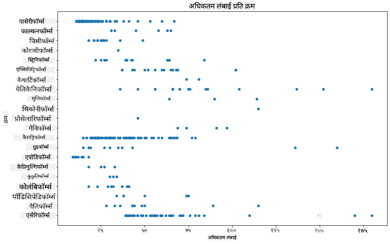

यह पक्षी क्रम के अनुसार शरीर की लंबाई के सामान्य वितरण का एक अवलोकन देता है, लेकिन यह सच्चे वितरण को प्रदर्शित करने का सबसे अच्छा तरीका नहीं है। यह कार्य आमतौर पर एक हिस्टोग्राम बनाकर किया जाता है।

## हिस्टोग्राम के साथ काम करना

Matplotlib हिस्टोग्राम का उपयोग करके डेटा वितरण को विज़ुअलाइज़ करने के लिए बहुत अच्छे तरीके प्रदान करता है। इस प्रकार का चार्ट बार चार्ट जैसा होता है जहां वितरण को बार के उतार-चढ़ाव के माध्यम से देखा जा सकता है। हिस्टोग्राम बनाने के लिए, आपको संख्यात्मक डेटा की आवश्यकता होती है। हिस्टोग्राम बनाने के लिए, आप चार्ट को 'hist' प्रकार के रूप में परिभाषित कर सकते हैं। यह चार्ट पूरे डेटासेट के लिए MaxBodyMass के वितरण को दिखाता है। डेटा के दिए गए सरणी को छोटे बिन्स में विभाजित करके, यह डेटा के मानों के वितरण को प्रदर्शित कर सकता है:

```python
birds['MaxBodyMass'].plot(kind = 'hist', bins = 10, figsize = (12,12))
plt.show()
```
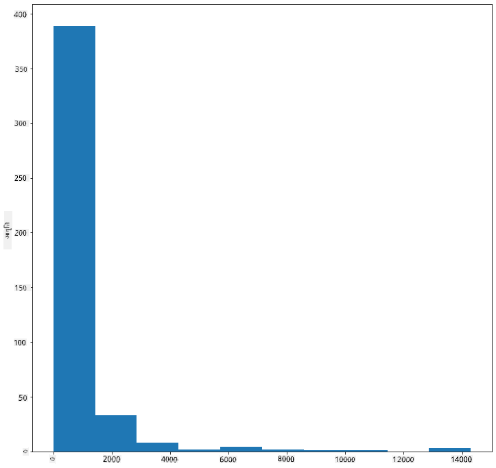

जैसा कि आप देख सकते हैं, इस डेटासेट के अधिकांश 400+ पक्षी अपने Max Body Mass के लिए 2000 से कम की सीमा में आते हैं। `bins` पैरामीटर को उच्च संख्या, जैसे 30 में बदलकर डेटा के बारे में अधिक जानकारी प्राप्त करें:

```python
birds['MaxBodyMass'].plot(kind = 'hist', bins = 30, figsize = (12,12))
plt.show()
```
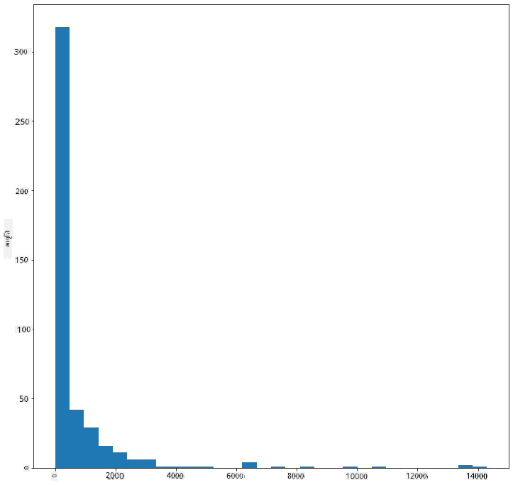

यह चार्ट वितरण को थोड़ा अधिक विस्तृत तरीके से दिखाता है। एक चार्ट जो बाईं ओर कम झुका हुआ हो, उसे केवल एक दिए गए सीमा के भीतर डेटा का चयन करके बनाया जा सकता है:

अपने डेटा को फ़िल्टर करें ताकि केवल वे पक्षी शामिल हों जिनका शरीर भार 60 से कम हो, और 40 `bins` दिखाएं:

```python
filteredBirds = birds[(birds['MaxBodyMass'] > 1) & (birds['MaxBodyMass'] < 60)]      
filteredBirds['MaxBodyMass'].plot(kind = 'hist',bins = 40,figsize = (12,12))
plt.show()     
```
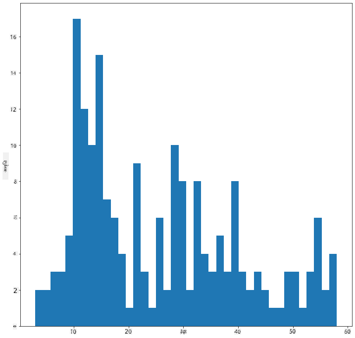

✅ कुछ अन्य फ़िल्टर और डेटा पॉइंट आज़माएं। डेटा के पूर्ण वितरण को देखने के लिए, `['MaxBodyMass']` फ़िल्टर को हटाएं ताकि लेबल वाले वितरण दिख सकें।

हिस्टोग्राम कुछ अच्छे रंग और लेबलिंग सुधार भी प्रदान करता है:

दो वितरणों के बीच संबंध की तुलना करने के लिए 2D हिस्टोग्राम बनाएं। आइए `MaxBodyMass` बनाम `MaxLength` की तुलना करें। Matplotlib एक अंतर्निहित तरीका प्रदान करता है जो उज्जवल रंगों का उपयोग करके संगम दिखाता है:

```python
x = filteredBirds['MaxBodyMass']
y = filteredBirds['MaxLength']

fig, ax = plt.subplots(tight_layout=True)
hist = ax.hist2d(x, y)
```
ऐसा प्रतीत होता है कि इन दो तत्वों के बीच एक अपेक्षित अक्ष के साथ एक अपेक्षित संबंध है, जिसमें संगम का एक विशेष रूप से मजबूत बिंदु है:

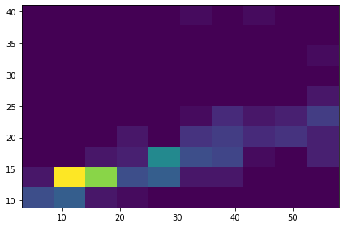

हिस्टोग्राम संख्यात्मक डेटा के लिए डिफ़ॉल्ट रूप से अच्छा काम करते हैं। यदि आपको टेक्स्ट डेटा के अनुसार वितरण देखना हो तो क्या करें?

## टेक्स्ट डेटा का उपयोग करके डेटासेट के वितरण का अन्वेषण करें

इस डेटासेट में पक्षी श्रेणी और इसके वंश, प्रजाति, और परिवार के साथ-साथ इसके संरक्षण स्थिति के बारे में अच्छी जानकारी भी शामिल है। आइए इस संरक्षण जानकारी का अन्वेषण करें। पक्षियों का वितरण उनकी संरक्षण स्थिति के अनुसार क्या है?

> ✅ इस डेटासेट में संरक्षण स्थिति का वर्णन करने के लिए कई संक्षेपाक्षर का उपयोग किया गया है। ये संक्षेपाक्षर [IUCN रेड लिस्ट श्रेणियों](https://www.iucnredlist.org/) से आते हैं, एक संगठन जो प्रजातियों की स्थिति को सूचीबद्ध करता है।
> 
> - CR: गंभीर रूप से संकटग्रस्त
> - EN: संकटग्रस्त
> - EX: विलुप्त
> - LC: कम चिंता
> - NT: निकट संकटग्रस्त
> - VU: असुरक्षित

ये टेक्स्ट-आधारित मान हैं इसलिए आपको हिस्टोग्राम बनाने के लिए एक ट्रांसफॉर्म करना होगा। फ़िल्टर किए गए पक्षियों के डेटा फ्रेम का उपयोग करके, इसकी संरक्षण स्थिति को न्यूनतम पंख चौड़ाई के साथ प्रदर्शित करें। आप क्या देखते हैं?

```python
x1 = filteredBirds.loc[filteredBirds.ConservationStatus=='EX', 'MinWingspan']
x2 = filteredBirds.loc[filteredBirds.ConservationStatus=='CR', 'MinWingspan']
x3 = filteredBirds.loc[filteredBirds.ConservationStatus=='EN', 'MinWingspan']
x4 = filteredBirds.loc[filteredBirds.ConservationStatus=='NT', 'MinWingspan']
x5 = filteredBirds.loc[filteredBirds.ConservationStatus=='VU', 'MinWingspan']
x6 = filteredBirds.loc[filteredBirds.ConservationStatus=='LC', 'MinWingspan']

kwargs = dict(alpha=0.5, bins=20)

plt.hist(x1, **kwargs, color='red', label='Extinct')
plt.hist(x2, **kwargs, color='orange', label='Critically Endangered')
plt.hist(x3, **kwargs, color='yellow', label='Endangered')
plt.hist(x4, **kwargs, color='green', label='Near Threatened')
plt.hist(x5, **kwargs, color='blue', label='Vulnerable')
plt.hist(x6, **kwargs, color='gray', label='Least Concern')

plt.gca().set(title='Conservation Status', ylabel='Min Wingspan')
plt.legend();
```

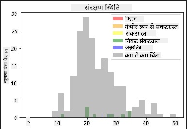

न्यूनतम पंख चौड़ाई और संरक्षण स्थिति के बीच कोई अच्छा संबंध प्रतीत नहीं होता। इस विधि का उपयोग करके डेटासेट के अन्य तत्वों का परीक्षण करें। आप विभिन्न फ़िल्टर भी आज़मा सकते हैं। क्या आपको कोई संबंध मिलता है?

## घनत्व प्लॉट्स

आपने देखा होगा कि अब तक हमने जो हिस्टोग्राम देखे हैं वे 'स्टेप्ड' हैं और एक आर्क में सुचारू रूप से प्रवाहित नहीं होते। एक सुचारू घनत्व चार्ट दिखाने के लिए, आप एक घनत्व प्लॉट आज़मा सकते हैं।

घनत्व प्लॉट्स के साथ काम करने के लिए, एक नई प्लॉटिंग लाइब्रेरी, [Seaborn](https://seaborn.pydata.org/generated/seaborn.kdeplot.html) से परिचित हों।

Seaborn लोड करें और एक बुनियादी घनत्व प्लॉट आज़माएं:

```python
import seaborn as sns
import matplotlib.pyplot as plt
sns.kdeplot(filteredBirds['MinWingspan'])
plt.show()
```
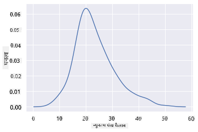

आप देख सकते हैं कि यह प्लॉट न्यूनतम पंख चौड़ाई डेटा के लिए पिछले प्लॉट को प्रतिध्वनित करता है; यह बस थोड़ा अधिक सुचारू है। Seaborn के दस्तावेज़ के अनुसार, "हिस्टोग्राम की तुलना में, KDE एक प्लॉट बना सकता है जो कम अव्यवस्थित और अधिक व्याख्यात्मक होता है, विशेष रूप से जब कई वितरण खींचे जाते हैं। लेकिन इसमें विकृतियां पेश करने की संभावना होती है यदि अंतर्निहित वितरण सीमित या असमर्थ होता है। जैसे कि एक हिस्टोग्राम, प्रतिनिधित्व की गुणवत्ता भी अच्छे स्मूथिंग पैरामीटर के चयन पर निर्भर करती है।" [स्रोत](https://seaborn.pydata.org/generated/seaborn.kdeplot.html) दूसरे शब्दों में, बाहरी मान हमेशा आपके चार्ट को खराब बना देंगे।

यदि आप उस जटिल MaxBodyMass लाइन को फिर से देखना चाहते हैं जिसे आपने दूसरे चार्ट में बनाया था, तो आप इसे इस विधि का उपयोग करके बहुत अच्छी तरह से सुचारू कर सकते हैं:

```python
sns.kdeplot(filteredBirds['MaxBodyMass'])
plt.show()
```
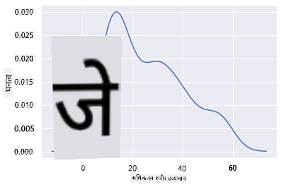

यदि आप एक सुचारू, लेकिन बहुत अधिक सुचारू रेखा नहीं चाहते हैं, तो `bw_adjust` पैरामीटर को संपादित करें:

```python
sns.kdeplot(filteredBirds['MaxBodyMass'], bw_adjust=.2)
plt.show()
```
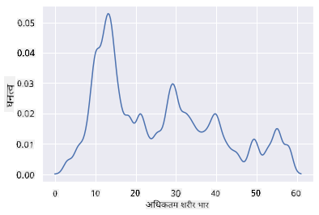

✅ इस प्रकार के प्लॉट के लिए उपलब्ध पैरामीटर के बारे में पढ़ें और प्रयोग करें!

यह प्रकार का चार्ट सुंदर व्याख्यात्मक विज़ुअलाइज़ेशन प्रदान करता है। उदाहरण के लिए, कुछ कोड की मदद से, आप पक्षी क्रम के अनुसार अधिकतम शरीर भार घनत्व दिखा सकते हैं:

```python
sns.kdeplot(
   data=filteredBirds, x="MaxBodyMass", hue="Order",
   fill=True, common_norm=False, palette="crest",
   alpha=.5, linewidth=0,
)
```

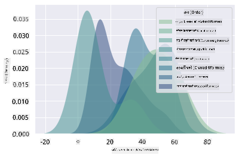

आप एक चार्ट में कई चर की घनत्व को भी मैप कर सकते हैं। पक्षी की अधिकतम लंबाई और न्यूनतम लंबाई की तुलना उनकी संरक्षण स्थिति के साथ करें:

```python
sns.kdeplot(data=filteredBirds, x="MinLength", y="MaxLength", hue="ConservationStatus")
```

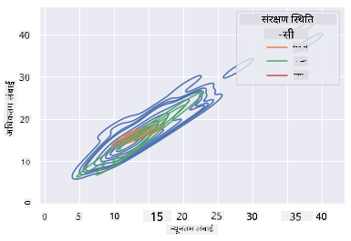

शायद यह शोध करने लायक है कि 'असुरक्षित' पक्षियों का उनके लंबाई के अनुसार समूह सार्थक है या नहीं।

## 🚀 चुनौती

हिस्टोग्राम बुनियादी स्कैटरप्लॉट्स, बार चार्ट्स, या लाइन चार्ट्स की तुलना में अधिक परिष्कृत प्रकार के चार्ट हैं। इंटरनेट पर खोज करें और हिस्टोग्राम के उपयोग के अच्छे उदाहरण खोजें। वे कैसे उपयोग किए जाते हैं, क्या प्रदर्शित करते हैं, और किन क्षेत्रों या पूछताछ के क्षेत्रों में उनका उपयोग किया जाता है?

## [पोस्ट-लेक्चर क्विज़](https://ff-quizzes.netlify.app/en/ds/)

## समीक्षा और स्व-अध्ययन

इस पाठ में, आपने Matplotlib का उपयोग किया और अधिक परिष्कृत चार्ट दिखाने के लिए Seaborn के साथ काम करना शुरू किया। Seaborn में `kdeplot`, एक "एक या अधिक आयामों में निरंतर संभावना घनत्व वक्र" पर शोध करें। [दस्तावेज़](https://seaborn.pydata.org/generated/seaborn.kdeplot.html) पढ़ें और समझें कि यह कैसे काम करता है।

## असाइनमेंट

[अपनी कौशल लागू करें](assignment.md)

---

**अस्वीकरण**:  
यह दस्तावेज़ AI अनुवाद सेवा [Co-op Translator](https://github.com/Azure/co-op-translator) का उपयोग करके अनुवादित किया गया है। जबकि हम सटीकता सुनिश्चित करने का प्रयास करते हैं, कृपया ध्यान दें कि स्वचालित अनुवाद में त्रुटियां या अशुद्धियां हो सकती हैं। मूल भाषा में उपलब्ध मूल दस्तावेज़ को आधिकारिक स्रोत माना जाना चाहिए। महत्वपूर्ण जानकारी के लिए, पेशेवर मानव अनुवाद की सिफारिश की जाती है। इस अनुवाद के उपयोग से उत्पन्न किसी भी गलतफहमी या गलत व्याख्या के लिए हम उत्तरदायी नहीं हैं।