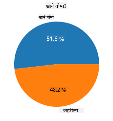
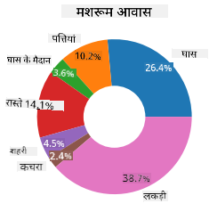
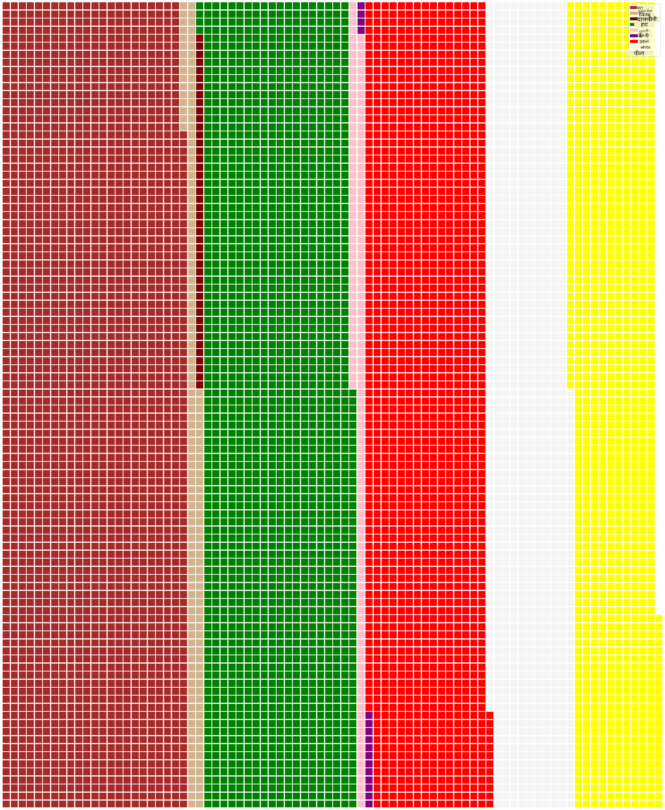

<!--
CO_OP_TRANSLATOR_METADATA:
{
  "original_hash": "cc490897ee2d276870472bcb31602d03",
  "translation_date": "2025-09-04T15:01:22+00:00",
  "source_file": "3-Data-Visualization/11-visualization-proportions/README.md",
  "language_code": "hi"
}
-->
# अनुपातों का दृश्यांकन

| द्वारा स्केच नोट ](../../sketchnotes/11-Visualizing-Proportions.png)|
|:---:|
|अनुपातों का दृश्यांकन - _[@nitya](https://twitter.com/nitya) द्वारा स्केच नोट_ |

इस पाठ में, आप एक अलग प्रकृति-केंद्रित डेटा सेट का उपयोग करके अनुपातों का दृश्यांकन करेंगे, जैसे कि मशरूम के बारे में दिए गए डेटा सेट में कितने प्रकार के कवक पाए जाते हैं। आइए इस अद्भुत कवक को Audubon से लिए गए डेटा सेट का उपयोग करके खोजें, जिसमें Agaricus और Lepiota परिवारों के 23 प्रजातियों के गिल्ड मशरूम का विवरण है। आप स्वादिष्ट चार्ट बनाने के लिए प्रयोग करेंगे जैसे:

- पाई चार्ट 🥧
- डोनट चार्ट 🍩
- वाफल चार्ट 🧇

> 💡 माइक्रोसॉफ्ट रिसर्च द्वारा एक बहुत ही दिलचस्प प्रोजेक्ट [Charticulator](https://charticulator.com) एक मुफ्त ड्रैग और ड्रॉप इंटरफ़ेस प्रदान करता है डेटा विज़ुअलाइज़ेशन के लिए। उनके एक ट्यूटोरियल में, वे इस मशरूम डेटा सेट का भी उपयोग करते हैं! तो आप डेटा का अन्वेषण कर सकते हैं और साथ ही लाइब्रेरी सीख सकते हैं: [Charticulator ट्यूटोरियल](https://charticulator.com/tutorials/tutorial4.html)।

## [पाठ के बाद क्विज़](https://ff-quizzes.netlify.app/en/ds/)

## अपने मशरूम को जानें 🍄

मशरूम बहुत दिलचस्प होते हैं। आइए एक डेटा सेट आयात करें और उनका अध्ययन करें:

```python
import pandas as pd
import matplotlib.pyplot as plt
mushrooms = pd.read_csv('../../data/mushrooms.csv')
mushrooms.head()
```
एक तालिका प्रिंट होती है जिसमें विश्लेषण के लिए शानदार डेटा होता है:

| वर्ग       | टोपी-आकार | टोपी-सतह | टोपी-रंग | चोटें | गंध    | गिल-अटैचमेंट | गिल-दूरी | गिल-आकार | गिल-रंग | डंठल-आकार | डंठल-जड़ | डंठल-सतह-ऊपर-रिंग | डंठल-सतह-नीचे-रिंग | डंठल-रंग-ऊपर-रिंग | डंठल-रंग-नीचे-रिंग | घूंघट-प्रकार | घूंघट-रंग | रिंग-संख्या | रिंग-प्रकार | बीजाणु-प्रिंट-रंग | जनसंख्या | निवास |
| --------- | --------- | ----------- | --------- | ------- | ------- | --------------- | ------------ | --------- | ---------- | ----------- | ---------- | ------------------------ | ------------------------ | ---------------------- | ---------------------- | --------- | ---------- | ----------- | --------- | ----------------- | ---------- | ------- |
| विषैला     | उत्तल    | चिकना      | भूरा     | चोटें  | तीव्र   | मुक्त           | पास         | संकीर्ण   | काला      | चौड़ा       | समान      | चिकना                   | चिकना                   | सफेद                  | सफेद                  | आंशिक     | सफेद      | एक         | लटकता    | काला             | बिखरा हुआ | शहरी   |
| खाने योग्य | उत्तल    | चिकना      | पीला     | चोटें  | बादाम   | मुक्त           | पास         | चौड़ा     | काला      | चौड़ा       | क्लब      | चिकना                   | चिकना                   | सफेद                  | सफेद                  | आंशिक     | सफेद      | एक         | लटकता    | भूरा             | बहुतायत   | घास |
| खाने योग्य | घंटी      | चिकना      | सफेद     | चोटें  | सौंफ    | मुक्त           | पास         | चौड़ा     | भूरा      | चौड़ा       | क्लब      | चिकना                   | चिकना                   | सफेद                  | सफेद                  | आंशिक     | सफेद      | एक         | लटकता    | भूरा             | बहुतायत   | घास के मैदान |
| विषैला     | उत्तल    | खुरदरा     | सफेद     | चोटें  | तीव्र   | मुक्त           | पास         | संकीर्ण   | भूरा      | चौड़ा       | समान      | चिकना                   | चिकना                   | सफेद                  | सफेद                  | आंशिक     | सफेद      | एक         | लटकता    | काला             | बिखरा हुआ | शहरी   |

जैसे ही आप देखते हैं, सारा डेटा टेक्स्ट के रूप में है। आपको इस डेटा को चार्ट में उपयोग करने के लिए बदलना होगा। वास्तव में, अधिकांश डेटा एक ऑब्जेक्ट के रूप में प्रस्तुत किया गया है:

```python
print(mushrooms.select_dtypes(["object"]).columns)
```

आउटपुट है:

```output
Index(['class', 'cap-shape', 'cap-surface', 'cap-color', 'bruises', 'odor',
       'gill-attachment', 'gill-spacing', 'gill-size', 'gill-color',
       'stalk-shape', 'stalk-root', 'stalk-surface-above-ring',
       'stalk-surface-below-ring', 'stalk-color-above-ring',
       'stalk-color-below-ring', 'veil-type', 'veil-color', 'ring-number',
       'ring-type', 'spore-print-color', 'population', 'habitat'],
      dtype='object')
```
इस डेटा को लें और 'वर्ग' कॉलम को एक श्रेणी में बदलें:

```python
cols = mushrooms.select_dtypes(["object"]).columns
mushrooms[cols] = mushrooms[cols].astype('category')
```

```python
edibleclass=mushrooms.groupby(['class']).count()
edibleclass
```

अब, यदि आप मशरूम डेटा को प्रिंट करते हैं, तो आप देख सकते हैं कि इसे विषैला/खाने योग्य वर्ग के अनुसार श्रेणियों में समूहित किया गया है:

|           | टोपी-आकार | टोपी-सतह | टोपी-रंग | चोटें | गंध | गिल-अटैचमेंट | गिल-दूरी | गिल-आकार | गिल-रंग | डंठल-आकार | ... | डंठल-सतह-नीचे-रिंग | डंठल-रंग-ऊपर-रिंग | डंठल-रंग-नीचे-रिंग | घूंघट-प्रकार | घूंघट-रंग | रिंग-संख्या | रिंग-प्रकार | बीजाणु-प्रिंट-रंग | जनसंख्या | निवास |
| --------- | --------- | ----------- | --------- | ------- | ---- | --------------- | ------------ | --------- | ---------- | ----------- | --- | ------------------------ | ---------------------- | ---------------------- | --------- | ---------- | ----------- | --------- | ----------------- | ---------- | ------- |
| वर्ग       |           |             |           |         |      |                 |              |           |            |             |     |                          |                        |                        |           |            |             |           |                   |            |         |
| खाने योग्य | 4208      | 4208        | 4208      | 4208    | 4208 | 4208            | 4208         | 4208      | 4208       | 4208        | ... | 4208                     | 4208                   | 4208                   | 4208      | 4208       | 4208        | 4208      | 4208              | 4208       | 4208    |
| विषैला     | 3916      | 3916        | 3916      | 3916    | 3916 | 3916            | 3916         | 3916      | 3916       | 3916        | ... | 3916                     | 3916                   | 3916                   | 3916      | 3916       | 3916        | 3916      | 3916              | 3916       | 3916    |

यदि आप इस तालिका में प्रस्तुत क्रम का पालन करते हुए अपने वर्ग श्रेणी लेबल बनाते हैं, तो आप एक पाई चार्ट बना सकते हैं:

## पाई!

```python
labels=['Edible','Poisonous']
plt.pie(edibleclass['population'],labels=labels,autopct='%.1f %%')
plt.title('Edible?')
plt.show()
```
लीजिए, एक पाई चार्ट जो इस डेटा को मशरूम के इन दो वर्गों के अनुसार दिखाता है। लेबल के क्रम को सही रखना बहुत महत्वपूर्ण है, खासकर यहां, इसलिए सुनिश्चित करें कि लेबल एरे के निर्माण के क्रम को सत्यापित करें!



## डोनट्स!

पाई चार्ट का एक और अधिक दृश्यात्मक रूप से दिलचस्प संस्करण डोनट चार्ट है, जो एक पाई चार्ट है जिसमें बीच में एक छेद होता है। आइए इस विधि का उपयोग करके हमारे डेटा को देखें।

उन विभिन्न निवास स्थानों पर नज़र डालें जहां मशरूम उगते हैं:

```python
habitat=mushrooms.groupby(['habitat']).count()
habitat
```
यहां, आप अपने डेटा को निवास स्थान के अनुसार समूहित कर रहे हैं। 7 सूचीबद्ध हैं, इसलिए इनका उपयोग अपने डोनट चार्ट के लेबल के रूप में करें:

```python
labels=['Grasses','Leaves','Meadows','Paths','Urban','Waste','Wood']

plt.pie(habitat['class'], labels=labels,
        autopct='%1.1f%%', pctdistance=0.85)
  
center_circle = plt.Circle((0, 0), 0.40, fc='white')
fig = plt.gcf()

fig.gca().add_artist(center_circle)
  
plt.title('Mushroom Habitats')
  
plt.show()
```



यह कोड एक चार्ट और एक केंद्र वृत्त बनाता है, फिर उस केंद्र वृत्त को चार्ट में जोड़ता है। केंद्र वृत्त की चौड़ाई को बदलने के लिए `0.40` को किसी अन्य मान में बदलें।

डोनट चार्ट को कई तरीकों से समायोजित किया जा सकता है ताकि लेबल को बदला जा सके। विशेष रूप से लेबल को पठनीयता के लिए हाइलाइट किया जा सकता है। अधिक जानें [डॉक्स](https://matplotlib.org/stable/gallery/pie_and_polar_charts/pie_and_donut_labels.html?highlight=donut) में।

अब जब आप जानते हैं कि अपने डेटा को कैसे समूहित करें और फिर इसे पाई या डोनट के रूप में प्रदर्शित करें, तो आप अन्य प्रकार के चार्ट का अन्वेषण कर सकते हैं। वाफल चार्ट आज़माएं, जो मात्रा का पता लगाने का एक अलग तरीका है।

## वाफल्स!

'वाफल' प्रकार का चार्ट मात्रा को 2D वर्गों के रूप में दिखाने का एक अलग तरीका है। इस डेटा सेट में मशरूम टोपी के रंगों की विभिन्न मात्राओं को दृश्यांकित करने का प्रयास करें। ऐसा करने के लिए, आपको [PyWaffle](https://pypi.org/project/pywaffle/) नामक एक सहायक लाइब्रेरी को स्थापित करना होगा और Matplotlib का उपयोग करना होगा:

```python
pip install pywaffle
```

अपने डेटा के एक खंड को समूहित करें:

```python
capcolor=mushrooms.groupby(['cap-color']).count()
capcolor
```

लेबल बनाकर और फिर अपने डेटा को समूहित करके एक वाफल चार्ट बनाएं:

```python
import pandas as pd
import matplotlib.pyplot as plt
from pywaffle import Waffle
  
data ={'color': ['brown', 'buff', 'cinnamon', 'green', 'pink', 'purple', 'red', 'white', 'yellow'],
    'amount': capcolor['class']
     }
  
df = pd.DataFrame(data)
  
fig = plt.figure(
    FigureClass = Waffle,
    rows = 100,
    values = df.amount,
    labels = list(df.color),
    figsize = (30,30),
    colors=["brown", "tan", "maroon", "green", "pink", "purple", "red", "whitesmoke", "yellow"],
)
```

वाफल चार्ट का उपयोग करके, आप इस मशरूम डेटा सेट के टोपी रंगों के अनुपात को स्पष्ट रूप से देख सकते हैं। दिलचस्प बात यह है कि कई हरे रंग की टोपी वाले मशरूम हैं!



✅ PyWaffle चार्ट में आइकन का समर्थन करता है जो [Font Awesome](https://fontawesome.com/) में उपलब्ध किसी भी आइकन का उपयोग करता है। वर्गों के बजाय आइकन का उपयोग करके एक और अधिक दिलचस्प वाफल चार्ट बनाने के लिए कुछ प्रयोग करें।

इस पाठ में, आपने अनुपातों को दृश्यांकित करने के तीन तरीके सीखे। सबसे पहले, आपको अपने डेटा को श्रेणियों में समूहित करना होगा और फिर यह तय करना होगा कि डेटा को प्रदर्शित करने का सबसे अच्छा तरीका कौन सा है - पाई, डोनट, या वाफल। सभी स्वादिष्ट हैं और उपयोगकर्ता को डेटा सेट का एक त्वरित स्नैपशॉट प्रदान करते हैं।

## 🚀 चुनौती

इन स्वादिष्ट चार्ट को [Charticulator](https://charticulator.com) में फिर से बनाने का प्रयास करें।
## [पाठ के बाद क्विज़](https://purple-hill-04aebfb03.1.azurestaticapps.net/quiz/21)

## समीक्षा और स्व-अध्ययन

कभी-कभी यह स्पष्ट नहीं होता कि पाई, डोनट, या वाफल चार्ट का उपयोग कब करना है। इस विषय पर पढ़ने के लिए यहां कुछ लेख दिए गए हैं:

https://www.beautiful.ai/blog/battle-of-the-charts-pie-chart-vs-donut-chart

https://medium.com/@hypsypops/pie-chart-vs-donut-chart-showdown-in-the-ring-5d24fd86a9ce

https://www.mit.edu/~mbarker/formula1/f1help/11-ch-c6.htm

https://medium.datadriveninvestor.com/data-visualization-done-the-right-way-with-tableau-waffle-chart-fdf2a19be402

इस जटिल निर्णय पर अधिक जानकारी प्राप्त करने के लिए कुछ शोध करें।
## असाइनमेंट

[इसे Excel में आज़माएं](assignment.md)

---

**अस्वीकरण**:  
यह दस्तावेज़ AI अनुवाद सेवा [Co-op Translator](https://github.com/Azure/co-op-translator) का उपयोग करके अनुवादित किया गया है। जबकि हम सटीकता सुनिश्चित करने का प्रयास करते हैं, कृपया ध्यान दें कि स्वचालित अनुवाद में त्रुटियां या अशुद्धियां हो सकती हैं। मूल भाषा में उपलब्ध मूल दस्तावेज़ को प्रामाणिक स्रोत माना जाना चाहिए। महत्वपूर्ण जानकारी के लिए, पेशेवर मानव अनुवाद की सिफारिश की जाती है। इस अनुवाद के उपयोग से उत्पन्न किसी भी गलतफहमी या गलत व्याख्या के लिए हम उत्तरदायी नहीं हैं।