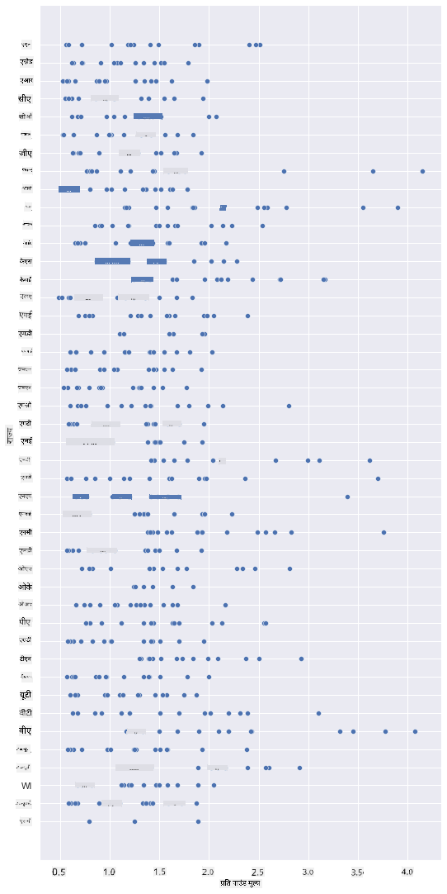
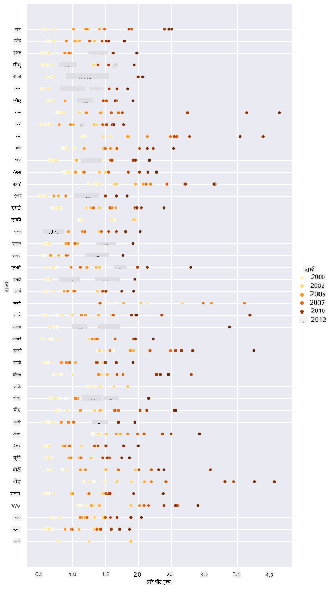
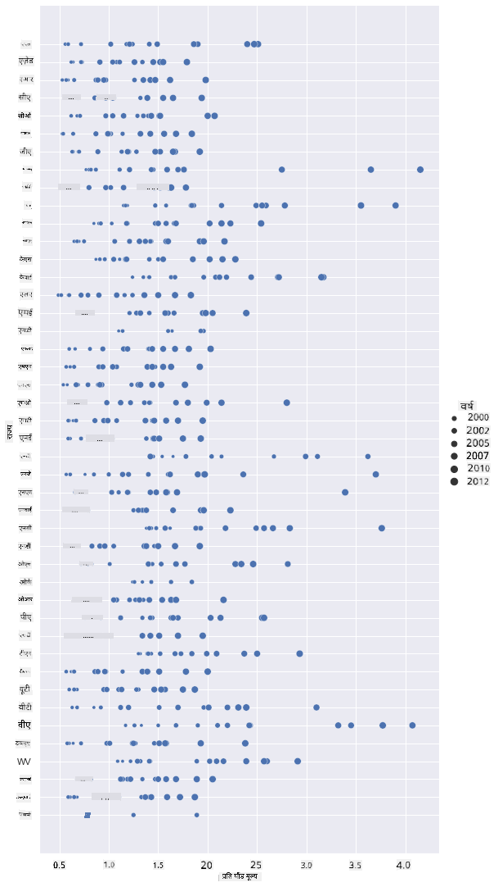
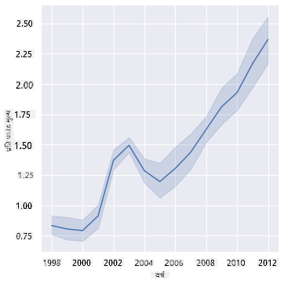
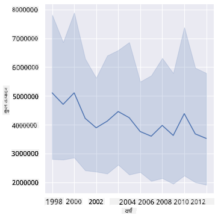
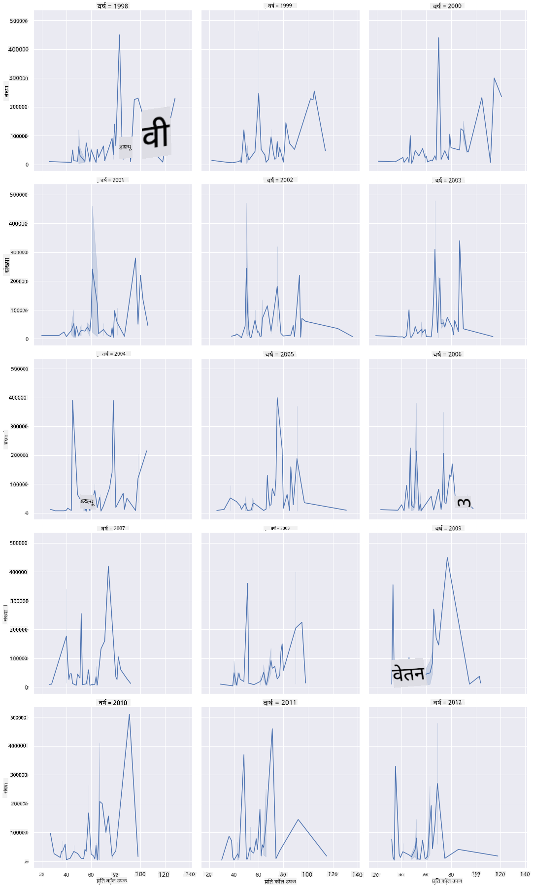
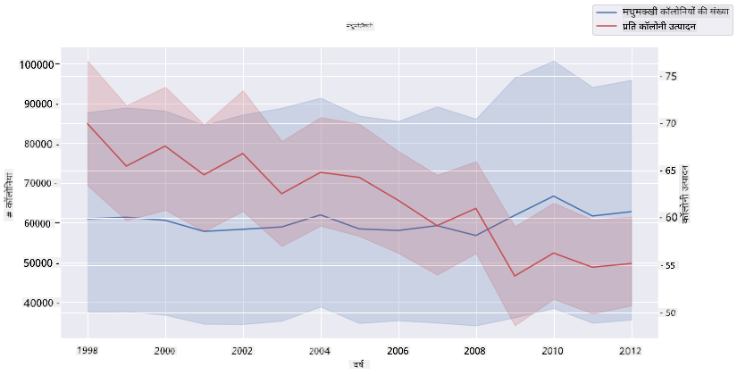

<!--
CO_OP_TRANSLATOR_METADATA:
{
  "original_hash": "b29e427401499e81f4af55a8c4afea76",
  "translation_date": "2025-09-04T15:03:14+00:00",
  "source_file": "3-Data-Visualization/12-visualization-relationships/README.md",
  "language_code": "hi"
}
-->
# संबंधों का दृश्यांकन: शहद के बारे में सब कुछ 🍯

| द्वारा ](../../sketchnotes/12-Visualizing-Relationships.png)|
|:---:|
|संबंधों का दृश्यांकन - _[@nitya](https://twitter.com/nitya) द्वारा स्केच नोट_ |

हमारे शोध के प्रकृति-केंद्रित दृष्टिकोण को जारी रखते हुए, आइए विभिन्न प्रकार के शहद के बीच संबंधों को दिखाने के लिए दिलचस्प दृश्यांकन खोजें। यह डेटा सेट [संयुक्त राज्य कृषि विभाग](https://www.nass.usda.gov/About_NASS/index.php) से लिया गया है। 

यह लगभग 600 आइटम्स का डेटा सेट कई अमेरिकी राज्यों में शहद उत्पादन को दर्शाता है। उदाहरण के लिए, आप 1998-2012 के बीच किसी दिए गए राज्य में प्रति वर्ष कॉलोनियों की संख्या, प्रति कॉलोनी उत्पादन, कुल उत्पादन, स्टॉक्स, प्रति पाउंड कीमत और उत्पादित शहद के मूल्य को देख सकते हैं, जिसमें प्रत्येक राज्य के लिए प्रति वर्ष एक पंक्ति है। 

यह देखना दिलचस्प होगा कि किसी दिए गए राज्य के वार्षिक उत्पादन और उस राज्य में शहद की कीमत के बीच क्या संबंध है। वैकल्पिक रूप से, आप राज्यों के प्रति कॉलोनी शहद उत्पादन के बीच संबंध को भी देख सकते हैं। यह समयावधि 2006 में पहली बार देखे गए 'सीसीडी' या 'कॉलोनी कोलैप्स डिसऑर्डर' (http://npic.orst.edu/envir/ccd.html) को भी कवर करती है, इसलिए यह अध्ययन के लिए एक महत्वपूर्ण डेटा सेट है। 🐝

## [प्री-लेक्चर क्विज़](https://purple-hill-04aebfb03.1.azurestaticapps.net/quiz/22)

इस पाठ में, आप Seaborn का उपयोग कर सकते हैं, जिसे आपने पहले भी उपयोग किया है, जो चर के बीच संबंधों को दृश्यात्मक बनाने के लिए एक अच्छा पुस्तकालय है। विशेष रूप से दिलचस्प है Seaborn के `relplot` फ़ंक्शन का उपयोग, जो स्कैटर प्लॉट्स और लाइन प्लॉट्स को जल्दी से '[सांख्यिकीय संबंधों](https://seaborn.pydata.org/tutorial/relational.html?highlight=relationships)' को दिखाने की अनुमति देता है, जिससे डेटा वैज्ञानिक यह बेहतर समझ सकते हैं कि चर एक-दूसरे से कैसे संबंधित हैं।

## स्कैटरप्लॉट्स

स्कैटरप्लॉट का उपयोग करके दिखाएं कि शहद की कीमत साल दर साल, प्रति राज्य कैसे विकसित हुई है। Seaborn, `relplot` का उपयोग करते हुए, राज्य डेटा को सुविधाजनक रूप से समूहित करता है और श्रेणीबद्ध और संख्यात्मक डेटा दोनों के लिए डेटा पॉइंट्स प्रदर्शित करता है। 

आइए डेटा और Seaborn को इंपोर्ट करके शुरू करें:

```python
import pandas as pd
import matplotlib.pyplot as plt
import seaborn as sns
honey = pd.read_csv('../../data/honey.csv')
honey.head()
```
आप देखेंगे कि शहद डेटा में कई दिलचस्प कॉलम हैं, जिनमें वर्ष और प्रति पाउंड कीमत शामिल हैं। आइए इस डेटा का अन्वेषण करें, जिसे अमेरिकी राज्यों द्वारा समूहित किया गया है:

| राज्य | कॉलोनियों की संख्या | प्रति कॉलोनी उत्पादन | कुल उत्पादन | स्टॉक्स   | प्रति पाउंड कीमत | उत्पादन मूल्य | वर्ष |
| ----- | ------------------- | ------------------- | ----------- | --------- | --------------- | ------------- | ---- |
| AL    | 16000              | 71                | 1136000     | 159000    | 0.72            | 818000        | 1998 |
| AZ    | 55000              | 60                | 3300000     | 1485000   | 0.64            | 2112000       | 1998 |
| AR    | 53000              | 65                | 3445000     | 1688000   | 0.59            | 2033000       | 1998 |
| CA    | 450000             | 83                | 37350000    | 12326000  | 0.62            | 23157000      | 1998 |
| CO    | 27000              | 72                | 1944000     | 1594000   | 0.7             | 1361000       | 1998 |

एक बुनियादी स्कैटरप्लॉट बनाएं जो शहद की प्रति पाउंड कीमत और उसके अमेरिकी राज्य के मूल के बीच संबंध दिखाए। `y` अक्ष को इतना लंबा बनाएं कि सभी राज्यों को प्रदर्शित किया जा सके:

```python
sns.relplot(x="priceperlb", y="state", data=honey, height=15, aspect=.5);
```


अब, उसी डेटा को शहद के रंग योजना के साथ दिखाएं ताकि यह दिखाया जा सके कि कीमत वर्षों में कैसे विकसित हुई है। आप ऐसा 'hue' पैरामीटर जोड़कर कर सकते हैं, जो साल दर साल बदलाव दिखाता है:

> ✅ Seaborn में उपयोग की जा सकने वाली [रंग योजनाओं के बारे में अधिक जानें](https://seaborn.pydata.org/tutorial/color_palettes.html) - एक सुंदर इंद्रधनुष रंग योजना आज़माएं!

```python
sns.relplot(x="priceperlb", y="state", hue="year", palette="YlOrBr", data=honey, height=15, aspect=.5);
```


इस रंग योजना परिवर्तन के साथ, आप देख सकते हैं कि वर्षों में शहद की प्रति पाउंड कीमत में स्पष्ट रूप से एक मजबूत प्रगति है। वास्तव में, यदि आप डेटा में एक नमूना सेट (उदाहरण के लिए, एरिज़ोना) को सत्यापित करने के लिए देखते हैं, तो आप देख सकते हैं कि कुछ अपवादों को छोड़कर, कीमत में साल दर साल वृद्धि का एक पैटर्न है:

| राज्य | कॉलोनियों की संख्या | प्रति कॉलोनी उत्पादन | कुल उत्पादन | स्टॉक्स  | प्रति पाउंड कीमत | उत्पादन मूल्य | वर्ष |
| ----- | ------------------- | ------------------- | ----------- | ------- | --------------- | ------------- | ---- |
| AZ    | 55000              | 60                | 3300000     | 1485000 | 0.64            | 2112000       | 1998 |
| AZ    | 52000              | 62                | 3224000     | 1548000 | 0.62            | 1999000       | 1999 |
| AZ    | 40000              | 59                | 2360000     | 1322000 | 0.73            | 1723000       | 2000 |
| AZ    | 43000              | 59                | 2537000     | 1142000 | 0.72            | 1827000       | 2001 |
| AZ    | 38000              | 63                | 2394000     | 1197000 | 1.08            | 2586000       | 2002 |
| AZ    | 35000              | 72                | 2520000     | 983000  | 1.34            | 3377000       | 2003 |
| AZ    | 32000              | 55                | 1760000     | 774000  | 1.11            | 1954000       | 2004 |
| AZ    | 36000              | 50                | 1800000     | 720000  | 1.04            | 1872000       | 2005 |
| AZ    | 30000              | 65                | 1950000     | 839000  | 0.91            | 1775000       | 2006 |
| AZ    | 30000              | 64                | 1920000     | 902000  | 1.26            | 2419000       | 2007 |
| AZ    | 25000              | 64                | 1600000     | 336000  | 1.26            | 2016000       | 2008 |
| AZ    | 20000              | 52                | 1040000     | 562000  | 1.45            | 1508000       | 2009 |
| AZ    | 24000              | 77                | 1848000     | 665000  | 1.52            | 2809000       | 2010 |
| AZ    | 23000              | 53                | 1219000     | 427000  | 1.55            | 1889000       | 2011 |
| AZ    | 22000              | 46                | 1012000     | 253000  | 1.79            | 1811000       | 2012 |

एक और तरीका इस प्रगति को दिखाने का यह है कि रंग के बजाय आकार का उपयोग करें। रंग-अंधता वाले उपयोगकर्ताओं के लिए, यह एक बेहतर विकल्प हो सकता है। अपने दृश्यांकन को संपादित करें ताकि कीमत में वृद्धि को डॉट के परिधि में वृद्धि के रूप में दिखाया जा सके:

```python
sns.relplot(x="priceperlb", y="state", size="year", data=honey, height=15, aspect=.5);
```
आप देख सकते हैं कि डॉट्स का आकार धीरे-धीरे बढ़ रहा है।



क्या यह आपूर्ति और मांग का एक साधारण मामला है? जलवायु परिवर्तन और कॉलोनी कोलैप्स जैसे कारकों के कारण, क्या साल दर साल खरीदने के लिए कम शहद उपलब्ध है, और इसीलिए कीमत बढ़ रही है?

इन डेटा सेट में कुछ चर के बीच सहसंबंध खोजने के लिए, आइए कुछ लाइन चार्ट्स का अन्वेषण करें। 

## लाइन चार्ट्स

प्रश्न: क्या शहद की प्रति पाउंड कीमत में साल दर साल स्पष्ट वृद्धि है? आप इसे सबसे आसानी से एक सिंगल लाइन चार्ट बनाकर देख सकते हैं:

```python
sns.relplot(x="year", y="priceperlb", kind="line", data=honey);
```
उत्तर: हां, कुछ अपवादों के साथ, विशेष रूप से 2003 के आसपास:



✅ चूंकि Seaborn डेटा को एक लाइन के चारों ओर समेकित कर रहा है, यह "प्रत्येक x मान पर कई मापों को औसत और औसत के चारों ओर 95% विश्वास अंतराल को प्लॉट करता है"। [स्रोत](https://seaborn.pydata.org/tutorial/relational.html)। इस समय लेने वाले व्यवहार को `ci=None` जोड़कर अक्षम किया जा सकता है।

प्रश्न: खैर, 2003 में क्या हम शहद की आपूर्ति में भी वृद्धि देख सकते हैं? यदि आप कुल उत्पादन को साल दर साल देखते हैं तो क्या होता है?

```python
sns.relplot(x="year", y="totalprod", kind="line", data=honey);
```



उत्तर: वास्तव में नहीं। यदि आप कुल उत्पादन को देखते हैं, तो ऐसा लगता है कि यह विशेष वर्ष में वास्तव में बढ़ गया है, हालांकि सामान्य रूप से इन वर्षों के दौरान उत्पादित शहद की मात्रा में गिरावट हो रही है।

प्रश्न: उस स्थिति में, 2003 के आसपास शहद की कीमत में उस वृद्धि का कारण क्या हो सकता है?

इसे खोजने के लिए, आप एक फेसट ग्रिड का अन्वेषण कर सकते हैं।

## फेसट ग्रिड्स

फेसट ग्रिड्स आपके डेटा सेट के एक पहलू (हमारे मामले में, आप 'वर्ष' चुन सकते हैं ताकि बहुत अधिक ग्रिड्स न बनें) को लेते हैं। Seaborn फिर आपके चुने गए x और y निर्देशांक के लिए प्रत्येक पहलू का एक प्लॉट बना सकता है, जिससे तुलना करना आसान हो जाता है। क्या 2003 इस प्रकार की तुलना में अलग दिखता है?

Seaborn के दस्तावेज़ों में सुझाए गए अनुसार `relplot` का उपयोग जारी रखते हुए एक फेसट ग्रिड बनाएं। 

```python
sns.relplot(
    data=honey, 
    x="yieldpercol", y="numcol",
    col="year", 
    col_wrap=3,
    kind="line"
```
इस दृश्यांकन में, आप कॉलोनी की प्रति कॉलोनी उपज और कॉलोनियों की संख्या को साल दर साल, राज्य दर राज्य, 3 कॉलम के रैप के साथ साइड बाय साइड तुलना कर सकते हैं:



इस डेटा सेट के लिए, कॉलोनियों की संख्या और उनकी उपज के संबंध में, साल दर साल और राज्य दर राज्य, कुछ खास नहीं दिखता। क्या इन दो चर के बीच सहसंबंध खोजने का कोई और तरीका है?

## डुअल-लाइन प्लॉट्स

Seaborn के 'despine' का उपयोग करके दो लाइनप्लॉट्स को एक-दूसरे के ऊपर सुपरइंपोज़ करें, और `ax.twinx` [Matplotlib से लिया गया](https://matplotlib.org/stable/api/_as_gen/matplotlib.axes.Axes.twinx.html) का उपयोग करें। Twinx एक चार्ट को x अक्ष साझा करने और दो y अक्ष प्रदर्शित करने की अनुमति देता है। तो, प्रति कॉलोनी उपज और कॉलोनियों की संख्या को सुपरइंपोज़ करें:

```python
fig, ax = plt.subplots(figsize=(12,6))
lineplot = sns.lineplot(x=honey['year'], y=honey['numcol'], data=honey, 
                        label = 'Number of bee colonies', legend=False)
sns.despine()
plt.ylabel('# colonies')
plt.title('Honey Production Year over Year');

ax2 = ax.twinx()
lineplot2 = sns.lineplot(x=honey['year'], y=honey['yieldpercol'], ax=ax2, color="r", 
                         label ='Yield per colony', legend=False) 
sns.despine(right=False)
plt.ylabel('colony yield')
ax.figure.legend();
```


हालांकि 2003 के आसपास कुछ भी स्पष्ट रूप से नहीं दिखता, यह हमें इस पाठ को एक खुशहाल नोट पर समाप्त करने की अनुमति देता है: जबकि कॉलोनियों की कुल संख्या में गिरावट हो रही है, कॉलोनियों की संख्या स्थिर हो रही है, भले ही उनकी प्रति कॉलोनी उपज घट रही हो।

जाओ, मधुमक्खियां, जाओ!

🐝❤️
## 🚀 चुनौती

इस पाठ में, आपने स्कैटरप्लॉट्स और लाइन ग्रिड्स के अन्य उपयोगों के बारे में थोड़ा और सीखा, जिसमें फेसट ग्रिड्स शामिल हैं। खुद को चुनौती दें कि आप एक अलग डेटा सेट का उपयोग करके एक फेसट ग्रिड बनाएं, शायद वह जिसे आपने इन पाठों से पहले उपयोग किया हो। ध्यान दें कि उन्हें बनाने में कितना समय लगता है और इन तकनीकों का उपयोग करते समय आपको कितने ग्रिड्स बनाने में सावधानी बरतनी चाहिए।

## [पोस्ट-लेक्चर क्विज़](https://ff-quizzes.netlify.app/en/ds/)

## समीक्षा और स्व-अध्ययन

लाइन प्लॉट्स सरल या काफी जटिल हो सकते हैं। [Seaborn दस्तावेज़](https://seaborn.pydata.org/generated/seaborn.lineplot.html) में थोड़ा और पढ़ें कि आप उन्हें बनाने के विभिन्न तरीकों के बारे में जान सकते हैं। उन तरीकों को आज़माएं जो आपने इस पाठ में बनाए गए लाइन चार्ट्स को अन्य तरीकों से सुधारने के लिए सूचीबद्ध किए हैं।
## असाइनमेंट

[मधुमक्खी के छत्ते में गोता लगाएं](assignment.md)

---

**अस्वीकरण**:  
यह दस्तावेज़ AI अनुवाद सेवा [Co-op Translator](https://github.com/Azure/co-op-translator) का उपयोग करके अनुवादित किया गया है। जबकि हम सटीकता सुनिश्चित करने का प्रयास करते हैं, कृपया ध्यान दें कि स्वचालित अनुवाद में त्रुटियां या अशुद्धियां हो सकती हैं। मूल भाषा में उपलब्ध मूल दस्तावेज़ को आधिकारिक स्रोत माना जाना चाहिए। महत्वपूर्ण जानकारी के लिए, पेशेवर मानव अनुवाद की सिफारिश की जाती है। इस अनुवाद के उपयोग से उत्पन्न किसी भी गलतफहमी या गलत व्याख्या के लिए हम जिम्मेदार नहीं हैं।