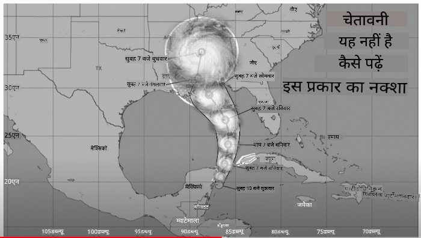
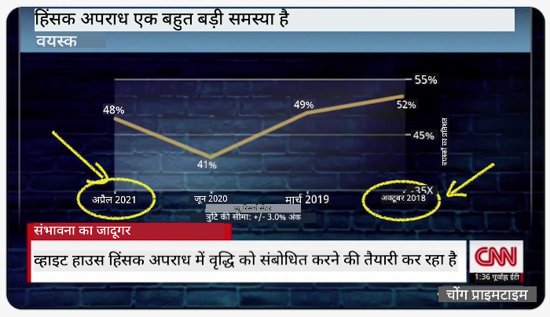
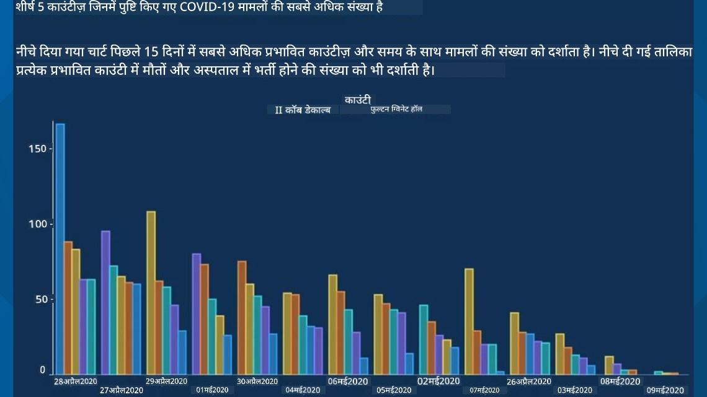
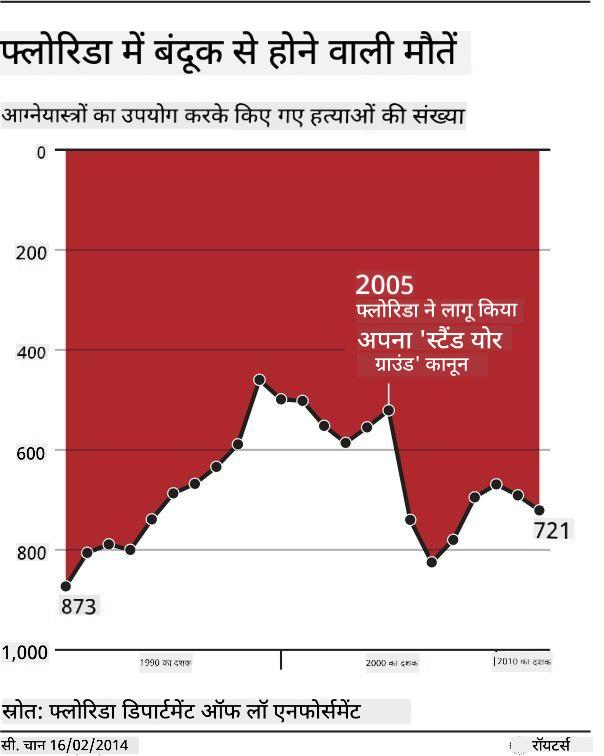
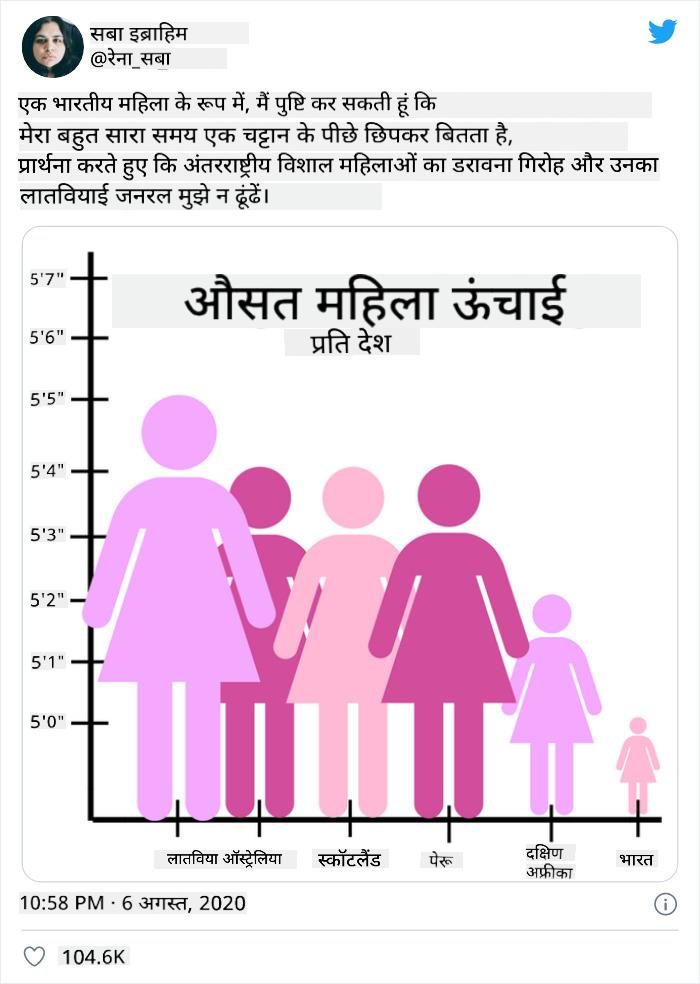
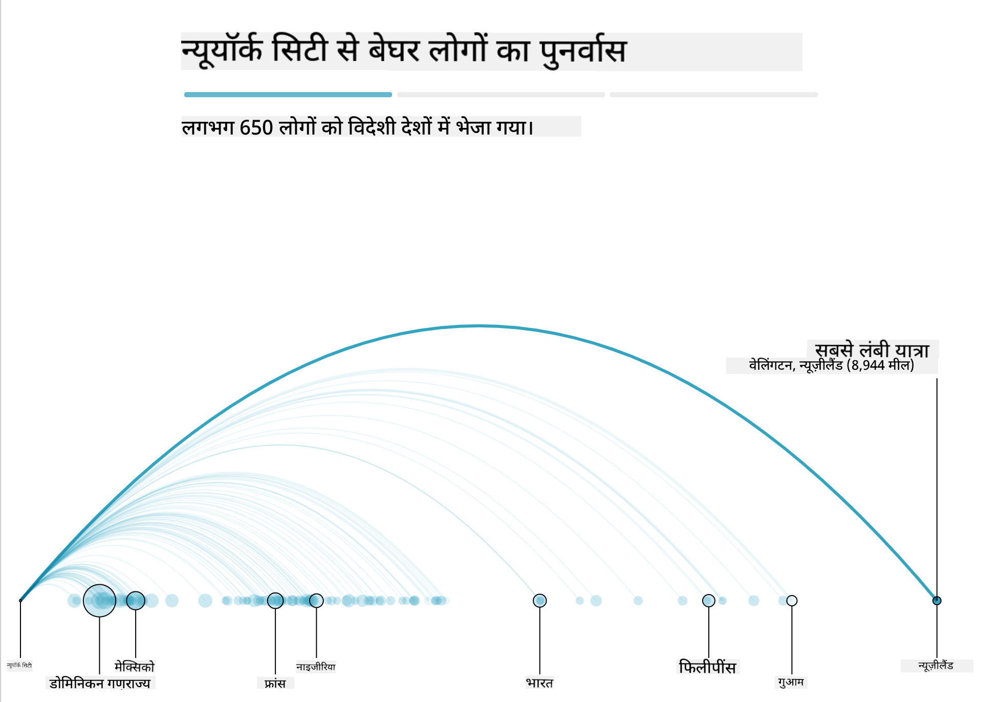
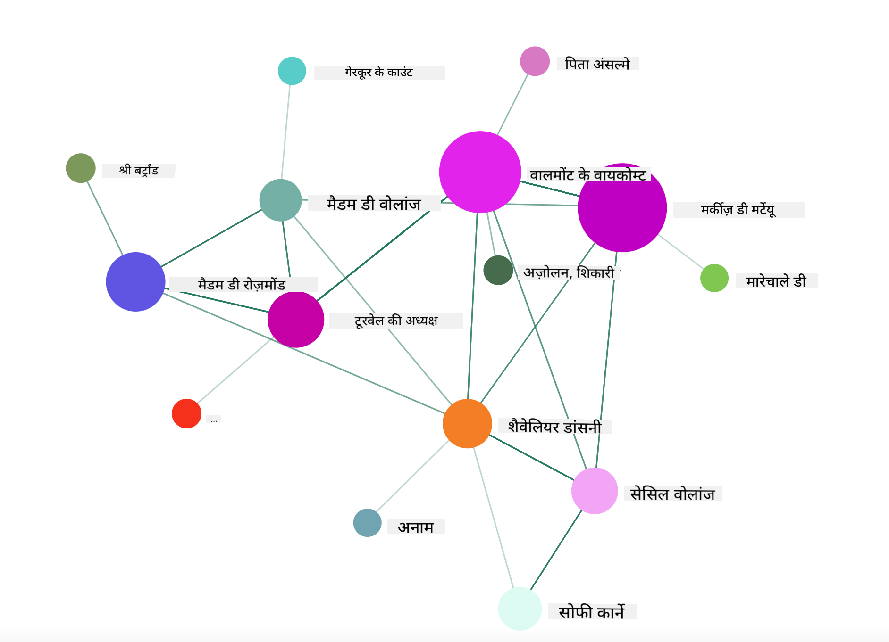

<!--
CO_OP_TRANSLATOR_METADATA:
{
  "original_hash": "0b380bb6d34102bb061eb41de23d9834",
  "translation_date": "2025-09-04T15:02:31+00:00",
  "source_file": "3-Data-Visualization/13-meaningful-visualizations/README.md",
  "language_code": "hi"
}
-->
# सार्थक डेटा विज़ुअलाइज़ेशन बनाना

| द्वारा ](../../sketchnotes/13-MeaningfulViz.png)|
|:---:|
| सार्थक डेटा विज़ुअलाइज़ेशन - _[@nitya](https://twitter.com/nitya) द्वारा स्केच नोट_ |

> "यदि आप डेटा को पर्याप्त रूप से परेशान करेंगे, तो यह कुछ भी स्वीकार कर लेगा" -- [रॉनाल्ड कोस](https://en.wikiquote.org/wiki/Ronald_Coase)

एक डेटा वैज्ञानिक की बुनियादी क्षमताओं में से एक है ऐसा डेटा विज़ुअलाइज़ेशन बनाना जो आपके सवालों का उत्तर देने में मदद करे। डेटा को विज़ुअलाइज़ करने से पहले, आपको यह सुनिश्चित करना होगा कि आपने इसे साफ और तैयार कर लिया है, जैसा कि आपने पिछले पाठों में किया था। इसके बाद, आप यह तय करना शुरू कर सकते हैं कि डेटा को सबसे अच्छे तरीके से कैसे प्रस्तुत किया जाए।

इस पाठ में, आप सीखेंगे:

1. सही चार्ट प्रकार कैसे चुनें
2. भ्रामक चार्टिंग से कैसे बचें
3. रंगों के साथ कैसे काम करें
4. अपने चार्ट को पढ़ने योग्य बनाने के लिए कैसे स्टाइल करें
5. एनिमेटेड या 3D चार्टिंग समाधान कैसे बनाएं
6. एक रचनात्मक विज़ुअलाइज़ेशन कैसे बनाएं

## [प्री-लेक्चर क्विज़](https://purple-hill-04aebfb03.1.azurestaticapps.net/quiz/24)

## सही चार्ट प्रकार चुनें

पिछले पाठों में, आपने Matplotlib और Seaborn का उपयोग करके विभिन्न प्रकार के डेटा विज़ुअलाइज़ेशन बनाने का अभ्यास किया। सामान्यतः, आप इस तालिका का उपयोग करके [सही प्रकार का चार्ट](https://chartio.com/learn/charts/how-to-select-a-data-vizualization/) चुन सकते हैं:

| आपको यह करना है:            | आपको यह उपयोग करना चाहिए:       |
| -------------------------- | ------------------------------- |
| समय के साथ डेटा ट्रेंड दिखाएं | लाइन                            |
| श्रेणियों की तुलना करें      | बार, पाई                        |
| कुल की तुलना करें           | पाई, स्टैक्ड बार                |
| संबंध दिखाएं                | स्कैटर, लाइन, फेसट, डुअल लाइन   |
| वितरण दिखाएं                | स्कैटर, हिस्टोग्राम, बॉक्स      |
| अनुपात दिखाएं               | पाई, डोनट, वाफल                |

> ✅ आपके डेटा की संरचना के आधार पर, आपको इसे टेक्स्ट से न्यूमेरिक में बदलने की आवश्यकता हो सकती है ताकि चार्ट इसे सपोर्ट कर सके।

## भ्रामकता से बचें

भले ही एक डेटा वैज्ञानिक सही डेटा के लिए सही चार्ट चुनने में सावधानी बरतता हो, फिर भी डेटा को इस तरह से प्रदर्शित करने के कई तरीके हैं जो किसी बिंदु को साबित करने के लिए उपयोग किए जाते हैं, अक्सर डेटा की सच्चाई को कमजोर करते हुए। भ्रामक चार्ट और इन्फोग्राफिक्स के कई उदाहरण हैं!

[](https://www.youtube.com/watch?v=oX74Nge8Wkw "हाउ चार्ट्स लाई")

> 🎥 ऊपर दी गई छवि पर क्लिक करें भ्रामक चार्ट्स पर एक सम्मेलन वार्ता के लिए

यह चार्ट X अक्ष को उलट देता है ताकि तारीख के आधार पर सच्चाई के विपरीत दिखाया जा सके:



[यह चार्ट](https://media.firstcoastnews.com/assets/WTLV/images/170ae16f-4643-438f-b689-50d66ca6a8d8/170ae16f-4643-438f-b689-50d66ca6a8d8_1140x641.jpg) और भी अधिक भ्रामक है, क्योंकि आंखें दाईं ओर खिंचती हैं और यह निष्कर्ष निकालती हैं कि समय के साथ, विभिन्न काउंटियों में COVID मामलों में गिरावट आई है। वास्तव में, यदि आप तारीखों को ध्यान से देखें, तो आप पाएंगे कि उन्हें इस भ्रामक गिरावट को दिखाने के लिए पुनर्व्यवस्थित किया गया है।



यह कुख्यात उदाहरण रंग और एक उलटे Y अक्ष का उपयोग करके धोखा देता है: बंदूक-अनुकूल कानून पारित होने के बाद बंदूक से होने वाली मौतों में वृद्धि के बजाय, आंखें यह सोचने के लिए धोखा खाती हैं कि इसके विपरीत सच है:



यह अजीब चार्ट दिखाता है कि अनुपात को कैसे हेरफेर किया जा सकता है, हास्यास्पद प्रभाव के लिए:



अतुलनीय की तुलना करना एक और संदिग्ध चाल है। 'स्प्यूरियस कोरिलेशन' नामक एक [शानदार वेबसाइट](https://tylervigen.com/spurious-correlations) है जो 'तथ्यों' को प्रदर्शित करती है जैसे कि मेन में तलाक की दर और मार्जरीन की खपत। एक Reddit समूह भी डेटा के [खराब उपयोग](https://www.reddit.com/r/dataisugly/top/?t=all) को एकत्र करता है।

यह समझना महत्वपूर्ण है कि भ्रामक चार्ट्स द्वारा आंखों को कितनी आसानी से धोखा दिया जा सकता है। भले ही डेटा वैज्ञानिक का इरादा अच्छा हो, एक खराब प्रकार के चार्ट का चयन, जैसे कि बहुत अधिक श्रेणियों को दिखाने वाला पाई चार्ट, भ्रामक हो सकता है।

## रंग

आपने ऊपर 'फ्लोरिडा गन वायलेंस' चार्ट में देखा कि कैसे रंग चार्ट्स में एक अतिरिक्त परत जोड़ सकते हैं, खासकर उन चार्ट्स में जो Matplotlib और Seaborn जैसी लाइब्रेरीज़ का उपयोग नहीं करते हैं। यदि आप मैन्युअल रूप से चार्ट बना रहे हैं, तो [रंग सिद्धांत](https://colormatters.com/color-and-design/basic-color-theory) का थोड़ा अध्ययन करें।

> ✅ चार्ट डिज़ाइन करते समय, यह ध्यान रखें कि एक्सेसिबिलिटी विज़ुअलाइज़ेशन का एक महत्वपूर्ण पहलू है। आपके कुछ उपयोगकर्ता रंग-अंधता से पीड़ित हो सकते हैं - क्या आपका चार्ट दृष्टिबाधित उपयोगकर्ताओं के लिए भी उपयुक्त है?

अपने चार्ट के लिए रंग चुनते समय सावधान रहें, क्योंकि रंग वह अर्थ व्यक्त कर सकते हैं जो आप नहीं चाहते। ऊपर 'हाइट' चार्ट में 'पिंक लेडीज़' एक विशिष्ट 'स्त्रीत्व' का अर्थ व्यक्त करती हैं, जो चार्ट की विचित्रता को और बढ़ा देती है।

हालांकि [रंग का अर्थ](https://colormatters.com/color-symbolism/the-meanings-of-colors) दुनिया के विभिन्न हिस्सों में अलग हो सकता है और उनके शेड के अनुसार बदल सकता है। सामान्यतः, रंगों के अर्थ निम्नलिखित हो सकते हैं:

| रंग    | अर्थ                  |
| ------ | --------------------- |
| लाल    | शक्ति                 |
| नीला   | विश्वास, निष्ठा        |
| पीला   | खुशी, सतर्कता         |
| हरा    | पर्यावरण, भाग्य, ईर्ष्या |
| बैंगनी | खुशी                 |
| नारंगी | जीवंतता              |

यदि आपको कस्टम रंगों के साथ चार्ट बनाने का काम सौंपा गया है, तो सुनिश्चित करें कि आपके चार्ट एक्सेसिबल हैं और आपके द्वारा चुने गए रंग उस अर्थ के साथ मेल खाते हैं जिसे आप व्यक्त करना चाहते हैं।

## अपने चार्ट को पढ़ने योग्य बनाने के लिए स्टाइलिंग

चार्ट तब तक सार्थक नहीं होते जब तक वे पढ़ने योग्य न हों! अपने चार्ट की चौड़ाई और ऊंचाई को अपने डेटा के साथ अच्छी तरह से स्केल करने के लिए स्टाइलिंग पर विचार करें। यदि एक वेरिएबल (जैसे सभी 50 राज्य) प्रदर्शित करने की आवश्यकता है, तो उन्हें Y अक्ष पर वर्टिकली दिखाएं ताकि क्षैतिज-स्क्रॉलिंग चार्ट से बचा जा सके।

अपने अक्षों को लेबल करें, यदि आवश्यक हो तो एक लेजेंड प्रदान करें, और डेटा की बेहतर समझ के लिए टूलटिप्स ऑफर करें।

यदि आपका डेटा X अक्ष पर टेक्स्टुअल और वर्बोज़ है, तो बेहतर पढ़ने के लिए टेक्स्ट को एंगल कर सकते हैं। [Matplotlib](https://matplotlib.org/stable/tutorials/toolkits/mplot3d.html) 3D प्लॉटिंग प्रदान करता है, यदि आपका डेटा इसे सपोर्ट करता है। `mpl_toolkits.mplot3d` का उपयोग करके परिष्कृत डेटा विज़ुअलाइज़ेशन बनाए जा सकते हैं।


## एनिमेशन और 3D चार्ट डिस्प्ले

आज के कुछ बेहतरीन डेटा विज़ुअलाइज़ेशन एनिमेटेड हैं। Shirley Wu ने D3 के साथ अद्भुत विज़ुअलाइज़ेशन बनाए हैं, जैसे '[फिल्म फ्लावर्स](http://bl.ocks.org/sxywu/raw/d612c6c653fb8b4d7ff3d422be164a5d/)', जहां प्रत्येक फूल एक फिल्म का विज़ुअलाइज़ेशन है। Guardian के लिए एक और उदाहरण 'बस्ट आउट' है, जो NYC के बेघर समस्या को दिखाने के लिए विज़ुअलाइज़ेशन, Greensock और D3 के साथ एक इंटरैक्टिव अनुभव है।



> "बस्ट आउट: अमेरिका अपने बेघर लोगों को कैसे स्थानांतरित करता है" [द गार्जियन](https://www.theguardian.com/us-news/ng-interactive/2017/dec/20/bussed-out-america-moves-homeless-people-country-study) से। विज़ुअलाइज़ेशन Nadieh Bremer और Shirley Wu द्वारा।

हालांकि यह पाठ इन शक्तिशाली विज़ुअलाइज़ेशन लाइब्रेरीज़ को गहराई से सिखाने के लिए अपर्याप्त है, D3 का उपयोग करके Vue.js ऐप में एक विज़ुअलाइज़ेशन बनाने का प्रयास करें। उदाहरण के लिए, "डेंजरस लायज़न्स" पुस्तक को एक एनिमेटेड सोशल नेटवर्क के रूप में प्रदर्शित करें।

> "लेस लायज़न्स डेंजरस" एक पत्र-रूपक उपन्यास है, जिसे 1782 में Choderlos de Laclos द्वारा लिखा गया था। यह 18वीं सदी के फ्रांसीसी अभिजात वर्ग के दो नायक, Vicomte de Valmont और Marquise de Merteuil की कहानी बताता है। दोनों अंत में अपने पतन का सामना करते हैं लेकिन इससे पहले वे काफी सामाजिक नुकसान पहुंचाते हैं। उपन्यास पत्रों की एक श्रृंखला के रूप में सामने आता है, जो उनके सर्कल के विभिन्न लोगों को लिखे गए हैं। इन पत्रों का विज़ुअलाइज़ेशन बनाएं ताकि कथा के प्रमुख पात्रों को विज़ुअली खोजा जा सके।

आप एक वेब ऐप पूरा करेंगे जो इस सोशल नेटवर्क का एनिमेटेड दृश्य प्रदर्शित करेगा। यह एक लाइब्रेरी का उपयोग करता है जिसे Vue.js और D3 का उपयोग करके [नेटवर्क का विज़ुअल](https://github.com/emiliorizzo/vue-d3-network) बनाने के लिए डिज़ाइन किया गया है। जब ऐप चल रहा हो, तो आप स्क्रीन पर नोड्स को खींच सकते हैं और डेटा को इधर-उधर कर सकते हैं।



## प्रोजेक्ट: D3.js का उपयोग करके एक नेटवर्क दिखाने के लिए चार्ट बनाएं

> इस पाठ फ़ोल्डर में एक `solution` फ़ोल्डर शामिल है जहां आप संदर्भ के लिए पूरा प्रोजेक्ट पा सकते हैं।

1. स्टार्ट फ़ोल्डर की रूट में README.md फ़ाइल में दिए गए निर्देशों का पालन करें। सुनिश्चित करें कि आपके कंप्यूटर पर NPM और Node.js चल रहे हैं, इससे पहले कि आप अपने प्रोजेक्ट की डिपेंडेंसीज़ इंस्टॉल करें।

2. `starter/src` फ़ोल्डर खोलें। आपको एक `assets` फ़ोल्डर मिलेगा जहां एक .json फ़ाइल है जिसमें उपन्यास के सभी पत्र, 'to' और 'from' एनोटेशन के साथ क्रमांकित हैं।

3. `components/Nodes.vue` में कोड पूरा करें ताकि विज़ुअलाइज़ेशन सक्षम हो सके। `createLinks()` नामक विधि देखें और निम्नलिखित नेस्टेड लूप जोड़ें।

.json ऑब्जेक्ट के माध्यम से लूप करें ताकि पत्रों के 'to' और 'from' डेटा को कैप्चर किया जा सके और `links` ऑब्जेक्ट को बनाया जा सके ताकि विज़ुअलाइज़ेशन लाइब्रेरी इसे कंज्यूम कर सके:

```javascript
//loop through letters
      let f = 0;
      let t = 0;
      for (var i = 0; i < letters.length; i++) {
          for (var j = 0; j < characters.length; j++) {
              
            if (characters[j] == letters[i].from) {
              f = j;
            }
            if (characters[j] == letters[i].to) {
              t = j;
            }
        }
        this.links.push({ sid: f, tid: t });
      }
  ```

अपने ऐप को टर्मिनल से चलाएं (npm run serve) और विज़ुअलाइज़ेशन का आनंद लें!

## 🚀 चुनौती

इंटरनेट पर भ्रमित करने वाले विज़ुअलाइज़ेशन खोजें। लेखक उपयोगकर्ता को कैसे धोखा देता है, और क्या यह जानबूझकर किया गया है? विज़ुअलाइज़ेशन को सही करने का प्रयास करें ताकि वे सही दिखें।

## [पोस्ट-लेक्चर क्विज़](https://ff-quizzes.netlify.app/en/ds/)

## समीक्षा और स्व-अध्ययन

भ्रामक डेटा विज़ुअलाइज़ेशन के बारे में पढ़ने के लिए यहां कुछ लेख हैं:

https://gizmodo.com/how-to-lie-with-data-visualization-1563576606

http://ixd.prattsi.org/2017/12/visual-lies-usability-in-deceptive-data-visualizations/

ऐतिहासिक संपत्तियों और कलाकृतियों के लिए इन दिलचस्प विज़ुअलाइज़ेशन को देखें:

https://handbook.pubpub.org/

यह लेख पढ़ें कि एनिमेशन आपके विज़ुअलाइज़ेशन को कैसे बेहतर बना सकता है:

https://medium.com/@EvanSinar/use-animation-to-supercharge-data-visualization-cd905a882ad4

## असाइनमेंट

[अपना खुद का कस्टम विज़ुअलाइज़ेशन बनाएं](assignment.md)

---

**अस्वीकरण**:  
यह दस्तावेज़ AI अनुवाद सेवा [Co-op Translator](https://github.com/Azure/co-op-translator) का उपयोग करके अनुवादित किया गया है। जबकि हम सटीकता सुनिश्चित करने का प्रयास करते हैं, कृपया ध्यान दें कि स्वचालित अनुवाद में त्रुटियां या अशुद्धियां हो सकती हैं। मूल भाषा में उपलब्ध मूल दस्तावेज़ को प्रामाणिक स्रोत माना जाना चाहिए। महत्वपूर्ण जानकारी के लिए, पेशेवर मानव अनुवाद की सिफारिश की जाती है। इस अनुवाद के उपयोग से उत्पन्न किसी भी गलतफहमी या गलत व्याख्या के लिए हम जिम्मेदार नहीं हैं।