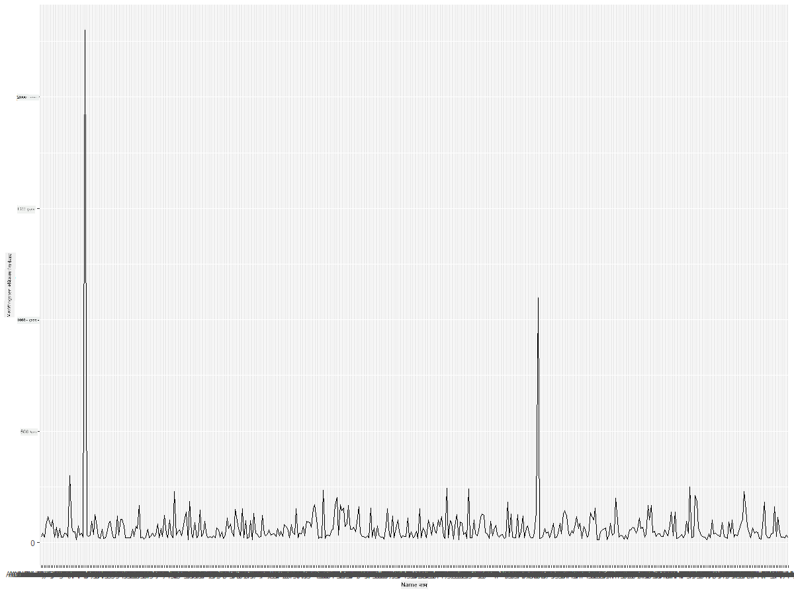
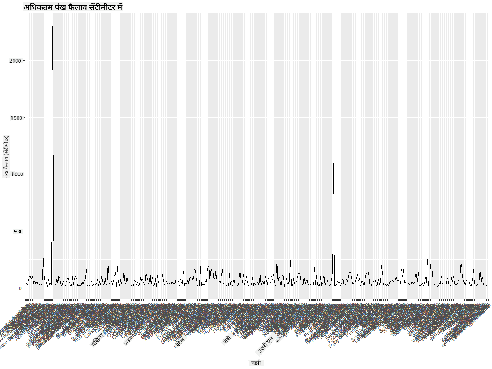
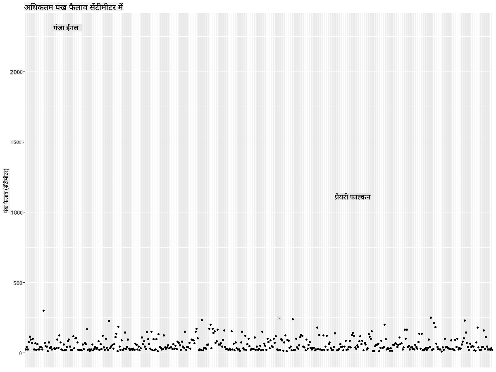
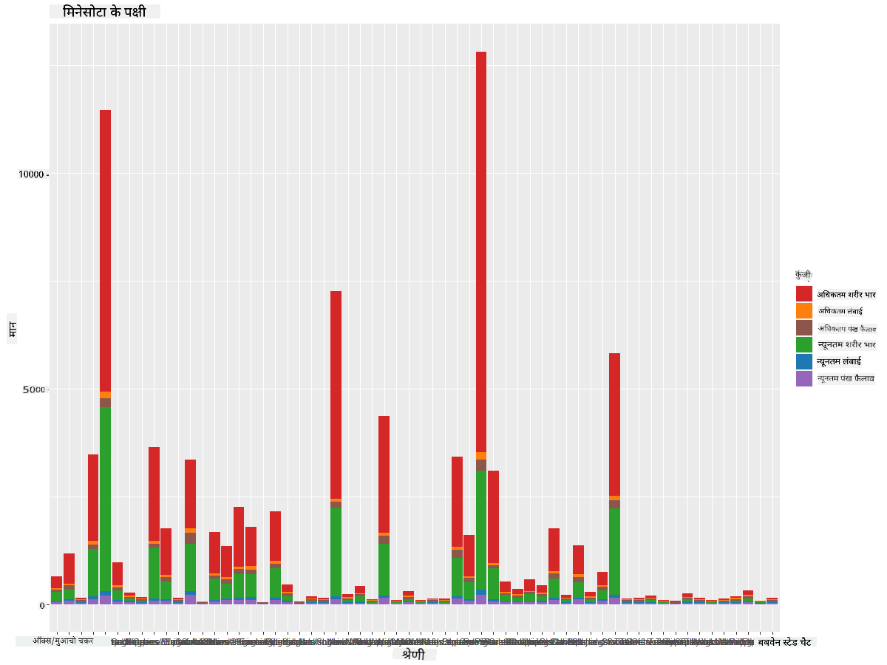
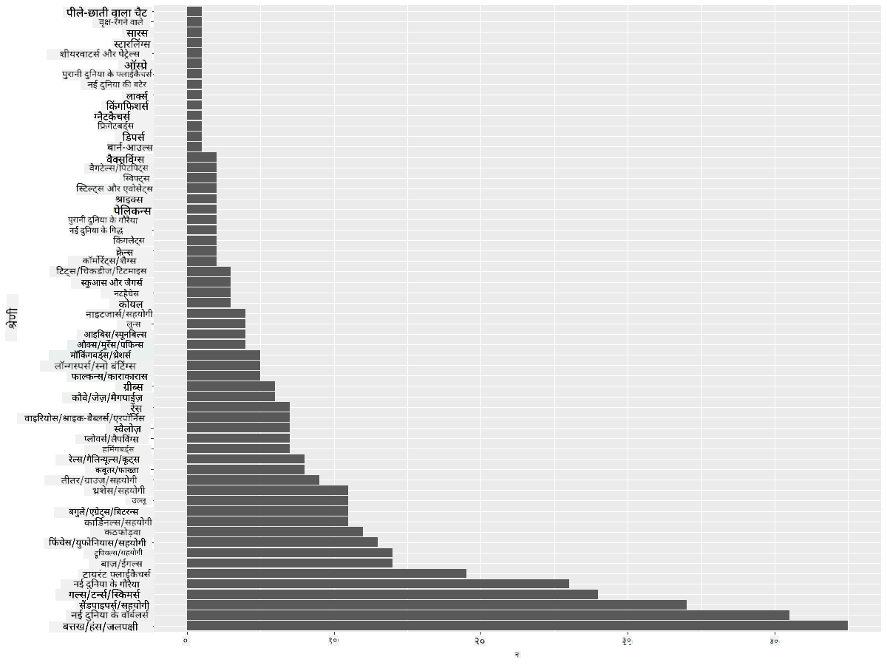
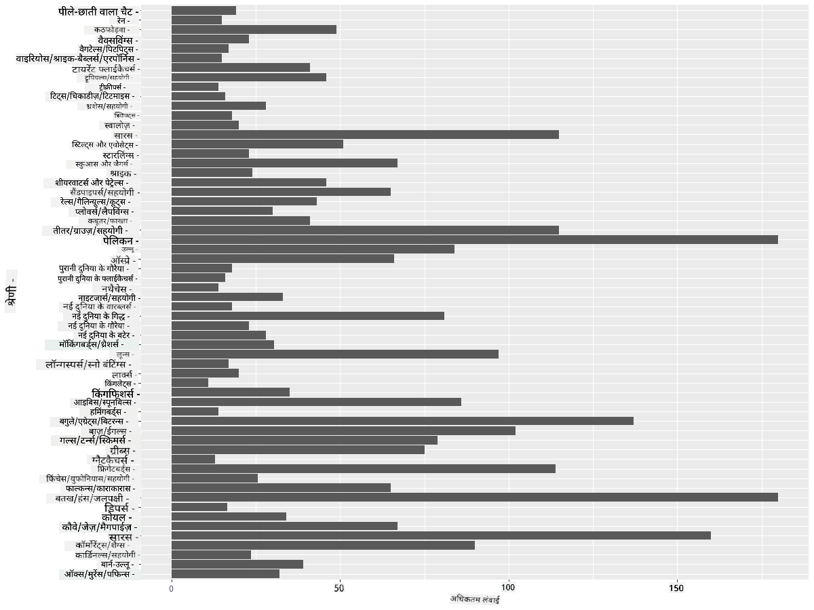
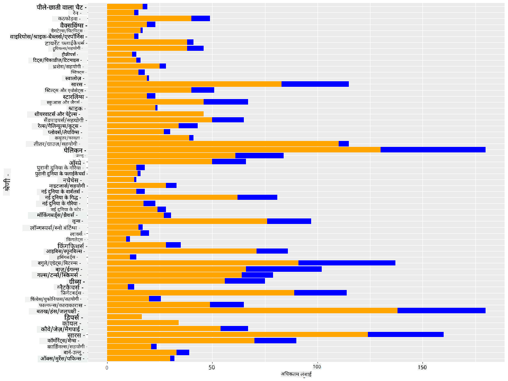

<!--
CO_OP_TRANSLATOR_METADATA:
{
  "original_hash": "22acf28f518a4769ea14fa42f4734b9f",
  "translation_date": "2025-08-24T22:52:57+00:00",
  "source_file": "3-Data-Visualization/R/09-visualization-quantities/README.md",
  "language_code": "hi"
}
-->
# मात्राओं का विज़ुअलाइज़ेशन
| ](https://github.com/microsoft/Data-Science-For-Beginners/blob/main/sketchnotes/09-Visualizing-Quantities.png)|
|:---:|
| मात्राओं का विज़ुअलाइज़ेशन - _Sketchnote by [@nitya](https://twitter.com/nitya)_ |

इस पाठ में आप यह जानेंगे कि R पैकेज लाइब्रेरी का उपयोग करके मात्राओं की अवधारणा के चारों ओर दिलचस्प विज़ुअलाइज़ेशन कैसे बनाए जा सकते हैं। मिनेसोटा के पक्षियों के बारे में एक साफ-सुथरे डेटासेट का उपयोग करके, आप स्थानीय वन्यजीवों के बारे में कई रोचक तथ्य जान सकते हैं।  
## [प्री-लेक्चर क्विज़](https://purple-hill-04aebfb03.1.azurestaticapps.net/quiz/16)

## ggplot2 के साथ विंगस्पैन का अवलोकन करें
सरल और जटिल दोनों प्रकार के प्लॉट और चार्ट बनाने के लिए एक उत्कृष्ट लाइब्रेरी [ggplot2](https://cran.r-project.org/web/packages/ggplot2/index.html) है। सामान्य रूप से, इन लाइब्रेरी का उपयोग करके डेटा को प्लॉट करने की प्रक्रिया में आपके डेटा फ्रेम के उन हिस्सों की पहचान करना शामिल है जिन्हें आप लक्षित करना चाहते हैं, उस डेटा पर आवश्यक कोई भी परिवर्तन करना, इसके x और y अक्ष मान असाइन करना, यह तय करना कि किस प्रकार का प्लॉट दिखाना है, और फिर प्लॉट दिखाना।

`ggplot2` ग्राफिक्स को डिक्लेरेटिव रूप से बनाने की एक प्रणाली है, जो "द ग्रामर ऑफ ग्राफिक्स" पर आधारित है। [ग्रामर ऑफ ग्राफिक्स](https://en.wikipedia.org/wiki/Ggplot2) डेटा विज़ुअलाइज़ेशन के लिए एक सामान्य योजना है जो ग्राफ़ को स्केल और लेयर जैसे सेमांटिक घटकों में विभाजित करती है। दूसरे शब्दों में, कम कोड के साथ एकवेरिएट या मल्टीवेरिएट डेटा के लिए प्लॉट और ग्राफ़ बनाने में आसानी `ggplot2` को R में विज़ुअलाइज़ेशन के लिए सबसे लोकप्रिय पैकेज बनाती है। उपयोगकर्ता `ggplot2` को यह बताता है कि वेरिएबल्स को एस्थेटिक्स से कैसे मैप करना है, ग्राफिकल प्रिमिटिव्स का उपयोग कैसे करना है, और बाकी का काम `ggplot2` करता है।

> ✅ प्लॉट = डेटा + एस्थेटिक्स + ज्योमेट्री  
> - डेटा का मतलब डेटासेट है  
> - एस्थेटिक्स उन वेरिएबल्स को इंगित करता है जिनका अध्ययन किया जाना है (x और y वेरिएबल्स)  
> - ज्योमेट्री प्लॉट के प्रकार को संदर्भित करता है (लाइन प्लॉट, बार प्लॉट, आदि)  

अपने डेटा और उस कहानी के अनुसार जो आप प्लॉट के माध्यम से बताना चाहते हैं, सबसे अच्छा ज्योमेट्री (प्लॉट का प्रकार) चुनें।  

> - ट्रेंड्स का विश्लेषण करने के लिए: लाइन, कॉलम  
> - मानों की तुलना करने के लिए: बार, कॉलम, पाई, स्कैटरप्लॉट  
> - यह दिखाने के लिए कि भाग पूरे से कैसे संबंधित हैं: पाई  
> - डेटा के वितरण को दिखाने के लिए: स्कैटरप्लॉट, बार  
> - मानों के बीच संबंध दिखाने के लिए: लाइन, स्कैटरप्लॉट, बबल  

✅ आप ggplot2 के लिए यह वर्णनात्मक [चीटशीट](https://nyu-cdsc.github.io/learningr/assets/data-visualization-2.1.pdf) भी देख सकते हैं।

## पक्षियों के विंगस्पैन मानों पर एक लाइन प्लॉट बनाएं

R कंसोल खोलें और डेटासेट को इम्पोर्ट करें।  
> नोट: डेटासेट इस रिपॉजिटरी की `/data` फ़ोल्डर में संग्रहीत है।  

आइए डेटासेट को इम्पोर्ट करें और डेटा के शीर्ष 5 पंक्तियों (हेड) का अवलोकन करें।  

```r
birds <- read.csv("../../data/birds.csv",fileEncoding="UTF-8-BOM")
head(birds)
```  
डेटा का हेड टेक्स्ट और नंबर का मिश्रण है:  

|      | Name                         | ScientificName         | Category              | Order        | Family   | Genus       | ConservationStatus | MinLength | MaxLength | MinBodyMass | MaxBodyMass | MinWingspan | MaxWingspan |
| ---: | :--------------------------- | :--------------------- | :-------------------- | :----------- | :------- | :---------- | :----------------- | --------: | --------: | ----------: | ----------: | ----------: | ----------: |
|    0 | Black-bellied whistling-duck | Dendrocygna autumnalis | Ducks/Geese/Waterfowl | Anseriformes | Anatidae | Dendrocygna | LC                 |        47 |        56 |         652 |        1020 |          76 |          94 |
|    1 | Fulvous whistling-duck       | Dendrocygna bicolor    | Ducks/Geese/Waterfowl | Anseriformes | Anatidae | Dendrocygna | LC                 |        45 |        53 |         712 |        1050 |          85 |          93 |
|    2 | Snow goose                   | Anser caerulescens     | Ducks/Geese/Waterfowl | Anseriformes | Anatidae | Anser       | LC                 |        64 |        79 |        2050 |        4050 |         135 |         165 |
|    3 | Ross's goose                 | Anser rossii           | Ducks/Geese/Waterfowl | Anseriformes | Anatidae | Anser       | LC                 |      57.3 |        64 |        1066 |        1567 |         113 |         116 |
|    4 | Greater white-fronted goose  | Anser albifrons        | Ducks/Geese/Waterfowl | Anseriformes | Anatidae | Anser       | LC                 |        64 |        81 |        1930 |        3310 |         130 |         165 |

आइए कुछ संख्यात्मक डेटा को एक बेसिक लाइन प्लॉट का उपयोग करके प्लॉट करें। मान लीजिए कि आप इन दिलचस्प पक्षियों के लिए अधिकतम विंगस्पैन का दृश्य चाहते हैं।  

```r
install.packages("ggplot2")
library("ggplot2")
ggplot(data=birds, aes(x=Name, y=MaxWingspan,group=1)) +
  geom_line() 
```  
यहां, आप `ggplot2` पैकेज को इंस्टॉल करते हैं और फिर इसे `library("ggplot2")` कमांड का उपयोग करके वर्कस्पेस में इम्पोर्ट करते हैं। ggplot में किसी भी प्लॉट को प्लॉट करने के लिए `ggplot()` फ़ंक्शन का उपयोग किया जाता है और आप डेटासेट, x और y वेरिएबल्स को एट्रिब्यूट्स के रूप में निर्दिष्ट करते हैं। इस मामले में, हम एक लाइन प्लॉट को प्लॉट करने के लिए `geom_line()` फ़ंक्शन का उपयोग करते हैं।  

  

आप तुरंत क्या नोटिस करते हैं? ऐसा लगता है कि कम से कम एक आउटलायर है - यह काफी बड़ा विंगस्पैन है! 2000+ सेंटीमीटर विंगस्पैन 20 मीटर से अधिक के बराबर है - क्या मिनेसोटा में पेटरोडैक्टाइल्स घूम रहे हैं? आइए जांच करें।  

हालांकि आप एक्सेल में एक त्वरित सॉर्ट कर सकते हैं ताकि उन आउटलायर्स को ढूंढा जा सके, जो शायद टाइपो हैं, प्लॉट के भीतर से विज़ुअलाइज़ेशन प्रक्रिया जारी रखें।  

x-अक्ष पर लेबल जोड़ें ताकि यह दिखाया जा सके कि किस प्रकार के पक्षी प्रश्न में हैं:  

```r
ggplot(data=birds, aes(x=Name, y=MaxWingspan,group=1)) +
  geom_line() +
  theme(axis.text.x = element_text(angle = 45, hjust=1))+
  xlab("Birds") +
  ylab("Wingspan (CM)") +
  ggtitle("Max Wingspan in Centimeters")
```  
हम `theme` में कोण निर्दिष्ट करते हैं और `xlab()` और `ylab()` में x और y अक्ष लेबल निर्दिष्ट करते हैं। `ggtitle()` ग्राफ/प्लॉट को एक नाम देता है।  

  

लेबल्स को 45 डिग्री पर घुमाने के बावजूद, उन्हें पढ़ने के लिए बहुत अधिक हैं। आइए एक अलग रणनीति आजमाएं: केवल उन आउटलायर्स को लेबल करें और लेबल्स को चार्ट के भीतर सेट करें। आप लेबलिंग के लिए अधिक जगह बनाने के लिए एक स्कैटर चार्ट का उपयोग कर सकते हैं:  

```r
ggplot(data=birds, aes(x=Name, y=MaxWingspan,group=1)) +
  geom_point() +
  geom_text(aes(label=ifelse(MaxWingspan>500,as.character(Name),'')),hjust=0,vjust=0) + 
  theme(axis.title.x=element_blank(), axis.text.x=element_blank(), axis.ticks.x=element_blank())
  ylab("Wingspan (CM)") +
  ggtitle("Max Wingspan in Centimeters") + 
```  
यहां क्या हो रहा है? आपने स्कैटर पॉइंट्स को प्लॉट करने के लिए `geom_point()` फ़ंक्शन का उपयोग किया। इसके साथ, आपने उन पक्षियों के लिए लेबल्स जोड़े जिनके `MaxWingspan > 500` थे और x अक्ष पर लेबल्स को छिपा दिया ताकि प्लॉट को साफ किया जा सके।  

आप क्या खोजते हैं?  

  

## अपने डेटा को फ़िल्टर करें  

Bald Eagle और Prairie Falcon, हालांकि शायद बहुत बड़े पक्षी हैं, गलत लेबल किए गए प्रतीत होते हैं, उनके अधिकतम विंगस्पैन में एक अतिरिक्त 0 जोड़ा गया है। यह संभावना नहीं है कि आप 25 मीटर विंगस्पैन वाले Bald Eagle से मिलेंगे, लेकिन अगर ऐसा होता है, तो कृपया हमें बताएं! आइए इन दो आउटलायर्स के बिना एक नया डेटा फ्रेम बनाएं:  

```r
birds_filtered <- subset(birds, MaxWingspan < 500)

ggplot(data=birds_filtered, aes(x=Name, y=MaxWingspan,group=1)) +
  geom_point() +
  ylab("Wingspan (CM)") +
  xlab("Birds") +
  ggtitle("Max Wingspan in Centimeters") + 
  geom_text(aes(label=ifelse(MaxWingspan>500,as.character(Name),'')),hjust=0,vjust=0) +
  theme(axis.text.x=element_blank(), axis.ticks.x=element_blank())
```  
हमने एक नया डेटा फ्रेम `birds_filtered` बनाया और फिर एक स्कैटर प्लॉट को प्लॉट किया। आउटलायर्स को फ़िल्टर करके, आपका डेटा अब अधिक सुसंगत और समझने योग्य है।  

  

अब जब हमारे पास विंगस्पैन के मामले में कम से कम एक साफ-सुथरा डेटासेट है, तो आइए इन पक्षियों के बारे में और अधिक खोज करें।  

जबकि लाइन और स्कैटर प्लॉट डेटा मानों और उनके वितरण के बारे में जानकारी प्रदर्शित कर सकते हैं, हम इस डेटासेट में अंतर्निहित मानों के बारे में सोचना चाहते हैं। आप निम्नलिखित प्रश्नों के उत्तर देने के लिए विज़ुअलाइज़ेशन बना सकते हैं:  

> पक्षियों की कितनी श्रेणियां हैं, और उनकी संख्या क्या है?  
> कितने पक्षी विलुप्त, संकटग्रस्त, दुर्लभ, या सामान्य हैं?  
> लिनियस की शब्दावली में विभिन्न जीनस और ऑर्डर कितने हैं?  

## बार चार्ट का अन्वेषण करें  

जब आपको डेटा के समूहों को दिखाने की आवश्यकता होती है, तो बार चार्ट व्यावहारिक होते हैं। आइए इस डेटासेट में मौजूद पक्षियों की श्रेणियों का अन्वेषण करें ताकि यह देखा जा सके कि संख्या के हिसाब से कौन सा सबसे सामान्य है।  
आइए फ़िल्टर किए गए डेटा पर एक बार चार्ट बनाएं।  

```r
install.packages("dplyr")
install.packages("tidyverse")

library(lubridate)
library(scales)
library(dplyr)
library(ggplot2)
library(tidyverse)

birds_filtered %>% group_by(Category) %>%
  summarise(n=n(),
  MinLength = mean(MinLength),
  MaxLength = mean(MaxLength),
  MinBodyMass = mean(MinBodyMass),
  MaxBodyMass = mean(MaxBodyMass),
  MinWingspan=mean(MinWingspan),
  MaxWingspan=mean(MaxWingspan)) %>% 
  gather("key", "value", - c(Category, n)) %>%
  ggplot(aes(x = Category, y = value, group = key, fill = key)) +
  geom_bar(stat = "identity") +
  scale_fill_manual(values = c("#D62728", "#FF7F0E", "#8C564B","#2CA02C", "#1F77B4", "#9467BD")) +                   
  xlab("Category")+ggtitle("Birds of Minnesota")

```  
निम्नलिखित स्निपेट में, हम [dplyr](https://www.rdocumentation.org/packages/dplyr/versions/0.7.8) और [lubridate](https://www.rdocumentation.org/packages/lubridate/versions/1.8.0) पैकेज इंस्टॉल करते हैं ताकि डेटा को हेरफेर और समूहित किया जा सके और एक स्टैक्ड बार चार्ट को प्लॉट किया जा सके। पहले, आप पक्षी की `Category` द्वारा डेटा को समूहित करते हैं और फिर `MinLength`, `MaxLength`, `MinBodyMass`, `MaxBodyMass`, `MinWingspan`, `MaxWingspan` कॉलम को सारांशित करते हैं। फिर, `ggplot2` पैकेज का उपयोग करके बार चार्ट को प्लॉट करें और विभिन्न श्रेणियों के लिए रंग और लेबल निर्दिष्ट करें।  

  

हालांकि, यह बार चार्ट पढ़ने योग्य नहीं है क्योंकि इसमें बहुत अधिक गैर-समूहित डेटा है। आपको केवल उस डेटा का चयन करने की आवश्यकता है जिसे आप प्लॉट करना चाहते हैं, इसलिए आइए पक्षी की श्रेणी के आधार पर लंबाई देखें।  

अपने डेटा को केवल पक्षी की श्रेणी को शामिल करने के लिए फ़िल्टर करें।  

चूंकि कई श्रेणियां हैं, आप इस चार्ट को वर्टिकल रूप से प्रदर्शित कर सकते हैं और सभी डेटा को समायोजित करने के लिए इसकी ऊंचाई को ट्वीक कर सकते हैं:  

```r
birds_count<-dplyr::count(birds_filtered, Category, sort = TRUE)
birds_count$Category <- factor(birds_count$Category, levels = birds_count$Category)
ggplot(birds_count,aes(Category,n))+geom_bar(stat="identity")+coord_flip()
```  
आप पहले `Category` कॉलम में अद्वितीय मानों की गणना करते हैं और फिर उन्हें एक नए डेटा फ्रेम `birds_count` में क्रमबद्ध करते हैं। इस क्रमबद्ध डेटा को फिर उसी स्तर पर फैक्टर किया जाता है ताकि इसे क्रमबद्ध तरीके से प्लॉट किया जा सके। फिर, `ggplot2` का उपयोग करके आप डेटा को एक बार चार्ट में प्लॉट करते हैं। `coord_flip()` क्षैतिज बार को प्लॉट करता है।  

  

यह बार चार्ट प्रत्येक श्रेणी में पक्षियों की संख्या का अच्छा दृश्य दिखाता है। एक नज़र में, आप देख सकते हैं कि इस क्षेत्र में सबसे बड़ी संख्या में पक्षी Ducks/Geese/Waterfowl श्रेणी में हैं। मिनेसोटा '10,000 झीलों की भूमि' है, इसलिए यह आश्चर्यजनक नहीं है!  

✅ इस डेटासेट पर कुछ अन्य गणनाएं आज़माएं। क्या कुछ आपको आश्चर्यचकित करता है?  

## डेटा की तुलना करना  

आप नए अक्ष बनाकर समूहित डेटा की विभिन्न तुलना कर सकते हैं। पक्षी की श्रेणी के आधार पर पक्षी की अधिकतम लंबाई की तुलना आज़माएं:  

```r
birds_grouped <- birds_filtered %>%
  group_by(Category) %>%
  summarise(
  MaxLength = max(MaxLength, na.rm = T),
  MinLength = max(MinLength, na.rm = T)
           ) %>%
  arrange(Category)
  
ggplot(birds_grouped,aes(Category,MaxLength))+geom_bar(stat="identity")+coord_flip()
```  
हम `birds_filtered` डेटा को `Category` द्वारा समूहित करते हैं और फिर एक बार ग्राफ़ को प्लॉट करते हैं।  

  

यहां कुछ भी आश्चर्यजनक नहीं है: Hummingbirds की MaxLength Pelicans या Geese की तुलना में सबसे कम है। यह अच्छा है जब डेटा तार्किक रूप से समझ में आता है!  

आप बार चार्ट के अधिक दिलचस्प विज़ुअलाइज़ेशन बना सकते हैं। आइए एक दिए गए पक्षी श्रेणी पर न्यूनतम और अधिकतम लंबाई को सुपरइम्पोज़ करें:  

```r
ggplot(data=birds_grouped, aes(x=Category)) +
  geom_bar(aes(y=MaxLength), stat="identity", position ="identity",  fill='blue') +
  geom_bar(aes(y=MinLength), stat="identity", position="identity", fill='orange')+
  coord_flip()
```  
  

## 🚀 चुनौती  

यह पक्षी डेटासेट एक विशेष पारिस्थितिकी तंत्र के भीतर विभिन्न प्रकार के पक्षियों के बारे में जानकारी का खजाना प्रदान करता है। इंटरनेट पर खोजें और देखें कि क्या आप अन्य पक्षी-उन्मुख डेटासेट पा सकते हैं। इन पक्षियों के चार्ट और ग्राफ़ बनाकर अभ्यास करें ताकि ऐसे तथ्य खोजे जा सकें जिनके बारे में आपको पहले पता नहीं था।  
## [पोस्ट-लेक्चर क्विज़](https://purple-hill-04aebfb03.1.azurestaticapps.net/quiz/17)

## समीक्षा और स्व-अध्ययन  

इस पहले पाठ ने आपको `ggplot2` का उपयोग करके मात्राओं को विज़ुअलाइज़ करने के बारे में कुछ जानकारी दी है। विज़ुअलाइज़ेशन के लिए डेटासेट के साथ काम करने के अन्य तरीकों के बारे में कुछ शोध करें। अन्य पैकेजों जैसे [Lattice](https://stat.ethz.ch/R-manual/R-devel/library/lattice/html/Lattice.html) और [Plotly](https://github.com/plotly/plotly.R#readme) का उपयोग करके विज़ुअलाइज़ेशन के लिए डेटासेट खोजें और उनका अध्ययन करें।  

## असाइनमेंट  
[लाइन्स, स्कैटर्स, और बार्स](assignment.md)  

**अस्वीकरण**:  
यह दस्तावेज़ AI अनुवाद सेवा [Co-op Translator](https://github.com/Azure/co-op-translator) का उपयोग करके अनुवादित किया गया है। जबकि हम सटीकता सुनिश्चित करने का प्रयास करते हैं, कृपया ध्यान दें कि स्वचालित अनुवाद में त्रुटियां या अशुद्धियां हो सकती हैं। मूल भाषा में उपलब्ध मूल दस्तावेज़ को प्रामाणिक स्रोत माना जाना चाहिए। महत्वपूर्ण जानकारी के लिए, पेशेवर मानव अनुवाद की सिफारिश की जाती है। इस अनुवाद के उपयोग से उत्पन्न किसी भी गलतफहमी या गलत व्याख्या के लिए हम उत्तरदायी नहीं हैं।