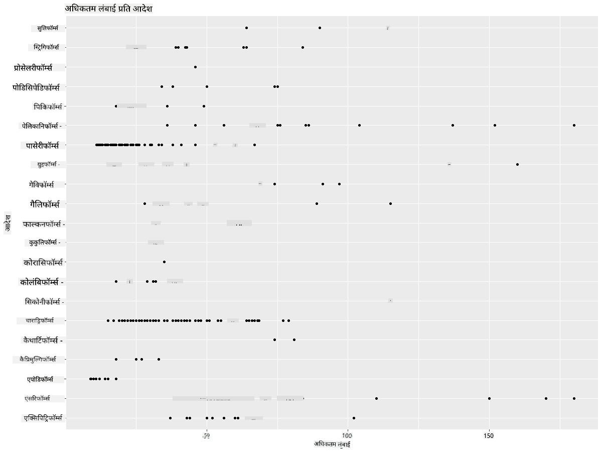
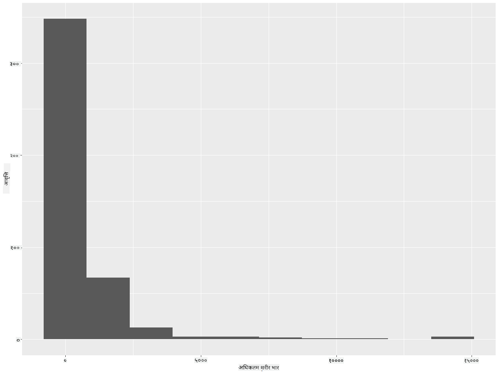
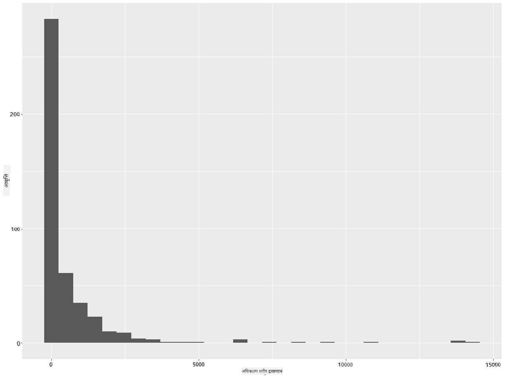
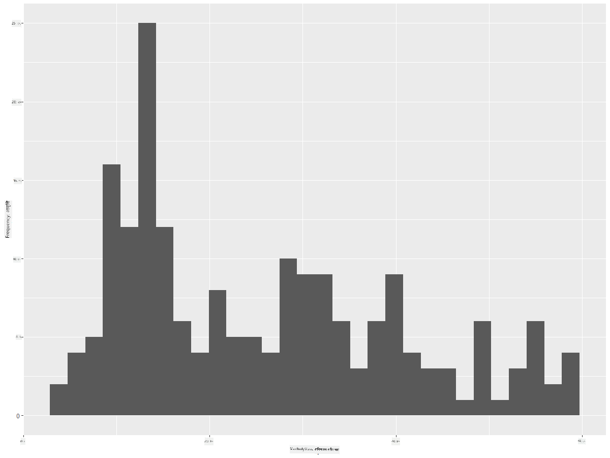
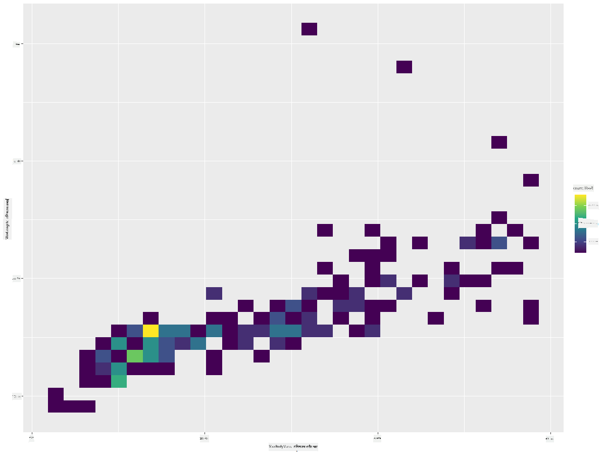
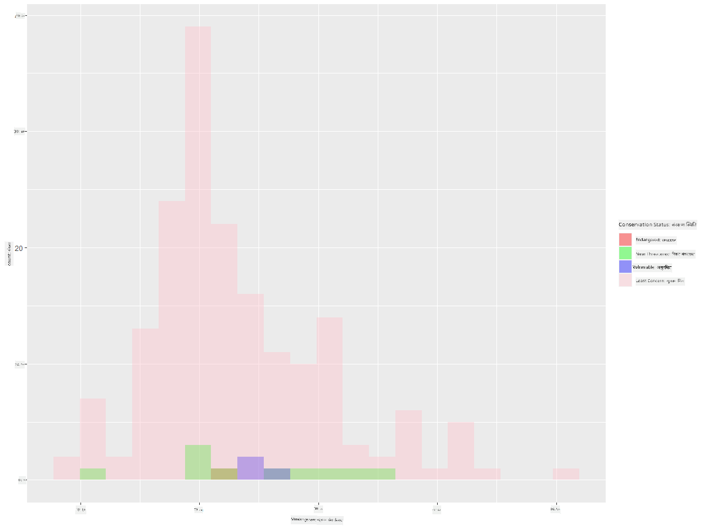
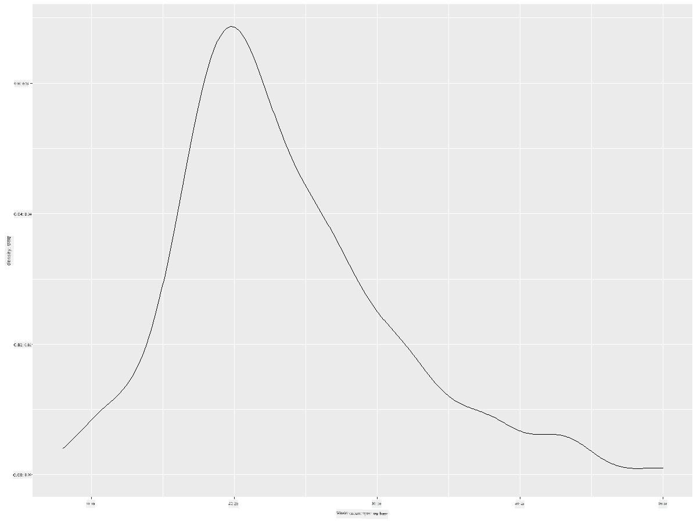
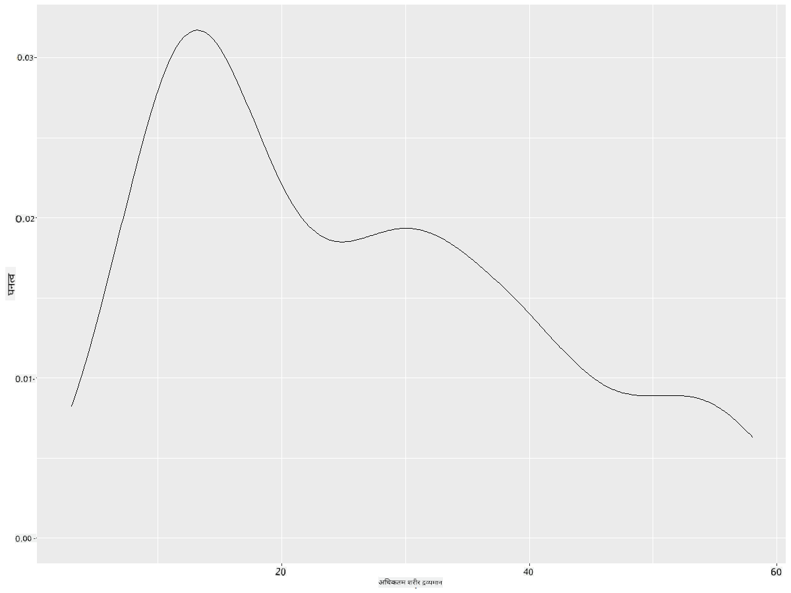
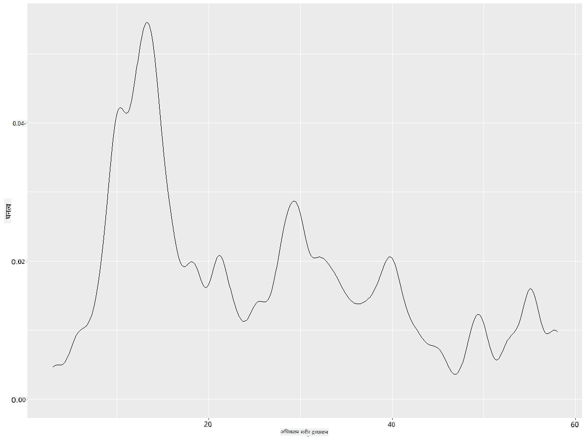
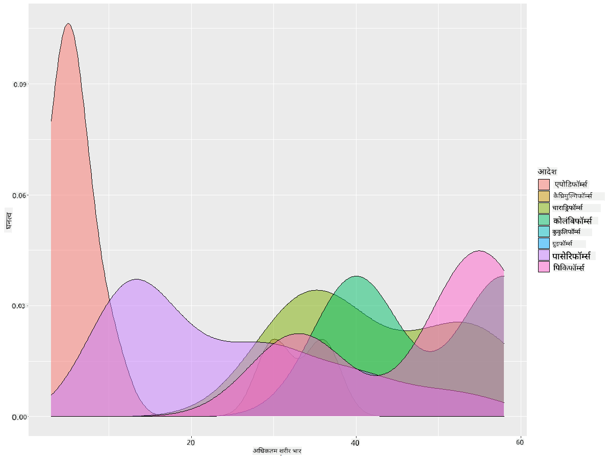

<!--
CO_OP_TRANSLATOR_METADATA:
{
  "original_hash": "ea67c0c40808fd723594de6896c37ccf",
  "translation_date": "2025-08-24T22:44:42+00:00",
  "source_file": "3-Data-Visualization/R/10-visualization-distributions/README.md",
  "language_code": "hi"
}
-->
# वितरणों का विज़ुअलाइज़ेशन

| द्वारा ](https://github.com/microsoft/Data-Science-For-Beginners/blob/main/sketchnotes/10-Visualizing-Distributions.png)|
|:---:|
| वितरणों का विज़ुअलाइज़ेशन - _[@nitya](https://twitter.com/nitya) द्वारा स्केच नोट_ |

पिछले पाठ में, आपने मिनेसोटा के पक्षियों के बारे में एक डेटासेट से कुछ रोचक तथ्य सीखे। आपने आउटलायर्स को विज़ुअलाइज़ करके कुछ त्रुटिपूर्ण डेटा पाया और पक्षी श्रेणियों के बीच उनके अधिकतम लंबाई के आधार पर अंतर देखा।

## [प्री-लेक्चर क्विज़](https://purple-hill-04aebfb03.1.azurestaticapps.net/quiz/18)
## पक्षियों के डेटासेट का अन्वेषण करें

डेटा में गहराई से जाने का एक और तरीका है इसके वितरण को देखना, या डेटा को एक अक्ष पर कैसे व्यवस्थित किया गया है। उदाहरण के लिए, हो सकता है कि आप मिनेसोटा के पक्षियों के अधिकतम पंख फैलाव या अधिकतम शरीर भार के सामान्य वितरण के बारे में जानना चाहें।

आइए इस डेटासेट में डेटा के वितरण के बारे में कुछ तथ्य खोजें। अपने R कंसोल में, `ggplot2` और डेटाबेस को इंपोर्ट करें। पिछले टॉपिक की तरह डेटाबेस से आउटलायर्स को हटा दें।

```r
library(ggplot2)

birds <- read.csv("../../data/birds.csv",fileEncoding="UTF-8-BOM")

birds_filtered <- subset(birds, MaxWingspan < 500)
head(birds_filtered)
```
|      | नाम                          | वैज्ञानिक नाम          | श्रेणी                | क्रम         | परिवार   | वंश         | संरक्षण स्थिति      | न्यूनतम लंबाई | अधिकतम लंबाई | न्यूनतम शरीर भार | अधिकतम शरीर भार | न्यूनतम पंख फैलाव | अधिकतम पंख फैलाव |
| ---: | :--------------------------- | :--------------------- | :-------------------- | :----------- | :------- | :---------- | :----------------- | --------: | --------: | ----------: | ----------: | ----------: | ----------: |
|    0 | ब्लैक-बेलिड व्हिसलिंग-डक     | Dendrocygna autumnalis | बत्तख/हंस/जलपक्षी     | Anseriformes | Anatidae | Dendrocygna | LC                 |        47 |        56 |         652 |        1020 |          76 |          94 |
|    1 | फुल्वस व्हिसलिंग-डक          | Dendrocygna bicolor    | बत्तख/हंस/जलपक्षी     | Anseriformes | Anatidae | Dendrocygna | LC                 |        45 |        53 |         712 |        1050 |          85 |          93 |
|    2 | स्नो गूज                     | Anser caerulescens     | बत्तख/हंस/जलपक्षी     | Anseriformes | Anatidae | Anser       | LC                 |        64 |        79 |        2050 |        4050 |         135 |         165 |
|    3 | रॉस का गूज                   | Anser rossii           | बत्तख/हंस/जलपक्षी     | Anseriformes | Anatidae | Anser       | LC                 |      57.3 |        64 |        1066 |        1567 |         113 |         116 |
|    4 | ग्रेटर व्हाइट-फ्रंटेड गूज    | Anser albifrons        | बत्तख/हंस/जलपक्षी     | Anseriformes | Anatidae | Anser       | LC                 |        64 |        81 |        1930 |        3310 |         130 |         165 |

सामान्य तौर पर, आप डेटा के वितरण को जल्दी से देख सकते हैं जैसे हमने पिछले पाठ में स्कैटर प्लॉट का उपयोग करके किया था:

```r
ggplot(data=birds_filtered, aes(x=Order, y=MaxLength,group=1)) +
  geom_point() +
  ggtitle("Max Length per order") + coord_flip()
```


यह पक्षी क्रम के अनुसार शरीर की लंबाई के सामान्य वितरण का एक अवलोकन देता है, लेकिन यह सच्चे वितरण को प्रदर्शित करने का सबसे अच्छा तरीका नहीं है। यह कार्य आमतौर पर एक हिस्टोग्राम बनाकर किया जाता है।
## हिस्टोग्राम के साथ काम करना

`ggplot2` हिस्टोग्राम का उपयोग करके डेटा वितरण को विज़ुअलाइज़ करने के लिए बहुत अच्छे तरीके प्रदान करता है। इस प्रकार का चार्ट बार चार्ट जैसा होता है जहां वितरण को बार्स के उतार-चढ़ाव के माध्यम से देखा जा सकता है। हिस्टोग्राम बनाने के लिए, आपको संख्यात्मक डेटा की आवश्यकता होती है। हिस्टोग्राम बनाने के लिए, आप चार्ट को 'hist' प्रकार के रूप में परिभाषित कर सकते हैं। यह चार्ट पूरे डेटासेट के संख्यात्मक डेटा की सीमा के लिए MaxBodyMass के वितरण को दिखाता है। डेटा की सरणी को छोटे बिन्स में विभाजित करके, यह डेटा के मानों के वितरण को प्रदर्शित कर सकता है:

```r
ggplot(data = birds_filtered, aes(x = MaxBodyMass)) + 
  geom_histogram(bins=10)+ylab('Frequency')
```


जैसा कि आप देख सकते हैं, इस डेटासेट के 400+ पक्षियों में से अधिकांश का Max Body Mass 2000 से कम की सीमा में आता है। `bins` पैरामीटर को 30 जैसे उच्च संख्या में बदलकर डेटा के बारे में अधिक जानकारी प्राप्त करें:

```r
ggplot(data = birds_filtered, aes(x = MaxBodyMass)) + geom_histogram(bins=30)+ylab('Frequency')
```



यह चार्ट वितरण को थोड़ा अधिक विस्तृत तरीके से दिखाता है। एक चार्ट जो बाईं ओर कम झुका हुआ हो, उसे केवल एक दी गई सीमा के भीतर डेटा का चयन करके बनाया जा सकता है:

अपने डेटा को फ़िल्टर करें ताकि केवल उन पक्षियों को प्राप्त किया जा सके जिनका शरीर भार 60 से कम है, और 30 `bins` दिखाएं:

```r
birds_filtered_1 <- subset(birds_filtered, MaxBodyMass > 1 & MaxBodyMass < 60)
ggplot(data = birds_filtered_1, aes(x = MaxBodyMass)) + 
  geom_histogram(bins=30)+ylab('Frequency')
```



✅ कुछ अन्य फ़िल्टर और डेटा पॉइंट आज़माएं। डेटा के पूर्ण वितरण को देखने के लिए, लेबल वाले वितरण दिखाने के लिए `['MaxBodyMass']` फ़िल्टर को हटा दें।

हिस्टोग्राम कुछ अच्छे रंग और लेबलिंग सुधार भी प्रदान करता है:

दो वितरणों के बीच संबंध की तुलना करने के लिए एक 2D हिस्टोग्राम बनाएं। आइए `MaxBodyMass` बनाम `MaxLength` की तुलना करें। `ggplot2` एक अंतर्निहित तरीका प्रदान करता है जो उज्जवल रंगों का उपयोग करके अभिसरण दिखाता है:

```r
ggplot(data=birds_filtered_1, aes(x=MaxBodyMass, y=MaxLength) ) +
  geom_bin2d() +scale_fill_continuous(type = "viridis")
```
ऐसा प्रतीत होता है कि इन दो तत्वों के बीच अपेक्षित अक्ष के साथ एक अपेक्षित सहसंबंध है, जिसमें अभिसरण का एक विशेष रूप से मजबूत बिंदु है:



हिस्टोग्राम डिफ़ॉल्ट रूप से संख्यात्मक डेटा के लिए अच्छी तरह से काम करते हैं। यदि आपको टेक्स्ट डेटा के अनुसार वितरण देखना हो तो क्या होगा? 
## टेक्स्ट डेटा का उपयोग करके डेटासेट के वितरण का अन्वेषण करें 

इस डेटासेट में पक्षी श्रेणी और इसके वंश, प्रजाति, और परिवार के साथ-साथ इसके संरक्षण स्थिति के बारे में अच्छी जानकारी भी शामिल है। आइए इस संरक्षण जानकारी का अन्वेषण करें। पक्षियों का वितरण उनकी संरक्षण स्थिति के अनुसार क्या है?

> ✅ इस डेटासेट में, संरक्षण स्थिति का वर्णन करने के लिए कई संक्षेपाक्षर का उपयोग किया गया है। ये संक्षेपाक्षर [IUCN रेड लिस्ट श्रेणियों](https://www.iucnredlist.org/) से आते हैं, एक संगठन जो प्रजातियों की स्थिति को सूचीबद्ध करता है।
> 
> - CR: गंभीर रूप से संकटग्रस्त
> - EN: संकटग्रस्त
> - EX: विलुप्त
> - LC: कम चिंता
> - NT: निकट संकटग्रस्त
> - VU: असुरक्षित

ये टेक्स्ट-आधारित मान हैं इसलिए आपको हिस्टोग्राम बनाने के लिए एक ट्रांसफॉर्म करना होगा। फ़िल्टर किए गए पक्षियों के डेटा फ्रेम का उपयोग करके, इसकी संरक्षण स्थिति को न्यूनतम पंख फैलाव के साथ प्रदर्शित करें। आपको क्या दिखाई देता है?

```r
birds_filtered_1$ConservationStatus[birds_filtered_1$ConservationStatus == 'EX'] <- 'x1' 
birds_filtered_1$ConservationStatus[birds_filtered_1$ConservationStatus == 'CR'] <- 'x2'
birds_filtered_1$ConservationStatus[birds_filtered_1$ConservationStatus == 'EN'] <- 'x3'
birds_filtered_1$ConservationStatus[birds_filtered_1$ConservationStatus == 'NT'] <- 'x4'
birds_filtered_1$ConservationStatus[birds_filtered_1$ConservationStatus == 'VU'] <- 'x5'
birds_filtered_1$ConservationStatus[birds_filtered_1$ConservationStatus == 'LC'] <- 'x6'

ggplot(data=birds_filtered_1, aes(x = MinWingspan, fill = ConservationStatus)) +
  geom_histogram(position = "identity", alpha = 0.4, bins = 20) +
  scale_fill_manual(name="Conservation Status",values=c("red","green","blue","pink"),labels=c("Endangered","Near Threathened","Vulnerable","Least Concern"))
```



न्यूनतम पंख फैलाव और संरक्षण स्थिति के बीच कोई अच्छा संबंध प्रतीत नहीं होता। इस विधि का उपयोग करके डेटासेट के अन्य तत्वों का परीक्षण करें। आप विभिन्न फ़िल्टर भी आज़मा सकते हैं। क्या आपको कोई संबंध मिलता है?

## डेंसिटी प्लॉट्स

आपने देखा होगा कि अब तक हमने जो हिस्टोग्राम देखे हैं वे 'स्टेप्ड' हैं और एक आर्क में सुचारू रूप से प्रवाहित नहीं होते। एक सुचारू डेंसिटी चार्ट दिखाने के लिए, आप डेंसिटी प्लॉट आज़मा सकते हैं।

आइए अब डेंसिटी प्लॉट्स के साथ काम करें!

```r
ggplot(data = birds_filtered_1, aes(x = MinWingspan)) + 
  geom_density()
```


आप देख सकते हैं कि यह प्लॉट न्यूनतम पंख फैलाव डेटा के लिए पिछले वाले को प्रतिध्वनित करता है; यह बस थोड़ा अधिक सुचारू है। यदि आप उस खुरदरे MaxBodyMass लाइन को फिर से देखना चाहते हैं जिसे आपने दूसरा चार्ट बनाते समय बनाया था, तो आप इसे इस विधि का उपयोग करके बहुत अच्छी तरह से सुचारू कर सकते हैं:

```r
ggplot(data = birds_filtered_1, aes(x = MaxBodyMass)) + 
  geom_density()
```


यदि आप एक सुचारू, लेकिन बहुत अधिक सुचारू रेखा नहीं चाहते हैं, तो `adjust` पैरामीटर को संपादित करें: 

```r
ggplot(data = birds_filtered_1, aes(x = MaxBodyMass)) + 
  geom_density(adjust = 1/5)
```


✅ इस प्रकार के प्लॉट के लिए उपलब्ध पैरामीटर के बारे में पढ़ें और प्रयोग करें!

इस प्रकार का चार्ट सुंदर व्याख्यात्मक विज़ुअलाइज़ेशन प्रदान करता है। उदाहरण के लिए, कुछ कोड की पंक्तियों के साथ, आप प्रत्येक पक्षी क्रम के लिए अधिकतम शरीर भार डेंसिटी दिखा सकते हैं:

```r
ggplot(data=birds_filtered_1,aes(x = MaxBodyMass, fill = Order)) +
  geom_density(alpha=0.5)
```


## 🚀 चुनौती

हिस्टोग्राम बुनियादी स्कैटरप्लॉट्स, बार चार्ट्स, या लाइन चार्ट्स की तुलना में अधिक परिष्कृत प्रकार के चार्ट हैं। इंटरनेट पर खोज करें और हिस्टोग्राम के उपयोग के अच्छे उदाहरण खोजें। वे कैसे उपयोग किए जाते हैं, वे क्या प्रदर्शित करते हैं, और वे किन क्षेत्रों या जांच के क्षेत्रों में उपयोग किए जाते हैं?

## [पोस्ट-लेक्चर क्विज़](https://purple-hill-04aebfb03.1.azurestaticapps.net/quiz/19)

## समीक्षा और स्व-अध्ययन

इस पाठ में, आपने `ggplot2` का उपयोग किया और अधिक परिष्कृत चार्ट दिखाने का काम शुरू किया। `geom_density_2d()` पर शोध करें, जो "एक या अधिक आयामों में निरंतर संभावना घनत्व वक्र" है। [डॉक्यूमेंटेशन](https://ggplot2.tidyverse.org/reference/geom_density_2d.html) पढ़ें ताकि यह समझ सकें कि यह कैसे काम करता है।

## असाइनमेंट

[अपनी कौशल लागू करें](assignment.md)

**अस्वीकरण**:  
यह दस्तावेज़ AI अनुवाद सेवा [Co-op Translator](https://github.com/Azure/co-op-translator) का उपयोग करके अनुवादित किया गया है। जबकि हम सटीकता के लिए प्रयासरत हैं, कृपया ध्यान दें कि स्वचालित अनुवाद में त्रुटियां या अशुद्धियां हो सकती हैं। मूल भाषा में उपलब्ध मूल दस्तावेज़ को प्रामाणिक स्रोत माना जाना चाहिए। महत्वपूर्ण जानकारी के लिए, पेशेवर मानव अनुवाद की सिफारिश की जाती है। इस अनुवाद के उपयोग से उत्पन्न किसी भी गलतफहमी या गलत व्याख्या के लिए हम उत्तरदायी नहीं हैं।