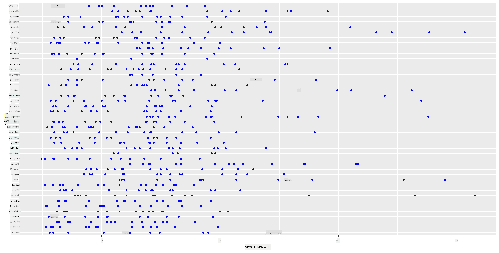
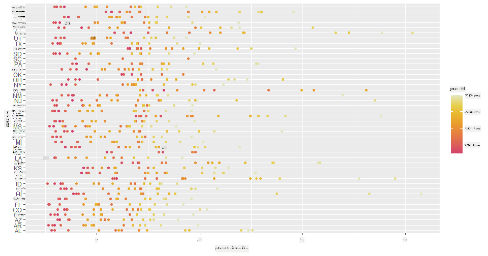
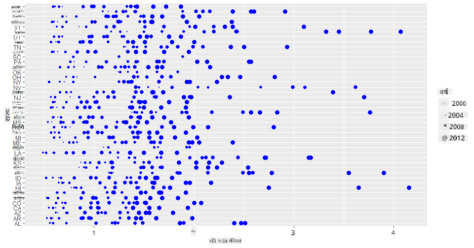
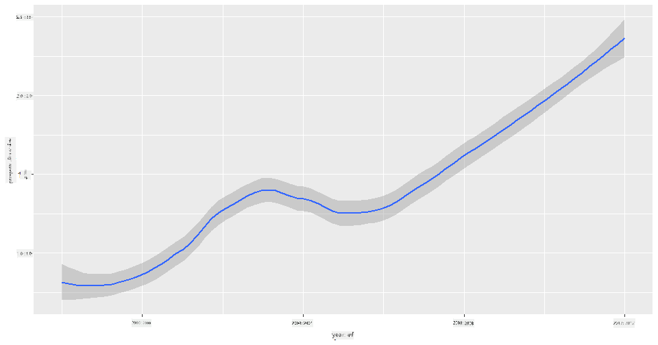
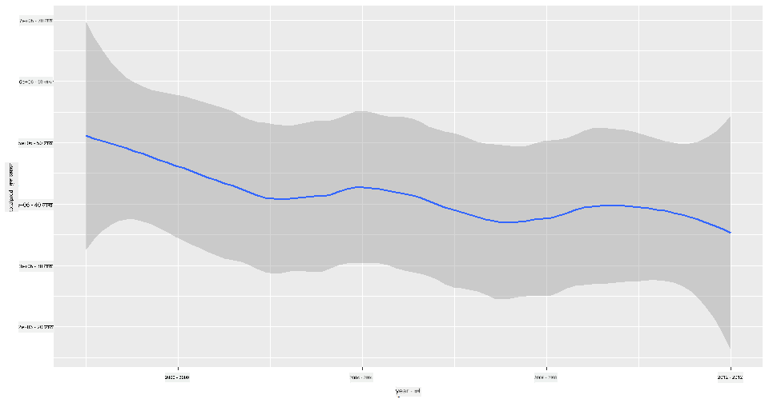
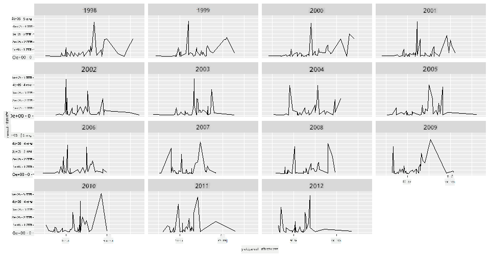
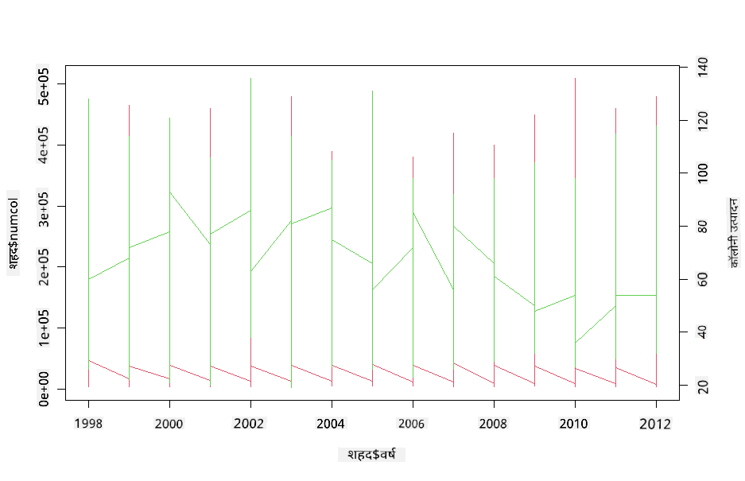

<!--
CO_OP_TRANSLATOR_METADATA:
{
  "original_hash": "a33c5d4b4156a2b41788d8720b6f724c",
  "translation_date": "2025-08-24T22:48:14+00:00",
  "source_file": "3-Data-Visualization/R/12-visualization-relationships/README.md",
  "language_code": "hi"
}
-->
# संबंधों का चित्रण: शहद के बारे में सब कुछ 🍯

| द्वारा ](../../../sketchnotes/12-Visualizing-Relationships.png)|
|:---:|
|संबंधों का चित्रण - _[@nitya](https://twitter.com/nitya) द्वारा स्केच नोट_ |

हमारे शोध के प्रकृति-केंद्रित दृष्टिकोण को जारी रखते हुए, आइए विभिन्न प्रकार के शहद के बीच संबंधों को दिखाने के लिए दिलचस्प चित्रण खोजें। यह डेटा सेट [संयुक्त राज्य कृषि विभाग](https://www.nass.usda.gov/About_NASS/index.php) से लिया गया है। 

यह लगभग 600 वस्तुओं का डेटा सेट कई अमेरिकी राज्यों में शहद उत्पादन को दर्शाता है। उदाहरण के लिए, आप 1998-2012 के बीच किसी दिए गए राज्य में प्रति वर्ष शहद के उत्पादन, कॉलोनियों की संख्या, प्रति कॉलोनी उत्पादन, कुल उत्पादन, स्टॉक्स, प्रति पाउंड कीमत और शहद के मूल्य को देख सकते हैं, जिसमें प्रत्येक राज्य के लिए प्रति वर्ष एक पंक्ति है। 

यह देखना दिलचस्प होगा कि किसी दिए गए राज्य के वार्षिक उत्पादन और उस राज्य में शहद की कीमत के बीच क्या संबंध है। वैकल्पिक रूप से, आप राज्यों के प्रति कॉलोनी शहद उत्पादन के बीच संबंध को चित्रित कर सकते हैं। यह समयावधि 2006 में पहली बार देखे गए 'सीसीडी' या 'कॉलोनी कोलैप्स डिसऑर्डर' (http://npic.orst.edu/envir/ccd.html) को भी कवर करती है, इसलिए यह अध्ययन के लिए एक महत्वपूर्ण डेटा सेट है। 🐝

## [प्री-लेक्चर क्विज़](https://purple-hill-04aebfb03.1.azurestaticapps.net/quiz/22)

इस पाठ में, आप ggplot2 का उपयोग कर सकते हैं, जिसे आपने पहले भी उपयोग किया है। यह लाइब्रेरी चर के बीच संबंधों को चित्रित करने के लिए बहुत अच्छी है। विशेष रूप से दिलचस्प है ggplot2 के `geom_point` और `qplot` फ़ंक्शन का उपयोग, जो स्कैटर प्लॉट्स और लाइन प्लॉट्स को जल्दी से '[सांख्यिकीय संबंधों](https://ggplot2.tidyverse.org/)' को चित्रित करने की अनुमति देता है। यह डेटा वैज्ञानिक को यह समझने में मदद करता है कि चर एक-दूसरे से कैसे संबंधित हैं।

## स्कैटरप्लॉट्स

स्कैटरप्लॉट का उपयोग करके दिखाएं कि शहद की कीमत साल दर साल, प्रति राज्य कैसे विकसित हुई है। ggplot2, `ggplot` और `geom_point` का उपयोग करते हुए, राज्य डेटा को सुविधाजनक रूप से समूहित करता है और श्रेणीबद्ध और संख्यात्मक डेटा दोनों के लिए डेटा पॉइंट्स प्रदर्शित करता है। 

आइए डेटा और Seaborn को इंपोर्ट करके शुरू करें:

```r
honey=read.csv('../../data/honey.csv')
head(honey)
```
आप देखेंगे कि शहद डेटा में कई दिलचस्प कॉलम हैं, जिनमें वर्ष और प्रति पाउंड कीमत शामिल हैं। आइए इस डेटा का अन्वेषण करें, जिसे अमेरिकी राज्यों द्वारा समूहित किया गया है:

| राज्य | कॉलोनियों की संख्या | प्रति कॉलोनी उत्पादन | कुल उत्पादन | स्टॉक्स   | प्रति पाउंड कीमत | उत्पादन मूल्य | वर्ष |
| ----- | ------------------- | -------------------- | ----------- | --------- | --------------- | ------------- | ---- |
| AL    | 16000              | 71                  | 1136000     | 159000    | 0.72            | 818000        | 1998 |
| AZ    | 55000              | 60                  | 3300000     | 1485000   | 0.64            | 2112000       | 1998 |
| AR    | 53000              | 65                  | 3445000     | 1688000   | 0.59            | 2033000       | 1998 |
| CA    | 450000             | 83                  | 37350000    | 12326000  | 0.62            | 23157000      | 1998 |
| CO    | 27000              | 72                  | 1944000     | 1594000   | 0.7             | 1361000       | 1998 |
| FL    | 230000             | 98                  | 22540000    | 4508000   | 0.64            | 14426000      | 1998 |

एक बुनियादी स्कैटरप्लॉट बनाएं जो शहद की प्रति पाउंड कीमत और उसके अमेरिकी राज्य के मूल के बीच संबंध दिखाए। `y` अक्ष को इतना लंबा बनाएं कि सभी राज्यों को प्रदर्शित किया जा सके:

```r
library(ggplot2)
ggplot(honey, aes(x = priceperlb, y = state)) +
  geom_point(colour = "blue")
```


अब, वही डेटा एक शहद रंग योजना के साथ दिखाएं ताकि यह दिखाया जा सके कि कीमत वर्षों में कैसे विकसित होती है। आप इसे 'scale_color_gradientn' पैरामीटर जोड़कर कर सकते हैं, जो साल दर साल परिवर्तन दिखाता है:

> ✅ [scale_color_gradientn](https://www.rdocumentation.org/packages/ggplot2/versions/0.9.1/topics/scale_colour_gradientn) के बारे में और जानें - एक सुंदर इंद्रधनुष रंग योजना आज़माएं!

```r
ggplot(honey, aes(x = priceperlb, y = state, color=year)) +
  geom_point()+scale_color_gradientn(colours = colorspace::heat_hcl(7))
```


इस रंग योजना परिवर्तन के साथ, आप देख सकते हैं कि वर्षों में प्रति पाउंड शहद की कीमत में स्पष्ट रूप से एक मजबूत प्रगति है। वास्तव में, यदि आप डेटा के एक नमूना सेट को सत्यापित करने के लिए देखते हैं (उदाहरण के लिए, एरिज़ोना राज्य को चुनें), तो आप देख सकते हैं कि कुछ अपवादों को छोड़कर, कीमत में साल दर साल वृद्धि का एक पैटर्न है:

| राज्य | कॉलोनियों की संख्या | प्रति कॉलोनी उत्पादन | कुल उत्पादन | स्टॉक्स  | प्रति पाउंड कीमत | उत्पादन मूल्य | वर्ष |
| ----- | ------------------- | -------------------- | ----------- | ------- | --------------- | ------------- | ---- |
| AZ    | 55000              | 60                  | 3300000     | 1485000 | 0.64            | 2112000       | 1998 |
| AZ    | 52000              | 62                  | 3224000     | 1548000 | 0.62            | 1999000       | 1999 |
| AZ    | 40000              | 59                  | 2360000     | 1322000 | 0.73            | 1723000       | 2000 |
| AZ    | 43000              | 59                  | 2537000     | 1142000 | 0.72            | 1827000       | 2001 |
| AZ    | 38000              | 63                  | 2394000     | 1197000 | 1.08            | 2586000       | 2002 |
| AZ    | 35000              | 72                  | 2520000     | 983000  | 1.34            | 3377000       | 2003 |
| AZ    | 32000              | 55                  | 1760000     | 774000  | 1.11            | 1954000       | 2004 |
| AZ    | 36000              | 50                  | 1800000     | 720000  | 1.04            | 1872000       | 2005 |
| AZ    | 30000              | 65                  | 1950000     | 839000  | 0.91            | 1775000       | 2006 |
| AZ    | 30000              | 64                  | 1920000     | 902000  | 1.26            | 2419000       | 2007 |
| AZ    | 25000              | 64                  | 1600000     | 336000  | 1.26            | 2016000       | 2008 |
| AZ    | 20000              | 52                  | 1040000     | 562000  | 1.45            | 1508000       | 2009 |
| AZ    | 24000              | 77                  | 1848000     | 665000  | 1.52            | 2809000       | 2010 |
| AZ    | 23000              | 53                  | 1219000     | 427000  | 1.55            | 1889000       | 2011 |
| AZ    | 22000              | 46                  | 1012000     | 253000  | 1.79            | 1811000       | 2012 |

एक और तरीका इस प्रगति को दिखाने का यह है कि रंग के बजाय आकार का उपयोग करें। रंग-अंधता वाले उपयोगकर्ताओं के लिए, यह एक बेहतर विकल्प हो सकता है। अपने विज़ुअलाइज़ेशन को संपादित करें ताकि कीमत में वृद्धि को डॉट के परिधि में वृद्धि के रूप में दिखाया जा सके:

```r
ggplot(honey, aes(x = priceperlb, y = state)) +
  geom_point(aes(size = year),colour = "blue") +
  scale_size_continuous(range = c(0.25, 3))
```
आप देख सकते हैं कि डॉट्स का आकार धीरे-धीरे बढ़ रहा है।



क्या यह आपूर्ति और मांग का एक साधारण मामला है? जलवायु परिवर्तन और कॉलोनी कोलैप्स जैसे कारकों के कारण, क्या हर साल खरीदने के लिए कम शहद उपलब्ध है, और इसीलिए कीमत बढ़ रही है?

इस डेटा सेट में कुछ चर के बीच सहसंबंध खोजने के लिए, आइए कुछ लाइन चार्ट्स का अन्वेषण करें।

## लाइन चार्ट्स

प्रश्न: क्या प्रति पाउंड शहद की कीमत में साल दर साल स्पष्ट वृद्धि है? आप इसे सबसे आसानी से एक सिंगल लाइन चार्ट बनाकर खोज सकते हैं:

```r
qplot(honey$year,honey$priceperlb, geom='smooth', span =0.5, xlab = "year",ylab = "priceperlb")
```
उत्तर: हां, कुछ अपवादों के साथ, विशेष रूप से 2003 के आसपास:



प्रश्न: खैर, क्या 2003 में हम शहद की आपूर्ति में भी वृद्धि देख सकते हैं? यदि आप कुल उत्पादन को साल दर साल देखें तो क्या होता है?

```python
qplot(honey$year,honey$totalprod, geom='smooth', span =0.5, xlab = "year",ylab = "totalprod")
```



उत्तर: वास्तव में नहीं। यदि आप कुल उत्पादन को देखें, तो ऐसा लगता है कि यह विशेष वर्ष में बढ़ा है, हालांकि सामान्य रूप से इन वर्षों के दौरान शहद का उत्पादन घट रहा है।

प्रश्न: उस स्थिति में, 2003 के आसपास शहद की कीमत में उस वृद्धि का कारण क्या हो सकता है?

इसे खोजने के लिए, आप एक फेसट ग्रिड का अन्वेषण कर सकते हैं।

## फेसट ग्रिड्स

फेसट ग्रिड्स आपके डेटा सेट के एक पहलू (हमारे मामले में, आप 'वर्ष' चुन सकते हैं ताकि बहुत अधिक फेसट्स न बनें) को लेते हैं। Seaborn तब आपके चुने हुए x और y निर्देशांक के लिए प्रत्येक फेसट का एक प्लॉट बना सकता है, जिससे तुलना करना आसान हो जाता है। क्या 2003 इस प्रकार की तुलना में अलग दिखता है?

[ggplot2 के दस्तावेज़](https://ggplot2.tidyverse.org/reference/facet_wrap.html) द्वारा अनुशंसित `facet_wrap` का उपयोग करके एक फेसट ग्रिड बनाएं।

```r
ggplot(honey, aes(x=yieldpercol, y = numcol,group = 1)) + 
  geom_line() + facet_wrap(vars(year))
```
इस विज़ुअलाइज़ेशन में, आप कॉलोनी की प्रति कॉलोनी उपज और कॉलोनियों की संख्या को साल दर साल, राज्य दर राज्य, 3 कॉलम के रैप के साथ साइड बाय साइड तुलना कर सकते हैं:



इस डेटा सेट के लिए, कॉलोनियों की संख्या और उनकी उपज के संबंध में, साल दर साल और राज्य दर राज्य, कुछ भी विशेष रूप से अलग नहीं दिखता। क्या इन दो चर के बीच सहसंबंध खोजने का कोई और तरीका है?

## डुअल-लाइन प्लॉट्स

R के `par` और `plot` फ़ंक्शन का उपयोग करके दो लाइनप्लॉट्स को एक-दूसरे के ऊपर सुपरइम्पोज़ करके एक मल्टीलाइन प्लॉट आज़माएं। हम x अक्ष पर वर्ष और दो y अक्ष प्रदर्शित करेंगे। तो, कॉलोनी की प्रति कॉलोनी उपज और कॉलोनियों की संख्या को सुपरइम्पोज़ करें:

```r
par(mar = c(5, 4, 4, 4) + 0.3)              
plot(honey$year, honey$numcol, pch = 16, col = 2,type="l")              
par(new = TRUE)                             
plot(honey$year, honey$yieldpercol, pch = 17, col = 3,              
     axes = FALSE, xlab = "", ylab = "",type="l")
axis(side = 4, at = pretty(range(y2)))      
mtext("colony yield", side = 4, line = 3)   
```


हालांकि 2003 के आसपास कुछ भी आंखों को स्पष्ट रूप से नहीं दिखता, यह हमें इस पाठ को एक खुशहाल नोट पर समाप्त करने की अनुमति देता है: जबकि कॉलोनियों की संख्या में समग्र गिरावट हो रही है, कॉलोनियों की संख्या स्थिर हो रही है, भले ही उनकी प्रति कॉलोनी उपज घट रही हो।

जाओ, मधुमक्खियां, जाओ!

🐝❤️
## 🚀 चुनौती

इस पाठ में, आपने स्कैटरप्लॉट्स और लाइन ग्रिड्स के अन्य उपयोगों के बारे में थोड़ा और सीखा, जिसमें फेसट ग्रिड्स भी शामिल हैं। खुद को चुनौती दें कि आप एक अलग डेटा सेट का उपयोग करके एक फेसट ग्रिड बनाएं, शायद वह जिसे आपने इन पाठों से पहले उपयोग किया हो। ध्यान दें कि इन्हें बनाने में कितना समय लगता है और आपको इन तकनीकों का उपयोग करते समय कितने ग्रिड्स बनाने की आवश्यकता है, इस पर सावधान रहना चाहिए।
## [पोस्ट-लेक्चर क्विज़](https://purple-hill-04aebfb03.1.azurestaticapps.net/quiz/23)

## समीक्षा और स्व-अध्ययन

लाइन प्लॉट्स सरल या काफी जटिल हो सकते हैं। [ggplot2 दस्तावेज़](https://ggplot2.tidyverse.org/reference/geom_path.html#:~:text=geom_line()%20connects%20them%20in,which%20cases%20are%20connected%20together) में थोड़ा पढ़ें कि आप उन्हें बनाने के विभिन्न तरीकों पर। इस पाठ में आपने जो लाइन चार्ट्स बनाए हैं, उन्हें दस्तावेज़ में सूचीबद्ध अन्य तरीकों से बढ़ाने का प्रयास करें।
## असाइनमेंट

[मधुमक्खी के छत्ते में गोता लगाएं](assignment.md)

**अस्वीकरण**:  
यह दस्तावेज़ AI अनुवाद सेवा [Co-op Translator](https://github.com/Azure/co-op-translator) का उपयोग करके अनुवादित किया गया है। जबकि हम सटीकता के लिए प्रयासरत हैं, कृपया ध्यान दें कि स्वचालित अनुवाद में त्रुटियां या अशुद्धियां हो सकती हैं। मूल भाषा में उपलब्ध मूल दस्तावेज़ को प्रामाणिक स्रोत माना जाना चाहिए। महत्वपूर्ण जानकारी के लिए, पेशेवर मानव अनुवाद की सिफारिश की जाती है। इस अनुवाद के उपयोग से उत्पन्न किसी भी गलतफहमी या गलत व्याख्या के लिए हम उत्तरदायी नहीं हैं।