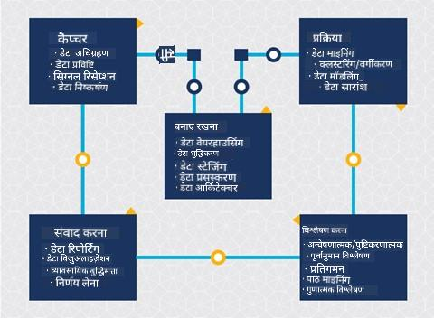
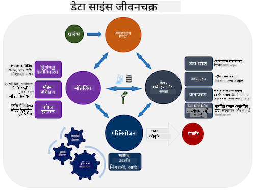
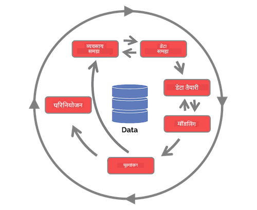

<!--
CO_OP_TRANSLATOR_METADATA:
{
  "original_hash": "c368f8f2506fe56bca0f7be05c4eb71d",
  "translation_date": "2025-08-24T22:16:30+00:00",
  "source_file": "4-Data-Science-Lifecycle/14-Introduction/README.md",
  "language_code": "hi"
}
-->
# डेटा साइंस जीवनचक्र का परिचय

| द्वारा ](../../sketchnotes/14-DataScience-Lifecycle.png)|
|:---:|
| डेटा साइंस जीवनचक्र का परिचय - _स्केच नोट [@nitya](https://twitter.com/nitya) द्वारा_ |

## [प्री-लेक्चर क्विज़](https://red-water-0103e7a0f.azurestaticapps.net/quiz/26)

इस बिंदु पर, आपने शायद यह महसूस कर लिया होगा कि डेटा साइंस एक प्रक्रिया है। इस प्रक्रिया को 5 चरणों में विभाजित किया जा सकता है:

- डेटा संग्रहण
- प्रोसेसिंग
- विश्लेषण
- संवाद
- रखरखाव

यह पाठ जीवनचक्र के 3 भागों पर केंद्रित है: डेटा संग्रहण, प्रोसेसिंग और रखरखाव।

> फोटो [बर्कले स्कूल ऑफ इंफॉर्मेशन](https://ischoolonline.berkeley.edu/data-science/what-is-data-science/) द्वारा

## डेटा संग्रहण

जीवनचक्र का पहला चरण बहुत महत्वपूर्ण है क्योंकि इसके बाद के चरण इसी पर निर्भर करते हैं। यह वास्तव में दो चरणों का संयोजन है: डेटा प्राप्त करना और उस उद्देश्य और समस्याओं को परिभाषित करना जिन्हें हल करने की आवश्यकता है।  
परियोजना के लक्ष्यों को परिभाषित करने के लिए समस्या या प्रश्न की गहरी समझ की आवश्यकता होगी। सबसे पहले, हमें उन लोगों की पहचान और डेटा प्राप्त करना होगा जिनकी समस्या को हल करने की आवश्यकता है। ये व्यवसाय में हितधारक या परियोजना के प्रायोजक हो सकते हैं, जो यह पहचानने में मदद कर सकते हैं कि इस परियोजना से कौन या क्या लाभान्वित होगा और क्यों। एक अच्छी तरह से परिभाषित लक्ष्य मापने योग्य और परिमाणात्मक होना चाहिए ताकि एक स्वीकार्य परिणाम को परिभाषित किया जा सके। 

डेटा वैज्ञानिक द्वारा पूछे जा सकने वाले प्रश्न:
- क्या इस समस्या को पहले भी हल करने का प्रयास किया गया है? क्या खोजा गया?
- क्या उद्देश्य और लक्ष्य सभी संबंधित पक्षों द्वारा समझे गए हैं?
- क्या कोई अस्पष्टता है और इसे कैसे कम किया जा सकता है?
- क्या बाधाएं हैं?
- अंतिम परिणाम संभावित रूप से कैसा दिखेगा?
- कितने संसाधन (समय, लोग, कंप्यूटेशनल) उपलब्ध हैं?

इसके बाद, उन डेटा की पहचान करना, उन्हें एकत्र करना और फिर उन पर शोध करना आवश्यक है जो इन परिभाषित लक्ष्यों को प्राप्त करने के लिए आवश्यक हैं। इस अधिग्रहण चरण में, डेटा वैज्ञानिकों को डेटा की मात्रा और गुणवत्ता का भी मूल्यांकन करना चाहिए। यह पुष्टि करने के लिए कुछ डेटा अन्वेषण की आवश्यकता होती है कि जो डेटा प्राप्त किया गया है वह वांछित परिणाम प्राप्त करने में सहायक होगा।  

डेटा वैज्ञानिक द्वारा डेटा के बारे में पूछे जा सकने वाले प्रश्न:
- मेरे पास पहले से कौन सा डेटा उपलब्ध है?
- इस डेटा का मालिक कौन है?
- गोपनीयता से संबंधित क्या चिंताएं हैं? 
- क्या इस समस्या को हल करने के लिए मेरे पास पर्याप्त डेटा है?
- क्या यह डेटा इस समस्या के लिए स्वीकार्य गुणवत्ता का है?
- यदि इस डेटा के माध्यम से अतिरिक्त जानकारी प्राप्त होती है, तो क्या हमें लक्ष्यों को बदलने या पुनः परिभाषित करने पर विचार करना चाहिए?

## प्रोसेसिंग

जीवनचक्र का प्रोसेसिंग चरण डेटा में पैटर्न खोजने और मॉडलिंग पर केंद्रित है। प्रोसेसिंग चरण में उपयोग की जाने वाली कुछ तकनीकों में सांख्यिकीय विधियों की आवश्यकता होती है ताकि पैटर्न का पता लगाया जा सके। आमतौर पर, यह एक बड़े डेटा सेट के साथ मानव के लिए एक थकाऊ कार्य होगा और प्रक्रिया को तेज करने के लिए कंप्यूटर पर निर्भर करेगा। यह चरण वह भी है जहां डेटा साइंस और मशीन लर्निंग का मिलन होता है। जैसा कि आपने पहले पाठ में सीखा, मशीन लर्निंग डेटा को समझने के लिए मॉडल बनाने की प्रक्रिया है। मॉडल डेटा में चर के बीच संबंधों का प्रतिनिधित्व करते हैं जो परिणामों की भविष्यवाणी करने में मदद करते हैं।

इस चरण में उपयोग की जाने वाली सामान्य तकनीकें ML for Beginners पाठ्यक्रम में शामिल हैं। इनके बारे में अधिक जानने के लिए लिंक का अनुसरण करें:

- [वर्गीकरण (Classification)](https://github.com/microsoft/ML-For-Beginners/tree/main/4-Classification): डेटा को श्रेणियों में व्यवस्थित करना ताकि इसका अधिक कुशलता से उपयोग किया जा सके।
- [क्लस्टरिंग (Clustering)](https://github.com/microsoft/ML-For-Beginners/tree/main/5-Clustering): डेटा को समान समूहों में विभाजित करना।
- [रिग्रेशन (Regression)](https://github.com/microsoft/ML-For-Beginners/tree/main/2-Regression): चर के बीच संबंधों को निर्धारित करना ताकि मूल्यों की भविष्यवाणी या पूर्वानुमान लगाया जा सके।

## रखरखाव
जीवनचक्र के आरेख में, आपने देखा होगा कि रखरखाव डेटा संग्रहण और प्रोसेसिंग के बीच स्थित है। रखरखाव एक परियोजना की प्रक्रिया के दौरान डेटा का प्रबंधन, भंडारण और सुरक्षा करने की एक सतत प्रक्रिया है और इसे परियोजना की पूरी अवधि के दौरान ध्यान में रखा जाना चाहिए। 

### डेटा का भंडारण
डेटा को कैसे और कहां संग्रहीत किया जाए, इस पर विचार करना इसके भंडारण की लागत और डेटा तक पहुंचने की गति को प्रभावित कर सकता है। इस प्रकार के निर्णय केवल डेटा वैज्ञानिक द्वारा नहीं किए जाते हैं, लेकिन वे डेटा के साथ काम करने के तरीके पर निर्णय ले सकते हैं, यह इस बात पर निर्भर करता है कि डेटा कैसे संग्रहीत किया गया है।

आधुनिक डेटा भंडारण प्रणालियों के कुछ पहलू जो इन विकल्पों को प्रभावित कर सकते हैं:

**ऑन-प्रिमाइसेस बनाम ऑफ-प्रिमाइसेस बनाम सार्वजनिक या निजी क्लाउड**

ऑन-प्रिमाइसेस का मतलब है कि डेटा को अपनी खुद की उपकरणों पर होस्ट और प्रबंधित करना, जैसे कि अपने सर्वर पर डेटा संग्रहीत करना, जबकि ऑफ-प्रिमाइसेस का मतलब है कि आप उन उपकरणों पर निर्भर हैं जो आपके स्वामित्व में नहीं हैं, जैसे कि डेटा सेंटर। सार्वजनिक क्लाउड डेटा संग्रहीत करने के लिए एक लोकप्रिय विकल्प है, जिसमें यह जानने की आवश्यकता नहीं होती कि डेटा कैसे या कहां संग्रहीत किया गया है। सार्वजनिक क्लाउड का मतलब है कि सभी उपयोगकर्ताओं के लिए एक साझा बुनियादी ढांचा होता है। कुछ संगठनों की सख्त सुरक्षा नीतियां होती हैं, जो उन्हें उस उपकरण तक पूरी पहुंच की आवश्यकता होती है जहां डेटा होस्ट किया गया है, और वे अपने स्वयं के क्लाउड सेवाओं के साथ एक निजी क्लाउड पर निर्भर करते हैं। आप क्लाउड में डेटा के बारे में [आगे के पाठों](https://github.com/microsoft/Data-Science-For-Beginners/tree/main/5-Data-Science-In-Cloud) में और जानेंगे।

**कोल्ड बनाम हॉट डेटा**

जब आप अपने मॉडल को प्रशिक्षित कर रहे होते हैं, तो आपको अधिक प्रशिक्षण डेटा की आवश्यकता हो सकती है। यदि आप अपने मॉडल से संतुष्ट हैं, तो मॉडल को उसके उद्देश्य की पूर्ति के लिए अधिक डेटा की आवश्यकता होगी। किसी भी स्थिति में, जैसे-जैसे आप अधिक डेटा एकत्र करते हैं, डेटा को संग्रहीत और एक्सेस करने की लागत बढ़ेगी। शायद ही कभी उपयोग किए जाने वाले डेटा, जिसे कोल्ड डेटा कहा जाता है, को अक्सर एक्सेस किए जाने वाले हॉट डेटा से अलग करना हार्डवेयर या सॉफ़्टवेयर सेवाओं के माध्यम से एक सस्ता डेटा भंडारण विकल्प हो सकता है। यदि कोल्ड डेटा को एक्सेस करने की आवश्यकता होती है, तो इसे हॉट डेटा की तुलना में पुनः प्राप्त करने में थोड़ा अधिक समय लग सकता है।

### डेटा का प्रबंधन
जैसे-जैसे आप डेटा के साथ काम करते हैं, आप पा सकते हैं कि कुछ डेटा को साफ करने की आवश्यकता है, जैसा कि [डेटा तैयारी](https://github.com/microsoft/Data-Science-For-Beginners/tree/main/2-Working-With-Data/08-data-preparation) पर केंद्रित पाठ में शामिल तकनीकों का उपयोग करके किया गया है, ताकि सटीक मॉडल बनाए जा सकें। जब नया डेटा आता है, तो गुणवत्ता में स्थिरता बनाए रखने के लिए इसे समान अनुप्रयोगों की आवश्यकता होगी। कुछ परियोजनाओं में डेटा को उसके अंतिम स्थान पर ले जाने से पहले स्वचालित उपकरणों का उपयोग करके इसे साफ करने, एकत्र करने और संपीड़ित करने की प्रक्रिया शामिल होगी। Azure Data Factory ऐसे उपकरणों का एक उदाहरण है।

### डेटा की सुरक्षा
डेटा को सुरक्षित रखने का मुख्य उद्देश्य यह सुनिश्चित करना है कि जो लोग इसके साथ काम कर रहे हैं, वे इस पर नियंत्रण रखें कि क्या एकत्र किया जा रहा है और इसे किस संदर्भ में उपयोग किया जा रहा है। डेटा को सुरक्षित रखना इसमें शामिल है कि केवल उन्हीं को डेटा तक पहुंचने की अनुमति दी जाए जिन्हें इसकी आवश्यकता है, स्थानीय कानूनों और विनियमों का पालन किया जाए, और नैतिक मानकों को बनाए रखा जाए, जैसा कि [नैतिकता पाठ](https://github.com/microsoft/Data-Science-For-Beginners/tree/main/1-Introduction/02-ethics) में शामिल किया गया है। 

टीम सुरक्षा को ध्यान में रखते हुए निम्नलिखित कार्य कर सकती है:
- सुनिश्चित करें कि सभी डेटा एन्क्रिप्टेड हैं
- ग्राहकों को यह जानकारी दें कि उनके डेटा का उपयोग कैसे किया जा रहा है
- परियोजना छोड़ने वाले लोगों से डेटा तक पहुंच हटा दें
- केवल कुछ परियोजना सदस्यों को डेटा को बदलने की अनुमति दें

## 🚀 चुनौती

डेटा साइंस जीवनचक्र के कई संस्करण हैं, जहां प्रत्येक चरण के अलग-अलग नाम और चरणों की संख्या हो सकती है, लेकिन इस पाठ में उल्लिखित प्रक्रियाएं समान होती हैं।

[टीम डेटा साइंस प्रक्रिया जीवनचक्र](https://docs.microsoft.com/en-us/azure/architecture/data-science-process/lifecycle) और [क्रॉस-इंडस्ट्री स्टैंडर्ड प्रोसेस फॉर डेटा माइनिंग](https://www.datascience-pm.com/crisp-dm-2/) का अन्वेषण करें। इन दोनों में 3 समानताएं और 3 अंतर बताएं।

|टीम डेटा साइंस प्रक्रिया (TDSP)|क्रॉस-इंडस्ट्री स्टैंडर्ड प्रोसेस फॉर डेटा माइनिंग (CRISP-DM)|
|--|--|
| |  |
| छवि [Microsoft](https://docs.microsoft.comazure/architecture/data-science-process/lifecycle) द्वारा | छवि [डेटा साइंस प्रक्रिया एलायंस](https://www.datascience-pm.com/crisp-dm-2/) द्वारा |

## [पोस्ट-लेक्चर क्विज़](https://red-water-0103e7a0f.azurestaticapps.net/quiz/27)

## समीक्षा और स्व-अध्ययन

डेटा साइंस जीवनचक्र को लागू करने में कई भूमिकाएं और कार्य शामिल होते हैं, जहां कुछ प्रत्येक चरण के विशेष भागों पर ध्यान केंद्रित कर सकते हैं। टीम डेटा साइंस प्रक्रिया कुछ संसाधन प्रदान करती है जो बताते हैं कि किसी परियोजना में किसी की भूमिकाएं और कार्य क्या हो सकते हैं।

* [टीम डेटा साइंस प्रक्रिया की भूमिकाएं और कार्य](https://docs.microsoft.com/en-us/azure/architecture/data-science-process/roles-tasks)
* [डेटा साइंस कार्यों को निष्पादित करें: अन्वेषण, मॉडलिंग, और परिनियोजन](https://docs.microsoft.com/en-us/azure/architecture/data-science-process/execute-data-science-tasks)

## असाइनमेंट

[डेटासेट का मूल्यांकन](assignment.md)

**अस्वीकरण**:  
यह दस्तावेज़ AI अनुवाद सेवा [Co-op Translator](https://github.com/Azure/co-op-translator) का उपयोग करके अनुवादित किया गया है। जबकि हम सटीकता सुनिश्चित करने का प्रयास करते हैं, कृपया ध्यान दें कि स्वचालित अनुवाद में त्रुटियां या अशुद्धियां हो सकती हैं। मूल भाषा में उपलब्ध मूल दस्तावेज़ को आधिकारिक स्रोत माना जाना चाहिए। महत्वपूर्ण जानकारी के लिए, पेशेवर मानव अनुवाद की सिफारिश की जाती है। इस अनुवाद के उपयोग से उत्पन्न किसी भी गलतफहमी या गलत व्याख्या के लिए हम जिम्मेदार नहीं हैं।