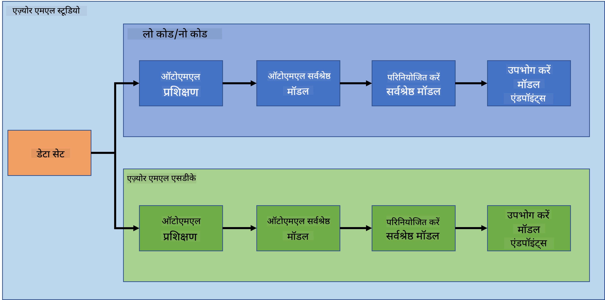
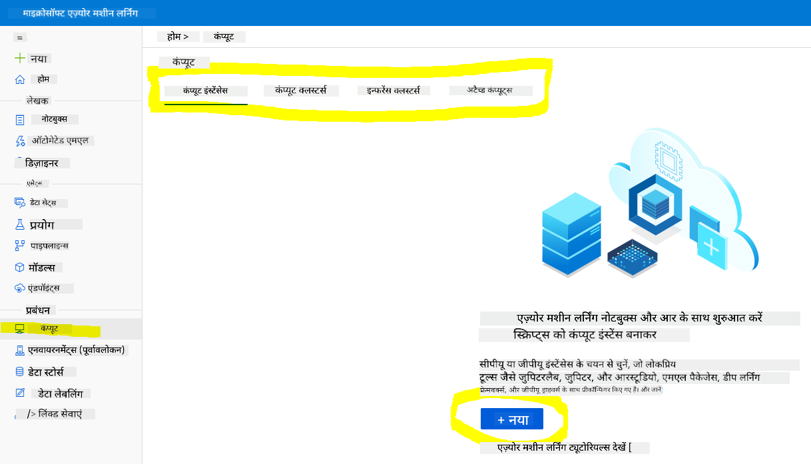
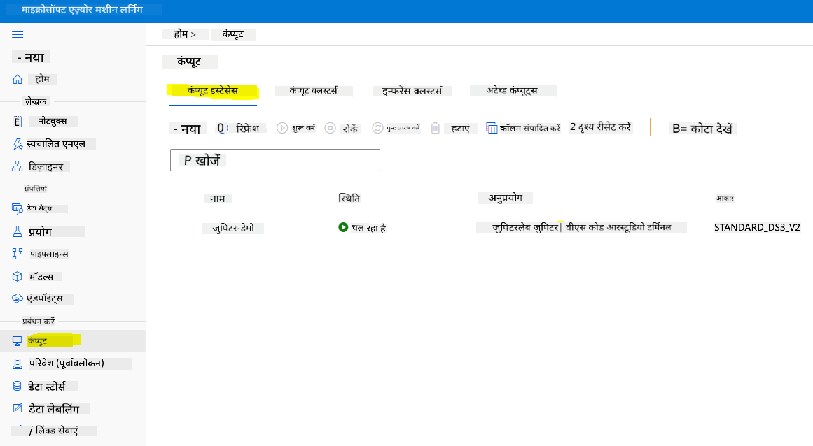
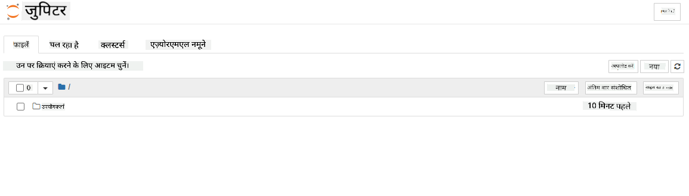

<!--
CO_OP_TRANSLATOR_METADATA:
{
  "original_hash": "73dead89dc2ddda4d6ec0232814a191e",
  "translation_date": "2025-08-24T22:10:34+00:00",
  "source_file": "5-Data-Science-In-Cloud/19-Azure/README.md",
  "language_code": "hi"
}
-->
# क्लाउड में डेटा साइंस: "Azure ML SDK" का तरीका

| द्वारा ](../../sketchnotes/19-DataScience-Cloud.png)|
|:---:|
| क्लाउड में डेटा साइंस: Azure ML SDK - _[@nitya](https://twitter.com/nitya) द्वारा स्केच नोट_ |

सामग्री तालिका:

- [क्लाउड में डेटा साइंस: "Azure ML SDK" का तरीका](../../../../5-Data-Science-In-Cloud/19-Azure)
  - [प्री-लेक्चर क्विज़](../../../../5-Data-Science-In-Cloud/19-Azure)
  - [1. परिचय](../../../../5-Data-Science-In-Cloud/19-Azure)
    - [1.1 Azure ML SDK क्या है?](../../../../5-Data-Science-In-Cloud/19-Azure)
    - [1.2 हार्ट फेल्योर प्रेडिक्शन प्रोजेक्ट और डेटासेट परिचय](../../../../5-Data-Science-In-Cloud/19-Azure)
  - [2. Azure ML SDK के साथ मॉडल ट्रेनिंग](../../../../5-Data-Science-In-Cloud/19-Azure)
    - [2.1 Azure ML वर्कस्पेस बनाना](../../../../5-Data-Science-In-Cloud/19-Azure)
    - [2.2 कंप्यूट इंस्टेंस बनाना](../../../../5-Data-Science-In-Cloud/19-Azure)
    - [2.3 डेटासेट लोड करना](../../../../5-Data-Science-In-Cloud/19-Azure)
    - [2.4 नोटबुक बनाना](../../../../5-Data-Science-In-Cloud/19-Azure)
    - [2.5 मॉडल ट्रेनिंग](../../../../5-Data-Science-In-Cloud/19-Azure)
      - [2.5.1 वर्कस्पेस, एक्सपेरिमेंट, कंप्यूट क्लस्टर और डेटासेट सेटअप करना](../../../../5-Data-Science-In-Cloud/19-Azure)
      - [2.5.2 AutoML कॉन्फ़िगरेशन और ट्रेनिंग](../../../../5-Data-Science-In-Cloud/19-Azure)
  - [3. Azure ML SDK के साथ मॉडल डिप्लॉयमेंट और एंडपॉइंट उपयोग](../../../../5-Data-Science-In-Cloud/19-Azure)
    - [3.1 सर्वश्रेष्ठ मॉडल को सेव करना](../../../../5-Data-Science-In-Cloud/19-Azure)
    - [3.2 मॉडल डिप्लॉयमेंट](../../../../5-Data-Science-In-Cloud/19-Azure)
    - [3.3 एंडपॉइंट उपयोग](../../../../5-Data-Science-In-Cloud/19-Azure)
  - [🚀 चुनौती](../../../../5-Data-Science-In-Cloud/19-Azure)
  - [पोस्ट-लेक्चर क्विज़](../../../../5-Data-Science-In-Cloud/19-Azure)
  - [समीक्षा और स्व-अध्ययन](../../../../5-Data-Science-In-Cloud/19-Azure)
  - [असाइनमेंट](../../../../5-Data-Science-In-Cloud/19-Azure)

## [प्री-लेक्चर क्विज़](https://purple-hill-04aebfb03.1.azurestaticapps.net/quiz/36)

## 1. परिचय

### 1.1 Azure ML SDK क्या है?

डेटा वैज्ञानिक और AI डेवलपर्स Azure Machine Learning SDK का उपयोग करके Azure Machine Learning सेवा के साथ मशीन लर्निंग वर्कफ़्लो बनाते और चलाते हैं। आप इस सेवा के साथ किसी भी Python वातावरण में इंटरैक्ट कर सकते हैं, जैसे Jupyter Notebooks, Visual Studio Code, या आपका पसंदीदा Python IDE।

SDK के मुख्य क्षेत्र:

- मशीन लर्निंग प्रयोगों में उपयोग किए जाने वाले आपके डेटासेट का एक्सप्लोर, तैयारी और जीवनचक्र प्रबंधन।
- क्लाउड संसाधनों का प्रबंधन, जैसे मॉनिटरिंग, लॉगिंग, और आपके मशीन लर्निंग प्रयोगों को व्यवस्थित करना।
- मॉडल को स्थानीय रूप से या क्लाउड संसाधनों का उपयोग करके ट्रेन करना, जिसमें GPU-त्वरित मॉडल ट्रेनिंग शामिल है।
- ऑटोमेटेड मशीन लर्निंग का उपयोग करना, जो कॉन्फ़िगरेशन पैरामीटर और ट्रेनिंग डेटा स्वीकार करता है। यह एल्गोरिदम और हाइपरपैरामीटर सेटिंग्स के माध्यम से स्वचालित रूप से पुनरावृत्ति करता है ताकि भविष्यवाणियों को चलाने के लिए सर्वश्रेष्ठ मॉडल खोजा जा सके।
- वेब सेवाओं को तैनात करना ताकि आपके प्रशिक्षित मॉडल को RESTful सेवाओं में परिवर्तित किया जा सके, जिन्हें किसी भी एप्लिकेशन में उपयोग किया जा सके।

[Azure Machine Learning SDK के बारे में अधिक जानें](https://docs.microsoft.com/python/api/overview/azure/ml?WT.mc_id=academic-77958-bethanycheum&ocid=AID3041109)

[पिछले पाठ](../18-Low-Code/README.md) में, हमने देखा कि कैसे लो कोड/नो कोड तरीके से मॉडल को ट्रेन, डिप्लॉय और उपयोग किया जा सकता है। हमने हार्ट फेल्योर डेटासेट का उपयोग करके हार्ट फेल्योर प्रेडिक्शन मॉडल बनाया। इस पाठ में, हम वही प्रक्रिया Azure Machine Learning SDK का उपयोग करके करेंगे।



### 1.2 हार्ट फेल्योर प्रेडिक्शन प्रोजेक्ट और डेटासेट परिचय

हार्ट फेल्योर प्रेडिक्शन प्रोजेक्ट और डेटासेट परिचय के लिए [यहां देखें](../18-Low-Code/README.md)।

## 2. Azure ML SDK के साथ मॉडल ट्रेनिंग
### 2.1 Azure ML वर्कस्पेस बनाना

सरलता के लिए, हम जुपिटर नोटबुक पर काम करेंगे। इसका मतलब है कि आपके पास पहले से ही एक वर्कस्पेस और एक कंप्यूट इंस्टेंस होना चाहिए। यदि आपके पास पहले से वर्कस्पेस है, तो आप सीधे सेक्शन 2.3 नोटबुक निर्माण पर जा सकते हैं।

यदि नहीं, तो कृपया [पिछले पाठ](../18-Low-Code/README.md) के सेक्शन **2.1 Azure ML वर्कस्पेस बनाना** में दिए गए निर्देशों का पालन करें।

### 2.2 कंप्यूट इंस्टेंस बनाना

[Azure ML वर्कस्पेस](https://ml.azure.com/) में जाएं जिसे हमने पहले बनाया था। कंप्यूट मेनू पर जाएं और आपको उपलब्ध विभिन्न कंप्यूट संसाधन दिखाई देंगे।



आइए एक कंप्यूट इंस्टेंस बनाएं ताकि जुपिटर नोटबुक को प्रोविजन किया जा सके। 
1. + New बटन पर क्लिक करें। 
2. अपने कंप्यूट इंस्टेंस को एक नाम दें।
3. अपने विकल्प चुनें: CPU या GPU, VM आकार और कोर संख्या।
4. Create बटन पर क्लिक करें।

बधाई हो, आपने अभी एक कंप्यूट इंस्टेंस बनाया है! हम इस कंप्यूट इंस्टेंस का उपयोग [नोटबुक निर्माण सेक्शन](../../../../5-Data-Science-In-Cloud/19-Azure) में करेंगे।

### 2.3 डेटासेट लोड करना
यदि आपने अभी तक डेटासेट अपलोड नहीं किया है, तो [पिछले पाठ](../18-Low-Code/README.md) के सेक्शन **2.3 डेटासेट लोड करना** देखें।

### 2.4 नोटबुक बनाना

> **_नोट:_** अगले चरण के लिए आप या तो एक नया नोटबुक स्क्रैच से बना सकते हैं, या आप [हमारे द्वारा बनाया गया नोटबुक](../../../../5-Data-Science-In-Cloud/19-Azure/notebook.ipynb) Azure ML Studio में अपलोड कर सकते हैं। इसे अपलोड करने के लिए, बस "Notebook" मेनू पर क्लिक करें और नोटबुक अपलोड करें।

नोटबुक डेटा साइंस प्रक्रिया का एक बहुत महत्वपूर्ण हिस्सा हैं। इन्हें एक्सप्लोरेटरी डेटा एनालिसिस (EDA) करने, कंप्यूटर क्लस्टर को मॉडल ट्रेनिंग के लिए कॉल करने, और इंफरेंस क्लस्टर को एंडपॉइंट डिप्लॉय करने के लिए उपयोग किया जा सकता है।

नोटबुक बनाने के लिए, हमें एक कंप्यूट नोड की आवश्यकता होती है जो जुपिटर नोटबुक इंस्टेंस को सर्व कर रहा हो। [Azure ML वर्कस्पेस](https://ml.azure.com/) पर वापस जाएं और कंप्यूट इंस्टेंस पर क्लिक करें। कंप्यूट इंस्टेंस की सूची में आपको [हमने पहले बनाया कंप्यूट इंस्टेंस](../../../../5-Data-Science-In-Cloud/19-Azure) दिखाई देगा। 

1. Applications सेक्शन में, Jupyter विकल्प पर क्लिक करें। 
2. "Yes, I understand" बॉक्स को टिक करें और Continue बटन पर क्लिक करें।

3. यह आपके जुपिटर नोटबुक इंस्टेंस के साथ एक नया ब्राउज़र टैब खोलना चाहिए। "New" बटन पर क्लिक करें और नोटबुक बनाएं।



अब जब हमारे पास एक नोटबुक है, तो हम Azure ML SDK के साथ मॉडल ट्रेनिंग शुरू कर सकते हैं।

### 2.5 मॉडल ट्रेनिंग

सबसे पहले, यदि आपको कभी संदेह हो, तो [Azure ML SDK दस्तावेज़](https://docs.microsoft.com/python/api/overview/azure/ml?WT.mc_id=academic-77958-bethanycheum&ocid=AID3041109) देखें। इसमें उन सभी मॉड्यूल की जानकारी है जिन्हें हम इस पाठ में देखेंगे।

#### 2.5.1 वर्कस्पेस, एक्सपेरिमेंट, कंप्यूट क्लस्टर और डेटासेट सेटअप करना

आप निम्नलिखित कोड का उपयोग करके कॉन्फ़िगरेशन फ़ाइल से `वर्कस्पेस` लोड कर सकते हैं:

```python
from azureml.core import Workspace
ws = Workspace.from_config()
```

यह `Workspace` प्रकार का एक ऑब्जेक्ट लौटाता है जो वर्कस्पेस का प्रतिनिधित्व करता है। फिर आपको निम्नलिखित कोड का उपयोग करके एक `एक्सपेरिमेंट` बनाना होगा:

```python
from azureml.core import Experiment
experiment_name = 'aml-experiment'
experiment = Experiment(ws, experiment_name)
```
वर्कस्पेस से एक्सपेरिमेंट प्राप्त करने या बनाने के लिए, आप एक्सपेरिमेंट नाम का उपयोग करके अनुरोध करते हैं। एक्सपेरिमेंट नाम 3-36 वर्णों का होना चाहिए, एक अक्षर या संख्या से शुरू होना चाहिए, और केवल अक्षर, संख्या, अंडरस्कोर और डैश शामिल कर सकता है। यदि वर्कस्पेस में एक्सपेरिमेंट नहीं मिलता है, तो एक नया एक्सपेरिमेंट बनाया जाता है।

अब आपको निम्नलिखित कोड का उपयोग करके ट्रेनिंग के लिए एक कंप्यूट क्लस्टर बनाना होगा। ध्यान दें कि यह चरण कुछ मिनट लग सकता है। 

```python
from azureml.core.compute import AmlCompute

aml_name = "heart-f-cluster"
try:
    aml_compute = AmlCompute(ws, aml_name)
    print('Found existing AML compute context.')
except:
    print('Creating new AML compute context.')
    aml_config = AmlCompute.provisioning_configuration(vm_size = "Standard_D2_v2", min_nodes=1, max_nodes=3)
    aml_compute = AmlCompute.create(ws, name = aml_name, provisioning_configuration = aml_config)
    aml_compute.wait_for_completion(show_output = True)

cts = ws.compute_targets
compute_target = cts[aml_name]
```

आप वर्कस्पेस से डेटासेट नाम का उपयोग करके डेटासेट प्राप्त कर सकते हैं:

```python
dataset = ws.datasets['heart-failure-records']
df = dataset.to_pandas_dataframe()
df.describe()
```
#### 2.5.2 AutoML कॉन्फ़िगरेशन और ट्रेनिंग

AutoML कॉन्फ़िगरेशन सेट करने के लिए [AutoMLConfig क्लास](https://docs.microsoft.com/python/api/azureml-train-automl-client/azureml.train.automl.automlconfig(class)?WT.mc_id=academic-77958-bethanycheum&ocid=AID3041109) का उपयोग करें।

जैसा कि दस्तावेज़ में वर्णित है, आप कई पैरामीटर के साथ खेल सकते हैं। इस प्रोजेक्ट के लिए, हम निम्नलिखित पैरामीटर का उपयोग करेंगे:

- `experiment_timeout_minutes`: वह अधिकतम समय (मिनटों में) जो प्रयोग को चलाने की अनुमति है।
- `max_concurrent_iterations`: प्रयोग के लिए अनुमत अधिकतम समवर्ती ट्रेनिंग पुनरावृत्तियाँ।
- `primary_metric`: प्रयोग की स्थिति निर्धारित करने के लिए उपयोग किया जाने वाला प्राथमिक मीट्रिक।
- `compute_target`: ऑटोमेटेड मशीन लर्निंग प्रयोग चलाने के लिए Azure Machine Learning कंप्यूट लक्ष्य।
- `task`: चलाने के लिए कार्य का प्रकार। मान 'classification', 'regression', या 'forecasting' हो सकते हैं।
- `training_data`: प्रयोग के भीतर उपयोग किए जाने वाले ट्रेनिंग डेटा। इसमें ट्रेनिंग फीचर्स और एक लेबल कॉलम (वैकल्पिक रूप से एक सैंपल वेट कॉलम) शामिल होना चाहिए।
- `label_column_name`: लेबल कॉलम का नाम।
- `path`: Azure Machine Learning प्रोजेक्ट फ़ोल्डर का पूर्ण पथ।
- `enable_early_stopping`: यदि स्कोर अल्पकालिक में सुधार नहीं कर रहा है तो प्रारंभिक समाप्ति सक्षम करें।
- `featurization`: स्वचालित रूप से फीचराइजेशन चरण किया जाना चाहिए या नहीं, या कस्टमाइज्ड फीचराइजेशन का उपयोग किया जाना चाहिए।
- `debug_log`: डिबग जानकारी लिखने के लिए लॉग फ़ाइल।

```python
from azureml.train.automl import AutoMLConfig

project_folder = './aml-project'

automl_settings = {
    "experiment_timeout_minutes": 20,
    "max_concurrent_iterations": 3,
    "primary_metric" : 'AUC_weighted'
}

automl_config = AutoMLConfig(compute_target=compute_target,
                             task = "classification",
                             training_data=dataset,
                             label_column_name="DEATH_EVENT",
                             path = project_folder,  
                             enable_early_stopping= True,
                             featurization= 'auto',
                             debug_log = "automl_errors.log",
                             **automl_settings
                            )
```
अब जब आपका कॉन्फ़िगरेशन सेट हो गया है, तो आप निम्नलिखित कोड का उपयोग करके मॉडल को ट्रेन कर सकते हैं। यह चरण आपके क्लस्टर आकार के आधार पर एक घंटे तक लग सकता है।

```python
remote_run = experiment.submit(automl_config)
```
आप RunDetails विजेट चला सकते हैं ताकि विभिन्न प्रयोग दिखाए जा सकें।
```python
from azureml.widgets import RunDetails
RunDetails(remote_run).show()
```
## 3. Azure ML SDK के साथ मॉडल डिप्लॉयमेंट और एंडपॉइंट उपयोग

### 3.1 सर्वश्रेष्ठ मॉडल को सेव करना

`remote_run` [AutoMLRun](https://docs.microsoft.com/python/api/azureml-train-automl-client/azureml.train.automl.run.automlrun?WT.mc_id=academic-77958-bethanycheum&ocid=AID3041109) प्रकार का एक ऑब्जेक्ट है। इस ऑब्जेक्ट में `get_output()` नामक विधि होती है जो सर्वश्रेष्ठ रन और संबंधित फिटेड मॉडल लौटाती है।

```python
best_run, fitted_model = remote_run.get_output()
```
आप फिटेड_model को प्रिंट करके सर्वश्रेष्ठ मॉडल के लिए उपयोग किए गए पैरामीटर देख सकते हैं और [get_properties()](https://docs.microsoft.com/python/api/azureml-core/azureml.core.run(class)?view=azure-ml-py#azureml_core_Run_get_properties?WT.mc_id=academic-77958-bethanycheum&ocid=AID3041109) विधि का उपयोग करके सर्वश्रेष्ठ मॉडल की विशेषताओं को देख सकते हैं।

```python
best_run.get_properties()
```

अब [register_model](https://docs.microsoft.com/python/api/azureml-train-automl-client/azureml.train.automl.run.automlrun?view=azure-ml-py#register-model-model-name-none--description-none--tags-none--iteration-none--metric-none-?WT.mc_id=academic-77958-bethanycheum&ocid=AID3041109) विधि का उपयोग करके मॉडल को रजिस्टर करें।
```python
model_name = best_run.properties['model_name']
script_file_name = 'inference/score.py'
best_run.download_file('outputs/scoring_file_v_1_0_0.py', 'inference/score.py')
description = "aml heart failure project sdk"
model = best_run.register_model(model_name = model_name,
                                model_path = './outputs/',
                                description = description,
                                tags = None)
```
### 3.2 मॉडल डिप्लॉयमेंट

एक बार सर्वश्रेष्ठ मॉडल सेव हो जाने के बाद, हम इसे [InferenceConfig](https://docs.microsoft.com/python/api/azureml-core/azureml.core.model.inferenceconfig?view=azure-ml-py?ocid=AID3041109) क्लास का उपयोग करके तैनात कर सकते हैं। InferenceConfig तैनाती के लिए उपयोग किए जाने वाले कस्टम वातावरण के लिए कॉन्फ़िगरेशन सेटिंग्स का प्रतिनिधित्व करता है। [AciWebservice](https://docs.microsoft.com/python/api/azureml-core/azureml.core.webservice.aciwebservice?view=azure-ml-py) क्लास Azure Container Instances पर एक वेब सेवा एंडपॉइंट के रूप में तैनात मशीन लर्निंग मॉडल का प्रतिनिधित्व करता है। एक तैनात सेवा मॉडल, स्क्रिप्ट और संबंधित फ़ाइलों से बनाई जाती है। परिणामी वेब सेवा एक लोड-बैलेंस्ड, HTTP एंडपॉइंट है जिसमें REST API है। आप इस API को डेटा भेज सकते हैं और मॉडल द्वारा लौटाई गई भविष्यवाणी प्राप्त कर सकते हैं।

मॉडल को [deploy](https://docs.microsoft.com/python/api/azureml-core/azureml.core.model(class)?view=azure-ml-py#deploy-workspace--name--models--inference-config-none--deployment-config-none--deployment-target-none--overwrite-false--show-output-false-?WT.mc_id=academic-77958-bethanycheum&ocid=AID3041109) विधि का उपयोग करके तैनात किया जाता है।

```python
from azureml.core.model import InferenceConfig, Model
from azureml.core.webservice import AciWebservice

inference_config = InferenceConfig(entry_script=script_file_name, environment=best_run.get_environment())

aciconfig = AciWebservice.deploy_configuration(cpu_cores = 1,
                                               memory_gb = 1,
                                               tags = {'type': "automl-heart-failure-prediction"},
                                               description = 'Sample service for AutoML Heart Failure Prediction')

aci_service_name = 'automl-hf-sdk'
aci_service = Model.deploy(ws, aci_service_name, [model], inference_config, aciconfig)
aci_service.wait_for_deployment(True)
print(aci_service.state)
```
यह चरण कुछ मिनट लग सकता है।

### 3.3 एंडपॉइंट उपयोग

आप अपने एंडपॉइंट का उपयोग एक नमूना इनपुट बनाकर कर सकते हैं:

```python
data = {
    "data":
    [
        {
            'age': "60",
            'anaemia': "false",
            'creatinine_phosphokinase': "500",
            'diabetes': "false",
            'ejection_fraction': "38",
            'high_blood_pressure': "false",
            'platelets': "260000",
            'serum_creatinine': "1.40",
            'serum_sodium': "137",
            'sex': "false",
            'smoking': "false",
            'time': "130",
        },
    ],
}

test_sample = str.encode(json.dumps(data))
```
और फिर आप इस इनपुट को भविष्यवाणी के लिए अपने मॉडल को भेज सकते हैं:
```python
response = aci_service.run(input_data=test_sample)
response
```  
यह आउटपुट `'{"result": [false]}'` होना चाहिए। इसका मतलब है कि हमने जो मरीज का इनपुट एंडपॉइंट पर भेजा, उससे `false` प्रेडिक्शन जनरेट हुआ, जो यह दर्शाता है कि इस व्यक्ति को हार्ट अटैक होने की संभावना नहीं है।  

बधाई हो! आपने Azure ML SDK के साथ Azure ML पर डिप्लॉय और ट्रेन किए गए मॉडल को सफलतापूर्वक उपयोग किया!  

> **_NOTE:_** प्रोजेक्ट पूरा करने के बाद, सभी संसाधनों को डिलीट करना न भूलें।  

## 🚀 चुनौती  

SDK के माध्यम से आप और भी कई चीजें कर सकते हैं, लेकिन दुर्भाग्यवश, हम इस पाठ में उन सभी को कवर नहीं कर सकते। अच्छी खबर यह है कि SDK डाक्यूमेंटेशन को पढ़ने और समझने की कला आपको आगे बढ़ने में मदद कर सकती है। Azure ML SDK डाक्यूमेंटेशन पर जाएं और `Pipeline` क्लास को खोजें, जो आपको पाइपलाइनों को बनाने की अनुमति देता है। पाइपलाइन स्टेप्स का एक संग्रह है जिसे वर्कफ़्लो के रूप में निष्पादित किया जा सकता है।  

**संकेत:** [SDK डाक्यूमेंटेशन](https://docs.microsoft.com/python/api/overview/azure/ml/?view=azure-ml-py?WT.mc_id=academic-77958-bethanycheum&ocid=AID3041109) पर जाएं और सर्च बार में "Pipeline" जैसे कीवर्ड टाइप करें। आपको सर्च रिजल्ट्स में `azureml.pipeline.core.Pipeline` क्लास मिलनी चाहिए।  

## [पाठ के बाद का क्विज़](https://purple-hill-04aebfb03.1.azurestaticapps.net/quiz/37)  

## समीक्षा और स्व-अध्ययन  

इस पाठ में, आपने सीखा कि Azure ML SDK का उपयोग करके क्लाउड में हार्ट फेल्योर जोखिम की भविष्यवाणी करने के लिए एक मॉडल को ट्रेन, डिप्लॉय और उपयोग कैसे करें। Azure ML SDK के बारे में अधिक जानकारी के लिए इस [डाक्यूमेंटेशन](https://docs.microsoft.com/python/api/overview/azure/ml/?view=azure-ml-py?WT.mc_id=academic-77958-bethanycheum&ocid=AID3041109) को देखें। Azure ML SDK के साथ अपना खुद का मॉडल बनाने का प्रयास करें।  

## असाइनमेंट  

[Azure ML SDK का उपयोग करके डेटा साइंस प्रोजेक्ट](assignment.md)  

**अस्वीकरण**:  
यह दस्तावेज़ AI अनुवाद सेवा [Co-op Translator](https://github.com/Azure/co-op-translator) का उपयोग करके अनुवादित किया गया है। जबकि हम सटीकता सुनिश्चित करने का प्रयास करते हैं, कृपया ध्यान दें कि स्वचालित अनुवाद में त्रुटियां या अशुद्धियां हो सकती हैं। मूल भाषा में उपलब्ध मूल दस्तावेज़ को प्रामाणिक स्रोत माना जाना चाहिए। महत्वपूर्ण जानकारी के लिए, पेशेवर मानव अनुवाद की सिफारिश की जाती है। इस अनुवाद के उपयोग से उत्पन्न किसी भी गलतफहमी या गलत व्याख्या के लिए हम उत्तरदायी नहीं हैं।