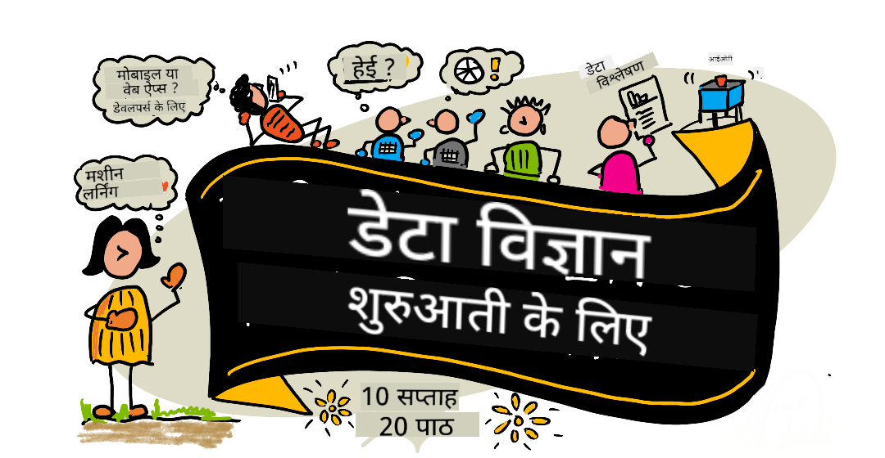

<!--
CO_OP_TRANSLATOR_METADATA:
{
  "original_hash": "210052dafe5b5d956c427824e2c96686",
  "translation_date": "2025-12-19T10:53:57+00:00",
  "source_file": "README.md",
  "language_code": "hi"
}
-->
# शुरुआती लोगों के लिए डेटा साइंस - एक पाठ्यक्रम

Microsoft में Azure Cloud Advocates डेटा साइंस के बारे में 10 सप्ताह, 20-लेसन का पाठ्यक्रम प्रस्तुत करते हुए प्रसन्न हैं। प्रत्येक पाठ में प्री-लेसन और पोस्ट-लेसन क्विज़, पाठ पूरा करने के लिए लिखित निर्देश, एक समाधान, और एक असाइनमेंट शामिल है। हमारा प्रोजेक्ट-आधारित शिक्षण तरीका आपको निर्माण करते हुए सीखने की अनुमति देता है, जो नई कौशलों को 'टिकाने' का सिद्ध तरीका है।

**हमारे लेखकों को हार्दिक धन्यवाद:** [Jasmine Greenaway](https://www.twitter.com/paladique), [Dmitry Soshnikov](http://soshnikov.com), [Nitya Narasimhan](https://twitter.com/nitya), [Jalen McGee](https://twitter.com/JalenMcG), [Jen Looper](https://twitter.com/jenlooper), [Maud Levy](https://twitter.com/maudstweets), [Tiffany Souterre](https://twitter.com/TiffanySouterre), [Christopher Harrison](https://www.twitter.com/geektrainer).

**🙏 विशेष धन्यवाद 🙏 हमारे [Microsoft Student Ambassador](https://studentambassadors.microsoft.com/) लेखकों, समीक्षकों और सामग्री योगदानकर्ताओं को,** विशेष रूप से Aaryan Arora, [Aditya Garg](https://github.com/AdityaGarg00), [Alondra Sanchez](https://www.linkedin.com/in/alondra-sanchez-molina/), [Ankita Singh](https://www.linkedin.com/in/ankitasingh007), [Anupam Mishra](https://www.linkedin.com/in/anupam--mishra/), [Arpita Das](https://www.linkedin.com/in/arpitadas01/), ChhailBihari Dubey, [Dibri Nsofor](https://www.linkedin.com/in/dibrinsofor), [Dishita Bhasin](https://www.linkedin.com/in/dishita-bhasin-7065281bb), [Majd Safi](https://www.linkedin.com/in/majd-s/), [Max Blum](https://www.linkedin.com/in/max-blum-6036a1186/), [Miguel Correa](https://www.linkedin.com/in/miguelmque/), [Mohamma Iftekher (Iftu) Ebne Jalal](https://twitter.com/iftu119), [Nawrin Tabassum](https://www.linkedin.com/in/nawrin-tabassum), [Raymond Wangsa Putra](https://www.linkedin.com/in/raymond-wp/), [Rohit Yadav](https://www.linkedin.com/in/rty2423), Samridhi Sharma, [Sanya Sinha](https://www.linkedin.com/mwlite/in/sanya-sinha-13aab1200),
[Sheena Narula](https://www.linkedin.com/in/sheena-narua-n/), [Tauqeer Ahmad](https://www.linkedin.com/in/tauqeerahmad5201/), Yogendrasingh Pawar , [Vidushi Gupta](https://www.linkedin.com/in/vidushi-gupta07/), [Jasleen Sondhi](https://www.linkedin.com/in/jasleen-sondhi/)

||
|:---:|
| शुरुआती लोगों के लिए डेटा साइंस - _स्केचनोट द्वारा [@nitya](https://twitter.com/nitya)_ |

### 🌐 बहुभाषी समर्थन

#### GitHub Action के माध्यम से समर्थित (स्वचालित और हमेशा अद्यतित)

<!-- CO-OP TRANSLATOR LANGUAGES TABLE START -->
[Arabic](../ar/README.md) | [Bengali](../bn/README.md) | [Bulgarian](../bg/README.md) | [Burmese (Myanmar)](../my/README.md) | [Chinese (Simplified)](../zh/README.md) | [Chinese (Traditional, Hong Kong)](../hk/README.md) | [Chinese (Traditional, Macau)](../mo/README.md) | [Chinese (Traditional, Taiwan)](../tw/README.md) | [Croatian](../hr/README.md) | [Czech](../cs/README.md) | [Danish](../da/README.md) | [Dutch](../nl/README.md) | [Estonian](../et/README.md) | [Finnish](../fi/README.md) | [French](../fr/README.md) | [German](../de/README.md) | [Greek](../el/README.md) | [Hebrew](../he/README.md) | [Hindi](./README.md) | [Hungarian](../hu/README.md) | [Indonesian](../id/README.md) | [Italian](../it/README.md) | [Japanese](../ja/README.md) | [Kannada](../kn/README.md) | [Korean](../ko/README.md) | [Lithuanian](../lt/README.md) | [Malay](../ms/README.md) | [Malayalam](../ml/README.md) | [Marathi](../mr/README.md) | [Nepali](../ne/README.md) | [Nigerian Pidgin](../pcm/README.md) | [Norwegian](../no/README.md) | [Persian (Farsi)](../fa/README.md) | [Polish](../pl/README.md) | [Portuguese (Brazil)](../br/README.md) | [Portuguese (Portugal)](../pt/README.md) | [Punjabi (Gurmukhi)](../pa/README.md) | [Romanian](../ro/README.md) | [Russian](../ru/README.md) | [Serbian (Cyrillic)](../sr/README.md) | [Slovak](../sk/README.md) | [Slovenian](../sl/README.md) | [Spanish](../es/README.md) | [Swahili](../sw/README.md) | [Swedish](../sv/README.md) | [Tagalog (Filipino)](../tl/README.md) | [Tamil](../ta/README.md) | [Telugu](../te/README.md) | [Thai](../th/README.md) | [Turkish](../tr/README.md) | [Ukrainian](../uk/README.md) | [Urdu](../ur/README.md) | [Vietnamese](../vi/README.md)
<!-- CO-OP TRANSLATOR LANGUAGES TABLE END -->

**यदि आप अतिरिक्त अनुवाद भाषाओं का समर्थन चाहते हैं, तो वे [यहाँ](https://github.com/Azure/co-op-translator/blob/main/getting_started/supported-languages.md) सूचीबद्ध हैं**

#### हमारे समुदाय में शामिल हों 

हमारे पास एक Discord सीखने के लिए AI श्रृंखला चल रही है, अधिक जानने और हमारे साथ जुड़ने के लिए [Learn with AI Series](https://aka.ms/learnwithai/discord) पर जाएं, जो 18 - 30 सितंबर, 2025 तक चलेगी। आपको डेटा साइंस के लिए GitHub Copilot का उपयोग करने के टिप्स और ट्रिक्स मिलेंगे।

# क्या आप छात्र हैं?

निम्नलिखित संसाधनों के साथ शुरू करें:

- [Student Hub page](https://docs.microsoft.com/en-gb/learn/student-hub?WT.mc_id=academic-77958-bethanycheum) इस पृष्ठ पर, आपको शुरुआती संसाधन, छात्र पैक और यहां तक कि मुफ्त प्रमाणपत्र वाउचर प्राप्त करने के तरीके मिलेंगे। यह एक ऐसा पृष्ठ है जिसे आप बुकमार्क करना चाहेंगे और समय-समय पर जांचना चाहेंगे क्योंकि हम कम से कम मासिक रूप से सामग्री बदलते रहते हैं।
- [Microsoft Learn Student Ambassadors](https://studentambassadors.microsoft.com?WT.mc_id=academic-77958-bethanycheum) एक वैश्विक छात्र एम्बेसडर समुदाय में शामिल हों, यह Microsoft में आपका प्रवेश हो सकता है।

# शुरू करना

## 📚 दस्तावेज़ीकरण

- **[इंस्टॉलेशन गाइड](INSTALLATION.md)** - शुरुआती लोगों के लिए चरण-दर-चरण सेटअप निर्देश
- **[उपयोग गाइड](USAGE.md)** - उदाहरण और सामान्य वर्कफ़्लो
- **[समस्या निवारण](TROUBLESHOOTING.md)** - सामान्य समस्याओं के समाधान
- **[योगदान गाइड](CONTRIBUTING.md)** - इस परियोजना में योगदान कैसे करें
- **[शिक्षकों के लिए](for-teachers.md)** - शिक्षण मार्गदर्शन और कक्षा संसाधन

## 👨‍🎓 छात्रों के लिए
> **पूर्ण शुरुआती**: डेटा साइंस में नए हैं? हमारे [शुरुआती-अनुकूल उदाहरण](examples/README.md) से शुरू करें! ये सरल, अच्छी तरह से टिप्पणी किए गए उदाहरण आपको पूरा पाठ्यक्रम शुरू करने से पहले मूल बातें समझने में मदद करेंगे।
> **[छात्र](https://aka.ms/student-page)**: इस पाठ्यक्रम का उपयोग अपने आप करने के लिए, पूरे रिपो को फोर्क करें और प्री-लेक्चर क्विज़ से शुरू करते हुए अभ्यास स्वयं पूरा करें। फिर व्याख्यान पढ़ें और बाकी गतिविधियाँ पूरी करें। समाधान कोड की नकल करने के बजाय पाठों को समझकर परियोजनाएँ बनाने का प्रयास करें; हालांकि, वह कोड प्रत्येक प्रोजेक्ट-उन्मुख पाठ में /solutions फ़ोल्डरों में उपलब्ध है। एक और विचार यह होगा कि दोस्तों के साथ एक अध्ययन समूह बनाएं और सामग्री को साथ में पढ़ें। आगे अध्ययन के लिए, हम [Microsoft Learn](https://docs.microsoft.com/en-us/users/jenlooper-2911/collections/qprpajyoy3x0g7?WT.mc_id=academic-77958-bethanycheum) की सलाह देते हैं।

**त्वरित शुरुआत:**
1. अपना वातावरण सेटअप करने के लिए [इंस्टॉलेशन गाइड](INSTALLATION.md) देखें
2. पाठ्यक्रम के साथ काम करना सीखने के लिए [उपयोग गाइड](USAGE.md) की समीक्षा करें
3. लेसन 1 से शुरू करें और क्रमशः काम करें
4. सहायता के लिए हमारे [Discord समुदाय](https://aka.ms/ds4beginners/discord) में शामिल हों

## 👩‍🏫 शिक्षकों के लिए

> **शिक्षक**: हमने इस पाठ्यक्रम का उपयोग कैसे करें इस पर [कुछ सुझाव शामिल किए हैं](for-teachers.md)। हम आपके फीडबैक का स्वागत करते हैं [हमारे चर्चा मंच](https://github.com/microsoft/Data-Science-For-Beginners/discussions) में!

## टीम से मिलें

**गिफ़ द्वारा** [Mohit Jaisal](https://www.linkedin.com/in/mohitjaisal)
> 🎥 परियोजना और इसे बनाने वाले लोगों के बारे में वीडियो के लिए ऊपर की छवि पर क्लिक करें!

## शिक्षाशास्त्र

हमने इस पाठ्यक्रम को बनाते समय दो शिक्षाशास्त्रीय सिद्धांत चुने हैं: यह सुनिश्चित करना कि यह परियोजना-आधारित हो और इसमें बार-बार क्विज़ शामिल हों। इस श्रृंखला के अंत तक, छात्र डेटा विज्ञान के बुनियादी सिद्धांत सीखेंगे, जिनमें नैतिक अवधारणाएं, डेटा तैयारी, डेटा के साथ काम करने के विभिन्न तरीके, डेटा विज़ुअलाइज़ेशन, डेटा विश्लेषण, डेटा विज्ञान के वास्तविक दुनिया के उपयोग के मामले, और भी बहुत कुछ शामिल है।

इसके अलावा, कक्षा से पहले एक कम दबाव वाला क्विज़ छात्र के विषय सीखने के इरादे को सेट करता है, जबकि कक्षा के बाद दूसरा क्विज़ और अधिक अवधारण सुनिश्चित करता है। यह पाठ्यक्रम लचीला और मजेदार होने के लिए डिज़ाइन किया गया है और इसे पूरी तरह या आंशिक रूप से लिया जा सकता है। परियोजनाएं छोटी शुरू होती हैं और 10 सप्ताह के चक्र के अंत तक धीरे-धीरे जटिल होती जाती हैं।

> हमारे [आचार संहिता](CODE_OF_CONDUCT.md), [योगदान](CONTRIBUTING.md), [अनुवाद](TRANSLATIONS.md) दिशानिर्देश देखें। हम आपके रचनात्मक सुझावों का स्वागत करते हैं!

## प्रत्येक पाठ में शामिल हैं:

- वैकल्पिक स्केचनोट
- वैकल्पिक पूरक वीडियो
- पाठ से पहले वार्मअप क्विज़
- लिखित पाठ
- परियोजना-आधारित पाठों के लिए, परियोजना बनाने के चरण-दर-चरण मार्गदर्शिकाएँ
- ज्ञान जांच
- एक चुनौती
- पूरक पठन
- असाइनमेंट
- [पाठ के बाद क्विज़](https://ff-quizzes.netlify.app/en/)

> **क्विज़ के बारे में एक नोट**: सभी क्विज़ क्विज़-ऐप फ़ोल्डर में हैं, कुल 40 क्विज़ जिनमें से प्रत्येक में तीन प्रश्न हैं। ये पाठों के भीतर लिंक किए गए हैं, लेकिन क्विज़ ऐप को स्थानीय रूप से चलाया जा सकता है या Azure पर तैनात किया जा सकता है; `quiz-app` फ़ोल्डर में निर्देशों का पालन करें। इन्हें धीरे-धीरे स्थानीयकृत किया जा रहा है।

## 🎓 शुरुआती के लिए अनुकूल उदाहरण

**डेटा साइंस में नए हैं?** हमने एक विशेष [उदाहरण निर्देशिका](examples/README.md) बनाई है जिसमें सरल, अच्छी तरह से टिप्पणी की गई कोड है जो आपको शुरू करने में मदद करेगी:

- 🌟 **हैलो वर्ल्ड** - आपका पहला डेटा साइंस प्रोग्राम
- 📂 **डेटा लोड करना** - डेटासेट पढ़ना और एक्सप्लोर करना सीखें
- 📊 **सरल विश्लेषण** - सांख्यिकी की गणना करें और पैटर्न खोजें
- 📈 **मूल विज़ुअलाइज़ेशन** - चार्ट और ग्राफ़ बनाएं
- 🔬 **वास्तविक दुनिया की परियोजना** - शुरुआत से अंत तक पूरा वर्कफ़्लो

प्रत्येक उदाहरण में हर चरण को समझाने वाली विस्तृत टिप्पणियाँ शामिल हैं, जो इसे बिल्कुल शुरुआती लोगों के लिए उपयुक्त बनाती हैं!

👉 **[उदाहरणों के साथ शुरू करें](examples/README.md)** 👈

## पाठ

||
|:---:|
| डेटा साइंस फॉर बिगिनर्स: रोडमैप - _स्केचनोट [@nitya](https://twitter.com/nitya) द्वारा_ |

| पाठ संख्या | विषय | पाठ समूह | सीखने के उद्देश्य | लिंक्ड पाठ | लेखक |
| :-----------: | :----------------------------------------: | :--------------------------------------------------: | :-----------------------------------------------------------------------------------------------------------------------------------------------------------------------: | :---------------------------------------------------------------------: | :----: |
| 01 | डेटा साइंस की परिभाषा | [परिचय](1-Introduction/README.md) | डेटा साइंस के मूलभूत सिद्धांत सीखें और यह कृत्रिम बुद्धिमत्ता, मशीन लर्निंग, और बिग डेटा से कैसे संबंधित है। | [पाठ](1-Introduction/01-defining-data-science/README.md) [वीडियो](https://youtu.be/beZ7Mb_oz9I) | [दिमित्री](http://soshnikov.com) |
| 02 | डेटा साइंस नैतिकता | [परिचय](1-Introduction/README.md) | डेटा नैतिकता की अवधारणाएं, चुनौतियाँ और ढांचे। | [पाठ](1-Introduction/02-ethics/README.md) | [नित्या](https://twitter.com/nitya) |
| 03 | डेटा की परिभाषा | [परिचय](1-Introduction/README.md) | डेटा कैसे वर्गीकृत किया जाता है और इसके सामान्य स्रोत। | [पाठ](1-Introduction/03-defining-data/README.md) | [जैस्मिन](https://www.twitter.com/paladique) |
| 04 | सांख्यिकी और संभावना का परिचय | [परिचय](1-Introduction/README.md) | डेटा को समझने के लिए संभावना और सांख्यिकी की गणितीय तकनीकें। | [पाठ](1-Introduction/04-stats-and-probability/README.md) [वीडियो](https://youtu.be/Z5Zy85g4Yjw) | [दिमित्री](http://soshnikov.com) |
| 05 | रिलेशनल डेटा के साथ काम करना | [डेटा के साथ काम करना](2-Working-With-Data/README.md) | रिलेशनल डेटा का परिचय और संरचित क्वेरी भाषा (SQL) के साथ रिलेशनल डेटा का अन्वेषण और विश्लेषण। | [पाठ](2-Working-With-Data/05-relational-databases/README.md) | [क्रिस्टोफर](https://www.twitter.com/geektrainer) | | |
| 06 | NoSQL डेटा के साथ काम करना | [डेटा के साथ काम करना](2-Working-With-Data/README.md) | गैर-रिलेशनल डेटा का परिचय, इसके विभिन्न प्रकार और दस्तावेज़ डेटाबेस का अन्वेषण और विश्लेषण। | [पाठ](2-Working-With-Data/06-non-relational/README.md) | [जैस्मिन](https://twitter.com/paladique)|
| 07 | पायथन के साथ काम करना | [डेटा के साथ काम करना](2-Working-With-Data/README.md) | पायथन का उपयोग करके डेटा अन्वेषण के मूल बातें, जैसे पांडा लाइब्रेरी। पायथन प्रोग्रामिंग की बुनियादी समझ अनुशंसित है। | [पाठ](2-Working-With-Data/07-python/README.md) [वीडियो](https://youtu.be/dZjWOGbsN4Y) | [दिमित्री](http://soshnikov.com) |
| 08 | डेटा तैयारी | [डेटा के साथ काम करना](2-Working-With-Data/README.md) | डेटा की सफाई और रूपांतरण के लिए तकनीकें, जो गायब, गलत या अधूरी डेटा की चुनौतियों को संभालती हैं। | [पाठ](2-Working-With-Data/08-data-preparation/README.md) | [जैस्मिन](https://www.twitter.com/paladique) |
| 09 | मात्राओं का विज़ुअलाइज़ेशन | [डेटा विज़ुअलाइज़ेशन](3-Data-Visualization/README.md) | मैटप्लॉटलिब का उपयोग करके पक्षी डेटा का विज़ुअलाइज़ेशन सीखें 🦆 | [पाठ](3-Data-Visualization/09-visualization-quantities/README.md) | [जेन](https://twitter.com/jenlooper) |
| 10 | डेटा के वितरण का विज़ुअलाइज़ेशन | [डेटा विज़ुअलाइज़ेशन](3-Data-Visualization/README.md) | एक अंतराल के भीतर अवलोकन और रुझानों का विज़ुअलाइज़ेशन। | [पाठ](3-Data-Visualization/10-visualization-distributions/README.md) | [जेन](https://twitter.com/jenlooper) |
| 11 | अनुपात का विज़ुअलाइज़ेशन | [डेटा विज़ुअलाइज़ेशन](3-Data-Visualization/README.md) | विविक्त और समूहित प्रतिशत का विज़ुअलाइज़ेशन। | [पाठ](3-Data-Visualization/11-visualization-proportions/README.md) | [जेन](https://twitter.com/jenlooper) |
| 12 | संबंधों का विज़ुअलाइज़ेशन | [डेटा विज़ुअलाइज़ेशन](3-Data-Visualization/README.md) | डेटा सेट और उनके चर के बीच कनेक्शन और सहसंबंध का विज़ुअलाइज़ेशन। | [पाठ](3-Data-Visualization/12-visualization-relationships/README.md) | [जेन](https://twitter.com/jenlooper) |
| 13 | सार्थक विज़ुअलाइज़ेशन | [डेटा विज़ुअलाइज़ेशन](3-Data-Visualization/README.md) | प्रभावी समस्या समाधान और अंतर्दृष्टि के लिए आपके विज़ुअलाइज़ेशन को मूल्यवान बनाने की तकनीकें और मार्गदर्शन। | [पाठ](3-Data-Visualization/13-meaningful-visualizations/README.md) | [जेन](https://twitter.com/jenlooper) |
| 14 | डेटा साइंस जीवनचक्र का परिचय | [जीवनचक्र](4-Data-Science-Lifecycle/README.md) | डेटा साइंस जीवनचक्र का परिचय और डेटा प्राप्त करने और निकालने का पहला चरण। | [पाठ](4-Data-Science-Lifecycle/14-Introduction/README.md) | [जैस्मिन](https://twitter.com/paladique) |
| 15 | विश्लेषण | [जीवनचक्र](4-Data-Science-Lifecycle/README.md) | डेटा साइंस जीवनचक्र का यह चरण डेटा का विश्लेषण करने की तकनीकों पर केंद्रित है। | [पाठ](4-Data-Science-Lifecycle/15-analyzing/README.md) | [जैस्मिन](https://twitter.com/paladique) | | |
| 16 | संचार | [जीवनचक्र](4-Data-Science-Lifecycle/README.md) | डेटा साइंस जीवनचक्र का यह चरण डेटा से अंतर्दृष्टि प्रस्तुत करने पर केंद्रित है ताकि निर्णय लेने वालों के लिए इसे समझना आसान हो। | [पाठ](4-Data-Science-Lifecycle/16-communication/README.md) | [जालेन](https://twitter.com/JalenMcG) | | |
| 17 | क्लाउड में डेटा साइंस | [क्लाउड डेटा](5-Data-Science-In-Cloud/README.md) | क्लाउड में डेटा साइंस और इसके लाभों का परिचय। | [पाठ](5-Data-Science-In-Cloud/17-Introduction/README.md) | [टिफ़नी](https://twitter.com/TiffanySouterre) और [मॉड](https://twitter.com/maudstweets) |
| 18 | क्लाउड में डेटा साइंस | [क्लाउड डेटा](5-Data-Science-In-Cloud/README.md) | लो कोड टूल्स का उपयोग करके मॉडल प्रशिक्षण। |[पाठ](5-Data-Science-In-Cloud/18-Low-Code/README.md) | [टिफ़नी](https://twitter.com/TiffanySouterre) और [मॉड](https://twitter.com/maudstweets) |
| 19 | क्लाउड में डेटा साइंस | [क्लाउड डेटा](5-Data-Science-In-Cloud/README.md) | Azure मशीन लर्निंग स्टूडियो के साथ मॉडल तैनात करना। | [पाठ](5-Data-Science-In-Cloud/19-Azure/README.md)| [टिफ़नी](https://twitter.com/TiffanySouterre) और [मॉड](https://twitter.com/maudstweets) |
| 20 | जंगली में डेटा साइंस | [जंगली में](6-Data-Science-In-Wild/README.md) | वास्तविक दुनिया में डेटा साइंस संचालित परियोजनाएं। | [पाठ](6-Data-Science-In-Wild/20-Real-World-Examples/README.md) | [नित्या](https://twitter.com/nitya) |

## GitHub Codespaces

इस नमूने को Codespace में खोलने के लिए ये चरणों का पालन करें:
1. कोड ड्रॉप-डाउन मेनू पर क्लिक करें और Open with Codespaces विकल्प चुनें।
2. पैन के नीचे + New codespace चुनें।
अधिक जानकारी के लिए, [GitHub दस्तावेज़](https://docs.github.com/en/codespaces/developing-in-codespaces/creating-a-codespace-for-a-repository#creating-a-codespace) देखें।

## VSCode Remote - Containers
अपने स्थानीय मशीन और VSCode का उपयोग करके इस रिपॉजिटरी को कंटेनर में खोलने के लिए VS Code Remote - Containers एक्सटेंशन का उपयोग करें:

1. यदि यह आपका पहली बार विकास कंटेनर का उपयोग है, तो कृपया सुनिश्चित करें कि आपका सिस्टम पूर्व-आवश्यकताओं को पूरा करता है (जैसे Docker इंस्टॉल होना) [शुरुआत करने के दस्तावेज़](https://code.visualstudio.com/docs/devcontainers/containers#_getting-started) में।

इस रिपॉजिटरी का उपयोग करने के लिए, आप या तो रिपॉजिटरी को एक अलग Docker वॉल्यूम में खोल सकते हैं:

**नोट**: इसके पीछे, यह Remote-Containers: **Clone Repository in Container Volume...** कमांड का उपयोग करेगा ताकि स्रोत कोड को स्थानीय फ़ाइल सिस्टम के बजाय Docker वॉल्यूम में क्लोन किया जा सके। [वॉल्यूम](https://docs.docker.com/storage/volumes/) कंटेनर डेटा को स्थायी बनाने के लिए प्राथमिक तंत्र हैं।

या रिपॉजिटरी के स्थानीय क्लोन या डाउनलोड किए गए संस्करण को खोलें:

- इस रिपॉजिटरी को अपने स्थानीय फ़ाइल सिस्टम पर क्लोन करें।
- F1 दबाएं और **Remote-Containers: Open Folder in Container...** कमांड चुनें।
- इस फ़ोल्डर की क्लोन की गई कॉपी चुनें, कंटेनर शुरू होने का इंतजार करें, और चीज़ों को आज़माएं।

## ऑफ़लाइन एक्सेस

आप [Docsify](https://docsify.js.org/#/) का उपयोग करके इस दस्तावेज़ को ऑफ़लाइन चला सकते हैं। इस रिपॉजिटरी को फोर्क करें, अपने स्थानीय मशीन पर [Docsify इंस्टॉल करें](https://docsify.js.org/#/quickstart), फिर इस रिपॉजिटरी के रूट फ़ोल्डर में `docsify serve` टाइप करें। वेबसाइट आपके लोकलहोस्ट पर पोर्ट 3000 पर सर्व की जाएगी: `localhost:3000`।

> ध्यान दें, नोटबुक Docsify के माध्यम से रेंडर नहीं होंगे, इसलिए जब आपको नोटबुक चलाने की आवश्यकता हो, तो इसे VS Code में पायथन कर्नेल चलाकर अलग से करें।

## अन्य पाठ्यक्रम

हमारी टीम अन्य पाठ्यक्रम भी बनाती है! देखें:

<!-- CO-OP TRANSLATOR OTHER COURSES START -->
### LangChain

---

### Azure / Edge / MCP / Agents

---
 
### जनरेटिव एआई श्रृंखला

[-9333EA?style=for-the-badge&labelColor=E5E7EB&color=9333EA)](https://github.com/microsoft/Generative-AI-for-beginners-dotnet?WT.mc_id=academic-105485-koreyst)
[-C084FC?style=for-the-badge&labelColor=E5E7EB&color=C084FC)](https://github.com/microsoft/generative-ai-for-beginners-java?WT.mc_id=academic-105485-koreyst)
[-E879F9?style=for-the-badge&labelColor=E5E7EB&color=E879F9)](https://github.com/microsoft/generative-ai-with-javascript?WT.mc_id=academic-105485-koreyst)

---
 
### कोर लर्निंग

---
 
### कोपिलट श्रृंखला

<!-- CO-OP TRANSLATOR OTHER COURSES END -->

## सहायता प्राप्त करना

**समस्याओं का सामना कर रहे हैं?** सामान्य समस्याओं के समाधान के लिए हमारा [ट्रबलशूटिंग गाइड](TROUBLESHOOTING.md) देखें।

यदि आप अटक गए हैं या AI ऐप्स बनाने के बारे में कोई प्रश्न है। MCP के बारे में चर्चा में साथी शिक्षार्थियों और अनुभवी डेवलपर्स के साथ जुड़ें। यह एक सहायक समुदाय है जहाँ प्रश्न स्वागत योग्य हैं और ज्ञान स्वतंत्र रूप से साझा किया जाता है।

यदि आपके पास उत्पाद प्रतिक्रिया या निर्माण के दौरान त्रुटियाँ हैं तो जाएँ:

---

<!-- CO-OP TRANSLATOR DISCLAIMER START -->
**अस्वीकरण**:  
यह दस्तावेज़ AI अनुवाद सेवा [Co-op Translator](https://github.com/Azure/co-op-translator) का उपयोग करके अनुवादित किया गया है। जबकि हम सटीकता के लिए प्रयासरत हैं, कृपया ध्यान दें कि स्वचालित अनुवादों में त्रुटियाँ या अशुद्धियाँ हो सकती हैं। मूल दस्तावेज़ अपनी मूल भाषा में ही अधिकारिक स्रोत माना जाना चाहिए। महत्वपूर्ण जानकारी के लिए, पेशेवर मानव अनुवाद की सलाह दी जाती है। इस अनुवाद के उपयोग से उत्पन्न किसी भी गलतफहमी या गलत व्याख्या के लिए हम जिम्मेदार नहीं हैं।
<!-- CO-OP TRANSLATOR DISCLAIMER END -->