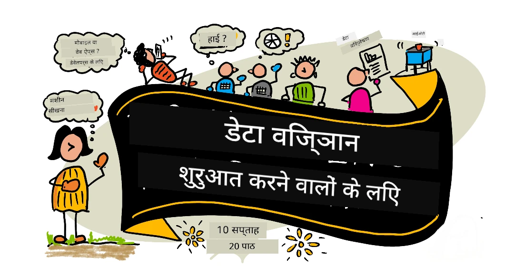
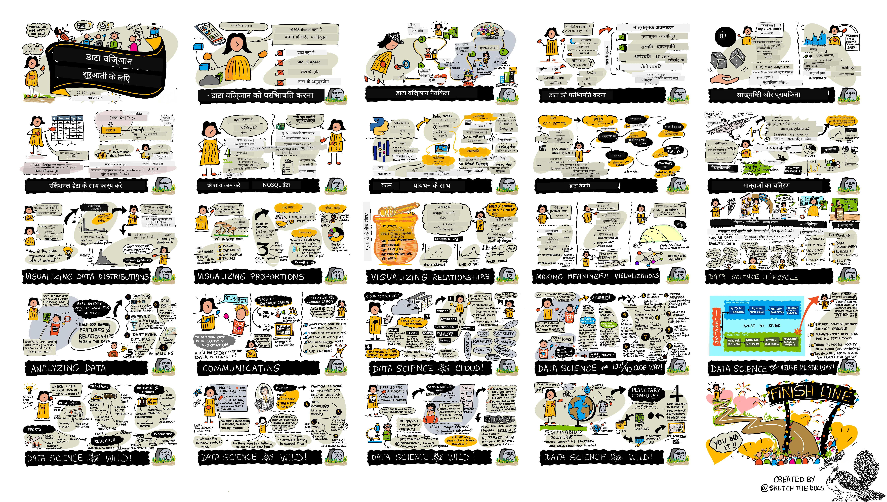

# शुरुआती लोगों के लिए डेटा साइंस - एक पाठ्यक्रम

[](https://github.com/codespaces/new?hide_repo_select=true&ref=main&repo=344191198)

[](https://github.com/microsoft/Data-Science-For-Beginners/blob/master/LICENSE)
[](https://GitHub.com/microsoft/Data-Science-For-Beginners/graphs/contributors/)
[](https://GitHub.com/microsoft/Data-Science-For-Beginners/issues/)
[](https://GitHub.com/microsoft/Data-Science-For-Beginners/pulls/)
[](http://makeapullrequest.com)

[](https://GitHub.com/microsoft/Data-Science-For-Beginners/watchers/)
[](https://GitHub.com/microsoft/Data-Science-For-Beginners/network/)
[](https://GitHub.com/microsoft/Data-Science-For-Beginners/stargazers/)


[](https://discord.gg/nTYy5BXMWG)

[](https://aka.ms/foundry/forum)

माइक्रोसॉफ्ट में Azure Cloud Advocates एक 10 सप्ताह, 20-लेसन का पाठ्यक्रम प्रदान करने में प्रसन्न हैं जो पूरी तरह से डेटा साइंस के बारे में है। प्रत्येक लेसन में पूर्व-लेसन और पश्च-लेसन क्विज़, पाठ पूरा करने के लिए लिखित निर्देश, एक समाधान और एक असाइनमेंट शामिल है। हमारा परियोजना-आधारित शिक्षण तरीका आपको निर्माण करते हुए सीखने की अनुमति देता है, जो नई कौशलों को 'टिकाए रखने' का सिद्ध तरीका है।

**हमारे लेखकों को हार्दिक धन्यवाद:** [Jasmine Greenaway](https://www.twitter.com/paladique), [Dmitry Soshnikov](http://soshnikov.com), [Nitya Narasimhan](https://twitter.com/nitya), [Jalen McGee](https://twitter.com/JalenMcG), [Jen Looper](https://twitter.com/jenlooper), [Maud Levy](https://twitter.com/maudstweets), [Tiffany Souterre](https://twitter.com/TiffanySouterre), [Christopher Harrison](https://www.twitter.com/geektrainer).

**🙏 विशेष धन्यवाद 🙏 हमारे [Microsoft Student Ambassador](https://studentambassadors.microsoft.com/) लेखकों, समीक्षकों और सामग्री योगदानकर्ताओं को,** विशेष रूप से आर्यन अरोड़ा, [आदित्य गर्ग](https://github.com/AdityaGarg00), [एलोंड्रा सांचेज़](https://www.linkedin.com/in/alondra-sanchez-molina/), [अंकिता सिंह](https://www.linkedin.com/in/ankitasingh007), [अनुपम मिश्रा](https://www.linkedin.com/in/anupam--mishra/), [अर्पिता दास](https://www.linkedin.com/in/arpitadas01/), छैल बिहारी दुबे, [डिब्री नसोफोर](https://www.linkedin.com/in/dibrinsofor), [दिशिता भंसीन](https://www.linkedin.com/in/dishita-bhasin-7065281bb), [मजद सफ़ी](https://www.linkedin.com/in/majd-s/), [मैक्स ब्लम](https://www.linkedin.com/in/max-blum-6036a1186/), [मिगुएल कोरेया](https://www.linkedin.com/in/miguelmque/), [मोहम्मा इफ्तेखर (इफतु) एबे जलाल](https://twitter.com/iftu119), [नवरीन तबस्सुम](https://www.linkedin.com/in/nawrin-tabassum), [रेमंड वांगसा पुत्रा](https://www.linkedin.com/in/raymond-wp/), [रोहित यादव](https://www.linkedin.com/in/rty2423), समृद्धि शर्मा, [संया सिंहा](https://www.linkedin.com/mwlite/in/sanya-sinha-13aab1200),
[शीना नरुला](https://www.linkedin.com/in/sheena-narua-n/), [तौकीर अहमद](https://www.linkedin.com/in/tauqeerahmad5201/), योगेंद्रसिंह पवार , [विदुषी गुप्ता](https://www.linkedin.com/in/vidushi-gupta07/), [जसलीन संधि](https://www.linkedin.com/in/jasleen-sondhi/)

||
|:---:|
| शुरुआती लोगों के लिए डेटा साइंस - _स्केचनोट [@nitya](https://twitter.com/nitya) द्वारा_ |

### 🌐 बहुभाषी समर्थन

#### GitHub Action के माध्यम से समर्थित (स्वचालित और हमेशा अपडेट)

<!-- CO-OP TRANSLATOR LANGUAGES TABLE START -->
[Arabic](../ar/README.md) | [Bengali](../bn/README.md) | [Bulgarian](../bg/README.md) | [Burmese (Myanmar)](../my/README.md) | [Chinese (Simplified)](../zh-CN/README.md) | [Chinese (Traditional, Hong Kong)](../zh-HK/README.md) | [Chinese (Traditional, Macau)](../zh-MO/README.md) | [Chinese (Traditional, Taiwan)](../zh-TW/README.md) | [Croatian](../hr/README.md) | [Czech](../cs/README.md) | [Danish](../da/README.md) | [Dutch](../nl/README.md) | [Estonian](../et/README.md) | [Finnish](../fi/README.md) | [French](../fr/README.md) | [German](../de/README.md) | [Greek](../el/README.md) | [Hebrew](../he/README.md) | [Hindi](./README.md) | [Hungarian](../hu/README.md) | [Indonesian](../id/README.md) | [Italian](../it/README.md) | [Japanese](../ja/README.md) | [Kannada](../kn/README.md) | [Khmer](../km/README.md) | [Korean](../ko/README.md) | [Lithuanian](../lt/README.md) | [Malay](../ms/README.md) | [Malayalam](../ml/README.md) | [Marathi](../mr/README.md) | [Nepali](../ne/README.md) | [Nigerian Pidgin](../pcm/README.md) | [Norwegian](../no/README.md) | [Persian (Farsi)](../fa/README.md) | [Polish](../pl/README.md) | [Portuguese (Brazil)](../pt-BR/README.md) | [Portuguese (Portugal)](../pt-PT/README.md) | [Punjabi (Gurmukhi)](../pa/README.md) | [Romanian](../ro/README.md) | [Russian](../ru/README.md) | [Serbian (Cyrillic)](../sr/README.md) | [Slovak](../sk/README.md) | [Slovenian](../sl/README.md) | [Spanish](../es/README.md) | [Swahili](../sw/README.md) | [Swedish](../sv/README.md) | [Tagalog (Filipino)](../tl/README.md) | [Tamil](../ta/README.md) | [Telugu](../te/README.md) | [Thai](../th/README.md) | [Turkish](../tr/README.md) | [Ukrainian](../uk/README.md) | [Urdu](../ur/README.md) | [Vietnamese](../vi/README.md)

> **स्थानीय रूप से क्लोन करना पसंद करते हैं?**
>
> इस रिपॉजिटरी में 50+ भाषा अनुवाद शामिल हैं जो डाउनलोड आकार को काफी बढ़ा देते हैं। अनुवादों के बिना क्लोन करने के लिए, sparse checkout का उपयोग करें:
>
> **Bash / macOS / Linux:**
> ```bash
> git clone --filter=blob:none --sparse https://github.com/microsoft/Data-Science-For-Beginners.git
> cd Data-Science-For-Beginners
> git sparse-checkout set --no-cone '/*' '!translations' '!translated_images'
> ```
>
> **CMD (Windows):**
> ```cmd
> git clone --filter=blob:none --sparse https://github.com/microsoft/Data-Science-For-Beginners.git
> cd Data-Science-For-Beginners
> git sparse-checkout set --no-cone "/*" "!translations" "!translated_images"
> ```
>
> इससे आपको बहुत तेज डाउनलोड के साथ पाठ्यक्रम पूरा करने के लिए सब कुछ मिलेगा।
<!-- CO-OP TRANSLATOR LANGUAGES TABLE END -->

**यदि आप अतिरिक्त अनुवाद भाषाएं चाहते हैं तो वे [यहाँ](https://github.com/Azure/co-op-translator/blob/main/getting_started/supported-languages.md) सूचीबद्ध हैं**

#### हमारी कम्युनिटी से जुड़ें 
[](https://discord.gg/nTYy5BXMWG)

हमारे पास Discord पर AI के साथ सीखने की श्रृंखला चल रही है, इसके बारे में और जानें और हमें [Learn with AI Series](https://aka.ms/learnwithai/discord) पर 18 - 30 सितंबर, 2025 को ज्वाइन करें। आपको डेटा साइंस के लिए GitHub Copilot का उपयोग करने के टिप्स और ट्रिक्स मिलेंगे।


# क्या आप छात्र हैं?

निम्नलिखित संसाधनों के साथ शुरुआत करें:

- [स्टूडेंट हब पेज](https://docs.microsoft.com/en-gb/learn/student-hub?WT.mc_id=academic-77958-bethanycheum) इस पेज में, आपको शुरुआती संसाधन, स्टूडेंट पैक और मुफ्त प्रमाणपत्र वाउचर प्राप्त करने के तरीके मिलेंगे। यह एक ऐसा पृष्ठ है जिसे आपको बार-बार बुकमार्क करना चाहिए क्योंकि हम कम से कम महीने में एक बार सामग्री बदलते रहते हैं।
- [Microsoft Learn Student Ambassadors](https://studentambassadors.microsoft.com?WT.mc_id=academic-77958-bethanycheum) वैश्विक छात्र एम्बेसडर समुदाय में शामिल हों, यह आपकी माइक्रोसॉफ्ट में प्रवेश का रास्ता हो सकता है।

# शुरूआत

## 📚 प्रलेखन

- **[इंस्टॉलेशन गाइड](INSTALLATION.md)** - शुरुआती लोगों के लिए चरण-दर-चरण सेटअप निर्देश
- **[उपयोग गाइड](USAGE.md)** - उदाहरण और सामान्य वर्कफ़्लो
- **[समस्या निवारण](TROUBLESHOOTING.md)** - सामान्य समस्याओं के समाधान
- **[योगदान गाइड](CONTRIBUTING.md)** - इस परियोजना में योगदान कैसे करें
- **[शिक्षकों के लिए](for-teachers.md)** - शिक्षण मार्गदर्शन और कक्षा संसाधन

## 👨‍🎓 छात्रों के लिए
> **पूरी तरह से शुरुआती:** डेटा साइंस में नए हैं? हमारे [शुरुआती-अनुकूल उदाहरण](examples/README.md) से शुरुआत करें! ये सरल, अच्छी तरह से टिप्पणीकृत उदाहरण आपको मूल बातें समझने में मदद करेंगे इससे पहले कि आप पूरे पाठ्यक्रम में डूबें।
> **[छात्रों](https://aka.ms/student-page):** इस पाठ्यक्रम का उपयोग अपने आप करने के लिए, पूरी रिपॉजिटरी को फोर्क करें और स्वयं व्यायाम पूरा करें, पहले पूर्व-व्याख्यान क्विज़ से शुरू करें। फिर व्याख्यान पढ़ें और बाकी गतिविधियाँ पूरी करें। समाधान कोड की बजाय पाठों को समझकर प्रोजेक्ट बनाने की कोशिश करें; हालाँकि वह कोड प्रत्येक परियोजना-केंद्रित पाठ में /solutions फ़ोल्डर में उपलब्ध है। एक और विचार दोस्तों के साथ अध्ययन समूह बनाना और साथ में सामग्री को समझना होगा। आगे के अध्ययन के लिए, हम [Microsoft Learn](https://docs.microsoft.com/en-us/users/jenlooper-2911/collections/qprpajyoy3x0g7?WT.mc_id=academic-77958-bethanycheum) की सिफारिश करते हैं।

**त्वरित शुरुआत:**
1. अपना वातावरण सेटअप करने के लिए [इंस्टॉलेशन गाइड](INSTALLATION.md) देखें
2. पाठ्यक्रम के साथ काम करना सीखने के लिए [उपयोग गाइड](USAGE.md) की समीक्षा करें
3. लेसन 1 से शुरू करें और क्रमशः आगे बढ़ें
4. सहायता के लिए हमारे [Discord समुदाय](https://aka.ms/ds4beginners/discord) में शामिल हों

## 👩‍🏫 शिक्षकों के लिए
> **शिक्षक**: हमने इस पाठ्यक्रम का उपयोग कैसे करें इस पर कुछ सुझाव [शामिल किए हैं](for-teachers.md)। हमें आपकी प्रतिक्रिया [हमारे चर्चा मंच में](https://github.com/microsoft/Data-Science-For-Beginners/discussions) पसंद आएगी!

## टीम से मिलें

[](https://youtu.be/8mzavjQSMM4 "प्रोमो वीडियो")

**गिफ़ द्वारा** [Mohit Jaisal](https://www.linkedin.com/in/mohitjaisal)

> 🎥 परियोजना और इसे बनाने वाले लोगों के बारे में वीडियो देखने के लिए ऊपर की इमेज पर क्लिक करें!

## शिक्षाशास्त्र

इस पाठ्यक्रम को बनाते हुए हमने दो शिक्षाशास्त्र संबंधी सिद्धांत चुने हैं: इसे परियोजना आधारित बनाना और इसमें नियमित क्विज़ शामिल करना। इस श्रृंखला के अंत तक, छात्र डेटा विज्ञान के मूल सिद्धांतों को सीखेंगे, जिसमें नैतिक सिद्धांत, डेटा तैयारी, डेटा के साथ कार्य करने के विभिन्न तरीके, डेटा विज़ुअलाइज़ेशन, डेटा विश्लेषण, डेटा विज्ञान के वास्तविक विश्व उपयोग मामले, और अधिक शामिल हैं।

इसके अतिरिक्त, कक्षा से पहले का एक कम जोखिम वाला क्विज़ छात्र के विषय सीखने के इरादे को निर्धारित करता है, जबकि कक्षा के बाद दूसरा क्विज़ आगे की समझ बनाए रखने में मदद करता है। यह पाठ्यक्रम लचीला और मजेदार होने के लिए डिज़ाइन किया गया है और इसे पूरे पाठ्यक्रम के रूप में या आंशिक रूप से लिया जा सकता है। परियोजनाएं छोटी से शुरू होती हैं और 10 सप्ताह की चक्र के अंत तक बढ़ती हुई जटिल हो जाती हैं।

> हमारा [आचार संहिता](CODE_OF_CONDUCT.md), [योगदान](CONTRIBUTING.md), [अनुवाद](TRANSLATIONS.md) दिशानिर्देश देखें। हम आपकी रचनात्मक प्रतिक्रिया का स्वागत करते हैं!

## प्रत्येक पाठ में शामिल हैं:

- वैकल्पिक स्केच नोट
- वैकल्पिक पूरक वीडियो
- पूर्व-पाठ वार्मअप क्विज़
- लिखित पाठ
- परियोजना आधारित पाठों के लिए, परियोजना बनाने के चरण-दर-चरण मार्गदर्शिकाएँ
- ज्ञान जांच
- एक चुनौती
- पूरक पठन
- असाइनमेंट
- [पाठ के बाद क्विज़](https://ff-quizzes.netlify.app/en/)

> **क्विज़ के बारे में एक नोट**: सभी क्विज़ क्विज़-ऐप फोल्डर में संचित हैं, कुल 40 क्विज़ तीन प्रश्नों वाले। वे पाठों से लिंक किए गए हैं, लेकिन क्विज़ ऐप को स्थानीय रूप से चलाया जा सकता है या Azure पर तैनात किया जा सकता है; `quiz-app` फोल्डर में निर्देशों का पालन करें। इन्हें धीरे-धीरे स्थानीयकृत किया जा रहा है।

## 🎓 शुरुआती के लिए दोस्ताना उदाहरण

**डेटा साइंस में नए हैं?** हमने एक विशेष [उदाहरण निर्देशिका](examples/README.md) बनाई है जहाँ सरल, अच्छी तरह से कमेंटेड कोड के साथ शुरुआत में मदद मिलती है:

- 🌟 **हैलो वर्ल्ड** - आपका पहला डेटा साइंस प्रोग्राम
- 📂 **डेटा लोड करना** - डेटा सेट पढ़ना और अन्वेषण करना सीखें
- 📊 **सरल विश्लेषण** - सांख्यिकी निकालें और पैटर्न खोजें
- 📈 **मूल विज़ुअलाइज़ेशन** - चार्ट और ग्राफ बनाएँ
- 🔬 **वास्तविक दुनिया परियोजना** - शुरू से अंत तक पूरा कार्यप्रवाह

प्रत्येक उदाहरण में विस्तृत टिप्पणियाँ होती हैं जो हर कदम को समझाती हैं, जो इसे पूर्ण शुरुआती के लिए उपयुक्त बनाती हैं!

👉 **[उदाहरणों के साथ शुरुआत करें](examples/README.md)** 👈

## पाठ


||
|:---:|
| डेटा साइंस फॉर बिगिनर्स: रोडमैप - _स्केच नोट द्वारा [@nitya](https://twitter.com/nitya)_ |


| पाठ संख्या | विषय | पाठ समूह | सीखने के उद्देश्य | लिंक्ड पाठ | लेखक |
| :-----------: | :----------------------------------------: | :--------------------------------------------------: | :-----------------------------------------------------------------------------------------------------------------------------------------------------------------------: | :---------------------------------------------------------------------: | :----: |
| 01 | डेटा साइंस को परिभाषित करना | [परिचय](1-Introduction/README.md) | डेटा साइंस के मूल सिद्धांत सीखें और यह आर्टिफिशियल इंटेलिजेंस, मशीन लर्निंग, और बिग डेटा से कैसे संबंधित है। | [पाठ](1-Introduction/01-defining-data-science/README.md) [वीडियो](https://youtu.be/beZ7Mb_oz9I) | [डिमित्री](http://soshnikov.com) |
| 02 | डेटा साइंस नैतिकता | [परिचय](1-Introduction/README.md) | डेटा नैतिकता के सिद्धांत, चुनौतियाँ और फ्रेमवर्क। | [पाठ](1-Introduction/02-ethics/README.md) | [नित्या](https://twitter.com/nitya) |
| 03 | डेटा को परिभाषित करना | [परिचय](1-Introduction/README.md) | डेटा कैसे वर्गीकृत किया जाता है और इसके सामान्य स्रोत। | [पाठ](1-Introduction/03-defining-data/README.md) | [जैस्मिन](https://www.twitter.com/paladique) |
| 04 | सांख्यिकी और संभावना का परिचय | [परिचय](1-Introduction/README.md) | डेटा को समझने के लिए संभावना और सांख्यिकी की गणितीय तकनीकें। | [पाठ](1-Introduction/04-stats-and-probability/README.md) [वीडियो](https://youtu.be/Z5Zy85g4Yjw) | [डिमित्री](http://soshnikov.com) |
| 05 | रिलेशनल डेटा के साथ काम करना | [डेटा के साथ काम करना](2-Working-With-Data/README.md) | रिलेशनल डेटा का परिचय और इसके खोज और विश्लेषण के मूल, जिसे संरचित क्वेरी भाषा (SQL) भी कहा जाता है। | [पाठ](2-Working-With-Data/05-relational-databases/README.md) | [क्रिस्टोफ़र](https://www.twitter.com/geektrainer) | | |
| 06 | नोSQL डेटा के साथ काम करना | [डेटा के साथ काम करना](2-Working-With-Data/README.md) | गैर-रिलेशनल डेटा का परिचय, इसके विभिन्न प्रकार और डाक्यूमेंट डेटाबेस के खोज और विश्लेषण के मूल। | [पाठ](2-Working-With-Data/06-non-relational/README.md) | [जैस्मिन](https://twitter.com/paladique)|
| 07 | पाइथन के साथ काम करना | [डेटा के साथ काम करना](2-Working-With-Data/README.md) | पांडास जैसी लाइब्रेरीज के साथ डेटा अन्वेषण के लिए पाइथन का मूल उपयोग। पाइथन प्रोग्रामिंग की बुनियादी समझ सिफारिश की जाती है। | [पाठ](2-Working-With-Data/07-python/README.md) [वीडियो](https://youtu.be/dZjWOGbsN4Y) | [डिमित्री](http://soshnikov.com) |
| 08 | डेटा तैयारी | [डेटा के साथ काम करना](2-Working-With-Data/README.md) | डेटा को साफ़ और रूपांतरित करने की तकनीकें, जिसमें गुम, गलत या अधूरी डेटा से निपटना शामिल है। | [पाठ](2-Working-With-Data/08-data-preparation/README.md) | [जैस्मिन](https://www.twitter.com/paladique) |
| 09 | मात्राओं का दृश्यांकन | [डेटा विज़ुअलाइज़ेशन](3-Data-Visualization/README.md) | मैटप्लॉटलिब का उपयोग कर पक्षी डेटा का दृश्यांकन सीखें 🦆 | [पाठ](3-Data-Visualization/09-visualization-quantities/README.md) | [जेन](https://twitter.com/jenlooper) |
| 10 | डेटा के वितरणों का दृश्यांकन | [डेटा विज़ुअलाइज़ेशन](3-Data-Visualization/README.md) | अवलोकन और रुझानों को एक अंतराल के भीतर दृश्यित करना। | [पाठ](3-Data-Visualization/10-visualization-distributions/README.md) | [जेन](https://twitter.com/jenlooper) |
| 11 | अनुपात का दृश्यांकन | [डेटा विज़ुअलाइज़ेशन](3-Data-Visualization/README.md) | विविक्त और समूहित प्रतिशतों का दृश्यांकन। | [पाठ](3-Data-Visualization/11-visualization-proportions/README.md) | [जेन](https://twitter.com/jenlooper) |
| 12 | रिश्तों का दृश्यांकन | [डेटा विज़ुअलाइज़ेशन](3-Data-Visualization/README.md) | डेटा सेटों और उनके चर के बीच संबंधों और सहसंबंधों का दृश्यांकन। | [पाठ](3-Data-Visualization/12-visualization-relationships/README.md) | [जेन](https://twitter.com/jenlooper) |
| 13 | सार्थक दृश्यांकन | [डेटा विज़ुअलाइज़ेशन](3-Data-Visualization/README.md) | प्रभावी समस्या-समाधान और अंतर्दृष्टि के लिए अपने दृश्यांकन को मूल्यवान बनाने की तकनीकें और मार्गदर्शन। | [पाठ](3-Data-Visualization/13-meaningful-visualizations/README.md) | [जेन](https://twitter.com/jenlooper) |
| 14 | डेटा साइंस जीवनचक्र का परिचय | [जीवनचक्र](4-Data-Science-Lifecycle/README.md) | डेटा साइंस जीवनचक्र और डेटा प्राप्ति और निष्कर्षण के पहले चरण का परिचय। | [पाठ](4-Data-Science-Lifecycle/14-Introduction/README.md) | [जैस्मिन](https://twitter.com/paladique) |
| 15 | विश्लेषण करना | [जीवनचक्र](4-Data-Science-Lifecycle/README.md) | जीवनचक्र के इस चरण में डेटा का विश्लेषण करने की तकनीकें शामिल हैं। | [पाठ](4-Data-Science-Lifecycle/15-analyzing/README.md) | [जैस्मिन](https://twitter.com/paladique) | | |
| 16 | संप्रेषण | [जीवनचक्र](4-Data-Science-Lifecycle/README.md) | जीवनचक्र के इस चरण में डेटा से मिली जानकारी को इस तरह प्रस्तुत करना शामिल है जिससे निर्णय निर्माता आसानी से समझ सकें। | [पाठ](4-Data-Science-Lifecycle/16-communication/README.md) | [जेलन](https://twitter.com/JalenMcG) | | |
| 17 | क्लाउड में डेटा साइंस | [क्लाउड डेटा](5-Data-Science-In-Cloud/README.md) | क्लाउड में डेटा साइंस और इसके लाभों का परिचय। | [पाठ](5-Data-Science-In-Cloud/17-Introduction/README.md) | [टिफ़नी](https://twitter.com/TiffanySouterre) और [मॉड](https://twitter.com/maudstweets) |
| 18 | क्लाउड में डेटा साइंस | [क्लाउड डेटा](5-Data-Science-In-Cloud/README.md) | लो कोड टूल्स का उपयोग कर मॉडल प्रशिक्षण। |[पाठ](5-Data-Science-In-Cloud/18-Low-Code/README.md) | [टिफ़नी](https://twitter.com/TiffanySouterre) और [मॉड](https://twitter.com/maudstweets) |
| 19 | क्लाउड में डेटा साइंस | [क्लाउड डेटा](5-Data-Science-In-Cloud/README.md) | Azure Machine Learning Studio के साथ मॉडल तैनाती। | [पाठ](5-Data-Science-In-Cloud/19-Azure/README.md)| [टिफ़नी](https://twitter.com/TiffanySouterre) और [मॉड](https://twitter.com/maudstweets) |
| 20 | असली दुनिया में डेटा साइंस | [वाइल्ड में](6-Data-Science-In-Wild/README.md) | वास्तविक दुनिया में डेटा साइंस संचालित परियोजनाएं। | [पाठ](6-Data-Science-In-Wild/20-Real-World-Examples/README.md) | [नित्या](https://twitter.com/nitya) |

## GitHub Codespaces

इस नमूने को Codespace में खोलने के लिए ये चरणों का पालन करें:
1. कोड ड्रॉप-डाउन मेनू पर क्लिक करें और Open with Codespaces विकल्प चुनें।
2. पैन के नीचे + New codespace चुनें।
अधिक जानकारी के लिए, [GitHub दस्तावेज़](https://docs.github.com/en/codespaces/developing-in-codespaces/creating-a-codespace-for-a-repository#creating-a-codespace) देखें।

## VSCode Remote - Containers
अपने स्थानीय मशीन और VSCode का उपयोग करके इस रिपॉजिटरी को कंटेनर में खोलने के लिए VS Code Remote - Containers एक्सटेंशन का पालन करें:

1. यदि यह आपका पहली बार विकास कंटेनर का उपयोग है, तो कृपया सुनिश्चित करें कि आपका सिस्टम प्री-रिक्विज़िट्स (जैसे Docker इंस्टॉल होना) को पूरा करता है [शुरू करने के दस्तावेज़](https://code.visualstudio.com/docs/devcontainers/containers#_getting-started) में।

इस रिपॉजिटरी का उपयोग करने के लिए, आप या तो रिपॉजिटरी को एक पृथक Docker वॉल्यूम में खोल सकते हैं:

**नोट**: आंतरिक रूप से, यह Remote-Containers: **Clone Repository in Container Volume...** कमांड का उपयोग करके स्रोत कोड को स्थानीय फ़ाइल सिस्टम की बजाय Docker वॉल्यूम में क्लोन करेगा। [वॉल्यूम](https://docs.docker.com/storage/volumes/) कंटेनर डेटा संधारण के लिए प्राथमिक तरीका हैं।

या रिपॉजिटरी की स्थानीय क्लोन की गई या डाउनलोड की गई कॉपी खोलें:

- इस रिपॉजिटरी को अपनी स्थानीय फ़ाइल सिस्टम पर क्लोन करें।
- F1 दबाएं और **Remote-Containers: Open Folder in Container...** कमांड चुनें।
- इस फ़ोल्डर की क्लोन की हुई कॉपी चुनें, कंटेनर के शुरू होने का इंतजार करें, और चीज़ों को आज़माएं।

## ऑफ़लाइन पहुँच

आप [Docsify](https://docsify.js.org/#/) का उपयोग करके इस दस्तावेज़ को ऑफ़लाइन चला सकते हैं। इस रिपॉजिटरी को फ़ोर्क करें, अपने स्थानीय मशीन पर [Docsify इंस्टॉल](https://docsify.js.org/#/quickstart) करें, फिर इस रिपॉजिटरी के रूट फ़ोल्डर में `docsify serve` टाइप करें। वेबसाइट आपके लोकलहोस्ट पर पोर्ट 3000 पर उपलब्ध होगी: `localhost:3000`।

> ध्यान दें, नोटबुक Docsify के माध्यम से प्रदर्शित नहीं होंगी, इसलिए जब आपको नोटबुक चलानी हो, तो इसे VS Code में Python कर्नेल चलाकर अलग से करें।

## अन्य पाठ्यक्रम

हमारी टीम अन्य पाठ्यक्रम भी बनाती है! देखें:

<!-- CO-OP TRANSLATOR OTHER COURSES START -->
### LangChain
[](https://aka.ms/langchain4j-for-beginners)
[](https://aka.ms/langchainjs-for-beginners?WT.mc_id=m365-94501-dwahlin)
[](https://github.com/microsoft/langchain-for-beginners?WT.mc_id=m365-94501-dwahlin)
---

### Azure / Edge / MCP / एजेंट्स
[](https://github.com/microsoft/AZD-for-beginners?WT.mc_id=academic-105485-koreyst)
[](https://github.com/microsoft/edgeai-for-beginners?WT.mc_id=academic-105485-koreyst)
[](https://github.com/microsoft/mcp-for-beginners?WT.mc_id=academic-105485-koreyst)
[](https://github.com/microsoft/ai-agents-for-beginners?WT.mc_id=academic-105485-koreyst)

---
 
### जनरेटिव एआई श्रृंखला
[](https://github.com/microsoft/generative-ai-for-beginners?WT.mc_id=academic-105485-koreyst)
[-9333EA?style=for-the-badge&labelColor=E5E7EB&color=9333EA)](https://github.com/microsoft/Generative-AI-for-beginners-dotnet?WT.mc_id=academic-105485-koreyst)
[-C084FC?style=for-the-badge&labelColor=E5E7EB&color=C084FC)](https://github.com/microsoft/generative-ai-for-beginners-java?WT.mc_id=academic-105485-koreyst)
[-E879F9?style=for-the-badge&labelColor=E5E7EB&color=E879F9)](https://github.com/microsoft/generative-ai-with-javascript?WT.mc_id=academic-105485-koreyst)

---
 
### कोर लर्निंग
[](https://aka.ms/ml-beginners?WT.mc_id=academic-105485-koreyst)
[](https://aka.ms/datascience-beginners?WT.mc_id=academic-105485-koreyst)
[](https://aka.ms/ai-beginners?WT.mc_id=academic-105485-koreyst)
[](https://github.com/microsoft/Security-101?WT.mc_id=academic-96948-sayoung)
[](https://aka.ms/webdev-beginners?WT.mc_id=academic-105485-koreyst)
[](https://aka.ms/iot-beginners?WT.mc_id=academic-105485-koreyst)
[](https://github.com/microsoft/xr-development-for-beginners?WT.mc_id=academic-105485-koreyst)

---
 
### कोपाइलट श्रृंखला
[](https://aka.ms/GitHubCopilotAI?WT.mc_id=academic-105485-koreyst)
[](https://github.com/microsoft/mastering-github-copilot-for-dotnet-csharp-developers?WT.mc_id=academic-105485-koreyst)
[](https://github.com/microsoft/CopilotAdventures?WT.mc_id=academic-105485-koreyst)
<!-- CO-OP TRANSLATOR OTHER COURSES END -->

## सहायता प्राप्त करना

**समस्याओं का सामना कर रहे हैं?** आम समस्याओं के समाधान के लिए हमारा [ट्रबलशूटिंग गाइड](TROUBLESHOOTING.md) देखें।

यदि आप फंस गए हैं या AI ऐप्स बनाने के बारे में कोई प्रश्न हैं। MCP के बारे में बातचीत में साथी शिक्षार्थियों और अनुभवी डेवलपर्स में शामिल हों। यह एक सहायक समुदाय है जहां प्रश्न स्वागतयोग्य हैं और ज्ञान मुक्त रूप से साझा किया जाता है।

[](https://discord.gg/nTYy5BXMWG)

यदि आपके पास उत्पाद प्रतिक्रिया या निर्माण के दौरान त्रुटियां हैं तो यहाँ जाएं:

[](https://aka.ms/foundry/forum)

---

<!-- CO-OP TRANSLATOR DISCLAIMER START -->
**अस्वीकरण**:  
यह दस्तावेज़ AI अनुवाद सेवा [Co-op Translator](https://github.com/Azure/co-op-translator) का उपयोग करके अनुवादित किया गया है। जबकि हम शुद्धता के लिए प्रयासरत हैं, कृपया ध्यान दें कि स्वचालित अनुवादों में त्रुटियाँ या अशुद्धियाँ हो सकती हैं। मूल दस्तावेज़ अपनी मातृ भाषा में ही प्राधिकृत स्रोत माना जाना चाहिए। महत्वपूर्ण जानकारी के लिए पेशेवर मानव अनुवाद की सलाह दी जाती है। इस अनुवाद के उपयोग से उत्पन्न किसी भी गलतफहमी या गलत व्याख्या के लिए हम उत्तरदायी नहीं हैं।
<!-- CO-OP TRANSLATOR DISCLAIMER END -->