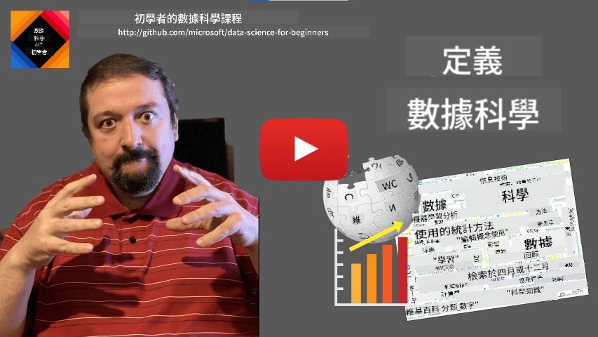
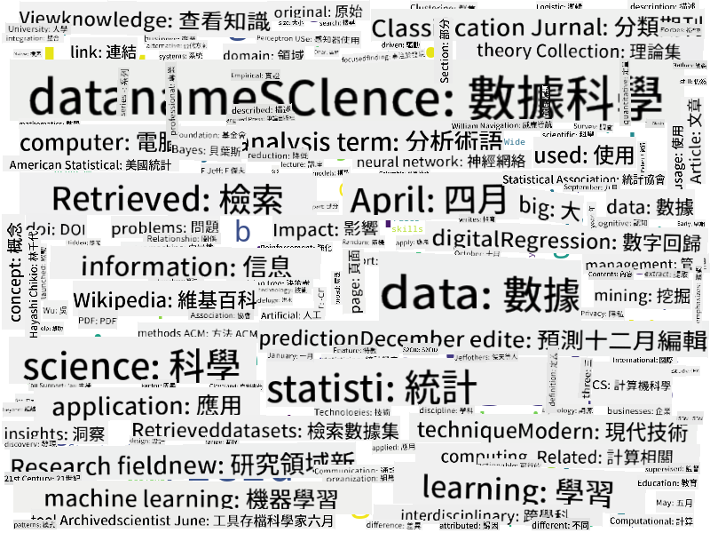

<!--
CO_OP_TRANSLATOR_METADATA:
{
  "original_hash": "43212cc1ac137b7bb1dcfb37ca06b0f4",
  "translation_date": "2025-10-25T18:40:14+00:00",
  "source_file": "1-Introduction/01-defining-data-science/README.md",
  "language_code": "hk"
}
-->
# 定義數據科學

|  繪製的手繪筆記](../../sketchnotes/01-Definitions.png) |
| :----------------------------------------------------------------------------------------------------: |
|              數據科學的定義 - _由 [@nitya](https://twitter.com/nitya) 繪製的手繪筆記_               |

---

## [課前測驗](https://ff-quizzes.netlify.app/en/ds/quiz/0)

## 什麼是數據？
在我們的日常生活中，我們無時無刻都被數據包圍著。你現在正在閱讀的文字就是數據。你智能手機裡朋友的電話號碼列表是數據，你手錶上顯示的當前時間也是數據。作為人類，我們天生就會處理數據，比如數錢或者給朋友寫信。

然而，隨著電腦的誕生，數據變得更加重要。電腦的主要功能是進行計算，但它們需要數據來操作。因此，我們需要了解電腦如何存儲和處理數據。

隨著互聯網的出現，電腦作為數據處理設備的角色更加重要。仔細想想，我們現在使用電腦更多的是進行數據處理和通信，而不是實際的計算。當我們給朋友寫電子郵件或在互聯網上搜索信息時，我們實際上是在創建、存儲、傳輸和操作數據。
> 你能記得上一次真正用電腦進行計算是什麼時候嗎？

## 什麼是數據科學？

根據 [維基百科](https://en.wikipedia.org/wiki/Data_science)，**數據科學**被定義為*一個科學領域，使用科學方法從結構化和非結構化數據中提取知識和洞察，並將數據中的知識和可行洞察應用於廣泛的應用領域*。

這個定義突出了數據科學的以下重要方面：

* 數據科學的主要目標是從數據中**提取知識**，換句話說，就是**理解**數據，找到一些隱藏的關係並建立**模型**。
* 數據科學使用**科學方法**，例如概率和統計。事實上，當*數據科學*這個術語首次被提出時，有些人認為數據科學只是統計學的一個新潮名稱。然而，現在已經很明顯這個領域遠不止於此。
* 獲得的知識應用於產生一些**可行的洞察**，即可以應用於實際商業情境的實用洞察。
* 我們應該能夠操作**結構化**和**非結構化**數據。我們稍後會在課程中討論不同類型的數據。
* **應用領域**是一個重要的概念，數據科學家通常需要在問題領域中至少具備一定程度的專業知識，例如：金融、醫學、行銷等。

> 數據科學的另一個重要方面是研究如何使用電腦收集、存儲和操作數據。雖然統計學為我們提供了數學基礎，但數據科學則是將數學概念應用於實際從數據中獲取洞察。

根據 [Jim Gray](https://en.wikipedia.org/wiki/Jim_Gray_(computer_scientist)) 的說法，數據科學可以被視為科學的一個獨立範式：
* **經驗科學**，主要依賴觀察和實驗結果
* **理論科學**，從現有的科學知識中產生新概念
* **計算科學**，通過一些計算實驗發現新原則
* **數據驅動科學**，基於發現數據中的關係和模式

## 其他相關領域

由於數據無處不在，數據科學本身也是一個廣泛的領域，涉及許多其他學科。

<dl>
<dt>數據庫</dt>
<dd>
一個重要的考量是<b>如何存儲</b>數據，即如何以便於快速處理的方式結構化數據。有不同類型的數據庫可以存儲結構化和非結構化數據，這些內容我們會在<a href="../../2-Working-With-Data/README.md">課程中進一步探討</a>。
</dd>
<dt>大數據</dt>
<dd>
我們經常需要存儲和處理結構相對簡單但數量非常龐大的數據。為了高效地存儲和處理這些數據，通常會使用特殊的方法和工具，將數據分佈式地存儲在計算集群上。
</dd>
<dt>機器學習</dt>
<dd>
理解數據的一種方法是<b>建立模型</b>，該模型能夠預測所需的結果。從數據中開發模型被稱為<b>機器學習</b>。你可以參考我們的<a href="https://aka.ms/ml-beginners">機器學習初學者課程</a>來了解更多相關內容。
</dd>
<dt>人工智能</dt>
<dd>
機器學習的一個分支領域是人工智能（AI），它也依賴於數據，並涉及構建模仿人類思維過程的高複雜度模型。AI方法通常能幫助我們將非結構化數據（例如自然語言）轉化為結構化的洞察。
</dd>
<dt>可視化</dt>
<dd>
大量的數據對人類來說是難以理解的，但一旦我們使用這些數據創建了有用的可視化，就能更好地理解數據並得出一些結論。因此，了解多種可視化信息的方法非常重要——這是我們在<a href="../../3-Data-Visualization/README.md">課程第三部分</a>中會探討的內容。相關領域還包括<b>信息圖表</b>和<b>人機交互</b>。
</dd>
</dl>

## 數據的類型

正如我們已經提到的，數據無處不在。我們只需要以正確的方式捕捉它！區分**結構化**和**非結構化**數據是很有用的。前者通常以某種結構化形式表示，通常是表格或多個表格，而後者則僅僅是文件的集合。有時我們也可以談論**半結構化**數據，它具有某種結構，但結構可能差異很大。

| 結構化                                                                   | 半結構化                                                                                | 非結構化                            |
| ---------------------------------------------------------------------------- | ---------------------------------------------------------------------------------------------- | --------------------------------------- |
| 包含電話號碼的人的列表                                      | 帶有鏈接的維基百科頁面                                                                     | 《大英百科全書》的文本        |
| 過去20年中每分鐘建築物所有房間的溫度 | 以JSON格式存儲的科學論文集合，包括作者、出版日期和摘要 | 包含公司文件的文件共享     |
| 進入建築物的所有人的年齡和性別數據                  | 網頁                                                                                 | 監控攝像頭的原始視頻流 |

## 數據的來源

數據的來源有很多，幾乎無法全部列舉！然而，我們可以提到一些典型的數據來源：

* **結構化**
  - **物聯網**（IoT），包括來自不同傳感器（如溫度或壓力傳感器）的數據，提供了大量有用的數據。例如，如果辦公樓配備了物聯網傳感器，我們可以自動控制供暖和照明，以降低成本。
  - **調查問卷**，例如在用戶購物後或訪問網站後要求其填寫的問卷。
  - **行為分析**，例如幫助我們了解用戶瀏覽網站的深度，以及離開網站的典型原因。
* **非結構化**
  - **文本**可以提供豐富的洞察，例如整體**情感分數**，或提取關鍵字和語義含義。
  - **圖片**或**視頻**。監控攝像頭的視頻可以用來估算道路上的交通流量，並通知人們可能的交通堵塞。
  - 網頁伺服器的**日誌**可以用來了解我們網站中最常被訪問的頁面，以及訪問的時長。
* **半結構化**
  - **社交網絡**圖表可以提供有關用戶個性以及信息傳播潛力的數據。
  - 當我們擁有一堆派對照片時，我們可以嘗試通過建立人們互相拍照的圖表來提取**群體動態**數據。

了解不同的數據來源後，你可以嘗試思考不同的場景，看看數據科學技術可以如何應用於更好地了解情況並改善業務流程。

## 數據的用途

在數據科學中，我們專注於數據旅程的以下步驟：

<dl>
<dt>1) 數據獲取</dt>
<dd>
第一步是收集數據。雖然在許多情況下這可能是一個簡單的過程，比如數據從網絡應用程序進入數據庫，但有時我們需要使用特殊技術。例如，來自物聯網傳感器的數據可能過於龐大，因此使用像IoT Hub這樣的緩衝端點來收集所有數據以便進一步處理是一個好習慣。
</dd>
<dt>2) 數據存儲</dt>
<dd>
存儲數據可能具有挑戰性，尤其是當我們談論大數據時。在決定如何存儲數據時，考慮未來希望如何查詢數據是有意義的。數據可以通過以下幾種方式存儲：
<ul>
<li>關係型數據庫存儲表的集合，並使用一種名為SQL的特殊語言來查詢它們。通常，表格被組織成不同的組，稱為模式。在許多情況下，我們需要將數據從原始形式轉換以適應模式。</li>
<li><a href="https://en.wikipedia.org/wiki/NoSQL">NoSQL</a>數據庫，例如<a href="https://azure.microsoft.com/services/cosmos-db/?WT.mc_id=academic-77958-bethanycheum">CosmosDB</a>，不對數據強制執行模式，並允許存儲更複雜的數據，例如層次結構的JSON文檔或圖表。然而，NoSQL數據庫沒有SQL的豐富查詢功能，並且無法強制執行參考完整性，即表格結構和表格之間關係的規則。</li>
<li><a href="https://en.wikipedia.org/wiki/Data_lake">數據湖</a>存儲用於以原始、非結構化形式存儲大量數據。數據湖通常用於大數據，當所有數據無法放入一台機器時，必須由伺服器集群存儲和處理。<a href="https://en.wikipedia.org/wiki/Apache_Parquet">Parquet</a>是與大數據一起使用的常見數據格式。</li> 
</ul>
</dd>
<dt>3) 數據處理</dt>
<dd>
這是數據旅程中最令人興奮的部分，涉及將數據從原始形式轉換為可用於可視化/模型訓練的形式。當處理非結構化數據（如文本或圖片）時，我們可能需要使用一些AI技術從數據中提取<b>特徵</b>，從而將其轉換為結構化形式。
</dd>
<dt>4) 可視化/人類洞察</dt>
<dd>
通常，為了理解數據，我們需要對其進行可視化。擁有多種不同的可視化技術，我們可以找到合適的視圖來獲得洞察。通常，數據科學家需要“玩弄數據”，多次進行可視化並尋找一些關係。此外，我們可能使用統計技術來測試假設或證明數據之間的相關性。
</dd>
<dt>5) 訓練預測模型</dt>
<dd>
由於數據科學的最終目標是能夠基於數據做出決策，我們可能希望使用<a href="http://github.com/microsoft/ml-for-beginners">機器學習</a>技術來構建預測模型。然後，我們可以使用這些模型來對具有相似結構的新數據集進行預測。
</dd>
</dl>

當然，根據實際數據的不同，有些步驟可能會缺失（例如，當我們已經擁有數據庫中的數據，或者當我們不需要模型訓練時），或者有些步驟可能會重複多次（例如數據處理）。

## 數字化與數字轉型

在過去的十年中，許多企業開始意識到在做出商業決策時數據的重要性。要將數據科學原則應用於企業運營，首先需要收集一些數據，即將業務流程轉化為數字形式。這被稱為**數字化**。將數據科學技術應用於這些數據以指導決策，可以顯著提高生產力（甚至是業務轉型），這被稱為**數字轉型**。

讓我們來看一個例子。假設我們有一門數據科學課程（就像這門課程），我們在線上向學生提供，並希望利用數據科學來改進它。我們該怎麼做？

我們可以先問自己“什麼可以數字化？”最簡單的方法是測量每位學生完成每個模組所需的時間，並通過在每個模組結束時進行選擇題測試來測量所獲得的知識。通過計算所有學生的平均完成時間，我們可以找出哪些模組對學生來說最具挑戰性，並著手簡化它們。
> 你可能會認為這種方法並不理想，因為模組的長度可能不同。或許更公平的做法是將時間除以模組的長度（以字元數計算），然後比較這些值。

當我們開始分析多項選擇測試的結果時，可以嘗試找出學生難以理解的概念，並利用這些資訊來改進內容。為了做到這一點，我們需要設計測試，使每個問題都能對應到某個特定的概念或知識塊。

如果我們想進一步深入分析，可以將每個模組所花的時間與學生的年齡類別進行對比。我們可能會發現某些年齡類別的學生完成模組所需的時間過長，或者學生在完成模組之前就中途退出。這可以幫助我們為模組提供年齡建議，並減少因錯誤期望而導致的不滿。

## 🚀 挑戰

在這次挑戰中，我們將透過分析文本來尋找與數據科學領域相關的概念。我們會選取一篇關於數據科學的維基百科文章，下載並處理文本，然後建立一個像這樣的文字雲：

請訪問 [`notebook.ipynb`](../../../../1-Introduction/01-defining-data-science/notebook.ipynb ':ignore') 閱讀程式碼。你也可以執行程式碼，並即時查看它如何進行所有數據轉換。

> 如果你不知道如何在 Jupyter Notebook 中執行程式碼，可以參考 [這篇文章](https://soshnikov.com/education/how-to-execute-notebooks-from-github/)。

## [課後測驗](https://ff-quizzes.netlify.app/en/ds/quiz/1)

## 作業

* **任務 1**：修改上述程式碼，找出與 **大數據** 和 **機器學習** 領域相關的概念
* **任務 2**：[思考數據科學場景](assignment.md)

## 致謝

這節課由 [Dmitry Soshnikov](http://soshnikov.com) 用 ♥️ 編寫。

---

**免責聲明**：  
此文件已使用人工智能翻譯服務 [Co-op Translator](https://github.com/Azure/co-op-translator) 進行翻譯。儘管我們致力於提供準確的翻譯，但請注意，自動翻譯可能包含錯誤或不準確之處。原始文件的母語版本應被視為權威來源。對於重要信息，建議使用專業人工翻譯。我們對因使用此翻譯而引起的任何誤解或誤釋不承擔責任。