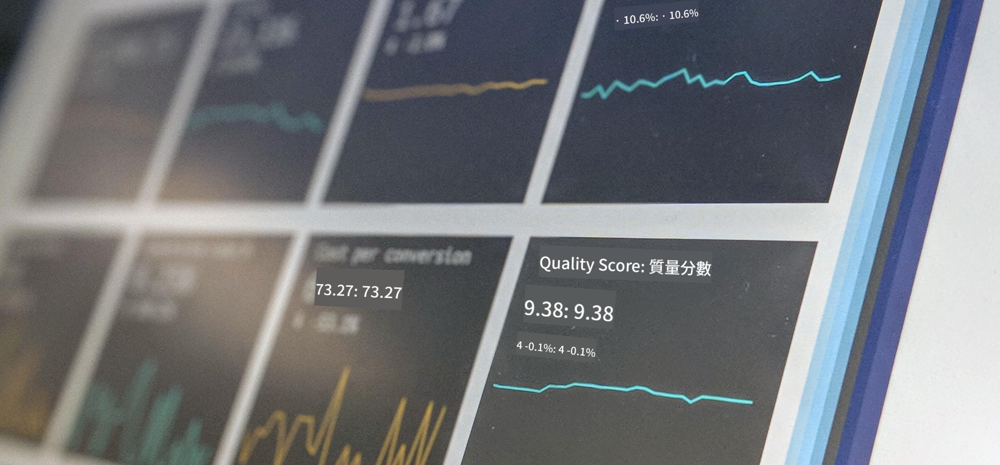

<!--
CO_OP_TRANSLATOR_METADATA:
{
  "original_hash": "696a8474a01054281704cbfb09148949",
  "translation_date": "2025-08-25T16:38:14+00:00",
  "source_file": "1-Introduction/README.md",
  "language_code": "hk"
}
-->
# 數據科學入門

> 圖片由 <a href="https://unsplash.com/@dawson2406?utm_source=unsplash&utm_medium=referral&utm_content=creditCopyText">Stephen Dawson</a> 提供，來源於 <a href="https://unsplash.com/s/photos/data?utm_source=unsplash&utm_medium=referral&utm_content=creditCopyText">Unsplash</a>
  
在這些課程中，你將了解什麼是數據科學，並學習數據科學家必須考慮的倫理問題。你還會學習數據的定義，並簡單了解統計學和概率論，這些是數據科學的核心學術領域。

### 主題

1. [數據科學的定義](01-defining-data-science/README.md)
2. [數據科學倫理](02-ethics/README.md)
3. [數據的定義](03-defining-data/README.md)
4. [統計學與概率論入門](04-stats-and-probability/README.md)

### 鳴謝

這些課程由 [Nitya Narasimhan](https://twitter.com/nitya) 和 [Dmitry Soshnikov](https://twitter.com/shwars) 用 ❤️ 編寫。

**免責聲明**：  
本文件已使用人工智能翻譯服務 [Co-op Translator](https://github.com/Azure/co-op-translator) 進行翻譯。雖然我們致力於提供準確的翻譯，但請注意，自動翻譯可能包含錯誤或不準確之處。原始文件的母語版本應被視為權威來源。對於重要資訊，建議尋求專業人工翻譯。我們對因使用此翻譯而引起的任何誤解或錯誤解釋概不負責。