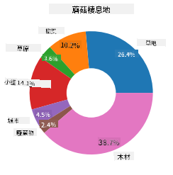
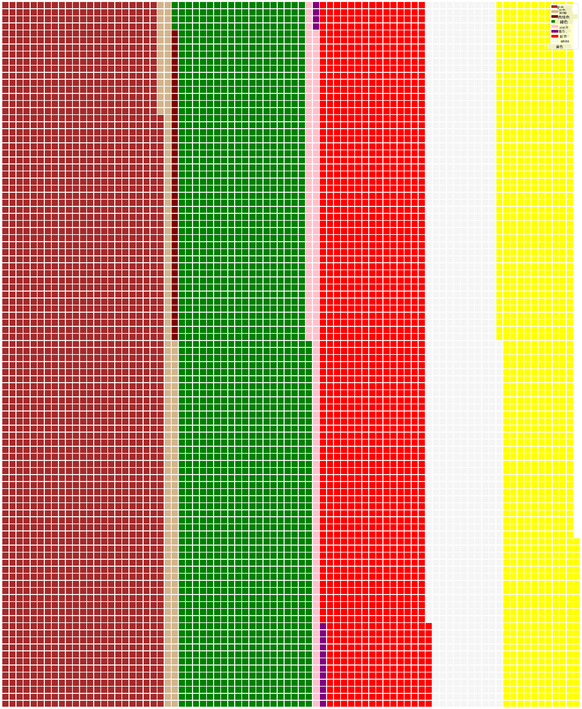

<!--
CO_OP_TRANSLATOR_METADATA:
{
  "original_hash": "cc490897ee2d276870472bcb31602d03",
  "translation_date": "2025-09-04T12:47:42+00:00",
  "source_file": "3-Data-Visualization/11-visualization-proportions/README.md",
  "language_code": "hk"
}
-->
# 視覺化比例

| 繪製的速記筆記](../../sketchnotes/11-Visualizing-Proportions.png)|
|:---:|
|視覺化比例 - _由 [@nitya](https://twitter.com/nitya) 繪製的速記筆記_ |

在這節課中，你將使用一個以自然為主題的數據集來視覺化比例，例如在一個關於蘑菇的數據集中有多少不同類型的真菌。我們將使用 Audubon 提供的數據集來探索這些迷人的真菌，該數據集列出了 Agaricus 和 Lepiota 家族中 23 種有鰓蘑菇的詳細信息。你將嘗試一些有趣的視覺化方式，例如：

- 圓餅圖 🥧
- 甜甜圈圖 🍩
- 華夫餅圖 🧇

> 💡 微軟研究院的一個非常有趣的項目 [Charticulator](https://charticulator.com) 提供了一個免費的拖放界面來進行數據視覺化。在他們的一個教程中也使用了這個蘑菇數據集！因此，你可以同時探索數據並學習這個庫：[Charticulator 教程](https://charticulator.com/tutorials/tutorial4.html)。

## [課後測驗](https://ff-quizzes.netlify.app/en/ds/)

## 認識你的蘑菇 🍄

蘑菇非常有趣。讓我們導入一個數據集來研究它們：

```python
import pandas as pd
import matplotlib.pyplot as plt
mushrooms = pd.read_csv('../../data/mushrooms.csv')
mushrooms.head()
```
一個表格被打印出來，包含一些很棒的分析數據：

| 類別       | 帽型       | 帽表面       | 帽顏色       | 是否有瘀傷 | 氣味       | 鰓附著方式       | 鰓間距       | 鰓大小       | 鰓顏色       | 柄型       | 柄根       | 環上方柄表面       | 環下方柄表面       | 環上方柄顏色       | 環下方柄顏色       | 幔型       | 幔顏色       | 環數量       | 環類型       | 孢子印顏色       | 群體       | 棲息地       |
| --------- | --------- | ----------- | --------- | ------- | ------- | --------------- | ------------ | --------- | ---------- | ----------- | ---------- | ------------------------ | ------------------------ | ---------------------- | ---------------------- | --------- | ---------- | ----------- | --------- | ----------------- | ---------- | ------- |
| 有毒       | 凸形       | 光滑         | 棕色         | 有瘀傷   | 刺鼻       | 自由             | 緊密         | 狹窄         | 黑色         | 擴大         | 等長         | 光滑                   | 光滑                   | 白色                  | 白色                  | 部分       | 白色       | 一個         | 垂飾       | 黑色             | 分散       | 城市       |
| 可食用     | 凸形       | 光滑         | 黃色         | 有瘀傷   | 杏仁味     | 自由             | 緊密         | 寬           | 黑色         | 擴大         | 棒狀         | 光滑                   | 光滑                   | 白色                  | 白色                  | 部分       | 白色       | 一個         | 垂飾       | 棕色             | 多數       | 草地       |
| 可食用     | 鐘形       | 光滑         | 白色         | 有瘀傷   | 茴香味     | 自由             | 緊密         | 寬           | 棕色         | 擴大         | 棒狀         | 光滑                   | 光滑                   | 白色                  | 白色                  | 部分       | 白色       | 一個         | 垂飾       | 棕色             | 多數       | 草地       |
| 有毒       | 凸形       | 鱗片狀       | 白色         | 有瘀傷   | 刺鼻       | 自由             | 緊密         | 狹窄         | 棕色         | 擴大         | 等長         | 光滑                   | 光滑                   | 白色                  | 白色                  | 部分       | 白色       | 一個         | 垂飾       | 黑色             | 分散       | 城市       |

你會立刻注意到所有數據都是文本格式。你需要將這些數據轉換為可以用於圖表的格式。事實上，大部分數據是以對象形式表示的：

```python
print(mushrooms.select_dtypes(["object"]).columns)
```

輸出為：

```output
Index(['class', 'cap-shape', 'cap-surface', 'cap-color', 'bruises', 'odor',
       'gill-attachment', 'gill-spacing', 'gill-size', 'gill-color',
       'stalk-shape', 'stalk-root', 'stalk-surface-above-ring',
       'stalk-surface-below-ring', 'stalk-color-above-ring',
       'stalk-color-below-ring', 'veil-type', 'veil-color', 'ring-number',
       'ring-type', 'spore-print-color', 'population', 'habitat'],
      dtype='object')
```
將這些數據中的「類別」列轉換為分類：

```python
cols = mushrooms.select_dtypes(["object"]).columns
mushrooms[cols] = mushrooms[cols].astype('category')
```

```python
edibleclass=mushrooms.groupby(['class']).count()
edibleclass
```

現在，如果打印出蘑菇數據，你可以看到它已根據有毒/可食用類別分組：

|           | 帽型       | 帽表面       | 帽顏色       | 是否有瘀傷 | 氣味       | 鰓附著方式       | 鰓間距       | 鰓大小       | 鰓顏色       | 柄型       | ... | 環下方柄表面       | 環上方柄顏色       | 環下方柄顏色       | 幔型       | 幔顏色       | 環數量       | 環類型       | 孢子印顏色       | 群體       | 棲息地       |
| --------- | --------- | ----------- | --------- | ------- | ------- | --------------- | ------------ | --------- | ---------- | ----------- | --- | ------------------------ | ---------------------- | ---------------------- | --------- | ---------- | ----------- | --------- | ----------------- | ---------- | ------- |
| 類別       |           |             |           |         |         |                 |              |           |            |             |     |                          |                        |                        |           |            |             |           |                   |            |         |
| 可食用     | 4208      | 4208        | 4208      | 4208    | 4208    | 4208            | 4208         | 4208      | 4208       | 4208        | ... | 4208                     | 4208                   | 4208                   | 4208      | 4208       | 4208        | 4208      | 4208              | 4208       | 4208    |
| 有毒       | 3916      | 3916        | 3916      | 3916    | 3916    | 3916            | 3916         | 3916      | 3916       | 3916        | ... | 3916                     | 3916                   | 3916                   | 3916      | 3916       | 3916        | 3916      | 3916              | 3916       | 3916    |

如果按照此表中呈現的順序來創建類別標籤，你可以製作一個圓餅圖：

## 圓餅圖！

```python
labels=['Edible','Poisonous']
plt.pie(edibleclass['population'],labels=labels,autopct='%.1f %%')
plt.title('Edible?')
plt.show()
```
完成，一個圓餅圖展示了根據這兩類蘑菇的比例數據。在這裡，正確的標籤順序非常重要，因此請務必確認標籤數組的構建順序！


## 甜甜圈圖！

一個更具視覺吸引力的圓餅圖是甜甜圈圖，它是一個中間有洞的圓餅圖。讓我們用這種方法來查看數據。

看看蘑菇生長的各種棲息地：

```python
habitat=mushrooms.groupby(['habitat']).count()
habitat
```
在這裡，你將數據按棲息地分組。共有 7 個棲息地，因此使用它們作為甜甜圈圖的標籤：

```python
labels=['Grasses','Leaves','Meadows','Paths','Urban','Waste','Wood']

plt.pie(habitat['class'], labels=labels,
        autopct='%1.1f%%', pctdistance=0.85)
  
center_circle = plt.Circle((0, 0), 0.40, fc='white')
fig = plt.gcf()

fig.gca().add_artist(center_circle)
  
plt.title('Mushroom Habitats')
  
plt.show()
```



這段代碼繪製了一個圖表和一個中心圓，然後將該中心圓添加到圖表中。通過更改 `0.40` 的值來編輯中心圓的寬度。

甜甜圈圖可以通過多種方式進行調整以更改標籤。特別是標籤可以突出顯示以提高可讀性。更多信息請參閱[文檔](https://matplotlib.org/stable/gallery/pie_and_polar_charts/pie_and_donut_labels.html?highlight=donut)。

現在你知道如何分組數據並將其顯示為圓餅圖或甜甜圈圖，你可以探索其他類型的圖表。試試華夫餅圖，這是一種不同的方式來探索數量。

## 華夫餅圖！

華夫餅圖是一種以 2D 方格陣列視覺化數量的方式。試著用這個數據集來視覺化蘑菇帽顏色的不同數量。為此，你需要安裝一個名為 [PyWaffle](https://pypi.org/project/pywaffle/) 的輔助庫並使用 Matplotlib：

```python
pip install pywaffle
```

選擇數據的一部分進行分組：

```python
capcolor=mushrooms.groupby(['cap-color']).count()
capcolor
```

通過創建標籤並分組數據來製作華夫餅圖：

```python
import pandas as pd
import matplotlib.pyplot as plt
from pywaffle import Waffle
  
data ={'color': ['brown', 'buff', 'cinnamon', 'green', 'pink', 'purple', 'red', 'white', 'yellow'],
    'amount': capcolor['class']
     }
  
df = pd.DataFrame(data)
  
fig = plt.figure(
    FigureClass = Waffle,
    rows = 100,
    values = df.amount,
    labels = list(df.color),
    figsize = (30,30),
    colors=["brown", "tan", "maroon", "green", "pink", "purple", "red", "whitesmoke", "yellow"],
)
```

使用華夫餅圖，你可以清楚地看到這個蘑菇數據集中帽顏色的比例。有趣的是，有許多綠色帽子的蘑菇！



✅ PyWaffle 支持在圖表中使用任何 [Font Awesome](https://fontawesome.com/) 提供的圖標。嘗試進行一些實驗，用圖標代替方格來創建更有趣的華夫餅圖。

在這節課中，你學到了三種視覺化比例的方法。首先，你需要將數據分組到分類中，然後決定哪種方式最適合展示數據——圓餅圖、甜甜圈圖或華夫餅圖。這些方法都很有趣，能讓用戶快速了解數據集。

## 🚀 挑戰

嘗試在 [Charticulator](https://charticulator.com) 中重現這些有趣的圖表。
## [課後測驗](https://purple-hill-04aebfb03.1.azurestaticapps.net/quiz/21)

## 回顧與自學

有時候，什麼時候使用圓餅圖、甜甜圈圖或華夫餅圖並不明顯。以下是一些相關文章：

https://www.beautiful.ai/blog/battle-of-the-charts-pie-chart-vs-donut-chart

https://medium.com/@hypsypops/pie-chart-vs-donut-chart-showdown-in-the-ring-5d24fd86a9ce

https://www.mit.edu/~mbarker/formula1/f1help/11-ch-c6.htm

https://medium.datadriveninvestor.com/data-visualization-done-the-right-way-with-tableau-waffle-chart-fdf2a19be402

進行一些研究以了解更多關於這個選擇的資訊。

## 作業

[在 Excel 中嘗試](assignment.md)

---

**免責聲明**：  
此文件已使用人工智能翻譯服務 [Co-op Translator](https://github.com/Azure/co-op-translator) 進行翻譯。我們致力於提供準確的翻譯，但請注意，自動翻譯可能包含錯誤或不準確之處。應以原始語言的文件作為權威來源。對於關鍵資訊，建議尋求專業的人類翻譯。我們對因使用此翻譯而引起的任何誤解或誤釋不承擔責任。