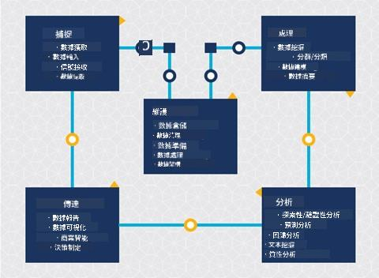
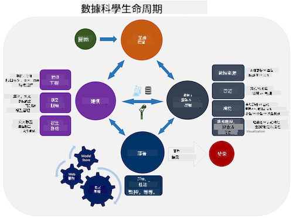
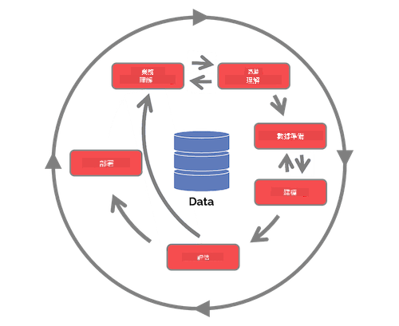

<!--
CO_OP_TRANSLATOR_METADATA:
{
  "original_hash": "c368f8f2506fe56bca0f7be05c4eb71d",
  "translation_date": "2025-08-25T17:42:23+00:00",
  "source_file": "4-Data-Science-Lifecycle/14-Introduction/README.md",
  "language_code": "hk"
}
-->
# 數據科學生命週期簡介

| 繪製的手繪筆記 ](../../sketchnotes/14-DataScience-Lifecycle.png)|
|:---:|
| 數據科學生命週期簡介 - _手繪筆記由 [@nitya](https://twitter.com/nitya) 繪製_ |

## [課前測驗](https://red-water-0103e7a0f.azurestaticapps.net/quiz/26)

到目前為止，你可能已經意識到數據科學是一個過程。這個過程可以分為五個階段：

- 捕獲
- 處理
- 分析
- 溝通
- 維護

本課程將重點介紹生命週期中的三個部分：捕獲、處理和維護。

  
> 圖片來源：[Berkeley School of Information](https://ischoolonline.berkeley.edu/data-science/what-is-data-science/)

## 捕獲

生命週期的第一階段非常重要，因為接下來的階段都依賴於它。這實際上是兩個階段的結合：獲取數據以及定義需要解決的目的和問題。  
定義項目的目標需要對問題或問題有更深入的背景了解。首先，我們需要識別並獲取那些需要解決問題的人。他們可能是企業的利益相關者或項目的贊助者，他們可以幫助確定誰或什麼將從這個項目中受益，以及他們需要什麼和為什麼需要它。一個定義良好的目標應該是可測量和量化的，以定義可接受的結果。

數據科學家可能會問的問題：
- 這個問題以前是否被解決過？發現了什麼？
- 所有參與者是否都理解目的和目標？
- 是否存在模糊性？如何減少它？
- 有哪些限制？
- 最終結果可能會是什麼樣子？
- 有多少資源（時間、人員、計算能力）可用？

接下來是識別、收集，然後探索為實現這些定義目標所需的數據。在這個獲取階段，數據科學家還必須評估數據的數量和質量。這需要一些數據探索，以確認所獲取的數據是否能支持達到期望的結果。

數據科學家可能會問的數據相關問題：
- 我已經擁有哪些數據？
- 誰擁有這些數據？
- 有哪些隱私問題？
- 我是否擁有足夠的數據來解決這個問題？
- 這些數據的質量是否適合這個問題？
- 如果通過這些數據發現了額外的信息，我們是否應該考慮更改或重新定義目標？

## 處理

生命週期的處理階段專注於發現數據中的模式以及建模。在處理階段使用的一些技術需要統計方法來揭示模式。對於人類來說，處理大型數據集通常是一項繁瑣的任務，因此需要依賴計算機來加速這一過程。這一階段也是數據科學與機器學習交叉的地方。正如你在第一課中學到的，機器學習是構建模型以理解數據的過程。模型是數據中變量之間關係的表示，有助於預測結果。

本階段常用的技術在《機器學習初學者》課程中有介紹。點擊以下鏈接了解更多：

- [分類](https://github.com/microsoft/ML-For-Beginners/tree/main/4-Classification)：將數據組織成類別以提高使用效率。
- [聚類](https://github.com/microsoft/ML-For-Beginners/tree/main/5-Clustering)：將數據分組為相似的群組。
- [回歸](https://github.com/microsoft/ML-For-Beginners/tree/main/2-Regression)：確定變量之間的關係以預測或預測值。

## 維護

在生命週期的圖示中，你可能注意到維護位於捕獲和處理之間。維護是一個持續的過程，涉及在項目過程中管理、存儲和保護數據，並且應該在整個項目中加以考慮。

### 數據存儲
數據存儲的方式和位置可能會影響存儲成本以及數據訪問的速度。這些決策通常不僅由數據科學家單獨做出，但他們可能需要根據數據的存儲方式來決定如何處理數據。

以下是現代數據存儲系統的一些方面，可能會影響這些選擇：

**本地 vs 非本地 vs 公有或私有雲**

本地指的是在自己的設備上托管和管理數據，例如擁有一台存儲數據的服務器，而非本地則依賴於你不擁有的設備，例如數據中心。公有雲是一種流行的數據存儲選擇，無需了解數據的具體存儲方式或位置，其中“公有”指的是所有使用雲服務的人共享統一的基礎設施。一些組織有嚴格的安全政策，要求完全訪問存儲數據的設備，因此會依賴於提供自有雲服務的私有雲。你將在[後續課程](https://github.com/microsoft/Data-Science-For-Beginners/tree/main/5-Data-Science-In-Cloud)中學到更多關於雲端數據的內容。

**冷數據 vs 熱數據**

在訓練模型時，你可能需要更多的訓練數據。如果你對模型感到滿意，仍然會有更多數據到來以支持模型的運行。無論如何，隨著數據的積累，存儲和訪問數據的成本將會增加。將很少使用的數據（稱為冷數據）與經常訪問的數據（稱為熱數據）分開存儲，可能是一種更便宜的存儲選擇，無論是通過硬件還是軟件服務。如果需要訪問冷數據，可能會比熱數據花費更長的時間來檢索。

### 數據管理
在處理數據時，你可能會發現需要使用[數據準備](https://github.com/microsoft/Data-Science-For-Beginners/tree/main/2-Working-With-Data/08-data-preparation)課程中介紹的一些技術來清理數據，以構建準確的模型。當新數據到來時，也需要應用相同的技術來保持質量的一致性。一些項目會使用自動化工具來進行清理、聚合和壓縮，然後將數據移動到最終位置。Azure Data Factory 就是一個這樣的工具。

### 數據安全
數據安全的主要目標之一是確保數據的收集和使用處於可控範圍內。保持數據安全包括限制只有需要的人才能訪問數據，遵守當地法律和法規，以及維持道德標準，這些內容在[倫理課程](https://github.com/microsoft/Data-Science-For-Beginners/tree/main/1-Introduction/02-ethics)中有介紹。

以下是團隊可能採取的一些安全措施：
- 確保所有數據都已加密
- 向客戶提供有關其數據使用方式的信息
- 移除已離開項目成員的數據訪問權限
- 僅允許特定項目成員修改數據

## 🚀 挑戰

數據科學生命週期有許多不同的版本，每個步驟可能有不同的名稱和階段數量，但都包含本課程中提到的相同過程。

探索 [團隊數據科學過程生命週期](https://docs.microsoft.com/en-us/azure/architecture/data-science-process/lifecycle) 和 [跨行業數據挖掘標準過程](https://www.datascience-pm.com/crisp-dm-2/)。列出兩者的三個相似點和不同點。

|團隊數據科學過程 (TDSP)|跨行業數據挖掘標準過程 (CRISP-DM)|
|--|--|
| |  |
| 圖片來源：[Microsoft](https://docs.microsoft.comazure/architecture/data-science-process/lifecycle) | 圖片來源：[Data Science Process Alliance](https://www.datascience-pm.com/crisp-dm-2/) |

## [課後測驗](https://red-water-0103e7a0f.azurestaticapps.net/quiz/27)

## 回顧與自學

應用數據科學生命週期涉及多個角色和任務，其中一些可能專注於每個階段的特定部分。團隊數據科學過程提供了一些資源，解釋了某人在項目中可能擔任的角色和任務類型。

* [團隊數據科學過程的角色與任務](https://docs.microsoft.com/en-us/azure/architecture/data-science-process/roles-tasks)  
* [執行數據科學任務：探索、建模和部署](https://docs.microsoft.com/en-us/azure/architecture/data-science-process/execute-data-science-tasks)

## 作業

[評估數據集](assignment.md)

**免責聲明**：  
本文件已使用人工智能翻譯服務 [Co-op Translator](https://github.com/Azure/co-op-translator) 進行翻譯。我們致力於提供準確的翻譯，但請注意，自動翻譯可能包含錯誤或不準確之處。應以原文文件作為權威來源。如涉及關鍵資訊，建議尋求專業人工翻譯。我們對因使用此翻譯而引起的任何誤解或誤釋概不負責。