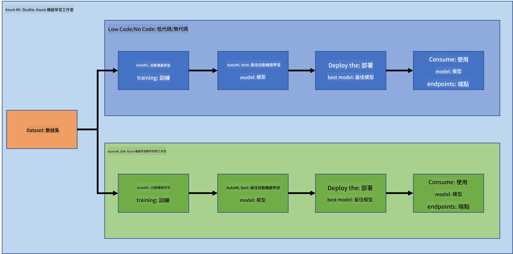

<!--
CO_OP_TRANSLATOR_METADATA:
{
  "original_hash": "8dfe141a0f46f7d253e07f74913c7f44",
  "translation_date": "2025-08-25T17:19:33+00:00",
  "source_file": "5-Data-Science-In-Cloud/README.md",
  "language_code": "hk"
}
-->
# 雲端中的數據科學

> 圖片來源：[Jelleke Vanooteghem](https://unsplash.com/@ilumire) 來自 [Unsplash](https://unsplash.com/s/photos/cloud?orientation=landscape)

當涉及到使用大數據進行數據科學時，雲端可以成為改變遊戲規則的關鍵。在接下來的三節課中，我們將了解什麼是雲端以及為什麼它非常有用。我們還將探索一個心臟衰竭數據集，並建立一個模型來幫助評估某人發生心臟衰竭的可能性。我們將利用雲端的強大功能來訓練、部署和以兩種不同的方式使用模型。一種方式是僅使用用戶界面，以低代碼/無代碼的方式進行；另一種方式是使用 Azure 機器學習軟件開發工具包 (Azure ML SDK)。

### 主題

1. [為什麼在數據科學中使用雲端？](17-Introduction/README.md)
2. [雲端中的數據科學：「低代碼/無代碼」方式](18-Low-Code/README.md)
3. [雲端中的數據科學：「Azure ML SDK」方式](19-Azure/README.md)

### 鳴謝
這些課程由 [Maud Levy](https://twitter.com/maudstweets) 和 [Tiffany Souterre](https://twitter.com/TiffanySouterre) 帶著 ☁️ 和 💕 編寫。

心臟衰竭預測項目的數據來源於 [Kaggle](https://www.kaggle.com/andrewmvd/heart-failure-clinical-data) 上的 [Larxel](https://www.kaggle.com/andrewmvd)。該數據根據 [Attribution 4.0 International (CC BY 4.0)](https://creativecommons.org/licenses/by/4.0/) 授權。

**免責聲明**：  
本文件已使用人工智能翻譯服務 [Co-op Translator](https://github.com/Azure/co-op-translator) 進行翻譯。儘管我們致力於提供準確的翻譯，但請注意，自動翻譯可能包含錯誤或不準確之處。原始語言的文件應被視為權威來源。對於重要信息，建議尋求專業人工翻譯。我們對因使用此翻譯而引起的任何誤解或錯誤解釋概不負責。