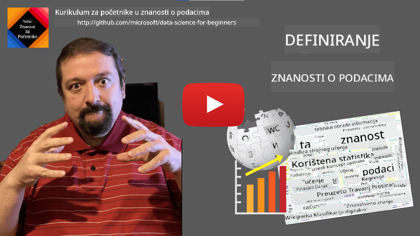
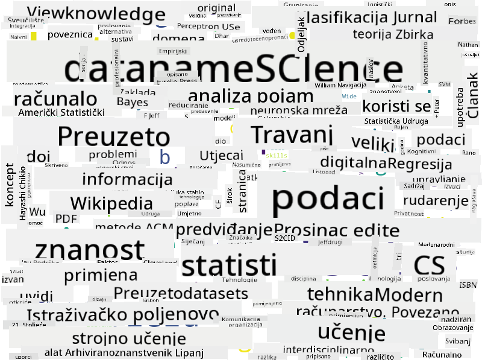

<!--
CO_OP_TRANSLATOR_METADATA:
{
  "original_hash": "a76ab694b1534fa57981311975660bfe",
  "translation_date": "2025-09-06T12:34:43+00:00",
  "source_file": "1-Introduction/01-defining-data-science/README.md",
  "language_code": "hr"
}
-->
# Definiranje podatkovne znanosti

|  ](../../sketchnotes/01-Definitions.png) |
| :-------------------------------------------------------------------------------------------------------: |
|              Definiranje podatkovne znanosti - _Sketchnote autora [@nitya](https://twitter.com/nitya)_    |

---

## [Kviz prije predavanja](https://ff-quizzes.netlify.app/en/ds/quiz/0)

## Što su podaci?
U svakodnevnom životu stalno smo okruženi podacima. Tekst koji sada čitate su podaci. Popis telefonskih brojeva vaših prijatelja u pametnom telefonu su podaci, kao i trenutno vrijeme prikazano na vašem satu. Kao ljudska bića, prirodno baratamo podacima, bilo da brojimo novac koji imamo ili pišemo pisma prijateljima.

Međutim, podaci su postali mnogo značajniji s pojavom računala. Primarna uloga računala je obavljanje izračuna, ali za to im trebaju podaci. Stoga je važno razumjeti kako računala pohranjuju i obrađuju podatke.

S pojavom interneta, uloga računala kao uređaja za rukovanje podacima dodatno je porasla. Ako razmislite, danas računala sve više koristimo za obradu i komunikaciju podataka, a ne samo za izračune. Kada pišemo e-mail prijatelju ili pretražujemo informacije na internetu, zapravo stvaramo, pohranjujemo, prenosimo i manipuliramo podacima.
> Možete li se sjetiti kada ste zadnji put koristili računalo za stvarni izračun?

## Što je podatkovna znanost?

Na [Wikipediji](https://en.wikipedia.org/wiki/Data_science), **podatkovna znanost** definirana je kao *znanstveno područje koje koristi znanstvene metode za izvlačenje znanja i uvida iz strukturiranih i nestrukturiranih podataka te primjenu tog znanja i praktičnih uvida u širokom spektru primjena*.

Ova definicija naglašava sljedeće važne aspekte podatkovne znanosti:

* Glavni cilj podatkovne znanosti je **izvlačenje znanja** iz podataka, drugim riječima - **razumijevanje** podataka, pronalaženje skrivenih odnosa i izgradnja **modela**.
* Podatkovna znanost koristi **znanstvene metode**, poput vjerojatnosti i statistike. Zapravo, kada je pojam *podatkovna znanost* prvi put uveden, neki su tvrdili da je to samo novi, moderni naziv za statistiku. Danas je jasno da je ovo područje mnogo šire.
* Dobiveno znanje treba primijeniti kako bi se proizveli **praktični uvidi**, tj. uvidi koji se mogu primijeniti u stvarnim poslovnim situacijama.
* Trebali bismo biti sposobni raditi s **strukturiranim** i **nestrukturiranim** podacima. Kasnije u tečaju detaljnije ćemo raspraviti različite vrste podataka.
* **Područje primjene** je važan koncept, a podatkovni znanstvenici često trebaju barem osnovno razumijevanje specifičnog područja problema, poput financija, medicine, marketinga itd.

> Još jedan važan aspekt podatkovne znanosti je proučavanje načina na koji se podaci mogu prikupljati, pohranjivati i obrađivati pomoću računala. Dok nam statistika daje matematičke temelje, podatkovna znanost primjenjuje matematičke koncepte za stvarno izvlačenje uvida iz podataka.

Jedan od načina (pripisan [Jimu Grayu](https://en.wikipedia.org/wiki/Jim_Gray_(computer_scientist))) za promatranje podatkovne znanosti je razmatranje kao zasebnog znanstvenog pristupa:
* **Empirijski**, gdje se oslanjamo na opažanja i rezultate eksperimenata
* **Teorijski**, gdje novi koncepti proizlaze iz postojećeg znanstvenog znanja
* **Računalni**, gdje otkrivamo nove principe temeljem računalnih eksperimenata
* **Vođen podacima**, temeljen na otkrivanju odnosa i obrazaca u podacima  

## Ostala povezana područja

Budući da su podaci sveprisutni, i podatkovna znanost je široko područje koje dotiče mnoge druge discipline.

## Vrste podataka

Kao što smo već spomenuli, podaci su svugdje. Samo ih trebamo pravilno zabilježiti! Korisno je razlikovati **strukturirane** i **nestrukturirane** podatke. Prvi su obično predstavljeni u nekom dobro strukturiranom obliku, često kao tablica ili niz tablica, dok su drugi samo zbirka datoteka. Ponekad možemo govoriti i o **polustrukturiranim** podacima, koji imaju neku vrstu strukture koja može značajno varirati.

| Strukturirani                                                              | Polustrukturirani                                                                                 | Nestrukturirani                        |
| -------------------------------------------------------------------------- | ------------------------------------------------------------------------------------------------- | -------------------------------------- |
| Popis ljudi s njihovim telefonskim brojevima                               | Wikipedijine stranice s poveznicama                                                              | Tekst Enciklopedije Britannica         |
| Temperatura u svim sobama zgrade svake minute tijekom posljednjih 20 godina | Zbirka znanstvenih radova u JSON formatu s autorima, datumom objave i sažetkom                   | Dijeljena mapa s korporativnim dokumentima |
| Podaci o dobi i spolu svih ljudi koji ulaze u zgradu                       | Internetske stranice                                                                              | Sirovi videozapis s nadzorne kamere    |

## Gdje pronaći podatke

Postoji mnogo mogućih izvora podataka, i bilo bi nemoguće sve ih nabrojati! Međutim, spomenimo neka tipična mjesta gdje možete pronaći podatke:

* **Strukturirani**
  - **Internet stvari** (IoT), uključujući podatke s različitih senzora, poput senzora temperature ili tlaka, pruža mnogo korisnih podataka. Na primjer, ako je poslovna zgrada opremljena IoT senzorima, možemo automatski kontrolirati grijanje i rasvjetu kako bismo smanjili troškove.
  - **Ankete** koje tražimo od korisnika da ispune nakon kupnje ili posjeta web stranici.
  - **Analiza ponašanja** može nam, primjerice, pomoći razumjeti koliko duboko korisnik istražuje stranicu i koji su tipični razlozi za napuštanje stranice.
* **Nestrukturirani**
  - **Tekstovi** mogu biti bogat izvor uvida, poput ukupnog **sentiment skora** ili izdvajanja ključnih riječi i semantičkog značenja.
  - **Slike** ili **videozapisi**. Videozapis s nadzorne kamere može se koristiti za procjenu prometa na cesti i obavještavanje ljudi o mogućim gužvama.
  - **Dnevnici web poslužitelja** mogu se koristiti za razumijevanje koje stranice naše stranice se najčešće posjećuju i koliko dugo.
* **Polustrukturirani**
  - **Grafovi društvenih mreža** mogu biti izvrsni izvori podataka o osobnostima korisnika i potencijalnoj učinkovitosti širenja informacija.
  - Kada imamo hrpu fotografija s neke zabave, možemo pokušati izvući podatke o **grupnoj dinamici** izgradnjom grafa ljudi koji se međusobno fotografiraju.

Poznavanjem različitih mogućih izvora podataka, možete razmisliti o različitim scenarijima u kojima se tehnike podatkovne znanosti mogu primijeniti za bolje razumijevanje situacije i poboljšanje poslovnih procesa.

## Što možete učiniti s podacima

U podatkovnoj znanosti fokusiramo se na sljedeće korake u radu s podacima:

Naravno, ovisno o stvarnim podacima, neki koraci mogu nedostajati (npr. kada već imamo podatke u bazi podataka ili kada nije potrebno treniranje modela), ili se neki koraci mogu ponavljati nekoliko puta (poput obrade podataka).

## Digitalizacija i digitalna transformacija

U posljednjem desetljeću, mnoge su tvrtke počele shvaćati važnost podataka pri donošenju poslovnih odluka. Kako bi se principi podatkovne znanosti primijenili na vođenje poslovanja, prvo je potrebno prikupiti neke podatke, tj. prevesti poslovne procese u digitalni oblik. Ovo je poznato kao **digitalizacija**. Primjena tehnika podatkovne znanosti na te podatke za donošenje odluka može dovesti do značajnih povećanja produktivnosti (ili čak poslovnog zaokreta), što nazivamo **digitalnom transformacijom**.

Razmotrimo primjer. Pretpostavimo da imamo tečaj podatkovne znanosti (poput ovog) koji se isporučuje online studentima i želimo koristiti podatkovnu znanost za njegovo poboljšanje. Kako to možemo učiniti?

Možemo započeti pitanjem "Što se može digitalizirati?" Najjednostavniji način bio bi mjerenje vremena potrebnog svakom studentu za završetak svakog modula i mjerenje stečenog znanja davanjem testa s višestrukim izborom na kraju svakog modula. Prosječnim vremenom završetka za sve studente možemo otkriti koji moduli uzrokuju najviše poteškoća i raditi na njihovom pojednostavljivanju.
Možete tvrditi da ovaj pristup nije idealan, jer moduli mogu biti različitih duljina. Vjerojatno je pravednije podijeliti vrijeme s duljinom modula (u broju znakova) i usporediti te vrijednosti umjesto toga.
Kada počnemo analizirati rezultate testova s višestrukim izborom, možemo pokušati utvrditi koje koncepte učenici teško razumiju i iskoristiti te informacije za poboljšanje sadržaja. Da bismo to postigli, trebamo osmisliti testove na način da svako pitanje odgovara određenom konceptu ili dijelu znanja.

Ako želimo ići još dublje, možemo usporediti vrijeme potrebno za svaki modul s dobnim kategorijama učenika. Možda ćemo otkriti da za neke dobne skupine treba neprimjereno dugo vremena za završetak modula ili da učenici odustaju prije nego što ga završe. Ovo nam može pomoći da damo preporuke za module prema dobi i smanjimo nezadovoljstvo ljudi zbog pogrešnih očekivanja.

## 🚀 Izazov

U ovom izazovu pokušat ćemo pronaći koncepte relevantne za područje Data Science analizirajući tekstove. Uzet ćemo članak s Wikipedije o Data Science, preuzeti i obraditi tekst, a zatim izraditi oblak riječi poput ovog:

Posjetite [`notebook.ipynb`](../../../../1-Introduction/01-defining-data-science/notebook.ipynb ':ignore') kako biste pregledali kod. Također možete pokrenuti kod i vidjeti kako u stvarnom vremenu provodi sve transformacije podataka.

> Ako ne znate kako pokrenuti kod u Jupyter Notebooku, pogledajte [ovaj članak](https://soshnikov.com/education/how-to-execute-notebooks-from-github/).

## [Kviz nakon predavanja](https://ff-quizzes.netlify.app/en/ds/quiz/1)

## Zadaci

* **Zadatak 1**: Izmijenite gornji kod kako biste pronašli povezane koncepte za područja **Big Data** i **Machine Learning**
* **Zadatak 2**: [Razmislite o scenarijima za Data Science](assignment.md)

## Zahvale

Ovu lekciju s ljubavlju je napisao [Dmitry Soshnikov](http://soshnikov.com)

---

**Odricanje od odgovornosti**:  
Ovaj dokument je preveden pomoću AI usluge za prevođenje [Co-op Translator](https://github.com/Azure/co-op-translator). Iako nastojimo osigurati točnost, imajte na umu da automatski prijevodi mogu sadržavati pogreške ili netočnosti. Izvorni dokument na izvornom jeziku treba smatrati autoritativnim izvorom. Za ključne informacije preporučuje se profesionalni prijevod od strane ljudskog prevoditelja. Ne preuzimamo odgovornost za nesporazume ili pogrešna tumačenja koja mogu proizaći iz korištenja ovog prijevoda.