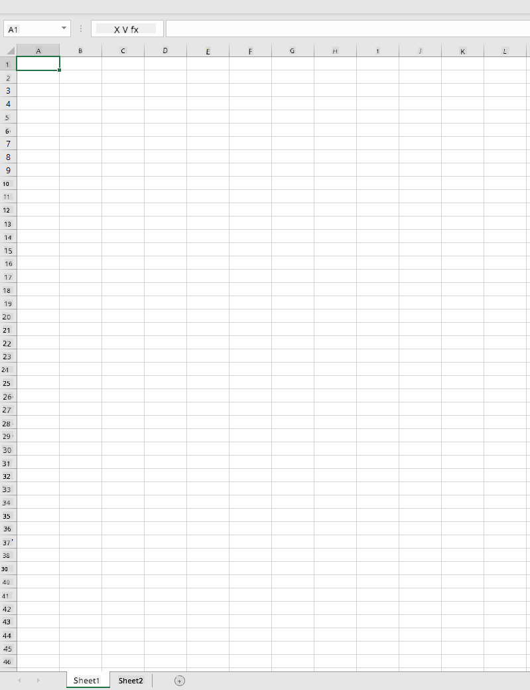
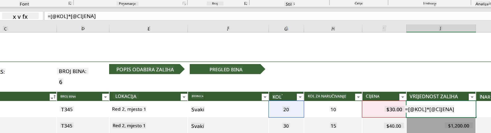
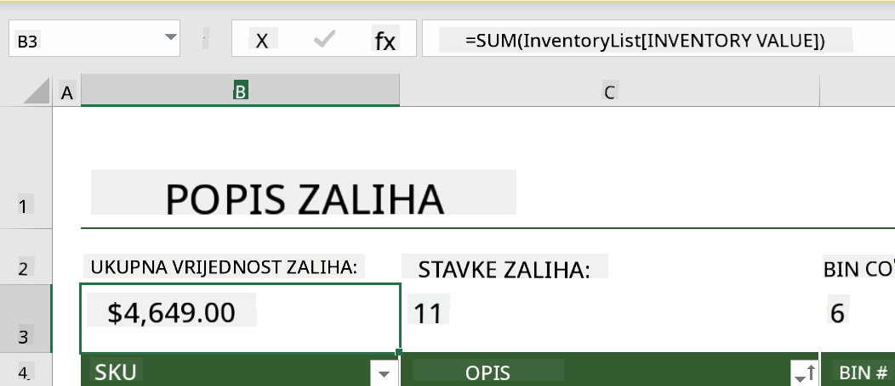
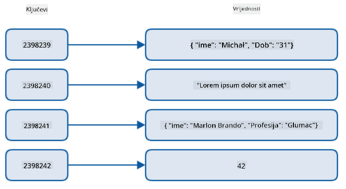
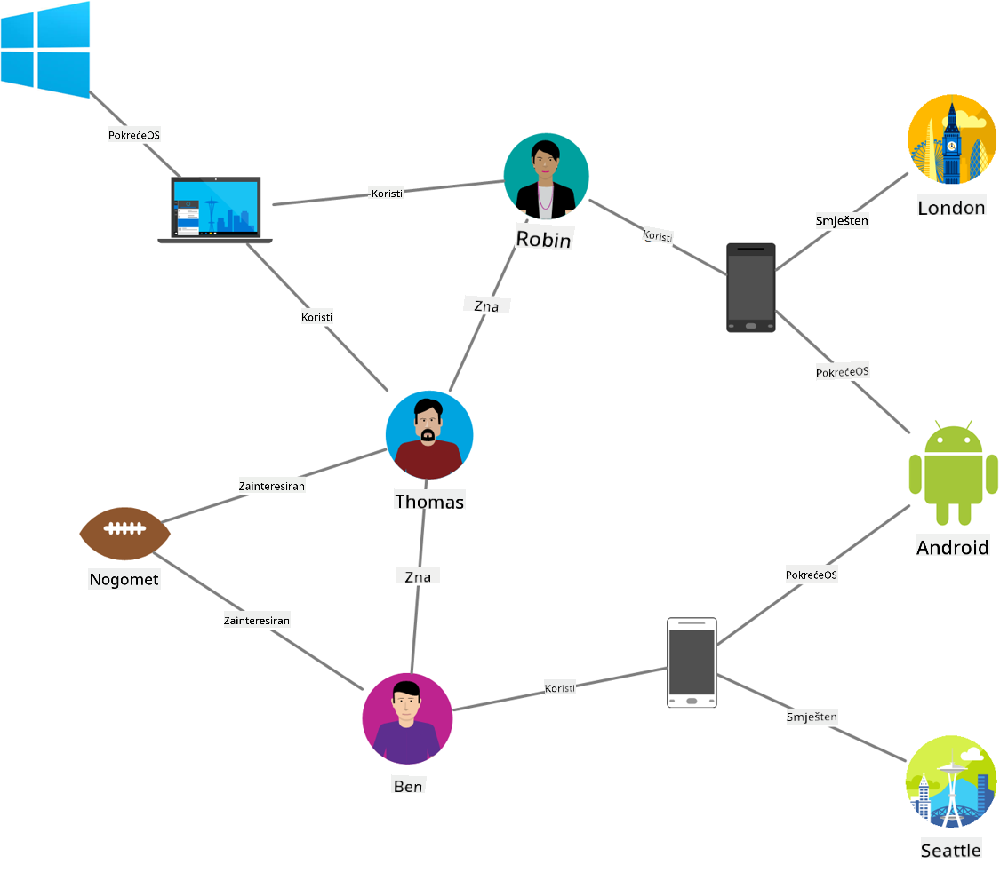
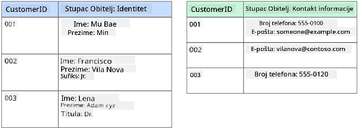
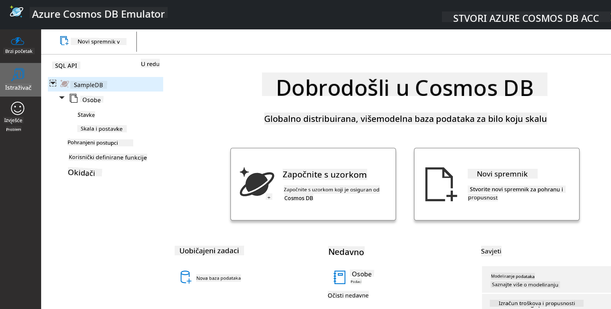
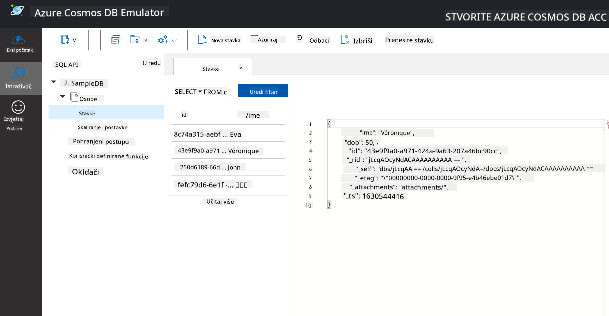
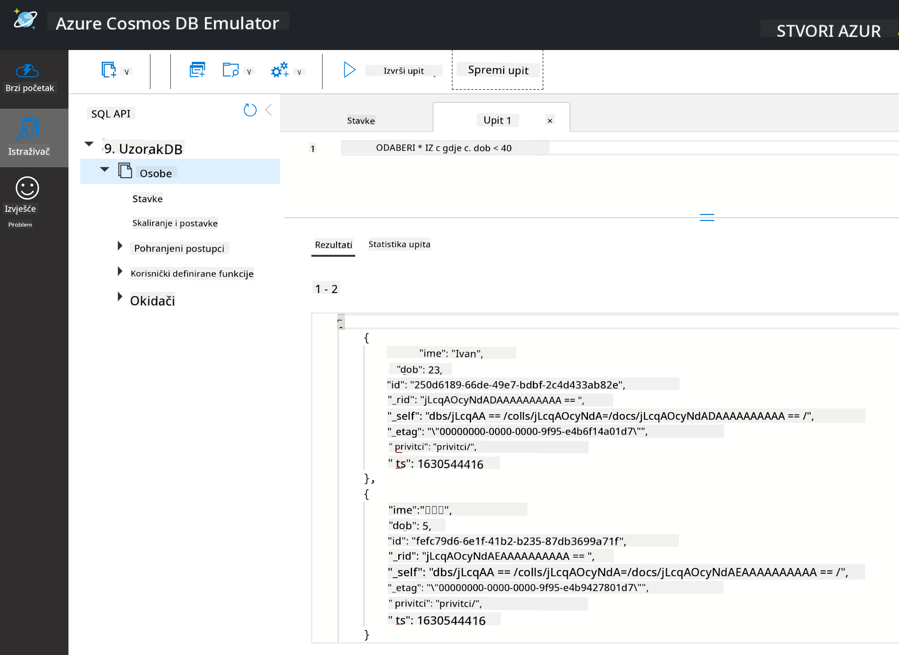

<!--
CO_OP_TRANSLATOR_METADATA:
{
  "original_hash": "32ddfef8121650f2ca2f3416fd283c37",
  "translation_date": "2025-08-30T18:01:13+00:00",
  "source_file": "2-Working-With-Data/06-non-relational/README.md",
  "language_code": "hr"
}
-->
# Rad s podacima: Nerelacijski podaci

| ](../../sketchnotes/06-NoSQL.png)|
|:---:|
|Rad s NoSQL podacima - _Sketchnote by [@nitya](https://twitter.com/nitya)_ |

## [Kviz prije predavanja](https://purple-hill-04aebfb03.1.azurestaticapps.net/quiz/10)

Podaci nisu ograničeni na relacijske baze podataka. Ova lekcija fokusira se na nerelacijske podatke i pokriva osnove proračunskih tablica i NoSQL-a.

## Proračunske tablice

Proračunske tablice popularan su način za pohranu i istraživanje podataka jer zahtijevaju manje rada za postavljanje i početak rada. U ovoj lekciji naučit ćete osnovne komponente proračunske tablice, kao i formule i funkcije. Primjeri će biti ilustrirani pomoću Microsoft Excela, ali većina dijelova i tema imat će slične nazive i korake u usporedbi s drugim softverom za proračunske tablice.



Proračunska tablica je datoteka i bit će dostupna u datotečnom sustavu računala, uređaja ili sustava za pohranu u oblaku. Sam softver može biti temeljen na pregledniku ili aplikacija koja se mora instalirati na računalo ili preuzeti kao aplikacija. U Excelu se te datoteke također definiraju kao **radne knjige**, a ovaj termin će se koristiti u ostatku lekcije.

Radna knjiga sadrži jedan ili više **radnih listova**, gdje su svaki radni list označeni karticama. Unutar radnog lista nalaze se pravokutnici zvani **ćelije**, koje sadrže stvarne podatke. Ćelija je presjek retka i stupca, gdje su stupci označeni abecednim znakovima, a retci numerički. Neke proračunske tablice sadrže zaglavlja u prvih nekoliko redaka kako bi opisale podatke u ćeliji.

S ovim osnovnim elementima Excel radne knjige, koristit ćemo primjer iz [Microsoft Templates](https://templates.office.com/) fokusiran na inventar kako bismo prošli kroz dodatne dijelove proračunske tablice.

### Upravljanje inventarom

Datoteka proračunske tablice nazvana "InventoryExample" je formatirana proračunska tablica stavki unutar inventara koja sadrži tri radna lista, gdje su kartice označene "Inventory List", "Inventory Pick List" i "Bin Lookup". Redak 4 radnog lista Inventory List je zaglavlje koje opisuje vrijednost svake ćelije u stupcu zaglavlja.



Postoje slučajevi kada je vrijednost ćelije ovisna o vrijednostima drugih ćelija kako bi generirala svoju vrijednost. Proračunska tablica Inventory List prati trošak svake stavke u svom inventaru, ali što ako trebamo znati vrijednost svega u inventaru? [**Formule**](https://support.microsoft.com/en-us/office/overview-of-formulas-34519a4e-1e8d-4f4b-84d4-d642c4f63263) izvode radnje na podacima ćelija i koriste se za izračunavanje troška inventara u ovom primjeru. Ova proračunska tablica koristi formulu u stupcu Inventory Value za izračunavanje vrijednosti svake stavke množenjem količine pod zaglavljem QTY i troškova pod ćelijama zaglavlja COST. Dvostrukim klikom ili označavanjem ćelije prikazuje se formula. Primijetit ćete da formule počinju znakom jednakosti, nakon čega slijedi izračun ili operacija.



Možemo koristiti drugu formulu za zbrajanje svih vrijednosti stupca Inventory Value kako bismo dobili ukupnu vrijednost. To bi se moglo izračunati zbrajanjem svake ćelije kako bi se generirao zbroj, ali to može biti zamoran zadatak. Excel ima [**funkcije**](https://support.microsoft.com/en-us/office/sum-function-043e1c7d-7726-4e80-8f32-07b23e057f89), ili unaprijed definirane formule za izvođenje izračuna na vrijednostima ćelija. Funkcije zahtijevaju argumente, koji su potrebne vrijednosti za izvođenje tih izračuna. Kada funkcije zahtijevaju više od jednog argumenta, moraju biti navedene određenim redoslijedom ili funkcija možda neće izračunati ispravnu vrijednost. Ovaj primjer koristi funkciju SUM i koristi vrijednosti stupca Inventory Value kao argument za zbrajanje, generirajući ukupnu vrijednost navedenu u retku 3, stupcu B (također poznatom kao B3).

## NoSQL

NoSQL je krovni pojam za različite načine pohrane nerelacijskih podataka i može se interpretirati kao "ne-SQL", "nerelacijski" ili "ne samo SQL". Ove vrste sustava baza podataka mogu se kategorizirati u 4 vrste.


> Izvor: [Michał Białecki Blog](https://www.michalbialecki.com/2018/03/18/azure-cosmos-db-key-value-database-cloud/)

[Ključ-vrijednost](https://docs.microsoft.com/en-us/azure/architecture/data-guide/big-data/non-relational-data#keyvalue-data-stores) baze podataka povezuju jedinstvene ključeve, koji su jedinstveni identifikatori povezani s vrijednošću. Ovi parovi se pohranjuju pomoću [hash tablice](https://www.hackerearth.com/practice/data-structures/hash-tables/basics-of-hash-tables/tutorial/) s odgovarajućom hash funkcijom.


> Izvor: [Microsoft](https://docs.microsoft.com/en-us/azure/cosmos-db/graph/graph-introduction#graph-database-by-example)

[Graf](https://docs.microsoft.com/en-us/azure/architecture/data-guide/big-data/non-relational-data#graph-data-stores) baze podataka opisuju odnose u podacima i predstavljeni su kao zbirka čvorova i bridova. Čvor predstavlja entitet, nešto što postoji u stvarnom svijetu, poput studenta ili bankovnog izvoda. Bridovi predstavljaju odnos između dva entiteta. Svaki čvor i brid imaju svojstva koja pružaju dodatne informacije o svakom čvoru i bridovima.



[Stupčaste](https://docs.microsoft.com/en-us/azure/architecture/data-guide/big-data/non-relational-data#columnar-data-stores) baze podataka organiziraju podatke u stupce i retke poput relacijske strukture podataka, ali svaki stupac je podijeljen u grupe zvane obitelj stupaca, gdje su svi podaci pod jednim stupcem povezani i mogu se dohvatiti i mijenjati kao jedna jedinica.

### Pohrana dokumenata s Azure Cosmos DB

[Dokument](https://docs.microsoft.com/en-us/azure/architecture/data-guide/big-data/non-relational-data#document-data-stores) baze podataka temelje se na konceptu baze podataka ključ-vrijednost i sastoje se od niza polja i objekata. Ovaj odjeljak istražuje baze podataka dokumenata pomoću emulatora Cosmos DB.

Baza podataka Cosmos DB odgovara definiciji "ne samo SQL", gdje se dokument baza podataka Cosmos DB-a oslanja na SQL za upite podataka. [Prethodna lekcija](../05-relational-databases/README.md) o SQL-u pokriva osnove jezika, a neke od istih upita moći ćemo primijeniti na bazu podataka dokumenata ovdje. Koristit ćemo emulator Cosmos DB-a, koji nam omogućuje stvaranje i istraživanje baze podataka dokumenata lokalno na računalu. Više o emulatoru pročitajte [ovdje](https://docs.microsoft.com/en-us/azure/cosmos-db/local-emulator?tabs=ssl-netstd21).

Dokument je zbirka polja i vrijednosti objekata, gdje polja opisuju što vrijednost objekta predstavlja. Ispod je primjer dokumenta.

```json
{
    "firstname": "Eva",
    "age": 44,
    "id": "8c74a315-aebf-4a16-bb38-2430a9896ce5",
    "_rid": "bHwDAPQz8s0BAAAAAAAAAA==",
    "_self": "dbs/bHwDAA==/colls/bHwDAPQz8s0=/docs/bHwDAPQz8s0BAAAAAAAAAA==/",
    "_etag": "\"00000000-0000-0000-9f95-010a691e01d7\"",
    "_attachments": "attachments/",
    "_ts": 1630544034
}
```

Polja od interesa u ovom dokumentu su: `firstname`, `id` i `age`. Ostala polja s podvlakama generirana su od strane Cosmos DB-a.

#### Istraživanje podataka s emulatorom Cosmos DB

Možete preuzeti i instalirati emulator [za Windows ovdje](https://aka.ms/cosmosdb-emulator). Pogledajte ovu [dokumentaciju](https://docs.microsoft.com/en-us/azure/cosmos-db/local-emulator?tabs=ssl-netstd21#run-on-linux-macos) za opcije kako pokrenuti emulator za macOS i Linux.

Emulator pokreće prozor preglednika, gdje vam prikaz Explorer omogućuje istraživanje dokumenata.



Ako pratite, kliknite na "Start with Sample" kako biste generirali primjer baze podataka nazvane SampleDB. Ako proširite SampleDB klikom na strelicu, pronaći ćete spremnik nazvan `Persons`. Spremnik sadrži zbirku stavki, koje su dokumenti unutar spremnika. Možete istražiti četiri pojedinačna dokumenta pod `Items`.



#### Upiti podataka dokumenata s emulatorom Cosmos DB

Također možemo izvršavati upite na uzorcima podataka klikom na gumb New SQL Query (drugi gumb s lijeve strane).

`SELECT * FROM c` vraća sve dokumente u spremniku. Dodajmo klauzulu WHERE i pronađimo sve mlađe od 40 godina.

`SELECT * FROM c where c.age < 40`



Upit vraća dva dokumenta, primijetite da je vrijednost polja age za svaki dokument manja od 40.

#### JSON i dokumenti

Ako ste upoznati s JavaScript Object Notation (JSON), primijetit ćete da dokumenti izgledaju slično JSON-u. U ovoj se mapi nalazi datoteka `PersonsData.json` s više podataka koje možete prenijeti u spremnik Persons u emulatoru putem gumba `Upload Item`.

U većini slučajeva, API-ji koji vraćaju JSON podatke mogu se izravno prenijeti i pohraniti u baze podataka dokumenata. Ispod je još jedan dokument, koji predstavlja tweetove s Microsoftovog Twitter računa koji su dohvaćeni pomoću Twitter API-ja, a zatim umetnuti u Cosmos DB.

```json
{
    "created_at": "2021-08-31T19:03:01.000Z",
    "id": "1432780985872142341",
    "text": "Blank slate. Like this tweet if you’ve ever painted in Microsoft Paint before. https://t.co/cFeEs8eOPK",
    "_rid": "dhAmAIUsA4oHAAAAAAAAAA==",
    "_self": "dbs/dhAmAA==/colls/dhAmAIUsA4o=/docs/dhAmAIUsA4oHAAAAAAAAAA==/",
    "_etag": "\"00000000-0000-0000-9f84-a0958ad901d7\"",
    "_attachments": "attachments/",
    "_ts": 1630537000
```

Polja od interesa u ovom dokumentu su: `created_at`, `id` i `text`.

## 🚀 Izazov

Postoji datoteka `TwitterData.json` koju možete prenijeti u bazu podataka SampleDB. Preporučuje se da je dodate u zaseban spremnik. To se može učiniti na sljedeći način:

1. Kliknite gumb New Container u gornjem desnom kutu
1. Odaberite postojeću bazu podataka (SampleDB) i stvorite ID spremnika za spremnik
1. Postavite particijski ključ na `/id`
1. Kliknite OK (možete zanemariti ostatak informacija u ovom prikazu jer je ovo mali skup podataka koji se pokreće lokalno na vašem računalu)
1. Otvorite svoj novi spremnik i prenesite datoteku Twitter Data pomoću gumba `Upload Item`

Pokušajte izvršiti nekoliko SELECT upita kako biste pronašli dokumente koji imaju riječ Microsoft u polju text. Savjet: pokušajte koristiti [ključnu riječ LIKE](https://docs.microsoft.com/en-us/azure/cosmos-db/sql/sql-query-keywords#using-like-with-the--wildcard-character).

## [Kviz nakon predavanja](https://purple-hill-04aebfb03.1.azurestaticapps.net/quiz/11)

## Pregled i samostalno učenje

- Postoje dodatni formati i značajke dodane ovoj proračunskoj tablici koje ova lekcija ne pokriva. Microsoft ima [veliku biblioteku dokumentacije i videozapisa](https://support.microsoft.com/excel) o Excelu ako želite naučiti više.

- Ova arhitektonska dokumentacija detaljno opisuje karakteristike različitih vrsta nerelacijskih podataka: [Nerelacijski podaci i NoSQL](https://docs.microsoft.com/en-us/azure/architecture/data-guide/big-data/non-relational-data).

- Cosmos DB je baza podataka u oblaku koja također može pohraniti različite vrste NoSQL-a spomenute u ovoj lekciji. Saznajte više o tim vrstama u ovom [Microsoft Learn modulu o Cosmos DB-u](https://docs.microsoft.com/en-us/learn/paths/work-with-nosql-data-in-azure-cosmos-db/).

## Zadatak

[Soda Profits](assignment.md)

---

**Odricanje od odgovornosti**:  
Ovaj dokument je preveden pomoću AI usluge za prevođenje [Co-op Translator](https://github.com/Azure/co-op-translator). Iako nastojimo osigurati točnost, imajte na umu da automatski prijevodi mogu sadržavati pogreške ili netočnosti. Izvorni dokument na izvornom jeziku treba smatrati mjerodavnim izvorom. Za ključne informacije preporučuje se profesionalni prijevod od strane stručnjaka. Ne preuzimamo odgovornost za nesporazume ili pogrešna tumačenja koja mogu proizaći iz korištenja ovog prijevoda.